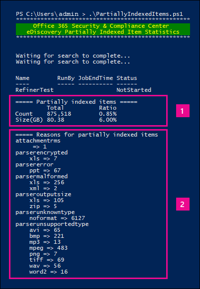

# <a name="investigating-partially-indexed-items-in-office-365-ediscovery"></a>Investigar elementos indizados parcialmente en eDiscovery de Office 365

Una búsqueda de contenido que se ejecuta desde el centro de &amp; seguridad de cumplimiento de Office 365 incluye automáticamente los elementos parcialmente indizados en los resultados de búsqueda estimados al ejecutar una búsqueda. Los elementos indexados parcialmente son elementos de buzones de Exchange y documentos de sitios de SharePoint y OneDrive para la empresa que, por algún motivo, no se han indizado completamente para la búsqueda. La mayoría de los mensajes de correo electrónico y documentos de sitio se indizan correctamente porque entran dentro de los [límites de indización de los mensajes de correo electrónico](limits-for-content-search.md#indexing-limits-for-email-messages). Sin embargo, algunos elementos pueden superar estos límites de indización y se indizarán parcialmente. A continuación se muestran otros motivos por los que los elementos no se pueden indizar para la búsqueda y se devuelven como elementos parcialmente indizados cuando se ejecuta una búsqueda de contenido:
  
- Los mensajes de correo electrónico tienen un archivo adjunto de un tipo de archivo que no se puede indizar; en la mayoría de los casos, el tipo de archivo no se [reconoce o no se admite para](partially-indexed-items-in-content-search.md#file-types-not-indexed-for-search) la indización
    
- Los mensajes de correo electrónico tienen un archivo adjunto sin un controlador válido, como archivos de imagen; Esta es la causa más común de los elementos de correo electrónico parcialmente indizados
    
- Demasiados archivos adjuntos a un mensaje de correo electrónico
    
- Un archivo adjunto a un mensaje de correo electrónico es demasiado grande
    
- Se admite el tipo de archivo para la indización, pero se produjo un error de indización en un archivo específico.
    
Aunque varía, la mayoría de los clientes de la organización de Office 365 tienen menos del 1% de contenido en volumen y menos del 12% del contenido en el tamaño que se indexa parcialmente. El motivo de la diferencia entre el volumen y el tamaño es que los archivos más grandes tienen una probabilidad mayor de contenido que no se puede indizar completamente.
  
## <a name="why-does-the-partially-indexed-item-count-change-for-a-search"></a>¿Por qué cambia el número de elementos parcialmente indizados para una búsqueda?

Después de ejecutar una búsqueda de contenido en el centro de &amp; seguridad y cumplimiento de Office 365, el número total y el tamaño de los elementos parcialmente indizados en las ubicaciones en las que se realizó la búsqueda se muestran en las estadísticas de resultados de búsqueda que se muestran en las estadísticas detalladas de la búsqueda. Nota Estos se denominan *elementos* sin indexar en las estadísticas de búsqueda. Estas son algunas de las cosas que afectarán al número de elementos parcialmente indizados que se devuelven en los resultados de la búsqueda: 
  
- Si un elemento se indiza parcialmente y coincide con la consulta de búsqueda, se incluye tanto en el recuento como en el tamaño de los elementos de resultados de búsqueda y en los elementos parcialmente indizados. Sin embargo, cuando se exportan los resultados de esa misma búsqueda, el elemento solo se incluye con un conjunto de resultados de búsqueda; no se incluye como elemento parcialmente indizado.
    
- Si especifica un intervalo de fechas para una consulta de búsqueda (al incluirla en la consulta de palabras clave o mediante una condición), los elementos parcialmente indizados que no coinciden con el intervalo de fechas no se incluyen en el recuento de elementos parcialmente indizados. Sólo los elementos parcialmente indizados que se encuentran en el intervalo de fechas se incluyen en el recuento de elementos parcialmente indizados.
    
 **Nota:** Los elementos parcialmente indizados ubicados en los sitios de SharePoint y OneDrive *no se* incluyen en la estimación de los elementos parcialmente indizados que se muestran en las estadísticas detalladas de la búsqueda. Sin embargo, los elementos parcialmente indizados se pueden exportar al exportar los resultados de una búsqueda de contenido. Por ejemplo, si solo busca sitios en una búsqueda de contenido, el número estimado de elementos parcialmente indizados será cero. 
  
## <a name="calculating-the-ratio-of-partially-indexed-items-in-your-organization"></a>Cálculo de la proporción de elementos parcialmente indizados en la organización

Para comprender la exposición de la organización a los elementos parcialmente indizados, puede ejecutar una búsqueda de todo el contenido de todos los buzones (mediante una consulta de palabras clave en blanco). En el siguiente ejemplo, hay 56.208 (4.830 MB) de elementos completamente indizados y 470 (316 MB) de elementos parcialmente indizados.
  

  
Puede determinar el porcentaje de elementos parcialmente indizados mediante los siguientes cálculos.
  
 **Para calcular la proporción de elementos parcialmente indizados en la organización:**

`(Total number of partially indexed items/Total number of items) x 100`


`(470/56,208) x 100 = 0.84%`
 
Mediante el uso de los resultados de la búsqueda del ejemplo anterior, el 84% de todos los elementos de los buzones se indiza parcialmente.
  
 **Para calcular el porcentaje del tamaño de los elementos parcialmente indizados de la organización:**

`(Size of all partially indexed items/Size of all items) x 100`

`(316 MB/4830 MB) x 100 = 6.54%`

Por lo tanto, en el ejemplo anterior, 6,54% del tamaño total de los elementos del buzón de correo son de elementos parcialmente indizados. Como se mencionó anteriormente, la mayoría de los clientes de la organización de Office 365 tienen menos del 1% de contenido en volumen y menos del 12% del contenido en el tamaño que se indexa parcialmente.

## <a name="working-with-partially-indexed-items"></a>Trabajar con elementos parcialmente indizados

En los casos en los que necesite examinar elementos parciales para validar que no contienen información relevante, puede [exportar un informe de búsqueda de contenido](export-a-content-search-report.md) que contenga información sobre los elementos parcialmente indizados. Cuando exporte un informe de búsqueda de contenido, asegúrese de elegir una de las opciones de exportación que incluya elementos parcialmente indizados. 
  

  
Cuando se exportan resultados de la búsqueda de contenido o un informe de búsqueda de contenido mediante una de estas opciones, la exportación incluye un informe denominado elementos sin indexar. csv. Este informe incluye la mayor parte de la información que el archivo ResultsLog. csv. sin embargo, el archivo items. csv sin indexar también incluye dos campos relacionados con elementos parcialmente indizados: **etiquetas de error** y **propiedades de error**. Estos campos contienen información sobre el error de indización para cada elemento parcialmente indizado. El uso de la información de estos dos campos puede ayudarle a determinar si el error de indización de un determinado impacto en la investigación. Si es así, puede realizar una búsqueda de contenido dirigido y recuperar y exportar mensajes de correo electrónico específicos y documentos de SharePoint o de OneDrive para poder examinarlos y determinar si son relevantes para la investigación. Para obtener instrucciones paso a paso, consulte [preparar un archivo CSV para una búsqueda de contenido dirigida en Office 365](csv-file-for-an-id-list-content-search.md).
  
 **Nota:** El archivo elementos sin indexar. csv también contiene campos denominados **tipo de error** y **mensaje de error**. Estos son campos heredados que contienen información similar a la información de los campos de **propiedades** de error y **etiquetas de error** , pero con información menos detallada. Puede omitir estos campos heredados sin problemas. 
  
## <a name="errors-related-to-partially-indexed-items"></a>Errores relacionados con elementos parcialmente indizados

Las etiquetas de error constan de dos fragmentos de información, el error y el tipo de archivo. Por ejemplo, en este par de errores/filetype:

```
 parseroutputsize_xls
```

   
 `parseroutputsize`es el error y `xls` es el tipo de archivo del archivo en el que se produjo el error. En casos en los que el tipo de archivo no se reconoció o el tipo de archivo no se aplica al error, verá `noformat` el valor en vez del tipo de archivo. 
  
A continuación se muestra una lista de errores de indización y una descripción de la posible causa del error.
  
|**Etiqueta error**|**Descripción**|
|:-----|:-----|
| `attachmentcount` <br/> |Un mensaje de correo electrónico tenía demasiados datos adjuntos y algunos de estos datos adjuntos no se procesaron.  <br/> |
| `attachmentdepth` <br/> |El analizador de contenido y el analizador de documentos encontraron demasiados niveles de datos adjuntos anidados dentro de otros datos adjuntos. Algunos de estos datos adjuntos no se procesaron.  <br/> |
| `attachmentrms` <br/> |Un archivo adjunto produjo un error al descodificar porque estaba protegido con RMS.  <br/> |
| `attachmentsize` <br/> |Un archivo adjunto a un mensaje de correo electrónico era demasiado grande y no se pudo procesar.  <br/> |
| `indexingtruncated` <br/> |Al escribir el mensaje de correo electrónico procesado en el índice, una de las propiedades indizables es demasiado grande y se ha truncado. Las propiedades truncadas se muestran en el campo propiedades de error.  <br/> |
| `invalidunicode` <br/> |Un mensaje de correo electrónico contenía texto que no se pudo procesar como Unicode válido. La indización para este elemento puede estar incompleta.  <br/> |
| `parserencrypted` <br/> |El contenido de los datos adjuntos o del mensaje de correo electrónico se cifra y Office 365 no pudo descodificar el contenido.  <br/> |
| `parsererror` <br/> |Se ha producido un error desconocido durante el análisis. Esto suele deberse a un error de software o a un bloqueo del servicio.  <br/> |
| `parserinputsize` <br/> |Los datos adjuntos son demasiado grandes para que el analizador los controle y el análisis de los datos adjuntos no se ha realizado o no se ha completado.  <br/> |
| `parsermalformed` <br/> |Un archivo adjunto tenía un formato incorrecto y el analizador no pudo administrarlo. Esto puede dar como resultado antiguos formatos de archivo, archivos creados por software incompatible o virus que pretenden ser algo distinto de lo que se ha solicitado.  <br/> |
| `parseroutputsize` <br/> |El resultado del análisis de datos adjuntos era demasiado grande y tuvo que truncarse.  <br/> |
| `parserunknowntype` <br/> |Los datos adjuntos tenían un tipo de archivo que Office 365 no pudo detectar.  <br/> |
| `parserunsupportedtype` <br/> |Los datos adjuntos tenían un tipo de archivo que detectó Office 365could, pero no se admite el análisis de ese tipo de archivo.  <br/> |
| `propertytoobig` <br/> |El valor de una propiedad de correo electrónico en el almacén de Exchange era demasiado grande para recuperarse y no se pudo procesar el mensaje. Normalmente, esto sólo ocurre con la propiedad Body de un mensaje de correo electrónico.  <br/> |
| `retrieverrms` <br/> |El recuperador de contenido no pudo descodificar un mensaje protegido con RMS.  <br/> |
| `wordbreakertruncated` <br/> |Se identificaron demasiadas palabras en el documento durante la indización. El procesamiento de la propiedad se detuvo al alcanzar el límite y la propiedad se trunca.  <br/> |
   
Los campos de error describen qué campos se ven afectados por el error de procesamiento que aparece en el campo etiquetas de error. Si está buscando una propiedad como `subject` o `participants`, los errores en el cuerpo del mensaje no afectarán a los resultados de la búsqueda. Esto puede ser útil para determinar exactamente qué elementos parcialmente indizados podría necesitar investigar.
  
## <a name="using-a-powershell-script-to-determine-your-organizations-exposure-to-partially-indexed-email-items"></a>Uso de un script de PowerShell para determinar la exposición de la organización a elementos de correo electrónico parcialmente indizados

Los pasos siguientes muestran cómo ejecutar un script de PowerShell que busca todos los elementos de todos los buzones de Exchange y, a continuación, genera un informe sobre la relación de la organización con los elementos de correo electrónico parcialmente indizados (por número y por tamaño) y muestra el número de elementos (y el tipo de archivo) para cada error de indización que se produce. Use las descripciones de las etiquetas de error de la sección anterior para identificar el error de indización.
  
1. Guarde el siguiente texto en un archivo de script de Windows PowerShell mediante un sufijo de nombre de archivo de. ps1; por ejemplo, `PartiallyIndexedItems.ps1`.

```
  write-host "**************************************************"
  write-host "     Office 365 Security &amp; Compliance Center      " -foregroundColor yellow -backgroundcolor darkgreen
  write-host "   eDiscovery Partially Indexed Item Statistics   " -foregroundColor yellow -backgroundcolor darkgreen
  write-host "**************************************************"
  " " 
  # Create a search with Error Tags Refinders enabled
  Remove-ComplianceSearch "RefinerTest" -Confirm:$false -ErrorAction 'SilentlyContinue'
  New-ComplianceSearch -Name "RefinerTest" -ContentMatchQuery "size>0" -RefinerNames ErrorTags -ExchangeLocation ALL
  Start-ComplianceSearch "RefinerTest"
  # Loop while search is in progress
  do{
      Write-host "Waiting for search to complete..."
      Start-Sleep -s 5
      $complianceSearch = Get-ComplianceSearch "RefinerTest"
  }while ($complianceSearch.Status -ne 'Completed')
  $refiners = $complianceSearch.Refiners | ConvertFrom-Json
  $errorTagProperties = $refiners.Entries | Get-Member -MemberType NoteProperty
  $partiallyIndexedRatio = $complianceSearch.UnindexedItems / $complianceSearch.Items
  $partiallyIndexedSizeRatio = $complianceSearch.UnindexedSize / $complianceSearch.Size
  " "
  "===== Partially indexed items ====="
  "         Total          Ratio"
  "Count    {0:N0}{1:P2}" -f $complianceSearch.Items.ToString("N0").PadRight(15, " "), $partiallyIndexedRatio
  "Size(GB) {0:N2}{1:P2}" -f ($complianceSearch.Size / 1GB).ToString("N2").PadRight(15, " "), $partiallyIndexedSizeRatio
  " "
  Write-Host ===== Reasons for partially indexed items =====
  foreach($errorTagProperty in $errorTagProperties)
  {
      $name = $refiners.Entries.($errorTagProperty.Name).Name
      $count = $refiners.Entries.($errorTagProperty.Name).TotalCount
      $frag = $name.Split("{_}")
      $errorTag = $frag[0]
      $fileType = $frag[1]
      if ($errorTag -ne $lastErrorTag)
      {
          $errorTag
      }
      "    " + $fileType + " => " + $count
      $lastErrorTag = $errorTag
  }
  
```
   
2. [Conéctese a PowerShell del &amp; centro de seguridad y cumplimiento de Office 365](https://go.microsoft.com/fwlink/p/?linkid=627084).
    
3. En PowerShell &amp; del centro de seguridad y cumplimiento, vaya a la carpeta en la que guardó el script en el paso 1 y, a continuación, ejecute el script. por ejemplo:

    ```
    .\PartiallyIndexedItems.ps1
    ```
   
Este es un ejemplo del resultado que devuelve el script.
  

  
Tenga en cuenta lo siguiente:
  
1. El número total y el tamaño de los elementos de correo electrónico, y la relación de la organización con los elementos de correo electrónico parcialmente indizados (por número y por tamaño)
    
2. Una lista de etiquetas de error y los tipos de archivo correspondientes en los que se produjo el error.
  
## <a name="see-also"></a>Consulte también

[Elementos parcialmente indizados en la búsqueda de contenido en Office 365](partially-indexed-items-in-content-search.md)
