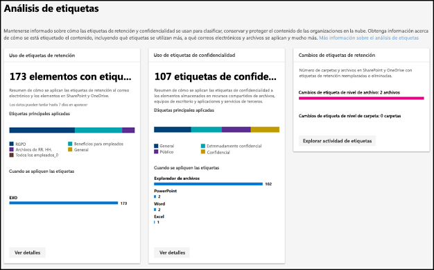
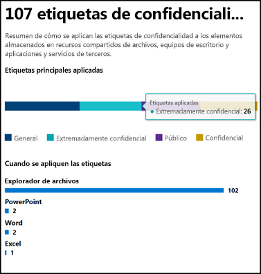
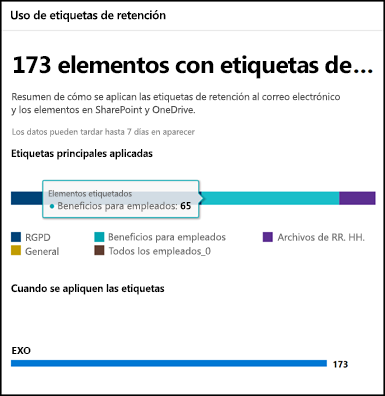
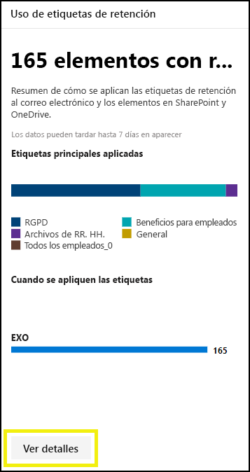
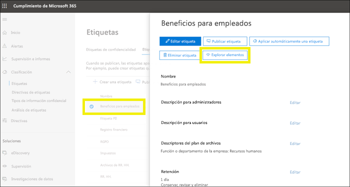
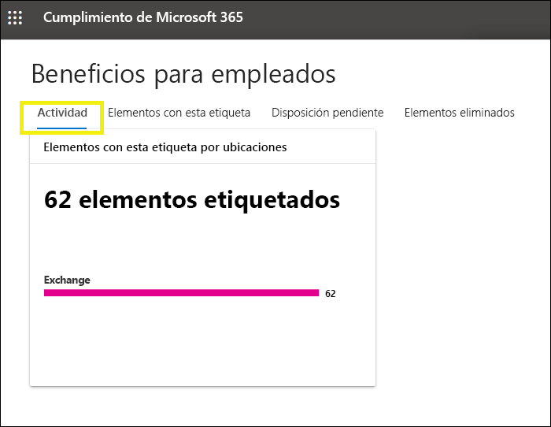
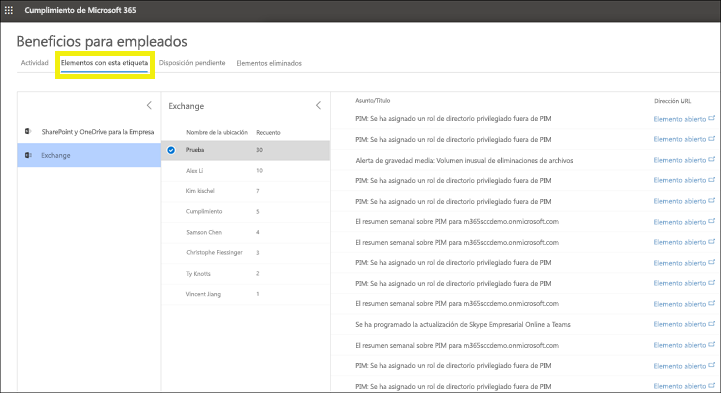

# Ver el uso de etiquetas con el análisis de etiquetas

Después de crear sus etiquetas de retención y de confidencialidad, le interesará ver cómo se utilizan en el espacio empresarial. Con el análisis de etiquetas en el Centro de cumplimiento de Microsoft 365 y el Centro de seguridad de Microsoft 365, puede ver rápidamente las etiquetas que más se usan y dónde se aplican

Por ejemplo, con el análisis de etiquetas, puede ver:

- El número total de etiquetas de retención y etiquetas de confidencialidad aplicadas al contenido.
- Las etiquetas principales y el número de veces que se ha aplicado cada etiqueta.
- Las ubicaciones en las que se aplican las etiquetas y el número de veces en cada ubicación.
- El número de archivos y carpetas cuya etiqueta de retención se ha cambiado o eliminado.

Puede encontrar el análisis de etiquetas en el [Centro de cumplimiento de Microsoft 365](https://compliance.microsoft.com/labelanalytics) o [Centro de seguridad de Microsoft 365](https://security.microsoft.com/labelanalytics) > **Clasificación**  >  **Análisis de etiquetas**.

## Uso de etiquetas de confidencialidad

Los datos sobre el uso de las etiqueta de confidencialidad se extraen de los informes de Azure Information Protection: para obtener más información, vea [Informes centrales de Azure Information Protection](https://docs.microsoft.com/es-ES/azure/information-protection/reports-aip).

Tenga en cuenta que los informes de Azure Information Protection tienen [requisitos previos](https://docs.microsoft.com/es-ES/azure/information-protection/reports-aip#prerequisites-for-azure-information-protection-analytics) que también se aplican a los análisis de etiquetas en las etiquetas de confidencialidad en el Centro de seguridad de Microsoft 365 y el Centro de cumplimiento de Microsoft 365. Por ejemplo, necesita una suscripción de Azure que incluya Log Analytics porque estos informes son el resultado de enviar eventos de auditoría de protección de información de clientes de Azure Information Protection y escáneres a una ubicación centralizada basada en el servicio Log Analytics de Azure.

Para el uso de etiquetas de confidencialidad:

- No hay ninguna latencia en los datos. Se trata de un informe en tiempo real.
- Para ver la cantidad de cada etiqueta principal, seleccione el gráfico de barras y lea la información sobre herramientas que aparece.
- El informe muestra dónde se aplican las etiquetas de confidencialidad por aplicación (mientras que las etiquetas de retención se muestran por ubicación).

## Uso de etiquetas de retención

Este informe muestra una vista rápida de cuáles son las etiquetas principales y dónde se aplican. Para obtener más información sobre cómo se etiqueta contenido en SharePoint y OneDrive, vea [Ver la actividad de etiqueta de documentos](view-label-activity-for-documents.md).

Para el uso de etiquetas de retención:

- Los datos se agregan semanalmente, por lo que pueden tardar hasta siete días en aparecer en el informe.
- Para ver la cantidad de cada etiqueta principal, seleccione el gráfico de barras y lea la información sobre herramientas que aparece.
- El informe muestra dónde se aplican las etiquetas de retención por ubicación (mientras que las etiquetas de confidencialidad se muestran por aplicación).
- Para las etiquetas de retención, este es un resumen de todos los datos del espacio empresarial; no se filtra para un intervalo de fechas específico. Por el contrario, el [Explorador de actividad de etiquetas](view-label-activity-for-documents.md) muestra los datos de solo los últimos 30 días.

## Ver todo el contenido con una etiqueta de retención específica

En el informe de uso de etiquetas de retención, puede explorar rápidamente todo el contenido con esa etiqueta aplicada. (Tenga en cuenta que estamos trabajando actualmente en esta característica, por lo que requerirá menos pasos para ver todo el contenido con la etiqueta).

Primero, elija **Ver detalles** en la parte inferior del informe.

Después elija una etiqueta de retención > **Explorar elementos** en el panel derecho.

Para esa etiqueta, puede elegir la ficha **Actividad** para ver el número de elementos con esa etiqueta según la ubicación.

También puede elegir la ficha **Elementos con esta etiqueta**. Después, puede explorar ubicaciones específicas:

- Para Exchange Online, verá una lista de buzones con el número de elementos con la etiqueta en cada buzón.
- En SharePoint Online y OneDrive para la Empresa, verá una lista de colecciones de sitios y cuentas de OneDrive con el número de elementos etiquetados en cada ubicación.

Al elegir una colección de sitios o un buzón, puede ver una lista de los elementos con esa etiqueta de retención en esa ubicación.

## Permisos

Para ver el análisis de etiquetas, debe tener asignado uno de los roles siguientes de Azure Active Directory:

- Administrador global
- Administrador de cumplimiento
- Administrador de seguridad
- Lector de seguridad

Además, tenga en cuenta que estos informes usan Azure Monitor para almacenar los datos en un área de trabajo de Log Analytics que pertenezca a su organización. Por lo tanto, el usuario debería agregarse como un lector para el espacio de trabajo de supervisión de Azure que contiene los datos. Para obtener más información, vea [Permisos necesarios para los análisis de Azure Information Protection](https://docs.microsoft.com/es-ES/azure/information-protection/reports-aip#permissions-required-for-azure-information-protection-analytics).

