# <a name="overview-of-retention-labels"></a>Introducción a las etiquetas de retención

Es posible que su organización disponga de distintos tipos de contenido que haya que usar de manera diferente para cumplir con las normativas del sector y las directivas internas. Por ejemplo:
  
- Formularios fiscales que sea necesario **conservar** durante un período de tiempo mínimo. 
    
- Materiales de prensa que deban **eliminarse de forma permanente** cuando alcancen una determinada antigüedad. 
    
- Información sobre la competencia que sea necesario **conservar** y, después, **eliminar de forma permanente**. 
    
- Visados de trabajo que tengan que **marcarse como registros** para que no se puedan editar ni eliminar. 
    
En todos estos casos, las etiquetas de retención de Office 365 pueden ayudarle a realizar las acciones adecuadas en el contenido adecuado. Con las etiquetas de retención, puede clasificar los datos de su organización para administrarlos mejor y aplicar reglas de retención basadas en esa clasificación.
  
Con las etiquetas de retención, puede:
  
- **Permitir que los usuarios de la organización apliquen manualmente una etiqueta de retención** a contenido de Outlook en la Web, Outlook 2010 y versiones posteriores, OneDrive para la Empresa, SharePoint Online y Grupos de Office 365. Con frecuencia, los usuarios son los que mejor saben con qué tipo de contenido están trabajando, por lo que pueden clasificarlo correctamente y aplicar la directiva adecuada. 
    
- **Aplicar etiquetas de retención a contenido automáticamente** si coincide con condiciones específicas, como: 
    
  - Tipos específicos de información confidencial.
    
  - Palabras clave específicas que coinciden con una consulta que haya creado.
    
  La capacidad de aplicar etiquetas de retención automáticamente al contenido ofrece las ventajas siguientes:
    
     - No es necesario formar a los usuarios para que conozcan todas las clasificaciones.
    
     - No es necesario depender de los usuarios para clasificar todo el contenido correctamente.
    
   - Los usuarios ya no necesitan conocer las directivas de gobierno de datos; en su lugar, pueden centrarse en su trabajo.

  > [!NOTE]
  > La capacidad de aplicar etiquetas automáticamente requiere una licencia de Office 365 Enterprise E5 para cada usuario que tenga permisos para editar el contenido que se etiqueta automáticamente en un sitio o buzón. Los usuarios que solo tienen acceso de solo lectura no necesitan una licencia.
      
- **Implementar la administración de registros en todo Office 365**, tanto en correos electrónicos como en documentos. Puede usar una etiqueta de retención para clasificar contenido como un registro. Cuando ocurra esto, la etiqueta no se puede cambiar ni quitar, y el contenido no se puede editar ni eliminar. 

- **Aplique una etiqueta de retención predeterminada a una biblioteca de documentos, carpeta o conjunto de documentos** en SharePoint, para que todos los documentos que llegan a esa ubicación hereden la etiqueta de retención predeterminada.  
    
Las etiquetas de retención se crean y administran en la página **Etiquetas** > pestaña **Retención** en el Centro de cumplimiento de Microsoft 365, el Centro de seguridad de Microsoft 365 o el Centro de seguridad y cumplimiento de Office 365.  

## <a name="how-retention-labels-work-with-retention-label-policies"></a>Funcionamiento de las etiquetas de retención con directivas de etiquetas de retención

El proceso para que los usuarios de su organización puedan usar etiquetas de retención para clasificar contenido se divide en dos pasos: primero, se crean las etiquetas de retención y, después, se publican en las ubicaciones seleccionadas. Al publicar etiquetas de retención, se crea una directiva de etiquetas de retención.
  
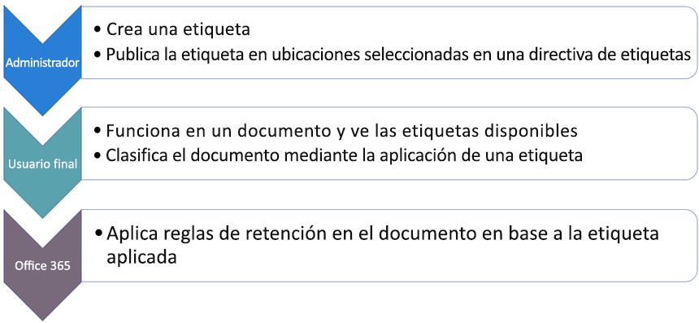
  
Las etiquetas de retención son bloques de creación independientes y reutilizables que se incluyen en una o más directivas de etiquetas de retención. La finalidad principal de la directiva de etiquetas de retención es agrupar un conjunto de etiquetas de retención y especificar las ubicaciones donde quiere que aparezcan esas etiquetas.
  
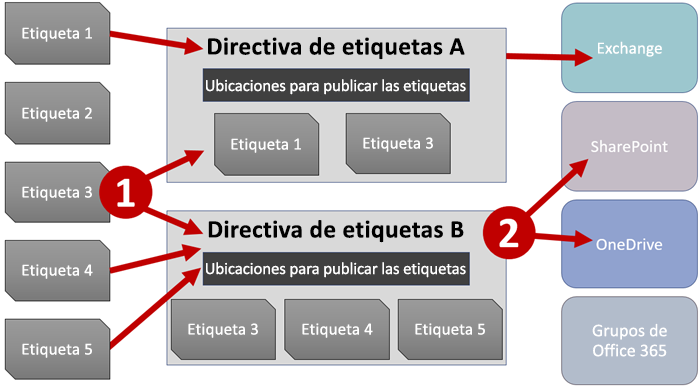
  
1. Al publicar etiquetas de retención, se incluyen en una póliza de etiqueta de retención. Tenga en cuenta que los nombres de las etiquetas de retención son inmutables y no pueden editarse una vez que se han creado.


2. Se puede incluir una única etiqueta de retención en numerosas pólizas de etiqueta de retención.

3. También puede incluirse una sola ubicación en numerosas directivas de etiqueta de retención.    
    
3. Las directivas de etiquetas de retención especifican las ubicaciones donde se publicarán las etiquetas de retención.
    
## <a name="only-one-retention-label-at-a-time"></a>Solo una etiqueta de retención a la vez

Es importante saber que solo se puede asignar una etiqueta de retención al contenido (como un correo electrónico o un documento):
  
- En el caso de las etiquetas de retención asignadas manualmente por los usuarios finales, estos pueden quitar o cambiar la etiqueta de retención asignada.
    
- Si el contenido tiene asignada una etiqueta de aplicación automática, un usuario final puede reemplazarla por una etiqueta de retención asignada manualmente.
    
- Si el contenido tiene una etiqueta de retención asignada manualmente por un usuario final, una etiqueta de aplicación automática no puede reemplazar a la etiqueta de retención asignada de forma manual.
    
- Si hay varias reglas que asignan una etiqueta de aplicación automática y el contenido cumple las condiciones de varias reglas, se asignará la etiqueta de retención de la regla más antigua.
    
Las etiquetas asignadas manualmente se asignan de manera explícita; las etiquetas de aplicación automática se asignan de forma implícita; una etiqueta de retención explícita tiene precedencia sobre una etiqueta implícita. Para obtener más información, vea la sección siguiente [Los principios de retención o qué tiene precedencia](#the-principles-of-retention-or-what-takes-precedence).

Toda la información de esta sección se aplica solo a las etiquetas de retención. Tenga en cuenta que un elemento de contenido puede tener una etiqueta de confidencialidad aplicada, además de una etiqueta de retención.
  
## <a name="how-long-it-takes-for-retention-labels-to-take-effect"></a>Tiempo que tardan las etiquetas de retención en aplicarse

Al publicar o aplicar automáticamente etiquetas de retención, no surten efecto inmediatamente:
  
1. Primero, la directiva de etiquetas tiene que sincronizarse desde el centro de administración con las ubicaciones en la directiva.
    
2. Después, la ubicación puede necesitar tiempo para hacer que las etiquetas de retención publicadas estén disponibles para los usuarios finales o para aplicar automáticamente las etiquetas en el contenido. El tiempo que se tarda depende de la ubicación y el tipo de etiqueta de retención.
    
### <a name="published-retention-labels"></a>Etiquetas de retención publicadas

Si publica etiquetas de retención en SharePoint o OneDrive, puede que tarden un día en mostrarse a los usuarios finales. Además, si publica etiquetas de retención en Exchange, pueden tardar hasta siete días en mostrarse a los usuarios finales y, además, el buzón necesita contener como mínimo 10 MB de datos.
  
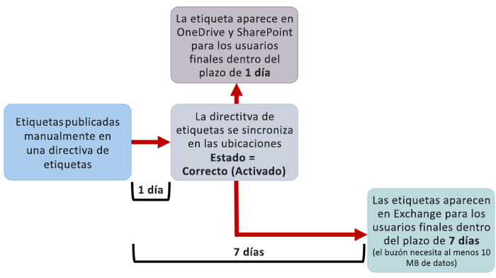
  
### <a name="auto-apply-retention-labels"></a>Aplicar automáticamente etiquetas de retención

Si aplica automáticamente etiquetas de retención a contenido que coincida con condiciones específicas, estas pueden tardar hasta siete días en aplicarse a todo el contenido existente que coincida con las condiciones. Pero tenga en cuenta que, una vez que se implementan las etiquetas de retención, se aplican al nuevo contenido rápidamente, normalmente en 15 minutos o menos.
  
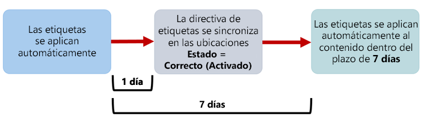
  
### <a name="how-to-check-on-the-status-of-retention-labels-published-to-exchange"></a>Cómo comprobar el estado de las etiquetas de retención publicadas en Exchange

En Exchange Online, las etiquetas de retención se publican para los usuarios finales mediante un proceso que se ejecuta cada siete días. Con PowerShell, puede ver cuándo se ha ejecutado este proceso por última vez y, por tanto, determinar cuándo volverá a ejecutarse.
  
1. [Conexión a PowerShell de Exchange Online](https://go.microsoft.com/fwlink/?linkid=799773).
    
2. Ejecute estos comandos.
    
  ```
  $logProps = Export-MailboxDiagnosticLogs <user> -ExtendedProperties
  ```

  ```
  $xmlprops = [xml]($logProps.MailboxLog)
  ```

  ```
  $xmlprops.Properties.MailboxTable.Property | ? {$_.Name -like "ELC*"}
  ```

En los resultados, la propiedad `ELCLastSuccessTimeStamp` (UTC) muestra cuándo fue la última vez que el sistema procesó el buzón. Si esto no ha ocurrido desde el momento en que se creó la directiva, las etiquetas no van a aparecer. Para forzar el procesamiento, ejecute `Start-ManagedFolderAssistant -Identity <user>`.
    
Si las etiquetas no aparecen en Outlook en la Web y cree que tendrían que aparecer, asegúrese de vaciar la caché del explorador (CTRL+F5).
    
## <a name="retention-label-policies-and-locations"></a>Ubicaciones y directivas de etiquetas de retención

En función de la finalidad de las etiquetas de retención, pueden publicarse en distintas ubicaciones.
  
|**Si la etiqueta de retención es...**|**La directiva de etiquetas se puede aplicar en…**|
|:-----|:-----|
|Se publica a los usuarios finales  <br/> |Exchange, SharePoint, OneDrive, Grupos de Office 365  <br/> |
|Se aplica automáticamente basándose en tipos de información confidencial  <br/> |Exchange (solo todos los buzones), SharePoint, OneDrive  <br/> |
|Se aplica automáticamente basándose en una consulta  <br/> |Exchange, SharePoint, OneDrive, Grupos de Office 365  <br/> |
   
Tenga en cuenta que, en Exchange, las etiquetas de retención de aplicación automática (tanto para consultas como para tipos de información confidencial) solo se aplican en los nuevos mensajes enviados (datos en tránsito), no en todos los elementos que ya están presentes en el buzón (datos en reposo). Además, las etiquetas de retención de aplicación automática para tipos de información confidencial se aplican a todos los buzones (no se pueden seleccionar buzones específicos).
  
Tenga en cuenta que las carpetas públicas de Exchange y Skype no admiten las etiquetas.
  
## <a name="how-retention-labels-enforce-retention"></a>Forma en que las etiquetas de retención aplican la retención

Las etiquetas de retención pueden aplicar exactamente las mismas acciones de retención que una directiva. Puede usar etiquetas de retención para implementar un plan de contenido sofisticado (o un plan de archivos). Para obtener más información sobre cómo funciona la retención, vea [Información general sobre las directivas de retención](retention-policies.md).
  
Además, una etiqueta de retención tiene dos opciones de retención que solo están disponibles en una etiqueta de retención, pero no están disponibles en una directiva de retención. Con una etiqueta de retención, puede:
  
- Desencadenar una revisión para eliminación al finalizar el período de retención para que los documentos de OneDrive y SharePoint tengan que revisarse antes de ser eliminados. Para obtener más información, vea [Información general sobre revisiones para eliminación](disposition-reviews.md).
    
- Iniciar el período de retención desde el momento en que se etiquete el contenido, en lugar de la antigüedad del contenido o la fecha de la última modificación. Tenga en cuenta que esta opción solo se aplica al contenido de los sitios de SharePoint y las cuentas de OneDrive. Para el correo electrónico de Exchange, el período de retención siempre se basa en la fecha en la que se ha enviado o recibido el mensaje, independientemente de la opción que elija aquí.
    
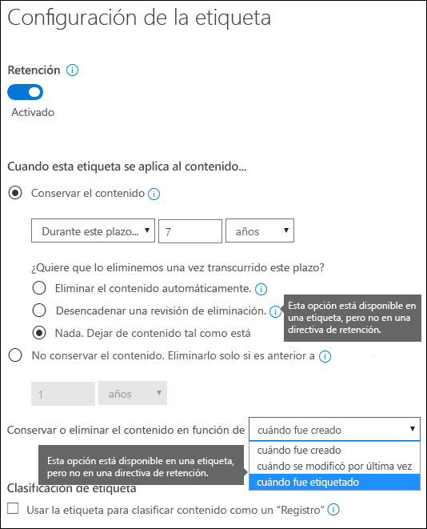
  
## <a name="where-published-retention-labels-can-appear-to-end-users"></a>Ubicaciones donde los usuarios pueden ver las etiquetas de retención publicadas

Si los usuarios finales asignarán la etiqueta de retención al contenido, puede publicarla en:
  
- Outlook en la Web
    
- Outlook 2010 y versiones posteriores
    
- OneDrive
    
- SharePoint
    
- Grupos de Office 365 (tanto en el sitio de grupo como el buzón de grupo de Outlook en la Web)
    
En las secciones siguientes, se explica cómo se mostrarán las etiquetas en diferentes aplicaciones para los usuarios de su organización.
  
### <a name="outlook-on-the-web"></a>Outlook en la Web

Para etiquetar un elemento en Outlook en la Web, haga clic con el botón derecho en el elemento \> **Asignar directiva** \> y seleccione la etiqueta de retención. 
  
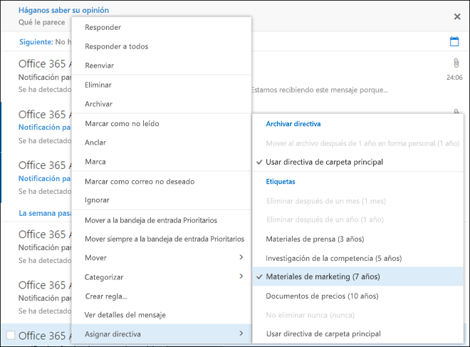
  
Después de aplicarla, puede ver la etiqueta de retención y la acción que realiza en la parte superior del elemento. Si un correo electrónico se clasifica y tiene asociado un período de retención, podrá ver rápidamente cuándo expirará el correo electrónico.
  
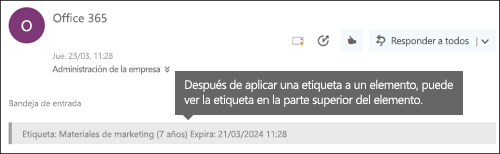
  
También puede aplicar etiquetas de retención a carpetas, en cuyo caso:
  
- Se asignará automáticamente la misma etiqueta de retención en todos los elementos de la carpeta, **excepto** en los elementos donde se haya aplicado de forma explícita una etiqueta de retención. Los elementos etiquetados de forma explícita mantienen la etiqueta de retención existente. Para obtener más información, vea la sección siguiente sobre los principios de retención. 
    
- Si cambia o quita la etiqueta de retención predeterminada de una carpeta, también se cambiará o quitará la etiqueta de retención de todos los elementos de la carpeta, **excepto** en los elementos con etiquetas de retención explícitas. 
    
- Si mueve un elemento con una etiqueta de retención predeterminada de una carpeta a otra carpeta con una etiqueta de retención predeterminada distinta, la nueva etiqueta de retención predeterminada se aplicará en el elemento.
    
- Si mueve un elemento con una etiqueta de retención predeterminada de una carpeta a otra sin una etiqueta de retención predeterminada, se quitará la etiqueta de retención predeterminada anterior.
    
### <a name="outlook-2010-and-later"></a>Outlook 2010 y versiones posteriores

Para etiquetar un elemento en Outlook en la Web, haga clic con el botón derecho en el elemento \> en la **Cinta de opciones** \> **Asignar directiva** \> y seleccione la etiqueta de retención. 
  
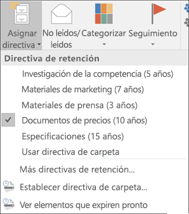
  
Después de aplicar la etiqueta de retención, puede ver dicha etiqueta y la acción que realiza en la parte superior del elemento. Si un correo electrónico tiene una etiqueta de retención aplicada que tiene un período de retención asociado, puede ver de un vistazo cuándo va a expirar el correo electrónico.
  
También puede aplicar etiquetas de retención en carpetas. Este procedimiento funciona de la misma forma en Outlook en la Web que en Outlook 2010 y versiones posteriores (para obtener más información, vea la sección anterior).
  
### <a name="onedrive-and-sharepoint"></a>OneDrive y SharePoint

Para etiquetar un documento (incluidos archivos de OneNote) en OneDrive o SharePoint, seleccione el elemento \> en la esquina superior derecha, haga clic en **Abrir el panel de detalles** \> **Aplicar etiqueta de retención** \> y seleccione la etiqueta de retención. 
  
Tenga en cuenta que también puede aplicar una etiqueta de retención en una carpeta o un conjunto de documentos, así como establecer una etiqueta de retención predeterminada para una biblioteca de documentos (para obtener más información, vea la sección siguiente).
  
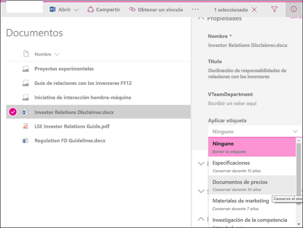
  
Después de aplicar una etiqueta de retención a un elemento, puede verla en el panel de detalles cuando esté seleccionado el elemento.
  
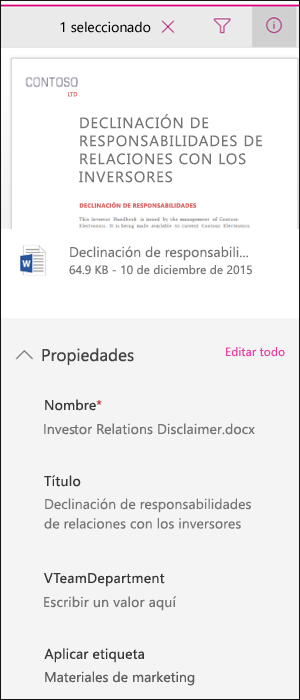
  
También puede crear una vista de la biblioteca que contenga la columna **Etiquetas** o la columna **El elemento es un registro** para ver rápidamente las etiquetas de retención asignadas a todos los elementos y conocer qué elementos son registros. Pero tenga en cuenta que no puede filtrar la vista por la columna **El elemento es un registro**. 
  
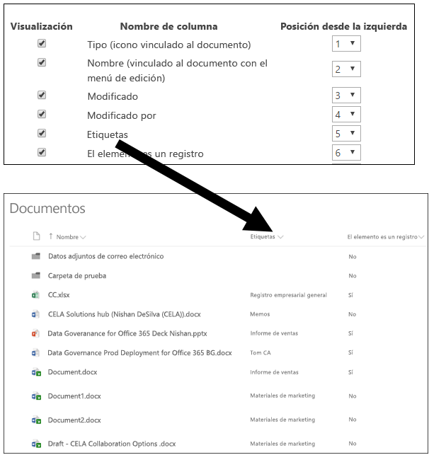
  
### <a name="office-365-groups"></a>Grupos de Office 365

Al publicar etiquetas de retención en un grupo de Office 365, las etiquetas de retención aparecen tanto en el sitio de grupo como en el buzón de grupo de Outlook en la Web. La experiencia de aplicar una etiqueta de retención al contenido es idéntica a la que se muestra anteriormente para el correo electrónico y los documentos.

Para conservar el contenido de un grupo de Office 365, necesita usar la ubicación de los grupos de Office 365. Aunque un grupo de Office 365 tiene un buzón de Exchange, una directiva de retención que incluya la ubicación completa de Exchange no incluye contenido en buzones de grupo de Office 365.

Además, no es posible usar la ubicación de Exchange para incluir o excluir un buzón de grupo específico. Aunque la ubicación de Exchange inicialmente permite la selección de un buzón de grupo, cuando intenta guardar la directiva de retención, recibirá el error que "RemoteGroupMailbox" no es una selección válida para la ubicación de Exchange.
  
## <a name="applying-a-retention-label-automatically-based-on-conditions"></a>Aplicar automáticamente una etiqueta de retención según las condiciones

Una de las características más útiles de las etiquetas de retención es la capacidad de aplicarlas automáticamente a contenido que coincida con determinadas condiciones. En ese caso, los usuarios de su organización no necesitan aplicar las etiquetas de retención: Office 365 lo hace automáticamente.
  
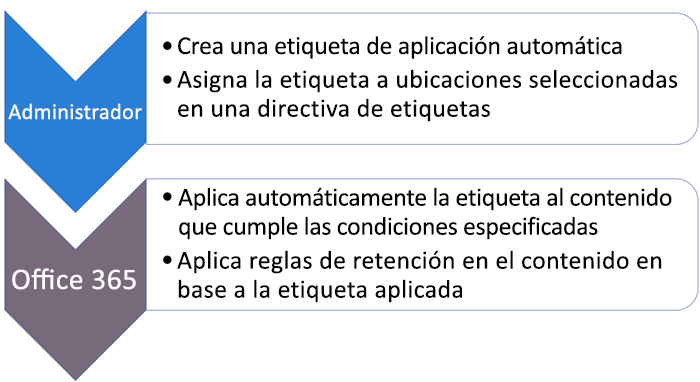
  
Las etiquetas de retención de aplicación automática son realmente útiles porque:
  
- No es necesario formar a los usuarios para que conozcan todas las clasificaciones.
    
- No es necesario depender de los usuarios para clasificar todo el contenido correctamente.
    
- Los usuarios ya no necesitan conocer las directivas de gobierno de datos; en su lugar, pueden centrarse en su trabajo.
    
Puede aplicar automáticamente etiquetas de retención en contenido cuando este coincida con:
  
- Tipos específicos de información confidencial.
    
- Palabras clave específicas que coinciden con una consulta que haya creado.
    
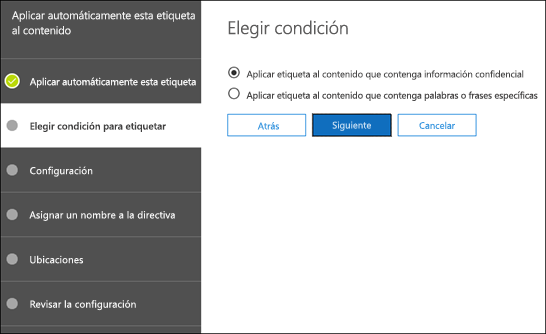
  
Tenga en cuenta que, para usar las etiquetas de retención de aplicación automática, se necesita una suscripción de Office 365 Enterprise E5; además, estas pueden tardar hasta siete días en aplicarse automáticamente a todo el contenido que coincida con las condiciones, como se ha descrito anteriormente.
  
### <a name="auto-apply-retention-labels-to-content-with-specific-types-of-sensitive-information"></a>Aplicar automáticamente etiquetas de retención a contenido con tipos específicos de información confidencial

Al crear etiquetas de retención de aplicación automática para información confidencial, verá la misma lista de plantillas de directiva que al crear una directiva de prevención de pérdida de datos (DLP). Cada plantilla de directiva está preconfigurada para buscar tipos específicos de información confidencial (por ejemplo, la plantilla que se muestra aquí busca números de pasaporte, números del seguro social y números ITIN estadounidenses). Para obtener más información sobre DLP, vea [Información general sobre las directivas de prevención de pérdida de datos](data-loss-prevention-policies.md).
  
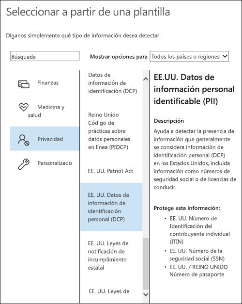
  
Después de seleccionar una plantilla de directiva, puede agregar o quitar los tipos de información confidencial, así como cambiar el recuento de instancias y la precisión de coincidencia. En el ejemplo que se muestra aquí, solo se aplicará automáticamente una etiqueta de retención cuando:
  
- El contenido tenga entre 1 y 9 instancias de alguno de estos tres tipos de información confidencial. Puede eliminar el valor **máximo** para que cambie a **cualquiera**.
    
- El tipo de información confidencial detectado tiene una precisión de coincidencia (o nivel de confianza) mínima de 75. Muchos tipos de información confidencial se definen con varios patrones, donde un patrón con una precisión de coincidencia más alta necesita encontrar más evidencias (como palabras clave, fechas o direcciones), mientras que un patrón con una precisión de coincidencia inferior necesita menos evidencias. En resumen, cuanto menor sea la precisión de coincidencia **mínima**, más fácil será que el contenido coincida con la condición. 
    
Para obtener más información acerca de estas opciones, vea [Ajustar reglas para que sea más o menos fáciles que coincidan](data-loss-prevention-policies.md#tuning-rules-to-make-them-easier-or-harder-to-match).
    
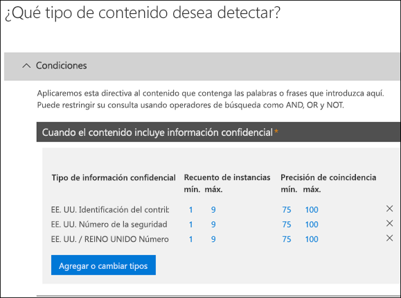
  
### <a name="auto-apply-labels-to-content-with-keywords-or-searchable-properties"></a>Aplicar automáticamente etiquetas a contenido con palabras clave o propiedades que se puedan buscar

Puede aplicar automáticamente etiquetas a contenido que cumpla determinadas condiciones. Las condiciones disponibles ahora permiten aplicar una etiqueta a contenido que coincida con palabras, frases o propiedades que puedan buscarse. Puede restringir la consulta con operadores de búsqueda como Y, O y NO.

Para obtener más información sobre la sintaxis de consultas, vea:

- [Referencia de la sintaxis del lenguaje de consultas de palabras clave (KQL)](https://docs.microsoft.com/es-ES/sharepoint/dev/general-development/keyword-query-language-kql-syntax-reference)

Las etiquetas basadas en consultas usan el índice de búsqueda para identificar el contenido. Para obtener más información sobre las propiedades de búsqueda válidas, vea:

- [Consultas de palabras clave y condiciones de búsqueda para la búsqueda de contenido](keyword-queries-and-search-conditions.md).
- [Información general sobre las propiedades administradas y rastreadas en SharePoint Server](https://docs.microsoft.com/es-ES/SharePoint/technical-reference/crawled-and-managed-properties-overview)

Consultas de ejemplos:

- Exchange
    - asunto:"Finanzas trimestrales"
    - destinatarios: jorgem<!--nolink-->@contoso.com
- SharePoint y OneDrive para la Empresa
    - contenttype:contract
    - sitio:https<!--nolink-->://contoso.sharepoint.com/sites/teams/procurement AND contenttype:contract

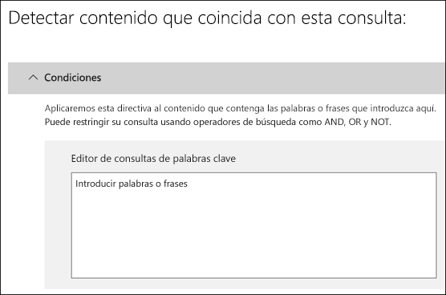

## <a name="applying-a-default-retention-label-to-all-content-in-a-sharepoint-library-folder-or-document-set"></a>Aplicar una etiqueta de retención predeterminada a todo el contenido de una biblioteca, carpeta o conjunto de documentos de SharePoint

Además de permitir que los usuarios apliquen una etiqueta de retención a documentos individuales, también puede aplicar una etiqueta de retención predeterminada a una biblioteca, carpeta o conjunto de documentos de SharePoint para aplicar la etiqueta de retención predeterminada a todos los documentos de esa ubicación.
  
En el caso de una biblioteca de documentos, esto se realiza en la página **Configuración de la biblioteca** de una biblioteca de documentos. Al seleccionar la etiqueta de retención predeterminada, también puede aplicarla a los elementos existentes de la biblioteca. 
  
Por ejemplo, si tiene una etiqueta para materiales de marketing y sabe que una biblioteca de documentos específica solo contendrá ese tipo de contenido, puede hacer que la etiqueta “Materiales de marketing” sea la predeterminada para todos los documentos de esa biblioteca.
  
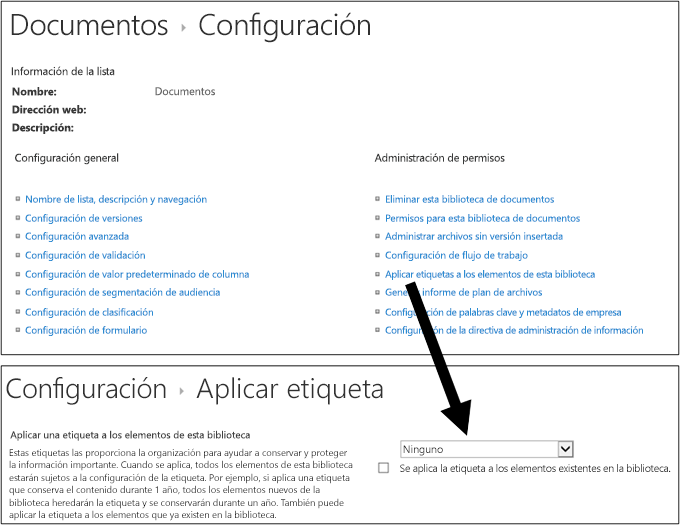
  
Si aplica una etiqueta de retención predeterminada a elementos existentes de una biblioteca, carpeta o conjunto de documentos:
  
- Se aplicará automáticamente la misma etiqueta de retención a todos los elementos de esa biblioteca, carpeta o conjunto de documentos, **excepto** en los elementos donde se haya aplicado de forma explícita una etiqueta de retención. Los elementos etiquetados de forma explícita mantienen la etiqueta existente. Para obtener más información, vea la sección siguiente [Los principios de retención o qué tiene precedencia](#the-principles-of-retention-or-what-takes-precedence).
    
- Si cambia o quita la etiqueta de retención predeterminada de una biblioteca, carpeta o conjunto de documentos, también se cambiará o quitará la etiqueta de retención de todos los elementos de la biblioteca, carpeta o conjunto de documentos, **excepto** de los elementos con etiquetas de retención explícitas. 
    
- Si mueve un elemento con una etiqueta de retención predeterminada de una biblioteca, carpeta o conjunto de documentos a otra biblioteca, carpeta o conjunto de documentos, el elemento mantendrá su etiqueta de retención predeterminada existente, incluso si la nueva ubicación tiene otra etiqueta de retención predeterminada.
    
## <a name="applying-a-retention-label-to-email-by-using-rules"></a>Aplicar una etiqueta de retención a correo electrónico mediante reglas

En Outlook 2010 o versiones posteriores, puede crear reglas para aplicar una etiqueta de retención o directiva de retención.
  
Por ejemplo, puede crear una regla que aplique una etiqueta de retención específica a todos los mensajes enviados a un grupo de distribución específico o desde este.
  
Para crear una regla, haga clic con el botón derecho en un elemento \> **Reglas** \> **Crear regla** \> **Opciones avanzadas** \> **Asistente para reglas** \> **aplicar directiva de retención**.
  
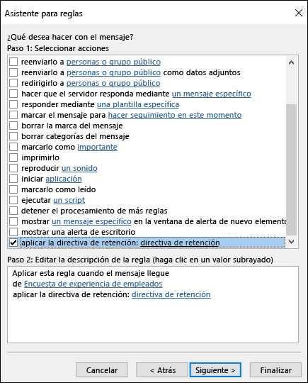
  
## <a name="classifying-content-without-applying-any-actions"></a>Clasificar contenido sin aplicar acciones

Al crear una etiqueta de retención, puede hacerlo sin activar ninguna retención u otras acciones, como se muestra abajo. En este caso, puede usar una etiqueta de retención simplemente como una etiqueta de texto, sin exigir ninguna acción.
  
Por ejemplo, puede crear una etiqueta de retención llamada “Revisar más tarde” sin ninguna acción y, después, aplicar automáticamente esa etiqueta de retención al contenido con tipos de información confidencial o contenido consultado.
  
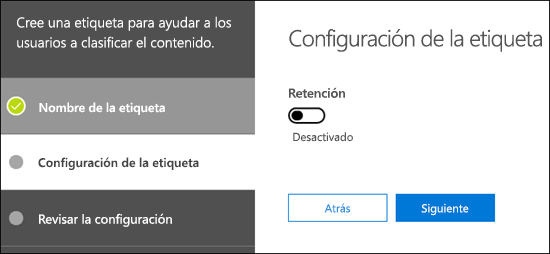
  
## <a name="using-retention-labels-for-records-management"></a>Uso de etiquetas de retención para la administración de registros

De forma general, la administración de registros significa que:
  
- Los usuarios clasifican el contenido importante como registros.
    
- Un registro no se puede modificar ni eliminar.
    
- Por último, los registros se eliminan cuando se cumple la duración indicada.
    
Puede usar etiquetas de retención para implementar una única estrategia de administración de registros coherente en Office 365, mientras que otras características de administración de registros (como el Centro de registros) solo se aplican a contenido de SharePoint. También puede exigir acciones de retención en registros para que se eliminen automáticamente al finalizar su ciclo de vida.
  
Al crear una etiqueta de retención, puede usarla para clasificar el contenido como un registro.
  
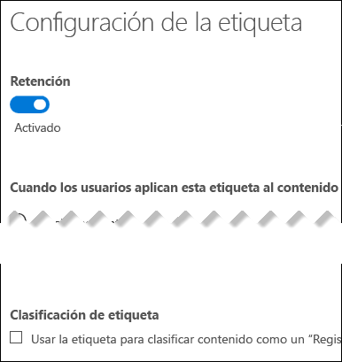
  
Al etiquetar un elemento como un registro, ocurren cuatro cosas:
  
- El elemento no se puede eliminar de forma permanente.
    
- El elemento no se puede editar.
    
- La etiqueta no se puede cambiar.
    
- La etiqueta no se puede quitar.
    
### <a name="who-can-classify-content-as-a-record"></a>Quién puede clasificar contenido como un registro

En el caso de contenido de SharePoint, cualquier usuario del grupo predeterminado Miembros (el nivel de permisos Colaborar) puede aplicar una etiqueta de registro a contenido. Solo el administrador de la colección de sitios puede quitar o cambiar la etiqueta de retención una vez aplicada. Además, las etiquetas de retención que clasifican contenido como registros pueden [aplicarse al contenido automáticamente](#auto-apply-retention-labels).
  
### <a name="records-and-folders"></a>Registros y carpetas

Puede aplicar una etiqueta de retención a una carpeta en Exchange, SharePoint o OneDrive. Si una carpeta se etiqueta como un registro y mueve un elemento dentro de esa carpeta, el elemento se etiquetará como un registro. Al mover el elemento fuera de la carpeta, este mantendrá la etiqueta de registro.
  
### <a name="records-cant-be-deleted"></a>Los registros no se pueden eliminar

Si intenta eliminar un registro en Exchange, el elemento se moverá a la carpeta Elementos recuperables, como se describe en [Funcionamiento de una directiva de retención con contenido local](retention-policies.md#how-a-retention-policy-works-with-content-in-place).
  
Si intenta eliminar un registro en SharePoint, verá un error que indica que el elemento no se ha eliminado y puede comprobar que este permanecerá en la biblioteca.
  
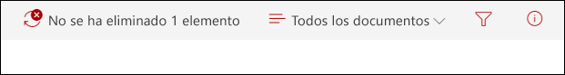
  
Si intenta eliminar un registro en OneDrive, el elemento se moverá a la biblioteca de conservación de documentos, como se describe en [Funcionamiento de una directiva de retención con contenido local](retention-policies.md#how-a-retention-policy-works-with-content-in-place).
  
## <a name="using-a-retention-label-as-a-condition-in-a-dlp-policy"></a>Usar una etiqueta de retención como condición en una directiva DLP

Una etiqueta de retención puede exigir acciones de retención en el contenido. Además, puede usar una etiqueta de retención como una condición en una directiva de prevención de pérdida de datos (DLP) y la directiva DLP puede exigir otras acciones (como restringir el acceso) en contenido que coincida con una etiqueta específica. 
  
Para obtener más información, vea [Usar una etiqueta como una condición en una directiva DLP](data-loss-prevention-policies.md#using-a-label-as-a-condition-in-a-dlp-policy).
  
## <a name="monitor-retention-labels"></a>Supervisar etiquetas de retención.

Después de publicar o aplicar automáticamente las etiquetas de retención, puede comprobar que se hayan aplicado en el contenido según lo previsto. Para supervisar las etiquetas de retención, puede usar el:
  
- **Explorador de actividad de etiquetas**. Con el explorador (que se muestra abajo), puede buscar y visualizar rápidamente la actividad de etiquetas de retención de todo el contenido en SharePoint y OneDrive para la Empresa en los últimos 30 días. Para obtener más información, vea [Ver actividad de etiquetas para documentos](view-label-activity-for-documents.md).

- Página de **Análisis de etiquetas** En el Centro de cumplimiento de Microsoft 365 y el Centro de seguridad de Microsoft 365, puede ver rápidamente las etiquetas principales y dónde se aplican También puede ver todo el contenido con una etiqueta específica. Para obtener más información, vea [Ver el uso de etiquetas con el análisis de etiquetas](label-analytics.md).
    
- **Informes de gobierno de datos**. Con estos informes, puede ver rápidamente actividades y tendencias de etiquetas de retención de todo el contenido en Exchange, SharePoint y OneDrive para la Empresa en los últimos 90 días. Para obtener más información, vea [Ver los informes de gobierno de datos](view-the-data-governance-reports.md).
    
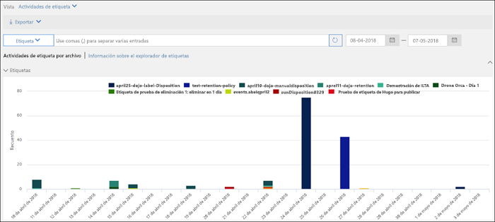
  
## <a name="using-content-search-to-find-all-content-with-a-specific-retention-label-applied-to-it"></a>Usar Búsqueda de contenido para encontrar todo el contenido que tenga aplicada una etiqueta de retención específica

Después de asignar etiquetas de retención a contenido (ya sea por los usuarios o aplicadas automáticamente), puede usar Búsqueda de contenido para encontrar todo el contenido clasificado con una etiqueta de retención específica.
  
Al crear una búsqueda de contenido, seleccione la condición **Etiqueta de cumplimiento** y, después, escriba el nombre completo de la etiqueta o una parte del nombre de la etiqueta y use un comodín. Para obtener más información, vea [Consultas de palabras clave y condiciones de búsqueda para Búsqueda de contenido](keyword-queries-and-search-conditions.md).
  
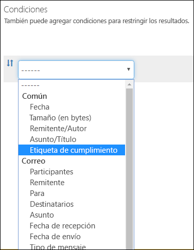
  
## <a name="the-principles-of-retention-or-what-takes-precedence"></a>Los principios de retención o qué tiene precedencia

Es posible (o incluso probable) que se apliquen varias directivas de retención a contenido, cada una con una acción (conservar, eliminar o ambas) y un período de retención. ¿Qué tiene precedencia? En general, puede estar seguro de que el contenido conservado por una directiva no se puede eliminar de forma permanente con otra directiva.
  

  
Para entender cómo se aplican a contenido distintas etiquetas con acciones de retención, tenga en cuenta estos principios de retención:
  
1. **La retención tiene prioridad sobre la eliminación.** Imagine que una directiva de retención dice que es necesario eliminar el correo electrónico de Exchange después de tres años, pero otra directiva de retención dice que se conserve durante cinco años y, después, se elimine. Todo el contenido que alcance los tres años de antigüedad se eliminará y quedará oculto para el usuario, pero se seguirá conservando en la carpeta Elementos recuperables hasta que alcance los cinco años, momento en que se eliminará de forma permanente. 
    
2. **El período de retención más largo tiene prioridad.** Si el contenido está sujeto a varias directivas de retención, se conservará hasta el final del período de retención más largo. 
    
3. **La inclusión explícita tiene prioridad sobre la inclusión implícita.** Esto significa que: 
    
    1. Si una etiqueta de retención con configuración de retención se asigna de forma manual a un usuario o elemento (como un correo electrónico de Exchange o un documento de OneDrive), tendrá precedencia sobre la directiva asignada en el nivel de sitio o buzón y una etiqueta de retención predeterminada asignada por la biblioteca de documentos. Por ejemplo, si la etiqueta de retención explícita indica que tiene que conservarse durante diez años, pero la directiva de retención asignada al sitio dice que solo tiene que conservarse durante cinco años, la etiqueta de retención tiene precedencia. Tenga en cuenta que las etiquetas de retención de aplicación automática se consideran implícitas, no explícitas, porque Office 365 las aplica automáticamente.
    
    2. Si una directiva de retención incluye una ubicación específica (como el buzón de un usuario o una cuenta de OneDrive para la Empresa), tendrá precedencia sobre cualquier otra directiva de retención que se aplique a los buzones de todos los usuarios o a las cuentas de OneDrive para la Empresa, pero que no incluyan específicamente ese buzón de usuario.
    
4. **El período de eliminación más corto tiene prioridad.** De forma similar, si el contenido está sujeto a varias directivas que eliminan contenido (sin retención), se eliminará al final del período de retención más corto. 
    
Tenga en cuenta que los principios de retención funcionan como un flujo de desempate de arriba abajo: si las reglas aplicadas por todas las directivas o etiquetas son las mismas en un nivel, el flujo baja al siguiente nivel para determinar la precedencia de la regla que se aplica.
  
Por último, una etiqueta o directiva de retención no puede eliminar de forma permanente ningún contenido si está en suspensión para eDiscovery. Cuando se levante la suspensión, el contenido volverá a estar disponible para el proceso de limpieza descrito anteriormente.
  
## <a name="use-retention-labels-instead-of-these-features"></a>Usar etiquetas de retención en lugar de estas características

Las etiquetas de retención se pueden publicar fácilmente para toda la organización, así como su contenido, en Office 365, incluidos Exchange, SharePoint, OneDrive y Grupos de Office 365. Si necesita clasificar contenido o administrar registros en cualquier lugar en Office 365, le recomendamos que use etiquetas de retención.
  
Hay otras características que ya se han usado para clasificar contenido o administrar registros en Office 365. Se muestran a continuación. Estas características seguirán funcionando en paralelo con las etiquetas de retención. Tenga en cuenta que, aunque en algunos casos la implementación de etiquetas de retención difiere de las características anteriores, la evolución de las etiquetas de retención determinará el futuro de la administración de registros en Office 365. Por lo tanto, en adelante, se recomienda usar etiquetas de retención para el gobierno de datos en lugar de estas características.
  
### <a name="exchange-online"></a>Exchange Online

- [Etiquetas de retención y directivas de retención](https://go.microsoft.com/fwlink/?linkid=846125), lo que también se conoce como [administración de registros de mensajes (MRM)](https://go.microsoft.com/fwlink/?linkid=846126) (solo eliminación) 
    
### <a name="sharepoint-online-and-onedrive-for-business"></a>SharePoint Online y OneDrive para la Empresa

- [Configuración de administración de registros local](https://support.office.com/article/7707a878-780c-4be6-9cb0-9718ecde050a) (retención) 
    
- [Introducción al Centro de registros](https://support.office.com/article/bae6ca5a-7b19-40e0-b433-e3613a747c2c) (retención) 
    
- [Directivas de administración de información](intro-to-info-mgmt-policies.md) (solo eliminación) 
    
## <a name="permissions"></a>Permisos

Los miembros de su equipo de cumplimiento normativo que vayan a crear etiquetas de retención necesitan permisos del Centro de seguridad y cumplimiento. De forma predeterminada, el administrador de espacios empresariales tendrá acceso a esta ubicación y puede proporcionar acceso a los responsables de cumplimiento y otros usuarios para el Centro de seguridad y cumplimiento sin darles todos los permisos de un administrador de espacios empresariales. Para ello, se recomienda ir a la página **Permisos** del Centro de seguridad y cumplimiento, editar el grupo de roles **Administrador de cumplimiento** y agregar miembros al mismo. 
  
Para obtener más información, vea [Conceder acceso a los usuarios al Centro de seguridad y cumplimiento de Office 365](grant-access-to-the-security-and-compliance-center.md).
  
Estos permisos solo son necesarios para crear y aplicar etiquetas de retención y una directiva de etiquetas. La aplicación de directivas no necesita acceso al contenido.  
## <a name="find-the-powershell-cmdlets-for-labels"></a>Encontrar los cmdlets de PowerShell para etiquetas

Para usar los cmdlets de etiquetas, necesita:
  
1. [Conectarse a PowerShell del Centro de seguridad y cumplimiento de Office 365](https://docs.microsoft.com/powershell/exchange/office-365-scc/connect-to-scc-powershell/connect-to-scc-powershell)
    
2. Use estos cmdlets del Centro de seguridad y cumplimiento de Office 365:

  - [Get-ComplianceTag](https://docs.microsoft.com/powershell/module/exchange/policy-and-compliance-retention/get-compliancetag)

  - [New-ComplianceTag](https://docs.microsoft.com/powershell/module/exchange/policy-and-compliance-retention/new-compliancetag)

  - [Remove-ComplianceTag](https://docs.microsoft.com/powershell/module/exchange/policy-and-compliance-retention/remove-compliancetag)

  - [Set-ComplianceTag](https://docs.microsoft.com/powershell/module/exchange/policy-and-compliance-retention/set-compliancetag)

  - [Enable-ComplianceTagStorage](https://docs.microsoft.com/powershell/module/exchange/policy-and-compliance-retention/enable-compliancetagstorage)

  - [Get-ComplianceTagStorage](https://docs.microsoft.com/powershell/module/exchange/policy-and-compliance-retention/get-compliancetagstorage)

  - [Get-RetentionCompliancePolicy](https://docs.microsoft.com/powershell/module/exchange/policy-and-compliance-retention/get-retentioncompliancepolicy)

  - [New-RetentionCompliancePolicy](https://docs.microsoft.com/powershell/module/exchange/policy-and-compliance-retention/new-retentioncompliancepolicy)

  - [Remove-RetentionCompliancePolicy](https://docs.microsoft.com/powershell/module/exchange/policy-and-compliance-retention/remove-retentioncompliancepolicy)

  - [Set-RetentionCompliancePolicy](https://docs.microsoft.com/powershell/module/exchange/policy-and-compliance-retention/set-retentioncompliancepolicy)

  - [Get-RetentionComplianceRule](https://docs.microsoft.com/powershell/module/exchange/policy-and-compliance-retention/get-retentioncompliancerule)

  - [New-RetentionComplianceRule](https://docs.microsoft.com/powershell/module/exchange/policy-and-compliance-retention/new-retentioncompliancerule)

  - [Remove-RetentionComplianceRule](https://docs.microsoft.com/powershell/module/exchange/policy-and-compliance-retention/remove-retentioncompliancerule)

  - [Set-RetentionComplianceRule](https://docs.microsoft.com/powershell/module/exchange/policy-and-compliance-retention/set-retentioncompliancerule)
