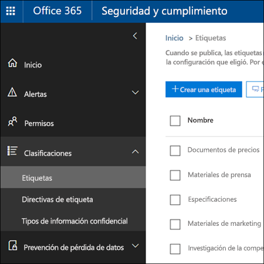
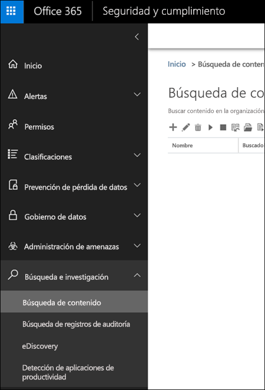

# <a name="overview-of-labels"></a><span data-ttu-id="df971-105">Información general sobre las etiquetas</span><span class="sxs-lookup"><span data-stu-id="df971-105">Overview of labels</span></span>

<span data-ttu-id="df971-p102">Es posible que su organización disponga de distintos tipos de contenido que haya que usar de manera diferente para cumplir con las normativas del sector y las directivas internas. Por ejemplo:</span><span class="sxs-lookup"><span data-stu-id="df971-p102">Across your organization, you probably have different types of content that require different actions taken on them in order to comply with industry regulations and internal policies. For example, you might have:</span></span>
  
- <span data-ttu-id="df971-108">Formularios fiscales que sea necesario **conservar** durante un período de tiempo mínimo.</span><span class="sxs-lookup"><span data-stu-id="df971-108">Tax forms that need to be **retained** for a minimum period of time.</span></span> 
    
- <span data-ttu-id="df971-109">Materiales de prensa que deban **eliminarse de forma permanente** cuando alcancen una determinada antigüedad.</span><span class="sxs-lookup"><span data-stu-id="df971-109">Press materials that need to be **permanently deleted** when they reach a certain age.</span></span> 
    
- <span data-ttu-id="df971-110">Información sobre la competencia que sea necesario **conservar** y, después, **eliminar de forma permanente**.</span><span class="sxs-lookup"><span data-stu-id="df971-110">Competitive research that needs to be both **retained** and then **permanently deleted**.</span></span> 
    
- <span data-ttu-id="df971-111">Visados de trabajo que tengan que **marcarse como registros** para que no se puedan editar ni eliminar.</span><span class="sxs-lookup"><span data-stu-id="df971-111">Work visas that must be **marked as a record** so that they can't be edited or deleted.</span></span> 
    
<span data-ttu-id="df971-p103">En todos estos casos, las etiquetas de Office 365 pueden ayudarle a realizar las acciones adecuadas en el contenido adecuado. Con las etiquetas, puede clasificar los datos de su organización para administrarlos mejor y aplicar reglas de retención basadas en esa clasificación.</span><span class="sxs-lookup"><span data-stu-id="df971-p103">In all of these cases, labels in Office 365 can help you take the right actions on the right content. With labels, you can classify data across your organization for governance, and enforce retention rules based on that classification.</span></span>
  
<span data-ttu-id="df971-114">Con las etiquetas, puede:</span><span class="sxs-lookup"><span data-stu-id="df971-114">With labels, you can:</span></span>
  
- <span data-ttu-id="df971-p104">**Permitir que los usuarios de la organización apliquen manualmente una etiqueta** a contenido de Outlook en la Web, Outlook 2010 y versiones posteriores, OneDrive para la Empresa, SharePoint Online y Grupos de Office 365. Con frecuencia, los usuarios son los que mejor saben con qué tipo de contenido están trabajando, por lo que pueden clasificarlo correctamente y aplicar la directiva adecuada.</span><span class="sxs-lookup"><span data-stu-id="df971-p104">Enable people in your organization to apply a label manually to content in Outlook on the web, Outlook 2010 and later, OneDrive for Business, SharePoint Online, and Office 365 groups. Users often know best what type of content they’re working with, so they can classify it and have the appropriate DLP policy applied.</span></span> 
    
- <span data-ttu-id="df971-117">**Aplicar etiquetas a contenido automáticamente** si coincide con condiciones específicas, como:</span><span class="sxs-lookup"><span data-stu-id="df971-117">**Apply labels to content automatically** if it matches specific conditions, such as when the content contains:</span></span> 
    
  - <span data-ttu-id="df971-118">Tipos específicos de información confidencial.</span><span class="sxs-lookup"><span data-stu-id="df971-118">Specific types of sensitive information.</span></span>
    
  - <span data-ttu-id="df971-119">Palabras clave específicas que coinciden con una consulta que haya creado.</span><span class="sxs-lookup"><span data-stu-id="df971-119">Specific keywords that match a query you create.</span></span>
    
    <span data-ttu-id="df971-120">La capacidad de aplicar etiquetas automáticamente al contenido ofrece las ventajas siguientes:</span><span class="sxs-lookup"><span data-stu-id="df971-120">The ability to apply labels to content automatically is important because:</span></span>
    
  - <span data-ttu-id="df971-121">No es necesario formar a los usuarios para que conozcan todas las clasificaciones.</span><span class="sxs-lookup"><span data-stu-id="df971-121">You don't need to train your users on all of your classifications.</span></span>
    
  - <span data-ttu-id="df971-122">No es necesario depender de los usuarios para clasificar todo el contenido correctamente.</span><span class="sxs-lookup"><span data-stu-id="df971-122">You don't need to rely on users to classify all content correctly.</span></span>
    
  - <span data-ttu-id="df971-123">Los usuarios ya no necesitan conocer las directivas de gobierno de datos; en su lugar, pueden centrarse en su trabajo.</span><span class="sxs-lookup"><span data-stu-id="df971-123">Users no longer need to know about data governance policies - they can instead focus on their work.</span></span>
    
    <span data-ttu-id="df971-124">Tenga en cuenta que, para aplicar automáticamente las etiquetas, se necesita una suscripción de Office 365 Enterprise E5.</span><span class="sxs-lookup"><span data-stu-id="df971-124">Note that auto-apply labels require an Office 365 Enterprise E5 subscription.</span></span>
    
- <span data-ttu-id="df971-125">**Aplicar una etiqueta predeterminada a una biblioteca de documentos** en un sitio de grupo de Office 365 y SharePoint, para que todos los documentos de esa biblioteca obtengan la etiqueta predeterminada.</span><span class="sxs-lookup"><span data-stu-id="df971-125">Apply a default label to a document library in a SharePoint Online team site, so that all documents in that library get the default label.</span></span> 
    
- <span data-ttu-id="df971-p105">**Implementar la administración de registros en todo Office 365**, tanto en correos electrónicos como en documentos. Puede usar una etiqueta para clasificar contenido como un registro. Cuando ocurra esto, la etiqueta no se puede cambiar ni quitar, y el contenido no se puede editar ni eliminar.</span><span class="sxs-lookup"><span data-stu-id="df971-p105">**Implement records management across Office 365**, including both email and documents. You can use a label to classify content as a record. When this happens, the label can't be changed or removed, and the content can't be edited or deleted.</span></span> 
    
<span data-ttu-id="df971-129">Para crear y administrar etiquetas, vaya a la página **Etiquetas** del Centro de seguridad y cumplimiento de Office 365.</span><span class="sxs-lookup"><span data-stu-id="df971-129">You create and manage labels on the **Labels** page in the Office 365 Security &amp; Compliance Center.</span></span> 
  

 
## <a name="how-labels-work-with-label-policies"></a><span data-ttu-id="df971-131">Funcionamiento de las etiquetas con directivas de etiquetas</span><span class="sxs-lookup"><span data-stu-id="df971-131">How labels work with label policies</span></span>

<span data-ttu-id="df971-p106">El proceso para que los usuarios de su organización puedan usar etiquetas para clasificar contenido se divide en dos pasos: primero, se crean las etiquetas y, después, se publican en las ubicaciones seleccionadas. Al publicar etiquetas, se crea una directiva de etiquetas.</span><span class="sxs-lookup"><span data-stu-id="df971-p106">Making labels available to people in your organization so that they can classify content is a two-step process: first you create the labels, and then you publish them to the locations you choose. When you publish labels, a label policy gets created.</span></span>
  

  
<span data-ttu-id="df971-p107">Las etiquetas son bloques de creación independientes y reutilizables que se incluyen en una directiva de etiquetas y se publican en distintas ubicaciones. Las etiquetas se pueden reutilizar en un gran número de directivas. La finalidad principal de la directiva de etiquetas es agrupar un conjunto de etiquetas y especificar las ubicaciones donde quiere que aparezcan esas etiquetas.</span><span class="sxs-lookup"><span data-stu-id="df971-p107">Labels are independent, reusable building blocks that are included in a label policy and published to different locations. Labels can be reused across many policies. The primary purpose of the label policy is to group a set of labels and specify the locations where you want those labels to appear.</span></span>
  

  
1. <span data-ttu-id="df971-p108">Al publicar etiquetas, se incluyen en una directiva de etiquetas. Una única etiqueta se puede incluir en varias directivas.</span><span class="sxs-lookup"><span data-stu-id="df971-p108">When you publish labels, they're included in a label policy. A single label can be included in many policies.</span></span>
    
2. <span data-ttu-id="df971-141">Las directivas de etiquetas especifican las ubicaciones donde se publicarán las etiquetas.</span><span class="sxs-lookup"><span data-stu-id="df971-141">Label policies specify the locations to publish the labels.</span></span>
    
## <a name="only-one-label-at-a-time"></a><span data-ttu-id="df971-142">Solo una etiqueta cada vez</span><span class="sxs-lookup"><span data-stu-id="df971-142">Only one label at a time</span></span>

<span data-ttu-id="df971-143">Es importante saber que solo se puede asignar una etiqueta al contenido (como un correo electrónico o un documento):</span><span class="sxs-lookup"><span data-stu-id="df971-143">It's important to know that content like an email or document can have only a single label assigned to it at a time:</span></span>
  
- <span data-ttu-id="df971-144">En el caso de las etiquetas asignadas manualmente por los usuarios finales, estos pueden quitar o cambiar la etiqueta asignada.</span><span class="sxs-lookup"><span data-stu-id="df971-144">For labels assigned manually by end users, people can remove or change the label that's assigned.</span></span>
    
- <span data-ttu-id="df971-145">Si el contenido tiene asignada una etiqueta de aplicación automática, un usuario final puede reemplazarla por una etiqueta asignada manualmente.</span><span class="sxs-lookup"><span data-stu-id="df971-145">If content has an auto-apply label assigned, an auto-apply label can be replaced by a label assigned manually by an end user.</span></span>
    
- <span data-ttu-id="df971-146">Si el contenido tiene una etiqueta asignada manualmente por un usuario final, una etiqueta de aplicación automática no puede reemplazar a la etiqueta asignada de forma manual.</span><span class="sxs-lookup"><span data-stu-id="df971-146">If content has a label assigned manually by an end user, an auto-apply label cannot replace the manually assigned label.</span></span>
    
- <span data-ttu-id="df971-147">Si hay varias reglas que asignan una etiqueta de aplicación automática y el contenido cumple las condiciones de varias reglas, se asignará la etiqueta de la regla más antigua.</span><span class="sxs-lookup"><span data-stu-id="df971-147">If there are multiple rules that assign an auto-apply label and content meets the conditions of multiple rules, the label for the oldest rule is assigned. For this reason, it is important to plan the label policies carefully before configuring them. If an organization requires a change to the priority of the label policies, they will need to delete and recreate them.</span></span>
    
<span data-ttu-id="df971-p109">Las etiquetas asignadas manualmente se asignan de manera explícita; las etiquetas de aplicación automática se asignan de forma implícita; una etiqueta explícita tiene precedencia sobre una etiqueta implícita. Para obtener más información, vea la sección siguiente [Los principios de retención o qué tiene precedencia](labels.md#principles).</span><span class="sxs-lookup"><span data-stu-id="df971-p109">Manually assigned labels are explicitly assigned; auto-apply labels are implicitly assigned; an explicit label takes precedence over an implicit label. For more information, see the below section on [The principles of retention, or what takes precedence?](labels.md#principles).</span></span>
  
## <a name="how-long-it-takes-for-labels-to-take-effect"></a><span data-ttu-id="df971-150">Tiempo que tardan las etiquetas en aplicarse</span><span class="sxs-lookup"><span data-stu-id="df971-150">How long it takes for labels to take effect</span></span>

<span data-ttu-id="df971-151">Al publicar o aplicar automáticamente etiquetas, no surten efecto inmediatamente:</span><span class="sxs-lookup"><span data-stu-id="df971-151">When you publish or auto-apply labels, they don't take effect immediately:</span></span>
  
1. <span data-ttu-id="df971-152">Primero, la directiva de etiquetas tiene que sincronizarse desde el Centro de seguridad y cumplimiento con las ubicaciones en la directiva.</span><span class="sxs-lookup"><span data-stu-id="df971-152">First the label policy needs to be synced from the Security &amp; Compliance Center to the locations in the policy.</span></span>
    
2. <span data-ttu-id="df971-p110">Después, puede que la ubicación necesite algún tiempo hasta que las etiquetas manuales estén disponibles para los usuarios finales o para que se apliquen automáticamente las etiquetas al contenido. El tiempo necesario depende de la ubicación y del tipo de etiqueta.</span><span class="sxs-lookup"><span data-stu-id="df971-p110">Then the location may require time to make manual labels available to end users or auto-apply labels to content. How long this takes depends on the location and type of label.</span></span>
    
### <a name="manual-labels"></a><span data-ttu-id="df971-155">Etiquetas manuales</span><span class="sxs-lookup"><span data-stu-id="df971-155">Manual labels</span></span>

<span data-ttu-id="df971-p111">Si publica etiquetas en SharePoint o OneDrive, puede que tarden un día en mostrarse a los usuarios finales. Además, si publica etiquetas en Exchange, pueden tardar hasta siete días en mostrarse a los usuarios finales y, además, el buzón necesita contener como mínimo 10 MB de datos.</span><span class="sxs-lookup"><span data-stu-id="df971-p111">If you publish labels to SharePoint or OneDrive, it can take one day for those labels to appear for end users. In addition, if you publish labels to Exchange, it can take 7 days for those labels to appear for end users, and the mailbox needs to contain at least 10 MB of data.</span></span>
  

  
### <a name="auto-apply-labels"></a><span data-ttu-id="df971-159">Etiquetas de aplicación automática</span><span class="sxs-lookup"><span data-stu-id="df971-159">Auto-apply labels</span></span>

<span data-ttu-id="df971-160">Si aplica automáticamente etiquetas a contenido que coincida con condiciones específicas, estas pueden tardar hasta siete días en aplicarse a todo el contenido que coincida con las condiciones.</span><span class="sxs-lookup"><span data-stu-id="df971-160">If you auto-apply labels to content matching specific conditions, it can take seven days for the labels to be applied to all content that matches the conditions.</span></span>
  

  
### <a name="how-to-check-on-the-status-of-exchange-labels"></a><span data-ttu-id="df971-162">Comprobar el estado de las etiquetas de Exchange</span><span class="sxs-lookup"><span data-stu-id="df971-162">How to check on the status of Exchange labels</span></span>

<span data-ttu-id="df971-p112">En Exchange Online, las etiquetas se publican para los usuarios finales mediante un proceso que se ejecuta cada siete días. Con PowerShell, puede ver cuándo se ha ejecutado este proceso por última vez y, por tanto, determinar cuándo volverá a ejecutarse.</span><span class="sxs-lookup"><span data-stu-id="df971-p112">In Exchange Online, labels are made available to end users by a process that runs every seven days. By using Powershell, you can see when this process last ran and thus determine when it will run again.</span></span>
  
1. <span data-ttu-id="df971-165">[Conexión a PowerShell de Exchange Online](https://go.microsoft.com/fwlink/?linkid=799773).</span><span class="sxs-lookup"><span data-stu-id="df971-165">[Connect to Exchange Online PowerShell](https://go.microsoft.com/fwlink/?linkid=799773)</span></span>
    
2. <span data-ttu-id="df971-166">Ejecute estos comandos.</span><span class="sxs-lookup"><span data-stu-id="df971-166">Run these commands to connect to MO_ExchangeOnline_2nd.</span></span>
    
  ```
  $logProps = Export-MailboxDiagnosticLogs <user> -ExtendedProperties
  ```

  ```
  $xmlprops = [xml]($logProps.MailboxLog)
  ```

  ```
  $xmlprops.Properties.MailboxTable.Property | ? {$_.Name -like "ELC*"}
  ```

    <span data-ttu-id="df971-p113">En los resultados, la propiedad `ELCLastSuccessTimeStamp` (UTC) indica la última vez que el sistema ha procesado el buzón. Si no se ha ejecutado desde el momento en que se crea la directiva, las etiquetas no aparecerán. Para forzar el procesamiento, ejecute `Start-ManagedFolderAssistant -Identity <user>`.</span><span class="sxs-lookup"><span data-stu-id="df971-p113">In the results, the  `ELCLastSuccessTimeStamp` (UTC) property shows when the system last processed your mailbox. If it has not happened since the time you created the policy, the labels are not going to appear. To force processing, run  `Start-ManagedFolderAssistant -Identity <user>`.</span></span>
    
    <span data-ttu-id="df971-170">Si las etiquetas no aparecen en Outlook en la Web y cree que tendrían que aparecer, asegúrese de vaciar la caché del explorador (CTRL+F5).</span><span class="sxs-lookup"><span data-stu-id="df971-170">If labels aren't appearing in Outlook on the web and you think they should be, make sure to clear the cache in your browser (CTRL+F5).</span></span>
    
## <a name="label-policies-and-locations"></a><span data-ttu-id="df971-171">Ubicaciones y directivas de etiquetas</span><span class="sxs-lookup"><span data-stu-id="df971-171">Label policies and locations</span></span>

<span data-ttu-id="df971-172">En función de la finalidad de las etiquetas, pueden publicarse en distintas ubicaciones.</span><span class="sxs-lookup"><span data-stu-id="df971-172">Different types of labels can be published to different locations, depending on what the label does.</span></span>
  
|<span data-ttu-id="df971-173">**Si la etiqueta…**</span><span class="sxs-lookup"><span data-stu-id="df971-173">**If the label is…**</span></span>|<span data-ttu-id="df971-174">**La directiva de etiquetas se puede aplicar en…**</span><span class="sxs-lookup"><span data-stu-id="df971-174">**Then the label policy can be applied to…**</span></span>|
|:-----|:-----|
|<span data-ttu-id="df971-175">Se publica a los usuarios finales</span><span class="sxs-lookup"><span data-stu-id="df971-175">Published to end users</span></span>  <br/> |<span data-ttu-id="df971-176">Exchange, SharePoint, OneDrive, Grupos de Office 365</span><span class="sxs-lookup"><span data-stu-id="df971-176">Exchange, SharePoint, OneDrive, Office 365 groups</span></span>  <br/> |
|<span data-ttu-id="df971-177">Se aplica automáticamente basándose en tipos de información confidencial</span><span class="sxs-lookup"><span data-stu-id="df971-177">Auto-applied based on sensitive information types</span></span>  <br/> |<span data-ttu-id="df971-178">Exchange (solo todos los buzones), SharePoint, OneDrive</span><span class="sxs-lookup"><span data-stu-id="df971-178">Exchange (all mailboxes only), SharePoint, OneDrive</span></span>  <br/> |
|<span data-ttu-id="df971-179">Se aplica automáticamente basándose en una consulta</span><span class="sxs-lookup"><span data-stu-id="df971-179">Auto-applied based on a query</span></span>  <br/> |<span data-ttu-id="df971-180">Exchange, SharePoint, OneDrive, Grupos de Office 365</span><span class="sxs-lookup"><span data-stu-id="df971-180">Exchange, SharePoint, OneDrive, Office 365 groups</span></span>  <br/> |
   
<span data-ttu-id="df971-p114">Tenga en cuenta que, en Exchange, las etiquetas de aplicación automática (tanto para consultas como para tipos de información confidencial) solo se aplican en los nuevos mensajes enviados (datos en tránsito), no en todos los elementos que ya están presentes en el buzón (datos en reposo). Además, las etiquetas de aplicación automática para tipos de información confidencial se aplican a todos los buzones (no se pueden seleccionar buzones específicos).</span><span class="sxs-lookup"><span data-stu-id="df971-p114">Note that in Exchange, auto-apply labels (for both queries and sensitive information types) are applied only to messages newly sent (data in transit), not to all items currently in the mailbox (data at rest). Also, auto-apply labels for sensitive information types can apply only to all mailboxes; you can't select the specific mailboxes.</span></span>
  
<span data-ttu-id="df971-183">Tenga en cuenta que las carpetas públicas de Exchange y Skype no admiten las etiquetas.</span><span class="sxs-lookup"><span data-stu-id="df971-183">Note that Exchange public folders and Skype do not support labels.</span></span>
  
## <a name="how-labels-enforce-retention"></a><span data-ttu-id="df971-184">Forma en que las etiquetas aplican la retención</span><span class="sxs-lookup"><span data-stu-id="df971-184">How labels enforce retention</span></span>

<span data-ttu-id="df971-p115">Las etiquetas pueden aplicar exactamente las mismas acciones de retención que una directiva. Puede usar etiquetas para implementar un plan de contenido sofisticado (o un plan de archivos). Para obtener más información sobre cómo funciona la retención, vea [Información general sobre las directivas de retención](retention-policies.md).</span><span class="sxs-lookup"><span data-stu-id="df971-p115">Labels can enforce exactly the same retention actions that a retention policy can. You can use labels to implement a sophisticated content plan (or file plan). For more information on how retention works, see [Overview of retention policies](retention-policies.md).</span></span>
  
<span data-ttu-id="df971-p116">Además, una etiqueta tiene dos opciones de retención que solo están disponibles en una etiqueta, pero no están disponibles en una directiva de retención. Con una etiqueta, puede:</span><span class="sxs-lookup"><span data-stu-id="df971-p116">In addition, a label has two retention options that are available only in a label and not in a retention policy. With a label, you can:</span></span>
  
- <span data-ttu-id="df971-p117">Desencadenar una revisión para eliminación al finalizar el período de retención para que los documentos de OneDrive y SharePoint tengan que revisarse antes de ser eliminados. Para obtener más información, vea [Información general sobre revisiones para eliminación](disposition-reviews.md).</span><span class="sxs-lookup"><span data-stu-id="df971-p117">Trigger a disposition review at the end of the retention period, so that SharePoint and OneDrive documents must be reviewed before they can be deleted. For more information, see [Overview of disposition reviews](disposition-reviews.md).</span></span>
    
- <span data-ttu-id="df971-192">Iniciar el período de retención desde el momento en que se etiquete el contenido, en lugar de la antigüedad del contenido o la fecha de la última modificación.</span><span class="sxs-lookup"><span data-stu-id="df971-192">Start the retention period from when the content was labeled, instead of the age of the content or when it was last modified.</span></span>
    

  
## <a name="where-published-labels-can-appear-to-end-users"></a><span data-ttu-id="df971-194">Ubicaciones donde los usuarios pueden ver las etiquetas publicadas</span><span class="sxs-lookup"><span data-stu-id="df971-194">Where published labels can appear to end users</span></span>

<span data-ttu-id="df971-195">Si los usuarios finales asignarán la etiqueta al contenido, puede publicarla en:</span><span class="sxs-lookup"><span data-stu-id="df971-195">If your label will be assigned to content by end users, you can publish it to:</span></span>
  
- <span data-ttu-id="df971-196">Outlook en la Web</span><span class="sxs-lookup"><span data-stu-id="df971-196">Outlook on the web</span></span>
    
- <span data-ttu-id="df971-197">Outlook 2010 y versiones posteriores</span><span class="sxs-lookup"><span data-stu-id="df971-197">Outlook 2010 and later</span></span>
    
- <span data-ttu-id="df971-198">OneDrive</span><span class="sxs-lookup"><span data-stu-id="df971-198">OneDrive</span></span>
    
- <span data-ttu-id="df971-199">SharePoint</span><span class="sxs-lookup"><span data-stu-id="df971-199">SharePoint</span></span>
    
- <span data-ttu-id="df971-200">Grupos de Office 365 (tanto en el sitio de grupo como el buzón de grupo de Outlook en la Web)</span><span class="sxs-lookup"><span data-stu-id="df971-200">Office 365 groups (both the group site and group mailbox in Outlook on the web)</span></span>
    
<span data-ttu-id="df971-201">En las secciones siguientes, se explica cómo se mostrarán las etiquetas en diferentes aplicaciones para los usuarios de su organización.</span><span class="sxs-lookup"><span data-stu-id="df971-201">The sections below show how labels will appear in different apps to people in your organization.</span></span>
  
### <a name="outlook-on-the-web"></a><span data-ttu-id="df971-202">Outlook en la Web</span><span class="sxs-lookup"><span data-stu-id="df971-202">Outlook on the web</span></span>

<span data-ttu-id="df971-203">Para etiquetar un elemento en Outlook en la Web, haga clic con el botón derecho en el elemento \> **Asignar directiva** \> seleccione la etiqueta.</span><span class="sxs-lookup"><span data-stu-id="df971-203">To label an item in Outlook on the web, right-click the item \> **Assign policy** \> choose the label.</span></span> 
  

  
<span data-ttu-id="df971-p118">Después de aplicarla, puede ver la etiqueta y la acción que realiza en la parte superior del elemento. Si un correo electrónico se clasifica y tiene asociado un período de retención, podrá ver rápidamente cuándo expirará el correo electrónico.</span><span class="sxs-lookup"><span data-stu-id="df971-p118">After the label is applied, you can view that label and what action it takes at the top of the item. If an email is classified and has an associated retention period, you can know at a glance when the email will expire.</span></span>
  

  
<span data-ttu-id="df971-208">También puede aplicar etiquetas a carpetas, en cuyo caso:</span><span class="sxs-lookup"><span data-stu-id="df971-208">You can also apply labels to folders, in which case:</span></span>
  
- <span data-ttu-id="df971-p119">Se asignará automáticamente la misma etiqueta en todos los elementos de la carpeta, **excepto** en los elementos donde se haya aplicado de forma explícita una etiqueta. Los elementos etiquetados de forma explícita mantienen la etiqueta existente. Para obtener más información, vea la sección siguiente sobre los principios de retención.</span><span class="sxs-lookup"><span data-stu-id="df971-p119">All items in the folder automatically get the same label, **except** for items that have had a label applied explicitly to them. Explicitly labeled items keep their existing label. For more information, see the below section on the principles of retention.</span></span> 
    
- <span data-ttu-id="df971-212">Si cambia o quita la etiqueta predeterminada de una carpeta, también se cambiará o quitará la etiqueta de todos los elementos de la carpeta, **excepto** en los elementos con etiquetas explícitas.</span><span class="sxs-lookup"><span data-stu-id="df971-212">If you change or remove the default label for a folder, the label's also changed or removed for all items in the folder, **except** items with explicit labels.</span></span> 
    
- <span data-ttu-id="df971-213">Si mueve un elemento con una etiqueta predeterminada de una carpeta a otra carpeta con una etiqueta predeterminada distinta, la nueva etiqueta predeterminada se aplicará en el elemento.</span><span class="sxs-lookup"><span data-stu-id="df971-213">If you move an item with a default label from one folder to another folder with a different default label, the item will get the new default label.</span></span>
    
- <span data-ttu-id="df971-214">Si mueve un elemento con una etiqueta predeterminada de una carpeta a otra sin una etiqueta predeterminada, se quitará la etiqueta predeterminada anterior.</span><span class="sxs-lookup"><span data-stu-id="df971-214">If you move an item with a default label from one folder to another folder with no default label, the old default label is removed.</span></span>
    
### <a name="outlook-2010-and-later"></a><span data-ttu-id="df971-215">Outlook 2010 y versiones posteriores</span><span class="sxs-lookup"><span data-stu-id="df971-215">Outlook 2010 and later</span></span>

<span data-ttu-id="df971-216">Para etiquetar un elemento en Outlook en la Web, haga clic con el botón derecho en el elemento \> en la **Cinta de opciones** \> **Asignar directiva** y seleccione la etiqueta.</span><span class="sxs-lookup"><span data-stu-id="df971-216">To label an item in Outlook on the web, right-click the item \> on the **Ribbon** \> **Assign Policy** \> choose the label.</span></span> 
  

  
<span data-ttu-id="df971-p120">Después de aplicarla, puede ver la etiqueta y la acción que realiza en la parte superior del elemento. Si un correo electrónico se clasifica y tiene asociado un período de retención, podrá ver rápidamente cuándo expirará el correo electrónico.</span><span class="sxs-lookup"><span data-stu-id="df971-p120">After the label is applied, you can view that label and what action it takes at the top of the item. If an email is classified and has an associated retention period, you can know at a glance when the email will expire.</span></span>
  
<span data-ttu-id="df971-p121">También puede aplicar etiquetas en carpetas. Este procedimiento funciona de la misma forma en Outlook en la Web que en Outlook 2010 y versiones posteriores (para obtener más información, vea la sección anterior).</span><span class="sxs-lookup"><span data-stu-id="df971-p121">You can also apply labels to folders. This works the same in Outlook 2010 and later as it does in Outlook on the web -- see the previous section for more info.</span></span>
  
### <a name="onedrive-and-sharepoint"></a><span data-ttu-id="df971-222">OneDrive y SharePoint</span><span class="sxs-lookup"><span data-stu-id="df971-222">OneDrive and SharePoint</span></span>

<span data-ttu-id="df971-223">Para etiquetar un documento (incluidos archivos de OneNote) en OneDrive o SharePoint, seleccione el elemento \> en la esquina superior derecha, haga clic en **Abrir el panel de detalles** \> **Aplicar etiqueta** y seleccione la etiqueta.</span><span class="sxs-lookup"><span data-stu-id="df971-223">To label a document (including OneNote files) in OneDrive or SharePoint, select the item \> in the upper-right corner, choose **Open the details pane** \> **Apply label** \> choose the label.</span></span> 
  
<span data-ttu-id="df971-224">Tenga en cuenta que también puede aplicar una etiqueta en una carpeta o un conjunto de documentos, así como establecer una etiqueta predeterminada para una biblioteca de documentos (para obtener más información, vea la sección siguiente).</span><span class="sxs-lookup"><span data-stu-id="df971-224">Note that you can also apply a label to a folder or document set, and you can set a default label for a document library - see the section below for more information.</span></span>
  

  
<span data-ttu-id="df971-226">Después de aplicar una etiqueta a un elemento, puede verla en el panel de detalles cuando esté seleccionado el elemento.</span><span class="sxs-lookup"><span data-stu-id="df971-226">After a label is applied to an item, you can view it in the details pane when that item's selected.</span></span>
  

  
<span data-ttu-id="df971-p122">También puede crear una vista de la biblioteca que contenga la columna **Etiquetas** o la columna **El elemento es un registro** para ver rápidamente las etiquetas asignadas a todos los elementos y conocer qué elementos son registros. Pero tenga en cuenta que no puede filtrar la vista por la columna **El elemento es un registro**.</span><span class="sxs-lookup"><span data-stu-id="df971-p122">You can also create a view of the library that contains the **Labels** column or **Item is a Record** column, so that you can see at a glance the labels assigned to all items and which items are records. Note, however, that you can't filter the view by the **Item is a Record** column.</span></span> 
  

  
### <a name="office-365-groups"></a><span data-ttu-id="df971-231">Grupos de Office 365</span><span class="sxs-lookup"><span data-stu-id="df971-231">Office 365 groups</span></span>

<span data-ttu-id="df971-p123">Al publicar etiquetas en un grupo de Office 365, las etiquetas aparecen tanto en el sitio de grupo como en el buzón de grupo de Outlook en la Web. La experiencia de aplicar una etiqueta al contenido es idéntica a la que se muestra anteriormente para el correo electrónico y los documentos.</span><span class="sxs-lookup"><span data-stu-id="df971-p123">When you publish labels to an Office 365 group, the labels appear in both the group site and group mailbox in Outlook on the web. The experience of applying a label to content is identical to that shown above for email and documents.</span></span>
  
## <a name="applying-a-label-automatically-based-on-conditions"></a><span data-ttu-id="df971-234">Aplicar automáticamente una etiqueta basándose en condiciones</span><span class="sxs-lookup"><span data-stu-id="df971-234">Applying a label automatically based on conditions</span></span>

<span data-ttu-id="df971-p124">Una de las características más útiles de las etiquetas es la capacidad de aplicarlas automáticamente a contenido que coincida con determinadas condiciones. En ese caso, los usuarios de su organización no necesitan aplicar las etiquetas: Office 365 lo hace automáticamente.</span><span class="sxs-lookup"><span data-stu-id="df971-p124">One of the most powerful features of labels is the ability to apply them automatically to content that matches certain conditions. In this case, people in your organization don't need to apply the labels - Office 365 does the work for them.</span></span>
  

  
<span data-ttu-id="df971-238">Las etiquetas de aplicación automática son realmente útiles porque:</span><span class="sxs-lookup"><span data-stu-id="df971-238">Auto-apply labels are powerful because:</span></span>
  
- <span data-ttu-id="df971-239">No es necesario formar a los usuarios para que conozcan todas las clasificaciones.</span><span class="sxs-lookup"><span data-stu-id="df971-239">You don't need to train your users on all of your classifications.</span></span>
    
- <span data-ttu-id="df971-240">No es necesario depender de los usuarios para clasificar todo el contenido correctamente.</span><span class="sxs-lookup"><span data-stu-id="df971-240">You don't need to rely on users to classify all content correctly.</span></span>
    
- <span data-ttu-id="df971-241">Los usuarios ya no necesitan conocer las directivas de gobierno de datos; en su lugar, pueden centrarse en su trabajo.</span><span class="sxs-lookup"><span data-stu-id="df971-241">Users no longer need to know about data governance policies - they can focus on their work.</span></span>
    
<span data-ttu-id="df971-242">Puede aplicar automáticamente etiquetas en contenido cuando este coincida con:</span><span class="sxs-lookup"><span data-stu-id="df971-242">You can choose to apply labels to content automatically when that content contains:</span></span>
  
- <span data-ttu-id="df971-243">Tipos específicos de información confidencial.</span><span class="sxs-lookup"><span data-stu-id="df971-243">Specific types of sensitive information.</span></span>
    
- <span data-ttu-id="df971-244">Palabras clave específicas que coinciden con una consulta que haya creado.</span><span class="sxs-lookup"><span data-stu-id="df971-244">Specific keywords that match a query you create.</span></span>
    

  
<span data-ttu-id="df971-246">Tenga en cuenta que, para usar las etiquetas de aplicación automática, se necesita una suscripción de Office 365 Enterprise E5; además, estas pueden tardar hasta siete días en aplicarse automáticamente a todo el contenido que coincida con las condiciones, como se ha descrito anteriormente.</span><span class="sxs-lookup"><span data-stu-id="df971-246">Note that auto-apply labels require an Office 365 Enterprise E5 subscription, and that it can take up to seven days for auto-apply labels to be applied to all content that matches the conditions, as described above.</span></span>
  
### <a name="auto-apply-labels-to-content-with-specific-types-of-sensitive-information"></a><span data-ttu-id="df971-247">Aplicar automáticamente etiquetas a contenido con tipos específicos de información confidencial</span><span class="sxs-lookup"><span data-stu-id="df971-247">Auto-apply labels to content with specific types of sensitive information</span></span>

<span data-ttu-id="df971-p125">Al crear etiquetas de aplicación automática para información confidencial, verá la misma lista de plantillas de directiva que al crear una directiva de prevención de pérdida de datos (DLP). Cada plantilla de directiva está preconfigurada para buscar tipos específicos de información confidencial (por ejemplo, la plantilla que se muestra aquí busca números de pasaporte, números del seguro social y números ITIN estadounidenses). Para obtener más información sobre DLP, vea [Información general sobre las directivas de prevención de pérdida de datos](data-loss-prevention-policies.md).</span><span class="sxs-lookup"><span data-stu-id="df971-p125">When you create auto-apply labels for sensitive information, you see the same list of policy templates as when you create a data loss prevention (DLP) policy. Each policy template is preconfigured to look for specific types of sensitive information - for example, the template shown here looks for U.S. ITIN, SSN, and passport numbers. To learn more about DLP, see [Overview of data loss prevention policies](data-loss-prevention-policies.md).</span></span>
  

  
<span data-ttu-id="df971-p126">Después de seleccionar una plantilla de directiva, puede agregar o quitar los tipos de información confidencial, así como cambiar el recuento de instancias y la precisión de coincidencia. En el ejemplo que se muestra aquí, solo se aplicará automáticamente una etiqueta cuando:</span><span class="sxs-lookup"><span data-stu-id="df971-p126">After you select a policy template, you can add or remove any types of sensitive information, and you can change the instance count and match accuracy. In the example shown here, a label will be auto-applied only when:</span></span>
  
- <span data-ttu-id="df971-p127">El contenido tenga entre 1 y 9 instancias de alguno de estos tres tipos de información confidencial. Puede eliminar el valor **máximo** para que cambie a **cualquiera**.</span><span class="sxs-lookup"><span data-stu-id="df971-p127">The content contains between 1 and 9 instances of any of these three sensitive information types. You can delete the **max** value so that it changes to **any**.</span></span>
    
- <span data-ttu-id="df971-p128">El tipo de información confidencial detectado tiene una precisión de coincidencia (o nivel de confianza) mínima de 75. Muchos tipos de información confidencial se definen con varios patrones, donde un patrón con una precisión de coincidencia más alta necesita encontrar más evidencias (como palabras clave, fechas o direcciones), mientras que un patrón con una precisión de coincidencia inferior necesita menos evidencias. En resumen, cuanto menor sea la precisión de coincidencia **mínima**, más fácil será que el contenido coincida con la condición.</span><span class="sxs-lookup"><span data-stu-id="df971-p128">The type of sensitive information that's detected has a match accuracy (or confidence level) of at least 75. Many sensitive information types are defined with multiple patterns, where a pattern with a higher match accuracy requires more evidence to be found (such as keywords, dates, or addresses), while a pattern with a lower match accuracy requires less evidence. Simply put, the lower the **min** match accuracy, the easier it is for content to match the condition.</span></span> 
    
    <span data-ttu-id="df971-259">Si cambia la precisión de coincidencia (o el nivel de confianza), tendrá que usar uno de los niveles de confianza de un patrón para ese tipo de información confidencial, como se define en [Información que buscan los tipos de información confidencial](what-the-sensitive-information-types-look-for.md).</span><span class="sxs-lookup"><span data-stu-id="df971-259">If you change the match accuracy (or confidence level), you should use one of confidence levels used in a pattern for that type of sensitive information, as defined in [What the sensitive information types look for](what-the-sensitive-information-types-look-for.md).</span></span>
    

  
### <a name="auto-apply-labels-to-content-with-specific-keywords"></a><span data-ttu-id="df971-261">Aplicar automáticamente etiquetas a contenido con palabras clave específicas</span><span class="sxs-lookup"><span data-stu-id="df971-261">Auto-apply labels to content with specific keywords</span></span>

<span data-ttu-id="df971-p129">Puede aplicar automáticamente etiquetas a contenido que cumpla determinadas condiciones. Las condiciones disponibles ahora permiten aplicar una etiqueta a contenido que coincida con palabras o frases específicas. Puede restringir la consulta con operadores de búsqueda como AND, OR y NOT. Para obtener más información sobre los operadores, vea [Consultas de palabras clave y condiciones de búsqueda para Búsqueda de contenido](keyword-queries-and-search-conditions.md).</span><span class="sxs-lookup"><span data-stu-id="df971-p129">You can auto-apply labels to content that satisfies certain conditions. The conditions available now support applying a label to content that contains specific words or phrases. You can refine your query by using search operators like AND, OR, and NOT. For more information on operators, see [Keyword queries and search conditions for Content Search](keyword-queries-and-search-conditions.md).</span></span>
  
<span data-ttu-id="df971-266">La compatibilidad para agregar propiedades que admiten búsquedas (por ejemplo, **asunto:**) estará disponible próximamente.</span><span class="sxs-lookup"><span data-stu-id="df971-266">Support for adding searchable properties (for example, **subject:** ) is coming soon.</span></span> 
  
<span data-ttu-id="df971-267">Tenga en cuenta que las etiquetas basadas en consultas usan el índice de búsqueda para identificar contenido.</span><span class="sxs-lookup"><span data-stu-id="df971-267">Note that query-based labels use the search index to identify content.</span></span>
  

  
## <a name="applying-a-default-label-to-all-content-in-a-sharepoint-library-folder-or-document-set"></a><span data-ttu-id="df971-269">Aplicar una etiqueta predeterminada a todo el contenido de una biblioteca, carpeta o conjunto de documentos de SharePoint</span><span class="sxs-lookup"><span data-stu-id="df971-269">Applying a default label to all content in a SharePoint library, folder, or document set</span></span>

<span data-ttu-id="df971-270">Además de permitir que los usuarios apliquen una etiqueta a documentos individuales, también puede aplicar una etiqueta predeterminada a una biblioteca, carpeta o conjunto de documentos de SharePoint para aplicar la etiqueta predeterminada a todos los documentos de esa ubicación.</span><span class="sxs-lookup"><span data-stu-id="df971-270">In addition to enabling people to apply a label to individual documents, you can also apply a default label to a SharePoint library, folder, or document set, so that all documents in that location get the default label.</span></span>
  
<span data-ttu-id="df971-p130">En el caso de una biblioteca de documentos, esto se realiza en la página **Configuración de la biblioteca** de una biblioteca de documentos. Al seleccionar la etiqueta predeterminada, también puede aplicarla a los elementos existentes de la biblioteca.</span><span class="sxs-lookup"><span data-stu-id="df971-p130">For a document library, this is done on the **Library settings** page for a document library. When you choose the default label, you can also choose to apply it to any existing items in the library.</span></span> 
  
<span data-ttu-id="df971-273">Por ejemplo, si tiene una etiqueta para materiales de marketing y sabe que una biblioteca de documentos específica solo contendrá ese tipo de contenido, puede hacer que la etiqueta “Materiales de marketing” sea la predeterminada para todos los documentos de esa biblioteca.</span><span class="sxs-lookup"><span data-stu-id="df971-273">For example, if you have a tag for marketing materials, and you know a specific document library will contain only that type of content, you can make the Marketing Materials tag the default for all documents in that library.</span></span>
  

  
<span data-ttu-id="df971-275">Si aplica una etiqueta predeterminada a elementos existentes de una biblioteca, carpeta o conjunto de documentos:</span><span class="sxs-lookup"><span data-stu-id="df971-275">If you apply a default label to existing items in the library, folder, or document set:</span></span>
  
- <span data-ttu-id="df971-p131">Se aplicará automáticamente la misma etiqueta a todos los elementos de esa biblioteca, carpeta o conjunto de documentos, **excepto** en los elementos donde se haya aplicado de forma explícita una etiqueta. Los elementos etiquetados de forma explícita mantienen la etiqueta existente. Para obtener más información, vea la sección siguiente [Los principios de retención o qué tiene precedencia](labels.md#principles).</span><span class="sxs-lookup"><span data-stu-id="df971-p131">All items in the library, folder, or document set automatically get the same label, **except** for items that have had a label applied explicitly to them. Explicitly labeled items keep their existing label. For more information, see the below section on [The principles of retention, or what takes precedence?](labels.md#principles).</span></span>
    
- <span data-ttu-id="df971-279">Si cambia o quita la etiqueta predeterminada de una biblioteca, carpeta o conjunto de documentos, también se cambiará o quitará la etiqueta de todos los elementos de la biblioteca, carpeta o conjunto de documentos, **excepto** de los elementos con etiquetas explícitas.</span><span class="sxs-lookup"><span data-stu-id="df971-279">If you change or remove the default label for a library, folder, or document set, the label's also changed or removed for all items in the library, folder, or document set, **except** items with explicit labels.</span></span> 
    
- <span data-ttu-id="df971-280">Si mueve un elemento con una etiqueta predeterminada de una biblioteca, carpeta o conjunto de documentos a otra biblioteca, carpeta o conjunto de documentos, el elemento mantendrá su etiqueta predeterminada existente, incluso si la nueva ubicación tiene otra etiqueta predeterminada.</span><span class="sxs-lookup"><span data-stu-id="df971-280">If you move an item with a default label from one library, folder, or document set to another library, folder, or document set, the item keeps its existing default label, even if the new location has a different default label.</span></span>
    
## <a name="applying-a-label-to-email-by-using-rules"></a><span data-ttu-id="df971-281">Aplicar una etiqueta a correo electrónico mediante reglas</span><span class="sxs-lookup"><span data-stu-id="df971-281">Applying a label to email by using rules</span></span>

<span data-ttu-id="df971-282">En Outlook 2010 o versiones posteriores, puede crear reglas para aplicar una etiqueta o directiva de retención.</span><span class="sxs-lookup"><span data-stu-id="df971-282">In Outlook 2010 or later, you can create rules to apply a label or retention policy.</span></span>
  
<span data-ttu-id="df971-283">Por ejemplo, puede crear una regla que aplique una etiqueta específica a todos los mensajes enviados a un grupo de distribución específico o desde este.</span><span class="sxs-lookup"><span data-stu-id="df971-283">For example, you can create a rule that applies a specific label to all messages sent to or from a specific distribution group.</span></span>
  
<span data-ttu-id="df971-284">Para crear una regla, haga clic con el botón derecho en un elemento \> **Reglas** \> **Crear regla** \> **Opciones avanzadas** \> **Asistente para reglas** \> **aplicar directiva de retención**.</span><span class="sxs-lookup"><span data-stu-id="df971-284">To create a rule, right-click an item \> **Rules** \> **Create Rule** \> **Advanced Options** \> **Rules Wizard** \> **apply retention policy**.</span></span>
  

  
## <a name="classifying-content-without-applying-any-actions"></a><span data-ttu-id="df971-286">Clasificar contenido sin aplicar acciones</span><span class="sxs-lookup"><span data-stu-id="df971-286">Classifying content without applying any actions</span></span>

<span data-ttu-id="df971-p132">Al crear una etiqueta, puede hacerlo sin activar ninguna retención u otras acciones, como se muestra abajo. En este caso, puede usar una etiqueta simplemente como una etiqueta de texto, sin exigir ninguna acción.</span><span class="sxs-lookup"><span data-stu-id="df971-p132">When you create a label, you can do so without turning on any retention or other actions, as shown below. In this case, you can use a label simply as a text label, without enforcing any actions.</span></span>
  
<span data-ttu-id="df971-289">Por ejemplo, puede crear una etiqueta llamada “Revisar más tarde” sin ninguna acción y, después, aplicar automáticamente esa etiqueta al contenido con tipos de información confidencial o contenido consultado.</span><span class="sxs-lookup"><span data-stu-id="df971-289">For example, you can create a label named "Review later" with no actions, and then auto-apply that label to content with sensitive information types or queried content.</span></span>
  

  
## <a name="using-labels-for-records-management"></a><span data-ttu-id="df971-291">Uso de etiquetas para la administración de registros</span><span class="sxs-lookup"><span data-stu-id="df971-291">Using labels for records management</span></span>

<span data-ttu-id="df971-292">De forma general, la administración de registros significa que:</span><span class="sxs-lookup"><span data-stu-id="df971-292">At a high level, records management means that:</span></span>
  
- <span data-ttu-id="df971-293">Los usuarios clasifican el contenido importante como registros.</span><span class="sxs-lookup"><span data-stu-id="df971-293">Important content is classified as a record by users.</span></span>
    
- <span data-ttu-id="df971-294">Un registro no se puede modificar ni eliminar.</span><span class="sxs-lookup"><span data-stu-id="df971-294">A record can't be modified or deleted.</span></span>
    
- <span data-ttu-id="df971-295">Por último, los registros se eliminan cuando se cumple la duración indicada.</span><span class="sxs-lookup"><span data-stu-id="df971-295">Records are finally disposed of after their stated lifetime is past.</span></span>
    
<span data-ttu-id="df971-p133">Puede usar etiquetas para implementar una única estrategia de administración de registros coherente en Office 365, mientras que otras características de administración de registros (como el Centro de registros) solo se aplican a contenido de SharePoint. También puede exigir acciones de retención en registros para que se eliminen automáticamente al finalizar su ciclo de vida.</span><span class="sxs-lookup"><span data-stu-id="df971-p133">You can use labels to implement a single, consistent records-management strategy across Office 365, whereas other records-management features such as the Record Center apply only to SharePoint content. And you can enforce retention actions on records, so that they're disposed of automatically at the end of their lifecycle.</span></span>
  
<span data-ttu-id="df971-298">Al crear una etiqueta, puede usarla para clasificar el contenido como un registro.</span><span class="sxs-lookup"><span data-stu-id="df971-298">When you create a label, you have the option to use the label to classify the content as a record.</span></span>
  

  
<span data-ttu-id="df971-300">Al etiquetar un elemento como un registro, ocurren cuatro cosas:</span><span class="sxs-lookup"><span data-stu-id="df971-300">When an item is labeled as a record, four things happen:</span></span>
  
- <span data-ttu-id="df971-301">El elemento no se puede eliminar de forma permanente.</span><span class="sxs-lookup"><span data-stu-id="df971-301">The item can't be permanently deleted.</span></span>
    
- <span data-ttu-id="df971-302">El elemento no se puede editar.</span><span class="sxs-lookup"><span data-stu-id="df971-302">The item can't be edited.</span></span>
    
- <span data-ttu-id="df971-303">La etiqueta no se puede cambiar.</span><span class="sxs-lookup"><span data-stu-id="df971-303">The label can't be changed.</span></span>
    
- <span data-ttu-id="df971-304">La etiqueta no se puede quitar.</span><span class="sxs-lookup"><span data-stu-id="df971-304">The label can't be removed.</span></span>
    
### <a name="who-can-classify-content-as-a-record"></a><span data-ttu-id="df971-305">Quién puede clasificar contenido como un registro</span><span class="sxs-lookup"><span data-stu-id="df971-305">Who can classify content as a record</span></span>

<span data-ttu-id="df971-p134">En el caso de contenido de SharePoint, cualquier usuario del grupo predeterminado Miembros (el nivel de permisos Colaborar) puede aplicar una etiqueta de registro a contenido. Solo el administrador de la colección de sitios puede quitar o cambiar la etiqueta una vez aplicada. Además, las etiquetas que clasifican contenido como registros tienen que aplicarse de forma manual (no se pueden aplicar automáticamente).</span><span class="sxs-lookup"><span data-stu-id="df971-p134">For SharePoint content, any user in the default Members group (the Contribute permission level) can apply a record label to content. Only the site collection administrator can remove or change that label after it's been applied. In addition, a label that classifies content as a record needs to be applied manually; it can't be auto-applied.</span></span>
  
### <a name="records-and-folders"></a><span data-ttu-id="df971-309">Registros y carpetas</span><span class="sxs-lookup"><span data-stu-id="df971-309">Records and folders</span></span>

<span data-ttu-id="df971-p135">Puede aplicar una etiqueta a una carpeta en Exchange, SharePoint o OneDrive. Si una carpeta se etiqueta como un registro y mueve un elemento dentro de esa carpeta, el elemento se etiquetará como un registro. Al mover el elemento fuera de la carpeta, este mantendrá la etiqueta de registro.</span><span class="sxs-lookup"><span data-stu-id="df971-p135">You can apply a label to a folder in Exchange, SharePoint, or OneDrive. If a folder is labeled as a record, and you move an item into the folder, the item is labeled as a record. When you move the item out of the folder, the item will continue to be labeled as a record.</span></span>
  
### <a name="records-cant-be-deleted"></a><span data-ttu-id="df971-313">Los registros no se pueden eliminar</span><span class="sxs-lookup"><span data-stu-id="df971-313">Records can't be deleted</span></span>

<span data-ttu-id="df971-314">Si intenta eliminar un registro en Exchange, el elemento se moverá a la carpeta Elementos recuperables, como se describe en [Funcionamiento de una directiva de retención con contenido local](retention-policies.md#how-a-retention-policy-works-with-content-in-place).</span><span class="sxs-lookup"><span data-stu-id="df971-314">If you attempt to delete a record in Exchange, the item is moved to the Recoverable Items folder as described in [How a retention policy works with content in place](retention-policies.md#how-a-retention-policy-works-with-content-in-place).</span></span>
  
<span data-ttu-id="df971-315">Si intenta eliminar un registro en SharePoint, verá un error que indica que el elemento no se ha eliminado y puede comprobar que este permanecerá en la biblioteca.</span><span class="sxs-lookup"><span data-stu-id="df971-315">If you attempt to delete a record in a SharePoint, you see an error that the item wasn't deleted, and the item remains in the library.</span></span>
  

  
<span data-ttu-id="df971-317">Si intenta eliminar un registro en OneDrive, el elemento se moverá a la biblioteca de conservación de documentos, como se describe en [Funcionamiento de una directiva de retención con contenido local](retention-policies.md#how-a-retention-policy-works-with-content-in-place).</span><span class="sxs-lookup"><span data-stu-id="df971-317">If you attempt to delete a record in OneDrive, the item is moved to the Preservation Hold library as described in [How a retention policy works with content in place](retention-policies.md#how-a-retention-policy-works-with-content-in-place).</span></span>
  
## <a name="using-a-label-as-a-condition-in-a-dlp-policy"></a><span data-ttu-id="df971-318">Usar una etiqueta como condición en una directiva DLP</span><span class="sxs-lookup"><span data-stu-id="df971-318">Using a label as a condition in a DLP policy</span></span>

<span data-ttu-id="df971-p136">Una etiqueta puede exigir acciones de **retención** en el contenido. Además, puede usar una etiqueta como una condición en una directiva de prevención de pérdida de datos (DLP). Esto quiere decir que una directiva DLP puede exigir acciones de **protección** (como restringir el acceso) en contenido que coincida con una etiqueta específica.</span><span class="sxs-lookup"><span data-stu-id="df971-p136">A label can enforce **retention** actions on content. In addition, you can use a label as a condition in a data loss prevention (DLP) policy. This means that a DLP policy can enforce **protection** actions, such as restricting access, on content that contains a specific label.</span></span> 
  
<span data-ttu-id="df971-322">Para obtener más información, vea [Usar una etiqueta como una condición en una directiva DLP](data-loss-prevention-policies.md#using-a-label-as-a-condition-in-a-dlp-policy).</span><span class="sxs-lookup"><span data-stu-id="df971-322">For more information, see [Using a label as a condition in a DLP policy](data-loss-prevention-policies.md#using-a-label-as-a-condition-in-a-dlp-policy).</span></span>
  
## <a name="using-the-label-activity-explorer-and-the-data-governance-reports"></a><span data-ttu-id="df971-323">Usar el Explorador de actividad de etiquetas y los informes de gobierno de datos</span><span class="sxs-lookup"><span data-stu-id="df971-323">Using the Label Activity Explorer and the data governance reports</span></span>

<span data-ttu-id="df971-p137">Después de publicar o aplicar automáticamente las etiquetas, puede comprobar que se hayan aplicado en el contenido según lo previsto. Para supervisar las etiquetas, puede usar el:</span><span class="sxs-lookup"><span data-stu-id="df971-p137">After you publish or auto-apply your labels, you'll want to verify that they're being applied to content as you intended. To monitor your labels, you can use the:</span></span>
  
- <span data-ttu-id="df971-p138">**Explorador de actividad de etiquetas**. Con el explorador (que se muestra abajo), puede buscar y visualizar rápidamente la actividad de etiquetas de todo el contenido en SharePoint y OneDrive para la Empresa en los últimos 30 días. Para obtener más información, vea [Ver actividad de etiquetas para documentos](view-label-activity-for-documents.md).</span><span class="sxs-lookup"><span data-stu-id="df971-p138">**Label Activity Explorer**. With the explorer (shown below), you can quickly search and view label activity for all content across SharePoint and OneDrive for Business over the past 30 days. For more information, see [View label activity for documents](view-label-activity-for-documents.md).</span></span>
    
- <span data-ttu-id="df971-p139">**Informes de gobierno de datos**. Con estos informes, puede ver rápidamente actividades y tendencias de etiquetas de todo el contenido en Exchange, SharePoint y OneDrive para la Empresa en los últimos 90 días. Para obtener más información, vea [Ver los informes de gobierno de datos](view-the-data-governance-reports.md).</span><span class="sxs-lookup"><span data-stu-id="df971-p139">**Data governance reports**. With these reports, you can quickly view label trends and activity for all content across Exchange, SharePoint, and OneDrive for Business over the past 90 days. For more information, see [View the data governance reports](view-the-data-governance-reports.md).</span></span>
    

  
## <a name="using-content-search-to-find-all-content-with-a-specific-label-applied-to-it"></a><span data-ttu-id="df971-333">Usar Búsqueda de contenido para encontrar todo el contenido que tenga aplicada una etiqueta específica</span><span class="sxs-lookup"><span data-stu-id="df971-333">Using Content Search to find all content with a specific label applied to it</span></span>

<span data-ttu-id="df971-334">Después de asignar etiquetas a contenido (ya sea por los usuarios o aplicadas automáticamente), puede usar Búsqueda de contenido en el Centro de seguridad y cumplimiento para encontrar todo el contenido clasificado con una etiqueta específica.</span><span class="sxs-lookup"><span data-stu-id="df971-334">After labels are assigned to content, either by users or auto-applied, you can use content search in the Security &amp; Compliance Center to find all content that's classified with a specific label.</span></span>
  

  
<span data-ttu-id="df971-p140">Al crear una búsqueda de contenido, seleccione la condición **Etiqueta de cumplimiento** y, después, escriba el nombre completo de la etiqueta o una parte del nombre de la etiqueta y use un comodín. Para obtener más información, vea [Consultas de palabras clave y condiciones de búsqueda para Búsqueda de contenido](keyword-queries-and-search-conditions.md).</span><span class="sxs-lookup"><span data-stu-id="df971-p140">When you create a content search, choose the **Compliance Tag** condition, and then enter the complete label name or part of the label name and use a wildcard. For more information, see [Keyword queries and search conditions for Content Search](keyword-queries-and-search-conditions.md).</span></span>
  

  
## <a name="the-principles-of-retention-or-what-takes-precedence"></a><span data-ttu-id="df971-339">Los principios de retención o qué tiene precedencia</span><span class="sxs-lookup"><span data-stu-id="df971-339">The principles of retention, or what takes precedence?</span></span>

<span data-ttu-id="df971-p141">Es posible (o incluso probable) que se apliquen varias directivas de retención a contenido, cada una con una acción (conservar, eliminar o ambas) y un período de retención. ¿Qué tiene precedencia? En general, puede estar seguro de que el contenido conservado por una directiva no se puede eliminar de forma permanente con otra directiva.</span><span class="sxs-lookup"><span data-stu-id="df971-p141">It's possible or even likely that content might have several retention policies applied to it, each with a different action (retain, delete, or both) and retention period. What takes precedence? At the highest level, rest assured that content being retained by one policy can't be permanently deleted by another policy.</span></span>
  

  
<span data-ttu-id="df971-344">Para entender cómo se aplican a contenido distintas etiquetas con acciones de retención, tenga en cuenta estos principios de retención:</span><span class="sxs-lookup"><span data-stu-id="df971-344">To understand how different labels with retention actions are applied to content, keep these principles of retention in mind:</span></span>
  
1. <span data-ttu-id="df971-p142">**La retención tiene prioridad sobre la eliminación.** Imagine que una directiva de retención dice que es necesario eliminar el correo electrónico de Exchange después de tres años, pero otra directiva de retención dice que se conserve durante cinco años y, después, se elimine. Todo el contenido que alcance los tres años de antigüedad se eliminará y quedará oculto para el usuario, pero se seguirá conservando en la carpeta Elementos recuperables hasta que alcance los cinco años, momento en que se eliminará de forma permanente.</span><span class="sxs-lookup"><span data-stu-id="df971-p142">**Retention wins over deletion.** Suppose that one retention policy says to delete Exchange email after three years, but another retention policy says to retain Exchange email for five years and then delete it. Any content that reaches three years old will be deleted and hidden from the users' view, but still retained in the Recoverable Items folder until the content reaches five years old, when it will be permanently deleted.</span></span> 
    
2. <span data-ttu-id="df971-p143">**El período de retención más largo tiene prioridad.** Si el contenido está sujeto a varias directivas de retención, se conservará hasta el final del período de retención más largo.</span><span class="sxs-lookup"><span data-stu-id="df971-p143">**The longest retention period wins.** If content's subject to multiple policies that retain content, it will be retained until the end of the longest retention period.</span></span> 
    
3. <span data-ttu-id="df971-p144">**La inclusión explícita tiene prioridad sobre la inclusión implícita.** Esto significa que:</span><span class="sxs-lookup"><span data-stu-id="df971-p144">**Explicit inclusion wins over implicit inclusion.** This means:</span></span> 
    
    1. <span data-ttu-id="df971-p145">Si una etiqueta con configuración de retención se asigna de forma manual a un usuario o elemento (como un correo electrónico de Exchange o un documento de OneDrive), tendrá precedencia sobre la directiva asignada en el nivel de sitio o buzón y una etiqueta predeterminada asignada por la biblioteca de documentos. Por ejemplo, si la etiqueta explícita indica que tiene que conservarse durante diez años, pero la directiva asignada al sitio dice que solo tiene que conservarse durante cinco años, la etiqueta tiene precedencia. Tenga en cuenta que las etiquetas de aplicación automática se consideran implícitas, no explícitas, porque Office 365 las aplica automáticamente.</span><span class="sxs-lookup"><span data-stu-id="df971-p145">If a label with retention settings is manually assigned by a user to an item, such as an Exchange email or OneDrive document, that label takes precedence over both a policy assigned at the site or mailbox level and a default label assigned by the document library. For example, if the explicit label says to retain for ten years, but the policy assigned to the site says to retain for only five years, the label takes precedence. Note that auto-apply labels are considered implicit, not explicit, because they're applied automatically by Office 365.</span></span>
    
    2. <span data-ttu-id="df971-355">Si una directiva de retención incluye una ubicación específica (como el buzón de un usuario o una cuenta de OneDrive para la Empresa), tendrá precedencia sobre cualquier otra directiva de retención que se aplique a los buzones de todos los usuarios o a las cuentas de OneDrive para la Empresa, pero que no incluyan específicamente ese buzón de usuario.</span><span class="sxs-lookup"><span data-stu-id="df971-355">If a retention policy includes a specific location, such as a specific user's mailbox or OneDrive for Business account, that policy takes precedence over another retention policy that applies to all users' mailboxes or OneDrive for Business accounts but doesn't specifically include that user's mailbox.</span></span>
    
4. <span data-ttu-id="df971-p146">**El período de eliminación más corto tiene prioridad.** De forma similar, si el contenido está sujeto a varias directivas que eliminan contenido (sin retención), se eliminará al final del período de retención más corto.</span><span class="sxs-lookup"><span data-stu-id="df971-p146">**The shortest deletion period wins.** Similarly, if content's subject to multiple policies that delete content (with no retention), it will be deleted at the end of the shortest retention period.</span></span> 
    
<span data-ttu-id="df971-358">Tenga en cuenta que los principios de retención funcionan como un flujo de desempate de arriba abajo: si las reglas aplicadas por todas las directivas o etiquetas son las mismas en un nivel, el flujo baja al siguiente nivel para determinar la precedencia de la regla que se aplica.</span><span class="sxs-lookup"><span data-stu-id="df971-358">Understand that the principles of retention work as a tie-breaking flow from top to bottom: If the rules applied by all policies or labels are the same at one level, the flow moves down to the next level to determine precedence for which rule is applied.</span></span>
  
<span data-ttu-id="df971-p147">Por último, una etiqueta o directiva de retención no puede eliminar de forma permanente ningún contenido si está en suspensión para eDiscovery. Cuando se levante la suspensión, el contenido volverá a estar disponible para el proceso de limpieza descrito anteriormente.</span><span class="sxs-lookup"><span data-stu-id="df971-p147">Finally, a retention policy or label cannot permanently delete any content that's on hold for eDiscovery. When the hold is released, the content again becomes eligible for the cleanup process described above.</span></span>
  
## <a name="use-labels-instead-of-these-features"></a><span data-ttu-id="df971-361">Usar etiquetas en lugar de estas características</span><span class="sxs-lookup"><span data-stu-id="df971-361">Use labels instead of these features</span></span>

<span data-ttu-id="df971-p148">Las etiquetas se pueden publicar fácilmente para toda la organización, así como su contenido, en Office 365, incluidos Exchange, SharePoint, OneDrive y Grupos de Office 365. Si necesita clasificar contenido o administrar registros en cualquier lugar en Office 365, le recomendamos que use etiquetas.</span><span class="sxs-lookup"><span data-stu-id="df971-p148">Labels can easily be made available to an entire organization and its content across Office 365, including Exchange, SharePoint, OneDrive, and Office 365 groups. If you need to classify content or manage records anywhere in Office 365, we recommend that you use labels.</span></span>
  
<span data-ttu-id="df971-p149">Hay otras características que se han usado anteriormente para clasificar contenido o administra registros en Office 365. Estas se indican abajo. Estas características seguirán funcionando en paralelo con las etiquetas creadas en el Centro de seguridad y cumplimiento. Tenga en cuenta que, aunque hay casos en los que la implementación de etiquetas es distinta en comparación con las características anteriores, la evolución de las etiquetas dirigirá el futuro de la administración de registros en todo Office 365. Por tanto, a partir de ahora, para el gobierno de datos le recomendamos que use etiquetas en lugar de estas características.</span><span class="sxs-lookup"><span data-stu-id="df971-p149">There are several other features that have previously been used to classify content or manage records in Office 365. These are listed below. These features will continue to work side by side with labels created in the Security &amp; Compliance Center. Note that while there are instances where the implementation of labels differs from previous features, the evolution of labels will drive the future of records management across Office 365. Therefore, moving forward, for data governance, we recommend that you use labels instead of these features.</span></span>
  
### <a name="exchange-online"></a><span data-ttu-id="df971-369">Exchange Online</span><span class="sxs-lookup"><span data-stu-id="df971-369">Exchange Online</span></span>

- <span data-ttu-id="df971-370">[Etiquetas de retención y directivas de retención](https://go.microsoft.com/fwlink/?linkid=846125), lo que también se conoce como [administración de registros de mensajes (MRM)](https://go.microsoft.com/fwlink/?linkid=846126) (solo eliminación)</span><span class="sxs-lookup"><span data-stu-id="df971-370">[Retention tags and retention policies](https://go.microsoft.com/fwlink/?linkid=846125), also known as [messaging records management (MRM)](https://go.microsoft.com/fwlink/?linkid=846126) (Deletion only)</span></span> 
    
### <a name="sharepoint-online-and-onedrive-for-business"></a><span data-ttu-id="df971-371">SharePoint Online y OneDrive para la Empresa</span><span class="sxs-lookup"><span data-stu-id="df971-371">SharePoint Online and OneDrive for Business</span></span>

- <span data-ttu-id="df971-372">[Configuración de administración de registros local](https://support.office.com/article/7707a878-780c-4be6-9cb0-9718ecde050a) (retención)</span><span class="sxs-lookup"><span data-stu-id="df971-372">[Configuring in place records management](https://support.office.com/article/7707a878-780c-4be6-9cb0-9718ecde050a) (Retention)</span></span> 
    
- <span data-ttu-id="df971-373">[Introducción al Centro de registros](https://support.office.com/article/bae6ca5a-7b19-40e0-b433-e3613a747c2c) (retención)</span><span class="sxs-lookup"><span data-stu-id="df971-373">[Introduction to the Records Center](https://support.office.com/article/bae6ca5a-7b19-40e0-b433-e3613a747c2c) (Retention)</span></span> 
    
- <span data-ttu-id="df971-374">[Directivas de administración de información](intro-to-info-mgmt-policies.md) (solo eliminación)</span><span class="sxs-lookup"><span data-stu-id="df971-374">[Information management policies](intro-to-info-mgmt-policies.md) (Deletion only)</span></span> 
    
## <a name="permissions"></a><span data-ttu-id="df971-375">Permisos</span><span class="sxs-lookup"><span data-stu-id="df971-375">Permissions</span></span>

<span data-ttu-id="df971-p150">Los miembros de su equipo de cumplimiento normativo que vayan a crear etiquetas necesitan permisos en el Centro de seguridad y cumplimiento. De forma predeterminada, el administrador de inquilinos tendrá acceso a esta ubicación y puede proporcionar acceso a los responsables de cumplimiento normativo y otros usuarios al Centro de seguridad y cumplimiento sin concederles todos los permisos de un administrador de inquilinos. Para hacerlo, le recomendamos que vaya a la página **Permisos** del Centro de seguridad y cumplimiento, edite el grupo de roles **Administrador de cumplimiento** y agregue miembros al mismo.</span><span class="sxs-lookup"><span data-stu-id="df971-p150">Members of your compliance team who will create labels need permissions to the Security &amp; Compliance Center. By default, your tenant admin will have access to this location and can give compliance officers and other people access to the Security &amp; Compliance Center, without giving them all of the permissions of a tenant admin. To do this, we recommend that you go to the **Permissions** page of the Security &amp; Compliance Center, edit the **Compliance Administrator** role group, and add members to that role group.</span></span> 
  
<span data-ttu-id="df971-378">Para obtener más información, vea [Conceder acceso a los usuarios al Centro de seguridad y cumplimiento de Office 365](grant-access-to-the-security-and-compliance-center.md).</span><span class="sxs-lookup"><span data-stu-id="df971-378">For more information, see [Give users access to the Office 365 Compliance Center](grant-access-to-the-security-and-compliance-center.md).</span></span>
  
<span data-ttu-id="df971-p151">Estos permisos solo son necesarios para crear y aplicar una directiva de etiquetas. La aplicación de directivas no necesita acceso al contenido.</span><span class="sxs-lookup"><span data-stu-id="df971-p151">These permissions are required only to create and apply a DLP policy. Policy enforcement does not require access to the content.</span></span>
  
## <a name="find-the-powershell-cmdlets-for-labels"></a><span data-ttu-id="df971-381">Encontrar los cmdlets de PowerShell para etiquetas</span><span class="sxs-lookup"><span data-stu-id="df971-381">Find the PowerShell cmdlets for labels</span></span>

<span data-ttu-id="df971-382">Para usar los cmdlets de etiquetas, necesita:</span><span class="sxs-lookup"><span data-stu-id="df971-382">To use the label cmdlets, you need to:</span></span>
  
1. <span data-ttu-id="df971-383">[Conectarse al Centro de seguridad y cumplimiento de Office 365 mediante PowerShell remoto](http://go.microsoft.com/fwlink/?LinkID=799771&amp;clcid=0x409)</span><span class="sxs-lookup"><span data-stu-id="df971-383">For connection instructions for Security  Compliance Center PowerShell, click [Connect to the Office 365 Security &amp; Compliance Center using remote PowerShell](http://go.microsoft.com/fwlink/?LinkID=799771&amp;clcid=0x409).</span></span>
    
2. <span data-ttu-id="df971-384">Usar estos [Cmdlets del Centro de seguridad y cumplimiento de Office 365](http://go.microsoft.com/fwlink/?LinkID=799772&amp;clcid=0x409)</span><span class="sxs-lookup"><span data-stu-id="df971-384">Use these [Office 365 Security &amp; Compliance Center cmdlets](http://go.microsoft.com/fwlink/?LinkID=799772&amp;clcid=0x409)</span></span>
    
## <a name="more-information"></a><span data-ttu-id="df971-385">Más información</span><span class="sxs-lookup"><span data-stu-id="df971-385">More information</span></span>

- [<span data-ttu-id="df971-386">Información general sobre las directivas de retención</span><span class="sxs-lookup"><span data-stu-id="df971-386">Overview of retention policies</span></span>](retention-policies.md)
    

