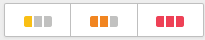
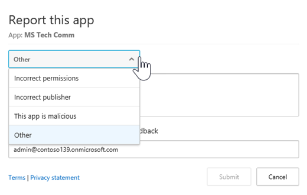

# Administrar aplicaciones de OAuth con Office 365 Cloud App SecurityManage OAuth apps using Office 365 Cloud App Security

|Evaluación **\>**\*\*\*\*Evaluation\*\* \>\*\*|Planeación de **\>**\*\*\*\*Planning\*\* \>\*\*|Implementación **\>**\*\*\*\*Deployment\*\* \>\*\*|Utilización de \*\*\*\*\*\*\*Utilization\*\*\*\*|
|:-----|:-----|:-----|:-----|
|[Empezar a evaluarStart evaluating](office-365-cas-overview.md)   |[Comenzar a planearStart planning](get-ready-for-office-365-cas.md)   |[Iniciar la implementaciónStart deploying](turn-on-office-365-cas.md)   |¡Están aquí!You are here!    [Pasos siguientesNext steps](manage-app-permissions-in-ocas.md#nextsteps)   |
   
Personas love aplicaciones y descargue con frecuencia, especialmente las aplicaciones que la gente piense va a ahorrar tiempo al hacer que sea más fácil obtener en su trabajo o escuela información. Sin embargo, algunas aplicaciones potencialmente podrían ser un riesgo de seguridad para la organización, dependiendo de qué información tienen acceso a y cómo tratar esa información. Con la [Seguridad de la aplicación de nube de Office 365](office-365-cas-overview.md), si es un administrador global o de seguridad, puede administrar aplicaciones de OAuth para su organización. Puede ver las personas de aplicaciones están usando con datos de Office 365, ¿qué permisos de esas aplicaciones tienen y mucho más.People love apps and they download them often, especially apps that people think will save time by making it easier to get at their work or school information. However, some apps could potentially be a security risk to your organization, depending on what information they access and how they handle that information. With [Office 365 Cloud App Security](office-365-cas-overview.md), if you are a global or security administrator, you can manage OAuth apps for your organization. You can see the apps people are using with Office 365 data, what permissions those apps have, and more. 
  
En este artículo se describe dónde ir a la administración de aplicaciones de OAuth, cómo aprobar, prohibir o informar de una aplicación y cómo crear una consulta de la aplicación.This article describes where to go to manage OAuth apps, how to approve, ban, or report an app, and how to create an app query.
  
## Cómo encontrar la página de aplicaciones de administración de OAuthHow to find the Manage OAuth apps page

> [!NOTE]
> Aplicaciones de OAuth se administran en el portal de seguridad de la aplicación de nube de Office 365. Debe ser un administrador global o administrador de seguridad para llevar a cabo la siguiente tarea. Para obtener más información vea más [permisos en la seguridad de Office 365 &amp; centro de cumplimiento](permissions-in-the-security-and-compliance-center.md).OAuth apps are managed in the Office 365 Cloud App Security portal. You must be a global administrator or security administrator to perform the following task. To learn more see [Permissions in the Office 365 Security &amp; Compliance Center](permissions-in-the-security-and-compliance-center.md). 
  
1. Vaya a [https://protection.office.com](https://protection.office.com) e iniciar sesión con su cuenta de trabajo o escuela para Office 365. (Esto le llevará a la seguridad &amp; centro de cumplimiento.)Go to [https://protection.office.com](https://protection.office.com) and sign in using your work or school account for Office 365. (This takes you to the Security &amp; Compliance Center.) 
    
2. Vaya a **las alertas de** \> **avanzada de administrar las alertas**.Go to **Alerts** \> **Manage advanced alerts**.
    
3. Haga clic en (o puntee) **vaya a la seguridad de la aplicación de nube de Office 365**.Click (or tap) **Go to Office 365 Cloud App Security**.  **Nota**: si la seguridad de la aplicación de nube de Office 365 no está activado todavía, puede hacer que en esta página. Vea [prepararse para la seguridad de la aplicación de nube de Office 365](get-ready-for-office-365-cas.md).**NOTE**: If Office 365 Cloud App Security is not turned on yet, you can do that on this page. See [Get ready for Office 365 Cloud App Security](get-ready-for-office-365-cas.md). 
  
4. Elija **investigar** \> **aplicaciones de OAuth**.Choose **Investigate** \> **OAuth apps**.  
  
## Lo que verá en la página de aplicaciones de administración de OAuthWhat you'll see on the Manage OAuth apps page

En la siguiente tabla se describe los controles y las opciones disponibles en la página de aplicaciones de administración de OAuth.The following table describes the controls and options available on the Manage OAuth apps page.
  
|**Elemento****Item**|**Descripción****Description**|
|:-----|:-----|
|Icono básica en la barra de consulta de aplicaciónBasic icon in the app query bar    |Seleccione esta opción para cambiar a la vista avanzada.Select this to switch to the Advanced view.    (Si ve **básica**, está usando la vista avanzada)(If you see **Basic**, you are using the Advanced view)    |
|Icono avanzadas en la barra de consulta de aplicaciónAdvanced icon in the app query bar    |Seleccione esta opción para cambiar a la vista básica.Select this to switch to the Basic view.    (Si ve **Opciones avanzadas**, se utiliza la vista básica).(If you see **Advanced**, you are using the Basic view.)    |
|Abrir o cerrar todos los iconos de detalles en la lista de aplicacionesOpen or close all details icon in the app list    |Seleccione este icono para ver más o menos detalles acerca de cada aplicación.Select this icon to view more or fewer details about each app.    |
|Icono de exportación en la lista de aplicacionesExport icon in the app list    |Seleccione este icono para exportar un archivo CSV que contiene una lista de aplicaciones, el número de usuarios para cada aplicación, los permisos asociados con la aplicación, nivel de permisos, estado de la aplicación y usar nivel de la Comunidad.Select this icon to export a CSV file that contains a list of apps, number of users for each app, permissions associated with the app, permissions level, app state, and community use level.    |
|NombreName    |Utilícelo para ver el nombre de una aplicación, seleccione el nombre para ver más información, como su descripción, publisher, sitio Web de la aplicación e identificador de aplicación.Use this to see the name of an app. Select the name to view more information, such as its description, publisher, app website and app ID.    |
|Autorizado porAuthorized by    |Se usa para ver el número de usuarios ha autorizado una aplicación para tener acceso a su cuenta de Office 365. Seleccione el número para ver más información, como una lista de cuentas de usuario.Use this to see how many users have authorized an app to access their Office 365 account. Select the number to view more information, such as a list of user accounts.    |
|Nivel de permisosPermissions Level    |Se usa para ver el nivel de acceso una aplicación tiene a los datos de Office 365. Los niveles de permisos indican **bajo**, **medio**o **alto**, donde **bajo** podría indicar que la aplicación sólo tiene acceso a perfiles y el nombre de un usuario. Seleccione el nivel para ver más información, como los permisos concedidos a la aplicación, el uso de la Comunidad y la actividad relacionada en el [registro de gobierno](suspend-or-restore-an-account-in-ocas.md).Use this to see how much access an app has to Office 365 data. Permissions levels indicate **Low**, **Medium**, or **High**, where **Low** might indicate that the app only accesses a user's profile and name. Select the level to view more information, such as permissions granted to the app, community use, and related activity in the [Governance log](suspend-or-restore-an-account-in-ocas.md).    |
|Autorizado por última vezLast authorized   |Se usa para ver la fecha y hora de que una aplicación de OAuth por última vez se ha autorizado para tener acceso a datos de Office 365 de su organización.Use this to see the date and time an OAuth app was last authorized to access your organization's Office 365 data.    |
|AccionesActions   |Use esta opción para ver o para marcar una aplicación como aprobado o expulsados, informar de una aplicación de OAuth a Microsoft, o deje como indeterminado.Use this to see or to mark an app as Approved or Banned, report an OAuth app to Microsoft, or leave it as undetermined.    |
   
## Marcar una aplicación como aprobadosMark an app as approved

En la página **aplicaciones de administración de OAuth** , busque la aplicación que desee aprobar y elija el icono **aplicación marca como aprobada** .On the **Manage OAuth apps** page, locate the app you want to approve, and choose the **Mark app as approved** icon. 
  

  
El icono se vuelve verde y la aplicación está aprobada para todos los usuarios de Office 365.The icon turns green, and the app is approved for all your Office 365 users.
  
> [!NOTE]
> Cuando una aplicación se marca como aprobados, no hay ningún efecto en el usuario final. Marcar visualmente las aplicaciones que están aprobadas ayuda a separarlas desde aplicaciones que aún no se han revisado todavía.When you mark an app as approved, there is no effect on the end user. Visually marking the apps that are approved helps to separate them from apps that haven't been reviewed yet. 
  
## Expulsar a una aplicaciónBan an app

1. En la página **aplicaciones de administración de OAuth** , busque la aplicación que desea prohibir y elija el icono **aplicación marcar como no permitidas** .On the **Manage OAuth apps** page, locate the app you want to ban, and choose the **Mark app as banned** icon. 
  
2. En el cuadro de mensaje de notificación, mantener el texto existente tal cual o personalizar el texto. Elija si desea que los usuarios sepan que se ha prohibido su aplicación.In the notification message box, keep the existing text as it is, or customize the text. Choose whether to let users know that their app has been banned.   
  
3. Elija la **aplicación de prohibición**.Choose **Ban app**.

## Informar a Microsoft de una aplicación de OAuthReport an OAuth app to Microsoft

Si desea enviar una aplicación de OAuth a Microsoft para su análisis, puede informar de esa aplicación.If you want to submit an OAuth app to Microsoft for analysis, you can report that app.

1. En la página **aplicaciones de administración de OAuth** , busque la aplicación que desea enviar para su análisis.On the **Manage OAuth apps** page, locate the app you want to submit for analysis.

2. Elija el botón de puntos suspensivos vertical y, a continuación, elija **informe App...**.Choose the vertical ellipsis, and then choose **Report app...**.  

3. En el cuadro de diálogo **informe de esta aplicación** , use la lista desplegable para indicar su preocupación. De forma predeterminada, está seleccionada **esta aplicación es malintencionada** . Sin embargo, puede elegir en una de las otras opciones disponibles.In the **Report this app** dialog box, use the drop-down list to indicate your concern. By default, **This app is malicious** is selected. However, you can choose on one of the other available options.   

4. (Recomendado) Mantenga la opción ponerse en contacto con el que ha seleccionado, y confirme la dirección de correo electrónico que aparecen (o editar).(Recommended) Keep the option to contact you selected, and confirm (or edit) the email address listed.

5. Elija **Enviar**.Choose **Submit**. 
    
## Crear una consulta de aplicaciónCreate an app query

Se recomienda usar la vista avanzada, que tiene este aspecto:We recommend using the Advanced view, which looks like this: 

En la barra de consulta de la aplicación, si ve **Opciones avanzadas**, está utilizando la vista básica. Haga clic en **Avanzadas** para ir a la vista avanzada (o puntee).In the app query bar, if you see **Advanced**, you're using the Basic view. Click (or tap) **Advanced** to go to the Advanced view. 

    
1. En la barra de la consulta, use la lista **Seleccione un filtro** para elegir una opción.In the query bar, use the **Select a filter** list to choose an option. 
    - **Aplicación** Aplicaciones con algunos nombres**App** Apps with certain names
    - **Estado de la aplicación** Aplicaciones en función de su estado (aprobado, expulsados o sin determinar)**App state** Apps based on their state (Approved, Banned, or Undetermined)
    - **Use la Comunidad** En función de la Comunidad de aplicaciones utilizan niveles (raras, Uncommon o común)**Community use** Apps based on community use levels (Rare, Uncommon, or Common)
    - **Nivel de permisos** En función de determinados niveles de permisos de aplicaciones**Permission level** Apps based on certain permission levels 
    - **Permisos** Aplicaciones que requieren determinados permisos**Permissions** Apps that require certain permissions
    - **Publisher**  Aplicaciones de ciertos editores**Publisher**  Apps from certain publishers
    - **Usuario** Aplicaciones que un usuario determinado autorizado**User** Apps that a certain user authorized
   
2. Seleccione **es igual a** o **no es igual a**y, a continuación, especifique un valor para el filtro.Select **equals** or **does not equal**, and then specify a value for your filter.
    
3. Para agregar más filtros, seleccione el signo más)To add more filters, select the plus sign () y, a continuación, repita los pasos 2 y 3.), and then repeat steps 2 and 3.
    
4. Para quitar un filtro, seleccione la x (To remove a filter, select the x () junto a un nombre de filtro.) next to a filter name.
    
Los filtros se aplican automáticamente, y la lista de aplicaciones se actualiza en consecuencia.The filters are applied automatically, and the apps list is updated accordingly.
  
## Siguientes pasosNext steps

- [Revisar y realizar acciones en las alertasReview and take action on alerts](review-office-365-cas-alerts.md)
    
- Revise los [registros de tráfico Web y orígenes de datos de seguridad de la aplicación de nube de Office 365](web-traffic-logs-and-data-sources-for-ocas.md)Review your [Web traffic logs and data sources for Office 365 Cloud App Security](web-traffic-logs-and-data-sources-for-ocas.md)
    
- Revise las [actividades de uso para la seguridad de la aplicación de nube de Office 365](utilization-activities-for-ocas.md)Review your [utilization activities for Office 365 Cloud App Security](utilization-activities-for-ocas.md)
    

