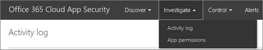
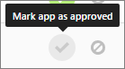

# Administrar permisos de aplicación con Office 365 Cloud App SecurityManage app permissions using Office 365 Cloud App Security

Administración avanzada de seguridad de Office 365 es ahora de seguridad de la aplicación de nube de Office 365.Office 365 Advanced Security Management is now Office 365 Cloud App Security.
  
|Evaluación **\>******Evaluation** \>**|Planeación de **\>******Planning** \>**|Implementación **\>******Deployment** \>**|Utilización de \*\*\*****Utilization****|
|:-----|:-----|:-----|:-----|
|[Empezar a evaluarStart evaluating](office-365-cas-overview.md)   |[Comenzar a planearStart planning](get-ready-for-office-365-cas.md)   |[Iniciar la implementaciónStart deploying](turn-on-office-365-cas.md)   |¡Están aquí!You are here!    [Pasos siguientesNext steps](manage-app-permissions-in-ocas.md#nextsteps)   |
   
Personas love aplicaciones y descargue con frecuencia, especialmente las aplicaciones que la gente piense va a ahorrar tiempo al hacer que sea más fácil obtener en su trabajo o escuela información. Sin embargo, algunas aplicaciones potencialmente podrían ser un riesgo de seguridad para la organización, dependiendo de qué información tienen acceso a y cómo tratar esa información. Con la [Seguridad de la aplicación de nube de Office 365](office-365-cas-overview.md), si es un administrador global o de seguridad, puede administrar los permisos de aplicación para su organización. Puede ver las personas de aplicaciones están usando con datos de Office 365, ¿qué permisos de esas aplicaciones tienen y mucho más.People love apps and they download them often, especially apps that people think will save time by making it easier to get at their work or school information. However, some apps could potentially be a security risk to your organization, depending on what information they access and how they handle that information. With [Office 365 Cloud App Security](office-365-cas-overview.md), if you are a global or security administrator, you can manage app permissions for your organization. You can see the apps people are using with Office 365 data, what permissions those apps have, and more. 
  
En este artículo se describe dónde debe acudir para administrar los permisos de la aplicación, cómo aprobar o prohibir una aplicación y cómo crear una consulta de la aplicación.This article describes where to go to manage app permissions, how to approve or ban an app, and how to create an app query.
  
## Cómo encontrar la página de permisos de aplicación de administrarHow to find the Manage app permissions page

> [!NOTE]
> Permisos de aplicación se administran en el portal de seguridad de la aplicación de nube de Office 365. Debe ser un administrador global o administrador de seguridad para llevar a cabo la siguiente tarea. Para obtener más información vea más [permisos en la seguridad de Office 365 &amp; centro de cumplimiento](permissions-in-the-security-and-compliance-center.md).App permissions are managed in the Office 365 Cloud App Security portal. You must be a global administrator or security administrator to perform the following task. To learn more see [Permissions in the Office 365 Security &amp; Compliance Center](permissions-in-the-security-and-compliance-center.md). 
  
1. Vaya a [https://protection.office.com](https://protection.office.com) e iniciar sesión con su cuenta de trabajo o escuela para Office 365. (Esto le llevará a la seguridad &amp; centro de cumplimiento.)Go to [https://protection.office.com](https://protection.office.com) and sign in using your work or school account for Office 365. (This takes you to the Security &amp; Compliance Center.) 
    
2. Vaya a **las alertas de** \> **avanzada de administrar las alertas**.Go to **Alerts** \> **Manage advanced alerts**.
    
3. Haga clic en (o puntee) **vaya a la seguridad de la aplicación de nube de Office 365**.Click (or tap) **Go to Office 365 Cloud App Security**.
    
    
  
    > [!NOTE]
    > Si la seguridad de la aplicación de nube de Office 365 no está activado todavía, puede hacer en esta página. Vea [prepararse para la seguridad de la aplicación de nube de Office 365](get-ready-for-office-365-cas.md).If Office 365 Cloud App Security is not turned on yet, you can do that on this page. See [Get ready for Office 365 Cloud App Security](get-ready-for-office-365-cas.md). 
  
4. Elija **investigar** \> **permisos de aplicación**.Choose **Investigate** \> **App permissions**.
    
    
  
## Lo que verá en la página de permisos de aplicación de administrarWhat you'll see on the Manage app permissions page

En la siguiente tabla se describe los controles y las opciones disponibles en la página de permisos de aplicación de administrar.The following table describes the controls and options available on the Manage app permissions page.
  
|**Elemento****Item**|**Descripción****Description**|
|:-----|:-----|
|Icono básica en la barra de consulta de aplicaciónBasic icon in the app query bar    |Seleccione esta opción para cambiar a la vista avanzada.Select this to switch to the Advanced view.    (Si ve **básica**, está usando la vista avanzada)(If you see **Basic**, you are using the Advanced view)    |
|Icono avanzadas en la barra de consulta de aplicaciónAdvanced icon in the app query bar    |Seleccione esta opción para cambiar a la vista básica.Select this to switch to the Basic view.    (Si ve **Opciones avanzadas**, se utiliza la vista básica).(If you see **Advanced**, you are using the Basic view.)    |
|Abrir o cerrar todos los iconos de detalles en la lista de aplicacionesOpen or close all details icon in the app list    |Seleccione este icono para ver más o menos detalles acerca de cada aplicación.Select this icon to view more or fewer details about each app.    |
|Icono de exportación en la lista de aplicacionesExport icon in the app list    |Seleccione este icono para exportar un archivo CSV que contiene una lista de aplicaciones, el número de usuarios para cada aplicación, los permisos asociados con la aplicación, nivel de permisos, estado de la aplicación y usar nivel de la Comunidad.Select this icon to export a CSV file that contains a list of apps, number of users for each app, permissions associated with the app, permissions level, app state, and community use level.    |
|NameName    |Utilícelo para ver el nombre de una aplicación, seleccione el nombre para ver más información, como su descripción, publisher, sitio Web de la aplicación e identificador de aplicación.Use this to see the name of an app. Select the name to view more information, such as its description, publisher, app website and app ID.    |
|Autorizado porAuthorized by    |Se usa para ver el número de usuarios ha autorizado una aplicación para tener acceso a su cuenta de Office 365. Seleccione el número para ver más información, como una lista de cuentas de usuario.Use this to see how many users have authorized an app to access their Office 365 account. Select the number to view more information, such as a list of user accounts.    |
|Nivel de permisosPermissions Level    |Se usa para ver el nivel de acceso una aplicación tiene a los datos de Office 365. Los niveles de permisos indican **bajo**, **medio**o **alto**, donde **bajo** podría indicar que la aplicación sólo tiene acceso a perfiles y el nombre de un usuario. Seleccione el nivel para ver más información, como los permisos concedidos a la aplicación, el uso de la Comunidad y la actividad relacionada en el [registro de gobierno](suspend-or-restore-an-account-in-ocas.md).Use this to see how much access an app has to Office 365 data. Permissions levels indicate **Low**, **Medium**, or **High**, where **Low** might indicate that the app only accesses a user's profile and name. Select the level to view more information, such as permissions granted to the app, community use, and related activity in the [Governance log](suspend-or-restore-an-account-in-ocas.md).    |
|Estado de la aplicación ( **expulsados**, **aprobado**o **sin determinar**)App state ( **Banned**, **Approved**, or **Undetermined**)    |Use esta opción para marcar una aplicación como aprobado o expulsados o deje como indeterminado.Use this to mark an app as Approved or Banned, or leave it as undetermined.    |
   
## Marcar una aplicación como aprobadosMark an app as approved

En la página **Administrar permisos de aplicación** , busque la aplicación que desee aprobar y elija el icono **aplicación marca como aprobada** .On the **Manage app permissions** page, locate the app you want to approve, and choose the **Mark app as approved** icon. 
  

  
El icono se vuelve verde y la aplicación está aprobada para todos los usuarios de Office 365.The icon turns green, and the app is approved for all your Office 365 users.
  
> [!NOTE]
> Cuando una aplicación se marca como aprobados, no hay ningún efecto en el usuario final. Marcar visualmente las aplicaciones que están aprobadas ayuda a separarlas desde aplicaciones que aún no se han revisado todavía.When you mark an app as approved, there is no effect on the end user. Visually marking the apps that are approved helps to separate them from apps that haven't been reviewed yet. 
  
## Expulsar a una aplicaciónBan an app

1. En la página **Administrar permisos de aplicación** , busque la aplicación que desea prohibir y elija el icono **aplicación marcar como no permitidas** .On the **Manage app permissions** page, locate the app you want to ban, and choose the **Mark app as banned** icon. 
    
    
  
2. Elija si desea que los usuarios sepan que se ha prohibido su aplicación.Choose whether to let users know that their app has been banned.
    
    (Recomendado) Para permitir que los usuarios sepan, seleccione **los usuarios de notificar quién conceden acceso a esta aplicación prohibido**y agregar o editar un mensaje de notificación personalizado.(Recommended) To let users know, select **Notify users who granted access to this banned app**, and add or edit a custom notification message.
    
    Para no permitir que los usuarios sepan, desactive **los usuarios de notificar quién conceden acceso a esta aplicación no permitida**.To not let users know, clear **Notify users who granted access to this banned app**.
    
    
  
3. Elija la **aplicación de prohibición**.Choose **Ban app**.
    
## Crear una consulta de aplicaciónCreate an app query

1. En la barra de consulta de aplicación, si ve **Opciones avanzadas**, haga clic en (o puntee) que vaya a la vista avanzada. (Si ve Basic, está utilizando la vista avanzada; mantener su vista como está).In the app query bar, if you see **Advanced**, click (or tap) it to go to the Advanced view. (If you see Basic, you are using the Advanced view; keep your view as it is.)
    
2. Use la lista **Seleccione un filtro** para elegir una opción. En la siguiente tabla se resume las opciones de filtrado disponibles.Use the **Select a filter** list to choose an option. The following table summarizes your available filter options. 
    
|**Use este filtro****Use this filter**|**Para mostrar****To display**|
|:-----|:-----|
|**Aplicación****App**   |Aplicaciones con algunos nombresApps with certain names    |
|**Estado de la aplicación****App state**   |Aplicaciones en función de su estado (aprobado, expulsados o sin determinar)Apps based on their state (Approved, Banned, or Undetermined)    |
|**Uso de la Comunidad****Community use**   |En función de la Comunidad de aplicaciones utilizan niveles (raras, Uncommon o común)Apps based on community use levels (Rare, Uncommon, or Common)    |
|**Nivel de permisos****Permission level**   |En función de determinados niveles de permisos de aplicacionesApps based on certain permission levels    |
|**Permisos****Permissions**   |Aplicaciones que requieren determinados permisosApps that require certain permissions    |
|**Publicador****Publisher**   |Aplicaciones de ciertos editoresApps from certain publishers    |
|**Usuario****User**   |Aplicaciones que un usuario determinado autorizadoApps that a certain user authorized    |
   
3. Seleccione **es igual a** o **no es igual a**y, a continuación, especifique un valor para el filtro.Select **equals** or **does not equal**, and then specify a value for your filter.
    
4. Para agregar más filtros, seleccione el signo más)To add more filters, select the plus sign () y, a continuación, repita los pasos 2 y 3.), and then repeat steps 2 and 3.
    
5. Para quitar un filtro, seleccione la x (To remove a filter, select the x () junto a un nombre de filtro.) next to a filter name.
    
Los filtros se aplican automáticamente, y la lista de aplicaciones se actualiza en consecuencia.The filters are applied automatically, and the apps list is updated accordingly.
  
## Pasos siguientesNext steps

- [Revisar y realizar acciones en las alertasReview and take action on alerts](review-office-365-cas-alerts.md)
    
- Revise los [registros de tráfico Web y orígenes de datos de seguridad de la aplicación de nube de Office 365](web-traffic-logs-and-data-sources-for-ocas.md)Review your [Web traffic logs and data sources for Office 365 Cloud App Security](web-traffic-logs-and-data-sources-for-ocas.md)
    
- Revise las [actividades de uso para la seguridad de la aplicación de nube de Office 365](utilization-activities-for-ocas.md)Review your [utilization activities for Office 365 Cloud App Security](utilization-activities-for-ocas.md)
    

