# Usar el Administrador de cumplimiento para satisfacer los requisitos normativos y de protección de datos al usar los Servicios en la nube de Microsoft

 *El Administrador de cumplimiento no está disponible en Office 365 ofrecido por 21Vianet, Office 365 Germany, Office 365 U.S. Government Community High (GCC High) u Office 365 Department of Defense.* 
  
El Administrador de cumplimiento, una herramienta de evaluación de riesgos basada en flujo de trabajo en el [Portal de confianza de servicios](https://support.office.com/article/f30e2353-0bd6-41ed-8347-eea1fb8d2662) de Microsoft, le permite realizar un seguimiento, asignar y verificar las actividades de cumplimiento reglamentario de su organización en relación con los Servicios profesionales de Microsoft y los Servicios en la nube de Microsoft, como Microsoft Office 365, Microsoft Dynamics 365 y Microsoft Azure. 

Administrador de cumplimiento:
  
- Combina la información detallada proporcionada por Microsoft a auditores y entidades reguladoras como parte de distintas auditorías de terceros de los Servicios en la nube de Microsoft en relación con distintas normas (como ISO 27001, ISO 27018 y NIST) e información que Microsoft recopila internamente para su cumplimiento con reglamentos (como HIPAA y el Reglamento general de protección de datos de la UE o RGPD) con su propia autoevaluación del cumplimiento de su organización de estas normas y reglamentos.
    
- Le permite asignar, realizar un seguimiento y registrar actividades relacionadas con evaluaciones y cumplimiento, lo que puede ayudar a su organización a cruzar las barreras de los equipos para alcanzar los objetivos de cumplimiento.
    
- Proporciona una puntuación de cumplimiento para realizar un seguimiento de su progreso y priorizar los controles de auditoría que permitirán reducir la exposición a los riesgos de su organización.
    
- Proporciona un repositorio seguro para que pueda cargar y administrar evidencias y otros artefactos relacionados con sus actividades de cumplimiento.
    
- Proporciona informes detallados enriquecidos en Microsoft Excel donde se documentan las actividades de cumplimiento realizadas por Microsoft y su organización, y que pueden proporcionarse a auditores, entidades reguladoras y otras partes interesadas de cumplimiento.

Para ver una breve demostración del Administrador de cumplimiento, vea el vídeo [Administrador de cumplimiento](https://www.youtube.com/watch?v=r1vs8NdSXKQ).

    
> [!IMPORTANT]
> El Administrador de cumplimiento es un panel que proporciona un resumen de su nivel de cumplimiento y protección de datos, así como recomendaciones para mejorar el cumplimiento y la protección de datos. Las acciones de cliente proporcionadas en el Administrador de cumplimiento son recomendaciones; cada organización necesita evaluar la efectividad de estas recomendaciones en su respectivo entorno reglamentario antes de la implementación. Las recomendaciones que aparecen en el Administrador de cumplimiento no han que interpretarse como una garantía de cumplimiento.

    
## ¿Qué es el Administrador de cumplimiento?

El Administrador de cumplimiento es una herramienta de evaluación de riesgos basada en flujo de trabajo diseñada para ayudarle a administrar el cumplimiento reglamentario dentro del modelo de responsabilidad compartida de la nube. El Administrador de cumplimiento proporciona un panel con una vista de normas y reglamentos, así como evaluaciones que contienen detalles de la implementación de controles de Microsoft, resultados de pruebas, una guía para la implementación de controles de cliente y seguimiento que su organización puede usar. El Administrador de cumplimiento ofrece definiciones de controles de evaluación de certificaciones, una guía para la implementación y prueba de controles, puntuaciones de ponderación de riesgos de controles, administración de acceso basado en roles y flujo de trabajo de asignación de acciones de control integrado para realizar un seguimiento de la implementación de controles, el estado de las pruebas y la administración de evidencias. El Administrador de cumplimiento optimiza la carga de trabajo de cumplimiento, ya que permite a los clientes agrupar evaluaciones de forma lógica y aplicar pruebas de controles de evaluación en controles idénticos o relacionados, lo que reduce la duplicación del esfuerzo que, de otra forma, podría ser necesario para satisfacer requisitos de control idénticos en distintas certificaciones.

## Evaluaciones en el Administrador de cumplimiento

El componente principal del Administrador de cumplimiento se denomina una *evaluación*. Se trata de una evaluación de un servicio Microsoft en relación con una norma de certificación o un reglamento de protección de datos (como ISO 27001:2013 y el RGPD). Las evaluaciones le permiten conocer la posición ante el cumplimiento y la protección de datos de su organización en relación con la norma del sector seleccionada para el servicio en la nube de Microsoft correspondiente. Las evaluaciones se completan mediante la implementación de los controles que se asignan con la norma de certificación evaluada. 
  
La estructura de una evaluación se basa en la responsabilidad compartida entre Microsoft y su organización para evaluar riesgos de seguridad y cumplimiento en la nube, así como para implementar las medidas de protección de datos especificadas por una norma de cumplimiento, una norma de protección de datos, un reglamento o una ley.
  
Una evaluación está formada por varios componentes:
  
- **Servicios dentro del ámbito**: cada evaluación se aplica a un conjunto específico de servicios Microsoft, que se indican en la sección Servicios en la nube dentro del ámbito. 
    
- **Controles administrados de Microsoft**: por cada servicio en la nube, Microsoft implementa y administra un conjunto de *controles* como parte del cumplimiento de Microsoft de varias normas y reglamentos. Estos controles se organizan en *familias de controles* que se alinean con la estructura de la certificación o reglamento que se corresponda con la evaluación. Por cada control administrado por Microsoft, el Administrador de cumplimiento proporciona detalles sobre cómo Microsoft implementó el control, además de información sobre cómo y cuándo un auditor externo independiente aprobó y validó esa implementación. 
    
    Este es un ejemplo de tres controles administrados por Microsoft en la familia de controles **Seguridad** de una evaluación de Office 365 y RGPD. 

    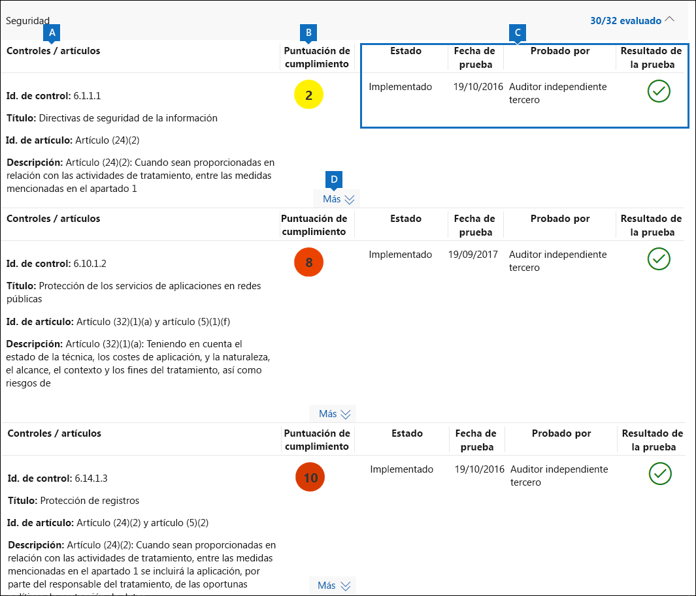
  
  a. Especifica la siguiente información de la certificación o reglamento asignado al control administrado por Microsoft.

  - **Id. de control**: el número de artículo o sección de la certificación o reglamento al que se asigna el control.
    
  - **Título**: el título de la certificación o reglamento correspondiente.
    
  - **Id. de artículo**: este campo solo se incluye para evaluaciones del RGPD y especifica el número de artículo del RGPD correspondiente.
    
  - **Descripción**: texto de la norma o reglamento que se asigna al control administrado por Microsoft seleccionado.

  b. La puntuación de cumplimiento para el control, que indica el nivel de riesgo (debido al incumplimiento o error de control) asociado a cada control administrado por Microsoft. Para obtener más información, vea [Información sobre la puntuación de cumplimiento](#understanding-the-compliance-score). Tenga en cuenta que las puntuaciones de cumplimiento se califican de 1 a 10 y se codifican mediante colores. El color amarillo indica controles de riesgo bajo, el naranja indica controles de riesgo medio y el rojo indica controles de riesgo alto. 
    
  c. Información sobre el estado de la implementación de un control, la fecha en que se probó el control, quién realizó la prueba y el resultado de la prueba.
    
  d. Por cada control, puede hacer clic en **Más** para ver información adicional, como detalles sobre la implementación de Microsoft del control y detalles sobre cómo un auditor externo independiente probó y validó el control. 
    
- **Controles administrados por el cliente**: esta es la colección de controles administrados por su organización. Su organización es responsable de implementar estos controles como parte de su proceso de cumplimiento para una norma o reglamento específicos. Los controles administrados por el cliente también se organizan en familias de controles para la certificación o reglamento correspondientes. Use los controles administrados por el cliente para implementar las acciones recomendadas sugeridas por Microsoft como parte de sus actividades de cumplimiento. Su organización puede usar la guía prescriptiva y las acciones de cliente recomendadas en cada control administrado por el cliente para administrar el proceso de evaluación e implementación de dicho control.
    
    Los controles administrados por el cliente en las evaluaciones también tienen integrada una función de administración de flujos de trabajo que puede usar para administrar y realizar un seguimiento del progreso de su organización en relación con la finalización de la evaluación. Por ejemplo, un responsable de cumplimiento normativo de su organización puede asignar una acción a un administrador de TI que tenga la responsabilidad y los permisos necesarios para realizar las acciones recomendadas para el control. Cuando se complete ese control, el administrador de TI puede cargar evidencias de sus tareas de implementación (por ejemplo, capturas de pantalla de configuración u opciones de directiva) y, después, volver a asignar la acción al responsable de cumplimiento normativo para que evalúe las evidencias recopiladas, pruebe la implementación del control y registre la fecha de implementación y los resultados de pruebas en el Administrador de cumplimiento. Para obtener más información, vea la sección [Administrar el proceso de evaluación en el artículo](#managing-the-assessment-process). 
  
## Permisos y control de acceso basado en roles

De forma predeterminada, todos los usuarios de la organización con una cuenta de Office 365 o Azure AD tienen acceso al Administrador de cumplimiento y pueden realizar cualquier acción en el Administrador de cumplimiento. Para cambiar de los permisos predeterminados al modelo de control de acceso basado en roles, tiene que agregar como mínimo un usuario a cada rol del Administrador de cumplimiento (vea las instrucciones siguientes). Después de agregar un usuario a un rol, los permisos para realizar las acciones asignadas a ese rol se quitarán del conjunto predeterminado de permisos disponible para todos los usuarios, y solo los usuarios que tengan aprovisionado ese rol podrán obtener acceso al Administrador de cumplimiento y realizar las acciones permitidas por ese rol.
  
Después de implementar el acceso basado en roles, cualquier usuario que no esté asignado a un rol del Administrador de cumplimiento definido tendrá acceso de invitado.
  
> [!NOTE]
> Para implementar por completo el control de acceso basado en roles con el fin de administrar quién puede obtener acceso al Administrador de cumplimiento y realizar acciones en este, es necesario agregar un usuario a cada rol para cambiar los permisos predeterminados. Por ejemplo, si agrega un usuario al rol que permite a los usuarios administrar evaluaciones, solo los miembros de ese rol podrán administrar evaluaciones. De forma similar, si no agrega un usuario al rol que permite a los usuarios leer los datos en las evaluaciones, todos los usuarios de la organización podrán obtener acceso al Administrador de cumplimiento y leer los datos de cualquier evaluación. 
  
En la tabla siguiente, se describen los permisos del Administrador de cumplimiento y las acciones que permite realizar al usuario. En la tabla, también se indica el rol al que se asigna cada permiso.
  
||**Lector del Administrador de cumplimiento**|**Colaborador del Administrador de cumplimiento**|**Evaluador del Administrador de cumplimiento**|**Administrador del Administrador de cumplimiento**|**Administrador del portal**|
|:-----|:-----|:-----|:-----|:-----|:-----|
|**Leer datos**: los usuarios pueden leer datos, pero no pueden editarlos.    |             |             |             |             |             |
|**Editar datos**: los usuarios pueden editar todos los campos, excepto “Resultado de la prueba” y “Fecha de la prueba”.    ||             |             |             |             |
|**Editar resultados de pruebas**: los usuarios pueden editar los campos “Resultado de la prueba” y “Fecha de la prueba”.    |||             |             |             |
|**Administrar evaluaciones**: los usuarios pueden crear, archivar y eliminar evaluaciones.    ||||             |             |
|**Administrar usuarios**: los usuarios pueden agregar a otros usuarios de su organización a los roles Lector, Colaborador, Evaluador y Administrador. Solo los usuarios con el rol Administrador global de su organización pueden agregar o quitar usuarios del rol Administrador del portal.    |||||             |
   
### Acceso de invitado
  
Después de configurar el acceso del Administrador de cumplimiento, se le asignará de forma predeterminada el rol **Acceso de invitado** a los usuarios que no tengan aprovisionado un rol (que también es la experiencia de cualquier cuenta no aprovisionada por la organización, como las cuentas Microsoft personales). Los usuarios con acceso de invitado no pueden obtener acceso a todas las características del Administrador de cumplimiento ni pueden ver los datos de evaluación de cumplimiento de la organización, pero pueden usar el Administrador de cumplimiento para ver los informes de evaluación de cumplimiento de Microsoft y los documentos de Confianza de servicios. En las imágenes siguientes, puede ver lo que es accesible y lo que no (las características accesibles tienen un contorno azul y las características inaccesibles tienen un contorno rojo). 
  
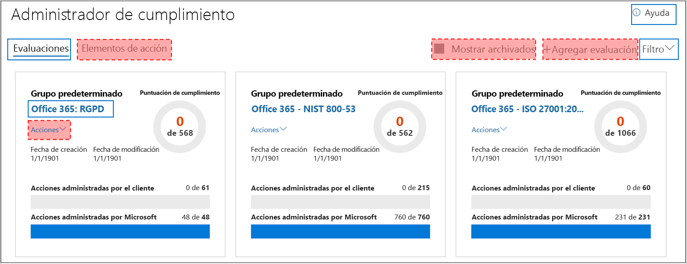
  
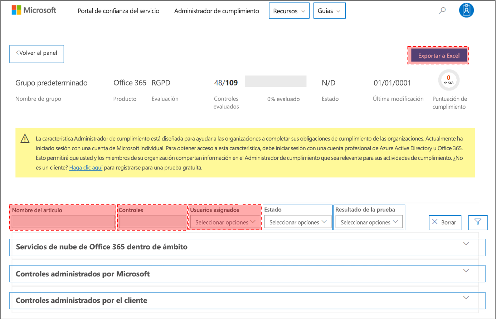

## Información sobre la puntuación de cumplimiento

En el panel, en el Administrador de cumplimiento se muestra una puntuación total de las evaluaciones de Office 365 en la esquina superior derecha del icono. Esta es la puntuación de cumplimiento total general para la evaluación, que es la suma de los puntos recibidos por cada evaluación de control marcada como implementada y probada en la evaluación. Al agregar una evaluación, verá que la puntuación de cumplimiento se encuentra en proceso de finalización porque ya se aplicaron los puntos para los controles administrados por Microsoft implementados y probados por terceras partes independientes.
  
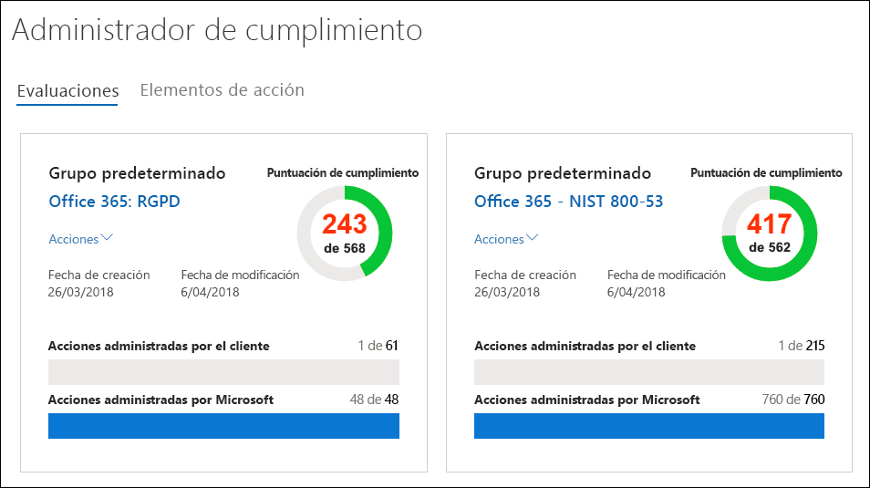
  
Los puntos restantes provienen de la evaluación correcta de controles de cliente y de la implementación y prueba de los controles administrados por el cliente, cada uno con un valor específico que contribuye a la puntuación de cumplimiento global. 
  
En cada evaluación, se muestra una puntuación de cumplimiento basada en riesgos para ayudarle a evaluar el nivel de riesgo (debido al incumplimiento o errores de control) asociado a cada control (incluidos los controles administrados por Microsoft y los controles administrados por el cliente) de una evaluación. Cada control administrado por el cliente tiene asignado un número de puntos posibles (que se denomina una *clasificación de gravedad*) en una escala del 1 al 10, donde se conceden más puntos a los controles asociados a un mayor factor de riesgo si estos producen errores, y menos puntos a controles con menor riesgo. 
  
Por ejemplo, el control de evaluación “Administración de acceso de usuario” que se muestra abajo tiene una clasificación de riesgo de gravedad muy alta y se muestra un valor asignado de 10.
  
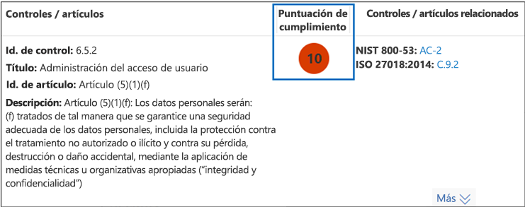
  
 En comparación, el control de evaluación “Copia de seguridad de la información” que se muestra abajo tiene una clasificación de riesgo de gravedad inferior y se muestra con un valor asignado de 3. 
  
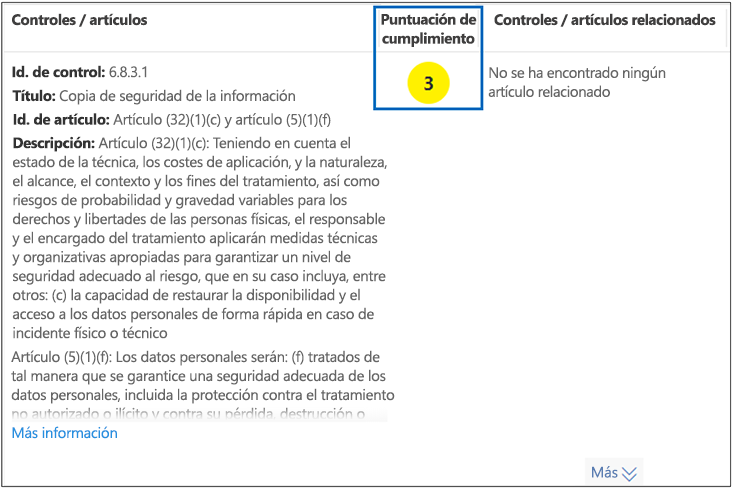
  
El Administrador de cumplimiento asigna una clasificación de gravedad predeterminada a cada control. Las clasificaciones de riesgos se calculan basándose en los criterios siguientes:
  
- Si un control impide que ocurran incidentes (clasificación superior), detecta incidentes que ocurrieron o corrige el impacto de un incidente (clasificación inferior). En términos de clasificación de gravedad, un control que impide una amenaza y es obligatorio tiene asignado el mayor número de puntos; los controles que son de investigación o correctivos (independientemente de que sean obligatorios o discrecionales) tienen asignado el número inferior de puntos.
    
- Si un control (después de su implementación) es obligatorio y, por lo tanto, los usuarios no pueden omitirlo (por ejemplo, usuarios que tengan que restablecer la contraseña y que esta cumpla con requisitos de caracteres y longitud); o bien si un control es discrecional y los usuarios pueden omitirlo (por ejemplo, reglas empresariales que obligan a los usuarios a bloquear la pantalla cuando dejan el equipo sin supervisión).
    
- Controles relacionados con riesgos de disponibilidad, integridad y confidencialidad de los datos, si estos riesgos provienen de amenazas internas o externas, y si la amenaza es malintencionada o accidental. Por ejemplo, los controles que impedirían que un atacante externo se introduzca en la red y obtenga acceso a información de identificación personal tendrían asignados más puntos que un control relacionado con impedir que un empleado configure por error un parámetro del enrutador de red que produzca una interrupción de la red.
    
- Los riesgos relacionados con factores externos y jurídicos de cada control, como contratos, reglamentos y compromisos públicos.
    
Los valores de puntuación de cumplimiento para el control se aplican *en su totalidad* en la puntuación de cumplimiento total basándose en una operación correcta o error (si el control se implementa y se completa correctamente la prueba de evaluación posterior o si no lo hace; no existe un crédito parcial para una implementación parcial). Solo se agregarán los puntos asignados a la puntuación de cumplimiento total cuando el **Estado de la implementación** del control se establezca en **Implementado** o **Implementación alternativa**, y el **Resultado de la prueba** se establezca en **Correcto**. 
  
Aún más importante, la puntuación de cumplimiento puede ayudarle a priorizar los controles en los que centrarse para la implementación, ya que indican los que tienen un mayor posible riesgo si se produce un error relacionado con un control. Además de la priorización basada en riesgos, cabe destacar que, aunque los controles de evaluación están relacionados con otros controles (ya sea dentro de la misma evaluación u otra evaluación que se encuentre en la misma agrupación de evaluaciones), completar un único control correctamente puede dar como resultado una reducción importante del esfuerzo basándose en la sincronización de los resultados de pruebas de control.
  
Por ejemplo, en la imagen siguiente, la evaluación “Office 365: RGPD” se completó al 46 %, con 51 de 111 evaluaciones de control completadas para una puntuación de cumplimiento total de 289 de un máximo posible de 600.
  
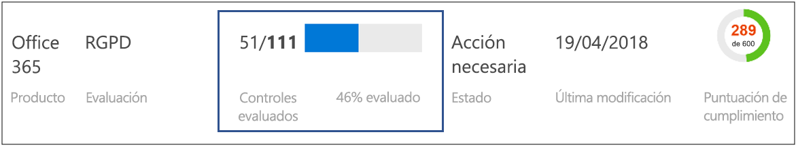
  
En la evaluación, el control del RGPD 7.5.5 está relacionado con otros cinco controles (7.4.1, 7.4.3, 7.4.4, 7.4.8 y 7.4.9), cada uno con una puntuación de clasificación de riesgos de gravedad moderada a alta de 6 u 8. Con el filtro de evaluación, seleccionamos todos estos controles y se muestran en la vista de evaluación; pero, como puede comprobar abajo, no se evaluó ninguno de ellos. 
  
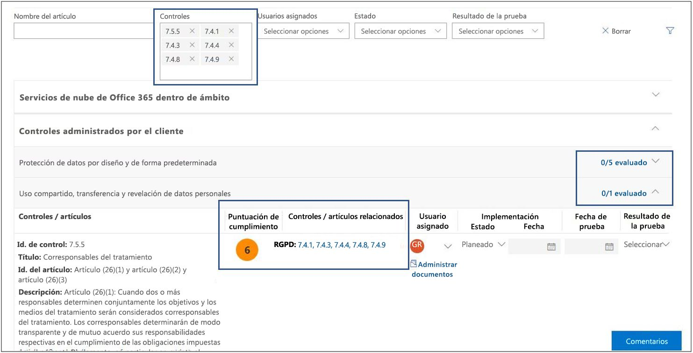 Como los seis controles están relacionados, al finalizar alguno de ellos, se sincronizarán esos resultados de pruebas en todos los controles relacionados de esta evaluación (así como en todos los controles relacionados en una evaluación que se encuentre en la misma agrupación de evaluaciones). Al finalizar la implementación y las pruebas del control 7.5.5 del RGPD, el área de detalle del control se actualiza para indicar que se evaluaron los seis controles, con un incremento correspondiente en el número de controles evaluados hasta 57 y el 51 % evaluados, y un cambio en la puntuación de cumplimiento total de +40. 
  
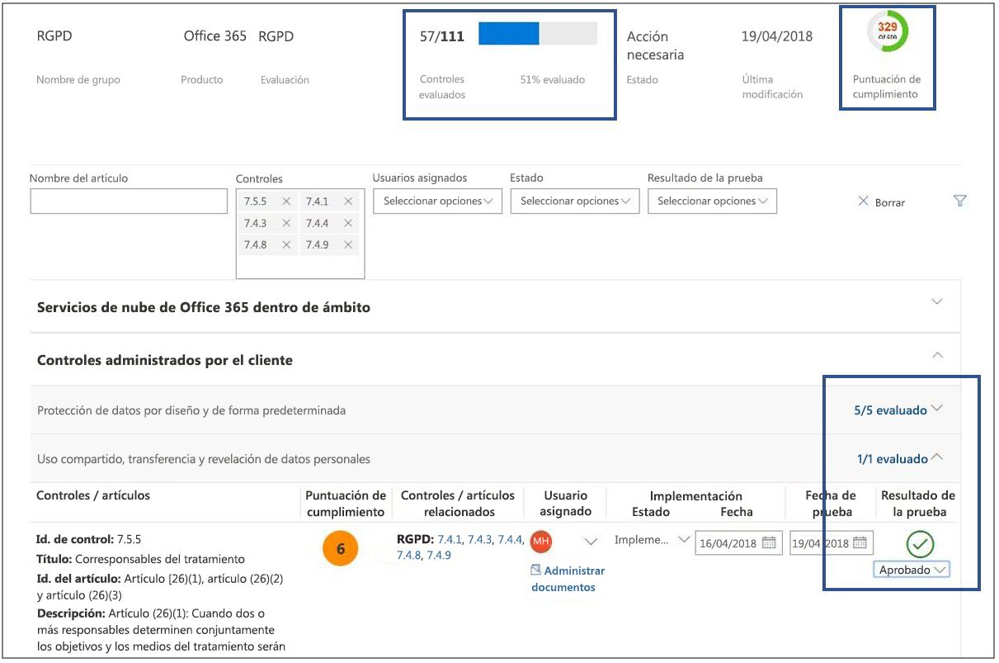
  
Este cuadro de diálogo de confirmación de la actualización se mostrará si va a cambiar el estado de la implementación de un control relacionado de forma que afecte al resto de los controles relacionados.
  
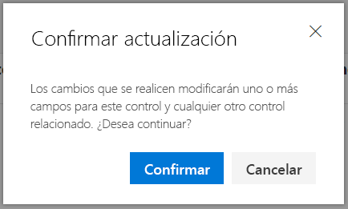
  
> [!NOTE]
> Actualmente, solo se incluye una puntuación de cumplimiento en las evaluaciones para los servicios en la nube de Office 365. En las evaluaciones para Azure y Dynamics, se muestra un estado de evaluación. 

## Metodología de puntuación de cumplimiento

La puntuación de cumplimiento, al igual que Microsoft Secure Score, es similar a otros sistemas de puntuación basada en el comportamiento; la actividad de su organización puede incrementar su puntuación de cumplimiento si realiza actividades relacionadas con la seguridad, privacidad y protección de datos.
  
> [!NOTE]
> La puntuación de cumplimiento no indica una medida absoluta de cumplimiento organizativo con cualquier norma o reglamento específico. Expresa el alcance hasta el que se adoptaron controles que pueden reducir los riesgos en la privacidad individual y los datos personales. Ningún servicio puede garantizar que cumpla con una norma o reglamento y, además, la puntuación de cumplimiento no puede interpretarse como una garantía en ningún caso. 
  
Las evaluaciones del Administrador de cumplimiento se basan en el modelo de responsabilidad compartida para la informática en la nube. En el modelo de responsabilidad compartida, Microsoft y cada cliente comparten la responsabilidad para la protección de los datos de los clientes cuando los datos se almacenan en nuestra nube.
  
Como se muestra en la evaluación del RGPD de Office 365 siguiente, tanto Microsoft como los clientes son responsables de realizar una amplia variedad de acciones diseñadas para satisfacer los requisitos de la norma o reglamento evaluado. Para justificar y comprender las acciones necesarias en una amplia variedad de normas y reglamentos, el Administrador de cumplimiento considera todas las normas y reglamentos como si fueran marcos de control. Por lo tanto, las acciones realizadas por Microsoft y los clientes para cada evaluación implican la implementación y validación de varios controles.
  

  
Este es el flujo de trabajo básico para una acción típica:
  
1. El responsable de cumplimiento, riesgo, privacidad o protección de datos de una organización asigna la tarea a un miembro de la organización para implementar un control. Esa persona puede ser:

    - Un propietario de la directiva de la empresa
    
    - Un implementador de TI
    
    - Otra persona de la organización que tenga responsabilidad para realizar la tarea
    
2. Esa persona realiza las tareas necesarias para implementar el control, carga evidencias de implementación en el Administrador de cumplimiento y marca como implementados los controles vinculados a la acción. Una vez completadas las tareas, asigna la acción a un evaluador para su validación. Los evaluadores pueden ser:
    
    - Evaluadores internos que realicen la validación de controles dentro de una organización.
    
    - Evaluadores externos que examinen, verifiquen y certifiquen el cumplimiento, como las organizaciones independientes de terceros que auditan los servicios en la nube de Microsoft.
    
3. El evaluador valida el control, examina las evidencias y marca los controles como evaluados, además de indicar los resultados de una evaluación (por ejemplo, correcta).
    
Después de evaluar todos los controles asociados con una evaluación, esta se considerará completada.
  
En cada evaluación del Administrador de cumplimiento, se carga previamente información que proporciona detalles sobre las acciones realizadas por Microsoft para cumplir con los requisitos de los controles de los que Microsoft es responsable. En esta información, se incluyen detalles sobre cómo Microsoft implementó cada control y cómo un auditor externo evaluó y verificó la implementación realizada por Microsoft. Por este motivo, los controles administrados por Microsoft para cada evaluación se marcan como evaluados y la puntuación de cumplimiento para la evaluación refleja esto.
  
En cada evaluación, se incluye una puntuación de cumplimiento total basada en el modelo de responsabilidad compartida. La implementación y prueba de controles para Office 365 realizada por Microsoft contribuye a una parte del total posible de puntos asociados a una evaluación del RGPD. Cuando el cliente implemente y pruebe cada una de las acciones de cliente, la puntuación de cumplimiento de la evaluación se incrementará por el valor asignado al control. 
  
 ### Metodología de puntuación basada en riesgos
  
El Administrador de cumplimiento usa una metodología de puntuación basada en riesgos con una escala de 1 a 10 que asigna un valor superior a los controles que representan un mayor riesgo en caso de que el control produzca errores o no cumpla los requisitos. El sistema de calificación usado por la puntuación de cumplimiento se basa en varios factores clave, como los siguientes:
  
- La esencia del control
    
- El nivel de riesgo del control basado en los tipos de amenazas
    
- Los factores externos del control
    
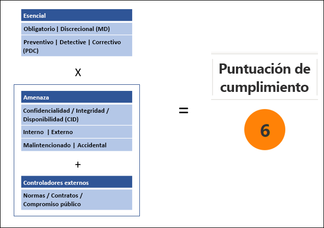
  
 ### Esencia del control
  
La esencia del control depende de si el control es obligatorio o discrecional, y si es preventivo, de investigación o correctivo.
  
 ### Obligatorio o discrecional
  
 Los *controles obligatorios* son controles que no se pueden omitir, ya sea de forma intencionada o por error. Un ejemplo de un control obligatorio común es una directiva de contraseñas administrada centralmente que establece requisitos de longitud, complejidad y expiración de contraseñas. Los usuarios tienen que cumplir con estos requisitos para obtener acceso al sistema. 
  
 Los *controles discrecionales* dependen de que los usuarios comprendan la directiva y actúen en consecuencia. Por ejemplo, una directiva que exija a los usuarios bloquear su equipo cuando lo dejen desatendido es un control discrecional, ya que depende del comportamiento del usuario. 
  
 ### Preventivo, de investigación o correctivo
  
 Los *controles preventivos* son los que impiden riesgos específicos. Por ejemplo, proteger la información en reposo con cifrado es un control preventivo frente a ataques, infracciones, etc. La separación de las responsabilidades es un control preventivo para administrar conflictos de intereses y proteger contra el fraude. 
  
 Los *controles de investigación* son aquellos que supervisan de forma activa los sistemas para identificar comportamientos o condiciones irregulares que representen un riesgo, o bien pueden usarse para detectar intrusiones o determinar si se produjo una infracción. La auditoría de acceso del sistema y la auditoría de acciones administrativas con privilegios elevados son tipos de controles de supervisión de investigación; las auditorías de cumplimiento reglamentario son un tipo de control identificativo usado para encontrar problemas de procesos. 
  
 Los *controles correctivos* son los que intentan contener los efectos adversos de un incidente de seguridad a un mínimo, realizar acciones correctivas para reducir el efecto inmediato y, si es posible, revertir los daños. Una respuesta a un incidente de privacidad es un control correctivo para limitar los daños y restaurar los sistemas a un estado operativo después de una infracción. 
  
Al evaluar cada control con estos factores, determinamos la esencia del control y le asignamos un valor relativo al riesgo que representa.
  
 **Amenaza**
  
||||
|:-----|:-----|:-----|
||**Obligatorio**   |**Discrecional**   |
|**Preventivo**   |Riesgo alto    |Riesgo medio    |
|**Investigación**   |Riesgo medio    |Riesgo bajo    |
|**Correctivo**   |Riesgo medio    |Riesgo bajo    |
   
Una amenaza hace referencia a cualquier acción que implica un riesgo para el estándar de seguridad básico y aceptado universalmente basado en tres factores: confidencialidad, integridad y disponibilidad:
  
- Confidencialidad significa que solo las partes autorizadas y de confianza pueden leer y comprender la información.
    
- Integridad quiere decir que partes no autorizadas no modificaron ni destruyeron la información.
    
- Disponibilidad quiere decir que puede obtener acceso a la información fácilmente con un nivel elevado de calidad de servicio.
    
Un error en cualquiera de estas características se considera un peligro para el sistema en su totalidad. Las amenazas pueden provenir tanto de orígenes internos como externos, y la intención del actor puede ser accidental o malintencionada. Estos factores se calculan en una matriz de amenazas que asigna niveles de amenaza alto, moderado o bajo a cada combinación de escenarios.

||**Interna** ||**Externa** ||||
|:-----|:-----|:-----|:-----|:-----|:-----|:-----|
||*Malintencionada* |*Accidental* |*Malintencionada* |*Accidental* |||
|**Confidencialidad** |(A, M o B)    |(A, M o B)    |(A, M o B)    |(A, M o B)|
|**Integridad** |(A, M o B)    |(A, M o B)    |(A, M o B)    |(A, M o B)|
|**Disponibilidad** |(A, M o B)    |(A, M o B)    |(A, M o B)    |(A, M o B)|
   
 **Factores externos**
  
|**Contratos**|**Reglamentos**|**Compromisos públicos**|
|:-----|:-----|:-----|
|(A, M o B)    |(A, M o B)    |(A, M o B)    |
   
Los factores externos (como los compromisos públicos, contratos y reglamentos vigentes) pueden afectar a los controles diseñados para proteger los datos e impedir infracciones de datos, y se asignan valores de riesgo alto, moderado o bajo a cada uno de estos factores.
  
El número estimado de repeticiones de estos valores de riesgo de alto, moderado o bajo en los 15 posibles escenarios de riesgos representados en la matriz de Estándar de seguridad/Amenaza y jurídico/factores externos se combinan para proporcionar una ponderación de riesgos, que tiene en cuenta la probabilidad y el número de repeticiones de riesgos con un valor asignado como importante, y se consideran al calcular la clasificación de gravedad del control.
  
Basándose en la clasificación de gravedad del control, se asignará un valor de puntuación de cumplimiento entre 1 (bajo) y 10 (alto), agrupados en las siguientes categorías de riesgos:
  
|**Nivel de riesgo**|**Valor del control**|
|:-----|:-----|
|Bajo    |1-3    |
|Moderado    |6    |
|Alto    |8    |
|Grave    |10    |
   
Al dar prioridad a los controles de evaluación con los valores de puntuación de cumplimiento más elevados, la organización se centrará en los elementos de mayor riesgo y recibirá una respuesta más positiva proporcionalmente, ya que se agregarán más puntos a la puntuación de cumplimiento total por la evaluación completada de cada control.
  
### Resumen de la metodología de puntuación
  
La puntuación de cumplimiento es un componente básico de la forma en que el Administrador de cumplimiento ayuda a las organizaciones a comprender y administrar su cumplimiento. La puntuación de cumplimiento de una evaluación es una expresión del cumplimiento de la compañía en relación con una norma o reglamento como un número que, cuanto mayor sea la puntuación (hasta el número máximo de puntos asignados para la evaluación), mejor será la posición ante el cumplimiento de la compañía. Comprender la metodología de puntuación de cumplimiento en la que se asignan valores de gravedad de riesgo entre 1 y 10 (de menor a mayor) a los controles de evaluación y cómo se suman las evaluaciones de control completadas a la puntuación de cumplimiento total es esencial para que las organizaciones puedan priorizar sus acciones.

## Agrupación de evaluaciones

Al crear una evaluación, se le pedirá que cree un grupo para asignar la evaluación, o bien que asigne la evaluación a un grupo existente. Los grupos le permiten organizar de forma lógica las evaluaciones y compartir información común y tareas de flujo de trabajo entre evaluaciones que tengan los mismos controles administrados por el cliente o controles relacionados.
  
Por ejemplo, puede agrupar evaluaciones por año, equipos, departamentos o agencias dentro de su organización. Estos son algunos ejemplos de grupos y las evaluaciones que pueden contener.
  
- Evaluaciones del RGPD: 2018
    
  - Office 365 + RGPD
    
  - Azure + RGPD
    
  - Dynamics + RGPD
    
- Evaluaciones de Azure: 2018
    
  - Azure + RGPD
    
  - Azure + ISO 27001:2013
    
  - Azure + ISO 27018:2014
    
- Evaluaciones de privacidad y seguridad de los datos
    
  - Office 365 + ISO 27001:2013
    
  - Office 365 + ISO 27018:2014
    
  - Azure + ISO 27001:2013
    
  - Azure + ISO 27018:2014
    
> [!TIP]
> Le recomendamos que determine una estrategia de agrupación para su organización antes de agregar nuevas evaluaciones. 
  
Estos son los requisitos para agrupar evaluaciones:
  
- Los nombres de grupo (también denominados *id. de grupo*) tienen que ser únicos en la organización. 
    
- Los grupos pueden contener evaluaciones para la misma certificación o reglamento, pero cada grupo solo puede contener una evaluación para par específico de certificación o servicio en la nube. Por ejemplo, un grupo no puede contener dos evaluaciones para Office 365 y el RGPD. De forma similar, un grupo puede contener varias evaluaciones para el mismo servicio en la nube, siempre que el reglamento o certificación correspondiente para cada uno sea distinto.
    
Después de agregar una evaluación a una agrupación de evaluaciones, la agrupación no se puede cambiar. Puede cambiar el nombre del grupo de evaluaciones, lo que cambiaría el nombre de la agrupación de evaluaciones de todas las evaluaciones asociadas a ese grupo. Puede crear una evaluación y un grupo de evaluaciones y copiar la información de una evaluación existente, lo que crearía un duplicado de esa evaluación en otro grupo de evaluaciones. Al archivar una evaluación, se interrumpe la relación entre la evaluación y el grupo de evaluaciones; las actualizaciones posteriores en otras evaluaciones relacionadas ya no se reflejarán en la evaluación archivada.
  
Como se explicó anteriormente, una de las ventajas clave de usar grupos es que, cuando dos evaluaciones distintas en el mismo grupo comparten el mismo control administrado por el cliente (y, por lo tanto, las acciones de cliente serían las mismas para cada control), la finalización de los detalles de la implementación, la información sobre pruebas y el estado del control de una evaluación se sincronizarían con el mismo control en el resto de las evaluaciones del grupo. Es decir, si las evaluaciones comparten el mismo control y se encuentran en el mismo grupo, solo es necesario administrar el proceso de evaluación del control en una de las evaluaciones. Los resultados de ese control se sincronizarán automáticamente con otras evaluaciones. Por ejemplo, las normas ISO 27001 e ISO 27018 tienen un control relacionado con las directivas de contraseña. Si el estado de la prueba del control se establece en “Correcto” en una evaluación, el control se actualizará (y se marcará como “Correcto”) en la otra evaluación, siempre que ambas evaluaciones pertenezcan al mismo grupo de evaluaciones.
  
A modo de ejemplo, tenga en cuenta estos dos controles de evaluación relacionados, ambos vinculados al cifrado de datos en redes públicas: el control 6.10.1.2 en la evaluación “Office 365: RGPD” y el control SC-13 en la evaluación “Office 365: NIST 800-53”. Se trata de controles de evaluación relacionados, en dos evaluaciones distintas, ambos en el grupo predeterminado; inicialmente, ninguna evaluación completó evaluaciones de control de cliente, como se muestra en el panel del Administrador de cumplimiento donde aparecen estas dos evaluaciones.
  
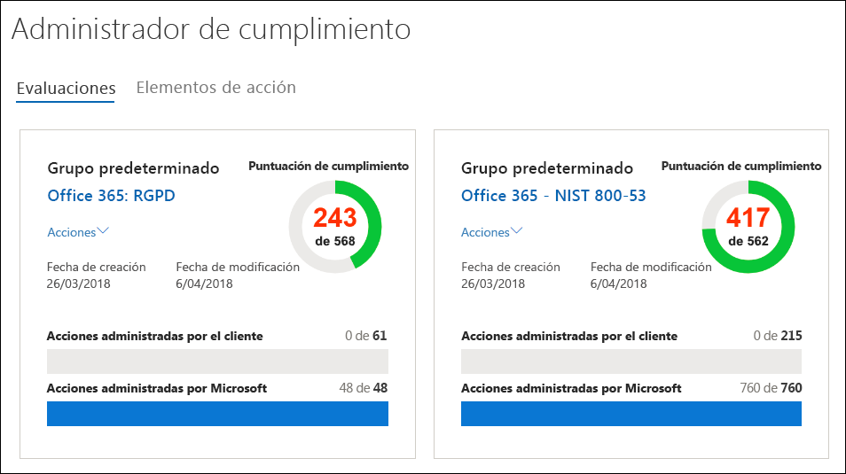
  
Al hacer clic en la evaluación **Office 365: RGPD** y usar los controles de filtro para ver el control del RGPD 6.10.1.2, vemos que el control SC-13 de NIST 800-53 se muestra como un control relacionado.
  
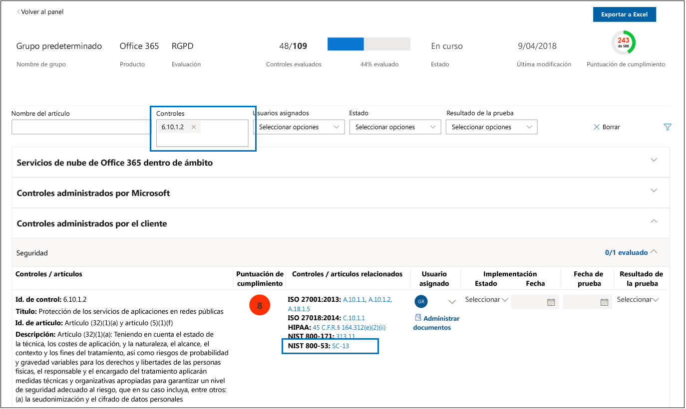
  
 Aquí se muestra la finalización de la implementación y pruebas del control del RGPD 6.10.1.2. 
  
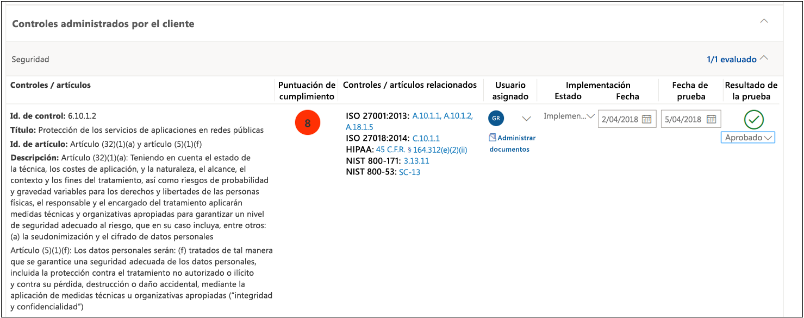
  
Al navegar al control relacionado en la evaluación agrupada, vemos que el SC-13 de NIST 800-53 también se marcó como completado con la misma fecha y hora, sin ningún esfuerzo de pruebas o implementación.
  
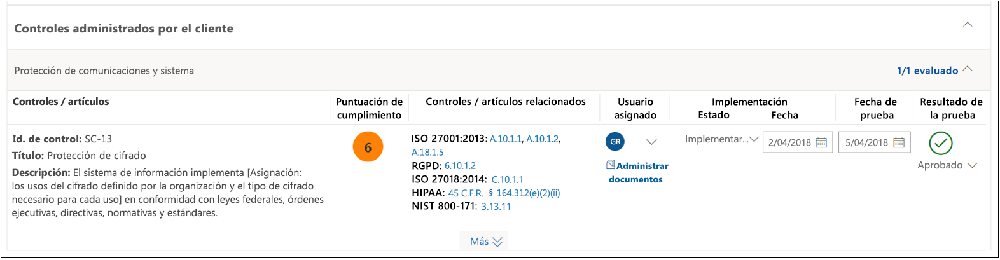
  
De nuevo en el panel, podemos ver que cada evaluación tiene una evaluación de control completada y que la puntuación de cumplimiento total de cada evaluación se incrementó en ocho (el valor de la puntuación de cumplimiento del control compartido).
  
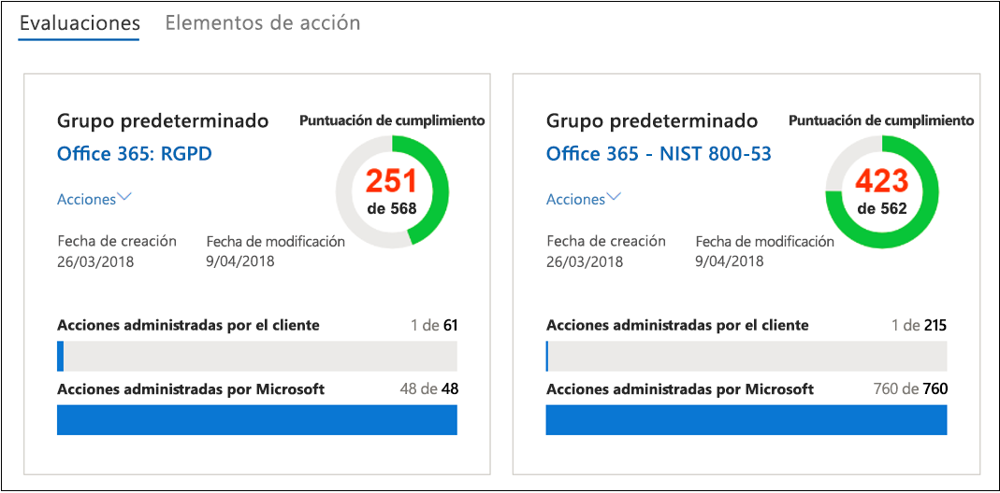

## Funciones administrativas

Hay funciones administrativas específicas que solo están disponibles en la cuenta de administrador del espacio empresarial y solo serán visibles al iniciar sesión como administrador global.
  
> [!NOTE]
> El permiso “Acceso a documentos restringidos” en la lista desplegable permitirá a los administradores conceder a los usuarios acceso a documentos restringidos que Microsoft comparte en el Portal de confianza de servicios. La característica “Documentos restringidos” no está disponible actualmente, pero lo estará próximamente. 
  
### Asignar roles del Administrador de cumplimiento a usuarios

Cada rol del Administrador de cumplimiento tiene permisos ligeramente distintos. Puede ver los permisos asignados a cada rol, ver qué usuarios se encuentran en cada rol y agregar o quitar usuarios de ese rol mediante el Portal de confianza de servicios; para hacerlo, seleccione el elemento de menú **Administrador** y, después, haga clic en **Configuración**. 
  

  
Para agregar o quitar usuarios de los roles del Administrador de cumplimiento.
  
1. Vaya a [https://servicetrust.microsoft.com](https://servicetrust.microsoft.com).
    
2. Inicie sesión con su cuenta de administrador global de Azure Active Directory.
    
3. En la barra de menús superior del Portal de confianza de servicios, haga clic en **Administrador** y, después, seleccione **Configuración**. 
    
4. En la lista desplegable **Seleccionar rol**, haga clic en el rol que quiera administrar. 
    
5. Los usuarios agregados a cada rol se muestran en la página **Seleccionar rol**. 
    
6. Para agregar usuarios al rol, haga clic en **Agregar**. En el cuadro de diálogo **Agregar usuarios**, haga clic en el campo del usuario. Puede desplazarse por la lista de usuarios disponibles, o bien puede empezar a escribir el nombre de usuario para filtrar la lista según el término de búsqueda. Haga clic en el usuario para agregar esa cuenta a la lista **Agregar usuarios** que se aprovisionarán con ese rol. Para agregar varios usuarios de forma simultánea, empiece a escribir un nombre de usuario para filtrar la lista y, después, haga clic en el usuario para agregarlo a la lista. Haga clic en **Guardar** para aprovisionar el rol seleccionado a esos usuarios. 
    
    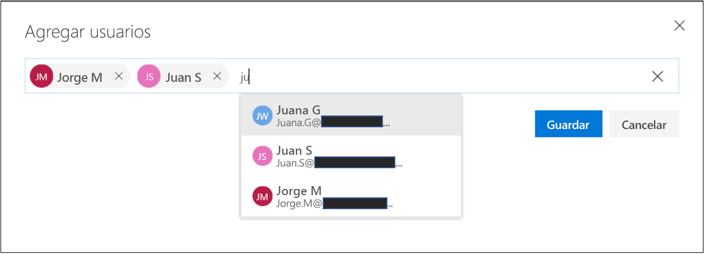
  
7. Para quitar usuarios de este rol, seleccione los usuarios y, después, haga clic en **Eliminar**. 
    
    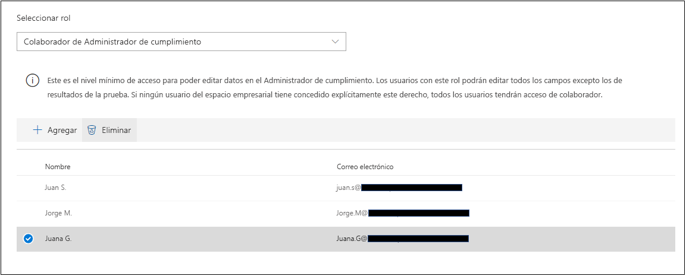
 
## Configuración de privacidad del usuario

Algunos reglamentos exigen que una organización pueda eliminar los datos de historial de usuario. Para facilitar esto, el Administrador de cumplimiento proporciona las funciones de **Configuración de privacidad del usuario**, que permiten a los administradores: 
  
- [Buscar un usuario](#search-for-a-user)

- [Exportar un informe de historial de datos de cuenta](#export-a-report-of-account-data-history)

- [Reasignar acciones](#reassign-action-items)

- [Eliminar el historial de datos de usuarios](#delete-user-data-history)
    
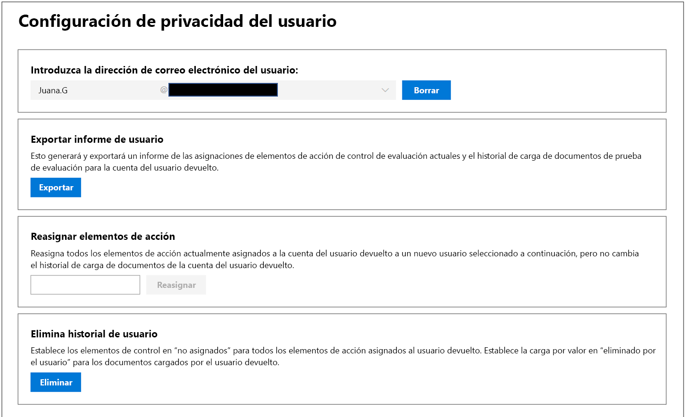
  
### Buscar un usuario

Para buscar una cuenta de usuario:
  
1. Escriba la dirección de correo electrónico del usuario; primero, escriba el alias (la información a la izquierda del símbolo @) y, después, haga clic en la lista de sufijos de dominio de la parte derecha para seleccionar el nombre de dominio. Si se trata de un espacio empresarial con varios dominios registrados, compruebe el sufijo del nombre de dominio de la dirección de correo electrónico para asegurarse de que sea correcto.
    
2. Después de especificar correctamente el nombre de usuario, haga clic en **Buscar**. 
    
3. Si no se encuentra la cuenta de usuario, se mostrará el mensaje de error “Usuario no encontrado” en la página. Compruebe la información de la dirección de correo electrónico del usuario, realice las correcciones necesarias y haga clic en **Buscar** para volver a intentarlo. 
    
4. Si se encuentra la cuenta de usuario, el texto del botón cambiará de **Buscar** a **Borrar**, lo que indica que la cuenta de usuario encontrada es el contexto operativo para las funciones adicionales que se muestran debajo y que, al ejecutar esas funciones, se aplicarán en la cuenta de usuario. 
    
5. Para borrar los resultados de la búsqueda y buscar otro usuario, haga clic en **Borrar**. 
    
### Exportar un informe de historial de datos de cuenta

Después de identificar una cuenta de usuario, puede que quiera generar un informe de dependencias que existan vinculadas a la cuenta. Esta información le permitirá reasignar acciones abiertas o garantizar el acceso a evidencias cargadas anteriormente. 
  
 Para generar y exportar un informe:
  
1. Haga clic en **Exportar** para generar y descargar un informe de las acciones de control del Administrador de cumplimiento que estén asignadas actualmente a la cuenta de usuario encontrada, así como la lista de documentos cargados por el usuario. Si no hay acciones asignadas ni documentos cargados, se mostrará el mensaje de error “Sin datos para el usuario”. 
    
2. El informe se descargará en segundo plano desde la ventana del explorador activa (si no ve un mensaje emergente de descarga, consulte el historial de descargas del explorador).
    
3. Abra el documento para revisar los datos del informe.
    
> [!NOTE]
> No es un informe histórico que conserva y muestra los cambios de estado en el historial de asignaciones de acciones. El informe generado es una instantánea de las acciones de control asignadas en el momento en que se ejecutó el informe (con la marca de fecha y hora escrita en el informe). Por ejemplo, si posteriormente se reasignan acciones y vuelve a generarse el informe para el mismo usuario, se obtendrá un informe de instantánea con datos distintos. 
  
### Reasignar acciones

Esta función permite a una organización quitar las dependencias activas o pendientes de la cuenta del usuario al reasignar todas las propiedades de acciones (tanto de acciones completadas como activas) de la cuenta de usuario encontrada al nuevo usuario seleccionado abajo. Esta acción no cambia el historial de carga de documentos de la cuenta de usuario encontrada. 
  
 Para reasignar acciones a otro usuario:
  
1. Haga clic en el cuadro de entrada para buscar y seleccionar otro usuario de la organización a quien quiera asignar las acciones del usuario encontrado.
    
2. Seleccione **Reemplazar** para reasignar todas las acciones de control del usuario encontrado al nuevo usuario seleccionado. 
    
3. Se mostrará un cuadro de diálogo de confirmación con el siguiente mensaje: “Esto reasignará todas las acciones de control del usuario actual al usuario seleccionado. Esta acción no se puede deshacer. ¿Está seguro de que quiere continuar?”.
    
4. Para continuar, haga clic en **Aceptar**; de lo contrario, haga clic en **Cancelar**. 
    
> [!NOTE]
> Todas las acciones (tanto activas como completadas) se asignarán al nuevo usuario seleccionado. Pero esta acción no afecta al historial de carga de documentos; en los documentos cargados por el usuario asignado anteriormente, se seguirán mostrando la fecha y hora, y el nombre del usuario asignado anteriormente. 
  
El proceso para cambiar el historial de carga de documentos con el fin de quitar el usuario asignado anteriormente tendrá que realizarse de forma manual. En ese caso, el administrador tendrá que:
  
1. Abrir el informe exportado que se descargó anteriormente.
  
2. Identificar la acción de control deseada y buscar su ubicación.
  
3. Hacer clic en **Administrar documentos** para abrir el repositorio de evidencias de ese control. 
  
4. Descargar el documento.
  
5. Eliminar el documento del repositorio de evidencias.
  
6. Volver a cargar el documento. Ahora, el documento tendrá una nueva fecha y hora de carga, y contendrá la información “Cargado por <nombre de usuario>”. 
  
### Eliminar el historial de datos de usuarios

Esto establece las acciones de control como “Sin asignar” para todas las acciones asignadas al usuario encontrado. También establece el valor de “Cargado por” en “Usuario quitado” en todos los documentos cargados por el usuario encontrado.
  
 Para eliminar el historial de carga de documentos y acciones de la cuenta de usuario:
  
1. Haga clic en **Eliminar**. 

    Se mostrará un cuadro de diálogo de confirmación con el siguiente mensaje: “Se eliminarán todas las asignaciones de acciones de control y el historial de carga de documentos del usuario seleccionado. Esta acción no se puede deshacer. ¿Está seguro de que quiere continuar?”.
    
3. Para continuar, haga clic en **Aceptar**; de lo contrario, haga clic en **Cancelar**. 
  
## Uso del Administrador de cumplimiento

El Administrador de cumplimiento proporciona herramientas para asignar, realizar un seguimiento y registrar actividades relacionadas con evaluaciones y cumplimiento, lo que puede ayudar a su organización a cruzar las barreras de los equipos para alcanzar los objetivos de cumplimiento.
  
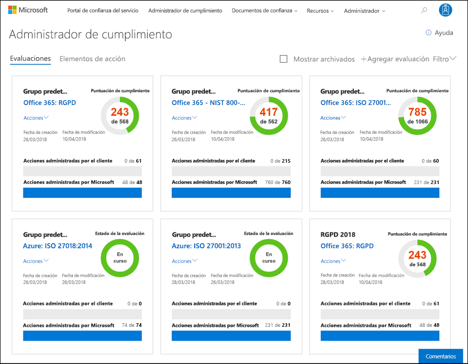

## Obtener acceso al Administrador de cumplimiento

Para obtener acceso al Administrador de cumplimiento, vaya al Portal de confianza de servicios. Cualquier usuario con una cuenta Microsoft o una cuenta de organización de Azure Active Directory puede obtener acceso al Administrador de cumplimiento.
  

  
1. Vaya a [https://servicetrust.microsoft.com](https://servicetrust.microsoft.com/).
    
2. Inicie sesión con su cuenta de usuario de Azure Active Directory (Azure AD).
    
3. En el Portal de confianza de servicios, haga clic en **Administrador de cumplimiento**. 
    
4. Cuando se muestre el acuerdo de confidencialidad, léalo y, después, haga clic en **Acepto** para continuar. Solo tendrá que hacerlo una vez; después, se mostrará el panel del Administrador de cumplimiento. 

    Para ayudarle a empezar, agregamos las siguientes evaluaciones de forma predeterminada:
    
    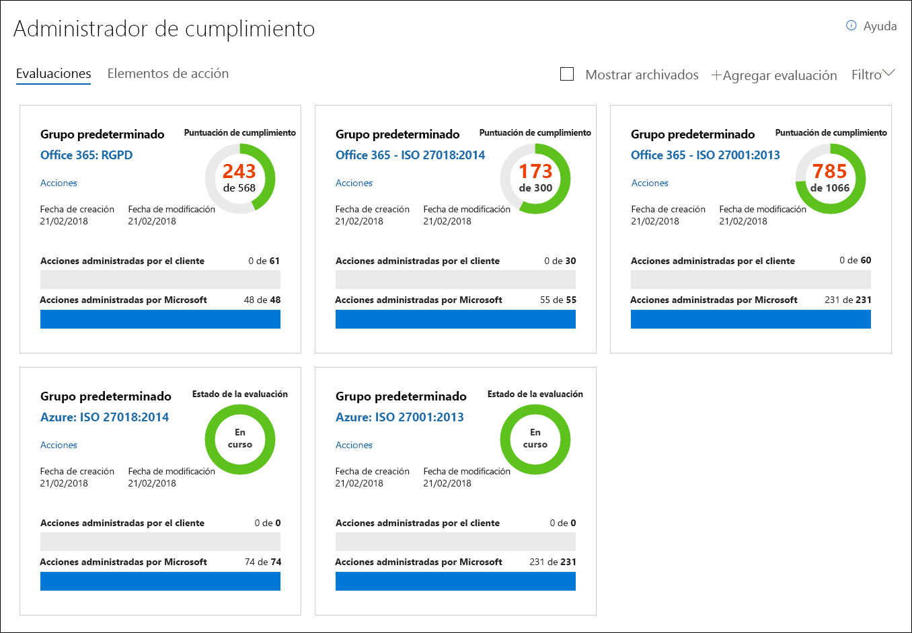
    
5. Haga clic en el  **Ayuda** para realizar un paseo breve por el Administrador de cumplimiento. 
  
## Ver acciones

El Administrador de cumplimiento ofrece una vista sencilla de todas las acciones de evaluaciones de control asignadas, lo que le permite realizar acciones en estas de forma rápida y sencilla. Puede ver todas las acciones, o bien puede seleccionar las acciones que se correspondan con una certificación específica (para hacerlo, haga clic en la pestaña asociada a esa evaluación). Por ejemplo, en la imagen siguiente, la pestaña RGPD está seleccionada, donde se muestren controles relacionados con la evaluación del RGPD.
  
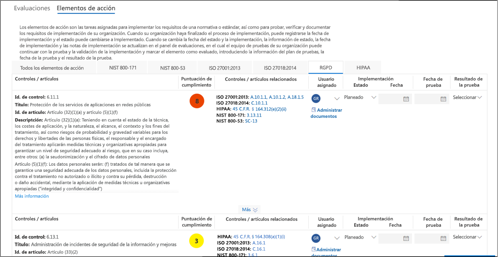
  
Para ver las acciones:
  
1. Vaya al panel del Administrador de cumplimiento.
    
2. Haga clic en el vínculo **Acciones**; la página se actualizará y se mostrarán las acciones asignadas a su usuario. 
    
    De forma predeterminada, se muestran todas las acciones. Si tiene acciones de varias certificaciones, los nombres de las certificaciones se mostrarán en pestañas en la parte superior del control de evaluación. Para ver las acciones de una certificación específica, haga clic en esa pestaña.

## Agregar una evaluación

Para agregar una evaluación al Administrador de cumplimiento:
  
1. En el panel del Administrador de cumplimiento, haga clic en  **Agregar evaluación**. 
    
2. En la ventana **Agregar una evaluación**, puede crear un grupo al que agregar la evaluación, o bien puede agregarlo a un grupo existente (el grupo integrado se denomina “Grupo inicial”). Según la opción que seleccione, escriba el nombre del nuevo grupo, o bien seleccione un grupo existente en la lista desplegable. Para obtener más información, vea [Agrupar evaluaciones](#grouping-assessments).
    
    Si crea un grupo, también puede copiar información de un grupo existente en la nueva evaluación. Esto equivale a cualquier información que se agregó en los campos “Detalles de la implementación” y “Plan de pruebas y respuesta de administración” de los controles administrados por el cliente de las evaluaciones del grupo desde el que vaya a copiar a los mismos controles administrados por el cliente (o controles relacionados) de la nueva evaluación. Si agrega una nueva evaluación a un grupo existente, la información común de las evaluaciones en ese grupo se copiará en la nueva evaluación. Para obtener más información, vea [Copiar información de evaluaciones existentes](#copying-information-from-existing-assessments).
    
3. Haga clic en **Siguiente** y siga este procedimiento:
    
    a. Seleccione un servicio en la nube de Microsoft para evaluar el cumplimiento en la lista desplegable **Seleccionar un producto**. 
    
    b. Seleccione una certificación para evaluar el servicio en la nube seleccionado en la lista desplegable **Seleccionar una certificación**. 
    
4. Haga clic en **Agregar al panel** para crear la evaluación; la evaluación se agregará al panel del Administrador de cumplimiento como un nuevo icono al final de la lista de iconos existentes. 
    
    En el **icono de evaluación** del panel del Administrador de cumplimiento, se muestra la agrupación de evaluaciones, el nombre de la evaluación (creado automáticamente como una combinación del nombre del servicio y la certificación seleccionada), la fecha en que se creó y cuándo se modificó por última vez, la puntuación de cumplimiento total (que es la suma de todos los valores de riesgo de control asignados que se implementaron, probaron y completaron correctamente) e indicadores de progreso en la parte inferior que indican el número de controles evaluados. 
    
5. Haga clic en el nombre de la evaluación para abrirla y vea los detalles de la evaluación.
    
6. Haga clic en el menú **Acciones** para ver las acciones asignadas, cambiar el nombre del grupo de evaluaciones, exportar el informe de evaluación o archivar la evaluación. 
    
    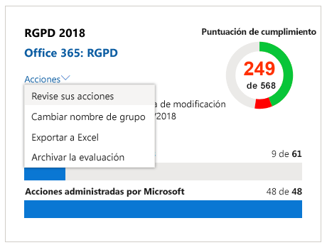

## Copiar información de evaluaciones existentes

Como se explicó anteriormente, al crear un grupo de evaluaciones, puede copiar información de las evaluaciones de un grupo existente en la nueva evaluación del nuevo grupo. Esto le permite aplicar el trabajo de prueba y evaluación que se completó en los mismos controles administrados por el cliente de la nueva evaluación. Por ejemplo, si tiene un grupo para todas las evaluaciones relacionadas con el RGPD de su organización, puede copiar información común de trabajo de evaluaciones existente al agregar una nueva evaluación al grupo.
  
Puede copiar la siguiente información del cliente en una nueva evaluación:
  
- Usuarios de la evaluación. Un usuario de evaluación es un usuario al que se asignó el control.
    
- Estado, fecha de la prueba y resultados de pruebas.
    
- Detalles de la implementación e información sobre el plan de pruebas.
    
De forma similar, también se sincronizará la información de los controles administrados por el cliente compartidos en el mismo grupo de evaluaciones. Además, también se sincronizará la información de los controles administrados por el cliente relacionados dentro de la misma evaluación.

## Ver evaluaciones

1. Busque el icono de evaluación que se corresponda con la evaluación que quiera ver y, después, haga clic en el nombre de la evaluación para abrirla y ver controles administrados por el cliente y por Microsoft asociados a la evaluación, además de una lista de los servicios en la nube que están dentro del ámbito de la evaluación. Este es un ejemplo de la evaluación para Office 365 y el RGPD.
    
    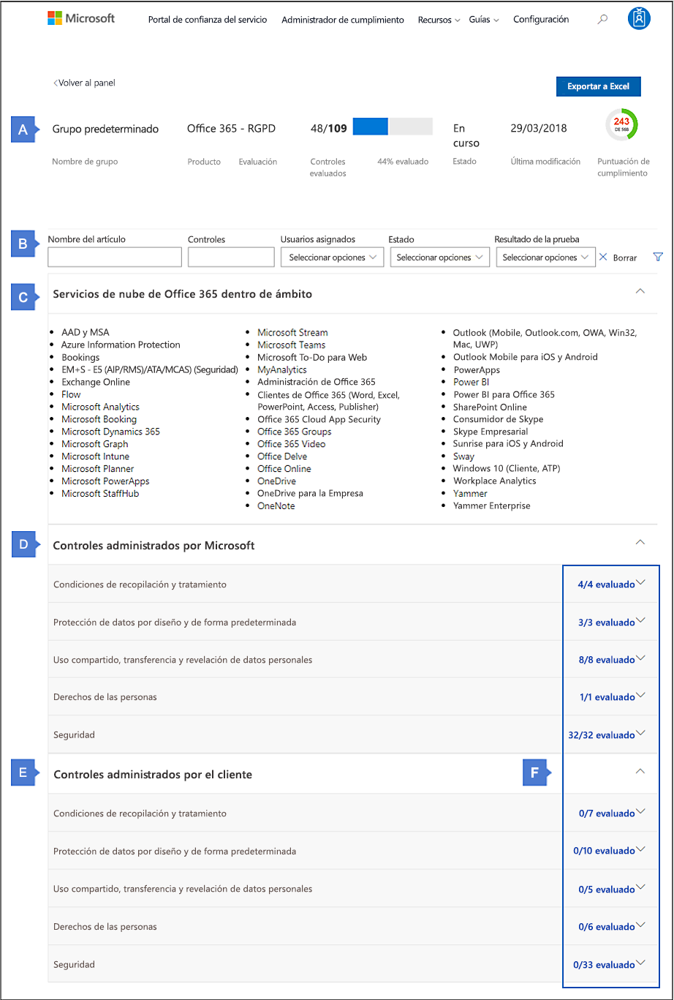
  
1. En esta sección, se muestra información de resumen de la evaluación, como el nombre de la agrupación de evaluaciones, el producto, el nombre de la evaluación y el número de controles de evaluación.
    
2. En esta sección, se muestran los controles del filtro de evaluación. Para obtener una explicación más detallada de cómo usar los controles del filtro de evaluación, vea la sección [Administrar el proceso de evaluación](#managing-the-assessment-process). 
    
3. En esta sección, se muestran los servicios en la nube individuales que están dentro del ámbito de la evaluación.
    
4. Esta sección contiene controles administrados por Microsoft. Los controles relacionados se organizan por familias de controles. Haga clic en una familia de controles para expandirla y mostrar los controles individuales.
    
5. Esta sección contiene controles administrados por el cliente, que también se organizan por familias de controles. Haga clic en una familia de controles para expandirla y mostrar los controles individuales.
    
6. Muestra el número total de controles en la familia de controles y cuántos de esos controles se evaluaron. Una función clave del Administrador de cumplimiento es el seguimiento del progreso de la organización en la evaluación de los controles administrados por el cliente. Para obtener más información, vea la sección [Información sobre la puntuación de cumplimiento](#understanding-the-compliance-score). 

## Administrar el proceso de evaluación

El creador de una evaluación es inicialmente el único usuario de la evaluación. Por cada control administrado por el cliente, puede asignar una acción a un usuario de la organización para que esa persona se convierta en un usuario de evaluación que pueda realizar las acciones de cliente recomendadas, así como recopilar y cargar evidencias. Al asignar una acción, puede enviar un correo electrónico a la persona con detalles como las acciones de cliente recomendadas y la prioridad de la acción. En la notificación por correo electrónico, se incluye un vínculo al panel **Acciones**, donde se muestra una lista de todas las acciones asignadas a esa persona. 
  
Esta es una lista de las tareas que puede realizar con las características de flujo de trabajo del Administrador de cumplimiento.
  

  
1. **Usar las opciones de filtro para encontrar controles de evaluación específicos**: el Administrador de cumplimiento proporciona **opciones de filtro**, que ofrecen criterios de selección altamente granulares para mostrar controles de evaluación, lo que le permitirá dedicarse de forma precisa a áreas específicas de sus esfuerzos de cumplimiento. 
    
    Haga clic en el icono de embudo de la parte derecha de la página para mostrar u ocultar los controles de **Opciones de filtro**. Estos controles le permiten especificar criterios de filtro y abajo solo se mostrarán los controles de evaluación que coincidan con esos criterios. 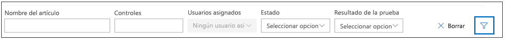
  
    - **Artículos**: filtra por el nombre del artículo y muestra los controles de evaluación asociados a ese artículo. Por ejemplo, al escribir “Artículo (5)”, se muestra una lista de selección de artículos cuyo nombre contiene esa cadena (por ejemplo, artículo (5)(1)(a), artículo (5)(1)(b), artículo (5)(1)(c), etc.). Al seleccionar el artículo (5)(1)(c), se mostrarán los controles asociados al artículo (5)(1)(c). Es un campo de selección múltiple que usa un operador OR con varios valores (por ejemplo, si selecciona el artículo (5)(1)(a) y, después, agrega el artículo (5)(1)(c), el filtro mostrará los controles asociados al artículo (5)(1)(a) o al artículo (5)(1)(c)). 
    
      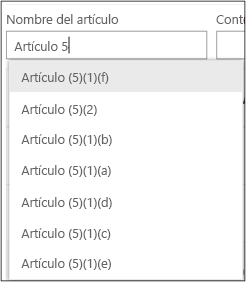
  
    - **Controles**: muestra la lista de controles cuyos nombres coinciden con el filtro (por ejemplo, al escribir 7.3, se mostrará una lista de selección de elementos como, 7.3.1, 7.3.4, 7.3.5, etc.). Es un campo de selección múltiple que usa un operador OR con varios valores (por ejemplo, si selecciona 7.3.1 y, después, agrega 7.3.4, el filtro mostrará los controles asociados con 7.3.1 o 7.3.4). 
    
      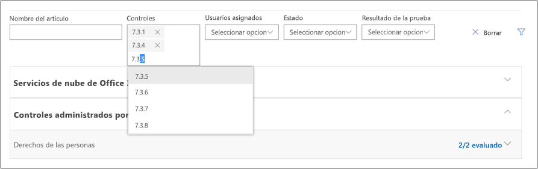
  
    - **Usuarios asignados**: muestra la lista de controles asignados al usuario seleccionado. 
    
    - **Estado**: muestra la lista de controles con el estado seleccionado. 
    
    - **Resultado de la prueba**: muestra la lista de controles con el resultado de la prueba seleccionada. 
    
    Al aplicar condiciones de filtro, la vista de los controles cambiará para corresponderse con las condiciones de filtro. Expanda las secciones de las familias de controles para mostrar los detalles de controles abajo. 
    
    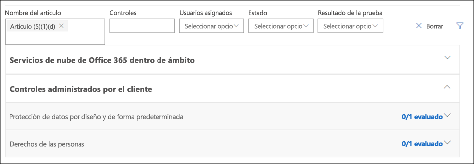
  
2. Si, no se muestran resultados después de seleccionar los filtros deseados, quiere decir que no hay controles que se correspondan con las condiciones de filtro especificadas. Por ejemplo, si selecciona un **Usuario asignado** específico y, después, elige un nombre de **control** que no se corresponde con el control asignado a ese usuario, no se mostrará ninguna evaluación en la página inferior. 
    
3. **Asignar una acción a un usuario**: puede asignar una acción a un usuario para implementar los requisitos de una certificación o reglamento, o bien para probar, verificar y documentar los requisitos de implementación de la organización. Al asignar una acción, puede enviar un correo electrónico a la persona con detalles como las acciones de cliente recomendadas y la prioridad de la acción. También puede cancelar la asignación o reasignar una acción a otro usuario. 
    
4. **Administrar documentos**: los controles administrados por el cliente también permiten administrar documentos relacionados con la realización de tareas de implementación, validación y pruebas. Cualquier usuario con permisos para editar datos en el Administrador de cumplimiento puede cargar documentos si hace clic en **Administrar documentos**. Después de cargar un documento, puede hacer clic en **Administrar documentos** para ver y descargar archivos. 
    
5. **Proporcionar detalles de pruebas de implementación**: todos los controles administrados por el cliente tienen un campo editable donde los usuarios pueden agregar detalles de la implementación para documentar los pasos realizados por la organización para cumplir con los requisitos de la certificación o reglamento, así como para validar y documentar la forma en que la organización cumple esos requisitos.
    
6. **Establecer el estado**: establece el estado de cada elemento como parte del proceso de evaluación. Los valores de estado disponibles son **Implementado**, **Implementación alternativa**, **Planeado** y **No está en el ámbito**. 
    
7. **Especificar la fecha de prueba y el resultado de la prueba**: el usuario con el rol Evaluador del Administrador de cumplimiento puede verificar que se realicen las pruebas adecuadas, revisar los detalles de la implementación, el plan de pruebas, resultados de pruebas y cualquier evidencia cargada y, después, establecer la fecha de la prueba y el resultado de la prueba. Los valores del resultado de la prueba disponibles son **Correcto**, **Error: riesgo bajo**, **Error: riesgo** **medio** y **Error: riesgo alto**. 

## Administrar acciones

Los usuarios que participen en un proceso de evaluación en su organización pueden usar el Administrador de cumplimiento para revisar los controles administrados por el cliente de todas las evaluaciones a las que pertenezcan. Cuando un usuario inicia sesión en el Administrador de cumplimiento y abre el panel **Acciones**, se mostrará una lista de las acciones asignadas a su usuario. Según el rol del Administrador de cumplimiento asignado al usuario, pueden proporcionar detalles de pruebas o implementación, actualizar el estado o asignar acciones. 
  
Como los controles de certificación suelen implementarlos una persona y probarlos otra, la acción de control se puede asignar de forma inicial a una persona para la implementación y, una vez completada, esa persona puede reasignar la acción de control a la siguiente persona para realizar pruebas de control y cargar las evidencias. La asignación o reasignación de acciones de control puede realizarla cualquiera de los usuarios que tenga un rol del Administrador de cumplimiento con permisos suficientes, que permita la administración centralizada de asignaciones de control o el enrutamiento descentralizado de acciones de control, desde implementador a evaluador, según corresponda.
  
Para asignar una acción:
  
1. En el panel del Administrador de cumplimiento, busque el icono de evaluación junto a la evaluación con la que quiera trabajar y, después, haga clic en el nombre para ir a la página de detalles.
    
2. Puede hacer clic en **Filtrar** y usar los controles de filtro para encontrar el control de evaluación específico que quiera asignar. 
    
3. También puede ir a la sección Controles administrados por el cliente, expandir la familia de controles y desplazarse por la lista de controles hasta que encuentre el control de evaluación que quiera asignar.
    
4. En la columna **Usuario asignado**, haga clic en **Asignar**. 
    
5. En el cuadro de diálogo “Asignar acción”, haga clic en el campo **Asignar a** para rellenar la lista de usuarios a los que puede asignar la acción. Puede desplazarse por la lista para encontrar el nombre de usuario que prefiera, o bien puede empezar a escribir en el campo para buscarlo. 
    
6. Haga clic en un usuario para asignarle esta acción.
    
7. Para enviar una notificación por correo electrónico al usuario, asegúrese de que esté activada la casilla **Enviar notificación por correo electrónico**. 
    
8. Escriba las notas que quiera que se muestren al usuario y haga clic en **Asignar**. 
 
    El usuario recibirá una notificación de la asignación de acción, así como las notas que especifique.
    
Las notas asociadas a la acción persisten en la sección de notas y estarán disponibles la próxima vez que se asigne la acción. Estas notas no son de solo lectura (la persona que asigne la acción puede editarlas, reemplazarlas o quitarlas).

## Exportar información de una evaluación

Puede exportar una evaluación a un archivo de Excel para que las partes interesadas de cumplimiento de su organización puedan revisarla, o bien puede proporcionar el archivo exportado a auditores y entidades reguladoras. Este informe de evaluación es una instantánea de la fecha y hora en que se creó y contiene los detalles de los controles administrados por Microsoft y por el cliente para esa evaluación, como el estado de la implementación de controles, la fecha de la prueba de control y los resultados de pruebas, además de vínculos a los documentos de evidencias cargados. Le recomendamos que exporte el informe de evaluación antes de archivar una evaluación, ya que en las evaluaciones archivadas no se conservan los vínculos a los documentos cargados.
  
Para exportar un informe de evaluación:
  
- En el panel del Administrador de cumplimiento, haga clic en **Acciones** en el icono de la evaluación que quiera exportar y, después, seleccione **Exportar a Excel**.

  O bien
    
- Si está en la página de detalles de la evaluación, haga clic en el botón **Exportar a Excel**, que se encuentra en la esquina superior derecha de la página, encima de la puntuación de cumplimiento de la evaluación.
    
El informe de evaluación se descargará en la sesión del explorador. Si no ve un mensaje emergente para informarle de esto, abra la carpeta de descargas del explorador.

## Archivar una evaluación

Si completó una evaluación y ya no la necesita por fines de cumplimiento, puede archivarla. Al archivar una evaluación, se quita del panel Evaluaciones.
  
> [!NOTE]
> Al archivar una evaluación, ya no se puede recuperar ni restaurar a un estado de lectura y escritura en curso. Tenga en cuenta que, en las evaluaciones archivadas, no se conservan los vínculos a los documentos de evidencia cargados, por lo que es muy recomendable que realice una exportación de la evaluación antes de archivarla, ya que el informe de evaluación exportado contendrá los vínculos a los documentos de evidencias, lo que le permitirá seguir obteniendo acceso a estos. 
  
Para archivar una evaluación:
  
1. En el icono de panel de la evaluación que quiera archivar, haga clic en **Acciones**. 
    
2. Seleccione **Archivar evaluación**. 
 
    Se mostrará el cuadro de diálogo **Archivar evaluaciones**, donde se le pedirá que confirme que quiere archivar la evaluación.
    
4. Para continuar con el archivado, haga clic en **Archivar**; de lo contrario, haga clic en **Cancelar**. 
    
Para ver las evaluaciones archivadas:
  
1. En el panel del Administrador de cumplimiento, active la casilla **Mostrar archivados**. 
    
    Las evaluaciones archivadas se mostrarán en una nueva sección visible debajo del resto de las evaluaciones activas, en la parte inferior de una barra titulada **Evaluaciones archivadas**.
    
3. Haga clic en el nombre de la evaluación que quiera ver.
    
Al visualizar una evaluación archivada, ninguno de los controles que pueden editarse normalmente (por ejemplo, “Implementación” o “Resultados de pruebas”) estarán activos, ni tampoco se mostrará el botón **Documentos administrados**.

## Uso de la búsqueda

  
Haga clic en el icono de lupa de la esquina superior derecha de la página para expandir el campo de búsqueda, escriba los términos de búsqueda y presione Entrar. Se mostrará el control de búsqueda con el término de búsqueda en el campo de entrada del panel de búsqueda y, en la parte inferior, se mostrarán los resultados de la búsqueda.
  
De forma predeterminada, la búsqueda muestra resultados de documentos, y puede usar las listas desplegables “Filtrar por” para restringir la lista de documentos mostrados con el fin de agregar o quitar resultados de la búsqueda de la vista. Puede usar varios atributos de filtro al mismo tiempo para restringir los documentos mostrados a elementos específicos, como servicios en la nube, categorías de cumplimiento o procedimientos de seguridad, regiones del mundo o sectores. Haga clic en el vínculo del nombre del documento para descargar el documento.
  

  
Haga clic en el vínculo “Administrador de cumplimiento” para mostrar resultados de la búsqueda de controles de evaluación del Administrador de cumplimiento. En los resultados de la búsqueda, se muestra la fecha en que se creó la evaluación, el nombre de la agrupación de evaluaciones, el servicio en la nube correspondiente y si los controles son de Microsoft o administrados por el cliente.
  

  
> [!NOTE]
> Los informes y documentos del Portal de confianza de servicios pueden descargarse como mínimo durante 12 meses después de su publicación, o bien hasta que se publique una nueva versión del documento. 
 
## Soporte de localización

El Portal de confianza de servicios de permite ver el contenido de la página en distintos idiomas. Para cambiar el idioma de la página, haga clic en el icono de globo de la esquina inferior izquierda de la página y seleccionar el idioma que prefiera. 
  

## Registro de cambios de controles administrados por el cliente

El Administrador de cumplimiento está diseñado para actualizarse periódicamente y mantenerse al día de los cambios que se produzcan en los requisitos normativos de nuestros servicios en la nube. En estas actualizaciones, se incluyen los cambios en controles administrados por el cliente. Se proporciona un registro de cambios que le permitirá comprender el impacto de estos cambios, como los detalles sobre el contenido agregado o modificado, así como directrices sobre cómo afectan los cambios a las evaluaciones existentes. En general, hay dos tipos de cambios:
  
- Un cambio **mayor** es un cambio importante en una acción de cliente, como agregar o quitar un control o pasos numerados específicos, o bien un cambio en la guía sobre responsabilidades, recomendaciones o evidencias. En el caso de los cambios mayores, le recomendamos que vuelva a evaluar la implementación o evaluación del control afectado.
    
- Un cambio **menor** es un cambio insignificante en las acciones de cliente, como corregir un error de escritura o problemas de formato, o bien actualizar o corregir hipervínculos. En el caso de los cambios menores, no suele ser necesario volver a evaluar el control, pero le recomendamos que actualice la acción de cliente.
  
### Controles administrados por el cliente de Office 365: Registro de cambios de julio de 2018

|**Id. de control**|**Evaluación**|**Tipo de cambio**|**Descripción del cambio**|**Acciones recomendadas para clientes**|
|:-----|:-----|:-----|:-----|:-----|:-----|:-----|:-----|:-----|
|45 C.F.R. § 164.308(a)(7)(ii)(A)  |Office 365: HIPAA|Mayor|Se agregó el control de HITECH a la evaluación de HIPAA para Office 365. |Se revisaron el control agregado y las acciones de cliente recomendadas.  |
|45 C.F.R.  164.312(a)(6)(ii)|Office 365: HIPAA|Mayor|Se agregó el control de HITECH a la evaluación de HIPAA para Office 365.|Se revisaron el control agregado y las acciones de cliente recomendadas. |
45 C.F.R. § 164.312(c)(1)| Office 365: HIPAA|Mayor| Se agregó el control de HITECH a la evaluación de HIPAA para Office 365. |Se revisaron el control agregado y las acciones de cliente recomendadas.  |
45 C.F.R.  § 164.316(b)(2)(iii)| Office 365: HIPAA|Mayor|Se agregó el control de HITECH a la evaluación de HIPAA para Office 365.|Se revisaron el control agregado y las acciones de cliente recomendadas. |
|

### Controles administrados por el cliente de Office 365: Registro de cambios de abril de 2018

|**RGPD**|**HIPAA**|**ISO 27001**|**ISO 27018**|**NIST 800-53**|**NIST 800-171**|**Tipo de cambio**|**Descripción del cambio**|**Acciones recomendadas para clientes**|
|:-----|:-----|:-----|:-----|:-----|:-----|:-----|:-----|:-----|
|6.13.2    |||C.16.1.1    |||Mayor    |La referencia numérica anterior era 6.12.1.1.    Se agregaron detalles a las recomendaciones.    |Vuelva a evaluar el control: revise la guía actualizada en las acciones de cliente y siga los pasos recomendados para implementar y evaluar el control.    |
||||||3.1.6    |Mayor    |Se agregaron pasos a la guía, como habilitar la auditoría y buscar en los registros de auditoría.    |Revise las recomendaciones actualizadas en las acciones de cliente.    |
|6.8.2    |||A.10.2    |||Mayor    |La referencia numérica anterior era 6.7.2.9.    Guía actualizada con acciones y recomendaciones adicionales.    |Vuelva a evaluar el control: revise la guía actualizada en las acciones de cliente y siga los pasos recomendados para implementar y evaluar el control.    |
|6.6.4    |45 C.F.R. § 164.312(a)(2)(i)              45 C.F.R. § 164.312(d)    |A.9.4.2    ||IA-2    |3.5.1    |Mayor    |La referencia numérica anterior era 6.5.2.3.    Guía actualizada con acciones y recomendaciones adicionales.    |Vuelva a evaluar el control: revise la guía actualizada en las acciones de cliente y siga los pasos recomendados para implementar y evaluar el control.    |
|6.13.1    |45 C.F.R. § 164.308(a)(1)(i)    |A.16.1    |C.16.1    |IR-4(a)    |3.6.1    |Mayor    |La referencia numérica anterior era 6.12.1.    Guía actualizada con acciones y recomendaciones adicionales.    |Vuelva a evaluar el control: revise la guía actualizada en las acciones de cliente y siga los pasos recomendados para implementar y evaluar el control.    |
|6.7    ||||||Mayor    |La referencia numérica anterior era 6.6.1.1.    Guía actualizada con acciones y recomendaciones adicionales.    |Vuelva a evaluar el control: revise la guía actualizada en las acciones de cliente y siga los pasos recomendados para implementar y evaluar el control.    |
|6.6.5    |||A.10.8    |IA-3    |3.5.2    |Mayor    |La referencia numérica anterior era 6.5.4.2.    Guía actualizada con acciones y recomendaciones adicionales.    |Vuelva a evaluar el control: revise la guía actualizada en las acciones de cliente y siga los pasos recomendados para implementar y evaluar el control.    |
|6.15.1    ||||||Mayor    |La referencia numérica anterior era 6.14.1.3.    Guía actualizada con acciones y recomendaciones adicionales.    |Vuelva a evaluar el control: revise la guía actualizada en las acciones de cliente y siga los pasos recomendados para implementar y evaluar el control.    |
|||||AC-2(h)(2)    ||Menor    |Se agregó un vínculo a la hoja Habilitar auditoría.    |No es necesario realizar ninguna acción.    |
|||||AC-2(7)(b)    ||Menor    |Se agregó un vínculo a la hoja Habilitar auditoría.    |No es necesario realizar ninguna acción.    |
|||||AC-2(h)(1)    ||Menor    |Se agregó un vínculo a la hoja Habilitar auditoría.    |No es necesario realizar ninguna acción.    |
||45 C.F.R. § 164.308(a)(5)(ii)(C)    |||AC-2(g)    ||Menor    |Se agregó un vínculo a la hoja Habilitar auditoría.    |No es necesario realizar ninguna acción.    |
|||||AC-2(12)    ||Menor    |Se agregó un vínculo a la hoja Habilitar auditoría.    |No es necesario realizar ninguna acción.    |
||45 C.F.R. § 164.312(b)    |A.12.4.3    ||AU-2(d)    ||Menor    |Se agregó un vínculo a la hoja Habilitar auditoría.    |No es necesario realizar ninguna acción.    |
|||||AC-2(4)    ||Menor    |Se agregó un vínculo a la hoja Habilitar auditoría.    |No es necesario realizar ninguna acción.    |
||||||3.1.7    |Menor    |Se agregó un vínculo a la hoja Habilitar auditoría.    |No es necesario realizar ninguna acción.    |
|||A.16.1.7    |C.12.4.2, parte 2    |||Menor    |Se agregó un vínculo a la hoja Habilitar auditoría.    |No es necesario realizar ninguna acción.    |
|||||AC-2(h)(3)    ||Menor    |Se agregó un vínculo a la hoja Habilitar auditoría.    |No es necesario realizar ninguna acción.    |
|||A.12.4.2    ||||Menor    |Se agregó un vínculo a la hoja Habilitar auditoría.    |No es necesario realizar ninguna acción.    |
|||A.7.2.8    ||||Menor    |Se agregaron vínculos a la hoja Búsqueda de contenido y al portal de solicitudes del interesado.    |No es necesario realizar ninguna acción.    |
||45 C.F.R. § 164.308(a)(3)(ii)(C)    |||||Menor    |Se agregaron vínculos a la hoja Habilitar auditoría y a los temas de soporte técnico del rol de administrador de Office 365.    |No es necesario realizar ninguna acción.    |
|5.2.1    ||||||Menor    |La referencia numérica anterior era 5.2.2.    Se proporcionó información adicional en la guía sobre las responsabilidades del cliente.    |Revise las recomendaciones actualizadas en las acciones de cliente.    |
|6.11.1    |45 C.F.R. § 164.312(e)(2)(ii)    |A.10.1.1          A.10.1.2          A.18.1.5    |C.10.1.1    |SC-13    |3.13.11    |Menor    |La referencia numérica anterior era 6.10.1.2.    Se corrigió un error de escritura.    |No es necesario realizar ninguna acción.    |
|7.5.1    ||||||Menor    |La referencia numérica anterior era A.7.4.1.    Se corrigió un error de escritura.    |No es necesario realizar ninguna acción.    |
|||A.8.2.3    |||3.1.3    |Menor    |Se quitó una frase adicional innecesaria.    |No es necesario realizar ninguna acción.    |
||45 C.F.R. § 164.308(a)(4)(i)    |A.6.1.2    ||AC-5(a)    |3.1.2          3.1.4    |Menor    |Guía actualizada con acciones y recomendaciones adicionales.    |Revise las recomendaciones actualizadas en las acciones de cliente.    |
||45 C.F.R. § 164.308(a)(7)(ii)(E)    |||RA-2(a)    ||Menor    |Se actualizó el vínculo al tema de ayuda del servicio de importación para usar FWLink.    |No es necesario realizar ninguna acción.    |
|

### Referencia de cambio de id. de control de evaluación del RGPD: Registro de cambios de febrero de 2018 

|**Id. de control anterior (versión preliminar de noviembre de 2017)**|**Nuevo id. de control (versión disponible para el público en general de febrero de 2018)**|
|:-----|:-----|
|5.2.2    |5.2.1    |
|5.2.3    |5.2.2    |
|5.2.4    |5.2.3    |
|6.1.1.1    |6.2    |
|6.10.1.2    |6.11.1    |
|6.10.2.5    |6.11.2    |
|6.11.1.2    |6.12    |
|6.12.1    |6.13.1    |
|6.12.1.1    |6.13.2    |
|6.12.1.5    |6.13.3    |
|6.14.1.3    |6.15.1    |
|6.14.2.1    |6.15.2    |
|6.14.2.3    |6.15.3    |
|6.2.1.1    |6.3    |
|6.3.2.2    |6.4    |
|6.4.3.1    |6.5.2    |
|6.4.3.2    |6.8.1    |
|6.4.3.3    |6.5.3    |
|6.5.2    |6.6.1    |
|6.5.2.1    |6.6.2    |
|6.5.2.2    |6.6.3    |
|6.5.2.3    |6.6.4    |
|6.5.4.2    |6.6.5    |
|6.6.1.1    |6.7      |
|6.7.2.7    |6.8.1    |
|6.7.2.9    |6.8.2    |
|6.8.1.4    |6.9.1    |
|6.8.4.1    |6.9.3    |
|6.8.4.2    |6.9.4    |
|6.9.2.1    |6.10.1   |
|6.9.2.3    |6.10.2   |
|A.7.1.1    |7.2.1    |
|A.7.1.2    |7.2.2    |
|A.7.1.3    |7.2.3    |
|A.7.1.4    |7.2.4    |
|A.7.1.5    |7.2.5    |
|A.7.1.6    |7.2.6    |
|A.7.1.7    |7.2.7    |
|A.7.2.1    |7.3.1    |
|A.7.2.10   |7.3.9    |
|A.7.2.11   |7.3.10   |
|A.7.2.2    |7.3.2    |
|A.7.2.3    |7.3.3    |
|A.7.2.4    |7.3.4    |
|A.7.2.5    |7.3.5    |
|A.7.2.6    |7.3.6    |
|A.7.2.7    |7.3.7    |
|A.7.2.8    |7.3.8    |
|A.7.3.1    |7.4.1    |
|A.7.3.10   |7.4.10   |
|A.7.3.2    |7.4.2    |
|A.7.3.3    |7.4.3    |
|A.7.3.4    |7.4.4    |
|A.7.3.5    |7.4.5    |
|A.7.3.6    |7.4.6    |
|A.7.3.7    |7.4.7    |
|A.7.3.8    |7.4.8    |
|A.7.3.9    |7.4.9    |
|A.7.4.1    |7.5.1    |
|A.7.4.2    |7.5.2    |
|A.7.4.3    |7.5.3    |
|A.7.4.4    |7.5.4    |
|A.7.4.5    |7.5.5    |
|B.8.1.1    |8.2.1    |
|B.8.1.2    |8.2.2    |
|B.8.1.3    |8.2.3    |
|B.8.1.4    |8.2.4    |
|B.8.1.5    |8.2.5    |
|B.8.1.6    |8.2.6    |
|B.8.2.1    |8.3.1    |
|B.8.3.1    |8.4.1    |
|B.8.3.2    |8.4.2    |
|B.8.3.3    |8.4.3    |
|B.8.4.1    |8.5.1    |
|B.8.4.2    |8.5.2    |
|B.8.4.3    |8.5.4    |
|B.8.4.4    |8.5.5    |
|B.8.4.5    |8.5.3    |
|B.8.4.6    |8.5.6    |
|B.8.4.7    |8.5.7    |
|B.8.4.8    |8.5.8    |
|
   
## Vea también

- [Guía interactiva del Administrador de cumplimiento normativo](https://content.cloudguides.com/guides/Compliance%20Manager)

- [Anuncio de la disponibilidad general del Administrador de cumplimiento](https://techcommunity.microsoft.com/t5/Security-Privacy-and-Compliance/Announcing-Compliance-Manager-general-availability/ba-p/161922)

- [Microsoft 365 proporciona una estrategia de protección de la información como ayuda para el RGPD](https://blogs.office.com/es-ES/2018/02/22/microsoft-365-provides-an-information-protection-strategy-to-help-with-the-gdpr)
