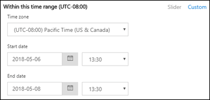

# Seguimiento de mensajes en el centro de seguridad & cumplimiento

Seguimiento de mensajes en el centro de seguridad de & cumplimiento sigue los mensajes de correo electrónico que viajan a través de la organización de Exchange Online. Puede determinar si el servicio ha recibido, rechazado, aplazado o entregado un mensaje. También muestra las acciones que se tomaron en el mensaje antes de que alcanzara su estado final.

El seguimiento de mensajes en el centro de seguridad & Compliance Center mejora tras el seguimiento de mensajes que estaba disponible en el centro de administración de Exchange (EAC). Puede usar la información del seguimiento de mensajes para responder de manera eficiente a las preguntas de los usuarios sobre lo que sucedió con sus mensajes, solucionar problemas del flujo de correo y validar los cambios en la Directiva.

## Abrir el seguimiento de mensajes

1. [Inicie sesión en Office 365](https://support.office.com/article/e9eb7d51-5430-4929-91ab-6157c5a050b4) con su cuenta profesional o educativa.

2. Seleccione el icono del iniciador de aplicaciones  de la esquina superior izquierda y elija **Administrador**.

3. En el panel de navegación inferior izquierdo, expanda **centros de administración** y seleccione **seguridad & cumplimiento**.

4. En la página **cumplimiento de seguridad &** que se abre, expanda **flujo de correo**y seleccione seguimiento de **mensajes**.

## Página de seguimiento de mensajes

Desde aquí puede iniciar una nueva traza predeterminada haciendo clic en el botón **iniciar una traza** . Se buscarán todos los mensajes de todos los remitentes y destinatarios durante los dos últimos días. O bien, puede usar una de las consultas almacenadas de las categorías de consulta disponibles y ejecutarlas tal cual o usarlas como punto de partida para sus propias consultas:

- **Consultas**predeterminadas: consultas integradas proporcionadas por Office 365.

- **Consultas personalizadas**: consultas guardadas por los administradores en la organización para un uso futuro.

- **Consultas**autoguardadas: las últimas diez consultas ejecutadas más recientemente. Esta lista hace que sea fácil continuar en el lugar donde lo dejó.

En esta página también se encuentra una sección de **informes** descargables para las solicitudes que ha enviado, así como los informes en sí cuando hay disponibles para la descarga.

## Opciones para un nuevo seguimiento de mensajes

### Filtrar por remitentes y destinatarios

Los valores predeterminados son **todos** los remitentes y **todos los destinatarios**, pero puede usar los siguientes campos para filtrar los resultados:

- **Por estas personas**: haga clic en este campo para seleccionar uno o más remitentes de la organización. También puede empezar a escribir un nombre y los elementos de la lista se filtrarán por lo que haya escrito, al igual que se comporta una página de búsqueda.

- **A estas personas**: haga clic en este campo para seleccionar uno o más destinatarios de la organización.

También puede escribir las direcciones de correo electrónico de remitentes y destinatarios externos. Se admiten caracteres comodín`*@contoso.com` ( `scot?@contoso.com`o), pero no se pueden usar varias entradas comodín en el mismo campo al mismo tiempo.

### Intervalo de tiempo

El valor predeterminado es de **2 días**, pero puede especificar intervalos de fecha y hora de hasta 90 días. Cuando use intervalos de fecha y hora, tenga en cuenta estos problemas:

- De forma predeterminada, se selecciona el intervalo de tiempo en la vista de **control deslizante** mediante una línea de tiempo. Solo puede seleccionar la configuración de día o de hora que se muestra. Al intentar seleccionar un valor en entre, el burbuja de inicio/final se ajustará a la opción que se muestra más próxima.

   

   Sin embargo, también puede cambiar a la vista **personalizada** donde puede especificar los valores de fecha de **Inicio** y **fecha** de finalización (incluidas las horas), y también puede seleccionar la **zona horaria** para el intervalo de fecha y hora. Tenga en cuenta que la configuración de la **zona horaria** se aplica tanto a las entradas de consulta como a los resultados de la consulta.

   

   Durante 10 días o menos, los resultados están disponibles al instante como un informe de **Resumen** . Si especifica un intervalo de tiempo que es incluso ligeramente mayor que 10 días, los resultados se retrasarán, ya que solo están disponibles como archivo CSV descargable ( **Resumen mejorado** o informes **extendidos** ).

   Para obtener más información acerca de los diferentes tipos de informes, vea la sección [Choose Report Type](#choose-report-type) de este tema.

   **Nota**: el resumen mejorado y los informes extendidos se preparan con datos de seguimiento de mensajes archivados y puede tardar varias horas antes de que el informe esté disponible para su descarga. En función de cuántos otros administradores hayan enviado solicitudes de informe alrededor del mismo tiempo, es posible que también perciba un retraso antes de que se inicie el procesamiento para la solicitud en cola.

- Guardar una consulta en la vista de **control deslizante** guarda el intervalo de tiempo relativo (por ejemplo, 3 días a partir de hoy). Al guardar una consulta en la vista **personalizada** se guarda el intervalo de fechas y horas absolutas (por ejemplo, 2018-05-06 13:00 a 2018-05-08 18:00).

### Más opciones de búsqueda

#### Estado de entrega

Puede dejar el valor predeterminado **todos** seleccionados o puede seleccionar uno de los siguientes valores para filtrar los resultados:

- **Delivered**: el mensaje se entregó correctamente al destino previsto.

- **Pendiente**: se está intentado o reintentando la entrega del mensaje.

- **Ampliado**: un destinatario de grupo de distribución se amplió antes de su entrega a los miembros individuales del grupo.

- **Error**: el mensaje no se entregó.

- **En cuarentena**: el mensaje se puso en cuarentena (como correo no deseado, correo masivo o suplantación de identidad). Para obtener más información, vea [cuarentena de mensajes de correo electrónico en Office 365](https://support.office.com/article/4c234874-015e-4768-8495-98fcccfc639b.aspx).

- **Filtrado como correo no deseado**: el mensaje se identificó como correo no deseado y fue rechazado o bloqueado (no en cuarentena).

- **Obtener estado:** El mensaje se recibió recientemente con Office 365, pero todavía no hay otros datos de estado disponibles. Vuelva a comprobar en unos minutos.

**Nota**: los valores **Pending (** **en cuarentena**) y **Filter (correo no deseado** ) solo están disponibles para las búsquedas de menos de 10 días. Además, puede haber un retraso de 5 a 10 minutos entre el estado de entrega real y notificado.

#### Id. del mensaje

Se trata del identificador del mensaje de Internet (también conocido como el identificador de cliente) que se encuentra en el campo de encabezado **Message-ID:** en el encabezado del mensaje. Los usuarios pueden proporcionarle este valor para investigar mensajes específicos.

Este valor es constante mientras dure el mensaje. Para los mensajes creados en Office 365 o Exchange, el valor tiene el formato `<GUID@ServerFQDN>`, incluidos los corchetes angulares\< \>(). Por ejemplo, `<d9683b4c-127b-413a-ae2e-fa7dfb32c69d@DM3NAM06BG401.Eop-nam06.prod.protection.outlook.com>`. Otros sistemas de mensajería pueden usar diferentes sintaxis o valores. Este valor debe ser único, pero no todos los sistemas de correo electrónico respetan estrictamente este requisito. Si el campo de encabezado **Message-ID:** no existe o está en blanco para los mensajes entrantes de orígenes externos, se asigna un valor arbitrario.

Cuando use el **identificador de mensaje** para filtrar los resultados, asegúrese de incluir la cadena completa, incluidos los corchetes angulares.

#### Dirección

Puede dejar el valor predeterminado **todos** seleccionados o puede seleccionar **entrante** (mensajes enviados a destinatarios de su organización) o saliente (mensajes enviados **** por los usuarios de su organización) para filtrar los resultados.

#### Dirección IP del cliente original

Puede archivar los resultados por dirección IP del cliente para investigar los equipos hackers que envían grandes cantidades de correo no deseado o malware. Aunque los mensajes podrían provenir de varios remitentes, es probable que el mismo equipo genere todos los mensajes.

**Nota**: la información de la dirección IP del cliente solo está disponible durante 10 días y solo está disponible en el **Resumen mejorado** o en los informes **EXTENDIDOs** (archivos. csv descargables).

### Elegir tipo de informe

Los tipos de informes disponibles son:

- **Resumen**: disponible si el intervalo de tiempo es inferior a 10 días y no requiere opciones de filtrado adicionales. Los resultados estarán disponibles casi inmediatamente después de hacer clic en **Buscar**.

- **Mejorado** o **ampliado**: estos informes solo están disponibles como archivos. csv descargables y requieren una o varias de las siguientes opciones de filtrado independientemente del intervalo de tiempo: **por estas personas**, **a estas personas**o ** IDENTIFICADOR del mensaje**. Puede usar caracteres comodín para los remitentes o los destinatarios (por ejemplo, \*@contoso. com).

**Notas**:

- Los informes de Resumen y ampliaciones mejorados se preparan con datos de seguimiento de mensajes archivados y puede tardar varias horas antes de que el informe esté disponible para su descarga. En función de cuántos otros administradores hayan enviado solicitudes de informe en el mismo momento, es posible que también perciba un retraso antes de que comience a procesarse la solicitud en cola.

- Aunque puede seleccionar un informe mejorado o un informe ampliado para cualquier intervalo de fecha y hora, normalmente las últimas cuatro horas de datos archivados no estarán disponibles para estos dos tipos de informes.

Al hacer clic en **siguiente**, se presenta una página de resumen que enumera las opciones de filtrado que ha seleccionado, un título único (editable) para el informe y la dirección de correo electrónico que recibe la notificación cuando finaliza el seguimiento de mensajes (también editable, y debe estar en uno de los dominios aceptados de la organización). Haga clic en **preparar Informe** para enviar el seguimiento de mensajes. En la Página principal de **seguimiento de mensajes** , puede ver el estado del informe en la sección **informes** descargables.

Para obtener más información acerca de la información que se devuelve en los diferentes tipos de informes, consulte la siguiente sección.

## Resultados del seguimiento de mensajes

Los diferentes tipos de informes devuelven diferentes niveles de información. La información que está disponible en los diferentes informes se describe en las secciones siguientes.

### Salida de informe de Resumen

Después de ejecutar el seguimiento de mensajes, se mostrarán los resultados, ordenados por fecha y hora de forma descendente (primero el más reciente).

El informe de Resumen contiene la siguiente información:

- **Fecha**: la fecha y hora en que el servicio recibió el mensaje con la zona horaria UTC configurada.

- **Sender**: la dirección de correo electrónico del remitente (*dominio*de*alias*@).

- **Recipient**: la dirección de correo electrónico del destinatario o los destinatarios. Para un mensaje enviado a varios destinatarios, hay una línea por destinatario. Si el destinatario es un grupo de distribución, un grupo de distribución dinámico o un grupo de seguridad habilitado para correo, el grupo será el primer destinatario y, a continuación, cada miembro del Grupo estará en una línea independiente.

- **Subject**: los primeros 256 caracteres del campo **Subject:** Field del mensaje.

- **Status**: estos valores se describen en la sección [Estado de entrega](#delivery-status) .

De forma predeterminada, los primeros 250 resultados están cargados y disponibles fácilmente. Cuando se desplaza hacia abajo, hay una ligera pausa, ya que se carga el siguiente lote de resultados. En lugar de desplazarse, puede hacer clic en **cargar todo** para cargar todos los resultados hasta un máximo de 10.000.

Puede hacer clic en los encabezados de columna para ordenar los resultados por los valores de esa columna en orden ascendente o descendente.

Puede hacer clic en **filtrar resultados** para filtrar los resultados por una o más columnas.

Puede exportar los resultados después de haber seleccionado una o más filas haciendo clic en **exportar resultados** y seleccionando **exportar todos los resultados**, **exportar resultados cargados**o **exportar seleccionados**.

#### Buscar registros relacionados para este mensaje

Los registros de mensajes relacionados son registros que compartieron el mismo identificador de mensaje. Recuerde, incluso un único mensaje que se envía entre dos personas puede generar varios registros. El número de registros aumenta cuando el mensaje se ve afectado por la expansión del grupo de distribución, el reenvío y las reglas de flujo de correo (también conocidos como reglas de transporte), etc.

Después de seleccionar la casilla de verificación de una fila, puede buscar registros relacionados del mensaje haciendo clic en el botón **Buscar relacionado** que aparece o seleccionando **más opciones**  \> **para buscar registros relacionados para este mensaje**.

Para obtener más información acerca del identificador de mensaje, vea la sección identificador de mensaje anteriormente en este tema.

#### Detalles del seguimiento de mensajes

En el resultado del informe de Resumen, puede ver los detalles de un mensaje mediante cualquiera de los métodos siguientes:

- Seleccione la fila (haga clic en cualquier lugar de la fila excepto en la casilla de verificación).

- Active la casilla de verificación de la fila y haga clic](media/1ea52bbf-9d00-48ce-9362-307f7f6fb7fe.png) \> en **más opciones** 

Los detalles del seguimiento de mensajes contienen la siguiente información adicional que no está presente en el informe de Resumen:

- **Eventos de mensaje**: esta sección contiene clasificaciones que ayudan a clasificar las acciones que realiza el servicio en los mensajes. Algunos de los eventos más interesantes que puede encontrar son:

   - **Receive**: el servicio recibió el mensaje.

   - **Send**: el servicio envió el mensaje.

   - **Error**: no se pudo entregar el mensaje.

   - **Deliver**: el mensaje se entregó a un buzón.

   - **Expand**: el mensaje se envió a un grupo de distribución que se expandió.

   - **Transfer**: los destinatarios se movieron a un mensaje bifurcado debido a la conversión del contenido, los límites de destinatarios del mensaje o los agentes.

   - **Defer**: la entrega del mensaje se pospuso y puede volver a intentarse más adelante.

   - **Resuelto**: el mensaje se redirigió a una nueva dirección de destinatario basada en una búsqueda de Active Directory. Cuando esto ocurre, la dirección del destinatario original aparece en una fila independiente en el seguimiento de mensajes junto con el estado de entrega final del mensaje.

   Tenga en cuenta que incluso un mensaje sin eventos entregado correctamente generará varias entradas de **eventos** en el seguimiento de mensajes.

- **Más información**: esta sección contiene los siguientes detalles:

   - **Identificador del mensaje**: este valor se describe en la sección [identificador de mensaje](#message-id) anteriormente en este tema. Por ejemplo, `<d9683b4c-127b-413a-ae2e-fa7dfb32c69d@DM3NAM06BG401.Eop-nam06.prod.protection.outlook.com>`.

   - **Tamaño del mensaje**

   - **De IP**: la dirección IP del equipo que envió el mensaje. Para los mensajes salientes enviados desde Exchange Online, este valor está en blanco.

   - **En IP**: dirección o direcciones IP donde el servicio intentó entregar el mensaje. Si el mensaje tiene varios destinatarios, se muestran. Para los mensajes entrantes enviados a Exchange Online, este valor está en blanco.

### Informes de Resumen mejorados

Disponible (completado) los informes de Resumen mejorados están disponibles en la sección **informes** descargables en el seguimiento de mensajes de inicio. La siguiente información está disponible en el informe:

- **origin_timestamp***: fecha y hora en que el servicio recibió inicialmente el mensaje con la zona horaria UTC configurada.

- **sender_address**: la dirección de correo electrónico del remitente (*dominio*de*alias*@).

- **Recipient_status**: el estado de la entrega del mensaje al destinatario. Si el mensaje se envió a varios destinatarios, se mostrarán todos los destinatarios y el estado correspondiente para cada uno, con el formato \<: *email address*\>##\<*status*\>. Por ejemplo:

   - **# #Receive, Send** significa que el servicio recibió el mensaje y que se envió al destino previsto.

   - **# #Receive, Fail** significa que el mensaje se ha recibido en el servicio, pero la entrega al destino previsto produjo un error.

   - **# #Receive, Deliver** significa que el servicio recibió el mensaje y que se entregó al buzón de correo del destinatario.

- **message_subject**: los primeros 256 caracteres del campo **asunto** del mensaje.

- **total_bytes**: el tamaño del mensaje en bytes, incluidos los datos adjuntos.

- **message_id**: este valor se describe en la sección [identificador de mensaje](#message-id) anteriormente en este tema. Por ejemplo, `<d9683b4c-127b-413a-ae2e-fa7dfb32c69d@DM3NAM06BG401.Eop-nam06.prod.protection.outlook.com>`.

- **network_message_id**: un valor de identificador de mensaje único que persiste en todas las copias del mensaje que se pueden crear debido a la bifurcación o a la expansión del grupo de distribución. Un valor de ejemplo `1341ac7b13fb42ab4d4408cf7f55890f`es.

- **original_client_ip**: la dirección IP del cliente del remitente.

- **direccionalidad**: indica si el mensaje se envió como entrante (1) a su organización o si se envió como saliente (2) desde su organización.

- **connector_id**: el nombre del conector de origen o de destino. Para obtener más información acerca de los conectores de Exchange Online, vea [Configure mail Flow Using Connectors in Office 365](https://docs.microsoft.com/Exchange/mail-flow-best-practices/use-connectors-to-configure-mail-flow/use-connectors-to-configure-mail-flow).

- **delivery_priority***: indica si el mensaje se envió con prioridad **alta**, **baja**o **normal** .

*Estas propiedades solo están disponibles en los informes de Resumen mejorados.

### Informes extendidos

Disponible (completado) los informes extendidos están disponibles en la sección **informes** descargables al comienzo del seguimiento de mensajes. Prácticamente toda la información de un informe de resumen mejorado está disponible en un informe ampliado (con la excepción de **origin_timestamp** y **delivery_priority**). La siguiente información adicional solo está disponible en un informe ampliado:

- **client_ip**: la dirección IP del servidor de correo electrónico o el cliente de mensajería que envió el mensaje.

- **client_hostname**: el nombre de host o el FQDN del servidor de correo electrónico o el cliente de mensajería que envió el mensaje.

- **server_IP**: la dirección IP del servidor de origen o de destino.

- **server_hostname**: el nombre de host o el FQDN del servidor de destino.

- **source_context**: información adicional asociada al campo de **origen** . Por ejemplo:

   - `Protocol Filter Agent`

   - `3489061114359050000`

- **origen**: componente de Exchange Online responsable del evento. Por ejemplo:

   - `AGENT`

   - `MAILBOXRULE`

   - `SMTP`

- **event_id**: estos corresponden a los valores del **evento de mensaje** que se explican en la sección [buscar registros relacionados para este mensaje](#find-related-records-for-this-message) .

- **internal_message_id**: un identificador de mensaje asignado por el servidor de Exchange online que está procesando actualmente el mensaje.

- **recipient_address**: las direcciones de correo electrónico de los destinatarios del mensaje. Las direcciones de correo electrónico múltiples están separadas por el carácter de punto y coma (;).

- **recipient_count**: el número total de destinatarios del mensaje.

- **related_recipient_address**: se usa `EXPAND`con `REDIRECT`los eventos `RESOLVE` , y para mostrar otras direcciones de correo electrónico de destinatarios asociadas al mensaje.

- **referencia**: este campo contiene información adicional para tipos específicos de eventos. Por ejemplo:

   - **DSN**: contiene el vínculo de informe, que es el valor **message_id** de la notificación de estado de entrega asociada (también conocido como DSN, informe de no entrega, NDR o mensaje de devolución) si se genera un DSN después de este evento. Si se trata de un mensaje de DSN, este campo contiene el valor **message_id** del mensaje original para el que se generó el DSN.

   - **Expand**: contiene el valor **related_recipient_address** de los mensajes relacionados.

   - **Receive**: puede contener el valor **message_id** del mensaje relacionado si el mensaje fue generado por otros procesos (por ejemplo, reglas de la bandeja de entrada).

   - **Send**: contiene el valor **internal_message_id** de los mensajes DSN.

   - **Transfer**: contiene el valor **internal_message_id** del mensaje que se ha bifurcado (por ejemplo, por conversión de contenido, límites de destinatarios de mensajes o agentes).

   - **MAILBOXRULE**: contiene el valor **internal_message_id** del mensaje entrante que hizo que la regla de la bandeja de entrada generara el mensaje saliente.

   Para el resto de los tipos de eventos, este campo suele estar en blanco.

- **return_path**: dirección de correo electrónico de devolución especificada por el comando **mail from** que envió el mensaje. Aunque este campo nunca está vacío, puede tener el valor de la dirección del remitente null representado `<>`como.

- **message_info**: información adicional sobre el mensaje. Por ejemplo:

   - La fecha y hora de origen del mensaje en UTC `DELIVER` para `SEND` y eventos. La fecha y hora de origen es la hora en que el mensaje entró por primera vez en la organización de Exchange Online. La fecha y hora UTC se representa en el formato de fecha y hora ISO 8601 `yyyy-mm-ddThh:mm:ss.fffZ`:, `yyyy` donde = año `mm` , = mes `dd` , = día `T` , indica el comienzo del componente de hora `hh` , = hora `mm` , = minuto `ss` , = segundo `fff` , = fracciones de segundo e `Z` indica `Zulu`, que es otra forma de indicar UTC.

   - Errores de autenticación. Por ejemplo, es posible que vea el `11a` valor y el tipo de autenticación que se usó cuando se produjo el error de autenticación.

- **tenant_id**: un valor de GUID que representa la organización de Exchange Online (por `39238e87-b5ab-4ef6-a559-af54c6b07b42`ejemplo,).

- **original_server_ip**: la dirección IP del servidor original.

- **custom_data**: contiene datos relacionados con los tipos de eventos específicos. Para obtener más información, vea las siguientes secciones.

#### valores de custom_data

Varios **** agentes de Exchange Online `AGENTINFO` usan el campo custom_data para un evento para registrar los detalles de procesamiento de mensajes. Algunos de los agentes más interesantes se describen en las secciones siguientes.

#### Agente de filtro de correo no deseado

Un valor de **custom_data** que empieza `S:SFA` por es del agente de filtro de correo no deseado. Los detalles de la clave se describen en la tabla siguiente:

|**Valor**|**Descripción**|
|:-----|:-----|
|`SFV=NSPM`|El mensaje se marcó como correo seguro y se envió a los destinatarios correspondientes.|
|`SFV=SPM`|El filtro de contenido marcó el mensaje como correo no deseado.|
|`SFV=BLK`|Se omitió el filtrado y se bloqueó el mensaje porque proviene de un remitente bloqueado.|
|`SFV=SKS`|El mensaje se marcó como correo no deseado antes de que el filtro de contenido lo procesara. Esto incluye los mensajes que coinciden con una regla de transporte que marca el mensaje automáticamente como correo no deseado y omite otros tipos de filtrado.|
|`SCL=<number>`|Para más información sobre los distintos valores SCL y su significado, vea [Niveles de confianza de correo no deseado](https://technet.microsoft.com/library/jj200686.aspx).|
|`PCL=<number>`|Valor de nivel de confianza de protección antiphishing (PCL) del mensaje. Se puede interpretar del mismo modo que los valores de SCL descritos en [Niveles de confianza de correo no deseado](https://technet.microsoft.com/library/jj200686.aspx).  |
|`DI=SB`|Se bloqueó el remitente del mensaje.|
|`DI=SQ`|El mensaje se puso en cuarentena.|
|`DI=SD`|El mensaje se eliminó.|
|`DI=SJ`|El mensaje se envió a la carpeta de correo no deseado del destinatario.|
|`DI=SN`|El mensaje se enrutó a través del grupo de entrega de mayor riesgo. Para obtener más información, consulte [grupo de entrega de alto riesgo para los mensajes salientes](https://technet.microsoft.com/library/jj200746.aspx).|
|`DI=SO`|El mensaje se enrutó a través del grupo de entrega saliente normal.|
|`SFS=[a]|SFS=[b]`|Indica que se coincidió con reglas de correo no deseado.|
|`IPV=CAL`|El mensaje se permitió a través de los filtros de correo no deseado porque la dirección IP estaba incluida en una lista de direcciones IP permitidas en el filtro de conexión.|
|`H=<EHLOstring>`|La cadena HELO o EHLO del servidor de correo que se conecta.|
|`PTR=<ReverseDNS>`|Registro PTR de la dirección IP de envío, también denominado dirección DNS inversa.|

Un valor de **custom_data** de ejemplo para un mensaje que se filtra para correo no deseado de la siguiente manera:

`S:SFA=SUM|SFV=SPM|IPV=CAL|SRV=BULK|SFS=470454002|SFS=349001|SCL=9|SCORE=-1|LIST=0|DI=SN|RD=ftmail.inc.com|H=ftmail.inc.com|CIP=98.129.140.74|SFP=1501|ASF=1|CTRY=US|CLTCTRY=|LANG=en|LAT=287|LAT=260|LAT=18;`

#### Agente de filtro de malware

Un valor de **custom_data** que empieza `S:AMA` por es del agente de filtro de malware. Los detalles de la clave se describen en la tabla siguiente:

|**Valor**|**Descripción**|
|:-----|:-----|
|`AMA=SUM|v=1|`o`AMA=EV|v=1`|Se determinó que el mensaje contiene malware. `SUM` indica que el malware podría haber sido detectado por cualquier número de motores. `EV` indica que un motor específico detectó el malware. Cuando un motor detecta malware, se activan las acciones siguientes.|
|`Action=r`|El mensaje se reemplazó.|
|`Action=p`|El mensaje se omitió.|
|`Action=d`|El mensaje se difirió.|
|`Action=s`|El mensaje se eliminó.|
|`Action=st`|El mensaje se omitió.|
|`Action=sy`|El mensaje se omitió.|
|`Action=ni`|El mensaje se rechazó.|
|`Action=ne`|El mensaje se rechazó.|
|`Action=b`|El mensaje se bloqueó.|
|`Name=<malware>`|Se detectó el nombre del malware.|
|`File=<filename>`|El nombre del archivo que contiene el malware.|

Un valor de **custom_data** de ejemplo para un mensaje que contiene malware tiene un aspecto similar al siguiente:

`S:AMA=SUM|v=1|action=b|error=|atch=1;S:AMA=EV|engine=M|v=1|sig=1.155.974.0|name=DOS/Test_File|file=filename;S:AMA=EV|engine=A|v=1|sig=201707282038|name=Test_File|file=filename`

#### Agente de reglas de transporte

Un valor de **custom_data** que empieza`S:TRA` por es del agente de reglas de transporte para las reglas de flujo de correo (también conocidas como reglas de transporte). Los detalles de la clave se describen en la tabla siguiente:

|**Valor**|**Descripción**|
|:-----|:-----|
|`ETR|ruleId=<guid>`|El identificador de regla coincidente.|
|`St=<datetime>`|La fecha y la hora en UTC cuando se produjo la coincidencia de regla.|
|`Action=<ActionDefinition>`|La acción que se ha aplicado. Para obtener una lista de las acciones disponibles, consulte [mail Flow Rule Actions in Exchange Online](https://technet.microsoft.com/library/jj919237.aspx).|
|`Mode=<Mode>`|El modo de la regla. Los valores válidos son: • **Exigir**: se exigirán todas las acciones de la regla.  • **Pruebe las sugerencias de directiva:**: se enviarán todas las acciones de la sugerencia de Directiva, pero no se actuará sobre otras acciones de aplicación.  • **Pruebe sin sugerencias de directiva**: las acciones se mostrarán en un archivo de registro, pero los remitentes no recibirán ninguna notificación y no se actuará sobre las acciones de aplicación.|

Un valor de **custom_data** de ejemplo para un mensaje que coincide con las condiciones de una regla de flujo de correo tiene el siguiente aspecto:

`S:TRA=ETR|ruleId=19a25eb2-3e43-4896-ad9e-47b6c359779d|st=7/17/2017 12:31:25 AM|action=ApplyHtmlDisclaimer|sev=1|mode=Enforce`
