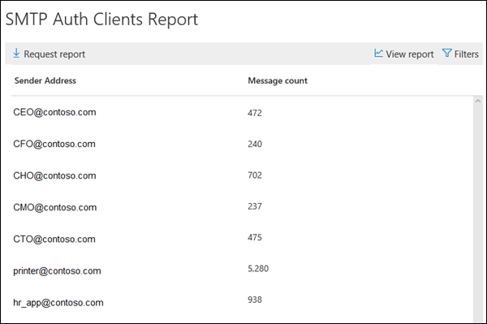

# Informe de clientes de autenticación SMTPSMTP Auth clients report

El informe de **clientes de autenticación SMTP** resalta el uso del Protocolo de envío de cliente de autenticación SMTP por parte de los usuarios o las cuentas de sistema de la organización.The **SMTP Auth clients** report highlights the use of the SMTP Auth client submission protocol by users or system accounts in your organization. Este protocolo heredado (que usa el punto de conexión smtp.office365.com) solo ofrece autenticación básica y es vulnerable a su uso por parte de cuentas comprometidas para enviar correo electrónico.This legacy protocol (which uses the endpoint smtp.office365.com) only offers Basic authentication, and is susceptible to being used by compromised accounts to send email.  Este informe le permite comprobar actividades inusuales.This report allows you to check for unusual activity. También muestra los datos de uso de TLS para clientes o dispositivos que usan SMTP AUTH.It also shows the TLS usage data for clients or devices using SMTP Auth.

El widget que se muestra en el panel de flujo de correo indica el número de usuarios o cuentas de servicio que han usado el protocolo de autenticación SMTP en los últimos 7 días.The widget that's shown in the Mail Flow dashboard indicates the number of users or service accounts that have used the SMTP Auth protocol in the last 7 days.

Al hacer clic en el widget, se abre un control flotante que proporciona una vista agregada del uso y los volúmenes de TLS para la semana pasada.Clicking on the widget opens a flyout that provides an aggregated view of the TLS usage and volumes for the last week.

Al hacer clic en el vínculo de **Informe clientes de autenticación SMTP** , verá dos tablas dinámicas de datos principales y dos vistas de datos.When you click on the **SMTP Auth Clients Report** link, you'll see two main data pivots and two data views. Las tablas dinámicas de datos son el **volumen de envío** y el **uso de TLS**.The data pivots are the **Sending Volume** and **TLS Usage**. Las vistas de datos son el gráfico y la tabla de detalles.The data views are the chart and the details table.

La vista **volumen de envío** muestra el número de mensajes que se enviaron con SMTP AUTH para el intervalo de tiempo especificado.The **Sending Volume** view shows the number of messages that were sent using SMTP Auth for the specified time range. Puede ajustar el rango haciendo clic en **filtros**.You can adjust the range by clicking **Filters**. El gráfico está organizado por dominio de remitente.The chart is organized by sender domain. Puede ver datos independientes para cada dominio seleccionando el dominio en el menú **Mostrar datos para** .You can see separate data for each domain by selecting the domain in the **Show data for** drop down.

Puede ver información detallada sobre los remitentes y sus recuentos de mensajes haciendo clic en **ver tabla de detalles**.You can view detailed information about the senders and their message counts by clicking **View details table**. Para volver al gráfico, haga clic en **Ver informe**.To return to the chart, click **View report**.

La tabla dinámica de **uso de TLS** es importante debido al próximo desuso de TLS 1.0 y TLS 1.1 en Office 365.The **TLS Usage** pivot is important due to the upcoming deprecation of TLS1.0 and TLS1.1 in Office 365. Muchos dispositivos y aplicaciones heredados no podrán enviar correo electrónico si solo pueden usar TLS 1.0 con autenticación SMTP. Esta tabla dinámica le permite identificar y realizar acciones en usuarios y cuentas del sistema que todavía usan versiones anteriores de TLS.Many legacy devices and applications will be unable to send email if they are only capable of using TLS1.0 with SMTP Auth. This pivot allows you to identify and take action on users and system accounts that are still using older versions of TLS.

Puede ver información detallada sobre los remitentes, las versiones de TLS que están usando con la autenticación SMTP y sus recuentos de mensajes haciendo clic en **ver tabla de detalles**.You can view detailed information about the senders, the versions of TLS they are using with SMTP Auth, and their message counts by clicking **View details table**. Para volver al gráfico, haga clic en **Ver informe**.To return to the chart, click **View report**.

También puede descargar una versión más detallada del informe haciendo clic en solicitar informe.You can also download a more detailed version of the report by clicking Request report.

## Vea tambiénSee also

Para obtener más información acerca de otras indicaciones del flujo de correo en el panel de flujo de correo, consulte [mail Flow Insights en el centro de seguridad & cumplimiento](mail-flow-insights-v2.md).For more information about other mail flow insights in the mail flow dashboard, see [Mail flow insights in the Security & Compliance Center](mail-flow-insights-v2.md).
