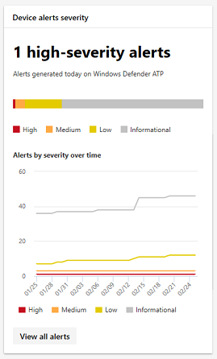
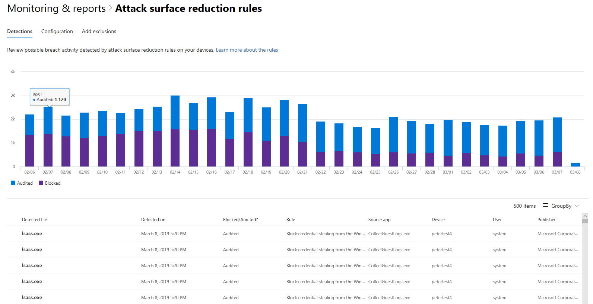

# <a name="monitor-devices-in-microsoft-365-security"></a>Supervisar los dispositivos de seguridad de Microsoft 365

Mantenga los dispositivos protegidos, actualizados y detecte posibles amenazas en el centro de seguridad de Microsoft 365.

## <a name="view-device-alerts"></a>Ver alertas de dispositivos

Obtén las alertas actualizadas sobre la actividad de infracciones y otras amenazas de los dispositivos desde ATP de Windows Defender (disponible con una licencia E5). El centro de seguridad 365 de Microsoft supervisa con eficacia estas alertas en un nivel alto usando el flujo de trabajo preferido.

### <a name="monitor-high-impact-alerts"></a>Supervisar alertas de alto impacto

Cada alerta de ATP de Windows Defender tiene una gravedad correspondiente (alta, media, baja o informativa) que indica su posible impacto en la red si se deja desatendida.  

Use la tarjeta de **gravedad de alertas de dispositivos** para centrarse específicamente en las alertas más graves y que puedan requerir respuesta inmediata. Desde esta tarjeta, puede ver más información en el portal del centro de seguridad de Windows Defender.



### <a name="understand-sources-of-alerts"></a>Comprender los orígenes de las alertas

Windows Defender ATP aprovecha los datos de una amplia gama de sensores de seguridad y orígenes de inteligencia para generar alertas. Por ejemplo, puede usar la información de detección de antivirus de Windows Defender y antimalware de terceros, así como de su propia inteligencia de amenazas personalizada que se proporciona a través de la API del servicio Web.

La tarjeta orígenes de **detección de alertas de dispositivo** muestra la distribución de las alertas por origen. Esta tarjeta puede ayudarle a realizar un seguimiento de las actividades relacionadas con determinados orígenes, especialmente con los orígenes personalizados. También puede usarlo para centrarse en las alertas procedentes de sensores que no están configurados para bloquear automáticamente la actividad o los componentes malintencionados.


Desde esta tarjeta, puede ver más información en el portal del centro de seguridad de Windows Defender.

### <a name="understand-the-types-of-threats-that-trigger-alerts"></a>Descripción de los tipos de amenazas que desencadenan alertas

ATP de Windows Defender ordena cada alerta en una categoría que representa una determinada fase de la cadena de ataques o un tipo de componente de amenaza. Por ejemplo, la actividad de amenazas detectadas se puede clasificar en "movimiento lateral" para indicar que la actividad implicaba un intento de llegar a otros dispositivos de la red y que se produjera después de que los atacantes hayan obtenido una inicialización. Cuando se detecta, un componente de amenaza puede clasificarse ampliamente como "malware" o más específicamente como "ransomware", "robo de credenciales" u otros tipos de software malintencionado o no deseado.

La tarjeta de **categorías de amenaza de dispositivo** muestra la distribución de las alertas a estas categorías. Puede usar esta información para identificar la actividad de amenazas, como los intentos de robo de credenciales, que pueden tener un impacto más significativo en comparación con los intentos de ingeniería social, por ejemplo. También puede usar esta para supervisar amenazas potencialmente destructivas como ransomware.


### <a name="monitor-active-alerts"></a>Supervisar alertas activas

La tarjeta de **Estado de alerta de dispositivo** indica el número de alertas que no se han resuelto y que pueden requerir atención. Desde esta tarjeta, puede ver más información en el portal del centro de seguridad de Windows Defender.


### <a name="monitor-classification-of-resolved-alerts"></a>Supervisión de la clasificación de las alertas resueltas

Al resolver una alerta de ATP de Windows Defender, el personal de seguridad puede especificar si se ha verificado una alerta como:

* Una alerta verdadera que identifica la actividad de infracciones real o los componentes de amenazas
* Una alerta falsa que ha detectado incorrectamente actividad normal

La tarjeta de **clasificación de alertas de dispositivo** muestra si las alertas resueltas se clasificaron como verdaderas o falsas alertas. Desde esta tarjeta, puede ver más información en el portal del centro de seguridad de Windows Defender.

Nota: en algunos casos, la información de clasificación no está disponible para determinadas alertas.


### <a name="monitor-determination-of-resolved-alerts"></a>Determinación de la determinación de alertas resueltas

Además de clasificar si una alerta es verdadera o falsa durante la resolución, el personal de seguridad puede proporcionar una determinación, que indica el tipo de actividad normal o malintencionada que se encontró al validar la alerta.

La tarjeta de **determinación de alertas de dispositivos** muestra la determinación que se proporciona para cada alerta, en concreto:

* **Apt** : amenaza persistente avanzada, que indica que el componente de amenaza o actividad detectada forma parte de una infracción compleja diseñada para llegar a la red afectada  
* **Malware** : archivo o código malintencionado
* **Personal de seguridad** : actividad normal realizada por el personal de seguridad
* **Pruebas de seguridad** : actividades o componentes diseñados para simular amenazas reales y que se espera que desencadenen sensores de seguridad y generen alertas
* **Software no deseado** : aplicaciones y otro software que no se consideran malintencionados pero que infringen las directivas o los estándares de uso aceptables
* **Otros** : cualquier otra determinación que no se incluya en los tipos proporcionados

Desde esta tarjeta, puede ver más información en el centro de seguridad de Windows Defender.


### <a name="understand-which-devices-are-at-risk"></a>Comprender qué dispositivos están expuestos

La **protección de dispositivos** muestra el nivel de riesgo para los dispositivos. El nivel de riesgo se basa en factores como el tipo y la gravedad de las alertas en el dispositivo.


## <a name="monitor-and-report-status-of-intune-managed-devices"></a>Supervisión e informes del estado de los dispositivos administrados por Intune

Los siguientes informes y supervisión contienen datos de los dispositivos inscritos en Intune. No se incluyen los datos de los dispositivos no inscritos. Solo los administradores globales pueden ver estas tarjetas.

Los datos de dispositivos inscritos de Intune incluyen:

* Cumplimiento de dispositivos
* Dispositivos con malware activo
* Tipos de malware en dispositivos
* Malware en dispositivos
* Dispositivos con detecciones de malware
* Usuarios con detecciones de malware

### <a name="monitor-device-compliance"></a>Supervisar el cumplimiento de dispositivos

El **cumplimiento de dispositivos** muestra el número de dispositivos inscritos en Intune compatibles con las directivas de configuración.


### <a name="discover-devices-with-malware-detections"></a>Detectar dispositivos con detecciones de malware

**Detecciones de malware de dispositivos** proporciona el número de dispositivos inscritos de Intune con malware que no se han resuelto completamente debido a acciones pendientes: un reinicio, un análisis completo o acciones manuales del usuario, o si la acción de corrección no se completó correctamente.


### <a name="understand-the-types-of-malware-detected"></a>Descripción de los tipos de malware detectados

**Tipos de malware en dispositivos** muestra distintos tipos de malware que se han detectado en los dispositivos inscritos en Intune. Puede investigar cada tipo en el centro de seguridad 365 de Microsoft.


### <a name="understand-the-specific-malware-detected-on-your-devices"></a>Comprender el malware específico detectado en los dispositivos

**Malware on** Devices proporciona una lista del malware específico detectado en los dispositivos.


### <a name="understand-which-devices-have-the-most-malware"></a>Conocer los dispositivos que tienen más malware

**Dispositivos con detecciones de malware** muestra los dispositivos que tienen más detecciones de malware. En el centro de seguridad de Microsoft 365, puede investigar si el malware está activo, quién usa el dispositivo y su estado de administración en Intune.


### <a name="understand-which-users-have-devices-with-the-most-malware"></a>Comprender qué usuarios tienen dispositivos con más malware

**Los usuarios con detecciones de malware** muestran a los usuarios con dispositivos que han detectado más malware. En el centro de seguridad de Microsoft 365, puede ver cuántos dispositivos se asignan a cada usuario y más información acerca de cada dispositivo y el tipo de malware.


## <a name="monitor-and-manage-asr-rule-deployment-and-detections"></a>Supervisión y administración de la implementación y detección de reglas de ASR

[Las reglas de reducción de superficie de ataques (ASR)](https://docs.microsoft.com/en-us/windows/security/threat-protection/windows-defender-exploit-guard/attack-surface-reduction-exploit-guard) ayudan a evitar que las acciones y aplicaciones que suelen usar los ataques de malware que buscan equipos infecten. Estas reglas controlan Cuándo y cómo se pueden ejecutar los ejecutables. Por ejemplo, puede impedir que JavaScript o VBScript inicien un archivo ejecutable descargado, bloquee las llamadas a la API de Win32 desde macros de Office o bloquee procesos que se ejecuten desde unidades USB.


La tarjeta de **reglas de reducción de superficie de ataques** proporciona información general sobre la implementación de reglas en los dispositivos.

La barra superior de la tarjeta muestra el número total de dispositivos que se encuentran en los siguientes modos de implementación:

* **Modo de bloqueo** : dispositivos con al menos una regla configurada para bloquear la actividad detectada
* **Modo auditoría** : dispositivos sin reglas establecidas para bloquear la actividad detectada, pero tiene al menos una regla establecida para auditar la actividad detectada  
* **** Desactivado: dispositivos con todas las reglas de ASR desactivadas

La parte inferior de esta tarjeta muestra la configuración por regla en los dispositivos. Cada barra indica el número de dispositivos que están configurados para bloquear o auditar o que la regla se ha desactivado completamente.

### <a name="view-asr-detections"></a>Ver detecciones de ASR

Para ver información detallada sobre las detecciones de reglas de ASR en la red, seleccione **Ver detecciones** en la tarjeta de **reglas de reducción de superficie de ataques** . Se **** abrirá la pestaña detecciones de la página informe detallado.



El gráfico de la parte superior de la página muestra las detecciones con detecciones de agrupamiento de tiempo que se bloquearon o auditaron. La tabla de la parte inferior muestra las detecciones más recientes. Use la siguiente información en la tabla para comprender la naturaleza de las detecciones:

* **Archivo detectado** : el archivo, normalmente un script o un documento, cuyo contenido activó la actividad de ataque sospechoso
* **Regla** : nombre que describe las actividades de ataque para las que se ha diseñado la regla. Leer acerca de las reglas de ASR existentes
* **Aplicación de origen** : la aplicación que ha cargado o ejecutado contenido que desencadena la actividad de ataque sospechoso. Puede ser una aplicación legítima, como un explorador Web, una aplicación de Office o una herramienta del sistema como PowerShell.
* **Editor** : proveedor que liberó la aplicación de origen

### <a name="review-device-asr-rule-settings"></a>Revisar la configuración de la regla de ASR del dispositivo

En la página informe de **reglas de reducción de superficie de ataques** , vaya a la ficha de **configuración** para revisar la configuración de las reglas para dispositivos individuales. Seleccione un dispositivo para obtener información detallada acerca de si cada regla está en modo de bloqueo, modo de auditoría o apagado por completo.


Microsoft Intune proporciona funciones de administración para las reglas de ASR. Si desea actualizar la configuración, seleccione Introducción a **** **configurar dispositivos** en la ficha para abrir Administración de dispositivos en Intune.

### <a name="exclude-files-from-asr-rules"></a>Excluir archivos de las reglas de ASR

El centro de seguridad 365 de Microsoft recopila los nombres de los [archivos que](https://docs.microsoft.com/windows/security/threat-protection/windows-defender-exploit-guard/troubleshoot-asr#add-exclusions-for-a-false-positive) puede que desee excluir de las detecciones mediante las reglas de reducción de la superficie de ataques. Al excluir archivos, puede reducir las detecciones de falsos positivos y implementar con mayor confianza las reglas de reducción de superficie de ataques en el modo de bloqueo.

Las exclusiones se administran en Microsoft Intune, pero el centro de seguridad de Microsoft 365 proporciona una herramienta de análisis para ayudarle a comprender los archivos. Para iniciar la recopilación de archivos para su exclusión, vaya a la pestaña **agregar exclusiones** en la página del informe **reglas de reducción de superficie de ataques** .

>[!NOTE]  
>La herramienta analiza las detecciones por todas las reglas de reducción de la superficie de ataque, pero [solo algunas reglas admiten exclusiones](https://docs.microsoft.com/windows/security/threat-protection/windows-defender-exploit-guard/attack-surface-reduction-exploit-guard#attack-surface-reduction-rules).


En la tabla se enumeran todos los nombres de archivo detectados por las reglas de reducción de la superficie de ataques. Puede seleccionar archivos para revisar el impacto de excluirlos:

* El número de detecciones
* El número de dispositivos que informan sobre las detecciones

Para obtener una lista de los archivos seleccionados con todas las rutas de acceso para la exclusión, seleccione **obtener rutas de exclusión**.

Registros para la regla de bloqueo de credenciales de ASR **robo desde el subsistema de la autoridad de seguridad local de Windows (LSASS. exe)** Capture la aplicación de origen **LSASS. exe**, un archivo de sistema normal, como el archivo detectado. Como resultado, la lista generada de rutas de exclusión incluirá este archivo. Para excluir el archivo que desencadenó esta regla en lugar de **LSASS. exe**, use la ruta de acceso a la aplicación de origen en lugar del archivo detectado.

Para encontrar la aplicación de origen, ejecute la siguiente [consulta de búsqueda avanzada](https://docs.microsoft.com/windows/security/threat-protection/windows-defender-atp/advanced-hunting-windows-defender-advanced-threat-protection) para esta regla específica (identificada por el identificador de regla 9e6c4e1f-7d60-472f-ba1a-a39ef669e4b2): 

```MiscEvents
| where EventTime > ago(7d)
| where ActionType startswith "Asr"
| where AdditionalFields contains "9e6c4e1f-7d60-472f-ba1a-a39ef669e4b2"
| project InitiatingProcessFolderPath, InitiatingProcessFileName
```

#### <a name="check-files-for-exclusion"></a>Comprobar archivos para su exclusión
Antes de excluir un archivo de ASR, le recomendamos que inspeccione el archivo para determinar si realmente no es malintencionado.

Para revisar un archivo, use la [Página de información del archivo](https://docs.microsoft.com/windows/security/threat-protection/windows-defender-atp/investigate-files-windows-defender-advanced-threat-protection) en el centro de seguridad de Windows Defender. La página proporciona información sobre la prevalencia y la relación de detección de virus VirusTotal. También puede usar la página para enviar el archivo para un análisis detallado.

Para buscar un archivo detectado en el centro de seguridad de Windows Defender, busque todas las detecciones de ASR mediante la siguiente consulta de búsqueda avanzada:

```MiscEvents
| where EventTime > ago(7d)
| where ActionType startswith "Asr"
| project FolderPath, FileName, SHA1, InitiatingProcessFolderPath, InitiatingProcessFileName, InitiatingProcessSHA1
```

Use **SHA1** o **InitiatingProcessSHA1** en los resultados para buscar el archivo mediante la barra de búsqueda universal en el centro de seguridad de Windows Defender.
