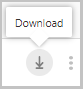

# Directivas de sesión en Office 365 Cloud App SecuritySession policies in Office 365 Cloud App Security

|Evaluación \* *\>*\*\*\*\*\*Evaluation\*\* \>\*\*|Planeación \* *\>*\*\*\*\*\*Planning\*\* \>\*\*|Implementación \* *\>*\*\*\*\*\*Deployment\*\* \>\*\*|Uso \* \* \* \*\*\*\*\*Utilization\*\*\*\*|
|:-----|:-----|:-----|:-----|
|[Empezar a evaluarStart evaluating](office-365-cas-overview.md)   |[Empezar a planearStart planning](get-ready-for-office-365-cas.md)   |Ya está aquí.You are here!    [Paso siguienteNext step](ocas-access-policies.md)   |[Empezar a usarStart utilizing](utilization-activities-for-ocas.md)   |

Las directivas de sesión de seguridad de aplicación de nube de Office 365 permiten la supervisión en tiempo real de los usuarios, lo que le ofrece una visibilidad granular de las aplicaciones de Office 365 y la capacidad de realizar diferentes acciones según la Directiva que establezca para una sesión de usuario.Office 365 Cloud App Security session policies enable real-time session-level monitoring, affording you granular visibility into Office 365 apps and the ability to take different actions depending on the policy you set for a user session. En lugar de permitir o bloquear completamente el acceso, con el control de sesión puede permitir el acceso a la vez que supervisa la sesión o limitar actividades de sesión específicas mediante el uso de las funciones de proxy inverso del control de aplicación de acceso condicional.Instead of allowing or blocking access completely, with session control you can allow access while monitoring the session and/or limit specific session activities using the reverse proxy capabilities of Conditional Access App Control.

Por ejemplo, puede decidir que desde dispositivos no administrados o para sesiones procedentes de ubicaciones específicas, desea permitir que el usuario tenga acceso a la aplicación, pero también limitar la descarga de archivos confidenciales o requerir que determinados documentos estén protegidos tras la descarga.For example, you can decide that from unmanaged devices, or for sessions coming from specific locations, you want to allow the user to access the app but also limit the download of sensitive files or require that certain documents be protected upon download. Las directivas de sesión permiten establecer estos controles de sesión de usuario y permitir el acceso y le permiten:Session policies enable you to set these user-session controls and allow access and enables you to:

- [Supervisar todas las actividadesMonitor all activities](#monitor-all-activities)

- [Bloquear todas las descargasBlock all downloads](#block-all-downloads)

- [Bloquear actividades específicasBlock specific activities](#block-specific-activities)

- [Proteger archivos al descargarlosProtect files on download](#protect-files-on-download)

## Requisitos previos para usar directivas de sesiónPrerequisites to using session policies

- Licencia de Azure AD Premium P1Azure AD Premium P1 license

- Las aplicaciones de Office 365 relevantes deben [implementarse con el control de aplicación de acceso condicional](ocas-deploy-conditional-access-app-control.md)The relevant Office 365 apps should be [deployed with Conditional Access App Control](ocas-deploy-conditional-access-app-control.md)

- debe haber una  [directiva de acceso condicional de Azure AD](https://docs.microsoft.com/azure/active-directory/active-directory-conditional-access-azure-portal)en vigor que redirija a los usuarios a Office 365 Cloud App Security.An [Azure AD conditional access policy](https://docs.microsoft.com/azure/active-directory/active-directory-conditional-access-azure-portal) should be in place that redirects users to Office 365 Cloud App Security

## Crear una directiva de acceso condicional de Azure ADCreate an Azure AD conditional access policy

Directivas de acceso condicional de Azure Active Directory y directivas de sesión de Cloud App Security trabajan conjuntamente para examinar cada sesión de usuario y tomar decisiones de directiva para cada aplicación.Azure Active Directory conditional access policies and Cloud App Security session policies work in tandem to examine each user session and make policy decisions for each app. Para configurar una directiva de acceso condicional en Azure AD, siga este procedimiento:To set up a conditional access policy in Azure AD, follow this procedure:

1. Configure una  [Directiva de acceso condicional de Azure ad](https://docs.microsoft.com/azure/active-directory/active-directory-conditional-access-azure-portal)con asignaciones para un usuario o grupo de usuarios y la aplicación que quiera controlar con el control de aplicación de acceso condicional.Configure an [Azure AD conditional access policy](https://docs.microsoft.com/azure/active-directory/active-directory-conditional-access-azure-portal) with assignments for a user or group of users and the app you want to control with the Conditional Access App Control. Nota: esta directiva solo afectará a las aplicaciones que se implementaron con el  [control de aplicación de acceso condicional](ocas-deploy-conditional-access-app-control.md).NOTE: Only apps that were [deployed with Conditional Access App Control](ocas-deploy-conditional-access-app-control.md) will be affected by this policy.

2. enrutar a los usuarios a Office 365 Cloud App Security seleccionando la opción **usar el Control de aplicación de acceso condicional exige restricciones** en la página de la **sesión** .Route users to Office 365 Cloud App Security by selecting the **Use Conditional Access App Control enforced restrictions** in the **Session** page.

## Crear una directiva de sesión de Cloud App SecurityCreate a Cloud App Security session policy

Para crear una nueva Directiva de sesión, siga este procedimiento:To create a new session policy, follow this procedure:

1. En el portal, seleccione **control** seguido de **directivas**.In the portal, select **Control** followed by **Policies**.

2. En la página **directivas** , haga clic en **crear Directiva** y seleccione **Directiva de sesión**.In the **Policies** page, click **Create policy** and select **Session policy**.

3. En la ventana **Directiva** de sesión, asigne un nombre a la Directiva.In the **Session policy** window, assign a name for your policy

4. En el campo **tipo** de control de sesión:In the **Session control type** field:
    
    - Seleccione **supervisar solo** si solo desea supervisar actividades por parte de los usuarios.Select **Monitor only** if you only want to monitor activities by users. Esta selección creará una directiva de supervisión solo para las aplicaciones que haya seleccionado, donde se descargarán todos los inicios de sesión, las descargas heurísticas y los tipos de actividad.This selection will create a Monitor only policy for the apps you selected where all sign-ins, heuristic downloads, and Activity types will be downloaded.
    
    - Seleccione **controlar la descarga del archivo (con DLP)** si desea supervisar las actividades de los usuarios.Select **Control file download (with DLP)** if you want to monitor user activities. Puede realizar acciones adicionales, como bloquear o proteger descargas para los usuarios.You can take additional actions like block or protect downloads for users.
    
    - Seleccione **bloquear actividades** para bloquear actividades específicas, que puede seleccionar mediante el filtro **tipo** de actividad.Select **Block activities** to block specific activities, which you can select using the **Activity type** filter. Se supervisarán todas las actividades de las aplicaciones seleccionadas (y se indicará en el registro de actividad).All activities from selected apps will be monitored (and reported in the Activity log). Las actividades específicas que seleccione se bloquearán si selecciona la acción **bloquear** .The specific activities you select will be blocked if you select the **Block** action. Las actividades específicas que seleccionó provocarán alertas si selecciona la acción de **prueba** y tiene activadas las alertas.The specific activities you selected will raise alerts if you select the **Test** action and have alerts turned on.

5. En **origen** de la actividad en las **actividades que coinciden con todas las de la siguiente** sección, seleccione filtros de actividad adicionales para aplicarlos a la Directiva.Under **Activity source** in the **Activities matching all of the following** section, select additional activity filters to apply to the policy. Estos filtros pueden incluir las siguientes opciones:These filters can include the following options:
    
    - **Etiquetas de dispositivo**: Use este filtro para identificar los dispositivos no administrados.**Device tags**: Use this filter to identify unmanaged devices.
    
    - **Ubicación**: Use este filtro para identificar ubicaciones desconocidas (y, por lo tanto, arriesgadas).**Location**: Use this filter to identify unknown (and therefore risky) locations.
    
    - **Dirección IP**: Use este filtro para filtrar por direcciones IP o use etiquetas de direcciones IP asignadas previamente.**IP address**: Use this filter to filter per IP addresses or use previously assigned IP address tags.
    
    - **Etiqueta de agente de usuario**: Use este filtro para habilitar la heurística de identificación de aplicaciones móviles y de escritorio.**User agent tag**: Use this filter to enable the heuristic to identify mobile and desktop apps. Este filtro se puede establecer como igual o no igual que el **cliente nativo**.This filter can be set to equals or doesn't equal **Native client**. Este filtro debe probarse con sus aplicaciones móviles y de escritorio para cada aplicación en la nube.This filter should be tested against your mobile and desktop apps for each cloud app. Nota: las directivas de sesión no son compatibles con aplicaciones móviles y de escritorio.NOTE: Session policies don’t support mobile and desktop apps. Las aplicaciones móviles y las aplicaciones de escritorio también se pueden bloquear o permitir mediante la creación de una directiva de acceso.Mobile apps and desktop apps can also be blocked or allowed by creating an access policy.

6. Si seleccionó la opción para **controlar la descarga de archivos (con DLP)**, en **origen** de la actividad en la sección **archivos que coincidan con todas las opciones** , seleccione filtros de archivo adicionales para aplicar a la Directiva.If you selected the option to **Control file download (with DLP)**, under **Activity source** in the **Files matching all of the following** section, select additional file filters to apply to the policy. Estos filtros pueden incluir las siguientes opciones:These filters can include the following options:
        
    - **Etiqueta de clasificación** : Use este filtro si su organización usa Azure Information Protection y sus datos están protegidos por sus etiquetas de clasificación.**Classification label** - Use this filter if your organization uses Azure Information Protection and your data has been protected by its Classification labels. Puede filtrar los archivos según la etiqueta de clasificación que les haya aplicado.You can filter files based on the Classification label you applied to them. Para obtener más información sobre la integración con Azure Information Protection, vea [integración con Azure Information Protection](https://docs.microsoft.com/cloud-app-security/azip-integration).For more information about integration with Azure Information Protection, see [Azure Information Protection integration](https://docs.microsoft.com/cloud-app-security/azip-integration).
        
    - **Nombre de archivo** : Use este filtro para aplicar la Directiva a archivos específicos.**File name** - Use this filter to apply the policy to specific files.
        
    - **Tipo de archivo** : Use este filtro para aplicar la Directiva a tipos de archivo específicos, por ejemplo, bloquear la descarga de todos los archivos. xls.**File type** - Use this filter to apply the policy to specific file types, for example, block download for all .xls files.
    
    - En la sección **inspección** de contenido, establezca si desea habilitar el motor de DLP para que analice los documentos y el contenido de los archivos.In the **Content inspection** section, set whether you want to enable the DLP engine to scan documents and file content.
    
    - En **acciones**, seleccione uno de los siguientes elementos:Under **Actions**, select one of the following items:
        
        - **Prueba (supervisar todas las actividades)**: establezca esta acción para permitir la descarga explícita de acuerdo con los filtros de directiva que establezca.**Test (Monitor all activities)**: Set this action to explicitly allow download according to the policy filters you set.
        
        - **Bloquear (bloquear la descarga de archivos y supervisar todas las actividades)**: establezca esta acción para bloquear explícitamente la descarga según los filtros de directiva que establezca.**Block (Block file download and monitor all activities)**: Set this action to explicitly block download according to the policy filters you set. Para obtener más información, consulte [how Block download Works](https://docs.microsoft.com/en-us/cloud-app-security/session-policy-aad#block-download).For more information, see [How block download works](https://docs.microsoft.com/en-us/cloud-app-security/session-policy-aad#block-download).
        
        - **Protect (Apply Classification Label to download and monitor All Activities)**: esta opción solo está disponible si selecciona **controlar la descarga de archivos (con DLP)** en **Directiva de sesión**.**Protect (Apply classification label to download and monitor all activities)**: This option is only available if you selected **Control file download (with DLP)** under **Session policy**. Si su organización usa Azure Information Protection, puede establecer una **acción** para aplicar un conjunto de etiquetas de clasificación en Azure Information Protection al archivo.If your organization uses Azure Information Protection, you can set an **Action** to apply a classification label set in Azure Information Protection to the file. Para obtener más información, vea [Cómo funciona proteger la descarga](https://docs.microsoft.com/en-us/cloud-app-security/session-policy-aad#protect-download).For more information, see [How protect download works](https://docs.microsoft.com/en-us/cloud-app-security/session-policy-aad#protect-download).

7. Puede  **crear una alerta para cada evento que coincida con la gravedad de la Directiva**y establecer un límite de alerta.You can **Create an alert for each matching event with the policy's severity** and set an alert limit. Seleccione si desea la alerta como un correo electrónico, un mensaje de texto o ambos.Select whether you want the alert as an email, a text message, or both.

## Supervisar todas las actividadesMonitor all activities

Al crear una directiva de sesión, cada sesión de usuario que coincida con la Directiva se redirige al control de la sesión en lugar de a la aplicación directamente.When you create a session policy, each user session that matches the policy is redirected to session control rather than to the app directly. El usuario verá un aviso de supervisión para hacerle saber que se están supervisando sus sesiones.The user will see a monitoring notice to let them know that their sessions are being monitored.

Si no desea notificar al usuario que se está supervisando, puede deshabilitar el mensaje de notificación.If you don't want to notify the user that they're being monitored, you can disable the notification message.

1. En la COG de configuración, seleccione **Configuración general**.Under the settings cog, select **General settings**.

2. A continuación, en **control** de aplicación de acceso condicional, seleccione supervisión de **usuarios**y anule la selección de la casilla **notificar a los usuarios** .Then, under **Conditional Access App Control** select **User monitoring** and unselect the **Notify users** checkbox.

Para mantener al usuario dentro de la sesión, el control de la aplicación de acceso condicional reemplaza todas las direcciones URL relevantes, las secuencias de comandos Java y las cookies dentro de la sesión de la aplicación con las direcciones URL de seguridad de aplicación de Office 365 Cloud.To keep the user within the session, Conditional Access App Control replaces all the relevant URLs, Java scripts, and cookies within the app session with Office 365 Cloud App Security URLs. Por ejemplo, si la aplicación devuelve una página con vínculos cuyos dominios terminan `myapp.com`con, el control de la aplicación de acceso condicional reemplaza los vínculos con `myapp.com.us.cas.ms`dominios que terminan por algo como.For example, if the app returns a page with links whose domains ends with `myapp.com`, Conditional Access App Control replaces the links with domains ending with something like `myapp.com.us.cas.ms`. De esta forma, toda la sesión se supervisa con Office 365 Cloud App Security.This way the entire session is monitored by Office 365 Cloud App Security.

El control de aplicación de acceso condicional registra los registros de tráfico de cada sesión de usuario que se redirige a través de él.Conditional Access App Control records the traffic logs of every user session that is routed through it. Los registros de tráfico incluyen el tiempo, la dirección IP, el agente de usuario, las direcciones URL visitadas y el número de bytes cargados y descargados.The traffic logs include the time, IP, user agent, URLs visited, and the number of bytes uploaded and downloaded. Estos registros se analizan y se agrega un informe continuo, un **control de aplicación de acceso condicional de seguridad de la aplicación de nube**, a la lista de informes de detección en la nube del panel de detección en la nube.These logs are analyzed and a continuous report, **Cloud App Security Conditional Access App Control**, is added to the list of Cloud Discovery reports in the Cloud Discovery dashboard.

### Para exportar estos registros:To export these logs:

1. Vaya a la configuración COG y haga clic en **control de aplicación de acceso condicional**.Go to the settings cog and click **Conditional Access App Control**.

2. En el lado derecho de la tabla, haga clic en el botón exportar.On the right side of the table, click the export button.  

3. Seleccione el rango del informe y haga clic en **exportar**.Select the range of the report and click **Export**. Este proceso puede tardar cierto tiempo.This process may take some time.

### Para descargar el registro exportado:To download the exported log:

1. Una vez preparado el informe, vaya a **configuración** y luego a **informes**exportados.After the report is ready, go to **Settings** and then **Exported reports**.

2. En la tabla, seleccione el informe relevante de la lista de **registros de tráfico de control de aplicaciones de acceso condicional**y haga clic en descargar.In the table, select the relevant report from the list of **Conditional Access App Control traffic logs** and click download.  

## Bloquear todas las descargasBlock all downloads

Cuando **bloquear** se establece como la **acción** que desea realizar en la Directiva de sesión de Cloud App Security, el control de aplicación de acceso condicional impide que un usuario descargue un archivo según los filtros de archivo de la Directiva.When **Block** is set as the **Action** you want to take in the Cloud App Security session policy, Conditional Access App Control prevents a user from downloading a file per the policy’s file filters. Office 365 Cloud App Security reconoce un evento de descarga para cada aplicación cuando un usuario inicia una descarga.A download event is recognized by Office 365 Cloud App Security for each app when a user starts a download. El control de aplicación de acceso condicional interviene en tiempo real para evitar que se ejecute.Conditional Access App Control intervenes in real time to prevent it from running. Cuando se recibe la señal de que un usuario ha iniciado una descarga, el control de la aplicación \*\*\*\* de acceso condicional devuelve un mensaje restringido descargar al usuario y reemplaza el archivo descargado con un archivo de texto.When the signal is received that a user has initiated a download, Conditional Access App Control returns a **Download restricted** message to the user and replaces the downloaded file with a text file. El mensaje del archivo de texto al usuario se puede configurar y personalizar desde la Directiva de sesión.The text file's message to the user can be configured and customized from the session policy.

## Bloquear actividades específicasBlock specific activities

Cuando se establece **actividades** de bloqueo como **tipo de actividad**, puede seleccionar actividades específicas para que se bloqueen en aplicaciones específicas.When **Block activities** is set as the **Activity type**, you can select specific activities to block in specific apps. Todas las actividades de las aplicaciones seleccionadas se supervisarán y se notificarán en el registro de actividades.All activities from selected apps will be monitored and reported in the Activity log. Las actividades específicas que seleccione se bloquearán si selecciona la acción **bloquear** .The specific activities you select will be blocked if you select the **Block** action. Las actividades específicas que seleccionó provocarán alertas si selecciona la acción de **prueba** y tiene activadas las alertas.The specific activities you selected will raise alerts if you select the **Test** action and have alerts turned on.

**Bloquee actividades** específicas y aplíquela a grupos específicos para crear un modo de solo lectura completo para su organización.**Block specific activities** and apply it to specific groups to create a comprehensive read-only mode for your organization.

## Proteger archivos al descargarlosProtect files on download

Seleccione **bloquear actividades** para bloquear actividades específicas, que puede encontrar mediante el filtro **tipo** de actividad.Select **Block activities** to block specific activities, which you can find using the **Activity type** filter. Se supervisarán todas las actividades de las aplicaciones seleccionadas (y se indicará en el registro de actividad).All activities from selected apps will be monitored (and reported in the Activity log). Las actividades específicas que seleccione se bloquearán si selecciona la acción **bloquear** .The specific activities you select will be blocked if you select the **Block** action. Las actividades específicas que seleccionó provocarán alertas si selecciona la acción de **prueba** y tiene activadas las alertas.The specific activities you selected will raise alerts if you select the **Test** action and have alerts turned on.

Cuando se establece **proteger** como la **acción** que se realizará en la Directiva de sesión de Cloud App Security, el control de aplicación de acceso condicional aplica la etiquetación y la posterior protección de un archivo según los filtros de archivo de la Directiva.When **Protect** is set as the **Action** to be taken in the Cloud App Security session policy, Conditional Access App Control enforces the labeling and subsequent protection of a file per the policy’s file filters. Las etiquetas se configuran en la consola de Azure Information Protection y es necesario seleccionar **proteger** en la etiqueta para que aparezca como una opción en la Directiva de Cloud App Security.Labels are configured in the Azure Information Protection console and **Protect** must be selected within the label for it to appear as an option in the Cloud App Security policy. Cuando se selecciona una etiqueta y se descarga un archivo que cumple los criterios de la Directiva de Cloud App Security, la etiqueta y la protección correspondiente (con permisos) se aplican al archivo tras la descarga.When a label is selected, and a file is downloaded that meets the criteria of the Cloud App Security policy, the label, and corresponding protection (with permissions) is applied to the file upon download. El archivo original permanece tal cual en la aplicación en la nube mientras el archivo descargado ya está protegido.The original file remains as-is in the cloud app while the downloaded file is now protected. Los usuarios que intenten tener acceso al archivo deben cumplir los requisitos de permisos determinados por la protección aplicada.Users who try to access the file must meet the permission requirements determined by the protection applied.

## Pasos siguientesNext steps

- [Obtenga información sobre las directivas de acceso en Office 365 Cloud App SecurityLearn about access policies in Office 365 Cloud App Security](ocas-access-policies.md)

- [Bloqueo de descargas en dispositivos no administrados con capacidades de control de aplicación de acceso condicional de Azure ADBlocking downloads on unmanaged devices using Azure AD Conditional Access App Control capabilities](https://docs.microsoft.com/en-us/cloud-app-security/use-case-proxy-block-session-aad)

