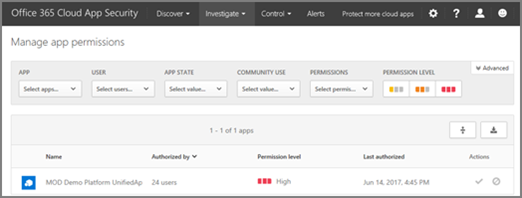

# Introducción a Office 365 Cloud App Security
  
|Evaluación **\>**|Planeación de **\>**|Implementación **\>**|Utilización de ***|
|:-----|:-----|:-----|:-----|
|¡Están aquí!    [Paso siguiente](get-ready-for-office-365-cas.md)   |[Comenzar a planear](get-ready-for-office-365-cas.md)   |[Iniciar la implementación](turn-on-office-365-cas.md)   |[Iniciar utilizando](utilization-activities-for-ocas.md)   |
   
> [!NOTE]
> Seguridad de la aplicación de Office 365 en la nube está disponible en Office 365 Enterprise E5. Si su organización usa otra suscripción de Office 365 Enterprise, seguridad de la aplicación de nube de Office 365 puede adquirirse como un complemento. (Como administrador global, en el centro de administración de Office 365, elija **facturación** \> **Agregar suscripciones**.) Para obtener más información, vea [Descripción del servicio Office 365 plataforma: seguridad de Office 365 &amp; centro de cumplimiento](https://technet.microsoft.com/en-us/library/dn933793.aspx) y [comprar o editar un complemento de Office 365 para profesionales](https://support.office.com/article/4e7b57d6-b93b-457d-aecd-0ea58bff07a6). 
  
Seguridad de la aplicación en la nube Office 365 proporciona una perspectiva de una actividad sospechosa en Office 365 por lo que puede investigar situaciones en las que son potencialmente problemáticas y, si es necesario, tomar medidas para resolver problemas de seguridad. Con la seguridad de la aplicación de nube de Office 365, puede recibir notificaciones de alertas desencadenadas para actividades atípicos o sospechosas, vea cómo se tiene acceso y se usa, los datos de la organización en Office 365 suspender las cuentas de usuario presenta actividad sospechosa y requieren a los usuarios iniciar sesión para aplicaciones de Office 365 después de que se haya desencadenado una alerta. Lea este artículo para obtener una visión general de las capacidades y características de seguridad de la aplicación de nube de Office 365.
  
    
## Cómo encontrar el portal de seguridad de la aplicación de nube de Office 365

> [!NOTE]
> Para obtener acceso al portal de seguridad de la aplicación de nube de Office 365, debe ser un administrador global, Administrador de seguridad o lector de seguridad. Para obtener más información, vea [permisos en la seguridad de Office 365 &amp; centro de cumplimiento](permissions-in-the-security-and-compliance-center.md). 
  
Puede obtener el portal de seguridad de la aplicación de nube de Office 365 a través de la seguridad de Office 365 &amp; centro de cumplimiento. Aquí es una buena forma de hacerlo:
  
1. Vaya a [https://security.microsoft.com](https://security.microsoft.com) e iniciar sesión con su cuenta de trabajo o escuela para Office 365. (Esto le llevará a la seguridad &amp; centro de cumplimiento.) 
    
2. En la seguridad &amp; centro de cumplimiento, elija **alertas** \> **avanzada de administrar las alertas**.   (Si no está habilitado aún seguridad de la aplicación de nube de Office 365, y debe ser un administrador global, [activar la seguridad de la aplicación de nube de Office 365](turn-on-office-365-cas.md).)
    
3. Elija **Ir a la seguridad de la aplicación de Office 365 en la nube**. 
    
## Policies

Office 365 funciona la seguridad de la aplicación en la nube con las directivas que se definen para su organización. Con la seguridad de la aplicación de nube de Office 365, su organización obtiene 10 directivas de detección de anomalías predefinidos y varias plantillas de directivas de actividad. Estas directivas están diseñadas para detectar anomalías general, identificar a los usuarios el registro de una dirección IP arriesgada, detectar actividades ransomware, detectar actividades de administrador de direcciones IP de no corporativos y mucho más.
  

  
Para ver o usar las plantillas de directiva, en el portal de seguridad de la aplicación de nube de Office 365, vaya al **Control** \> **plantillas**. 
  

  
Para obtener más información acerca de las directivas, vea los siguientes recursos:
  
- [Directivas de actividad y alertas en Office 365 Cloud App Security](activity-policies-and-alerts.md)
    
- [Directivas de detección de anomalías en Office 365 Cloud App Security](anomaly-detection-policies-in-ocas.md)
    
## Alertas

Cuando se definen las directivas, alertas informan acerca de actividades sospechosas o atípicos que se detectaron. Para ver las alertas para la organización, elija **alertas** en la barra de navegación a través de la parte superior de la pantalla. 
  

  
Tal y como se desencadenan alertas puede revisarlos para obtener más información acerca de lo que está ocurriendo. A continuación, si la actividad es aún sospechosa, puede tomar medidas. Por ejemplo, puede notificar a un usuario sobre un problema, suspender un usuario de inicio de sesión en Office 365 o requieren un usuario iniciar sesión en aplicaciones de Office 365.
  
Para obtener más información acerca de las alertas, vea los siguientes recursos:
  
- [Directivas de actividad y alertas en Office 365 Cloud App Security](activity-policies-and-alerts.md)
    
- [Directivas de detección de anomalías en Office 365 Cloud App Security](anomaly-detection-policies-in-ocas.md)
    
- [Revisar y realizar acciones en las alertas de seguridad de la aplicación de nube de Office 365](review-office-365-cas-alerts.md)
    
## Registros de actividad

Ver información acerca de las actividades del usuario en la página de registro de actividad de seguridad de la aplicación de nube de Office 365.
  

  
Para tener acceso a esta página, en el portal de seguridad de la aplicación de nube de Office 365, vaya a **investigar** \> **registro de actividad**. 
  

  
Puede usar los registros de tráfico web con seguridad de la aplicación de nube de Office 365, demasiado. Cuantos más detalles que se incluyen en los archivos de registro, la mejor visibilidad tendrá en la actividad del usuario. Puede usar los archivos de registro de Barracuda, capa azul, Check Point, Cisco, Clavister, Dell SonicWALL, Fortinet, Juniper, McAfee, Microsoft, Palo Alto, Sophos, Squid, Websence, Zscaler y mucho más.
  
[Obtenga información acerca de los orígenes de datos y los registros de tráfico web para seguridad de la aplicación de nube de Office 365](web-traffic-logs-and-data-sources-for-ocas.md)
  
## Permisos de aplicación

Con Office 365 en la nube seguridad de la aplicación, puede permitir o impedir que los usuarios de la organización para usar aplicaciones de terceros que tienen acceso a datos en Office 365.
  

  
Para llegar a esta página, vaya a **investigar** \> **permisos de aplicación**. 
  

  
[Administrar permisos de aplicación con Office 365 Cloud App Security](manage-app-permissions-in-ocas.md)
  
## Panel de detección de la nube

El **Panel de la detección de la nube**, también conocida como **Detección de aplicaciones de productividad**, muestra información sobre el uso de la aplicación en la nube dentro de la organización. Puede ver información acerca de aplicaciones, los usuarios, el tráfico, las transacciones y más mediante este panel. El panel de detección en la nube es similar a la siguiente imagen: 
  

  
Para llegar a este panel, en el portal de seguridad de la aplicación de nube de Office 365, vaya a **descubrir** \> **panel de detección de la nube**. 
  

  
[Revisar los resultados de la detección de aplicaciones en Office 365 Cloud App Security](review-app-discovery-findings-in-ocas.md)
  
## Pasos siguientes

- Obtenga la [Guía de uso y casos de uso de seguridad de aplicación de nube de Office 365](https://aka.ms/O365CASGuide)
    
- [Prepararse para Office 365 Cloud App Security](get-ready-for-office-365-cas.md)
    

