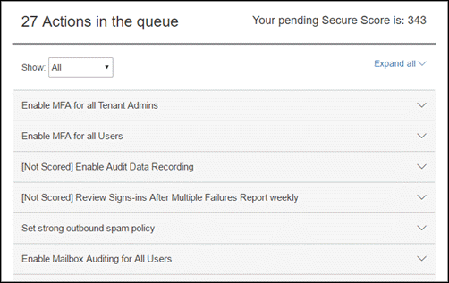

# Introducción a la puntuación segura de Office 365Introducing the Office 365 Secure Score

¿Se ha preguntado cómo proteger su organización de Office 365 realmente es así? Tiempo para detener preguntando - la puntuación de seguro de Office 365 está aquí para ayudarle. Puntuación seguro analiza la seguridad de su organización de Office 365 basándose en sus actividades normales y la configuración de seguridad y asigna una puntuación. Considérelo como una puntuación de crédito para la seguridad.Ever wonder how secure your Office 365 organization really is? Time to stop wondering - the Office 365 Secure Score is here to help. Secure Score analyzes your Office 365 organization's security based on your regular activities and security settings and assigns a score. Think of it as a credit score for security.
  
## En este artículoIn this article

[¿Cómo obtengo puntuación seguro?How do I get to Secure Score?](office-365-secure-score.md#howtoaccess)
  
[¿Cómo funcionan?How does it work?](office-365-secure-score.md#HowWorks)
  
[¿Cómo me ayudará?How will it help me?](office-365-secure-score.md#HowHelps)
  
[Preguntas más frecuentesFAQs](office-365-secure-score.md#FAQ)
  
## ¿Cómo obtengo puntuación seguro?How do I get to Secure Score?

Cualquier persona que tenga permisos de administrador (administrador global o una función de administración personalizado) para una suscripción a Office 365 Business Premium o Enterprise puede tener acceso a la puntuación de seguro en [https://securescore.office.com](https://securescore.office.com). Los usuarios que no están asignados a un rol de administrador no podrán tener acceso a la puntuación de seguro. Sin embargo, los administradores pueden utilizar la herramienta para compartir sus resultados con otras personas de su organización.Anyone who has admin permissions (global admin or a custom admin role) for an Office 365 Business Premium or Enterprise subscription can access the Secure Score at [https://securescore.office.com](https://securescore.office.com). Users who aren't assigned an admin role won't be able to access Secure Score. However, admins can use the tool to share their results with other people in their organization.
  
## ¿Cómo funciona?How does it work?

Proteja las cifras de puntuación los servicios que Office 365 está utilizando (como OneDrive, SharePoint y Exchange), a continuación, se busca en la configuración y las actividades y los compara con una línea de base establecida por Microsoft. Obtendrá una puntuación de cómo alineadas que se basan en con procedimientos recomendados de seguridad.Secure Score figures out what Office 365 services you're using (like OneDrive, SharePoint, and Exchange) then looks at your settings and activities and compares them to a baseline established by Microsoft. You'll get a score based on how aligned you are with best security practices.
  

  
Si desea mejorar su calificación, revise la cola de acción para ver qué puede hacer para ayudar a aumentar la seguridad y reducir los riesgos.If you want to improve your score, review the action queue to see what you can do to help increase security and reduce risks.
  

  
Expanda una acción para obtener más información acerca de las amenazas que le ayudará protegen desde y cómo obtendrá el trabajo.Expand an action to learn about what threats it'll help protect you from and how you'll get the job done.
  

  
Para ver el impacto de sus acciones en la seguridad de su organización, vaya a la página **Del analizador de puntuación** y revisar el historial.To see the impact of your actions on your organization's security, go to the **Score Analyzer** page and review your history. 
  

  
Haga clic en cualquier punto de datos para ver un desglose de la puntuación de ese día. Puede desplazarse hacia abajo para ver qué controles están habilitados y le indica cuántos acumulado ese día para cada control.Click any data point to see a breakdown of your score for that day. You can scroll down to see which controls were enabled and how many points you earned that day for each control.
  

  
## ¿Cómo me ayudará?How will it help me?

Uso de puntuación seguro ayuda a aumentar la seguridad de su organización fomentando que puede utilizar las características de seguridad integradas en Office 365 (muchas de las cuales ya adquirido pero es posible que no tenga). Obtener más información acerca de estas características, tal como se utiliza la herramienta se le ayudarán a parte de la cuenta que va a llevar los pasos adecuados para proteger su organización frente a las amenazas.Using Secure Score helps increase your organization's security by encouraging you to use the built-in security features in Office 365 (many of which you already purchased but might not be aware of). Learning more about these features as you use the tool will help give you piece of mind that you're taking the right steps to protect your organization from threats.
  
Pero no sólo nuestra palabra de él. Los clientes que usen puntuación seguro han visto sus puntuación aumentar 5 veces mayor que los clientes que no son lo utilizan. (El aumento de la puntuación se corresponde con las características de seguridad que se usan en las organizaciones).But don't just take our word for it. Customers who are using Secure Score have seen their score increase 5 times more than customers who aren't using it. (The increase in score corresponds with the security features being used in their organizations.)
  
Desproteger nuestra [entrada de blog](https://go.microsoft.com/fwlink/?linkid=836898) para obtener más información.Check out our [blog post](https://go.microsoft.com/fwlink/?linkid=836898) to learn more. 
  
> [!NOTE]
> La puntuación de seguro no express una medida absoluta de cómo es probable que van a obtener tipo de brecha. Expresa la medida a la que han adoptado los controles que pueden desplazar el riesgo de que se pueda infringir. No hay ningún servicio puede garantizar que va a no ser tipo de brecha y la puntuación de seguro no se debe interpretar como una garantía de ninguna forma.The Secure Score does not express an absolute measure of how likely you are to get breached. It expresses the extent to which you have adopted controls which can offset the risk of being breached. No service can guarantee that you will not be breached, and the Secure Score should not be interpreted as a guarantee in any way. 
  
## Preguntas más frecuentesFAQs

### ¿Quién puede usar puntuación seguro?Who can use Secure Score?

Cualquier persona que tenga permisos de administrador (administrador global o una función de administración personalizado) para una suscripción a Office 365 Business Premium o Enterprise puede tener acceso a la puntuación de seguro en [https://securescore.office.com](https://securescore.office.com). Los usuarios que no están asignados a un rol de administrador no podrán tener acceso a la puntuación de seguro. Sin embargo, los administradores pueden utilizar la herramienta para compartir sus resultados con otras personas de su organización. Analizaremos incluidos otros, roles sin permisos de administrador en la lista de permisos en el futuro. Si no hay roles específicos que le gustaría que nos a tener en cuenta, háganoslo saber por registro en el [Office seguridad, privacidad &amp; la Comunidad de cumplimiento de normas](https://go.microsoft.com/fwlink/?linkid=836898).Anyone who has admin permissions (global admin or a custom admin role) for an Office 365 Business Premium or Enterprise subscription can access the Secure Score at [https://securescore.office.com](https://securescore.office.com). Users who aren't assigned an admin role won't be able to access Secure Score . However, admins can use the tool to share their results with other people in their organization. We're looking at including other, non-admin roles in the permissions list in the future. If there are specific roles you'd like us to consider, let us know by posting on the [Office Security, Privacy &amp; Compliance community](https://go.microsoft.com/fwlink/?linkid=836898).
  
### ¿Qué le [no una puntuación] quiso decir?What does [Not Scored] mean?

Acciones que se etiquetan como **[No una puntuación]** son los que puede realizar en la organización pero no examinados debido a que no están conectados en la herramienta (todavía). Por lo tanto, aún puede mejorar la seguridad, pero no recibirá crédito para esas acciones ahora mismo.Actions labeled as **[Not Scored]** are ones you can perform in your organization but won't be scored because they aren't hooked up in the tool (yet!). So, you can still improve your security, but you won't get credit for those actions right now. 
  
### ¿Con qué frecuencia es mi puntuación actualizado?How often is my score updated?

La puntuación se calcula una vez al día (aproximadamente 1:00 AM PST). Si realiza un cambio en una acción medida, la puntuación actualizará automáticamente el día siguiente. Se tardan hasta 48 horas para que un cambio se refleja en su puntuación.The score is calculated once per day (around 1:00 AM PST). If you make a change to a measured action, the score will automatically update the next day. It takes up to 48 hours for a change to be reflected in your score.
  
### ¿Quién puede ver los resultados de Mis?Who can see my results?

Los resultados se filtran para mostrar los resultados parciales sólo a las personas de su organización que tengan asignado un rol de administrador (administrador global o una función de administración personalizado).Results are filtered to show scores only to people in your organization who are assigned an admin role (global admin or a custom admin role).
  
### Mi puntuación cambiado. ¿Cómo averiguar por qué?My score changed. How do I figure out why?

En la página **Analizador de puntuación** , haga clic en un punto de datos para un día específico, a continuación, desplácese hacia abajo para ver las acciones completadas e incompletas para ese día para averiguar qué ha cambiado.On the **Score Analyzer** page, click a data point for a specific day, then scroll down to see the completed and incomplete actions for that day to find out what changed. 
  
### ¿La puntuación seguro medir mi riesgo de tipo de brecha Introducción?Does the Secure Score measure my risk of getting breached?

En breve, no. La puntuación de seguro no express una medida absoluta de cómo es probable que van a obtener tipo de brecha. Expresa la medida a la que han adoptado las características que pueden desplazar el riesgo de que se pueda infringir. No hay ningún servicio puede garantizar que va a no ser tipo de brecha y la puntuación de seguro no se debe interpretar como una garantía de ninguna forma.In short, no. The Secure Score does not express an absolute measure of how likely you are to get breached. It expresses the extent to which you have adopted features that can offset the risk of being breached. No service can guarantee that you will not be breached, and the Secure Score should not be interpreted as a guarantee in any way.
  
### ¿Cómo debo interpretar mi puntuación?How should I interpret my score?

Se le dará puntos para configurar las características de seguridad recomendadas o llevar a cabo tareas relacionadas con la seguridad (al igual que la lectura de informes). Algunas acciones se cuentan para la finalización parcial, al igual que la habilitación de la autenticación multifactor (MFA) para los usuarios. La puntuación de seguro directamente es representante de los servicios de seguridad de Microsoft que use. Recuerde que la seguridad siempre debe estar equilibrada, con facilidad de uso. Todos los controles de seguridad tienen un componente de impacto del usuario. Los controles con un impacto bajo usuario no deben tener poca o ninguna influencia en las operaciones diarias de los usuarios.You're given points for configuring recommended security features or performing security-related tasks (like reading reports). Some actions are scored for partial completion, like enabling multi-factor authentication (MFA) for your users. Your Secure Score is directly representative of the Microsoft security services you use. Remember that security should always be balanced with usability. All security controls have a user impact component. Controls with low user impact should have little to no effect on your users' day-to-day operations.
  
Para ver el historial de puntuación, vaya a la página **Del analizador de puntuación** . Elija una fecha específica para ver los controles que se han habilitado para que día y qué se remite el acumulado para cada uno de ellos.To see your score history, go to the **Score Analyzer** page. Choose a specific date to see which controls were enabled for that day and what points you earned for each one. 
  
### Tengo una idea de otro control. ¿Cómo puedo permitir sabe lo que es?I have an idea for another control. How do I let you know what it is?

Nos gustaría conocer su opinión. Envíe sus ideas en el [Office seguridad, privacidad &amp; la Comunidad de cumplimiento de normas](https://go.microsoft.com/fwlink/?linkid=836898). Se está escuchando y desea que la puntuación de seguro para incluir todas las opciones que son importantes para usted.We'd love to hear from you. Please post your ideas on the [Office Security, Privacy &amp; Compliance community](https://go.microsoft.com/fwlink/?linkid=836898). We're listening and want the Secure Score to include all options that are important to you.
  
### Algo que no funcione a la derecha. ¿Quién debo contactos?Something isn't working right. Who should I contact?

Si tiene algún problema, háganoslo saber por registro en el [Office seguridad, privacidad &amp; la Comunidad de cumplimiento de normas](https://go.microsoft.com/fwlink/?linkid=836898). Se está supervisando la Comunidad y proporcionará ayuda.If you have any issues, please let us know by posting on the [Office Security, Privacy &amp; Compliance community](https://go.microsoft.com/fwlink/?linkid=836898). We're monitoring the community and will provide help.
  
### Mi organización tiene sólo determinadas características de seguridad. ¿Esto afecta mi puntuación?My organization only has certain security features. Does this affect my score?

La puntuación de seguro se calcula la puntuación basada en los servicios que ha comprado. Por ejemplo, si ha comprado solo un plan de Exchange Online, no se tuvo para características de seguridad de SharePoint Online. El denominador de la puntuación es la suma de todas las líneas de base para los controles que se aplican a los productos que ha comprado. El numerador es la suma de todos los controles para los que completado o parcialmente completado, las acciones para cumplir con ese control.The Secure Score calculates your score based on the services you purchased. For example, if you only purchased an Exchange Online plan, you won't be scored for SharePoint Online security features. The denominator of the score is the sum of all the baselines for the controls that apply to the products you purchased. The numerator is the sum of all the controls for which you completed, or partially completed, the actions to fulfill that control.
  

