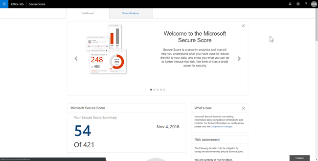
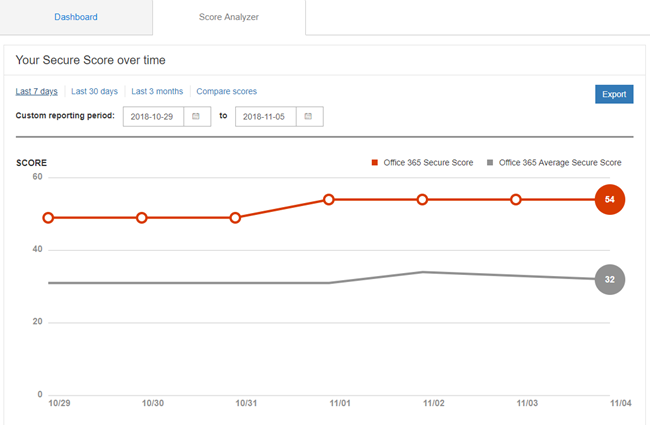

# Puntuación segura de Office 365

**Resumen** ¿Se ha preguntado cómo proteger su organización es realmente en Office 365? Puntuación seguro está aquí para ayudar a. Puntuación seguro analiza la seguridad de su organización en función de sus actividades normales y la configuración de seguridad en Office 365 y asigna una puntuación. Lea este artículo para obtener una visión general de puntuación de seguro y cómo puede usarlo.
  
## Cómo llegar a la puntuación de seguro

Si su organización tiene una suscripción que incluye [Office 365 Enterprise](https://docs.microsoft.com/office365/enterprise/), [Microsoft 365 Business](https://docs.microsoft.com/microsoft-365/business/)o Premium de negocio de Office 365, y tiene los permisos necesarios, puede ver puntuación seguro de la organización, visite [https://securescore.office.com](https://securescore.office.com). 

Como alternativa, puede visitar el centro de cumplimiento y seguridad ([https://protection.office.com](https://protection.office.com)), donde encontrará un widget de puntuación seguro que se proporciona con su calificación actual.

El widget incluye un vínculo a la puntuación seguro de Microsoft, que le llevará a su panel puntuación seguro para Office 365.

> [!NOTE]
> Debe ser un administrador de Office 365, como un administrador global o administrador de seguridad, para tener acceso a la puntuación de seguro.
  
## Cómo funciona

Proteja las cifras de puntuación fuera de qué servicios de Office 365 está usando (por ejemplo, OneDrive, SharePoint y Exchange), a continuación, se busca en la configuración y las actividades y los compara con una línea de base establecida por Microsoft. Obtendrá una puntuación de cómo alineadas que se basan en con procedimientos recomendados de seguridad.
  
También obtendrá recomendaciones en los pasos que puede realizar para mejorar la puntuación de su organización. 
  

  
Expanda una acción para obtener información sobre qué pasos que deben seguirse, protegen las amenazas que le ayudará desde y el número de puntos que aumentará su puntuación una vez seguir la recomendación.
  

  
Para ver el impacto de sus acciones en la seguridad de su organización, seleccione la ficha **Del analizador de puntuación** y revisar el historial. 
  

  
Debajo del gráfico, verá una lsit de las puntuaciones y acciones por categoría.
  

  
## Cómo ayuda proteger puntuación

Uso de puntuación seguro ayuda a aumentar la seguridad de su organización fomentando que puede utilizar las características de seguridad integradas en Office 365 (muchas de las cuales ya adquirido pero es posible que no tenga). Obtener más información acerca de estas características, tal como se utiliza la herramienta se le ayudarán a parte de la cuenta que va a llevar los pasos adecuados para proteger su organización frente a las amenazas.
  
Pero no sólo nuestra palabra de él. Los clientes que usen puntuación seguro han visto sus puntuación aumentar cinco veces mayor que los clientes que no son lo utilizan. (El aumento en su puntuación se corresponde con las características de seguridad que se usan en las organizaciones).
  
Desproteger nuestra [entrada de blog](https://go.microsoft.com/fwlink/?linkid=836898) para obtener más información. 
  
> [!NOTE]
> Puntuación seguro no express una medida absoluta de cómo es probable que van a obtener tipo de brecha. Expresa la medida a la que han adoptado los controles que pueden desplazar el riesgo de que se pueda infringir. Ningún servicio puede garantizar que no se pueda infringir y puntuación seguro no se debe interpretar como una garantía de ninguna forma. 
  
## Preguntas más frecuentes

### ¿Quién puede usar puntuación seguro?

Cualquier persona que tenga permisos de administrador (administrador global o una función de administración personalizado) para una suscripción a Office 365 Enterprise, Microsoft 365 Business o Premium de negocio de Office 365 puede tener acceso a la puntuación de seguro en [https://securescore.office.com](https://securescore.office.com). Los usuarios que no están asignados a un rol de administrador no podrán tener acceso a la puntuación de seguro. Sin embargo, los administradores pueden utilizar la herramienta para compartir sus resultados con otras personas de su organización. Analizaremos incluidos otros, roles sin permisos de administrador en la lista de permisos en el futuro. Si no hay roles específicos que le gustaría que nos a tener en cuenta, háganoslo saber por registro en el [Office seguridad, privacidad &amp; la Comunidad de cumplimiento de normas](https://go.microsoft.com/fwlink/?linkid=836898).
  
### ¿Qué le [no una puntuación] quiso decir?

Acciones que se etiquetan como **[No una puntuación]** son los que puede realizar en la organización pero no examinados debido a que no están conectados en la herramienta (todavía). Por lo tanto, aún puede mejorar la seguridad, pero no recibirá crédito para esas acciones ahora mismo. 
  
### ¿Con qué frecuencia es mi puntuación actualizado?

La puntuación se calcula una vez al día (aproximadamente 1:00 AM PST). Si realiza un cambio en una acción medida, la puntuación actualizará automáticamente el día siguiente. Se tardan hasta 48 horas para que un cambio se refleja en su puntuación.
  
### ¿Quién puede ver los resultados de Mis?

Los resultados se filtran para mostrar los resultados parciales sólo a las personas de su organización que tengan asignado un rol de administrador (administrador global o una función de administración personalizado).
  
### Mi puntuación cambiado. ¿Cómo averiguar por qué?

En la página **Analizador de puntuación** , haga clic en un punto de datos para un día específico, a continuación, desplácese hacia abajo para ver las acciones completadas e incompletas para ese día para averiguar qué ha cambiado. 
  
### ¿La puntuación seguro medir mi riesgo de tipo de brecha Introducción?

En breve, no. Puntuación seguro no express una medida absoluta de cómo es probable que van a obtener tipo de brecha. Expresa la medida a la que han adoptado las características que pueden desplazar el riesgo de que se pueda infringir. No hay ningún servicio puede garantizar que va a no ser tipo de brecha y la puntuación de seguro no se debe interpretar como una garantía de ninguna forma.
  
### ¿Cómo debo interpretar mi puntuación?

Se le dará puntos para configurar las características de seguridad recomendadas o llevar a cabo tareas relacionadas con la seguridad (por ejemplo, la visualización de informes). Algunas acciones se cuentan para la finalización parcial, al igual que la habilitación de la autenticación multifactor (MFA) para los usuarios. La puntuación de seguro directamente es representante de los servicios de seguridad de Microsoft que use. Recuerde que la seguridad siempre debe estar equilibrada, con facilidad de uso. Todos los controles de seguridad tienen un componente de impacto del usuario. Los controles con un impacto bajo usuario no deben tener poca o ninguna influencia en las operaciones diarias de los usuarios.
  
Para ver el historial de puntuación, vaya a la página **Del analizador de puntuación** . Elija una fecha específica para ver los controles que se han habilitado para que día y qué se remite el acumulado para cada uno de ellos. 
  
### Tengo una idea de otro control. ¿Cómo puedo permitir sabe lo que es?

Nos gustaría conocer su opinión. Envíe sus ideas en el [Office seguridad, privacidad &amp; la Comunidad de cumplimiento de normas](https://go.microsoft.com/fwlink/?linkid=836898). Se está escuchando y desea que la puntuación de seguro para incluir todas las opciones que son importantes para usted.
  
### Algo que no funcione a la derecha. ¿Quién debo contactos?

Si tiene algún problema, háganoslo saber por registro en el [Office seguridad, privacidad &amp; la Comunidad de cumplimiento de normas](https://go.microsoft.com/fwlink/?linkid=836898). Se está supervisando la Comunidad y proporcionará ayuda.
  
### Mi organización tiene sólo determinadas características de seguridad. ¿Esto afecta mi puntuación?

Puntuación de seguro calcula la puntuación basada en los servicios que ha comprado. Por ejemplo, si ha comprado solo un plan de Exchange Online, no se tuvo para características de seguridad de SharePoint Online. El denominador de la puntuación es la suma de todas las líneas de base para los controles que se aplican a los productos que ha comprado. El numerador es la suma de todos los controles para los que completado o parcialmente completado, las acciones para cumplir con ese control.

## Temas relacionados

[Información general del panel de seguridad](security-dashboard.md)

[¿Qué suscripción tengo?](https://docs.microsoft.com/office365/admin/admin-overview/what-subscription-do-i-have?view=o365-worldwide)
  

