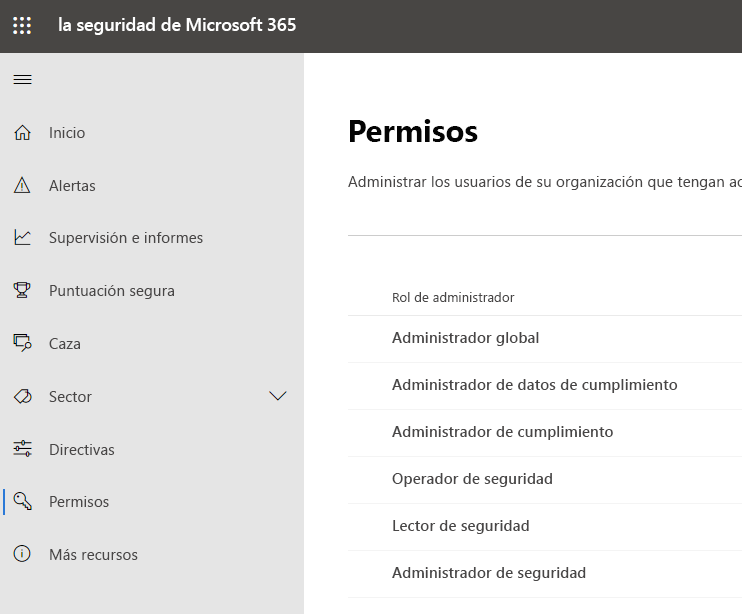
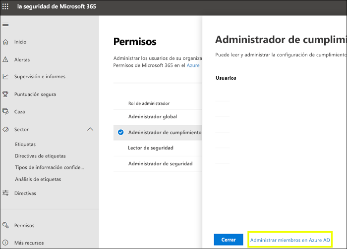
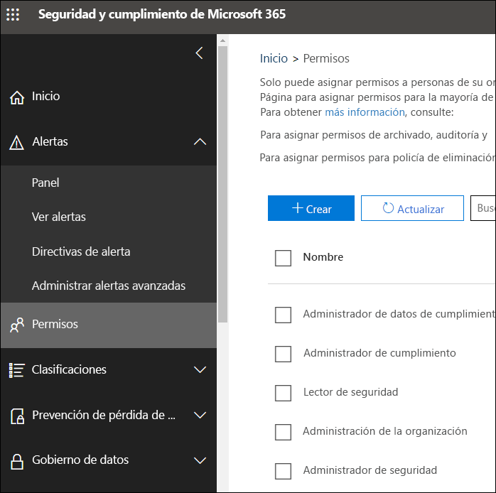

# Permisos en el Centro de cumplimiento de Microsoft 365 y el Centro de seguridad de Microsoft 365

Su organización necesita administrar los escenarios de seguridad y cumplimiento que se extienden a todos los servicios de Microsoft 365. Por lo que necesita la flexibilidad para dar los permisos de administrador adecuados a las personas adecuadas en el grupo de TI de su organización. Usando el Centro de cumplimiento de Microsoft 365 o el Centro de seguridad de Microsoft 365, puede administrar los permisos de forma centralizada para todas las tareas relacionadas con la seguridad y el cumplimiento.

Después de que el administrador global asigna los roles de administrador, los administradores tienen acceso a características y datos que abarcan todos los servicios de Microsoft 365, como el Centro de seguridad de Microsoft 365, el Centro de cumplimiento de Microsoft 365, Azure, Office 365 y Enterprise Mobility + Security.

## Lo que son los roles de Microsoft 365

Los roles que aparecen en el Centro de cumplimiento de Microsoft 365 y en el Centro de seguridad de Microsoft 365 son roles de Azure Active Directory. Estos roles están diseñados para alinearse con las funciones de trabajo en el grupo de TI de su organización, lo que facilita otorgar a una persona todos los permisos necesarios para realizar su trabajo.

|**Rol**|**Descripción**|
|:-----|:-----|
|**Administrador global**|Los usuarios con este rol tienen acceso a todas las características administrativas en todos los servicios de Microsoft 365. Los administradores globales son los únicos que pueden asignar otros roles de administrador.|
|**Administrador de datos de cumplimiento**|Los usuarios con este rol pueden realizar un seguimiento de los datos de su organización a través de Microsoft 365, asegurarse de que están protegidos y obtener información sobre los problemas para ayudar a reducir los riesgos.|
|**Administrador de cumplimiento**|Los usuarios con este rol pueden ayudar a que su organización cumpla con los requisitos normativos, administrar casos de exhibición de documentos electrónicos y mantener directivas de gobierno de datos en todas las ubicaciones, identidades y aplicaciones de Microsoft 365.|
|**Operador de seguridad**|Los usuarios con este rol pueden ver, investigar y responder a las amenazas activas a los usuarios, los dispositivos y el contenido de Microsoft 365.|
|**Lector de seguridad**|Los usuarios con este rol pueden ver e investigar amenazas activas a los usuarios, los dispositivos y el contenido de Microsoft 365, pero, a diferencia del operador de seguridad, no tienen permisos para responder realizando una acción.|
|**Administrador de seguridad**|Los usuarios con este rol pueden controlar la seguridad global de la organización mediante la administración de directivas de seguridad, la revisión de análisis de seguridad y los informes de los productos de Microsoft 365, así como mantenerse al día en el panorama de amenazas.|

## A qué tienen acceso los roles de Microsoft 365

Estos son los roles disponibles y las acciones que pueden realizar los usuarios que los tienen asignados.

### Administrador global

Los usuarios con este rol tienen acceso a todas las características administrativas en Azure Active Directory, así como también a los servicios que usan las identidades de Azure Active Directory, como el Centro de seguridad de Microsoft 365, el Centro de cumplimiento de Microsoft 365, Exchange Online, SharePoint Online y Skype Empresarial Online. La persona que se suscribe al inquilino de Azure Active Directory se convierte en un administrador global. Los administradores globales son los únicos que pueden asignar otros roles de administrador. Puede haber más de un administrador global en su empresa. Los administradores globales pueden restablecer la contraseña de todos los usuarios y del resto de los administradores.

### Administrador de cumplimiento

Los usuarios con este rol tienen permisos para administrar las características relacionadas con el cumplimiento en el Centro de cumplimiento de Microsoft 365, el Centro de administración de Microsoft 365, Azure y el Centro de seguridad y cumplimiento de Office 365. Los usuarios también pueden administrar todas las características dentro del Centro de administración de Exchange y del Centro de administración de Teams y Skype Empresarial, así como crear incidencias de soporte técnico para Azure y Microsoft 365.

|**En este servicio...**|**El administrador de cumplimiento puede...**|
|:-----|:-----|
|[**Centro de cumplimiento de Microsoft 365**](https://compliance.microsoft.com/)|Proteger y administrar los datos de su organización en los servicios de Microsoft 365    Administrar alertas de cumplimiento.|
|[**Administrador de cumplimiento**](https://docs.microsoft.com/office365/securitycompliance/meet-data-protection-and-regulatory-reqs-using-microsoft-cloud)|Controlar, asignar y comprobar las actividades de cumplimiento normativo de su organización.|
|[**Centro de seguridad y cumplimiento de Office 365**](https://support.office.com/article/About-Office-365-admin-roles-da585eea-f576-4f55-a1e0-87090b6aaa9d)|Administrar el gobierno de datos.    Realizar investigaciones de datos y legales.    Administrar solicitudes de interesados.|
|[**Intune**](https://docs.microsoft.com/intune/role-based-access-control)|Ver todos los datos de auditoría de Intune.|
|[**Cloud App Security**](https://docs.microsoft.com/cloud-app-security/manage-admins)|Cuenta con permisos de solo lectura y puede administrar alertas.    Puede crear y modificar directivas de archivo y permitir acciones de gobierno de archivo.    Puede ver todos los informes integrados en Administración de datos.|

### Administrador de datos de cumplimiento

Los usuarios con este rol tienen permisos para proteger y realizar un seguimiento de los datos en el Centro de cumplimiento de Microsoft 365, en el Centro de administración de Microsoft 365 y en Azure. Los usuarios también pueden administrar todas las características dentro del Centro de administración de Exchange, el Administrador de cumplimiento y el Centro de administración de Teams y Skype Empresarial, así como crear incidencias de soporte técnico para Azure y Microsoft 365.

|**En este servicio...**|**El administrador de cumplimiento puede...**|
|:-----|:-----|
|[**Centro de cumplimiento de Microsoft 365**](https://compliance.microsoft.com/)|Proteger y administrar los datos de su organización en los servicios de Microsoft 365    Administrar alertas de cumplimiento.    Administrar etiquetas de sensibilidad|
|[**Administrador de cumplimiento**](https://docs.microsoft.com/office365/securitycompliance/meet-data-protection-and-regulatory-reqs-using-microsoft-cloud)|Controlar, asignar y comprobar las actividades de cumplimiento normativo de su organización.|
|[**Centro de seguridad y cumplimiento de Office 365**](https://support.office.com/article/About-Office-365-admin-roles-da585eea-f576-4f55-a1e0-87090b6aaa9d)|Administrar el gobierno de datos.    Realizar investigaciones de datos y legales.    Administrar solicitudes de interesados.    Administrar etiquetas de sensibilidad|
|[**Intune**](https://docs.microsoft.com/intune/role-based-access-control) (próximamente)|Ver todos los datos de auditoría de Intune.|
|[**Cloud App Security**](https://docs.microsoft.com/cloud-app-security/manage-admins)|Usa permisos de solo lectura para ver la información.  Administrar alertas.    Crear y modificar directivas de archivo y permitir acciones de gobierno de archivo.    Ver todos los informes integrados en Administración de datos.|

### Administrador de seguridad

Los usuarios con este rol tienen permisos para administrar las características relacionadas con la seguridad en el Centro de seguridad de Microsoft 365, Azure Active Directory Identity Protection, Azure Information Protection y el Centro de seguridad y cumplimiento de Office 365.

|**En este servicio...**|**El administrador de cumplimiento puede...**|
|:-----|:-----|
|[**Centro de seguridad de Microsoft 365**](https://security.microsoft.com/)|Supervisar las directivas relacionadas con la seguridad en servicios de Microsoft 365.     Administrar alertas y amenazas de seguridad.    Ver informes.    Administrar etiquetas de confidencialidad.|
|**Identity Protection Center**|Hace todo lo que el rol lector de seguridad puede hacer, y realiza todas las operaciones del Identity Protection Center, excepto restablecer contraseñas.|
|[**Privileged Identity Management**](https://docs.microsoft.com/azure/active-directory/privileged-identity-management/pim-configure)|Hace todo lo que el rol de lector de seguridad puede hacer.    **No puede** administrar la configuración y la asignación de roles de Azure AD.|
|[**Centro de seguridad y cumplimiento de Office 365**](https://support.office.com/article/About-Office-365-admin-roles-da585eea-f576-4f55-a1e0-87090b6aaa9d)|Administrar directivas de seguridad.    Ver, investigar y responder a las amenazas de seguridad.    Ver informes.    Administrar etiquetas de confidencialidad.|
|**Azure Advanced Threat Protection**|Supervisa la actividad de seguridad que sea sospechosa y responde a ella.|
|**ATP de Windows Defender y EDR**|Asignar roles.    Administrar grupos de máquinas.    Configurar la detección de amenazas de punto de conexión y la corrección automatizada.    Ver, investigar y responder alertas.|
|[**Intune**](https://docs.microsoft.com/intune/role-based-access-control)|Ver información sobre usuarios, dispositivos, inscripciones, configuración y aplicaciones.    **No puede** realizar cambios en Intune.|
|[**Cloud App Security**](https://docs.microsoft.com/cloud-app-security/manage-admins)|Agregar administradores, agregar directivas y configuraciones, cargar registros y realizar acciones de gobierno.|
|[**Azure Security Center**](https://docs.microsoft.com/azure/role-based-access-control/built-in-roles) (próximamente)|Ver directivas de seguridad, estados de seguridad, alertas y recomendaciones, editar directivas de seguridad, descartar alertas y recomendaciones.|
|[**Estado del servicio de Office 365**](https://docs.microsoft.com/office365/enterprise/view-service-health)|Ver el estado de los servicios de Office 365.|

### Operador de seguridad

Los usuarios con este rol pueden administrar alertas y tener acceso global de solo lectura en características relacionadas con la seguridad, incluida toda la información en el Centro de seguridad de Microsoft 365, Azure Active Directory, Identity Protection, Privileged Identity Management, así como la capacidad para leer informes de inicio de sesión de Azure Active Directory y registros de auditoría, y en el Centro de seguridad y cumplimiento de Office 365.

|**En este servicio...**|**El administrador de cumplimiento puede...**|
|:-----|:-----|
|[**Centro de seguridad de Microsoft 365**](https://security.microsoft.com/)|Hace todo lo que el rol de lector de seguridad puede hacer.    Ver, investigar y responder a las alertas de seguridad.|
|**Identity Protection Center** (próximamente)|Hace todo lo que el rol de lector de seguridad puede hacer.|
|[**Privileged Identity Management**](https://docs.microsoft.com/azure/active-directory/privileged-identity-management/pim-configure)|Hace todo lo que el rol de lector de seguridad puede hacer.|
|[**Centro de seguridad y cumplimiento de Office 365**](https://support.office.com/article/About-Office-365-admin-roles-da585eea-f576-4f55-a1e0-87090b6aaa9d)|Hace todo lo que el rol de lector de seguridad puede hacer.    Ver, investigar y responder a las amenazas de seguridad.|
|**ATP de Windows Defender y EDR**|Hace todo lo que el rol de lector de seguridad puede hacer.    Ver, investigar y responder alertas.|
|[**Intune**](https://docs.microsoft.com/intune/role-based-access-control)|Ver información sobre usuarios, dispositivos, inscripciones, configuración y aplicaciones.    **No puede** realizar cambios en Intune.|
|[**Cloud App Security**](https://docs.microsoft.com/cloud-app-security/manage-admins)|Hace todo lo que el rol de lector de seguridad puede hacer, además puede ver y descartar alertas.|
|[**Estado del servicio de Office 365**](https://docs.microsoft.com/office365/enterprise/view-service-health)|Ver el estado de los servicios de Office 365.|

### Lector de seguridad

Los usuarios con este rol tienen acceso global de solo lectura en la característica relacionada con la seguridad, incluida toda la información del Centro de seguridad de Microsoft 365, Azure Active Directory, Identity Protection, Privileged Identity Management, así como también la capacidad de leer registros de auditoría e informes de inicio de sesión de Azure Active Directory, y del Centro de seguridad y cumplimiento de Office 365.

|**En este servicio...**|**El administrador de cumplimiento puede...**|
|:-----|:-----|
|[**Centro de seguridad de Microsoft 365**](https://security.microsoft.com/)|Ver directivas relacionadas con la seguridad en los servicios de Microsoft 365.    Ver alertas y amenazas de seguridad.    Ver informes.|
|**Identity Protection Center**|Lea toda la información de los informes de seguridad y la configuración de las características de seguridad: antispam, cifrado, prevención de pérdida de datos (DLP), antimalware, protección contra amenazas avanzada (ATP), filtro antiphishing y reglas de flujo de correo (también conocidas como reglas de transporte).|
|[**Privileged Identity Management**](https://docs.microsoft.com/azure/active-directory/privileged-identity-management/pim-configure)|Usa el acceso de solo lectura para ver toda la información que se muestra en Azure AD PIM: directivas e informes para las asignaciones de roles de Azure AD, revisiones de seguridad y (próximamente) datos e informes de escenarios que no sean asignación de roles de Azure AD.    **No puede** registrarse para PIM de Azure AD ni realizar ningún cambio en esta característica. En el portal de PIM o mediante PowerShell, alguien con este rol puede activar roles adicionales (por ejemplo, administrador global o administrador de rol con privilegios), si el usuario es apto para ellos.|
|[**Centro de seguridad y cumplimiento de Office 365**](https://support.office.com/article/About-Office-365-admin-roles-da585eea-f576-4f55-a1e0-87090b6aaa9d)|Ver directivas de seguridad.    Ver e investigar las amenazas de seguridad.    Ver informes.|
|**ATP de Windows Defender y EDR**|Ver e investigar alertas.|
|[**Intune**](https://docs.microsoft.com/intune/role-based-access-control)|Ver información sobre usuarios, dispositivos, inscripciones, configuración y aplicaciones.    **No puede** realizar cambios en Intune.|
|[**Cloud App Security**](https://docs.microsoft.com/cloud-app-security/manage-admins)|Usa permisos de solo lectura para ver la información.    Administrar alertas.|
|[**Azure Security Center**](https://docs.microsoft.com/azure/role-based-access-control/built-in-roles)|Ver recomendaciones y alertas.    Ver directivas de seguridad.    Ver estados de seguridad, sin embargo, no pueden realizarse cambios.|
|[**Estado del servicio de Office 365**](https://docs.microsoft.com/office365/enterprise/view-service-health)|Ver el estado de los servicios de Office 365.|

## Los administradores globales pueden administrar roles en Azure Active Directory

Cuando selecciona un rol en el Centro de cumplimiento de Microsoft 365 y en el Centro de seguridad de Microsoft 365, puede ver sus tareas. Pero para administrar esas tareas, tiene que ir a Azure Active Directory.

Para más información, consulte [Visualización y asignación de roles de administrador en Azure Active Directory](https://docs.microsoft.com/azure/active-directory/users-groups-roles/directory-manage-roles-portal).

## Administrar roles en un servicio en lugar de Azure Active Directory

Los roles que aparecen en el Centro de cumplimiento de Microsoft 365 y en el Centro de seguridad de Microsoft 365 también aparecen en los servicios en los que tienen permisos. Por ejemplo, puede ver estos roles en el Centro de seguridad y cumplimiento de Office 365.

### Interrumpir herencia

Es importante comprender que cuando administra estos roles en Azure Active Directory, lo hace de manera centralizada para **todos** los servicios de Microsoft 365. Sin embargo, cuando administra un rol en un servicio específico, como el Centro de seguridad y cumplimiento de Office 365, está administrando el rol **solo** para ese servicio específico. Las asignaciones y permisos para un rol en un servicio reemplazan los permisos concedidos al rol de Azure Active Directory.

Esto puede ser útil, por ejemplo, si se asigna a un usuario el rol de administrador de seguridad, no tienen permisos para administrar los incidentes. Sin embargo, puede usar los permisos de protección contra amenazas avanzada de Windows Defender para proporcionarles los permisos específicos para administrar el incidente en el servicio.

## Dónde encontrar información de roles para cada servicio de Microsoft 365

Al asignar un usuario a uno de los roles de administrador de seguridad y cumplimiento de Microsoft 365, adquiere permisos a un conjunto de servicios de Microsoft 365. Use los vínculos siguientes para obtener más información sobre los permisos específicos para un rol en cada servicio.

|**Servicio de Microsoft 365**|**Información del rol**|
|:-----|:-----|
|Roles de administrador de los planes de negocios de Office 365 y Microsoft 365|[Roles de administrador de Office 365](https://docs.microsoft.com/office365/admin/add-users/about-admin-roles?view=o365-worldwide)|
|Azure Active Directory (Azure AD) y Azure AD Identity Protection|[Roles de administrador de Azure AD](https://docs.microsoft.com/azure/active-directory/users-groups-roles/directory-assign-admin-roles)|
|Azure Advanced Threat Protection|[Grupos de roles de Azure ATP](https://docs.microsoft.com/azure-advanced-threat-protection/atp-role-groups)|
|Azure Information Protection|[Roles de administrador de Azure AD](https://docs.microsoft.com/azure/active-directory/users-groups-roles/directory-assign-admin-roles)|
|Administrador de cumplimiento|[Roles de administrador de cumplimiento](https://docs.microsoft.com/office365/securitycompliance/meet-data-protection-and-regulatory-reqs-using-microsoft-cloud#permissions-and-role-based-access-control)|
|Exchange Online|[Control de acceso basado en roles de Exchange](https://docs.microsoft.com/exchange/understanding-role-based-access-control-exchange-2013-help)|
|Intune|[Control de acceso basado en roles de Intune](https://docs.microsoft.com/intune/role-based-access-control)|
|Escritorio administrado|[Roles de administrador de Azure AD](https://docs.microsoft.com/azure/active-directory/users-groups-roles/directory-assign-admin-roles)|
|Microsoft Cloud App Security|[Control de acceso basado en roles](https://docs.microsoft.com/cloud-app-security/manage-admins)|
|Centro de seguridad y cumplimiento de Office 365|[Roles de administrador de Office 365](https://docs.microsoft.com/office365/SecurityCompliance/permissions-in-the-security-and-compliance-center)|
|Privileged Identity Management|[Roles de administrador de Azure AD](https://docs.microsoft.com/azure/active-directory/users-groups-roles/directory-assign-admin-roles)|
|Puntuación de seguridad|[Roles de administrador de Azure AD](https://docs.microsoft.com/azure/active-directory/users-groups-roles/directory-assign-admin-roles)|
|SharePoint Online|[Roles de administrador de Azure AD](https://docs.microsoft.com/azure/active-directory/users-groups-roles/directory-assign-admin-roles)    [Acerca del rol de administrador de SharePoint en Office 365](https://docs.microsoft.com/sharepoint/sharepoint-admin-role)|
|Teams/Skype Empresarial|[Roles de administrador de Azure AD](https://docs.microsoft.com/azure/active-directory/users-groups-roles/directory-assign-admin-roles)|
|Protección contra amenazas avanzada de Windows Defender|[Control de acceso basado en roles de ATP de Windows Defender](https://docs.microsoft.com/windows/security/threat-protection/windows-defender-atp/rbac-windows-defender-advanced-threat-protection)|

## Lo que estará disponible próximamente

Aún estamos trabajando en los permisos en el Centro de cumplimiento de Microsoft 365 y el Centro de seguridad de Microsoft 365 Por ejemplo, actualmente estamos trabajando en soporte técnico para:

- Los roles que aparecen en el Centro de cumplimiento de Microsoft 365 y en el Centro de seguridad de Microsoft 365, en lugar de ir Azure Active Directory.

- Personalizar roles agregando o quitando permisos específicos.

- Crear roles personalizados con los permisos que elija.
