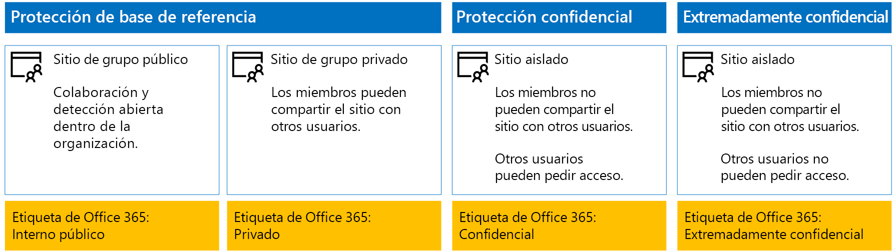
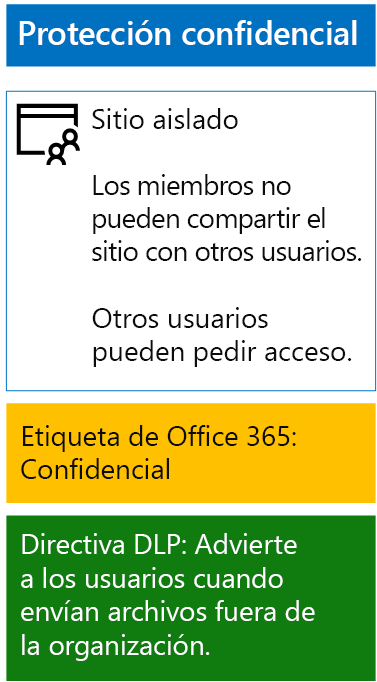
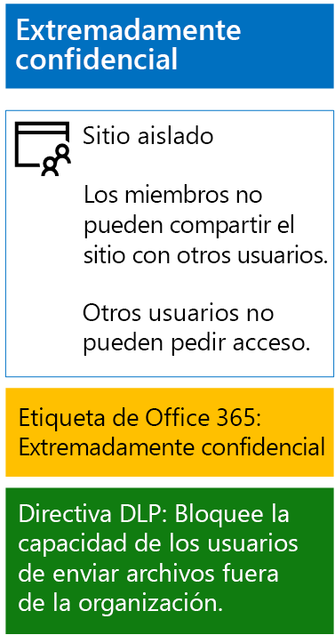

# <a name="protect-sharepoint-online-files-with-office-365-labels-and-dlp"></a>Proteger archivos de SharePoint Online con DLP y etiquetas de Office 365

 **Resumen:** Aplique directivas de etiquetas y de prevención de pérdida de datos (DLP) de Office 365 a sitios de grupo de SharePoint Online con distintos niveles de protección de la información.
  
Siga los pasos de este artículo para diseñar e implementar directivas de etiquetas y de prevención de pérdida de datos (DLP) de Office 365 para sitios de grupo de línea base, confidenciales y extremadamente confidenciales de SharePoint Online. Para más información sobre estos tres niveles de protección, vea [Proteger archivos y sitios de SharePoint Online](secure-sharepoint-online-sites-and-files.md).
  
## <a name="how-this-works"></a>Cómo funciona
1. Crear las etiquetas deseadas y publicarlas. Pueden tardar hasta 12 horas en publicarse.
2. Para los sitios de SharePoint deseados, edite la configuración de la biblioteca de documentos para aplicar una etiqueta a los elementos de la biblioteca.
3. Crear directivas DLP que actúen en función de las etiquetas.

Cuando los usuarios agregan un documento a la biblioteca, este recibirá la etiqueta asignada de forma predeterminada. Si es necesario, los usuarios pueden cambiar la etiqueta. Cuando un usuario comparte un documento fuera de la organización, DLP comprobará si tiene asignada una etiqueta y tomará medidas si una directiva DLP coincide con ella. DLP buscará otras coincidencias de directivas, como la protección de archivos con números de tarjeta de crédito si se configura este tipo de directiva. 

## <a name="office-365-labels-for-your-sharepoint-online-sites"></a>Etiquetas de Office 365 para los sitios de SharePoint Online

Hay tres fases para crear y luego asignar etiquetas de Office 365 a sitios de grupo de SharePoint Online.
  
### <a name="phase-1-determine-the-office-365-label-names"></a>Fase 1: Determinar los nombres de etiqueta de Office 365

En esta fase se determinan los nombres de las etiquetas de Office 365 para los cuatro niveles de protección de la información aplicados a los sitios de grupo de SharePoint Online. En la siguiente tabla se indican los nombres recomendados para cada nivel.
  
|**Nivel de protección de sitio de grupo de SharePoint Online**|**Nombre de etiqueta**|
|:-----|:-----|
|Base de referencia-Público  <br/> |Interno público  <br/> |
|Base de referencia-Privado  <br/> |Private  <br/> |
|Confidencial  <br/> |Confidencial  <br/> |
|Extremadamente confidencial  <br/> |Extremadamente confidencial  <br/> |
   
### <a name="phase-2-create-the-office-365-labels"></a>Fase 2: Crear las etiquetas de Office 365

En esta fase se crean y luego se publican las etiquetas determinadas para los diferentes niveles de protección de la información.
  
Para crear las etiquetas, puede usar el Centro de administración de Office 365 o Microsoft PowerShell.
  
### <a name="create-office-365-labels-with-the-office-365-admin-center"></a>Crear etiquetas de Office 365 con el Centro de administración de Office 365

1. Inicie sesión en el portal de Office 365 con una cuenta que tenga el rol Administrador de seguridad o Administrador de la compañía. Para obtener ayuda, vea [Where to sign in to Office 365](https://support.office.com/Article/Where-to-sign-in-to-Office-365-e9eb7d51-5430-4929-91ab-6157c5a050b4) (Dónde iniciar sesión en Office 365).
    
2. En la pestaña **Inicio de Microsoft Office**, haga clic en el icono **Administrador**.
    
3. En la nueva pestaña **Centro de administración de Office** del explorador, haga clic en **Centros de administración Seguridad &amp; Cumplimiento**.
    
4. En la nueva pestaña **Inicio - Seguridad y cumplimiento** del explorador, haga clic en **Clasificaciones > Etiquetas**.
    
5. En el panel **Inicio > Etiquetas**, haga clic en la pestaña **Retención** y, después, haga clic en **Publicar etiquetas**.
    
6. En el panel **Asignar un nombre a la etiqueta**, escriba el nombre de la etiqueta y una descripción para administradores y usuarios, después, haga clic en **Siguiente**.

7. En el panel **Configuración de etiquetas**, haga clic en **Siguiente**.
    
8. En el panel **Revise su configuración**, haga clic en **Crear** y luego en **Cerrar**.
    
9. Repita los pasos del 5 al 8 para las etiquetas adicionales.
    
### <a name="create-office-365-labels-with-powershell"></a>Crear etiquetas de Office 365 con PowerShell

1. Conéctese al [Centro de seguridad y cumplimiento de Office 365&amp; mediante PowerShell remoto](http://go.microsoft.com/fwlink/?LinkID=799771&amp;clcid=0x409) y especifique las credenciales de una cuenta que tenga el rol Administrador de seguridad o Administrador de la compañía.
    
2. Rellene la lista de nombres de etiqueta y luego ejecute estos comandos en el símbolo del sistema de PowerShell:
    
  ```
  $labelNames=@(<list of label names, each enclosed in quotes and separated by commas>)
ForEach ($element in $labelNames){ New-ComplianceTag -Name $element }
  ```

### <a name="publish-your-new-labels"></a>Publicar las nuevas etiquetas

Luego siga estos pasos para publicar las nuevas etiquetas de Office 365.
  
1. En el panel **Inicio > Etiquetas** del Centro de seguridad y cumplimiento, haga clic en la pestaña **Retención** y, después, haga clic en **Publicar etiquetas**.
    
2. En el panel **Elegir etiquetas para publicar**, haga clic en **Elegir etiquetas para publicar**.
    
3. En el panel de **elección de etiquetas**, haga clic en **Agregar** y seleccione las cuatro etiquetas.
    
4. Haga clic en **Listo**.
    
5. En el panel **Elegir etiquetas para publicar**, haga clic en **Siguiente**.
    
6. En el panel **Elegir ubicaciones**, haga clic en **Siguiente**.
    
7. En el panel **Escriba un nombre para la directiva**, escriba un nombre para el conjunto de etiquetas en **Nombre** y haga clic en **Siguiente**.
    
8. En el panel **Revise su configuración**, haga clic en **Publicar etiquetas** y luego en **Cerrar**.

    
### <a name="phase-3-apply-the-office-365-labels-to-your-sharepoint-online-sites"></a>Fase 3: Aplicar las etiquetas de Office 365 a los sitios de SharePoint Online

Siga estos pasos para aplicar las etiquetas de Office 365 a las carpetas de documentos de los sitios de grupo de SharePoint Online.
  
1. En la pestaña **Inicio de Microsoft Office** del explorador, haga clic en el icono **SharePoint**.
    
2. En la nueva pestaña **SharePoint** del explorador, haga clic en un sitio al que haya que asignarle una etiqueta de Office 365.
    
3. En la nueva pestaña del sitio de SharePoint del explorador, haga clic en **Documentos**.
    
4. Haga clic en el icono de configuración y luego en **Configuración de biblioteca**.
    
5. En **Permisos y administración**, haga clic en **Apply label to items in this library** (Aplicar la etiqueta a los elementos de esta biblioteca).
    
6. En **Configuración-Aplicar etiqueta**, seleccione la etiqueta adecuada y haga clic en **Guardar**.
    
7. Cierre la pestaña del sitio de SharePoint Online.
    
8. Repita los pasos del 3 al 8 para asignar etiquetas de Office 365 a otros sitios de SharePoint Online.
    
Esta es la configuración resultante.
  

  
## <a name="dlp-policies-for-your-sharepoint-online-sites"></a>Directivas de DLP para los sitios de SharePoint Online

Siga estos pasos para configurar una directiva de DLP que notifique a los usuarios cada vez que compartan un documento en un sitio de grupo confidencial de SharePoint Online de fuera de la organización.

1. En la pestaña **Inicio de Microsoft Office**, haga clic en el icono **Administrador**.
    
2. En la nueva pestaña **Centro de administración de Office** del explorador, haga clic en **Centros de administración > Seguridad &amp; Cumplimiento**.
    
3. En la nueva pestaña **Seguridad y cumplimiento** del explorador, haga clic en **Prevención de pérdida de datos > Directiva**.
    
4. En el panel **Prevención de pérdida de datos**, haga clic en **+ Crear una directiva**.
    
5. En el panel **Start with a template or create a custom policy** (Empezar con una plantilla o crear una directiva personalizada), haga clic en **Personalizada** y luego en **Siguiente**.
    
5. En el panel **Escriba un nombre para la directiva**, escriba el nombre de la directiva de DLP de nivel confidencial en **Nombre** y haga clic en **Siguiente**.
    
6. En el panel **Elegir ubicaciones**, haga clic en **Let me choose specific locations** (Permitir elegir ubicaciones concretas) y luego en **Siguiente**.
    
7. En la lista de ubicaciones, deshabilite las ubicaciones **Correo electrónico de Exchange** y **Cuentas de OneDrive** y haga clic en **Siguiente**.
    
8. En el panel **Personalizar los tipos de información confidencial que quiere proteger**, haga clic en **Editar**.
    
9. En el panel **Choose the types of content to protect** (Elegir los tipos de contenido que se va a proteger), haga clic en **Agregar** en el cuadro desplegable y luego en **Etiquetas**.
    
10. En el panel **Etiquetas**, haga clic en **+ Agregar**, seleccione la etiqueta **Confidencial**, haga clic en **Agregar** y luego en **Listo**.
    
11. En el panel **Choose the types of content to protect** (Elegir los tipos de contenido que se va a proteger), haga clic en **Guardar**.
    
12. En el panel **Personalizar los tipos de información confidencial que quiere proteger**, haga clic en **Siguiente**.

13. En el panel **What do you want to do if we detect sensitive info?** (¿Qué quiere hacer si se detecta información confidencial?), haga clic en **Customize the tip and email** (Personalizar la sugerencia y el correo electrónico).
    
14. En el panel **Personalizar sugerencias de directiva y notificaciones de correo electrónico**, haga clic en **Personalizar el texto de la sugerencia de directiva**.
    
15. En el cuadro de texto, escriba o pegue una de las siguientes sugerencias, dependiendo de si ha implementado Azure Information Protection para proteger los archivos más confidenciales:
    
  - Para compartir con un usuario de fuera de la organización, descargue el archivo y luego ábralo. Haga clic en Archivo, Proteger documento y Cifrar con contraseña y, luego, especifique una contraseña segura. Envíe la contraseña en un correo electrónico diferente u otro medio de comunicación.
  - Los archivos extremadamente confidenciales están protegidos con cifrado. Solo pueden leerlos aquellos usuarios externos a los que su departamento de TI les ha concedido permiso para acceder a los archivos.
    
    Otra opción es escribir o pegar una sugerencia de directiva propia que indique a los usuarios cómo compartir un archivo fuera de la organización.
    
16. Haga clic en **Aceptar**.
    
17. En el panel **¿Qué quiere hacer si se detecta información confidencial?**, haga clic en **Siguiente**.
    
18. En el panel **Do you want to turn on the policy or test things out first?** (¿Desea activar la directiva o probarla primero?), haga clic en **Yes, turn it on right away** (Sí, activarla inmediatamente) y luego en **Siguiente**.
    
19. En el panel **Revise su configuración**, haga clic en **Crear** y luego en **Cerrar**.
    
Esta es la configuración resultante para los sitios de grupo confidenciales de SharePoint Online.
  

  
Ahora siga estos pasos para configurar una directiva de DLP que impida a los usuarios compartir un documento en un sitio de grupo extremadamente confidencial de SharePoint Online de fuera de la organización.
  
1. En la pestaña **Inicio de Microsoft Office** del explorador, haga clic en el icono **Seguridad y cumplimiento**.
    
2. En la nueva pestaña **Seguridad y cumplimiento** del explorador, haga clic en **Prevención de pérdida de datos > Directiva**.
    
3. En el panel **Prevención de pérdida de datos**, haga clic en **+ Crear una directiva**.
    
4. En el panel **Start with a template or create a custom policy** (Empezar con una plantilla o crear una directiva personalizada), haga clic en **Personalizada** y luego en **Siguiente**.
    
5. En el panel **Escriba un nombre para la directiva**, escriba el nombre de la directiva de DLP de nivel extremadamente confidencial en **Nombre** y haga clic en **Siguiente**.
    
6. En el panel **Elegir ubicaciones**, haga clic en **Let me choose specific locations** (Permitir elegir ubicaciones concretas) y luego en **Siguiente**.
    
7. En la lista de ubicaciones, deshabilite las ubicaciones **Correo electrónico de Exchange** y **Cuentas de OneDrive** y haga clic en **Siguiente**.
    
8. En el panel **Customize the types of sensitive info you want to protect** (Personalizar los tipos de información confidencial que quiere proteger), haga clic en **Editar**.
    
9. En el panel **Choose the types of content to protect** (Elegir los tipos de contenido que se va a proteger), haga clic en **Agregar** en el cuadro desplegable y luego en **Etiquetas**.
    
10. En el panel **Etiquetas**, haga clic en **+ Agregar**, seleccione la etiqueta **Extremadamente confidencial**, haga clic en **Agregar** y luego en **Listo**.
    
11. En el panel **Choose the types of content to protect** (Elegir los tipos de contenido que se va a proteger), haga clic en **Guardar**.
    
12. En el panel **Customize the types of sensitive info you want to protect** (Personalizar los tipos de información confidencial que quiere proteger), haga clic en **Siguiente**.
    
13. En el panel **What do you want to do if we detect sensitive info?** (¿Qué quiere hacer si se detecta información confidencial?), haga clic en **Customize the tip and email** (Personalizar la sugerencia y el correo electrónico).
    
14. En el panel **Customize policy tips and email notifications** (Personalizar sugerencias de directiva y notificaciones de correo electrónico), haga clic en **Customize the policy tip text** (Personalizar el texto de la sugerencia de directiva).
    
15. En el cuadro de texto, escriba o pegue lo siguiente:
    
  - Para compartir con un usuario de fuera de la organización, descargue el archivo y luego ábralo. Haga clic en Archivo, Proteger documento y Cifrar con contraseña y, luego, especifique una contraseña segura. Envíe la contraseña en un correo electrónico diferente u otro medio de comunicación.
    
    O bien escriba o pegue una sugerencia de directiva propia que indique a los usuarios cómo compartir un archivo fuera de la organización.
    
16. Haga clic en **Aceptar**.
    
17. En el panel **¿Qué quiere hacer si se detecta información confidencial?**, haga clic en **Siguiente**.
    
18. En el panel **Do you want to turn on the policy or test things out first?** (¿Desea activar la directiva o probarla primero?), haga clic en **Yes, turn it on right away** (Sí, activarla inmediatamente) y luego en **Siguiente**.
    
19. En el panel **Revise su configuración**, haga clic en **Crear** y luego en **Cerrar**.
    
Esta es la configuración resultante para los sitios de grupo extremadamente confidenciales de SharePoint Online.
  

  
## <a name="next-step"></a>Paso siguiente

[Proteger archivos de SharePoint Online con Azure Information Protection](protect-sharepoint-online-files-with-azure-information-protection.md)
    
## <a name="see-also"></a>Vea también

[Protección de archivos y sitios de SharePoint Online](secure-sharepoint-online-sites-and-files.md)
  
[Proteger sitios de SharePoint Online en un entorno de desarrollo y pruebas](secure-sharepoint-online-sites-in-a-dev-test-environment.md)
  
[Guía de seguridad de Microsoft para campañas políticas, ONG y otras organizaciones ágiles](microsoft-security-guidance-for-political-campaigns-nonprofits-and-other-agile-o.md)
  
[Adopción de la nube y soluciones híbridas](https://docs.microsoft.com/office365/enterprise/cloud-adoption-and-hybrid-solutions)


