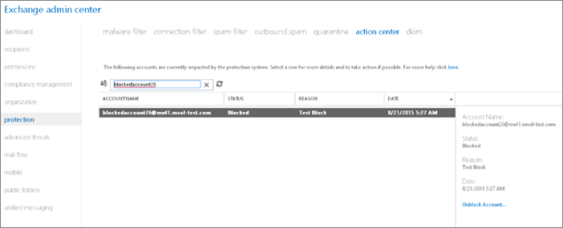

# Quitar un usuario, un dominio o una dirección IP de una lista de bloqueados después de enviar correo no deseadoRemoving a user, domain, or IP address from a block list after sending spam email

Si un usuario envía continuamente mensajes de correo electrónico de Office 365 que se clasifica como correo no deseado, se bloqueará de enviar más mensajes.If a user continuously sends email messages from Office 365 that is classified as spam, they will be blocked from sending any more messages. 
  
Cuando un remitente está bloqueado de envío de mensajes de correos electrónicos, reciben un informe de no entrega (NDR o no se pudo enviar el mensaje de correo electrónico) que proporciona información específica acerca de los pasos que se tienen que tomar para desbloquear a sí mismos.When a sender is blocked from sending emails messages, they receive a Non-Delivery Report (NDR or email failed to send message) that provides specific information about the steps that they have to take to unblock themselves.
  
No sólo a los usuarios individuales se pueden bloquear por los dominios de servicio, pero determinados sitios Web, y también se pueden bloquear las direcciones IP. En algunos casos, dominios o sitios Web pueden agregarse a una lista de bloqueados sólo porque aparecen en un mensaje de spam. Como la administración de Office 365, puede intentar obtener los usuarios, sitios, dominios y direcciones IP quitadas de listas de bloqueo de otro fabricante. Use los vínculos en la tabla en la parte inferior de este tema para ponerse en contacto con cada tercero y, a continuación, siga las instrucciones. Si alguien de fuera de Office 365 no puede enviar mensajes a su cuenta de Office 365, su cuenta puede haya terminado en la lista de remitentes bloqueados externo. Los usuarios externos a Office 365 pueden intentar se quiten de la lista de remitentes bloqueados a través del [portal de autoservicio de eliminación de la lista](https://technet.microsoft.com/library/mt661881%28v=exchg.150%29.aspx).Not only can individual users be blocked by the service, but specific websites, domains, and IP addresses can also be blocked. In some cases, domains or websites can be added to a block list just because they appear in a spam message. As the Office 365 admin, you can try to get users, websites, domains, and IP addresses removed from third-party block lists. Use the links in the table at the bottom of this topic to contact each third party, and then follow the instructions. If someone outside Office 365 cannot send messages to your Office 365 account, their account may have ended up on the external blocked senders list. Users outside Office 365 can try to remove themselves from the blocked senders list by using the [self-service delisting portal](https://technet.microsoft.com/library/mt661881%28v=exchg.150%29.aspx).
  
Configuración de correo no deseado saliente puede configurar para que obtener anotification cuando un usuario de Office 365 está bloqueado de envío de correo electrónico que se clasifica como correo no deseado. Una vez resuelto el problema con el buzón del usuario, puede quitar el bloque de ese remitente.You can configure outbound spam settings so that you get anotification when an Office 365 user is blocked from sending email that's classified as spam. After the problem with the user's mailbox is resolved, you can remove the block on that sender.
  
## Desbloquear una cuenta de correo electrónico de Office 365Unblock a blocked Office 365 email account

Complete esta tarea en el centro de administración de Exchange (EAC). Desproteger [Exchange centro de administración en Exchange Online Protection](exchange-admin-center-in-exchange-online-protection-eop.md) para obtener información detallada sobre el CEF.You complete this task in the Exchange admin center (EAC). Check out [Exchange admin center in Exchange Online Protection](exchange-admin-center-in-exchange-online-protection-eop.md) for details about the EAC. 
  
> [!NOTE]
> No verá el centro de actividades a no ser que se encuentre en el EAC de Exchange Online.You won't see the action center unless you're in the EAC for Exchange Online. 
  
1. En el EAC, vaya a **protección** \> **Centro de acción**.In the EAC, navigate to **protection** \> **action center**.
    
    
  
2. Seleccione el icono de **búsqueda** y, a continuación, escriba la dirección SMTP del usuario bloqueado.Select the **Search** icon, and then enter the SMTP address of the blocked user. 
    
    
  
3. Haga clic en **Desbloquear la cuenta** en el panel Descripción.Click **Unblock Account** in the description pane. 
    
    
  
4. Haga clic en **Sí** para confirmar el cambio.Click **Yes** to confirm the change. 
    
> [!NOTE]
> Hay un límite para el número de veces que una cuenta puede ser desbloqueada por el Administrador de inquilinos. Si se ha superado el límite de un usuario, aparece un mensaje de error. Póngase en contacto con soporte técnico para desbloquear el usuario.There's a limit to the number of times that an account can be unblocked by the tenant admin. If the limit for a user has been exceeded, an error message appears. Contact Support to unblock the user. 
  
## Listas de bloqueados de tercerosThird-party block lists

|**Nombre de la lista****List Name**|**Portal de eliminación de la lista****Delisting Portal**|**Más información****For more information**|
|:-----|:-----|:-----|
|URIBLURIBL    |[https://admin.uribl.com/?section=lookup](https://admin.uribl.com/?section=lookup)   |[Sitio Web URIBLURIBL website ](https://uribl.com/)   |
|SURBLSURBL    |[http://www.surbl.org/surbl-analysis](http://www.surbl.org/surbl-analysis)   |[Presentación de datos de reputación de URI SURBLIntroducing SURBL URI reputation data](http://www.surbl.org/)   |
|Spamhaus Spamhaus    |[https://www.spamhaus.org/lookup/](https://www.spamhaus.org/lookup/)   |[Descripción de filtrado de DNSBLUnderstanding DNSBL Filtering](https://www.spamhaus.org/whitepapers/dnsbl_function/)   |
|invaluementinvaluement    |[http://dnsbl.invaluement.com/lookup/](http://dnsbl.invaluement.com/lookup/)   |[lista de lista contra correo no deseadoinvaluement anti-spam list](http://dnsbl.invaluement.com/)   |
|PhishtankPhishtank    |[https://www.phishtank.com/](https://www.phishtank.com/)   |[PhishTank preguntas más frecuentesPhishTank FAQ](https://www.phishtank.com/faq.php)   |
   
> [!NOTE]
> Exchange Online Protection también utiliza las listas de bloqueados de terceros para el filtrado de spam.Exchange Online Protection also uses third-party block lists for spam filtering. 
   
## Más informaciónFor more information

[Configurar la directiva de correo no deseado salienteConfigure the outbound spam policy](configure-the-outbound-spam-policy.md)
  
[Grupo de entrega de alto riesgo para mensajes salientesHigh-risk delivery pool for outbound messages](high-risk-delivery-pool-for-outbound-messages.md)

[Usar el portal de eliminación de la lista para quitarse de la lista de remitentes bloqueados de Office 365Use the delist portal to remove yourself from the Office 365 blocked senders list](use-the-delist-portal-to-remove-yourself-from-the-office-365-blocked-senders-lis.md)
  

  

