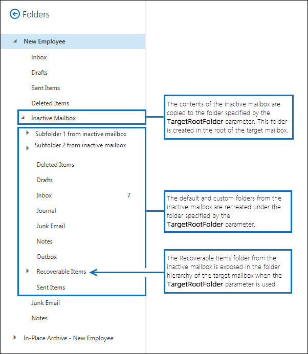

# <a name="restore-an-inactive-mailbox-in-office-365"></a><span data-ttu-id="0889f-103">Restaurar un buzón inactivo en Office 365</span><span class="sxs-lookup"><span data-stu-id="0889f-103">Restore an inactive mailbox in Office 365</span></span>

<span data-ttu-id="0889f-p101">Un buzón inactivo (que es un tipo de buzón eliminado temporalmente) se utiliza para retener el correo electrónico de un empleado anterior después de que abandona la organización. Si lleva a otro empleado en las responsabilidades de cargo del empleado abandonada o si ese empleado devuelve a su organización, hay dos formas que puede realizar el contenido del buzón de correo inactivo disponibles para un usuario:</span><span class="sxs-lookup"><span data-stu-id="0889f-p101">An inactive mailbox (which is a type of soft-deleted mailbox) is used to retain a former employee's email after he or she leaves your organization. If another employee takes on the job responsibilities of the departed employee or if that employee returns to your organization, there are two ways that you can make the contents of the inactive mailbox available to a user:</span></span> 
  
- <span data-ttu-id="0889f-p102">**Restaurar un buzón inactivo** Si otro empleado asume las responsabilidades del empleado que se marchó o si otro usuario necesita acceso al contenido del buzón inactivo, puede restaurar (o combinar) el contenido del buzón inactivo en un buzón existente. También puede restaurar el archivo desde un buzón inactivo. Una vez restaurado, el buzón inactivo se conserva y se mantiene como un buzón inactivo. En este tema se describen los procedimientos para restaurar un buzón inactivo.</span><span class="sxs-lookup"><span data-stu-id="0889f-p102">**Restore an inactive mailbox** If another employee takes on the job responsibilities of the departed employee, or if another user needs access to the contents of the inactive mailbox, you can restore (or merge) the contents of the inactive mailbox to an existing mailbox. You can also restore the archive from an inactive mailbox. After it's restored, the inactive mailbox is preserved and is retained as an inactive mailbox. This topic describes the procedures for restoring an inactive mailbox.</span></span> 
    
- <span data-ttu-id="0889f-p103">**Recuperar un buzón inactivo** Si el empleado abandonado devuelve a su organización, o si se contrata a un nuevo empleado a cabo en las responsabilidades de cargo del empleado abandonada, puede recuperar el contenido del buzón de correo inactivo. Este método convierte el buzón de correo inactivo en un nuevo buzón de correo que contiene el contenido del buzón de correo inactivo. Una vez recuperado, ya no existe el buzón de correo inactivo. Para los procedimientos paso a paso, vea [recuperar un buzón inactivo en Office 365](recover-an-inactive-mailbox.md).</span><span class="sxs-lookup"><span data-stu-id="0889f-p103">**Recover an inactive mailbox** If the departed employee returns to your organization, or if a new employee is hired to take on the job responsibilities of the departed employee, you can recover the contents of the inactive mailbox. This method converts the inactive mailbox to a new mailbox that contains the contents of the inactive mailbox. After it's recovered, the inactive mailbox no longer exists. For the step-by-step procedures, see [Recover an inactive mailbox in Office 365](recover-an-inactive-mailbox.md).</span></span>
    
<span data-ttu-id="0889f-114">Vea la sección **obtener más información** en este artículo para obtener más información acerca de las diferencias entre la restauración y recuperación de un buzón de correo inactivo.</span><span class="sxs-lookup"><span data-stu-id="0889f-114">See the **More information** section in this article for more details about the differences between restoring and recovering an inactive mailbox.</span></span> 
  
## <a name="before-you-begin"></a><span data-ttu-id="0889f-115">Antes de empezar</span><span class="sxs-lookup"><span data-stu-id="0889f-115">Before you begin</span></span>

- <span data-ttu-id="0889f-p104">Se debe usar Exchange Online PowerShell para restaurar un buzón de correo inactivo. No puede usar el centro de administración de Exchange (EAC). Para obtener instrucciones detalladas, vea [Connect to Exchange Online PowerShell](https://go.microsoft.com/fwlink/?linkid=396554).</span><span class="sxs-lookup"><span data-stu-id="0889f-p104">You have to use Exchange Online PowerShell to restore an inactive mailbox. You can't use the Exchange admin center (EAC). For step-by-step instructions, see [Connect to Exchange Online PowerShell](https://go.microsoft.com/fwlink/?linkid=396554).</span></span>
    
- <span data-ttu-id="0889f-119">Ejecute el siguiente comando en Exchange Online PowerShell para obtener información de identidad para los buzones inactivos en su organización.</span><span class="sxs-lookup"><span data-stu-id="0889f-119">Run the following command in Exchange Online PowerShell to get identity information for the inactive mailboxes in your organization.</span></span> 
    
    ```
    Get-Mailbox -InactiveMailboxOnly | FL Name,DistinguishedName,ExchangeGuid,PrimarySmtpAddress
    ```

     <span data-ttu-id="0889f-120">Use la información devuelta por este comando para restaurar un buzón inactivo específico.</span><span class="sxs-lookup"><span data-stu-id="0889f-120">Use the information returned by this command to restore a specific inactive mailbox.</span></span>
    
- <span data-ttu-id="0889f-121">Para obtener más información acerca de los buzones de correo inactivos, vea [buzones inactivos en Office 365](inactive-mailboxes-in-office-365.md).</span><span class="sxs-lookup"><span data-stu-id="0889f-121">For more information about inactive mailboxes, see [Inactive mailboxes in Office 365](inactive-mailboxes-in-office-365.md).</span></span>
    
## <a name="restore-an-inactive-mailbox"></a><span data-ttu-id="0889f-122">Restaurar un buzón inactivo</span><span class="sxs-lookup"><span data-stu-id="0889f-122">Restore an inactive mailbox</span></span>

<span data-ttu-id="0889f-p105">Use el cmdlet **New-MailboxRestoreRequest** con los parámetros  _SourceMailbox_ y  _TargetMailbox_ para restaurar el contenido de un buzón inactivo en un buzón existente. Para obtener más información sobre el uso de este cmdlet, vea [New-MailboxRestoreRequest](https://go.microsoft.com/fwlink/?linkid=856298).</span><span class="sxs-lookup"><span data-stu-id="0889f-p105">Use the **New-MailboxRestoreRequest** cmdlet with the  _SourceMailbox_ and  _TargetMailbox_ parameters to restore the contents of an inactive mailbox to an existing mailbox. For more information about using this cmdlet, see [New-MailboxRestoreRequest](https://go.microsoft.com/fwlink/?linkid=856298).</span></span>
  
1. <span data-ttu-id="0889f-125">Cree una variable que contenga las propiedades del buzón inactivo.</span><span class="sxs-lookup"><span data-stu-id="0889f-125">Create a variable that contains the properties of the inactive mailbox.</span></span> 
    
    ```
    $InactiveMailbox = Get-Mailbox -InactiveMailboxOnly -Identity <identity of inactive mailbox>
    ```

    > [!IMPORTANT]
    > <span data-ttu-id="0889f-p106">En el comando anterior, use el valor de la propiedad **DistinguishedName** o **ExchangeGUID** para identificar el buzón inactivo. Estas propiedades son únicas para cada buzón en su organización, mientras que es posible que un buzón activo e inactivo puedan tener la misma dirección SMTP principal.</span><span class="sxs-lookup"><span data-stu-id="0889f-p106">In the previous command, use the value of the **DistinguishedName** or **ExchangeGUID** property to identify the inactive mailbox. These properties are unique for each mailbox in your organization, whereas it's possible that an active and an inactive mailbox might have the same primary SMTP address.</span></span> 
  
2. <span data-ttu-id="0889f-p107">Restaurar el contenido del buzón inactivo en un buzón existente. El contenido del buzón inactivo (buzón de origen) se combinará en las carpetas correspondientes en el buzón existente (buzón de destino).</span><span class="sxs-lookup"><span data-stu-id="0889f-p107">Restore the contents of the inactive mailbox to an existing mailbox. The contents of the inactive mailbox (source mailbox) will be merged into the corresponding folders in the existing mailbox (target mailbox).</span></span>
    
    ```
    New-MailboxRestoreRequest -SourceMailbox $InactiveMailbox.DistinguishedName -TargetMailbox newemployee@contoso.com -AllowLegacyDNMismatch
    ```
   
   <span data-ttu-id="0889f-p108">Como alternativa, puede especificar una carpeta de nivel superior en el buzón de destino en el que se va a restaurar el contenido del buzón inactivo. Si la carpeta de destino especificada o la estructura de carpetas de destino no existe en el buzón de destino, se crea durante el proceso de restauración.</span><span class="sxs-lookup"><span data-stu-id="0889f-p108">Alternatively, you can specify a top-level folder in the target mailbox in which to restore the contents from the inactive mailbox. If the specified target folder or target folder structure doesn't already exist in the target mailbox, it is created during the restore process.</span></span> 
    
    <span data-ttu-id="0889f-132">En este ejemplo se copian los elementos del buzón y las subcarpetas de un buzón inactivo a una carpeta denominada "Buzón inactivo" en la estructura de carpetas de nivel superior del buzón de destino.</span><span class="sxs-lookup"><span data-stu-id="0889f-132">This example copies mailbox items and subfolders from an inactive mailbox to a folder named "Inactive Mailbox" in the top-level folder structure of the target mailbox.</span></span>
    
   ```
   New-MailboxRestoreRequest -SourceMailbox $InactiveMailbox.DistinguishedName -TargetMailbox newemployee@contoso.com -TargetRootFolder "Inactive Mailbox" -AllowLegacyDNMismatch
   ```
  
## <a name="restore-the-archive-from-an-inactive-mailbox"></a><span data-ttu-id="0889f-133">Restaurar el archivo a partir de un buzón inactivo</span><span class="sxs-lookup"><span data-stu-id="0889f-133">Restore the archive from an inactive mailbox</span></span>

<span data-ttu-id="0889f-p109">Si un buzón inactivo tiene un buzón de archivo, también puede restaurarlo en el buzón de archivo de un buzón existente. Para restaurar el archivo desde un buzón inactivo, tiene que agregar los modificadores  _SourceIsArchive_ y  _TargetIsAchive_ al comando utilizado para restaurar un buzón inactivo.</span><span class="sxs-lookup"><span data-stu-id="0889f-p109">If an inactive mailbox has an archive mailbox, you can also restore it to the archive mailbox of an existing mailbox. To restore the archive from an inactive mailbox, you have to add the  _SourceIsArchive_ and  _TargetIsAchive_ switches to the command used to restore an inactive mailbox.</span></span> 
  
1. <span data-ttu-id="0889f-136">Cree una variable que contenga las propiedades del buzón inactivo.</span><span class="sxs-lookup"><span data-stu-id="0889f-136">Create a variable that contains the properties of the inactive mailbox.</span></span> 
    
    ```
    $InactiveMailbox = Get-Mailbox -InactiveMailboxOnly -Identity <identity of inactive mailbox>
    ```

    > [!IMPORTANT]
    > <span data-ttu-id="0889f-p110">En el comando anterior, use el valor de la propiedad **DistinguishedName** o **ExchangeGUID** para identificar el buzón inactivo. Estas propiedades son únicas para cada buzón en su organización, mientras que es posible que un buzón activo e inactivo puedan tener la misma dirección SMTP principal.</span><span class="sxs-lookup"><span data-stu-id="0889f-p110">In the previous command, use the value of the **DistinguishedName** or **ExchangeGUID** property to identify the inactive mailbox. These properties are unique for each mailbox in your organization, whereas it's possible that an active and an inactive mailbox might have the same primary SMTP address.</span></span> 
  
2. <span data-ttu-id="0889f-p111">Restaure el contenido del archivo a partir del buzón inactivo (archivo de origen) en el archivo de un buzón existente (archivo de destino). En este ejemplo, el contenido del archivo de origen se copia a una carpeta denominada "Archivo de buzón inactivo" en el archivo del buzón de destino.</span><span class="sxs-lookup"><span data-stu-id="0889f-p111">Restore the contents of the archive from the inactive mailbox (source archive) to the archive of an existing mailbox (target archive). In this example, the contents from the source archive are copied to a folder named "Inactive Mailbox Archive" in the archive of the target mailbox.</span></span>

    ```
    New-MailboxRestoreRequest -SourceMailbox $InactiveMailbox.DistinguishedName -SourceIsArchive -TargetMailbox newemployee@contoso.com -TargetIsArchive -TargetRootFolder "Inactive Mailbox Archive" -AllowLegacyDNMismatch
    ```

  
## <a name="more-information"></a><span data-ttu-id="0889f-141">Más información</span><span class="sxs-lookup"><span data-stu-id="0889f-141">More information</span></span>

- <span data-ttu-id="0889f-p112">**¿Qué es la diferencia principal entre la recuperación y restauración de un buzón inactivo?** Al recuperar un buzón inactivo, básicamente, se convierte el buzón de correo a un buzón nuevo, se conservan el contenido y la estructura de carpetas de buzón de correo inactivo y el buzón de correo está vinculada a una nueva cuenta de usuario. Una vez que se recupere, ya no existe el buzón de correo inactivo y los cambios realizados en el contenido en el nuevo buzón afectará el contenido que se encontraba originalmente en espera en el buzón de correo inactivo. Por el contrario, cuando se restaura un buzón inactivo, el contenido simplemente se copia en otro buzón. El buzón de correo inactivo se mantiene y sigue siendo un buzón de correo inactivo. Los cambios realizados en el contenido en el buzón de destino no afectará al contenido original se conserva en el buzón de correo inactivo. Aún se puede buscar en el buzón de correo inactivo mediante la [herramienta de búsqueda de contenido](run-a-content-search-in-the-security-and-compliance-center.md) en la seguridad de Office 365 &amp; centro de cumplimiento, su contenido se puede restaurar en otro buzón, o puede ser recuperado o eliminado en una fecha posterior.</span><span class="sxs-lookup"><span data-stu-id="0889f-p112">**What's the main difference between recovering and restoring an inactive mailbox?** When you recover an inactive mailbox, the mailbox is basically converted to a new mailbox, the contents and folder structure of the inactive mailbox are retained, and the mailbox is linked to a new user account. After it's recovered, the inactive mailbox no longer exists, and any changes made to the content in the new mailbox will affect the content that was originally on hold in the inactive mailbox. Conversely, when you restore an inactive mailbox, the contents are merely copied to another mailbox. The inactive mailbox is preserved and remains an inactive mailbox. Any changes made to the content in the target mailbox won't affect the original content held in the inactive mailbox. The inactive mailbox can still be searched by using the [Content Search tool](run-a-content-search-in-the-security-and-compliance-center.md) in the Office 365 Security &amp; Compliance Center, its contents can be restored to another mailbox, or it can be recovered or deleted at a later date.</span></span> 
    
- <span data-ttu-id="0889f-p113">**¿Cómo se encuentran los buzones inactivos?** Para obtener una lista de los buzones inactivos en la organización y mostrar información útil para restaurar un buzón inactivo, puede ejecutar este comando.</span><span class="sxs-lookup"><span data-stu-id="0889f-p113">**How do you find inactive mailboxes?** To get a list of the inactive mailboxes in your organization and display information that is useful for restoring an inactive mailbox, you can run this command.</span></span> 

  ```
  Get-Mailbox -InactiveMailboxOnly | FL Name,PrimarySMTPAddress,DistinguishedName,ExchangeGUID,LegacyExchangeDN,ArchiveStatus
  ```

- <span data-ttu-id="0889f-p114">**Utilizar una directiva de retención juicio u Office 365 para conservar el contenido del buzón de correo inactivo.** Si desea conservar el estado de un buzón inactivo tras la restauración, puede colocar el buzón de destino en [Juicio](https://go.microsoft.com/fwlink/?linkid=856286) o aplicar una [Directiva de retención de Office 365](retention-policies.md) antes de restaurar el buzón de correo inactivo. Esto evitará la eliminación permanente de todos los elementos desde el buzón de correo inactivo después de que se va a restaurar en el buzón de destino.</span><span class="sxs-lookup"><span data-stu-id="0889f-p114">**Use a Litigation Hold or Office 365 retention policy to retain inactive mailbox content.** If you want to retain the state of an inactive mailbox after it's restored, you can place the target mailbox on [Litigation Hold](https://go.microsoft.com/fwlink/?linkid=856286) or apply an [Office 365 retention policy](retention-policies.md) before you restore the inactive mailbox. This will prevent the permanent deletion of any items from the inactive mailbox after they're restored to the target mailbox.</span></span> 
    
- <span data-ttu-id="0889f-p115">**La suspensión de retención habilitar en el buzón de destino antes de restaurar un buzón de correo inactivo.** Debido a que los elementos del buzón de un buzón inactivo podrían ser anteriores, considere la posibilidad de habilitar la suspensión de retención en el buzón de destino antes de restaurar un buzón de correo inactivo. Al colocar espera un buzón de correo en retención, no se procesará la directiva de retención que se asigna a él hasta que se elimina la suspensión de retención o hasta que la suspensión de la retención que expire. Esto da el propietario de la hora de buzón de correo de destino para administrar los mensajes antiguos desde el buzón de correo inactivo. De lo contrario, la directiva de retención puede eliminar elementos antiguos (o mover elementos en el buzón de archivo, si está habilitada) que han caducado en función de la configuración de retención configurada para el buzón de destino. Para obtener más información, vea [un buzón de correo en retención conservación en Exchange Online](https://go.microsoft.com/fwlink/?linkid=856300).</span><span class="sxs-lookup"><span data-stu-id="0889f-p115">**Enable retention hold on the target mailbox before you restore an inactive mailbox.** Because mailbox items from an inactive mailbox could be old, you might consider enabling retention hold on the target mailbox before you restore an inactive mailbox. When you put a mailbox on retention hold, the retention policy that's assigned to it won't be processed until the retention hold is removed or until the retention hold period expires. This gives the owner of the target mailbox time to manage old messages from the inactive mailbox. Otherwise, the retention policy might delete old items (or move items to the archive mailbox, if it's enabled) that have expired based on the retention settings configured for the target mailbox. For more information, see [Place a mailbox on retention hold in Exchange Online](https://go.microsoft.com/fwlink/?linkid=856300).</span></span>
    
- <span data-ttu-id="0889f-p116">**¿Qué hace el modificador AllowLegacyDNMismatch?** En los ejemplos anteriores para restaurar un buzón inactivo, se usa el modificador **AllowLegacyDNMismatch** para permitir la restauración de buzón de correo inactivo a un buzón de destino diferente. En un escenario típico de restauración, el objetivo es restaurar el contenido donde los buzones de origen y de destino son el mismo buzón. Por lo que de forma predeterminada, el cmdlet **New-MailboxRestoreRequest** comprueba para asegurarse de que el valor de la propiedad **LegacyExchangeDN** en los buzones de origen y de destino es la misma. Esto ayuda a impide que pueda restaurar accidentalmente un buzón de origen en el buzón de destino incorrecto. Si intenta restaurar un buzón inactivo sin usar el modificador **AllowLegacyDNMismatch** , puede producirse un error en el comando si los buzones de origen y de destino tienen diferentes valores para la propiedad **LegacyExchangeDN** .</span><span class="sxs-lookup"><span data-stu-id="0889f-p116">**What does the AllowLegacyDNMismatch switch do?** In the previous examples to restore an inactive mailbox, the **AllowLegacyDNMismatch** switch is used to allow restoring the inactive mailbox to a different target mailbox. In a typical restore scenario, the goal is to restore content where the source and target mailboxes are the same mailbox. So by default, the **New-MailboxRestoreRequest** cmdlet checks to make sure that the value of the **LegacyExchangeDN** property on the source and target mailboxes is the same. This helps prevents you from accidentally restoring a source mailbox into the wrong target mailbox. If you try to restore an inactive mailbox without using the **AllowLegacyDNMismatch** switch, the command might fail if the source and target mailboxes have different values for the **LegacyExchangeDN** property.</span></span> 
    
- <span data-ttu-id="0889f-p117">**Puede usar otros parámetros con el cmdlet New-MailboxRestoreRequest para implementar escenarios de restauración diferentes para los buzones inactivos.**. Por ejemplo, puede ejecutar este comando para restaurar el archivo desde el buzón inactivo en el buzón principal del buzón de destino.</span><span class="sxs-lookup"><span data-stu-id="0889f-p117">**You can use other parameters with the New-MailboxRestoreRequest cmdlet to implement different restore scenarios for inactive mailboxes.** For example, you can run this command to restore the archive from the inactive mailbox into the primary mailbox of the target mailbox.</span></span> 
    
  ```
  New-MailboxRestoreRequest -SourceMailbox <inactive mailbox> -SourceIsArchive -TargetMailbox <target mailbox> -TargetRootFolder "Inactive Mailbox Archive" -AllowLegacyDNMismatch
  ```

  <span data-ttu-id="0889f-168">Al ejecutar este comando también puede restaurar el buzón principal inactivo en el archivo del buzón de destino.</span><span class="sxs-lookup"><span data-stu-id="0889f-168">You can also restore the inactive primary mailbox into the archive of the target mailbox by running this command.</span></span>

  ```
  New-MailboxRestoreRequest -SourceMailbox <inactive mailbox> -TargetMailbox <target mailbox> -TargetIsArchive -TargetRootFolder "Inactive Mailbox" -AllowLegacyDNMismatch
  ```

- <span data-ttu-id="0889f-p118">**¿Qué hace el parámetro TargetRootFolder?** Como se explicó anteriormente, puede usar el parámetro **TargetRootFolder** para especificar una carpeta en la parte superior de la estructura de carpetas (también denominada la raíz) en el buzón de destino en el que se va a restaurar el contenido del buzón inactivo. Si no usa este parámetro, se combinan los elementos de buzón del buzón inactivo en las carpetas predeterminadas correspondientes del buzón de destino, y se vuelven a crear las carpetas personalizadas en la raíz del buzón de destino. Las siguientes ilustraciones resaltan las diferencias entre no usar y usar el parámetro **TargetRootFolder**.</span><span class="sxs-lookup"><span data-stu-id="0889f-p118">**What does the TargetRootFolder parameter do?** As previously explained, you can use the **TargetRootFolder** parameter to specify a folder in the top of the folder structure (also called the root) in the target mailbox in which to restore the contents of the inactive mailbox. If you don't use this parameter, mailbox items from the inactive mailbox are merged into the corresponding default folders of the target mailbox, and custom folders are re-created in the root of the target mailbox. The following illustrations highlight these differences between not using and using the **TargetRootFolder** parameter.</span></span> 
    
    <span data-ttu-id="0889f-173">**Jerarquía de carpetas en el buzón de destino cuando no se usa el parámetro TargetRootFolder**</span><span class="sxs-lookup"><span data-stu-id="0889f-173">**Folder hierarchy in the target mailbox when the TargetRootFolder parameter isn't used**</span></span>
    
    
  
    <span data-ttu-id="0889f-175">**Jerarquía de carpetas en el buzón de destino cuando se usa el parámetro TargetRootFolder**</span><span class="sxs-lookup"><span data-stu-id="0889f-175">**Folder hierarchy in the target mailbox when the TargetRootFolder parameter is used**</span></span>
    
    

  

