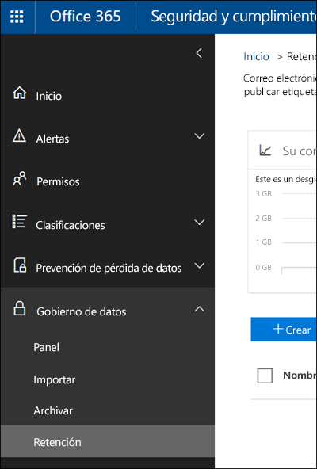

# Introducción a las directivas de retención

Para la mayoría de las organizaciones, el volumen y la complejidad de los datos se incrementa diariamente: correo electrónico, documentos, mensajes instantáneos y mucho más. Administrar o gobernar esta información es importante, ya que necesita:
  
- **Cumplir de forma proactiva con las normas del sector y las directivas internas** que le exigen retener contenido durante un período mínimo de tiempo. Por ejemplo, la ley Sarbanes-Oxley puede exigirle que retenga determinados tipos de contenido durante siete años. 
    
- **Reducir el riesgo en caso de litigio o una infracción de seguridad** al eliminar de forma permanente contenido antiguo que ya no es necesario mantener. 
    
- **Ayudar a su organización a compartir los conocimientos de manera eficaz y ser más ágil** al asegurarse de que los usuarios trabajan solo con contenido actualizado y relevante para ellos. 
    
Una directiva de retención en Office 365 puede ayudarle a lograr todos estos objetivos. Administrar el contenido suele requerir dos acciones:
  
- **Conservar** contenido para que no pueda eliminarse de forma permanente antes del fin del período de retención. 
    
- **Eliminar** contenido de forma permanente al final del período de retención. 
    
Con una directiva de retención, puede:
  
- Decidir de forma proactiva si quiere retener o eliminar el contenido, o ambas opciones: retener y, a continuación, eliminar el contenido.
    
- Aplicar una única directiva a toda la organización o solo a determinadas ubicaciones o usuarios.
    
- Aplicar una directiva a todo el contenido o solo a aquel que cumpla ciertas condiciones, como contener palabras clave específicas o [pertenecer a determinados tipos de información confidencial](what-the-sensitive-information-types-look-for.md).
    
Cuando el contenido está sujeto a una directiva de retención, las personas pueden seguir editando el contenido y trabajando con él como si no hubiera cambiado nada porque el contenido se retiene en su lugar, en su ubicación original. Pero si alguien edita o elimina el contenido sujeto a la directiva, se guardará una copia en una ubicación segura donde se retendrá mientras la directiva esté en vigor.
  
Por último, algunas organizaciones podrían tener que cumplir con regulaciones, como la regla 17a-4 de la SEC (Comisión de intercambio y valores), lo que requiere que, después de activar una directiva de retención, esta no se pueda desactivar ni hacer menos restrictiva. Para cumplir este requisito, puede usar el Bloqueo de conservación. Después de que se haya bloqueado una directiva, ninguna persona puede desactivarla ni hacerla menos restrictiva, ni siquiera el administrador.
  
Las directivas de retención se crean y se administran en la página **Retención** del Centro de seguridad y cumplimiento de Office 365. 
  

  
> [!NOTE]
> Para incluir un buzón de Exchange Online en una directiva de retención, debe tener asignada una licencia de Exchange Online plan 2. Si un buzón tiene asignada una licencia de Exchange Online plan 1, deberá asignarle una licencia independiente de Archivado de Exchange Online para incluirlo en una directiva de retención. 
  
## Funcionamiento de una directiva de retención local

Cuando se incluye en una directiva de retención una ubicación como un sitio o buzón, el contenido permanece en su ubicación original. Los usuarios pueden seguir trabajando con sus documentos o buzones como si nada hubiera cambiado, pero si modifican o eliminan contenido que esté incluido en la directiva, se conservará una copia del mismo tal como era cuando se aplicó la directiva.
  
Para los sitios, se conserva una copia del contenido original en la biblioteca de conservación de documentos cuando los usuarios lo modifican o eliminan; para el correo electrónico y las carpetas públicas, la copia se retiene en la carpeta Elementos recuperables. Estas ubicaciones seguras y el contenido retenido no son visibles para la mayoría de los usuarios. Con una directiva de retención, los usuarios ni siquiera necesitan saber que su contenido está sujeto a la directiva.
  
Notas:
  
- El contenido de Skype se almacena en Exchange, donde se aplica la directiva según el tipo de mensaje (correo electrónico o conversación).
    
- Una directiva de retención aplicada a un grupo de Office 365 incluye el buzón del grupo y el sitio.
    
### Contenido en cuentas de OneDrive y sitios de SharePoint

Las directivas de retención se aplican en el nivel de un sitio. Cuando se incluye un sitio de SharePoint o una cuenta de OneDrive en una directiva de retención, se crea una biblioteca de conservación de documentos si aún no existe. La mayoría de los usuarios no pueden ver esta biblioteca porque solo se muestra a los administradores de colecciones de sitios.
  
Si una persona intenta cambiar o eliminar el contenido de un sitio sujeto a una directiva de conservación, la directiva comprueba primero si el contenido se ha cambiado desde que se aplicó la directiva. Si este es el primer cambio desde que se aplicó la directiva, esta copia el contenido en la biblioteca de conservación de documentos y, después, permite al usuario cambiar o eliminar el contenido original. Tenga en cuenta que es posible copiar cualquier contenido del sitio en la biblioteca de conservación de documentos, incluso aunque dicho contenido no coincida con la consulta que se haya usado para la directiva de retención.
  
Después, un trabajo del temporizador limpia la biblioteca de conservación de documentos. El trabajo del temporizador se ejecuta periódicamente y compara todo el contenido de la biblioteca de conservación de documentos con todas las consultas utilizadas por las directivas de retención del sitio. A menos que el contenido coincida con, como mínimo, una de las consultas, el trabajo del temporizador eliminará permanentemente el contenido de la biblioteca de conservación de documentos.
  
Esto es aplicable al contenido existente en el momento de aplicar la directiva de retención. Además, después de la eliminación, se conservará cualquier contenido nuevo que se haya creado o agregado al sitio tras incluirlo en la directiva. Sin embargo, el contenido nuevo no se copia en la biblioteca de conservación de documentos la primera vez que se edita, solo cuando se elimina. Para conservar todas las versiones de un archivo, debe activar el control de versiones (consulte más adelante la sección sobre el control de versiones).
  
Tenga en cuenta que un usuario recibirá un error si intenta eliminar una biblioteca, lista, carpeta o sitio sujeto a una directiva de retención. Un usuario puede eliminar una carpeta si primero mueve o elimina los archivos que contiene que están sujetos a la directiva.
  

  
Cuando se asigna una directiva de retención a una cuenta de OneDrive o un sitio de SharePoint, el contenido puede seguir una de estas dos rutas:
  
1. **Si el contenido se ha modificado o eliminado** durante el período de retención, se crea una copia en la biblioteca de conservación de documentos del contenido original tal como era cuando se asignó la directiva de retención. Allí, se ejecuta un trabajo de temporizador de forma periódica que identifica los elementos cuyo período de retención ha expirado y estos se eliminan de forma permanente en los siete días siguientes al fin del período de retención. 
    
2. **Si el contenido no se ha modificado o eliminado** durante el período de retención, se mueve a la Papelera de reciclaje de primer nivel al final del período de retención. Si un usuario elimina el contenido desde allí o vacía esta Papelera de reciclaje (lo que también se conoce como purgar), el documento se mueve a la Papelera de reciclaje de segundo nivel. Un período de retención de 93 días abarca las papeleras de reciclaje de primer y segundo nivel. Al final de esos 93 días, el documento se elimina permanentemente donde se encuentre, ya sea la Papelera de reciclaje de primer o segundo nivel. Tenga en cuenta que la Papelera de reciclaje no está indexada y, por tanto, las búsquedas no encuentran contenido en ella. Esto significa que una retención de eDiscovery no localizará ningún contenido en la Papelera de reciclaje para poder retenerlo. 
    
### Contenido de buzones y carpetas públicas

En el caso del correo del usuario, calendario y otros elementos, las directivas de retención se aplican en el nivel de un buzón. En el caso de una carpeta pública, las directivas de retención se aplican en el nivel de carpeta, no en el nivel de buzón. Tanto un buzón como una carpeta pública usan la carpeta Elementos recuperables para retener los elementos. Solo las personas a las que se les han asignado permisos de eDiscovery pueden ver el contenido de la carpeta Elementos recuperables de otro usuario.
  
De manera predeterminada, cuando un usuario elimina un mensaje de una carpeta que no es la carpeta Elementos eliminados, el mensaje se mueve a esta carpeta. Cuando un usuario elimina un elemento de la carpeta Elementos eliminados, el mensaje se mueve a la carpeta Elementos recuperables. Además, un usuario puede eliminar temporalmente un elemento de cualquier carpeta (presionando MAYÚS+SUPR). Esta acción omite la carpeta Elementos eliminados y coloca el elemento directamente en la carpeta Elementos recuperables.
  
Un proceso evalúa periódicamente los elementos de la carpeta Elementos recuperables. Si un elemento no coincide con las reglas de al menos una directiva de retención, se elimina de forma permanente (lo que también se conoce como "eliminación permanente") de la carpeta Elementos recuperables.
  
Cuando un usuario intenta cambiar determinadas propiedades de un elemento de buzón (como el asunto, el cuerpo, los datos adjuntos, los remitentes y los destinatarios, o la fecha de envío o recepción de un mensaje) se guarda una copia del elemento original en la carpeta Elementos recuperables antes de aplicar el cambio. Esto ocurre con cada cambio posterior. Al finalizar el período de retención, se eliminan las copias de la carpeta Elementos recuperables de forma permanente.
  
Si un usuario deja la organización y su buzón está incluido en una directiva de retención, el buzón pasa a estar inactivo cuando se elimina la cuenta de Office 365 de dicho usuario. El contenido de un buzón inactivo sigue estando sujeto a cualquier directiva de retención que se le hubiera aplicado antes de que pasara a estar inactivo, y el contenido está disponible para una búsqueda de eDiscovery. Para obtener más información, vea [Buzones inactivos en Exchange Online](https://go.microsoft.com/fwlink/?linkid=846909).
  

  
Cuando se asigna una directiva de retención a un buzón o una carpeta pública, el contenido puede seguir una de estas dos rutas:
  
1. **Si el elemento se ha modificado o eliminado de forma permanente** por parte del usuario (con MAYÚS+SUPR o eliminándolo de Elementos eliminados) durante el período de retención, el elemento se mueve (o copia, en el caso de la edición) a la carpeta Elementos recuperables. Allí se ejecuta un proceso de forma periódica que identifica los elementos cuyo período de retención ha expirado y estos se eliminan permanentemente en un plazo de 14 días al finalizar el período de retención. Tenga en cuenta que 14 días es la configuración predeterminada, pero es posible configurar hasta 30 días. 
    
2. **Si el elemento no se ha modificado o eliminado** durante el período de retención, el mismo proceso se ejecuta periódicamente en todas las carpetas del buzón para identificar los elementos cuyo período de retención ha expirado y estos se eliminan de forma permanente en un plazo de 14 días al final del período de retención. Tenga en cuenta que 14 días es la configuración predeterminada, pero es posible configurar hasta 30 días. 
    
## Funcionamiento de una directiva de retención con versiones de documentos de un sitio

El control de versiones es una característica de todas las bibliotecas de documentos en SharePoint Online y OneDrive para la Empresa. De forma predeterminada, el control de versiones conserva un mínimo de cien versiones principales, aunque puede aumentar este límite. Para obtener más información, vea [Habilitar y configurar el control de versiones para una lista o biblioteca](https://support.office.com/article/1555d642-23ee-446a-990a-bcab618c7a37).
  
Una directiva de retención conserva todas las versiones de un documento en un sitio de SharePoint o una cuenta de OneDrive. Cada vez que se edita o se elimina un documento sujeto a una directiva de retención, se copia una versión a la biblioteca de conservación de documentos. Todas las versiones de un documento de la biblioteca de conservación de documentos existen como un elemento independiente con su propio período de retención:
  
- Si la directiva de retención se basa en la fecha de creación del contenido, cada versión tiene la misma fecha de vencimiento que el documento original. El documento original y sus versiones expiran al mismo tiempo.
    
- Si la directiva de retención se basa en la fecha de última modificación del contenido, cada versión contará con su propia fecha de expiración en función de cuándo se modificó el documento original para crear esa versión. Los documentos originales y sus versiones expiran independientemente los unos de los otros.
    
## Retención de contenido durante un período de tiempo específico

Puede usar una directiva de retención para retener el contenido de forma indefinida o durante un número específico de días, meses o años. Tenga en cuenta que el período de conservación del contenido se basa en su antigüedad, no en el momento de aplicación de la directiva de retención. Puede elegir basar su antigüedad en la fecha de creación del contenido o, en el caso de OneDrive y SharePoint, en la fecha de última modificación.
  
Por ejemplo, si desea retener el contenido de un sitio durante siete años a partir de la última modificación, y un documento de ese sitio no se ha modificado en seis años, el documento se retendrá solo durante un año más, a no ser que se modifique. Si el documento se edita de nuevo, la antigüedad de dicho documento se calculará a partir de la fecha de la última modificación, y se retendrá durante otros siete años.
  
De forma similar, si desea retener el contenido en un buzón durante siete años y un mensaje se envió hace seis, se retendrá solo durante un año. Para el contenido de Exchange, la antigüedad siempre se basa en la fecha de envío o recepción (son iguales). Conservar el contenido en función de cuándo se realizó esa modificación solo se aplica a contenido de sitio de OneDrive y SharePoint.
  
Puede elegir si desea que el contenido se elimine de forma permanente al final del período de retención. Una directiva de retención también puede simplemente eliminar contenido antiguo sin retenerlo. Consulte la sección siguiente.
  

  
## Eliminar el contenido que supera una antigüedad determinada

Una directiva de retención puede tanto conservar y eliminar el contenido, como simplemente eliminar contenido antiguo sin retenerlo.
  
Si su directiva de retención elimina contenido, es importante entender que el período de tiempo especificado para una directiva de retención se calcula a partir del tiempo desde que se creó o modificó el documento, no el tiempo desde que se asignó la directiva.
  

  
Por ejemplo, suponga que crea una directiva de retención que elimina el contenido después de tres años y, a continuación, la asigna a todas las cuentas de OneDrive, que contienen una gran cantidad de contenido creado hace cuatro o cinco años. En este caso, una gran cantidad de contenido se eliminará tan pronto como asigne la directiva de retención por primera vez. Por este motivo, **una directiva de retención que elimina contenido puede afectar considerablemente a su contenido**. 
  
Por lo tanto, antes de asignar una directiva de retención a un sitio por primera vez, primero debería considerar la antigüedad del contenido existente y cuál será el impacto de esa directiva. También es recomendable comunicar la nueva directiva a sus usuarios antes de asignarla para darles tiempo a evaluar el posible impacto. Tenga en cuenta esta advertencia que aparece al revisar la configuración de la directiva de retención justo antes de crearla.
  

  
## Configuración avanzada que aplica una directiva solo al contenido que cumple ciertas condiciones

Puede aplicar una directiva de retención a todo el contenido de las ubicaciones que incluya, o bien, puede aplicar una directiva de retención solo al contenido que contenga determinadas palabras clave o [determinados tipos de información confidencial](what-the-sensitive-information-types-look-for.md).
  

  
### Retener el contenido que contenga determinadas palabras clave

Puede aplicar una directiva de retención al contenido que cumpla determinadas condiciones y, a continuación, realizar acciones de retención con solo con ese contenido. Las condiciones disponibles ahora admiten aplicar una directiva de retención al contenido que contiene palabras o frases específicas. Puede restringir su consulta usando operadores de búsqueda como AND, OR y NOT. Para obtener más información sobre los operadores, vea [Consultas de palabras clave y condiciones de búsqueda para la búsqueda de contenido](keyword-queries-and-search-conditions.md).
  
La compatibilidad para agregar propiedades susceptibles de búsqueda (por ejemplo, **asunto:**) estará disponible próximamente.
  
Tenga en cuenta que la retención basada en consulta usa el índice de búsqueda para identificar el contenido.
  

  
### Retener contenido que contenga información confidencial

También puede aplicar una directiva de retención solo al contenido que contenga [determinados tipos de información confidencial](what-the-sensitive-information-types-look-for.md). Por ejemplo, puede aplicar requisitos de retención solo a contenido con información de identificación personal (DCP), como números de identificación fiscal, números de la seguridad social o números de pasaporte.
  

  
Notas:
  
- La retención avanzada de información confidencial no se aplica a las carpetas públicas de Exchange o Skype Empresarial porque estas ubicaciones no admiten tipos de información confidencial.
    
- Debe comprender que Exchange Online usa reglas de transporte para identificar información confidencial, por lo que funciona con mensajes en tránsito, no con todos los elementos que ya están almacenados en un buzón. Para Exchange Online, esto significa que una directiva de retención puede identificar información confidencial y realizar acciones de retención en los mensajes recibidos **después** de aplicar la directiva al buzón. (Tenga en cuenta que la retención basada en consultas descrita en la sección anterior no tiene esta limitación, ya que utiliza el índice de búsqueda para identificar el contenido). 
    
## Aplicar una directiva de retención a toda la organización o a ubicaciones específicas

Puede aplicar fácilmente una directiva de retención a toda la organización, a ubicaciones completas o solo a determinados usuarios o ubicaciones.
  
### Directiva para toda la organización

Una de las características más eficaces de una directiva de retención es que de forma predeterminada se aplica a las ubicaciones de Office 365, como:
  
- Correo electrónico de Exchange
    
- Sitios de SharePoint
    
- Cuentas de OneDrive
    
- Grupos de Office 365 (se aplica al contenido del buzón, del sitio y de los documentos del grupo. Pronto se aplicará al contenido de Planner, Yammer y CRM).
    
- Carpetas públicas de Exchange
    

  
Otras características importantes de una directiva de retención para toda la organización son:
  
- No hay ningún límite en el número de buzones o sitios que puede incluir la directiva.
    
- Para Exchange, todos los buzones creados tras la aplicación de la directiva la heredarán automáticamente.
    
Sin embargo, hay un límite de 10 directivas para toda la organización y directivas para ubicaciones completas combinadas (vea la sección siguiente) por espacio empresarial.
  
### Una directiva para ubicaciones completas

Al elegir ubicaciones, puede incluir o excluir una ubicación completa, como correo electrónico de Exchange o cuentas de OneDrive fácilmente. Para ello, solo tiene que activar o desactivar el **estado** de esa ubicación. 
  
Al igual que una directiva para toda la organización, si una directiva se aplica a cualquier combinación de ubicaciones completas, no hay ningún límite en el número de buzones o sitios que puede incluir la directiva. Por ejemplo, si la directiva incluye todo el correo electrónico de Exchange y todos los sitios de SharePoint, todos los sitios y buzones se incluirán, sin importar el número. Y en Exchange, todos los buzones que se creen una vez que se aplica la directiva, heredarán automáticamente la directiva.
  
Sin embargo, hay un límite de 10 directivas para toda la organización y directivas para ubicaciones completas combinadas por espacio empresarial.
  

  
### Una directiva con inclusiones o exclusiones específicas

También puede aplicar una directiva de retención a usuarios específicos. Para ello, cambie el **estado** de esa ubicación y, después, use los vínculos para incluir o excluir determinados usuarios, grupos de Office 365 o ubicaciones. 
  
Sin embargo, tenga en cuenta que existen los siguientes límites para una directiva de retención que incluya o excluya más de 1000 usuarios específicos:
  
- Una directiva de retención semejante no puede contener más de 1000 buzones de correo y 100 sitios.
    
- Un espacio empresarial no puede contener más de 1000 directivas de retención.
    
Aunque existen estos límites, comprenda que puede superarlos si aplica una directiva para toda la organización o una directiva para ubicaciones completas.
  
### Ubicaciones de Skype

A diferencia del correo electrónico de Exchange, no puede cambiar el estado de la ubicación de Skype para incluir a todos los usuarios, pero puede activar esa ubicación y después elegir manualmente los usuarios cuyas conversaciones quiere conservar.
  
Al elegir usuarios de Skype Empresarial, puede incluirlos todos rápidamente seleccionando el cuadro **Nombre** en el encabezado de columna, sin embargo, es importante comprender que cada usuario se representará como una inclusión específica en la directiva. Por lo tanto, si incluye más de 1000 usuarios, se aplicarán los límites señalados en la sección anterior. Seleccionar aquí todos los usuarios de Skype no es lo mismo que si una directiva para toda la organización pudiera incluir todos los usuarios de Skype de forma predeterminada. 
  

  
Tenga en cuenta que **Historial de conversaciones**, una carpeta de Outlook, es una característica que no tiene nada que ver con el archivado de Skype. El usuario final puede desactivar **Historial de conversaciones**, pero el archivado para Skype se realiza almacenando una copia de las conversaciones de Skype en una carpeta oculta que está disponible para eDiscovery, pero inaccesible para el usuario. 
  
### Ubicaciones de Teams

Puede usar una directiva de retención para retener chats y mensajes de canales en Teams. Los chats de Teams se almacenan en una carpeta oculta en el buzón de cada usuario incluido en el chat y los mensajes de canales de Teams se almacenan en una carpeta similar, también oculta, en el buzón de grupo del equipo. Sin embargo, es importante comprender que Teams utiliza un servicio de chat de Azure que también almacena estos datos y, de forma predeterminada, este servicio almacena los datos para siempre. Por este motivo, recomendamos que use la ubicación de Teams para retener y eliminar datos de Teams. Con la ubicación de Teams podrá eliminar datos de forma permanente tanto de los buzones de Exchange como del servicio de chat de Azure subyacente. Para más información, consulte [Información general sobre la seguridad y cumplimiento en Microsoft Teams](https://go.microsoft.com/fwlink/?linkid=871258).
  
Tenga en cuenta que los chats y mensajes de canal de Teams no se ven afectados por las directivas de retención que se aplican a los buzones de usuario o grupos en las ubicaciones de grupos de Exchange u Office 365. Aunque los chats y mensajes de canales de Teams se almacenen en Exchange, solo se ven afectados si se aplica una directiva de retención a la ubicación de Teams.
  
Seguimos trabajando en el período de retención de Teams y vamos a agregar características adicionales. Mientras tanto, hay algunas limitaciones que se deben tener en cuenta:
  
- **Teams requiere una directiva de retención diferente** Al crear una directiva de retención y activar la ubicación de Teams, el resto de ubicaciones se desactivan. Una directiva de retención que incluya los equipos puede incluir solo equipos y ninguna otra ubicación. 
    
- **Las directivas para toda la organización no incluyen Teams** Si crea una directiva para toda la organización, no se incluye Teams porque requiere una directiva de retención diferente. 
    
- **Teams no admite funciones avanzadas de retención** Al crear una directiva de retención, si elige [Configuración avanzada que aplica una directiva solo al contenido que cumple ciertas condiciones](retention-policies.md#advanced), no está disponible la ubicación de Teams. En la actualidad, la retención en Teams se aplica a todo el contenido de mensajes del chat y del canal.
    
- **El contenido de Teams debe tener una antigüedad de 30 días para eliminarse** En la actualidad, no se admite la creación de una directiva para eliminar el contenido de equipos que tenga menos de 30 días. Si desea que esta directiva se aplique a contenido de Teams, especifique un período de retención igual o mayor que 30 días. 
    
- **Teams puede tardar hasta 30 días en limpiar el contenido retenido** Una directiva de retención aplicada a Teams eliminará el contenido de todas las ubicaciones de almacenamiento relevantes. Sin embargo, inmediatamente después de su inicio, los clientes de Teams pueden tardar hasta 30 días en limpiar el contenido según la directiva de retención. Pero, aunque el contenido siga apareciendo en los clientes de Teams, no se mostrará en búsquedas de contenido o eDiscovery tras el fin del período de retención. 
    
En Teams, los archivos compartidos en una conversación se almacenan en la cuenta de OneDrive del usuario que ha compartido un archivo. Los archivos que se cargan en canales se almacenan en el sitio de SharePoint para el equipo. Por lo tanto, para conservar o eliminar archivos de Teams, deberá crear una directiva de retención que se aplique a las ubicaciones de SharePoint y OneDrive. Si desea aplicar una directiva a los archivos de solo un grupo específico, puede elegir el sitio de SharePoint para Teams y las cuentas de OneDrive de usuarios de Teams.
  
Una directiva de retención que se aplica a Teams puede usar [Bloqueo de conservación](retention-policies.md#locking).
  

  
## Excluir determinados tipos de elementos de Exchange de una directiva de retención
Con PowerShell, puede excluir determinados tipos de elementos de Exchange de una directiva de retención. Por ejemplo, puede excluir mensajes de correo de voz, conversaciones de mensajería instantánea y otros contenidos de Skype Empresarial Online en los buzones. También puede excluir calendario, notas y elementos de la tarea. Esta función está disponible solo mediante PowerShell, no en la interfaz de usuario cuando se crea una directiva de retención.
  
Para ello, utilice el parámetro `ExcludedItemClasses` de los cmdlets `New-RetentionComplianceRule` y `Set-RetentionComplianceRule`. Para obtener más información sobre PowerShell, vea la sección siguiente [Buscar los cmdlets de PowerShell para directivas de retención](retention-policies.md#powershell).
  
## Bloquear una directiva de retención
Algunas organizaciones podrían tener que cumplir con las reglas que definen los organismos reguladores, como la regla 17a-4 de la SEC (Comisión de intercambio y valores), lo que requiere que, después de activar una directiva de retención, esta no se pueda desactivar ni hacer menos restrictiva. Con el Bloqueo de retención, puede bloquear una directiva de modo que ninguna persona pueda desactivarla ni hacerla menos restrictiva, ni siquiera el administrador.
  
Después de que se haya bloqueado una directiva, nadie puede desactivarla ni quitar ubicaciones de la directiva. Tampoco es posible modificar o eliminar el contenido que está sujeto a la directiva durante el período de retención. Una vez que se ha bloqueado la directiva, la única manera de modificar la directiva de conservación consiste en agregarle contenido o ampliar su duración. Una directiva bloqueada se puede incrementar o ampliar, pero no se puede reducir, deshabilitar ni desactivar.
  
Por lo tanto, antes de bloquear una directiva de retención, es **muy importante** que comprenda los requisitos de cumplimiento de la organización y que **no bloquee** una directiva hasta que no esté seguro de que es necesario.
  
Puede bloquear una directiva de retención con solo usar PowerShell. Utilice el parámetro `RestrictiveRetention` del cmdlet `New-RetentionCompliancePolicy` o `Set-RetentionCompliancePolicy`. Para obtener más información sobre PowerShell, vea a continuación la sección [Buscar los cmdlets de PowerShell para directivas de retención](retention-policies.md#powershell).
  
## Los principios de retención o qué tiene prioridad

Es posible o incluso probable que el contenido tenga varias directivas de retención aplicadas, cada una con una acción (conservar, eliminar o ambas) y un período de retención. ¿Qué tiene prioridad? En el nivel más alto, puede estar seguro de que el contenido que una directiva retiene no se puede eliminar de forma permanente mediante otra directiva.
  

  
Para entender cómo diferentes directivas de retención se aplican al contenido, tenga en cuenta estos principios de retención:
  
1. **La retención gana a la eliminación.** Suponga que una directiva de retención dice que es preciso eliminar el correo electrónico de Exchange después de tres años, pero otra directiva de retención dice conservar el correo electrónico de Exchange durante cinco años y eliminarlo. Todo el contenido que llegue a tres años de antigüedad se eliminará y quedará oculto a ojos del usuario, pero seguirá en la carpeta Elementos recuperables hasta que llegue a los cinco años, momento en el que se eliminará de forma permanente. 
    
2. **Gana el período de retención más largo.** Si el contenido está sujeto a varias directivas de retención, se retendrá hasta el final del período de retención más largo. 
    
3. **La inclusión explícita gana a la inclusión implícita.** Esto significa: 
    
    1. Si una etiqueta con configuración de retención se asigna de forma manual a un usuario o elemento, como un correo electrónico de Exchange o un documento de OneDrive, tendrá prioridad sobre la directiva asignada al sitio o al buzón y una etiqueta predeterminada asignada por la biblioteca de documentos. Por ejemplo, si la etiqueta explícita dice que debe retenerse durante diez años, pero la directiva asignada al sitio dice que solo debe retenerse durante cinco años, la etiqueta tiene prioridad. Tenga en cuenta que las etiquetas autoaplicables se consideran implícitas y no implícitas porque Office 365 las aplica automáticamente.
    
    2. Si una directiva de retención incluye una ubicación específica como el buzón de un usuario o una cuenta de OneDrive para la Empresa, tendrá prioridad sobre cualquier otra directiva de retención que se aplique a los buzones de todos los usuarios o a las cuentas de OneDrive para la Empresa, pero no incluye específicamente ese buzón de usuario.
    
4. **El período de eliminación más corto gana.** De forma similar, si el contenido está sujeto a varias directivas que eliminan contenido (sin ninguna retención), se eliminará al final del período de retención más corto. 
    
Tenga en cuenta que los principios de retención funcionan como un flujo de desempate de arriba a abajo: si las reglas aplicadas por todas las directivas o etiquetas son las mismas en un nivel, el flujo baja al siguiente nivel para determinar la prioridad de la regla que se aplica.
  
Por último, una etiqueta o directiva de retención no puede eliminar ningún contenido de forma permanente si está en suspensión para eDiscovery. Cuando se levante la suspensión, el contenido estará disponible para el período de limpieza descrito anteriormente.
  
## Usar una directiva de retención en lugar de estas características

Una sola directiva de retención se puede aplicar con facilidad a toda la organización y a ubicaciones en Office 365, incluidos Exchange Online, SharePoint Online, OneDrive para la Empresa y grupos de Office 365. Si necesita retener o eliminar contenido en cualquier parte de Office 365, le recomendamos que use una directiva de retención. También se pueden usar etiquetas con la configuración de retención: para obtener más información, vea [Información general de etiquetas](labels.md).
  
A continuación, se muestran otras características que se han utilizado anteriormente para retener o eliminar contenido en Office 365. Estas características seguirán funcionando en paralelo con las directivas de retención creadas en el Centro de seguridad y cumplimiento. Pero en el futuro, para el gobierno de datos, le recomendamos que use una directiva de retención o etiquetas en lugar de estas características. Una directiva de retención es la única característica que puede conservar y eliminar contenido en Office 365.
  
### Exchange Online

- [Administrar casos de eDiscovery en el Centro de seguridad y cumplimiento de Office 365](https://support.office.com/article/edea80d6-20a7-40fb-b8c4-5e8c8395f6da) (suspensión de eDiscovery) 
    
- [Conservación local y Retención por juicio](https://go.microsoft.com/fwlink/?linkid=846124) (suspensión de eDiscovery) 
    
- [Etiquetas de retención y directivas de retención](https://go.microsoft.com/fwlink/?linkid=846125), también conocidas como [administración de registros de mensajes (MRM)](https://go.microsoft.com/fwlink/?linkid=846126) (solo eliminación) 
    
### SharePoint Online y OneDrive para la Empresa

- [Administrar casos de eDiscovery en el Centro de seguridad y cumplimiento de Office 365](https://support.office.com/article/edea80d6-20a7-40fb-b8c4-5e8c8395f6da) (suspensión de eDiscovery) 
    
- [Agregar contenido a un caso y poner orígenes en suspensión en el Centro de eDiscovery](https://support.office.com/article/54d70de9-1ec2-4325-84f3-aeb588554479) (suspensión de eDiscovery) 
    
- [Información general sobre las directivas de eliminación de documentos](https://support.office.com/article/55e8d858-f278-482b-a198-2e62d6a2e6e5) (solo eliminación) 
    
- [Configuración de administración de registros local](https://support.office.com/article/7707a878-780c-4be6-9cb0-9718ecde050a) (retención) 
    
- [Usar las directivas de cierre y eliminación de sitio](https://support.office.com/article/a8280d82-27fd-48c5-9adf-8a5431208ba5) (solo eliminación) 
    
- [Directivas de administración de información](intro-to-info-mgmt-policies.md) (solo eliminación) 
    
Tenga en cuenta que si anteriormente usaba cualquiera de las retenciones de eDiscovery para el gobierno de datos, debe usar en su lugar una directiva de retención para el cumplimiento proactivo. Debe usar una retención creada en el Centro de seguridad y cumplimiento solo para eDiscovery.
  
### Las directivas de retención prevalecen sobre las de administración de la información

En los sitios de SharePoint, puede que use [directivas de administración de información](intro-to-info-mgmt-policies.md) para retener el contenido. Si aplica una directiva de retención creada en el Centro de seguridad y cumplimiento a un sitio que ya usa directivas de tipo de contenido o directivas de administración de información para una lista o biblioteca, estas se ignoran mientras la directiva de retención esté en vigor. 
  
## ¿Qué ha ocurrido con las directivas de conservación?

Si utilizaba directivas de conservación, estas se han convertido automáticamente en directivas de retención que usan solo la acción de retener: la directiva no elimina el contenido. La directiva de conservación seguirá funcionando y conservando el contenido sin necesidad de ningún cambio. Puede encontrar estas directivas en la página **Retención** del Centro de seguridad y cumplimiento. Puede editar una directiva de conservación para cambiar el período de retención, pero no puede realizar otros cambios, como agregar o quitar ubicaciones. 
  
## Permisos

Los miembros de su equipo de cumplimiento normativo que vayan a crear directivas de retención necesitan permisos del Centro de seguridad y cumplimiento. De forma predeterminada, el administrador de espacios empresariales tendrá acceso a esta ubicación y puede proporcionar acceso a los responsables de cumplimiento y otros usuarios para el Centro de seguridad y cumplimiento sin darles todos los permisos de un administrador de espacios empresariales. Para ello, se recomienda ir a la página **Permisos** del Centro de seguridad y cumplimiento, editar el grupo de roles **Administrador de cumplimiento** y agregar miembros al mismo. 
  
Para obtener más información, vea [Conceder acceso a los usuarios para el Centro de seguridad y cumplimiento de Office 365](grant-access-to-the-security-and-compliance-center.md).
  
Estos permisos son necesarios solo para crear y aplicar una directiva de retención. La aplicación de directivas no requiere acceso al contenido.
  
## Buscar los cmdlets de PowerShell para directivas de retención

Para usar los cmdlets de directiva de retención, debe:
  
1. [Conectarse al Centro de seguridad y cumplimiento de Office 365 mediante PowerShell remoto](http://go.microsoft.com/fwlink/?LinkID=799771&amp;clcid=0x409)
    
2. Usar estos [cmdlets del Centro de seguridad y cumplimiento de Office 365](http://go.microsoft.com/fwlink/?LinkID=799772&amp;clcid=0x409)
    
## Más información

- [Introducción a las etiquetas](labels.md)
    

