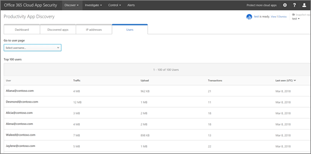

# Revisar los resultados de la detección de aplicaciones en Office 365 Cloud App SecurityReview app discovery findings in Office 365 Cloud App Security
  
|Evaluación **\>**\*\*\*\*Evaluation\*\* \>\*\*|Planeación de **\>**\*\*\*\*Planning\*\* \>\*\*|Implementación **\>**\*\*\*\*Deployment\*\* \>\*\*|Utilización de \*\*\*\*\*\*\*Utilization\*\*\*\*|
|:-----|:-----|:-----|:-----|
|[Empezar a evaluarStart evaluating](office-365-cas-overview.md)   |[Comenzar a planearStart planning](get-ready-for-office-365-cas.md)   |[Iniciar la implementaciónStart deploying](turn-on-office-365-cas.md)   |¡Están aquí!You are here!    [Pasos siguientesNext steps](#next-steps)   |
   
El panel de detección de la nube funciona con registros de tráfico web de la organización para proporcionar información detallada sobre el uso de la aplicación en la nube. Si usted es un administrador global, Administrador de seguridad o lector de seguridad y su organización tiene [creado informes de detección de aplicaciones en la seguridad de la aplicación de nube de Office 365](create-app-discovery-reports-in-ocas.md), puede usar el panel de detección en la nube para comprender mejor cómo de personas en su organización está usando Office 365 y otras aplicaciones en la nube. (El panel de detección de la nube también conocido como está detección de aplicaciones de productividad).The Cloud Discovery dashboard works with your organization's web traffic logs to provide detailed information about cloud app usage. If you're a global administrator, security administrator, or security reader, and your organization has [created app discovery reports in Office 365 Cloud App Security](create-app-discovery-reports-in-ocas.md), you can use the Cloud Discovery dashboard to gain insight into how people in your organization are using Office 365 and other cloud apps. (The Cloud Discovery dashboard is also known as Productivity App Discovery.)
  
 El panel de detección de la nube permite ver información detallada sobre cómo las personas de su organización están usando Office 365 y otras aplicaciones.The Cloud Discovery dashboard enables you to view detailed information about how people in your organization are using Office 365 and other apps. 
  

     
## Vaya al panel de detección de la nubeGo to the Cloud Discovery dashboard

1. Vaya al portal de seguridad de la aplicación en la nube ([https://portal.cloudappsecurity.com](https://portal.cloudappsecurity.com)) e iniciar sesión.Go to the Cloud App Security portal ([https://portal.cloudappsecurity.com](https://portal.cloudappsecurity.com)) and sign in.
    
2. Vaya a **descubrir** \> **panel de detección de la nube**.Go to **Discover** \> **Cloud Discovery dashboard**.
    
## Vea sus usuarios principales, direcciones IP, aplicaciones y niveles de riesgoSee your top users, IP addresses, apps, and risk levels

El panel de detección de la nube le ofrece una introducción de un vistazo a las aplicaciones que se usan con Office 365 en su organización, cualquier alertas abiertas, superior a los usuarios y niveles de riesgo.The Cloud Discovery dashboard gives you an at-a-glance overview of apps that are used with Office 365 in your organization, any open alerts, top users, and risk levels.
  

  
1. En la ficha de **panel** , examine el uso de aplicación en la nube global en la organización en la sección información general en la parte superior de la pantalla.On the **Dashboard** tab, look at the overall cloud app use in your organization in the overview section across the top of the screen. 
    
2. Ver las **categorías de Office 365** para las aplicaciones que se usan en su organización.See the **Office 365 categories** for apps that are used in your organization. 
    
3. Examine el widget **Discovered aplicaciones** para ver el uso de Office 365 y otras aplicaciones en esta vista.Look at the **Discovered apps** widget to see usage of Office 365 and other apps in this view. 
    
4. Examine el widget **superior a los usuarios** y **las direcciones IP de la parte superior** para identificar aquellos que usar Office 365 y en la nube de aplicaciones en la mayor parte de la organización.Look at the **Top users** and **Top IP addresses** widget to identify those who use Office 365 and cloud apps the most in your organization. 
    
5. Vea dónde están las aplicaciones que usan las personas por ubicación geográfica mediante el uso de la asignación de **ubicación de sedes centrales de aplicaciones** .See where the apps people are using are by geographical location by using the **Apps headquarters location** map. 
    
6. Sobre el área de mapas, eche un vistazo en la puntuación de riesgo de las aplicaciones descubiertas en la información general de **los niveles de riesgo** . Puede mirar los riesgos por los mismos grupos y categorías que se usaron en el área de **aplicaciones Discovered** . Por ejemplo, puede ver es la cantidad de tráfico en cada agrupación de aplicaciones de riesgo alto, medio o bajo.Above the maps area, take a look at the risk score of the discovered apps in the **Risk levels** overview. You can look at risks by the same groups and categories that you used in the **Discovered apps** area. For example, you can see how much traffic in each grouping is from high, medium, or low risk apps. 
    
## Profundizan en la informaciónDive deeper into the information

Puede usar la detección en la nube para Eche un vistazo más profundo de aplicaciones, subdominios, direcciones IP y los usuarios.You can use Cloud Discovery to take a deeper look at apps, subdomains, IP addresses, and users.
  
1. En el panel de la detección de la nube, elija la ficha **Discovered aplicaciones** .In the Cloud Discovery dashboard, choose the **Discovered apps** tab. 
    
2. Use la sección filtros para ver aplicaciones por nombre, categoría, el nivel de uso o última fecha visto.Use the filters section to view apps by name, category, usage level, or last seen date.
    
3. En la lista de resultados, pase el ratón por un nombre de la aplicación para mostrar el vínculo **Ver subdominios** .In the list of results, hover by an app name to reveal the **View sub-domains** link.   Aparecerá información detallada sobre la aplicación seleccionada.Detailed information about the selected app will appear.
    
4. Para ver detalles acerca de las direcciones IP, elija la pestaña **direcciones IP** .To view details about IP addresses, choose the **IP addresses** tab.  En la lista de resultados, seleccione una dirección IP individual para ver información más detallada.In the list of results, select an individual IP address to view more detailed information.
    
5. Para ver detalles acerca de los usuarios de Office 365 dentro de la organización, elija la pestaña de **los usuarios** .To view details about Office 365 users within your organization, choose the **Users** tab. 
  
## Excluir las entidadesExclude entities

Puede excluir determinados usuarios del sistema o las direcciones IP con el fin de centrarse en información más específica.You can exclude certain system users or IP addresses in order to focus on more specific information.
  
1. Elija **configuración** \> **configuración de detección de la nube**.Choose **Settings** \> **Cloud Discovery settings**.
    
2. Elija **excluir las entidades**.Choose **Exclude entities**.
    
3. Elija **los usuarios excluidos** o **direcciones IP excluidos**.Choose either **Excluded users** or **Excluded IP addresses**.
    
4. Especificar los usuarios o las direcciones IP y, en el cuadro **comentarios** , escriba información acerca de por qué se van a excluir los usuarios o direcciones IP.Specify the users or IP addresses, and in the **Comments** box, type information about why you are excluding those users or IP addresses. 
    
5. Elija **Agregar**.Choose **Add**.
    
## Pasos siguientesNext steps

- [Revisar y realizar acciones en las alertasReview and take action on alerts](review-office-365-cas-alerts.md)
    
- [Crear informes de detección de aplicacionesCreate app discovery reports](create-app-discovery-reports-in-ocas.md)
    
- Revise las [actividades de uso para la seguridad de la aplicación de nube de Office 365](utilization-activities-for-ocas.md)Review your [utilization activities for Office 365 Cloud App Security](utilization-activities-for-ocas.md)
    

