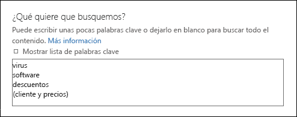
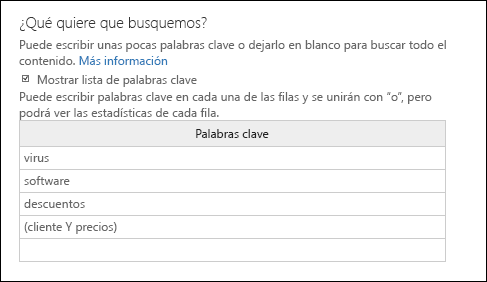
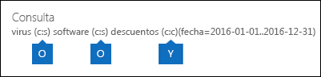

# <a name="run-a-content-search-in-the-office-365-security-amp-compliance-center"></a>Ejecutar una búsqueda de contenido en el centro de &amp; seguridad y cumplimiento de Office 365

Puede usar la herramienta de búsqueda de contenido de eDiscovery en el centro &amp; de seguridad y cumplimiento de Office 365 para buscar elementos como correo electrónico, documentos y conversaciones de mensajería instantánea en su organización de Office 365. Use esta herramienta para buscar elementos en estos servicios de Office 365:
  
- Buzones de correo y carpetas públicas de Exchange Online
    
- Sitios de SharePoint Online y OneDrive para la empresa
    
- Conversaciones de Skype empresarial
    
- Microsoft Teams 
    
- Grupos de Office 365
    
La búsqueda de contenido es una nueva herramienta de búsqueda de eDiscovery con nuevas y mejoradas capacidades de escalabilidad y rendimiento. Use la búsqueda de contenido para ejecutar búsquedas de eDiscovery muy grandes. Puede buscar en todos los buzones de correo, en todas las carpetas públicas de Exchange y en todos los sitios de SharePoint Online y en las cuentas de OneDrive para la empresa en una sola búsqueda de contenido. No hay límites en el número de ubicaciones de contenido que se pueden buscar. Tampoco hay límites en el número de búsquedas que se pueden ejecutar al mismo tiempo. Después de ejecutar una búsqueda de contenido, el número de ubicaciones de contenido y el número estimado de resultados de la búsqueda se muestran en el panel de detalles de la página de **búsqueda de contenido** . Después de ejecutar una búsqueda, puede obtener una vista previa de los resultados, obtener estadísticas de palabras clave para una o más búsquedas, editar en masa las búsquedas de contenido y exportar los resultados a un equipo local. 
  
 **Contenido**
  
[Crear una búsqueda](run-a-content-search-in-the-security-and-compliance-center.md#create)
  
[Exportar resultados de la búsqueda](run-a-content-search-in-the-security-and-compliance-center.md#export)
  
[Vista previa de los resultados de búsqueda](run-a-content-search-in-the-security-and-compliance-center.md#preview)
  
[Actualizar los resultados de búsqueda](run-a-content-search-in-the-security-and-compliance-center.md#restart)
  
[Editar una búsqueda](run-a-content-search-in-the-security-and-compliance-center.md#edit)
  
[Reintentar una búsqueda](run-a-content-search-in-the-security-and-compliance-center.md#retry)
  

  
## <a name="before-you-begin"></a>Antes de empezar

- Para obtener información y orientación acerca de la creación de consultas de búsqueda y el uso de operadores de búsqueda booleanos, vea [consultas de palabras clave y condiciones de búsqueda para la búsqueda de contenido](keyword-queries-and-search-conditions.md). Este artículo también contiene información sobre la búsqueda de tipos de información confidencial y la búsqueda de contenido compartido con personas de dentro y fuera de la organización.
    
- Para tener acceso a la página de **búsqueda de contenido** y realizar búsquedas y obtener una vista previa de los resultados de la búsqueda, un administrador, un responsable de cumplimiento o un administrador de eDiscovery debe ser miembro &amp; del grupo de roles eDiscovery Manager en el cumplimiento de seguridad. Datacenter. No tiene que asignar permisos de búsqueda adicionales en los sitios de Exchange Online, SharePoint Online o OneDrive para la empresa. Para obtener más información, consulte [asignar permisos de exhibición de documentos electrónicos &amp; en el centro de seguridad y cumplimiento de Office 365](assign-ediscovery-permissions.md).
    
- Se aplican límites a la búsqueda de contenido para mantener el mantenimiento y la calidad de los servicios proporcionados a las organizaciones de Office 365. En la mayoría de los casos, no puede modificar estos límites, pero debe conocerlos para que pueda tener en cuenta estos límites al planear, ejecutar y solucionar problemas de búsquedas. Para obtener más información, consulte [límites de búsqueda en el centro de &amp; seguridad y cumplimiento de Office 365](limits-for-content-search.md).
    
- Consulte la sección para buscar horas estimadas en función del número de buzones de correo que se buscan en una sola búsqueda de contenido. 
    
- Como se mencionó anteriormente, puede usar la búsqueda de contenido para buscar contenido en grupos de Office 365 y Microsoft Teams. Esto significa que puede buscar en el buzón de grupo, en el calendario compartido y en los sitios de SharePoint asociados con un grupo de Office 365 y un equipo de Microsoft. Además, puede buscar en las conversaciones del canal en un equipo de Microsoft. Para obtener información sobre los grupos de Office 365 y Microsoft Teams, consulte:
    
  - [Obtenga información sobre los grupos de Office 365](https://support.office.com/article/b565caa1-5c40-40ef-9915-60fdb2d97fa2)
    
  - [Ayuda de Microsoft Teams](https://support.office.com/article/23156c0c-2c6e-49dd-8b7b-7c564b76508c)
    
    Consulte la sección para obtener sugerencias sobre cómo buscar contenido en grupos de Office 365 y Microsoft Teams. 
    
[Return to top](run-a-content-search-in-the-security-and-compliance-center.md#top)
  
## <a name="create-a-search"></a>Crear una búsqueda
<a name="create"> </a>

1. Vaya a [https://protection.office.com](https://protection.office.com).
    
2. Inicie sesión en Office 365 con su cuenta profesional o educativa.
    
3. En el panel izquierdo del Centro de seguridad y cumplimiento, haga clic en **Búsqueda e investigación** \> **Búsqueda de contenido**.
    
4. Haga clic en **Nueva**.
    
5. En la página **Búsqueda nueva**, escriba un nombre para la búsqueda de contenido. Este nombre debe ser único en la organización. 
    
6. Elija las ubicaciones de contenido en las que desea realizar la búsqueda. Puede buscar buzones de correo, sitios y carpetas públicas en la misma búsqueda.
    
    
  
1. **Buscar en todas partes** Seleccione esta opción para buscar en todas las ubicaciones de contenido de la organización. Si selecciona esta opción, puede optar por buscar en todos los buzones (incluidos los buzones inactivos y los buzones de todos los grupos de Office 365 y Microsoft Teams), todos los sitios de SharePoint y OneDrive para la empresa (que incluye los sitios para todos los grupos de Office 365 y Microsoft Teams) y todas las carpetas públicas.
    
    
  
2. **Selección de ubicación personalizada** Seleccione esta opción para seleccionar los buzones y sitios en los que desea buscar. Si elige esta opción, tendrá flexibilidad para buscar en todas las ubicaciones de contenido un servicio específico (por ejemplo, para buscar en todos los buzones de Exchange) o puede buscar ubicaciones de contenido específicas para un servicio de Office 365.
    
    Tenga en cuenta lo siguiente al agregar ubicaciones de contenido para buscar:
    
    **Buzones**
    
  - Al hacer clic en **Agregar** para agregar para especificar los buzones que se van a buscar, el selector de buzón que se muestra está vacío. Esto se debe a su diseño para mejorar el rendimiento. Para agregar destinatarios a esta lista, escriba un nombre (con un mínimo de 3 caracteres) en el cuadro de búsqueda ****en el icono Buscar búsqueda.
    
  - Puede Agregar buzones de correo inactivos y grupos de distribución a la lista de buzones para buscar. Para los grupos de distribución, se busca en los buzones de los miembros del grupo. Tenga en cuenta que no se admiten los grupos de distribución dinámicos.
    
  - Para obtener una lista de los buzones inactivos en su organización, ejecute el `Get-Mailbox -InactiveMailboxOnly` comando en Exchange Online PowerShell. Como alternativa, puede ir a **retención** de **gobierno** \> de datos en el &amp; centro de seguridad y cumplimiento y **** \> clic en más barra de navegación para los **buzones**inactivos.
    
  - También puede Agregar el buzón de correo que está asociado con un grupo de Office 365 o un equipo de Microsoft. En este caso, solo se busca en el buzón de grupo o de equipo; no se busca en los buzones de los miembros del equipo o del grupo. Para realizar búsquedas, deberá agregarlas específicamente a la búsqueda.
    
  - Si no desea incluir ningún buzón de correo en la búsqueda, seleccione **elegir buzones específicos para buscar**, pero no agregue un buzón a la lista.
    
    **Sitios**
    
  - Haga **** icono Agregar para agregar sitios a la búsqueda. Escriba la dirección URL de cada sitio que desee buscar. La herramienta de búsqueda de contenido validará la dirección URL y, a continuación, la agregará a la lista de sitios en los que se va a buscar. 
    
  - Puede Agregar el SharePoint que está asociado con un grupo de Office 365 o un equipo de Microsoft. Consulte la sección para obtener instrucciones sobre cómo buscar la dirección URL de un grupo o equipo. 
    
  - Si no desea incluir ningún sitio en una búsqueda, seleccione **elegir sitios específicos para buscar**, pero no agregue un sitio a la lista.
    
    **Carpetas públicas**
    
    Para las carpetas públicas, puede optar por buscar en todas las carpetas públicas de su organización de Exchange online o no buscar en ninguna carpeta pública.
    
7. Haga clic en **Siguiente**.
    
8. En la página **Nueva búsqueda**, puede agregar palabras clave y condiciones para crear la consulta de búsqueda. 
    
    
  
1. En el cuadro que **encontrará en ¿qué desea que busquemos?**, escriba una consulta de búsqueda en el cuadro. Puede especificar palabras clave, propiedades del mensaje, como las fechas de envío y recepción, o propiedades del documento, como nombres de archivo o la fecha en que se modificó por última vez un documento. Puede usar consultas más complejas que usen un operador booleano, como **and**, **or**, **Not**, **Near**o **ONEAR**. También puede buscar información confidencial (por ejemplo, los números de la seguridad social) en documentos o buscar documentos que se han compartido de forma externa. Si deja vacío el cuadro palabra clave, todo el contenido ubicado en las ubicaciones de contenido especificadas se incluirá en los resultados de la búsqueda. 
    
2. Puede hacer clic en la casilla **Mostrar lista de palabras clave** y escribir una palabra clave en cada fila. Si hace esto, las palabras clave de cada fila están conectadas mediante el operador **or** en la consulta de búsqueda que se crea. 
    
    
  
    ¿Por qué usar la lista de palabras clave? Puede obtener estadísticas que muestren cuántos elementos coinciden con cada palabra clave. Esto puede ayudarle a identificar rápidamente qué palabras clave son más (y menos) efectivas. También puede usar una frase de palabras clave (entre paréntesis) en una fila. Para obtener más información acerca de las estadísticas de búsqueda, consulte [View keyword Statistics for Content Search Results](view-keyword-statistics-for-content-search.md).
    
    Consulte la sección para obtener instrucciones sobre cómo usar la lista de palabras clave. 
    
3. Haga clic en **comprobar consulta si hay errores tipográficos** para comprobar la consulta en busca de caracteres no admitidos y para los operadores booleanos que podrían no estar en mayúsculas. Los caracteres no admitidos suelen estar ocultos y, por lo general, causan un error de búsqueda o devuelven resultados no deseados. Para obtener más información acerca de los caracteres no admitidos que se comprueban, vea [comprobar si hay errores en la consulta de búsqueda de contenido](check-your-content-search-query-for-errors.md).
    
4. En **condiciones**, agregue condiciones a una consulta de búsqueda para restringir una búsqueda y devolver un conjunto de resultados más refinado. Cada condición agrega una cláusula a la consulta de búsqueda de KQL que se crea y se ejecuta cuando se inicia la búsqueda. Una condición está conectada lógicamente a la consulta de palabras clave (que se especifica en el cuadro palabra clave) por el operador **and** . Esto significa que los elementos deben cumplir con la consulta de palabras clave y la condición que se va a incluir en los resultados. Este es el modo en que las condiciones ayudan a restringir los resultados. 
    
||
|:-----|
|Para obtener más información acerca de la creación de una consulta de búsqueda y el uso de condiciones, consulte [Keyword queries and search conditions for Content Search ](keyword-queries-and-search-conditions.md). |
   
9. Haga clic en **Búsqueda** para guardar la configuración de la búsqueda e iniciar la búsqueda. 
    
    La búsqueda se inicia. Una vez completada la búsqueda, se muestra la siguiente información en el panel de detalles.
    
    
  
1. Fecha y hora en que se ejecutó la búsqueda por última vez.
    
2. El número (y el tamaño total) de los elementos encontrados que coinciden con la consulta de búsqueda. Algunos ejemplos de tipos de elementos son los mensajes de correo electrónico, los elementos de calendario y los documentos. Si un elemento contiene varias instancias de una palabra clave que se está buscando, solo se cuenta una vez en el número total de elementos. Por ejemplo, si está buscando palabras "stock" o "TIP" y un mensaje de correo electrónico contiene tres instancias de la palabra "stock", solo se considera una vez en el campo **elementos** . 
    
3. Número y tamaño total de los elementos sin indexar en las ubicaciones de contenido en las que se realizó la búsqueda. El número de elementos sin indexar que no cumplen los criterios de búsqueda se incluirá en las estadísticas de búsqueda que se muestran en el panel de detalles. Si un elemento sin indizar coincide con la consulta de búsqueda (porque otras propiedades de mensaje o documento cumplen los criterios de búsqueda), no se incluirá en el número estimado de elementos sin indexar. Sin embargo, si un elemento sin indexar se excluye por los criterios de búsqueda, no se incluirá en la estimación de los elementos sin indexar.
    
4. Número de cada tipo de ubicación de contenido en la que se ha buscado. Para los buzones, tenga en cuenta que los buzones de archivo se incluyen en el número total de buzones en los que se realizó la búsqueda. En el ejemplo anterior, se han buscado cuatro buzones de usuario y el buzón de archivo de cada uno de estos usuarios está habilitado. Por este motivo, se citan ocho buzones en las estadísticas de búsqueda.
    
5. Vínculos para obtener una vista previa de los resultados de la búsqueda o volver a ejecutar la búsqueda para actualizar las estadísticas de búsqueda.
    
    Si es necesario, **** actualizar icono de actualización para actualizar la información en el panel de detalles de la búsqueda seleccionada. 
    
[Return to top](run-a-content-search-in-the-security-and-compliance-center.md#top)
  
## <a name="export-search-results"></a>Exportar resultados de búsqueda
<a name="export"> </a>

Una vez ejecutada correctamente la búsqueda, puede exportar los resultados de la búsqueda a un equipo local. Cuando se exportan los resultados del correo electrónico, se descargan en el equipo como archivos PST. Al exportar contenido de sitios de SharePoint y OneDrive para la empresa, se exportan copias de documentos nativos de Office. También hay otros documentos e informes que se incluyen con los resultados de la búsqueda exportados. Para obtener más información, vea [exportar resultados de búsqueda desde el centro &amp; de seguridad y cumplimiento de Office 365](export-search-results.md).
  
## <a name="preview-search-results"></a>Obtener una vista previa de los resultados de la búsqueda
<a name="preview"> </a>

Una vez completada correctamente la búsqueda, puede obtener una vista previa de los resultados de la búsqueda. Hay una serie de límites relacionados con la vista previa de los resultados de la búsqueda de contenido. Para obtener más información, consulte [límites de búsqueda en el centro de &amp; seguridad y cumplimiento de Office 365](limits-for-content-search.md). Tenga en cuenta que los elementos sin indexar no están disponibles para la vista previa.
  
1. En la página **búsqueda de contenido** , seleccione una búsqueda. 
    
2. En el panel de detalles, en **Resultados**, haga clic en **Vista previa de los resultados de la búsqueda**. Se abre la página **Vista previa de los resultados de la búsqueda**, que contiene una lista de los elementos de resultados de la búsqueda. 
    
    Puede hacer clic en un encabezado de columna para ordenar los resultados en función del asunto, el tipo, el remitente o la fecha en que se recibió un elemento en el buzón de origen.
    
3. Haga clic en un elemento para obtener una vista previa.
    
    El elemento se abre en el panel de vista previa.
    
4. Si no se admite un tipo de archivo para la vista previa o para descargar una copia de un documento, puede hacer clic en **Descargar archivo original** para descargarlo en el equipo local. Para las páginas Web. aspx, la dirección URL de la página se incluye aunque es posible que no tenga permisos para obtener acceso a la página. 
    
> [!NOTE]
> Si obtiene una vista previa de los resultados de búsqueda de una búsqueda que se ejecutó hace más de 7 días, se le pedirá que actualice los resultados de la búsqueda. La búsqueda se vuelve a ejecutar para obtener los resultados más actuales que coinciden con la consulta de búsqueda. 
  
### <a name="file-types-that-can-be-previewed"></a>Tipos de archivo que se pueden mostrar en vista previa

Puede obtener una vista previa de los tipos de archivo compatibles en el panel de vista previa. Si no se admite un tipo de archivo, tendrá que descargar una copia del archivo en el equipo local para verlo. Se admiten los siguientes tipos de archivo y se puede obtener una vista **previa** de la página de resultados de la búsqueda. 
  
- . txt,. html,. MHTML
    
- . eml
    
- . doc,. docx y. docm
    
- . pptm,. pptx
    
- .pdf
    
Además, se admiten los siguientes tipos de contenedor de archivos. Puede ver la lista de archivos del contenedor en el panel de vista previa.
  
- .zip
    
- . gzip
    
[Return to top](run-a-content-search-in-the-security-and-compliance-center.md#top)
  
## <a name="update-search-results"></a>Actualizar los resultados de búsqueda
<a name="restart"> </a>

Al actualizar los resultados de una búsqueda de contenido existente, la consulta de búsqueda se vuelve a ejecutar en todas las ubicaciones de contenido especificadas. La razón obvia para actualizar los resultados de la búsqueda es obtener los datos más recientes.
  
1. En la página **Búsqueda de contenido**, seleccione la búsqueda cuyos resultados quiere actualizar. 
    
2. En el panel de detalles, en **Resultados**, haga clic en **Actualizar resultados de la búsqueda**.
    
    Se muestra un mensaje de estado que indica que se están recuperando los resultados. Una vez finalizada la búsqueda, la información actualizada se muestra en **resultados** en el panel de detalles. Tenga en cuenta que la fecha **** del campo buscado en el panel de detalles se actualiza a la fecha y hora actuales. Para actualizar la información de la lista de búsquedas de contenido, ****actualizar icono de actualización.
    
[Return to top](run-a-content-search-in-the-security-and-compliance-center.md#top)
  
## <a name="edit-a-search"></a>Editar una búsqueda
<a name="edit"> </a>

Puede cambiar los buzones de origen y la consulta de búsqueda de una búsqueda de contenido existente.
  
1. En la página **búsqueda de contenido** , seleccione una búsqueda. 
    
2. En el panel de detalles, en **Consulta**, haga clic en **Editar búsqueda**.
    
3. En la página **ubicaciones** , puede cambiar los buzones de correo, los grupos, los sitios de SharePoint o los sitios de OneDrive para la empresa que se van a buscar. También puede seleccionar (o cancelar la selección) para buscar en todas las carpetas públicas de Exchange. 
    
4. En la página **consulta** , puede editar la consulta de búsqueda. 
    
5. Para iniciar la búsqueda revisada, haga clic en **Buscar** en la página **orígenes** o **ubicaciones** . 
    
    Se inicia la búsqueda revisada. Cuando finalice la búsqueda, se muestran en el panel de detalles los resultados estimados para la búsqueda revisada.
    
## <a name="retry-a-search"></a>Reintentar una búsqueda
<a name="retry"> </a>

Si una búsqueda devuelve algún error, no es necesario volver a buscar en todas las ubicaciones de contenido. Puede volver a ejecutar la búsqueda para que solo se vuelvan a buscar las ubicaciones de contenido en las que se produjo un error. Para volver a buscar en todas las ubicaciones de contenido, puede actualizar los resultados de la búsqueda.
  
1. En la página **búsqueda de contenido** , seleccione la búsqueda que contiene las ubicaciones de contenido en las que desea volver a realizar la búsqueda. 
    
2. En el panel de detalles, en **Error**, haga clic en **Reintentar la búsqueda**.
    
    Se muestra un mensaje de estado que indica que se están recuperando los resultados. Una vez completada la búsqueda, la información actualizada se muestra en **resultados** en el panel de detalles. Tenga en cuenta que la fecha **** del campo buscado en el panel de detalles se actualiza a la fecha y hora actuales. Para actualizar la información de la lista de búsquedas, haga ****icono de actualización.
    
[Return to top](run-a-content-search-in-the-security-and-compliance-center.md#top)
  
## <a name="more-information"></a>Más información
<a name="moreinfo"> </a>

Aquí encontrará más información sobre las búsquedas de contenido.
  
[Límites y rendimiento](run-a-content-search-in-the-security-and-compliance-center.md#limits)
  
[Elementos sin indexar](run-a-content-search-in-the-security-and-compliance-center.md#unindexeditems)
  
[Microsoft Teams y Office 365 grupos](run-a-content-search-in-the-security-and-compliance-center.md#teams)
  
[OneDrive para la Empresa](run-a-content-search-in-the-security-and-compliance-center.md#onedrive)
  
[Consultas de búsqueda](run-a-content-search-in-the-security-and-compliance-center.md#queries)
  
[Buscar buzones inactivos](run-a-content-search-in-the-security-and-compliance-center.md#inactivemailboxes)
  
[Varios](run-a-content-search-in-the-security-and-compliance-center.md#misc)
  
[(Volver al principio)](run-a-content-search-in-the-security-and-compliance-center.md#top)
  
 **Límites y rendimiento**
  
- Para obtener una descripción de los límites que se aplican a la característica de búsqueda de contenido, consulte [limits for Search &amp; in the Office 365 Security Compliance Center](limits-for-content-search.md).
    
- Microsoft recopila información de rendimiento para las búsquedas de contenido ejecutadas por todas las organizaciones de Office 365. Aunque la complejidad de la consulta de búsqueda puede influir en las horas de búsqueda, el factor más importante que afecta a la duración de las búsquedas es el número de buzones buscados. Aunque Microsoft no proporciona un acuerdo de nivel de servicio para los tiempos de búsqueda, en la tabla siguiente se enumeran los tiempos de búsqueda promedio de una búsqueda de contenido basada en el número de buzones que se incluyen en la búsqueda.
    
|**Número de buzones**|**Tiempo medio de búsqueda**|
|:-----|:-----|
|100  <br/> |30 segundos  <br/> |
|1,000  <br/> |de 45 segundos  <br/> |
|10,000  <br/> |4 minutos  <br/> |
|25.000  <br/> |10 minutos  <br/> |
|50.000  <br/> |20 minutos  <br/> |
|100,000  <br/> |25 minutos  <br/> |
   

  
 **Elementos sin indexar**
  
- Como se explicó anteriormente, los elementos sin indexar de las ubicaciones de contenido que se buscan se incluyen en los resultados de búsqueda estimados. Si un elemento sin indizar coincide con la consulta de búsqueda (porque otras propiedades de mensaje o documento cumplen los criterios de búsqueda), no se incluirá en el número estimado de elementos sin indexar. Si un elemento sin indexar se excluye por los criterios de búsqueda, tampoco se incluirá en el número estimado de elementos sin indexar. Para obtener más información, consulte [elementos sin indexar en la búsqueda de contenido](https://go.microsoft.com/fwlink/p/?LinkId=780739).
    

  
 **Microsoft Teams y Office 365 grupos**
  
- Microsoft Teams se basa en grupos de Office 365. Por lo tanto, las búsquedas son muy parecidas. Tenga en cuenta lo siguiente cuando busque contenido en Microsoft Teams y grupos de Office 365.
    
  - Para buscar el contenido que se encuentra en grupos de Microsoft Teams y Office 365, tiene que especificar el buzón de correo y el sitio de SharePoint asociados a un equipo o grupo.
    
  - Ejecute el cmdlet **Get-UnifiedGroup** en Exchange Online para ver las propiedades de un equipo de Microsoft Teams o un grupo de Office 365. Esta es una buena forma de obtener la dirección URL del sitio que está asociado con un equipo o un grupo. Por ejemplo, el siguiente comando muestra las propiedades seleccionadas de un grupo de Office 365 llamado equipo de liderazgo Senior: 
    
  ```
  Get-UnifiedGroup "Senior Leadership Team" | FL DisplayName,Alias,PrimarySmtpAddress,SharePointSiteUrl
  DisplayName            : Senior Leadership Team
  Alias                  : seniorleadershipteam
  PrimarySmtpAddress     : seniorleadershipteam@contoso.onmicrosoft.com
  SharePointSiteUrl      : https://contoso.sharepoint.com/sites/seniorleadershipteam
  
  ```

    > [!NOTE]
    > Para ejecutar el cmdlet **Get-UnifiedGroup** , debe tener asignado el rol destinatarios con permiso de vista en Exchange online o ser miembro de un grupo de roles que tenga asignado el rol destinatarios con permiso de vista. 
  
  - Cuando se realiza una búsqueda en el buzón de un usuario, no se buscará en ningún grupo de Microsoft Teams u Office 365 del que el usuario sea miembro. De forma similar, cuando busca un grupo de Microsoft Teams o 365 de Office, solo se busca en el buzón de grupo y en el sitio de grupo que especifique; los buzones y las cuentas de OneDrive para la empresa de los miembros del grupo no se buscan a menos que los agregue explícitamente a la búsqueda.
    
  - Para obtener una lista de los miembros de un equipo de Microsoft o de un grupo de Office 365, puede ver las propiedades de la página de **grupos principales \> ** en el centro de administración de Office 365. Como alternativa, puede ejecutar el siguiente comando en Exchange Online PowerShell: 
    
  ```
  Get-UnifiedGroupLinks <group or team name> -LinkType Members | FL DisplayName,PrimarySmtpAddress 
  ```

    > [!NOTE]
    > Para ejecutar el cmdlet **Get-UnifiedGroupLinks** , debe tener asignado el rol destinatarios con permiso de vista en Exchange online o ser miembro de un grupo de roles que tenga asignado el rol destinatarios con permiso de vista. 
  
  - Las conversaciones que forman parte de un canal de Microsoft Teams se almacenan en el buzón de correo asociado con el equipo de Microsoft. De forma similar, los archivos que los miembros del equipo comparten en un canal se almacenan en el sitio de SharePoint del equipo. Por lo tanto, tiene que agregar el buzón de Microsoft Team y el sitio de SharePoint como ubicación de contenido para buscar conversaciones y archivos en un canal.
    
  - 
    
    Como alternativa, las conversaciones que forman parte de la lista de chats en Microsoft Teams se almacenan en el buzón de correo de Exchange online de los usuarios que participan en el chat. Y los archivos que un usuario comparte en conversaciones de chat se almacenan en la cuenta de OneDrive para la empresa del usuario que comparte el archivo. Por lo tanto, tiene que agregar los buzones de usuario individuales y las cuentas de OneDrive para la empresa como ubicaciones de contenido para buscar conversaciones y archivos en la lista de chats.
    
    > [!NOTE]
    > Los usuarios que participen en conversaciones que formen parte de la lista de chats en Microsoft Teams deben tener un buzón de correo de Exchange Online (basado en la nube) para poder buscar conversaciones de chat. Esto se debe a que las conversaciones que forman parte de la lista de chats se almacenan en buzones de correo basados en la nube de los participantes del chat. Si un participante de chat no tiene un buzón de correo de Exchange Online, no podrá buscar conversaciones de chat. Por ejemplo, en una implementación híbrida de Exchange, es posible que los usuarios con un buzón local puedan participar en conversaciones que formen parte de la lista de chats de Microsoft Teams. Sin embargo, en este caso, no se pueden realizar búsquedas en el contenido de esta conversación, ya que los usuarios no tienen buzones de correo basados en la nube. 
  
  - Todos los canales de equipo o equipo de Microsoft contienen un wiki para la toma de notas y la colaboración. El contenido de la wiki se guarda automáticamente en un archivo con formato. mht. Este archivo se almacena en la biblioteca de documentos de datos wiki de Microsoft Teams en el sitio de SharePoint del equipo. Puede usar la herramienta de búsqueda de contenido para buscar en el sitio wiki especificando el sitio de SharePoint del equipo como la ubicación de contenido en la que se va a buscar. 
    
    > [!NOTE]
    > La capacidad de buscar en el wiki un canal o un equipo de Microsoft (cuando se realiza una búsqueda en el sitio de SharePoint del equipo) se presentó el 22 de junio de 2017. Las páginas wiki que se guardaron o actualizaron en esa fecha o después están disponibles para su búsqueda. Las páginas wiki que se guardaron o actualizaron por última vez antes de esa fecha no están disponibles para la búsqueda. 
  

  
 **OneDrive para la Empresa **
  
- Para recopilar una lista de las direcciones URL de los sitios de OneDrive para la empresa de su organización, vea [crear una lista de todas las ubicaciones de onedrive en la organización](https://support.office.com/article/8e200cb2-c768-49cb-88ec-53493e8ad80a). El script de este artículo crea un archivo de texto que contiene una lista de todos los sitios de OneDrive para la empresa. Para ejecutar este script, tendrá que instalar y usar el shell de administración de SharePoint Online. Asegúrese de anexar la dirección URL para el dominio de mi sitio de la organización en cada sitio de OneDrive para la empresa que desee buscar. Este es el dominio que contiene todos los OneDrive para la empresa; por ejemplo, `https://contoso-my.sharepoint.com`. Este es un ejemplo de una dirección URL para el sitio de OneDrive para la empresa `https://contoso-my.sharepoint.com/personal/sarad_contoso_onmicrosoft.com`de un usuario:.
    

  
 **Consultas de búsqueda**
  
- Tenga en cuenta lo siguiente cuando use la lista de palabras clave para crear una consulta de búsqueda.
    
  - Debe activar la casilla de verificación **Mostrar lista de palabras clave** y, a continuación, escribir cada palabra clave en una fila separada para crear una consulta de búsqueda en la que el operador **or** Conecte las palabras clave (o frases de palabra clave) de cada fila. Si sólo pega una lista de palabras clave en el cuadro palabra clave o presiona la tecla **entrar** después de escribir una palabra clave, no se conectará al operador **or** . Este es un ejemplo incorrecto y correcto de adición de una lista de palabras clave. 
    
    **Correctas**
    
    
  
    **Corregi**
    
    
  
  - También puede preparar una lista de palabras clave o frases de palabras clave en un archivo de Excel o en un archivo de texto sin formato y, a continuación, copiar y pegar la lista en la lista de palabras clave. Para ello, debe activar la casilla **Mostrar lista de palabras clave** . A continuación, haga clic en la primera fila de la lista de palabras clave y pegue la lista. Cada línea del archivo de texto o Excel se pegará en la fila independiente de la lista de palabras clave. 
    
  - Después de crear una consulta con la lista de palabras clave, se recomienda comprobar la sintaxis de la consulta de búsqueda (en el panel de detalles de la búsqueda seleccionada) para que la consulta de búsqueda sea la deseada. En la consulta de búsqueda que se muestra en **consulta** en el panel de detalles, las palabras clave están separadas por el texto **(c:s)**. esto indica que las palabras clave están conectadas por el operador **or** . De forma similar, si la consulta de búsqueda incluye condiciones, las palabras clave y las condiciones están separadas por el texto **(c:c)**. esto indica que las palabras clave están conectadas a las condiciones por el operador **and** . Este es un ejemplo de la consulta de búsqueda (que se muestra en el panel de detalles) que se obtiene al usar la lista de palabras clave y una condición. 
    
    
  
  - Si tiene una consulta de búsqueda que contiene palabras clave para caracteres que no son ingleses (como caracteres chinos), es posible que tenga que usar el cmdlet **set-ComplianceSearch** para configurar la propiedad de idioma para la búsqueda de contenido. Al crear una búsqueda de contenido con la interfaz gráfica de usuario &amp; en el centro de seguridad y cumplimiento, el idioma predeterminado es neutro. 
    
    ¿Cómo se puede conocer si es necesario cambiar la configuración de idioma para una búsqueda de contenido? Si algunas ubicaciones de contenido contienen caracteres que no son del alfabeto inglés que está buscando, pero la búsqueda no devuelve resultados, la configuración de idioma puede ser la causa.
    
    Para cambiar la configuración de idioma de una búsqueda de contenido existente, ejecute el siguiente comando &amp; en Security Compliance Center PowerShell:
    
  ```
  Set-ComplianceSearch <name of content search> -Language <culture code value>
  ```

    Por ejemplo, para cambiar la configuración de idioma a chino, se usaría `zh-CN` para el valor de código de referencia cultural. Después de cambiar la configuración de idioma, tendrá que volver a ejecutar la búsqueda. Para obtener una lista de los posibles valores de código de referencia cultural, vea [CultureInfo (clase](https://go.microsoft.com/fwlink/p/?LinkID=184859)). Para las búsquedas de contenido, se recomienda usar códigos de referencia cultural de dos partes para el valor de la configuración de idioma; por ejemplo, `ja-JP` y no `ja`.
    

  
 **Buscar buzones inactivos**
  
Como se mencionó anteriormente, puede buscar buzones inactivos en una búsqueda de contenido. Estas son algunas de las cosas que debe tener en cuenta al buscar buzones inactivos.
  
- Si una búsqueda de contenido incluye un buzón de usuario y, a continuación, dicho buzón se convierte en inactivo, la búsqueda de contenido continuará buscando en el buzón inactivo cuando vuelva a ejecutar la búsqueda después de que quede inactiva.
    
- En algunos casos, es posible que un usuario tenga un buzón activo y un buzón inactivo con la misma dirección SMTP. En este caso, solo se buscará en el buzón específico que seleccione como ubicación para una búsqueda de contenido. Es decir, si agrega el buzón de un usuario a una búsqueda, no puede suponer que se buscará en los buzones activos e inactivos; solo se buscará en el buzón que agregue explícitamente a la búsqueda.
    
- Le recomendamos encarecidamente que Evite tener un buzón activo y un buzón inactivo con la misma dirección SMTP. Si necesita volver a usar la dirección SMTP actualmente asignada a un buzón inactivo, se recomienda recuperar el buzón inactivo o restaurar el contenido de un buzón inactivo en un buzón activo (o el archivo de un buzón activo) y, a continuación, eliminar el buzón inactivo. Para obtener más información, vea uno de los siguientes temas:
    
  - [Recuperar un buzón inactivo en Office 365](recover-an-inactive-mailbox.md)
    
  - [Restaurar un buzón inactivo en Office 365](restore-an-inactive-mailbox.md)
    
  - [Eliminar un buzón inactivo en Office 365](delete-an-inactive-mailbox.md)
    

  
 **Varios**
  
- Las búsquedas de contenido creadas en la página **búsqueda** de contenido &amp; en el centro de seguridad y cumplimiento no se muestran en la página **conservación de exhibición &amp; ** de documentos electrónicos local en el centro de administración de Exchange. Esto se debe a que la arquitectura de búsqueda de contenido y los objetos de &amp; búsqueda creados en el centro de seguridad y cumplimiento son completamente diferentes a la característica de exhibición de documentos electrónicos local en Exchange Online. 
    
    Por el mismo motivo, las búsquedas creadas en la página **búsqueda de contenido** no se muestran en la página **búsquedas** de un caso de &amp; exhibición de documentos electrónicos en el centro de seguridad y cumplimiento. 
    
- ¿Cuál es la diferencia entre reiniciar y volver a intentar una búsqueda? Cuando se reinicia una búsqueda, todas las ubicaciones de contenido que se especifican en la búsqueda se vuelven a buscar en una nueva búsqueda de vista previa. Sin embargo, cuando se vuelve a intentar una búsqueda, solo se vuelven a buscar las ubicaciones de contenido en las que se produjo un error cuando se ejecutó la búsqueda por última vez.
   

