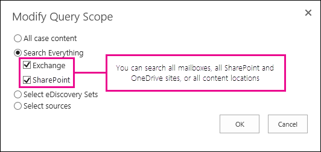

# Buscar en todos los buzones y sitios con el Centro de exhibición de documentos electrónicosSearch all mailboxes and sites using the eDiscovery Center

En el centro de exhibición de documentos electrónicos en Office 365, puede buscar todos los buzones de Exchange Online, sitios de SharePoint Online y OneDrive para sitios de negocio en una búsqueda de exhibición de documentos electrónicos único. Para buscar todos los orígenes de contenido en la organización, un administrador de exhibición de documentos electrónicos debe tener asignado los permisos de exhibición de documentos electrónicos adecuados para cada origen de contenido.In the eDiscovery Center in Office 365, you can search all Exchange Online mailboxes, SharePoint Online sites, and OneDrive for Business sites in a single eDiscovery search. To search all content sources in the organization, an eDiscovery manager must be assigned the appropriate eDiscovery permissions for each content source. 
  
## Antes de empezarBefore you begin

- Un administrador de exhibición de documentos electrónicos debe tener asignados los permisos adecuados para buscar en un origen de contenido. Para obtener más información sobre cómo asignar permisos de exhibición de documentos electrónicos a buzones y sitios, vea lo siguiente:An eDiscovery manager must be assigned the appropriate permissions to search a content source. For more information about assigning eDiscovery permissions to mailboxes and sites, see the following: 
    
  - [Asignar permisos de exhibición de documentos electrónicos en ExchangeAssign eDiscovery permissions in Exchange](https://go.microsoft.com/fwlink/p/?LinkId=526886)
    
  - [Asignar permisos de exhibición de documentos electrónicos en SharePoint OnlineAssign eDiscovery permissions in SharePoint Online](https://go.microsoft.com/fwlink/p/?LinkId=526885)
    
  - [Asignar permisos de eDiscovery a sitios de OneDrive para la EmpresaAssign eDiscovery permissions to OneDrive for Business sites](assign-permissions-to-onedrive-for-business-sites.md)
    
- Puede buscar un máximo de 10.000 buzones de correo y un número ilimitado de SharePoint Online y OneDrive para sitios de profesionales en una consulta de búsqueda de exhibición de documentos electrónicos único. Sin embargo, si especifica los sitios específicos que se va a buscar, el límite es de 100 sitios.You can search a maximum of 10,000 mailboxes and an unlimited number of SharePoint Online and OneDrive for Business sites in a single eDiscovery search query. However, if you specify the specific sites to search, the limit is 100 sites.
    
- Vea la sección [obtener más información](search-all-mailboxes-and-sites-with-ediscovery.md#moreinfo) para obtener una descripción de los límites al ver los resultados al buscar en todos los buzones de correo y sitios.See the [More information](search-all-mailboxes-and-sites-with-ediscovery.md#moreinfo) section for a description of the limits when viewing the results when searching all mailboxes and sites. 
    
- Para obtener más información acerca de cómo crear consultas de búsqueda en el centro de exhibición de documentos electrónicos, vea [crear y consultas de exhibición de documentos electrónicos ejecución](https://go.microsoft.com/fwlink/p/?LinkID=404032).For more information about creating search queries in the eDiscovery Center, see [Create and run eDiscovery queries](https://go.microsoft.com/fwlink/p/?LinkID=404032).
    
## Buscar en todas las ubicacionesSearch all locations

1. En el Centro de exhibición de documentos electrónicos, abra el caso de exhibición de documentos electrónicos para el que desea ejecutar la consulta de búsqueda.In the eDiscovery Center, open the eDiscovery case that you want to run the search query for.
    
2. En la **búsqueda y exportación**, haga clic en una consulta existente o haga clic en **nuevo elemento** para crear una nueva consulta de búsqueda.Under **Search and Export**, click an existing query or click **New item** to create a new search query. 
    
3. En la página de consulta de búsqueda, en la sección **Orígenes**, haga clic en **Modificar ámbito de consulta**.On the search query page, in the **Sources** section, click **Modify Query Scope**.
    
4. En la página **Modificar ámbito de consulta**, haga clic en **Buscar en todo** y seleccione las ubicaciones de contenido en las cuales buscar.On the **Modify Query Scope** page, click **Search everything**, and select the content locations to search.
    
  - Seleccione **Exchange** para buscar todos los buzones.Select **Exchange** to search all mailboxes. 
    
  - Seleccione **SharePoint** para buscar todos los SharePoint Online y OneDrive sitios profesionales.Select **SharePoint** to search all SharePoint Online and OneDrive for Business sites. 
    
  - Seleccione **Exchange** y **SharePoint** para buscar todas las ubicaciones de contenido en su organización.Select both **Exchange** and **SharePoint** to search all content locations in your organization. 
    

  
5. Haga clic en **Aceptar** para guardar los cambios.Click **OK** to save the changes. 
    
6. Complete o revise más información en la página de consulta de búsqueda, como la consulta de palabras clave, el intervalo de fechas o restringir los tipos específicos de contenido para buscar. Cuando esté listo para ejecutar la consulta, haga clic en **Buscar**.Complete or revise other information on the search query page, such as the keyword query, the date range, or narrowing the specific types of content to search for. When you're ready to run the query, click **Search**. 
    
## Más informaciónMore information

- Los 500 buzones principales y los 500 sitios principales con más resultados se muestran en **Orígenes** en la página **Consulta**.The top 500 mailboxes and the top 500 sites with the most results are listed under **Sources** on the **Query** page. 
    
- Se muestran el número total de elementos encontrados en todos los orígenes de contenido y su tamaño total combinado en **Orígenes** en la página **Consulta**. 
The total number of items found in all content sources and their combined total size are displayed under **Sources** on the **Query** page. 
    
- Puede obtener una vista previa de los 200 resultados de búsqueda más recientes ubicados en buzones de Exchange o sitios de SharePoint en la página **Consulta**.You can preview the 200 most recent search results located in Exchange mailboxes or SharePoint sites on the **Query** page. 
    
    La captura de pantalla siguiente muestra un ejemplo de los resultados de búsqueda que aparecen en la página **Consulta** cuando se busca en todos los sitios y buzones.The following screenshot shows an example of the search results displayed on the **Query** page when you search all mailboxes and sites. 
    
    
  

