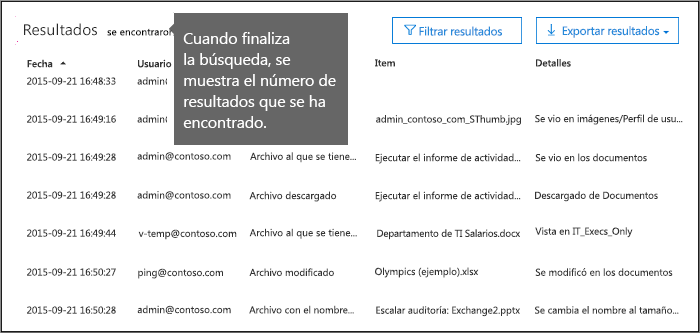
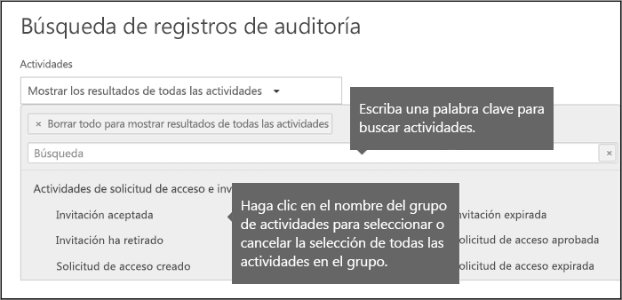
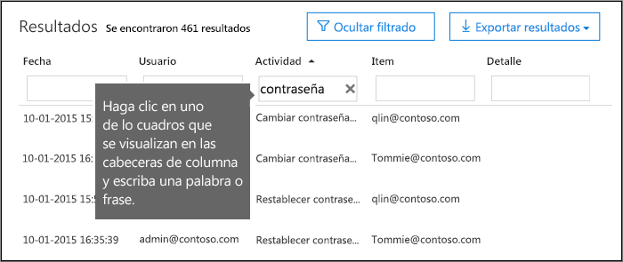
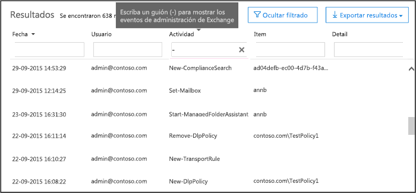

# <a name="search-the-audit-log-in-the-security--compliance-center"></a>Buscar el registro de auditoría en el centro de seguridad & cumplimiento

## <a name="introduction"></a>Introducción

¿Necesita saber si un usuario ha visto un documento específico o ha purgado un elemento de su buzón? Si es así, puede usar el centro de seguridad &amp; y cumplimiento de Office 365 para buscar en el registro de auditoría unificado para ver la actividad del usuario y del administrador de su organización de Office 365. ¿Por qué un registro de auditoría unificado? Porque puede buscar los siguientes tipos de actividad de usuario y de administrador en Office 365:
  
- Actividad de los usuarios en SharePoint Online y OneDrive para la empresa
    
- Actividad de los usuarios en Exchange Online (registro de auditoría de buzones de Exchange)
    
    > [!IMPORTANT]
    > El registro de auditoría de buzones debe estar activado para cada buzón de usuario antes de que se registre la actividad de usuario en Exchange Online. Para obtener más información, consulte [Habilitar la auditoría de buzones de correo en Office 365](enable-mailbox-auditing.md).
  
- Actividad de administración en SharePoint Online
    
- Actividad de administrador en Azure Active Directory (el servicio de directorio para Office 365)
    
- Actividad de administrador en Exchange Online (registro de auditoría de administración de Exchange)
    
- Actividad de usuario y administrador en Sway
    
- actividades de eDiscovery en el centro de seguridad y cumplimiento
    
- Actividad de usuario y administrador en Power BI
    
- Actividad de usuario y administrador en Microsoft Teams

- Actividad de usuario y administrador en Dynamics 365
    
- Actividad de usuario y administrador en Yammer
 
- Actividad de usuario y administrador en Microsoft Flow
    
- Actividad de usuario y administrador en Microsoft Stream

- Actividades de Analista y administración en Microsoft Workplace Analytics

- Actividad de usuario y administrador en Microsoft PowerApps
    
   
## <a name="before-you-begin"></a>Antes de empezar

Asegúrese de leer los siguientes elementos antes de comenzar a buscar en el registro de auditoría de Office 365.
  
- Usted (u otro administrador) deben activar primero el registro de auditoría antes de empezar a buscar en el registro de auditoría de Office 365. Para activarla, solo tiene que hacer clic en **iniciar grabación de la actividad de usuario y de administrador** en la página de búsqueda de registros de **Auditoría** en el centro de seguridad & cumplimiento. (Si no ve este vínculo, ya se ha activado la auditoría en su organización). Una vez activado, se muestra un mensaje que indica que se está preparando el registro de auditoría y que puede ejecutar una búsqueda en un par de horas tras la finalización de la preparación. Solo tiene que hacer esto una vez. 
    
    > [!NOTE]
    > Estamos en proceso de activar la auditoría de forma predeterminada. Hasta entonces, puede activarla como se ha descrito anteriormente. 
  
- Debe tener asignado el rol registros de auditoría con permiso de vista o registros de auditoría en Exchange Online para buscar en el registro de auditoría de 365 de Office. De forma predeterminada, estos roles se asignan a los grupos de roles administración de cumplimiento y administración de la organización en la página **permisos** del centro de administración de Exchange. Tenga en cuenta que los administradores globales de Office 365 y Microsoft 365 se agregan automáticamente como miembros del grupo de funciones de administración de la organización en Exchange Online. Para conceder a un usuario la capacidad de buscar el registro de auditoría de Office 365 con el nivel mínimo de privilegios, puede crear un grupo de roles personalizado en Exchange Online, agregar el rol registros de auditoría con permiso de vista o registros de auditoría y, a continuación, agregar el usuario como miembro del nuevo grupo de roles. Para obtener más información, vea [administrar grupos de roles en Exchange Online](https://go.microsoft.com/fwlink/p/?LinkID=730688).
    
    > [!IMPORTANT]
    > Si asigna a un usuario el rol registros de auditoría con permiso de vista o registros de auditoría en la página **permisos** del centro de seguridad & cumplimiento, estos no podrán buscar en el registro de auditoría de Office 365. Debe asignar los permisos en Exchange Online. Esto se debe a que el cmdlet subyacente usado para buscar en el registro de auditoría es un cmdlet de Exchange Online. 
  
- Cuando un usuario o administrador realiza una actividad auditada, se genera un registro de auditoría y se almacena en el registro de auditoría de Office 365 para la organización. El período de tiempo durante el que se conserva un registro de auditoría (y que se pueden buscar en el registro de auditoría) depende de la suscripción a Office 365 y, específicamente, del tipo de licencia asignado a un usuario específico.

     - **Office 365 E3** : los registros de auditoría se conservan durante 90 días. Esto significa que puede buscar en el registro de auditoría las actividades que se realizaron en los últimos 90 días.

     - **Office 365 E5** : los registros de auditoría también se conservan durante 90 días. La retención de registros de auditoría durante un año puede eventualmente estar disponible para los usuarios y usuarios de E5 con una licencia de E3 y una licencia de complemento de cumplimiento avanzado de Office 365.

        > [!NOTE]
        > El programa de vista previa privada para el período de retención de un año para los registros de auditoría para organizaciones de E5 (o para usuarios en organizaciones de E3 que tienen licencias de complemento de cumplimiento avanzadas) se cierra para la nueva inscripción. Este artículo se actualizará cuando el período de retención de un año esté disponible en la versión preliminar pública o se haya lanzado para la disponibilidad general.

- Si desea desactivar la búsqueda de registros de auditoría en Office 365 para su organización, puede ejecutar el siguiente comando en PowerShell remoto conectado a su organización de Exchange Online:
    
  ```
  Set-AdminAuditLogConfig -UnifiedAuditLogIngestionEnabled $false
  ```

    Para volver a activar la búsqueda de auditoría, puede ejecutar el siguiente comando en Exchange Online PowerShell:
    
  ```
  Set-AdminAuditLogConfig -UnifiedAuditLogIngestionEnabled $true
  ```

    Para obtener más información, vea [desactivar la búsqueda de registros de auditoría en Office 365](turn-audit-log-search-on-or-off.md).
    
- Como se mencionó anteriormente, el cmdlet subyacente usado para buscar en el registro de auditoría es un cmdlet de Exchange Online, que es **Search-UnifiedAuditLog**. Esto significa que puede usar este cmdlet para buscar en el registro de auditoría de Office 365 en lugar de usar la página de **búsqueda de registros de auditoría** en el centro de seguridad & cumplimiento. Debe ejecutar este cmdlet en PowerShell remoto conectado a su organización de Exchange Online. Para obtener más información, vea [Search-UnifiedAuditLog](https://go.microsoft.com/fwlink/p/?linkid=834776).
    
- Si desea descargar datos del registro de auditoría de Office 365 mediante programación, le recomendamos que use la API de actividad de administración de Office 365 en lugar de usar un script de PowerShell. La API de actividad de administración 365 de Office es un servicio Web REST que puede usar para desarrollar soluciones de operaciones, seguridad y supervisión de cumplimiento para su organización. Para obtener más información, vea referencia de la [API de actividad de administración 365 de Office](https://go.microsoft.com/fwlink/?linkid=852309).
    
- Puede tardar hasta 30 minutos o hasta 24 horas después de que se produzca un evento para que la entrada del registro de auditoría correspondiente se muestre en los resultados de la búsqueda. En la tabla siguiente se muestra el tiempo que tardan los distintos servicios en Office 365.
    
    |**Servicio de Office 365**|**30 minutos**|**24 horas**|
    |:-----|:-----|:-----|
    |Protección contra amenazas avanzada e inteligencia de amenazas  <br/> || |
    |Azure Active Directory (eventos de inicio de sesión de usuario)  <br/> ||           <br/> |
    |Azure Active Directory (eventos de administración)  <br/> || |
    |Prevención de pérdida de datos  <br/> |       <br/>| |
    |Dynamics 365 CRM <br/> |           <br/>| |
    |eDiscovery  <br/> |           <br/>| |
    |Exchange Online  <br/> |           <br/> ||
    |Microsoft Flow  <br/> |           <br/>| |
    |Microsoft Forms  <br/> |           <br/>| |
    |Microsoft Project  <br/> |           <br/>| |
    |Microsoft Stream  <br/> |           <br/>| |
    |Microsoft Teams  <br/> |           <br/> ||
    |Power BI  <br/> |           <br/>| |
    |Centro de seguridad y cumplimiento  <br/> |           <br/> ||
    |SharePoint Online y OneDrive para la Empresa  <br/> |           <br/> ||
    |Sway  <br/> ||           <br/> |
    |Workplace Analytics<br/> |           <br/> || 
    |Yammer  <br/> ||           <br/> |
   
- Azure Active Directory (Azure AD) es el servicio de directorio para Office 365. El registro de auditoría unificada contiene actividades de usuario, grupo, aplicación, dominio y directorio realizadas en el centro de administración de Microsoft 365 o en el portal de administración de Azure. Para obtener una lista completa de los eventos de Azure AD, consulte [eventos de informes de auditoría de Azure Active Directory](https://go.microsoft.com/fwlink/p/?LinkID=616549).
    
- Los registros de auditoría de Exchange Online constan de dos tipos de eventos: eventos de administración de Exchange (acciones realizadas por los administradores) y eventos de buzón de correo (acciones realizadas por los usuarios en los buzones de correo). Tenga en cuenta que la auditoría de buzones de correo no está habilitada de forma predeterminada. Debe estar habilitado para cada buzón de usuario antes de que los eventos de buzón se puedan buscar en el registro de auditoría de Office 365. Para obtener más información acerca de la auditoría de buzones y las acciones de auditoría de buzones que se registran, consulte [Habilitar la auditoría de buzones de correo en Office 365](enable-mailbox-auditing.md).
    
- El registro de auditoría para Power BI no está habilitado de forma predeterminada. Para buscar actividades de Power BI en el registro de auditoría de Office 365, tiene que habilitar la auditoría en el portal de administración de Power BI. Para obtener instrucciones, consulte la sección "registros de auditoría" en el [portal de administración de Power BI](https://docs.microsoft.com/power-bi/service-admin-portal#audit-logs).
    
    
## <a name="search-the-audit-log"></a>Búsquedas en el registro de auditoría

Este es el proceso para realizar búsquedas en el registro de auditoría en Office 365.
  
[Paso 1: ejecutar una búsqueda de registros de auditoría](#step-1-run-an-audit-log-search)
  
[Paso 2: ver los resultados de la búsqueda](#step-2-view-the-search-results)

[Paso 3: filtrar los resultados de la búsqueda](#step-3-filter-the-search-results)

[Paso 4: exportar los resultados de la búsqueda a un archivo](#step-4-export-the-search-results-to-a-file)
  
### <a name="step-1-run-an-audit-log-search"></a>Paso 1: ejecutar una búsqueda de registros de auditoría

1. Vaya a [https://protection.office.com](https://protection.office.com).
    
    > [!TIP]
    > Use una sesión de exploración privada (no una sesión regular) para acceder al centro de cumplimiento de seguridad &, ya que esto impedirá que las credenciales con las que haya iniciado sesión actualmente se usen. Para abrir una sesión de exploración InPrivate en Internet Explorer o Microsoft Edge, solo tiene que presionar CTRL + MAYÚS + P. Para abrir una sesión de exploración privada en Google Chrome (denominada ventana incógnito), presione CTRL + MAYÚS + N. 
  
2. Inicie sesión en Office 365 con su cuenta profesional o educativa.
    
3. En el panel izquierdo del centro de seguridad & cumplimiento, haga clic en **Buscar**y, a continuación, en **búsqueda de registros de auditoría**.
    
    Se muestra la página de **búsqueda de registros de auditoría** . 
    
    
  
    > [!NOTE]
    > Primero tiene que activar el registro de auditoría para poder ejecutar una búsqueda de registros de auditoría. Si aparece el vínculo **iniciar grabación de usuario y actividad de administrador** , haga clic en él para activar la auditoría. Si no ve este vínculo, ya se ha activado la auditoría para su organización. 
  
4. Configure los siguientes criterios de búsqueda:
    
    a. **Actividades** Haga clic en la lista desplegable para mostrar las actividades que puede buscar. Las actividades de usuario y de administrador se organizan en grupos de actividades relacionadas. Puede seleccionar actividades específicas o puede hacer clic en el nombre del grupo de actividades para seleccionar todas las actividades del grupo. También puede hacer clic en una actividad seleccionada para anular la selección. Después de ejecutar la búsqueda, solo se muestran las entradas del registro de auditoría para las actividades seleccionadas. Al seleccionar **Mostrar resultados para todas las actividades** , se mostrarán los resultados de todas las actividades realizadas por el usuario o grupo de usuarios seleccionado. 
    
    Se registran más de 100 actividades de usuario y de administrador en el registro de auditoría de Office 365. Haga clic en la ficha **actividades auditadas** en el tema de este artículo para ver las descripciones de cada actividad en cada uno de los diferentes servicios de Office 365. 
    
    b. Fecha de **Inicio** y **fecha** de finalización los últimos siete días están seleccionados de forma predeterminada. Seleccione un intervalo de fecha y hora para mostrar los eventos que se produjeron dentro de ese período. La fecha y la hora se presentan en formato de hora universal coordinada (UTC). El intervalo de fechas máximo que puede especificar es de 90 días. Se muestra un error si el intervalo de fechas seleccionado es superior a 90 días. 
    
    > [!TIP]
    > Si está usando el intervalo de fechas máximo de 90 días, seleccione la hora actual para la **fecha de inicio**. De lo contrario, recibirá un error que indica que la fecha de inicio es anterior a la fecha de finalización. Si ha activado la auditoría en los últimos 90 días, el intervalo de fechas máximo no puede comenzar antes de la fecha en que se activó la auditoría. 
  
    c. **Usuarios** de Haga clic en este cuadro y, a continuación, seleccione uno o más usuarios para los que mostrar los resultados de la búsqueda. Las entradas del registro de auditoría para la actividad seleccionada realizada por los usuarios que seleccione en este cuadro se muestran en la lista de resultados. Deje este cuadro en blanco para devolver las entradas de todos los usuarios (y las cuentas de servicio) de su organización. 
    
    d. **Archivo, carpeta o sitio** Escriba todo o parte del nombre de un archivo o una carpeta para buscar actividades relacionadas con el archivo de la carpeta que contiene la palabra clave especificada. También puede especificar una dirección URL de un archivo o una carpeta. Si usa una dirección URL, asegúrese de escribir la ruta de acceso completa de la dirección URL o, si solo escribe una parte de la dirección URL, no incluya ningún carácter o espacio especial. 
    
    Deje este cuadro en blanco para devolver las entradas de todos los archivos y carpetas de la organización.
    
    > [!TIP]
    > Si está buscando todas las actividades relacionadas con un **sitio**, agregue el símbolo comodín (\*) después de la dirección URL para devolver todas las entradas de ese sitio; por ejemplo, **"https://contoso-my.sharepoint.com/personal/*"**.
    
5. Haga clic en **Buscar** para ejecutar la búsqueda con los criterios de búsqueda. 
    
    Los resultados de la búsqueda se cargan y, después de unos segundos, se muestran en **resultados**. Una vez finalizada la búsqueda, se muestra el número de resultados encontrados. Tenga en cuenta que se mostrará un máximo de 5.000 eventos en el panel de **resultados** en incrementos de 150 eventos; Si más de 5.000 eventos cumplen los criterios de búsqueda, se muestran los últimos 5.000 eventos. 
    
    
  
  
#### <a name="tips-for-searching-the-audit-log"></a>Sugerencias para buscar en el registro de auditoría

- Puede seleccionar actividades específicas para buscar haciendo clic en el nombre de la actividad. O bien, puede buscar todas las actividades de un grupo (como **actividades de archivos y carpetas**) haciendo clic en el nombre del grupo. Si hay una actividad seleccionada, puede hacer clic en ella para cancelar la selección. También puede usar el cuadro de búsqueda para mostrar las actividades que contienen la palabra clave que escribió.
    
    
  
- Debe seleccionar **Mostrar resultados para todas las actividades** en la lista **actividades** para mostrar los eventos del registro de auditoría de administración de Exchange. Los eventos de este registro de auditoría muestran un nombre de cmdlet (por ejemplo, **set-Mailbox** ) en la columna **actividad** de los resultados. Para obtener más información, haga clic en la ficha **actividades auditadas** en este tema y, a continuación, haga clic en **actividades de administración de Exchange**.
    
    De forma similar, hay algunas actividades de auditoría que no tienen un elemento correspondiente en la lista **actividades** . Si conoce el nombre de la operación para estas actividades, puede buscar todas las actividades y, a continuación, filtrar los resultados escribiendo el nombre de la operación en el cuadro de la columna **actividad** . Consulte [paso 3: filtrar los resultados de búsqueda](#step-3-filter-the-search-results) para obtener más información sobre cómo filtrar los resultados. 
    
- Haga clic en **Borrar** para borrar los criterios de búsqueda actuales. El intervalo de fechas vuelve al valor predeterminado de los últimos siete días. También puede hacer clic en **Borrar todo para mostrar los resultados de todas las actividades** para cancelar todas las actividades seleccionadas. 
    
- Si se encuentran 5.000 resultados, probablemente puede dar por hecho que hay más de 5.000 eventos que cumplen los criterios de búsqueda. Puede refinar los criterios de búsqueda y volver a ejecutar la búsqueda para devolver menos resultados, o bien puede exportar todos los resultados de la búsqueda seleccionando **exportar resultados** \> **descargar todos**los resultados.

  
### <a name="step-2-view-the-search-results"></a>Paso 2: ver los resultados de la búsqueda

Los resultados de una búsqueda de registro de auditoría se muestran en **resultados** en la página de **búsqueda de registros de auditoría** . Como se indicó anteriormente, se muestra un máximo de 5.000 (más reciente) en incrementos de 150 eventos. Para mostrar más eventos, puede usar la barra de desplazamiento en el panel **resultados** o puede presionar **MAYÚS + fin** para mostrar los siguientes 150 eventos. 
  
Los resultados contienen la siguiente información sobre cada evento devuelto por la búsqueda.
  
- **Fecha:** La fecha y la hora (en formato UTC) cuando se produjo el evento. 
    
- **Dirección IP:** La dirección IP del dispositivo que se usó cuando se registró la actividad. La dirección IP se muestra en el formato de dirección IPv4 o IPv6. 
    
- **Usuario:** El usuario (o cuenta de servicio) que llevó a cabo la acción que desencadenó el evento. 
    
- **Actividad:** La actividad realizada por el usuario. Este valor corresponde a las actividades que ha seleccionado en la lista desplegable de **actividades** . Para un evento del registro de auditoría de administración de Exchange, el valor de esta columna es un cmdlet de Exchange. 
    
- **Elemento:** Objeto que se ha creado o modificado como resultado de la actividad correspondiente. Por ejemplo, el archivo que se vio o modificó, o la cuenta de usuario que se actualizó. No todas las actividades tienen un valor en esta columna. 
    
- **Detalles:** Detalles adicionales sobre una actividad. De nuevo, no todas las actividades tendrán un valor. 
    
> [!TIP]
> Haga clic en el encabezado de una columna en **resultados** para ordenar los resultados. Puede ordenar los resultados de a a Z o de Z a a. Haga clic en el encabezado de **fecha** para ordenar los resultados de más antiguo a más reciente o de más reciente a más antiguo. 
  
#### <a name="view-the-details-for-a-specific-event"></a>Ver los detalles de un evento específico

Puede ver más detalles sobre un evento haciendo clic en el registro del evento en la lista de resultados de búsqueda. Se muestra una página de **detalles** que contiene las propiedades detalladas del registro de eventos. Las propiedades que se muestran dependen del servicio de Office 365 en el que se produce el evento. Para mostrar estos detalles, haga clic en **más información**. Para obtener descripciones, consulte [propiedades detalladas en el registro de auditoría de Office 365](detailed-properties-in-the-office-365-audit-log.md).
  


  
### <a name="step-3-filter-the-search-results"></a>Paso 3: filtrar los resultados de la búsqueda

Además de la ordenación, también puede filtrar los resultados de una búsqueda de registros de auditoría. Esta es una gran característica que puede ayudarle a filtrar rápidamente los resultados de un usuario o actividad específicos. Puede crear inicialmente una búsqueda ancha y, a continuación, filtrar rápidamente los resultados para ver eventos específicos. A continuación, puede restringir los criterios de búsqueda y volver a ejecutar la búsqueda para devolver un conjunto de resultados más pequeño y conciso.
  
Para filtrar los resultados:
  
1. Ejecutar una búsqueda de registros de auditoría.
    
2. Cuando se muestren los resultados, haga clic en **filtrar resultados**.
    
    Los cuadros de palabras clave se muestran debajo de cada encabezado de columna.
    
3. Haga clic en uno de los cuadros debajo de un encabezado de columna y escriba una palabra o frase en función de la columna en la que esté filtrando. Los resultados se volverán a ajustar dinámicamente para mostrar los eventos que coinciden con el filtro.
    
    
  
4. Para borrar un filtro, haga clic en la **X** en el cuadro filtro o simplemente haga clic en **ocultar filtrado**.
    
> [!TIP]
> Para mostrar los eventos del registro de auditoría de administración de Exchange **-** , escriba a (guión) en el cuadro filtro de **actividad** . Se mostrarán los nombres de los cmdlets, que se muestran en la columna **actividad** para los eventos de administración de Exchange. A continuación, puede ordenar los nombres de los cmdlets en orden alfabético. 

### <a name="step-4-export-the-search-results-to-a-file"></a>Paso 4: exportar los resultados de la búsqueda a un archivo

Puede exportar los resultados de una búsqueda de registro de auditoría a un archivo de valores separados por comas (CSV) en el equipo local. Puede abrir este archivo en Microsoft Excel y usar características como buscar, ordenar, filtrar y dividir una sola columna (que contiene celdas de varios valores) en varias columnas.
  
1. Ejecute una búsqueda de registro de auditoría y, a continuación, revise los criterios de búsqueda hasta que tenga los resultados deseados.
    
2. Haga clic en **exportar resultados** y seleccione una de las siguientes opciones: 
    
  - **Guardar los resultados cargados** Elija esta opción para exportar sólo las entradas que se muestran en **resultados** en la página búsqueda de registros de auditoría * *. El archivo CSV que se descarga contiene las mismas columnas (y datos) que se muestran en la página (fecha, usuario, actividad, elemento y detalles). Una columna adicional (con el nombre **más**) se incluye en el archivo CSV que contiene más información de la entrada del registro de auditoría. Como está exportando los mismos resultados que se cargan (y visibles) en la página de **búsqueda de registros de auditoría** , se exporta un máximo de 5.000 entradas. 
    
  - **Descargar todos los resultados** Elija esta opción para exportar todas las entradas del registro de auditoría de Office 365 que cumplan los criterios de búsqueda. Para un conjunto grande de resultados de búsqueda, elija esta opción para descargar todas las entradas del registro de auditoría además de los resultados de 5.000 que se pueden mostrar en la página de **búsqueda de registros de auditoría** . Con esta opción se descargan los datos sin procesar del registro de auditoría en un archivo CSV y se incluye información adicional de la entrada del registro de auditoría en una columna denominada **AuditData**. La descarga del archivo puede tardar más tiempo si elige esta opción de exportación, ya que es posible que el archivo sea mucho mayor que el que se ha descargado si elige la otra opción.
    
    > [!IMPORTANT]
    > Puede descargar un máximo de 50.000 entradas en un archivo CSV desde una sola búsqueda de registro de auditoría. Si se descargan 50.000 entradas en el archivo CSV, probablemente se da por hecho que hay más de 50.000 eventos que cumplen los criterios de búsqueda. Para exportar más de este límite, pruebe a usar un intervalo de fechas para reducir el número de entradas del registro de auditoría. Es posible que deba ejecutar varias búsquedas con intervalos de fecha más pequeños para exportar más de 50.000 entradas. 
  
3. Después de seleccionar una opción de exportación, se muestra un mensaje en la parte inferior de la ventana en el que se le pregunta si desea abrir el archivo CSV, guardarlo en la carpeta descargas o guardarlo en una carpeta específica.

  
#### <a name="more-information-about-exporting-audit-log-search-results"></a>Más información sobre cómo exportar resultados de la búsqueda de registros de auditoría

- La opción **descargar todos los resultados** descarga los datos sin procesar del registro de auditoría de Office 365 en un archivo CSV. Este archivo contiene distintos nombres de columna (CreationDate, UserId, Operation, AuditData) que el archivo que se descarga si selecciona la opción **Guardar resultados cargados** . Los valores de los dos archivos. CSV diferentes para la misma actividad también pueden ser diferentes. Por ejemplo, la actividad en la columna **acción** del archivo CSV y puede tener un valor distinto de la versión "fácil de utilizar" que se muestra en la columna **actividad** de la página de **búsqueda del registro de auditoría** ; por ejemplo, MailboxLogin frente a usuario que ha iniciado sesión en el buzón.
    
- Si descarga todos los resultados, el archivo CSV contiene una columna denominada **AuditData**, que contiene información adicional sobre cada evento. Como se mencionó anteriormente, esta columna contiene una propiedad de varios valores para varias propiedades del registro de auditoría. Cada uno de los pares **propiedad: valor** de esta propiedad de varios valores se separan con una coma. Puede usar la consulta Power en Excel para dividir esta columna en varias columnas para que cada propiedad tenga su propia columna. Esto le permitirá ordenar y filtrar por una o varias de estas propiedades. Para obtener información sobre cómo hacerlo, vea la sección "dividir una columna por delimitador" en [dividir una columna de texto (Power Query)](https://support.office.com/article/5282d425-6dd0-46ca-95bf-8e0da9539662).
    
    Después de dividir la columna **AuditData** , puede filtrar en la columna **operaciones** para mostrar las propiedades detalladas de un tipo de actividad específico. 
    
- Hay un límite de 3.060 caracteres para los datos que se muestran en el campo **AuditData** para un registro de auditoría. Si se supera el límite de 3.060 caracteres, los datos de este campo se truncan. 
    
- Cuando se descargan todos los resultados de una consulta de búsqueda que contiene eventos de diferentes servicios de Office 365, la columna **AuditData** del archivo CSV contiene distintas propiedades en función del servicio en el que se realizó la acción. Por ejemplo, las entradas de los registros de auditoría de Exchange y Azure AD incluyen una propiedad denominada **ResultStatus** que indica si la acción se realizó correctamente o no. Esta propiedad no se incluye para los eventos de SharePoint. De forma similar, los eventos de SharePoint tienen una propiedad que identifica la dirección URL del sitio para actividades relacionadas con archivos y carpetas. Para mitigar este comportamiento, considere la posibilidad de usar diferentes búsquedas para exportar los resultados de las actividades de un solo servicio. 
    
    Para obtener una descripción de las propiedades que se enumeran en la columna **AuditData** del archivo CSV al descargar todos los resultados y el servicio al que se aplica cada uno, consulte [propiedades detalladas en el registro de auditoría de Office 365](detailed-properties-in-the-office-365-audit-log.md).

## <a name="audited-activities"></a>Actividades auditadas

En las tablas de esta sección se describen las actividades que se auditan en Office 365. Puede buscar estos eventos buscando en el registro de auditoría del centro de seguridad y cumplimiento.
  
Estas tablas agrupan actividades relacionadas o las actividades de un servicio de Office 365 específico. Las tablas incluyen el nombre descriptivo que se muestra en la lista desplegable **actividades** y el nombre de la operación correspondiente que aparece en la información detallada de un registro de auditoría y del archivo CSV cuando se exportan los resultados de la búsqueda. Para obtener descripciones de la información detallada, consulte [propiedades detalladas en el registro de auditoría de Office 365](detailed-properties-in-the-office-365-audit-log.md).
  
Haga clic en uno de los siguientes vínculos para ir a una tabla específica.
  
||||
|:-----|:-----|:-----|
|[Actividades de archivo y página](#file-and-page-activities)<br/> |[Actividades de carpeta](#folder-activities)<br/> |[Actividades de solicitud de acceso y uso compartido](#sharing-and-access-request-activities)<br/> |
|[Actividades de sincronización](#synchronization-activities)<br/> |[Actividades de administración del sitio](#site-administration-activities)<br/> |[Actividades de buzón de Exchange](#exchange-mailbox-activities)<br/> |
|[Actividades de Sway](#sway-activities) <br/> |[Actividades de administración de usuarios](#user-administration-activities) <br/> |[Actividades de administración de grupos de Azure AD](#azure-ad-group-administration-activities) <br/> 
|[Actividades de administración de aplicaciones](#application-administration-activities) <br/> |[Actividades de administración de roles](#role-administration-activities) <br/> |[Actividades de administración de directorios](#directory-administration-activities) <br/>| 
|[actividades de eDiscovery](#ediscovery-activities) <br/> |[Actividades de Power BI](#power-bi-activities) <br/> |[Microsoft Workplace Analytics](#microsoft-workplace-analytics-activities)<br/>|
|[Actividades de Microsoft Teams](#microsoft-teams-activities) <br/> |[Actividades de Yammer](#yammer-activities) <br/> |[Actividades de Microsoft Flow](#microsoft-flow-activities) <br/>|
|[Actividades de Microsoft PowerApps](#microsoft-powerapps)<br/>|[Actividades de Microsoft Stream](#microsoft-stream-activities) <br/>|[Actividades de administración de Exchange](#exchange-admin-audit-log)<br/>|
||||
   
  
### <a name="file-and-page-activities"></a>Actividades de archivo y página
  
En la tabla siguiente se describen las actividades de archivo y página en SharePoint Online y OneDrive para la empresa.
  
|**Nombre descriptivo**|**Operation**|**Descripción**|
|:-----|:-----|:-----|
|Archivo de acceso  <br/> |FileAccessed  <br/> |La cuenta del sistema o el usuario obtiene acceso a un archivo.  <br/> |
|(ninguno)  <br/> |FileAccessedExtended  <br/> |Esto está relacionado con la actividad "archivo de acceso (FileAccessed)". Se registra un evento FileAccessedExtended cuando la misma persona obtiene acceso continuamente a un archivo durante un período de tiempo prolongado (hasta 3 horas). La finalidad del registro de eventos FileAccessedExtended es reducir el número de eventos FileAccessed que se registran cuando se obtiene acceso a un archivo de forma continua. Esto ayuda a reducir el ruido de varios registros de FileAccessed para lo que es esencialmente la misma actividad de usuario y le permite centrarse en el evento FileAccessed inicial (y más importante).  <br/> |
|Archivo protegido  <br/> |FileCheckedIn  <br/> |El usuario protege un documento que ha desprotegido de una biblioteca de documentos.  <br/> |
|Archivo desprotegido  <br/> |FileCheckedOut  <br/> |El usuario desprotege un documento ubicado en una biblioteca de documentos. Los usuarios pueden extraer del repositorio y modificar documentos que se han compartido con ellos.  <br/> |
|Archivo copiado  <br/> |FileCopied  <br/> |El usuario copia un documento de un sitio. El archivo copiado puede guardarse en otra carpeta del sitio.  <br/> |
|Archivo eliminado  <br/> |FileDeleted  <br/> |El usuario elimina un documento de un sitio.  <br/> |
|Archivo eliminado de la papelera de reciclaje  <br/> |FileDeletedFirstStageRecycleBin  <br/> |El usuario elimina un archivo de la papelera de reciclaje de un sitio.  <br/> |
|Archivo eliminado de la papelera de reciclaje de la segunda etapa  <br/> |FileDeletedSecondStageRecycleBin  <br/> |El usuario elimina un archivo de la papelera de reciclaje de segundo nivel de un sitio.  <br/> |
|Malware detectado en el archivo  <br/> |FileMalwareDetected  <br/> |El motor antivirus de SharePoint detecta malware en un archivo.  <br/> |
|Desprotección de archivo descartado  <br/> |FileCheckOutDiscarded  <br/> |El usuario descarta (o deshace) un archivo desprotegido. Eso significa que cualquier cambio que haya realizado en el archivo cuando estaba desprotegido se descarta y no se guarda en la versión del documento en la biblioteca de documentos.  <br/> |
|Archivo descargado  <br/> |FileDownloaded  <br/> |El usuario descarga un documento de un sitio.  <br/> |
|Archivo modificado  <br/> |FileModified  <br/> |La cuenta de usuario o del sistema modifica el contenido o las propiedades de un documento ubicado en un sitio.  <br/> |
|(ninguno)  <br/> |FileModifiedExtended  <br/> |Esto está relacionado con la actividad "archivo modificado" (FileModified). Se registra un evento FileModifiedExtended cuando la misma persona modifica continuamente un archivo durante un período de tiempo prolongado (hasta 3 horas). La finalidad de registrar eventos FileModifiedExtended es reducir el número de eventos FileModified que se registran cuando se modifica un archivo de forma continua. Esto ayuda a reducir el ruido de varios registros de FileModified para lo que es esencialmente la misma actividad de usuario y le permite centrarse en el evento FileModified inicial (y más importante).  <br/> |
|Archivo movido  <br/> |FileMoved  <br/> |El usuario mueve un documento de su ubicación actual en un sitio a una nueva ubicación.  <br/> |
|Se reciclaron todas las versiones secundarias del archivo  <br/> |FileVersionsAllMinorsRecycled  <br/> |El usuario elimina todas las versiones secundarias del historial de versiones de un archivo. Las versiones eliminadas se mueven a la papelera de reciclaje del sitio.  <br/> |
|Todas las versiones del archivo se reciclaron  <br/> |FileVersionsAllRecycled  <br/> |El usuario elimina todas las versiones del historial de versiones de un archivo. Las versiones eliminadas se mueven a la papelera de reciclaje del sitio.  <br/> |
|Versión reciclada del archivo  <br/> |FileVersionRecycled  <br/> |El usuario elimina una versión del historial de versiones de un archivo. La versión eliminada se mueve a la papelera de reciclaje del sitio.  <br/> |
|Archivo con nombre cambiado  <br/> |FileRenamed  <br/> |El usuario cambia el nombre de un documento en un sitio.  <br/> |
|Archivo restaurado  <br/> |FileRestored  <br/> |El usuario restaura un documento desde la papelera de reciclaje de un sitio.  <br/> |
|Archivo cargado  <br/> |FileUploaded  <br/> |El usuario carga un documento en una carpeta de un sitio.  <br/> |
|Página vista  <br/> |PageViewed  <br/> |El usuario ve una página en un sitio. Esto no incluye el uso de un explorador Web para ver los archivos que se encuentran en una biblioteca de documentos.  <br/> |
|(ninguno)  <br/> |PageViewedExtended  <br/> |Esto está relacionado con la actividad de "página vista" (PageViewed). Se registra un evento PageViewedExtended cuando la misma persona ve continuamente una página web durante un período de tiempo prolongado (hasta 3 horas). La finalidad del registro de eventos PageViewedExtended es reducir el número de eventos PageViewed que se registran cuando se ve una página continuamente. Esto ayuda a reducir el ruido de varios registros de PageViewed para lo que es esencialmente la misma actividad de usuario y le permite centrarse en el evento PageViewed inicial (y más importante).  <br/> |
||||
  
### <a name="folder-activities"></a>Actividades de carpeta
  
En la siguiente tabla se describen las actividades de la carpeta en SharePoint Online y OneDrive para la empresa.
  
|**Nombre descriptivo**|**Operation**|**Descripción**|
|:-----|:-----|:-----|
|Carpeta copiada  <br/> |FolderCopied  <br/> |El usuario copia una carpeta de un sitio a otra ubicación en SharePoint o en OneDrive para la empresa.  <br/> |
|Carpeta creada  <br/> |FolderCreated  <br/> |El usuario crea una carpeta en un sitio.  <br/> |
|Carpeta eliminada  <br/> |FolderDeleted  <br/> |El usuario elimina una carpeta de un sitio.  <br/> |
|Carpeta eliminada de la papelera de reciclaje  <br/> |FolderDeletedFirstStageRecycleBin  <br/> |El usuario elimina una carpeta de la papelera de reciclaje de un sitio.  <br/> |
|Carpeta eliminada de la papelera de reciclaje de la segunda etapa  <br/> |FolderDeletedSecondStageRecycleBin  <br/> |El usuario elimina una carpeta de la papelera de reciclaje de segundo nivel de un sitio.  <br/> |
|Carpeta modificada  <br/> |FolderModified  <br/> |El usuario modifica una carpeta de un sitio. Esto incluye cambiar los metadatos de la carpeta, como cambiar etiquetas y propiedades.  <br/> |
|Carpeta movida  <br/> |FolderMoved  <br/> |El usuario mueve una carpeta a una ubicación diferente en un sitio.  <br/> |
|Carpeta con nombre cambiado  <br/> |FolderRenamed  <br/> |El usuario cambia el nombre de una carpeta de un sitio.  <br/> |
|Carpeta restaurada  <br/> |FolderRestored  <br/> |El usuario restaura una carpeta eliminada de la papelera de reciclaje de un sitio.  <br/> |
||||
  
### <a name="sharing-and-access-request-activities"></a>Actividades de solicitud de acceso y uso compartido
  
En la tabla siguiente se describen las actividades de uso compartido de usuarios y solicitud de acceso en SharePoint Online y OneDrive para la empresa. En el caso de los eventos de uso compartido, la columna de **detalle** en **resultados** identifica el nombre del usuario o grupo con el que se compartió el elemento y si dicho usuario o grupo es un miembro o invitado de la organización. Para obtener más información, vea [usar la auditoría de uso compartido en el registro de auditoría de Office 365](use-sharing-auditing.md).
  
> [!NOTE]
> Los usuarios pueden ser *miembros* o *invitados* en función de la propiedad UserType del objeto de usuario. Un miembro suele ser un empleado y, normalmente, un invitado es un colaborador externo a su organización. Cuando un usuario acepta una invitación para uso compartido (y aún no forma parte de la organización), se crea una cuenta de invitado para ellas en el directorio de la organización. Una vez que el usuario Guest tenga una cuenta en el directorio, es posible que los recursos se compartan directamente con ellos (sin necesidad de una invitación). 
  
|**Nombre descriptivo**|**Operation**|**Descripción**|
|:-----|:-----|:-----|
|Solicitud de acceso aceptada  <br/> |AccessRequestAccepted  <br/> |Se aceptó una solicitud de acceso a un sitio, una carpeta o un documento y se concedió acceso al usuario que lo solicita.  <br/> |
|Invitación para uso compartido aceptada  <br/> |SharingInvitationAccepted  <br/> |El usuario (miembro o invitado) ha aceptado una invitación para uso compartido y se le ha concedido acceso a un recurso. Este evento incluye información acerca del usuario al que se invitó y la dirección de correo electrónico que se usó para aceptar la invitación (podrían ser diferentes). Esta actividad suele ir acompañada de un segundo evento que describe cómo se ha concedido acceso al usuario al recurso, por ejemplo, agregar el usuario a un grupo que tiene acceso al recurso.  <br/> |
|Nivel de permisos agregado a la colección de sitios  <br/> |PermissionLevelAdded  <br/> |Se ha agregado un nivel de permisos a una colección de sitios.  <br/> |
|Usuario agregado a vínculo seguro  <br/> |AddedToSecureLink  <br/> |Se agregó un usuario a la lista de entidades que pueden usar este vínculo de uso compartido seguro.  <br/> |
|Invitación de uso compartido bloqueada  <br/> |SharingInvitationBlocked  <br/> | Una invitación de uso compartido enviada por un usuario en la organización está bloqueada debido a una directiva de uso compartido externo que permite o deniega el uso compartido externo en función del dominio del usuario de destino. En este caso, se bloqueó la invitación para uso compartido porque:  <br/>  El dominio del usuario de destino no está incluido en la lista de dominios permitidos.  <br/>  O bien  <br/>  El dominio del usuario de destino se incluye en la lista de dominios bloqueados.  <br/>  Para obtener más información sobre cómo permitir o bloquear el uso compartido externo en función de los dominios, consulte [dominios restringidos compartidos en SharePoint Online y OneDrive para la empresa](https://support.office.com/article/5d7589cd-0997-4a00-a2ba-2320ec49c4e9).  <br/> |
|Herencia de nivel de permisos roto  <br/> |PermissionLevelsInheritanceBroken  <br/> |Un elemento se cambió para que ya no herede los niveles de permisos de su elemento primario.  <br/> |
|Herencia de uso compartido roto  <br/> |SharingInheritanceBroken  <br/> |Un elemento se cambió para que ya no herede los permisos de uso compartido de su elemento primario.  <br/> |
|Vínculo creado a partir de la compañía  <br/> |CompanyLinkCreated  <br/> |El usuario ha creado un vínculo a toda la empresa para un recurso. los vínculos de toda la empresa solo los pueden usar los miembros de la organización. Los invitados no pueden usarlos.  <br/> |
|Solicitud de acceso creada  <br/> |AccessRequestCreated  <br/> |El usuario solicita acceso a un sitio, una carpeta o un documento para los que no tiene permisos de acceso.  <br/> |
|Vínculo anónimo creado  <br/> |AnonymousLinkCreated  <br/> |El usuario ha creado un vínculo anónimo a un recurso. Cualquier usuario con este vínculo puede tener acceso al recurso sin tener que autenticarse.  <br/> |
|Vínculo seguro creado  <br/> |SecureLinkCreated  <br/> |Se ha creado un vínculo de uso compartido seguro para este elemento.  <br/> |
|Invitación para uso compartido creada  <br/> |SharingInvitationCreated  <br/> |El usuario ha compartido un recurso en SharePoint Online o OneDrive para la empresa con un usuario que no se encuentra en el directorio de su organización.  <br/> |
|Vínculo seguro eliminado  <br/> |SecureLinkDeleted  <br/> |Se ha eliminado un vínculo de uso compartido seguro.  <br/> |
|Solicitud de acceso denegado  <br/> |AccessRequestDenied  <br/> |Se ha denegado una solicitud de acceso a un sitio, una carpeta o un documento.  <br/> |
|Nivel de permisos modificado en la colección de sitios  <br/> |PermissionLevelModified  <br/> |Se cambió un nivel de permisos en una colección de sitios.  <br/> |
|Vínculo eliminado de empresa que se comparte  <br/> |CompanyLinkRemoved  <br/> |El usuario quitó un vínculo a un recurso en toda la empresa. El vínculo ya no se puede usar para obtener acceso al recurso.  <br/> |
|Vínculo anónimo quitado  <br/> |AnonymousLinkRemoved  <br/> |El usuario quitó un vínculo anónimo a un recurso. El vínculo ya no se puede usar para obtener acceso al recurso.  <br/> |
|Nivel de permisos quitado de la colección de sitios  <br/> |PermissionLevelRemoved  <br/> |Se ha quitado un nivel de permisos de una colección de sitios.  <br/> |
|Herencia de uso compartido restaurada  <br/> |SharingInheritanceReset  <br/> |Se realizó un cambio para que un elemento herede los permisos de uso compartido de su elemento primario.  <br/> |
|Archivo, carpeta o sitio compartidos  <br/> |SharingSet  <br/> |El usuario (miembro o invitado) ha compartido un archivo, una carpeta o un sitio en SharePoint o OneDrive para la empresa con un usuario en el directorio de la organización. El valor de la columna de **detalle** de esta actividad identifica el nombre del usuario con el que se compartió el recurso y si este usuario es un miembro o invitado. Esta actividad suele ir acompañada de un segundo evento que describe cómo se ha concedido acceso al usuario al recurso; por ejemplo, agregar el usuario a un grupo que tenga acceso al recurso.  <br/> |
|Solicitud de acceso actualizada  <br/> |AccessRequestUpdated  <br/> |Se actualizó una solicitud de acceso a un elemento.  <br/> |
|Vínculo anónimo actualizado  <br/> |AnonymousLinkUpdated  <br/> |El usuario actualizó un vínculo anónimo a un recurso. El campo actualizado se incluye en la propiedad EventData cuando se exportan los resultados de búsqueda.  <br/> |
|Invitación para uso compartido actualizada  <br/> |SharingInvitationUpdated  <br/> |Se actualizó una invitación externa para uso compartido.  <br/> |
|Se usó un vínculo anónimo  <br/> |AnonymousLinkUsed  <br/> |Un usuario anónimo tuvo acceso a un recurso mediante un vínculo anónimo. La identidad del usuario podría ser desconocida, pero puede obtener otros detalles como la dirección IP del usuario.  <br/> |
|Archivo, carpeta o sitio no compartido  <br/> |SharingRevoked  <br/> |El usuario (miembro o invitado) no ha compartido un archivo, una carpeta o un sitio que se haya compartido anteriormente con otro usuario.  <br/> |
|Se usó un vínculo de empresa que se comparte  <br/> |CompanyLinkUsed  <br/> |El usuario obtuvo acceso a un recurso mediante un vínculo a toda la empresa.  <br/> |
|Vínculo seguro usado  <br/> |SecureLinkUsed  <br/> |Un usuario usó un vínculo seguro.  <br/> |
|Usuario agregado a vínculo seguro  <br/> |AddedToSecureLink  <br/> |Se agregó un usuario a la lista de entidades que pueden usar un vínculo de uso compartido seguro.  <br/> |
|Usuario quitado de vínculo seguro  <br/> |RemovedFromSecureLink  <br/> |Se ha quitado un usuario de la lista de entidades que pueden usar un vínculo de uso compartido seguro.  <br/> |
|Invitación para uso compartido de Withdrew  <br/> |SharingInvitationRevoked  <br/> |User withdrew una invitación para compartir a un recurso.  <br/> |
||||
  
### <a name="synchronization-activities"></a>Actividades de sincronización
  
En la siguiente tabla se enumeran las actividades de sincronización de archivos en SharePoint Online y OneDrive para la empresa.
  
|**Nombre descriptivo**|**Operation**|**Descripción**|
|:-----|:-----|:-----|
|Equipo permitido para sincronizar archivos  <br/> |ManagedSyncClientAllowed  <br/> |El usuario establece una relación de sincronización con un sitio correctamente. La relación de sincronización es correcta porque el equipo del usuario es miembro de un dominio que se ha agregado a la lista de dominios (denominada *lista de destinatarios seguros* ) que puede tener acceso a las bibliotecas de documentos de la organización.  <br/> Para obtener más información sobre esta característica, vea [Usar cmdlets de Windows PowerShell para habilitar la sincronización de OneDrive para los dominios que están en la lista de destinatarios seguros](https://go.microsoft.com/fwlink/p/?LinkID=534609).  <br/> |
|El equipo bloqueado de la sincronización de archivos  <br/> |UnmanagedSyncClientBlocked  <br/> |El usuario intenta establecer una relación de sincronización con un sitio de un equipo que no es miembro del dominio de la organización o que es miembro de un dominio que no se ha agregado a la lista de dominios (denominada *lista de destinatarios seguros)* que puede tener acceso al documento bibliotecas de la organización. La relación de sincronización no se permite y el equipo del usuario queda bloqueado para sincronizar, descargar o cargar archivos en una biblioteca de documentos.  <br/> Para obtener más información sobre esta característica, vea [Usar cmdlets de Windows PowerShell para habilitar la sincronización de OneDrive para los dominios que están en la lista de destinatarios seguros](https://go.microsoft.com/fwlink/p/?LinkID=534609).  <br/> |
|Archivos descargados en el equipo  <br/> |FileSyncDownloadedFull  <br/> |El usuario establece una relación de sincronización y descarga archivos correctamente por primera vez en su equipo desde una biblioteca de documentos.  <br/> |
|Cambios de archivo descargados en el equipo  <br/> |FileSyncDownloadedPartial  <br/> |El usuario descarga correctamente los cambios en los archivos de una biblioteca de documentos. Esta actividad indica que los cambios realizados en los archivos de la biblioteca de documentos se descargaron en el equipo del usuario. Solo se descargaron los cambios porque el usuario ha descargado anteriormente la biblioteca de documentos (como indica la actividad de los **archivos descargados en el equipo** ).  <br/> |
|Archivos cargados en la biblioteca de documentos  <br/> |FileSyncUploadedFull  <br/> |El usuario establece una relación de sincronización y carga archivos correctamente por primera vez desde su equipo a una biblioteca de documentos.  <br/> |
|Cambios en archivos cargados en la biblioteca de documentos  <br/> |FileSyncUploadedPartial  <br/> |El usuario carga correctamente los cambios en los archivos de una biblioteca de documentos. Este evento indica que cualquier cambio realizado en la versión local de un archivo de una biblioteca de documentos se carga correctamente en dicha biblioteca. Solo se descargan los cambios porque el usuario cargó anteriormente esos archivos (según se indica en la actividad * * archivos cargados en la biblioteca de documentos * *).  <br/> |
||||
  
### <a name="site-administration-activities"></a>Actividades de administración del sitio
  
En la siguiente tabla se enumeran los eventos que son el resultado de las tareas de administración de sitios en SharePoint Online.
  
|**Nombre descriptivo**|**Operation**|**Descripción**|
|:-----|:-----|:-----|
|Agente de usuario exento agregado  <br/> |ExemptUserAgentSet  <br/> |Un administrador global o de SharePoint agrega un agente de usuario a la lista de agentes de usuario exentos en el centro de administración de SharePoint.  <br/> |
|Se agregó el administrador de la colección de sitios  <br/> |SiteCollectionAdminAdded  <br/> |El propietario o el administrador de la colección de sitios agrega una persona como administrador de la colección de sitios de un sitio. Los administradores de colección de sitios tienen permisos de control total para la colección de sitios y todos los subsitios. Esta actividad también se registra cuando un administrador se concede a sí mismo acceso a la cuenta de OneDrive de un usuario (editando el perfil de usuario en el centro de administración de SharePoint o mediante [el centro de administración de Microsoft 365](https://docs.microsoft.com/office365/admin/add-users/get-access-to-and-back-up-a-former-user-s-data#part-1---get-access-to-the-former-employees-onedrive-for-business-documents)). <br/> |
|(ninguno)  <br/> |SiteCollectionAdminRemoved <br/> |El propietario o el administrador de la colección de sitios quita a una persona como administrador de la colección de sitios de un sitio. Esta actividad también se registra cuando un administrador se quita de la lista de administradores de la colección de sitios de la cuenta de OneDrive de un usuario (editando el perfil de usuario en el centro de administración de SharePoint).  Tenga en cuenta que para devolver esta actividad en los resultados de la búsqueda del registro de auditoría, tiene que buscar todas las actividades. <br/> |
|Usuario o grupo agregado a un grupo de SharePoint  <br/> |AddedToGroup  <br/> |El usuario agregó un miembro o un invitado a un grupo de SharePoint. Esto puede haber sido una acción intencionada o el resultado de otra actividad, como un evento de uso compartido.  <br/> |
|Usuario permitido para crear grupos  <br/> |AllowGroupCreationSet  <br/> |El administrador o el propietario del sitio agrega un nivel de permisos a un sitio que permite que un usuario asignado a ese permiso cree un grupo para ese sitio.  <br/> |
|Movimiento geográfico de sitio cancelado  <br/> |SiteGeoMoveCancelled  <br/> |Un administrador global o de SharePoint cancela correctamente un movimiento geográfico de SharePoint o de un sitio de OneDrive. La funcionalidad multigeográfica permite a una organización de Office 365 abarcar varias geografías de centros de proceso de información de Office 365, que se denominan GEOS. Para obtener más información, vea [funciones Multigeográficas en OneDrive y SharePoint Online en Office 365](https://go.microsoft.com/fwlink/?linkid=860840).  <br/> |
|Se ha cambiado una directiva de uso compartido  <br/> |SharingPolicyChanged  <br/> |Un administrador global o de SharePoint ha cambiado una directiva de uso compartido de SharePoint mediante el portal de administración de Office 365, el portal de administración de SharePoint o el shell de administración de SharePoint Online. Se registrarán todos los cambios en la configuración de la Directiva de uso compartido de la organización. La Directiva que se ha cambiado se identifica en el campo **ModifiedProperties** en las propiedades detalladas del registro de eventos.  <br/> |
|Directiva de acceso de dispositivo modificada  <br/> |DeviceAccessPolicyChanged  <br/> |Un administrador global o de SharePoint cambió la Directiva de dispositivos no administrados para su organización. Esta directiva controla el acceso a SharePoint, OneDrive y Office 365 desde dispositivos que no están Unidos a su organización. La configuración de esta directiva requiere una suscripción a Enterprise Mobility + Security. Para obtener más información, consulte [Controlar el acceso desde dispositivos no administrados](https://support.office.com/article/5ae550c4-bd20-4257-847b-5c20fb053622).  <br/> |
|Agentes de usuario exentos modificados  <br/> |CustomizeExemptUsers  <br/> |Un administrador global o de SharePoint ha personalizado la lista de agentes de usuario exentos en el centro de administración de SharePoint. Puede especificar qué agentes de usuario se deben excluir de la recepción de una página web completa para indizar. Esto significa que cuando un agente de usuario especificado como exento encuentra un formulario de InfoPath, el formulario se devolverá como un archivo XML, en lugar de una página web completa. Esto acelera la indexación de formularios de InfoPath.  <br/> |
|Directiva de acceso a la red modificada  <br/> |NetworkAccessPolicyChanged  <br/> |Un administrador global o de SharePoint cambió la Directiva de acceso basada en ubicación (también denominada "límite de red de confianza") en el centro de administración de SharePoint o mediante PowerShell de SharePoint Online. Este tipo de directiva controla quién puede tener acceso a los recursos de SharePoint y OneDrive de la organización en función de los intervalos de direcciones IP autorizados que especifique. Para obtener más información, vea [controlar el acceso a los datos de SharePoint Online y OneDrive en función de la ubicación de red](https://support.office.com/article/b5a5f1f1-1174-4c6b-91d0-9273a6b6971f).  <br/> |
|Movimiento geográfico de sitio completado  <br/> |SiteGeoMoveCompleted  <br/> |Se completó correctamente un movimiento geográfico de sitio programado por un administrador global de la organización. La funcionalidad multigeográfica permite a una organización de Office 365 abarcar varias geografías de centros de proceso de información de Office 365, que se denominan GEOS. Para obtener más información, vea [funciones Multigeográficas en OneDrive y SharePoint Online en Office 365](https://go.microsoft.com/fwlink/?linkid=860840).  <br/> |
|Grupo creado  <br/> |GroupAdded  <br/> |El administrador o el propietario del sitio crea un grupo para un sitio o realiza una tarea que da como resultado la creación de un grupo. Por ejemplo, la primera vez que un usuario crea un vínculo para compartir un archivo, se agrega un grupo del sistema al sitio de OneDrive para la Empresa del usuario. Este evento también puede ser un resultado de que un usuario crease un vínculo con permisos de edición para un archivo compartido.  <br/> |
|Creado como enviado a conexión  <br/> |SendToConnectionAdded  <br/> |Un administrador global o de SharePoint crea una nueva conexión enviar a en la página Administración de registros del centro de administración de SharePoint. Una conexión Enviar a especifica la configuración de un repositorio de documentos o un centro de registros. Cuando se crea una conexión Enviar a, un organizador de contenido puede enviar documentos a la ubicación especificada.  <br/> |
|Colección de sitios creada  <br/> |SiteCollectionCreated  <br/> |Un administrador global o de SharePoint crea una nueva colección de sitios en la organización de SharePoint Online o un usuario aprovisiona su sitio de OneDrive para la empresa.  <br/> |
|Grupo eliminado  <br/> |GroupRemoved  <br/> |El usuario elimina un grupo de un sitio.  <br/> |
|Eliminaciones enviadas a la conexión  <br/> |SendToConnectionRemoved  <br/> |Un administrador global o de SharePoint elimina una conexión enviar a en la página Administración de registros del centro de administración de SharePoint.  <br/> |
|Sitio eliminado  <br/> |SiteDeleted  <br/> |El administrador del sitio elimina un sitio.  <br/> |
|Vista previa de documentos habilitada  <br/> |PreviewModeEnabledSet  <br/> |El administrador del sitio habilita la vista previa de documento para un sitio.  <br/> |
|Flujo de trabajo heredado habilitado  <br/> |LegacyWorkflowEnabledSet  <br/> |El propietario o el administrador del sitio agrega el tipo de contenido tarea de flujo de trabajo de SharePoint 2013 al sitio. Los administradores globales también pueden habilitar los flujos de trabajo para toda la organización en el centro de administración de SharePoint.  <br/> |
|Habilitado Office a petición  <br/> |OfficeOnDemandSet  <br/> |El administrador del sitio habilita Office a petición, lo que permite a los usuarios obtener acceso a la última versión de las aplicaciones de escritorio de Office. Office a petición se habilita en el Centro de administración de SharePoint y requiere una suscripción a Office 365 que incluye aplicaciones de Office completas e instaladas.  <br/> |
|Fuentes RSS habilitadas  <br/> |NewsFeedEnabledSet  <br/> |El propietario o el administrador del sitio habilita las fuentes RSS de un sitio. Los administradores globales pueden habilitar las fuentes RSS para toda la organización en el centro de administración de SharePoint.  <br/> |
|Configuración de solicitud de acceso modificada  <br/> |WebRequestAccessModified  <br/> |La configuración de la solicitud de acceso se modificó en un sitio.  <br/> |
|Los miembros modificados pueden compartir la configuración  <br/> |WebMembersCanShareModified  <br/> |Los **miembros pueden compartir** la configuración se modificó en un sitio.  <br/> |
|Permisos de sitio modificados  <br/> |SitePermissionsModified  <br/> |El administrador del sitio o el propietario (o cuenta del sistema) cambia el nivel de permisos asignado a un grupo en un sitio. Esta actividad también se registra si se quitan todos los permisos de un grupo.  <br/> > [!NOTE]> esta operación quedó en desuso en SharePoint Online. Para buscar eventos relacionados, puede buscar otras actividades relacionadas con permisos, como el administrador de la **colección de sitios agregada**, **Agregar un usuario o grupo a un grupo de SharePoint**, **permitir al usuario crear grupos**, **crear**grupos y eliminarlos. ** Grupo.**         |
|Usuario o grupo quitado de un grupo de SharePoint  <br/> |RemovedFromGroup  <br/> |El usuario quitó un miembro o invitado de un grupo de SharePoint. Esto puede haber sido una acción intencionada o el resultado de otra actividad, como un evento de uso compartido.  <br/> |
|Sitio con nombre cambiado  <br/> |SiteRenamed  <br/> |El propietario o el administrador del sitio cambia el nombre de un sitio  <br/> |
|Permisos de administración de sitios solicitados  <br/> |SiteAdminChangeRequest  <br/> |Solicitudes de usuario que se van a agregar como administrador de la colección de sitios para una colección de sitios. Los administradores de colección de sitios tienen permisos de control total para la colección de sitios y todos los subsitios.  <br/> |
|Movimiento geográfico de sitio programado  <br/> |SiteGeoMoveScheduled  <br/> |Un administrador global o de SharePoint programa correctamente un movimiento geográfico de un sitio de SharePoint o de OneDrive. La funcionalidad multigeográfica permite a una organización de Office 365 abarcar varias geografías de centros de proceso de información de Office 365, que se denominan GEOS. Para obtener más información, vea [funciones Multigeográficas en OneDrive y SharePoint Online en Office 365](https://go.microsoft.com/fwlink/?linkid=860840).  <br/> |
|Establecer sitio de host  <br/> |HostSiteSet  <br/> |Un administrador global o de SharePoint cambia el sitio designado para hospedar sitios personales o de OneDrive para la empresa.  <br/> |
|Grupo actualizado  <br/> |GroupUpdated  <br/> |El propietario o el administrador del sitio cambia la configuración de un grupo en un sitio. Esto puede incluir cambiar el nombre del grupo, quién puede ver o editar la pertenencia al grupo y cómo se controlan las solicitudes de pertenencia.  <br/> |
||||
  
### <a name="exchange-mailbox-activities"></a>Actividades de buzón de Exchange
  
En la siguiente tabla se enumeran las actividades que puede registrar el registro de auditoría de buzones de correo. Se registran las actividades de buzón realizadas por el propietario del buzón, un usuario delegado o un administrador. De forma predeterminada, la auditoría de buzones de correo en Office 365 no está activada. El registro de auditoría de buzones debe estar activado para cada buzón antes de que se registre la actividad del buzón de correo. Para obtener más información, consulte [Habilitar la auditoría de buzones de correo en Office 365](https://go.microsoft.com/fwlink/p/?LinkID=626109).
  
|**Nombre descriptivo**|**Operation**|**Descripción**|
|:-----|:-----|:-----|
|Se agregaron permisos de delegado de buzón  <br/> |Add-MailboxPermission  <br/> |Un administrador ha asignado el permiso de buzón de correo de FullAccess a un usuario (conocido como delegado) al buzón de otra persona. El permiso FullAccess permite al delegado abrir el buzón de la otra persona y leer y administrar el contenido del buzón.  <br/> |
|Mensaje clasificado como registro  <br/> |ApplyRecordLabel<br/> |Un mensaje se clasificó como un registro. Esto ocurre cuando una etiqueta de retención que clasifica el contenido como un registro se aplica de forma manual o automática a un mensaje.<br/> |
|Mensajes copiados a otra carpeta  <br/> |Copy  <br/> |Un mensaje se copió en otra carpeta.  <br/> |
|Elemento de buzón creado  <br/> |Crear  <br/> |Se crea un elemento en la carpeta calendario, contactos, notas o tareas del buzón de correo; por ejemplo, se crea una nueva convocatoria de reunión. Tenga en cuenta que no se audita la creación, el envío o la recepción de un mensaje. Además, no se audita la creación de una carpeta de buzón de correo.  <br/> |
|Nueva regla de bandeja de entrada creada en Outlook Web App  <br/> |NewInboxRule<br/> |<br/> |
|Mensajes eliminados de la carpeta elementos eliminados  <br/> |SoftDelete  <br/> |Un mensaje se eliminó permanentemente o se eliminó de la carpeta Elementos eliminados. Estos elementos se mueven a la carpeta elementos recuperables. Los mensajes también se mueven a la carpeta elementos recuperables cuando un usuario lo selecciona y presiona **Mayús + Supr**.  <br/> |
|Mensajes movidos a otra carpeta  <br/> |Move  <br/> |Un mensaje se movió a otra carpeta.  <br/> |
|Mensajes movidos a la carpeta elementos eliminados  <br/> |MoveToDeletedItems  <br/> |Un mensaje se eliminó y se movió a la carpeta Elementos eliminados.  <br/> |
|Permiso de carpeta modificada  <br/> |UpdateFolderPermissions  <br/> |Se ha cambiado un permiso de carpeta. Los permisos de carpeta controlan qué usuarios de la organización pueden tener acceso a las carpetas de buzón y los mensajes de la carpeta.  <br/> |
|Mensajes purgados del buzón  <br/> |HardDelete  <br/> |Se purgó un mensaje de la carpeta elementos recuperables (eliminado permanentemente del buzón).  <br/> |
|Permisos de delegado de buzón quitados  <br/> |Remove-MailboxPermission  <br/> |Un administrador quitó el permiso FullAccess (que se asignó a un delegado) desde el buzón de una persona. Una vez quitado el permiso FullAccess, el delegado no puede abrir el buzón de correo de la otra persona ni tener acceso a ningún contenido del mismo.  <br/> |
|Mensaje enviado con los permisos enviar como  <br/> |SendAs  <br/> |Un mensaje se envió mediante el permiso SendAs. Esto significa que otro usuario envió el mensaje como si procediera del propietario del buzón.  <br/> |
|Mensaje enviado con los permisos enviar en nombre de  <br/> |SendOnBehalf  <br/> |Un mensaje se envió mediante el permiso SendOnBehalf. Esto significa que otro usuario envió el mensaje en nombre del propietario del buzón. El mensaje indica el destinatario en nombre de quien se envió el mensaje y quién lo envió realmente.  <br/> |
|Acceso de delegado actualizado a la carpeta de calendario  <br/> |UpdateCalendarDelegation  <br/> |Se asignó una delegación de calendario a un buzón. La delegación de calendario da a otra persona en la misma organización permisos para administrar el calendario del propietario del buzón.  <br/> |
|Mensaje actualizado  <br/> |Update  <br/> |Se cambió un mensaje o sus propiedades.  <br/> |
|Usuario que ha iniciado sesión en el buzón  <br/> |MailboxLogin  <br/> |El usuario inició sesión en su buzón.  <br/> |
|(ninguno)  <br/> |UpdateInboxRules  <br/> |Se ha agregado, quitado o cambiado una regla de bandeja de entrada. Las reglas de la bandeja de entrada se usan para procesar mensajes en la bandeja de entrada del usuario en función de las condiciones especificadas y emprender acciones cuando se cumplen las condiciones de una regla, como mover un mensaje a una carpeta especificada o eliminar un mensaje.  <br/> Para devolver entradas para actividades de reglas de la bandeja de entrada, debe seleccionar **Mostrar resultados para todas las actividades** en la lista **actividades** . Use los cuadros intervalo de fechas y la lista **usuarios** para restringir los resultados de la búsqueda.  <br/> |
||||

### <a name="sway-activities"></a>Actividades de Sway
  
En la siguiente tabla se enumeran las actividades de usuario y administrador en Sway. Sway es una aplicación de Office 365 que ayuda a los usuarios a recopilar, dar formato y compartir ideas, historias y presentaciones en un lienzo interactivo basado en Web. Para obtener más información, consulte [preguntas más frecuentes acerca de Sway: ayuda de administración](https://support.office.com/article/446380fa-25bf-47b2-996c-e12cb2f9d075).
  
|**Nombre descriptivo**|**Operation**|**Descripción**|
|:-----|:-----|:-----|
|Se cambió el nivel de recurso compartido de Sway  <br/> |SwayChangeShareLevel  <br/> |El usuario cambia el nivel de uso compartido de un Sway. Este evento captura al usuario que cambia el ámbito de uso compartido asociado a un Sway; por ejemplo, público en comparación con la organización.  <br/> |
|Sway creado  <br/> |SwayCreate  <br/> |El usuario crea un Sway.  <br/> |
|Sway eliminado  <br/> |SwayDelete  <br/> |El usuario elimina un Sway.  <br/> |
|Duplicación de Sway deshabilitada  <br/> |SwayDisableDuplication  <br/> |El usuario deshabilita la duplicación de un Sway.  <br/> |
|Sway duplicado  <br/> |SwayDuplicate  <br/> |El usuario duplica un Sway.  <br/> |
|Sway editado  <br/> |SwayEdit  <br/> |El usuario edita un Sway.  <br/> |
|Duplicación de Sway habilitada  <br/> |EnableDuplication  <br/> |El usuario habilita la duplicación de un Sway; la capacidad de un usuario para habilitar la duplicación de un Sway está habilitada de forma predeterminada.  <br/> |
|Uso compartido de Sway revocado  <br/> |SwayRevokeShare  <br/> |El usuario deja de compartir un Sway al revocar el acceso a él. Revocar el acceso cambia los vínculos asociados a un Sway.  <br/> |
|Sway compartido  <br/> |SwayShare  <br/> |El usuario tiene previsto compartir un Sway. Este evento captura la acción del usuario de hacer clic en un destino compartido específico dentro del menú compartir de Sway. El evento no indica si el usuario ha completado la acción compartir.  <br/> |
|Uso compartido externo de Sway desactivado  <br/> |SwayExternalSharingOff  <br/> |El administrador deshabilita el uso compartido externo de Sway para toda la organización mediante el centro de administración de Microsoft 365.  <br/> |
|Se ha activado el uso compartido externo de Sway  <br/> |SwayExternalSharingOn  <br/> |El administrador habilita el uso compartido externo de Sway para toda la organización mediante el centro de administración 365 de Microsoft.  <br/> |
|Servicio de Sway desactivado  <br/> |SwayServiceOff  <br/> |El administrador deshabilita Sway para toda la organización mediante el centro de administración de Microsoft 365.  <br/> |
|Servicio de Sway activado  <br/> |SwayServiceOn  <br/> |El administrador habilita Sway para toda la organización mediante el centro de administración de Microsoft 365 (el servicio de Sway está habilitado de forma predeterminada).  <br/> |
|Sway visto  <br/> |SwayView  <br/> |El usuario ve un Sway.  <br/> |
||||

  
### <a name="user-administration-activities"></a>Actividades de administración de usuarios
  
En la tabla siguiente se enumeran las actividades de administración de usuarios que se registran cuando un administrador agrega o cambia una cuenta de usuario mediante el centro de administración de Microsoft 365 o el portal de administración de Azure.
  
|**Actividad**|**Operation**|**Descripción**|
|:-----|:-----|:-----|
|Usuario agregado  <br/> |Agregar usuario  <br/> |Se ha creado una cuenta de usuario de Office 365.  <br/> |
|Licencia de usuario modificada  <br/> |Cambiar la licencia de usuario  <br/> |La licencia asignada a un usuario lo que ha cambiado. Para ver qué licencias han cambiado, consulte la actividad de **usuario actualizada** correspondiente.  <br/> |
|Contraseña de usuario modificada  <br/> |Cambiar la contraseña de usuario  <br/> |El administrador cambió la contraseña de un usuario.  <br/> |
|Usuario eliminado  <br/> |Eliminar usuario  <br/> |Se ha eliminado una cuenta de usuario de Office 365.  <br/> |
|Restablecer la contraseña de usuario  <br/> |Restablecer la contraseña de usuario  <br/> |El administrador restableció la contraseña de un usuario.  <br/> |
|Establecer la propiedad que obliga al usuario a cambiar la contraseña  <br/> |Establecer forzar cambio de contraseña de usuario  <br/> |El administrador estableció la propiedad que fuerza al usuario a cambiar su contraseña la próxima vez que el usuario inicie sesión en Office 365.  <br/> |
|Establecer las propiedades de la licencia  <br/> |Establecer las propiedades de la licencia  <br/> |El administrador modifica las propiedades de una licencia asignada a un usuario.  <br/> |
|Usuario actualizado  <br/> |Actualizar usuario  <br/> |El administrador cambia una o más propiedades de una cuenta de usuario. Para obtener una lista de las propiedades de usuario que se pueden actualizar, consulte la sección "actualizar atributos de usuario" en [eventos de informes de auditoría de Azure Active Directory](https://go.microsoft.com/fwlink/p/?LinkID=616549).  <br/> |
||||
  
### <a name="azure-ad-group-administration-activities"></a>Actividades de administración de grupos de Azure AD
  
En la siguiente tabla se enumeran las actividades de administración de grupos que se registran cuando un administrador o un usuario crea o cambia un grupo de Office 365 o cuando un administrador crea un grupo de seguridad mediante el centro de administración de Microsoft 365 o el portal de administración de Azure. Para obtener más información acerca de los grupos en Office 365, vea [ver, crear y eliminar grupos en el centro de administración de Microsoft 365](https://support.office.com/article/a6360120-2fc4-46af-b105-6a04dc5461c7).
  
|**Nombre descriptivo**|**Operation**|**Descripción**|
|:-----|:-----|:-----|
|Grupo agregado  <br/> |Agregar grupo  <br/> |Se ha creado un grupo.  <br/> |
|Miembro agregado a grupo  <br/> |Agregar miembro a grupo  <br/> |Se ha agregado un miembro a un grupo.  <br/> |
|Grupo eliminado  <br/> |Eliminar grupo  <br/> |Se ha eliminado un grupo.  <br/> |
|Miembro quitado del grupo  <br/> |Quitar miembro del grupo  <br/> |Se ha quitado un miembro de un grupo.  <br/> |
|Grupo actualizado  <br/> |Actualizar grupo  <br/> |Se ha cambiado una propiedad de un grupo.  <br/> |
||||
   
### <a name="application-administration-activities"></a>Actividades de administración de aplicaciones
  
En la siguiente tabla se enumeran las actividades de administración de aplicaciones que se registran cuando un administrador agrega o cambia una aplicación que está registrada en Azure AD. Todas las aplicaciones que se basan en Azure AD para la autenticación deben estar registradas en el directorio.
  
|**Nombre descriptivo**|**Operation**|**Descripción**|
|:-----|:-----|:-----|
|Entrada de delegación agregada  <br/> |Agregar entrada de delegación  <br/> |Un permiso de autenticación se ha creado o concedido a una aplicación en Azure AD.  <br/> |
|Entidad de servicio agregada  <br/> |Agregar entidad de servicio  <br/> |Se ha registrado una aplicación en Azure AD. Una aplicación se representa mediante una entidad de servicio en el directorio.  <br/> |
|Se agregaron credenciales a una entidad de servicio  <br/> |Adición de credenciales de entidad de servicio  <br/> |Las credenciales se agregaron a una entidad de servicio en Azure AD. Un principio de servicio representa una aplicación en el directorio.  <br/> |
|Entrada de delegación quitada  <br/> |Quitar entrada de delegación  <br/> |Se ha quitado un permiso de autenticación de una aplicación en Azure AD.  <br/> |
|Se quitó una entidad de servicio del directorio  <br/> |Quitar entidad de servicio  <br/> |Se ha eliminado o anulado el registro de una aplicación de Azure AD. Una aplicación se representa mediante una entidad de servicio en el directorio.  <br/> |
|Se quitaron las credenciales de una entidad de servicio  <br/> |Quitar credenciales de entidad de servicio  <br/> |Las credenciales se quitaron de una entidad de servicio en Azure AD. Un principio de servicio representa una aplicación en el directorio.  <br/> |
|Establecer entrada de delegación  <br/> |Establecer entrada de delegación  <br/> |Se actualizó un permiso de autenticación para una aplicación en Azure AD.  <br/> |
||||

### <a name="role-administration-activities"></a>Actividades de administración de roles
  
En la siguiente tabla se enumeran las actividades de administración de roles de Azure AD que se registran cuando un administrador administra roles de administrador en el centro de administración de Microsoft 365 o en el portal de administración de Azure.
  
|**Nombre descriptivo**|**Operation**|**Descripción**|
|:-----|:-----|:-----|
|Agregar miembro a rol  <br/> |Agregar un miembro de rol a un rol  <br/> |Se agregó un usuario a un rol de administrador en Office 365.  <br/> |
|Se ha quitado un usuario de un rol de directorio  <br/> |Quitar un miembro de rol del rol  <br/> |Se ha quitado un usuario del rol de administrador de Office 365.  <br/> |
|Establecer información de contacto de la compañía  <br/> |Establecer información de contacto de la compañía  <br/> |Se actualizaron las preferencias de contacto en el nivel de empresa para la organización de Office 365. Esto incluye direcciones de correo electrónico para el correo electrónico relacionado con la suscripción enviado por Office 365, así como notificaciones técnicas sobre los servicios de Office 365.  <br/> |
||||
   
### <a name="directory-administration-activities"></a>Actividades de administración de directorios
  
En la siguiente tabla se enumeran las actividades relacionadas con el dominio y el directorio de Azure AD que se registran cuando un administrador administra su organización de Office 365 en el centro de administración de Microsoft 365 o en el portal de administración de Azure.
  
|**Nombre descriptivo**|**Operation**|**Descripción**|
|:-----|:-----|:-----|
|Dominio agregado a la compañía  <br/> |Agregar dominio a la compañía  <br/> |Se agregó un dominio a la organización de Office 365.  <br/> |
|Se agregó un partner al directorio  <br/> |Agregar Partner a la empresa  <br/> |Se agregó un partner (administrador delegado) a su organización de Office 365.  <br/> |
|Dominio quitado de la compañía  <br/> |Quitar dominio de la compañía  <br/> |Se ha quitado un dominio de la organización de Office 365.  <br/> |
|Se ha quitado un Partner del directorio  <br/> |Quitar Partner de la compañía  <br/> |Se ha quitado un partner (administrador delegado) de la organización de Office 365.  <br/> |
|Establecer información de la compañía  <br/> |Establecer información de la compañía  <br/> |Se actualizó la información de la compañía para la organización de Office 365. Esto incluye direcciones de correo electrónico para el correo electrónico relacionado con la suscripción enviado por Office 365, así como notificaciones técnicas sobre los servicios de Office 365.  <br/> |
|Establecer la autenticación de dominio  <br/> |Establecer la autenticación de dominio  <br/> |Se ha cambiado la configuración de autenticación del dominio para la organización de Office 365.  <br/> |
|Se actualizó la configuración de Federación de un dominio  <br/> |Establecer la configuración de Federación en el dominio  <br/> |Se cambió la configuración de Federación (uso compartido externo) para la organización de Office 365.  <br/> |
|Establecer la Directiva de contraseñas  <br/> |Establecer la Directiva de contraseñas  <br/> |Se cambiaron las restricciones de longitud y caracteres para las contraseñas de usuario de la organización de Office 365.  <br/> |
|Se activó la sincronización de Azure AD  <br/> |Establecer marca DirSyncEnabled en la compañía  <br/> |Establezca la propiedad que habilita un directorio para la sincronización de Azure AD.  <br/> |
|Dominio actualizado  <br/> |Actualizar dominio  <br/> |Se actualizó la configuración de un dominio en la organización de Office 365.  <br/> |
|Dominio comprobado  <br/> |Comprobar dominio  <br/> |Se comprobó que su organización es el propietario de un dominio.  <br/> |
|Dominio comprobado de correo electrónico comprobado  <br/> |Comprobar el dominio comprobado de correo electrónico  <br/> |Se ha usado la comprobación de correo electrónico para comprobar que su organización es el propietario de un dominio.  <br/> |
||||
   
### <a name="ediscovery-activities"></a>actividades de eDiscovery
  
La búsqueda de contenido y las actividades relacionadas con la exhibición de documentos electrónicos que se realizan en el centro de seguridad y cumplimiento o mediante la ejecución de los cmdlets de PowerShell correspondientes se registran en el registro de auditoría. Esto incluye las siguientes actividades:
  
- Creación y administración de casos de eDiscovery
    
- Creación, Inicio y edición de búsquedas de contenido
    
- Realización de acciones de búsqueda de contenido, como vista previa, exportación y eliminación de resultados de búsqueda
    
- Configuración del filtrado de permisos para búsqueda de contenido
    
- Administración del rol de administrador de eDiscovery
    
Para obtener una lista y una descripción detallada de las actividades de eDiscovery que se registran, vea [buscar actividades de eDiscovery en el registro de auditoría de Office 365](search-for-ediscovery-activities-in-the-audit-log.md).
  
> [!NOTE]
> Los eventos que se producen en las actividades enumeradas en **actividades de eDiscovery** en la lista desplegable de **actividades** pueden tardar hasta 30 minutos en mostrarse en los resultados de la búsqueda. Por el contrario, los eventos correspondientes de las actividades del cmdlet de eDiscovery pueden tardar hasta 24 horas en aparecer en los resultados de la búsqueda. 
  
### <a name="power-bi-activities"></a>Actividades de Power BI
  
Puede buscar en el registro de auditoría actividades de Power BI. Para obtener información acerca de las actividades de Power BI, consulte la sección "actividades auditadas por Power Power BI" en el uso de la [Auditoría dentro de la organización](https://docs.microsoft.com/power-bi/service-admin-auditing#activities-audited-by-power-bi).
  
Tenga en cuenta que el registro de auditoría para Power BI no está habilitado de forma predeterminada. Para buscar actividades de Power BI en el registro de auditoría de Office 365, tiene que habilitar la auditoría en el portal de administración de Power BI. Para obtener instrucciones, consulte la sección "registros de auditoría" en el [portal de administración de Power BI](https://docs.microsoft.com/power-bi/service-admin-portal#audit-logs).
  
### <a name="microsoft-workplace-analytics-activities"></a>Actividades de Microsoft Workplace Analytics

Workplace Analytics proporciona información sobre cómo los grupos colaboran en la organización de Office 365. En la siguiente tabla se enumeran las actividades realizadas por los usuarios que tienen asignado el rol de administrador o los roles de Analista en Workplace Analytics. Los usuarios a los que se ha asignado el rol de Analista tienen acceso total a todas las características del servicio y usan el producto para realizar el análisis. Los usuarios que tienen asignado el rol de administrador pueden configurar las opciones de privacidad y los valores predeterminados del sistema, y pueden preparar, cargar y comprobar los datos de la organización en el análisis de área de trabajo. Para obtener más información, consulte [Workplace Analytics](https://docs.microsoft.com/en-us/workplace-analytics/index-orig).

|**Nombre descriptivo**|**Operation**|**Descripción**|
|:-----|:-----|:-----|
|Vínculo OData accesible <br/> |AccessedOdataLink <br/> |El analista ha tenido acceso al vínculo OData para una consulta.|
|Consulta cancelada <br/> |CanceledQuery <br/> |Analista ha cancelado una consulta en ejecución.|
|Una exclusión de reunión creada <br/> |MeetingExclusionCreated <br/> |El analista ha creado una nueva regla de exclusión de reuniones.|
|Resultado eliminado <br/> |DeletedResult <br/> |El analista eliminó un resultado de consulta.|
|Informe descargado <br/> |DownloadedReport <br/> |El analista descargó un archivo de resultado de consulta.|
|Consulta ejecutada <br/> |ExecutedQuery <br/> |El analista ejecutó una consulta.|
|Configuración de acceso a datos actualizada <br/> |UpdatedDataAccessSetting <br/> |El administrador actualizó la configuración de acceso a datos.|
|Configuración de Privacidad actualizada <br/> |UpdatedPrivacySetting <br/> |Administración de la configuración de Privacidad actualizada; por ejemplo, tamaño mínimo de grupo.|
|Datos de organización cargados <br/> |UploadedOrgData <br/> |Archivo de datos de la organización cargado por el administrador.|
|Exploración de vista <br/> |ViewedExplore <br/> |Visualizaciones de analistas vistas en una o más pestañas de la página de exploración.|
||||

### <a name="microsoft-teams-activities"></a>Actividades de Microsoft Teams
  
En la siguiente tabla se enumeran las actividades de usuario y de administrador de Microsoft teams que se registran en el registro de auditoría de Office 365. Microsoft Teams es un área de trabajo centrada en chat en Office 365. Une conversaciones, reuniones, archivos y notas de un equipo en un solo punto. Para obtener más información y vínculos a temas de ayuda, vea:
  
- [Preguntas más frecuentes acerca de Microsoft Teams: ayuda para administradores](https://support.office.com/article/05cbe533-2181-4e95-a4b0-52cd7695fafc)
    
- [Ayuda de Microsoft Teams](https://support.office.com/article/23156c0c-2c6e-49dd-8b7b-7c564b76508c)
    
|**Nombre descriptivo**|**Operation**|**Descripción**|
|:-----|:-----|:-----|
|Se agregó un bot a Team  <br/> |BotAddedToTeam  <br/> |Un usuario agrega un bot a un equipo.  <br/> |
|Canal agregado  <br/> |ChannelAdded  <br/> |Un usuario agrega un canal a un equipo.  <br/> |
|Conector agregado  <br/> |ConnectorAdded  <br/> |Un usuario agrega un conector a un canal.  <br/> |
|Miembros agregados al equipo  <br/> |MemberAdded  <br/> |Un propietario del equipo agrega miembros a un equipo.  <br/> |
|Pestaña agregado  <br/> |TabAdded  <br/> |Un usuario agrega una ficha a un canal.  <br/> |
|Configuración de canal cambiada  <br/> |ChannelSettingChanged  <br/> | La operación ChannelSettingChanged se registra cuando un miembro del equipo realiza las siguientes actividades. Para cada una de estas actividades, se muestra una descripción de la opción modificada (que se muestra en paréntesis a continuación) en la columna **elemento** de los resultados de la búsqueda del registro de auditoría.  <br/> <br/>-Cambia el nombre de un canal de equipo ( **nombre de canal**).  <br/>  <br/>-Cambia la descripción de un canal de equipo ( **Descripción del canal**).  <br/> |
|Configuración de la organización modificada  <br/> |TeamsTenantSettingChanged  <br/> | La operación TeamsTenantSettingChanged se registra cuando un administrador global realiza las siguientes actividades (a través del centro de administración de Microsoft 365); Tenga en cuenta que estas actividades afectan a la configuración de Microsoft Teams para toda la organización. Para obtener más información, consulte [configuración de administrador de Microsoft Teams](https://support.office.com/article/3966a3f5-7e0f-4ea9-a402-41888f455ba2).  <br/>  Para cada una de estas actividades, se muestra una descripción de la opción modificada (que se muestra en paréntesis a continuación) en la columna **elemento** de los resultados de la búsqueda del registro de auditoría.  <br/><br/>-Habilita o deshabilita Microsoft Teams para la organización ( **Microsoft Teams**).  <br/><br/>-Habilita o deshabilita la interoperabilidad entre Microsoft Teams y Skype empresarial para la organización (interoperabilidad de **Skype empresarial**).<br/><br/>-Habilita o deshabilita la vista de organigrama en los clientes de Microsoft Teams ( **vista organigrama**).  <br/><br/>-Habilita o deshabilita la posibilidad de que los miembros del equipo programen reuniones privadas ( **programación de reuniones privadas**).  <br/><br/>-Habilita o deshabilita la posibilidad de que los miembros del equipo programen reuniones de canal ( **programación de reuniones de canal**).  <br/><br/>-Habilita o deshabilita las llamadas de vídeo en las reuniones de Microsoft Teams ( **vídeo para reuniones de Skype**).  <br/><br/>-Habilita o deshabilita el uso compartido de la pantalla en Microsoft Teams meetups para la organización ( **uso compartido de pantalla para reuniones de Skype**).  <br/><br/>-Habilita o deshabilita la capacidad de agregar imágenes animadas (llamadas Giphy) a las conversaciones de Microsoft Teams ( **imágenes animadas**).  <br/><br/>-Cambia la configuración de clasificación de contenido para la organización ( **clasificación del contenido**). La clasificación de contenido restringe el tipo de imagen animada que se puede mostrar en las conversaciones.  <br/><br/>-Habilita o deshabilita la posibilidad de que los miembros del equipo agreguen imágenes personalizables (denominadas memes personalizados) desde Internet a las conversaciones del equipo ( **imágenes personalizables de Internet**).  <br/><br/>-Habilita o deshabilita la posibilidad de que los miembros del equipo agreguen imágenes editables (denominadas adhesivos) a las conversaciones del equipo ( **imágenes editables**).<br/><br/>-Habilita o deshabilita que la capacidad de los miembros del equipo use bots en los canales y chats de Microsoft Teams ( **bots de toda la organización**).<br/><br/>-Habilita bots específicos para Microsoft Teams; Esto no incluye T-bot, que es el bot de ayuda de Microsoft teams que está disponible cuando los bots están habilitados para la organización ( **bots individuales**).  <br/><br/>-Habilita o deshabilita la posibilidad de que los integrantes del grupo agreguen extensiones o pestañas ( **extensiones o pestañas**).  <br/><br/>-Habilita o deshabilita la carga del lado de los bots patentados para Microsoft Teams ( **carga de la parte de los bots**).  <br/><br/>-Habilita o deshabilita la posibilidad de que los usuarios envíen mensajes de correo electrónico a un canal de Microsoft Teams ( **correo electrónico de canal**).  <br/> |
|Se ha cambiado el rol de miembros en el equipo  <br/> |MemberRoleChanged  <br/> |Un propietario del equipo cambia el rol de los miembros de un equipo. Los siguientes valores indican el tipo de rol asignado al usuario.  <br/><br/><br/> **1** : indica el rol de propietario.<br/>**2** -indica el rol del miembro. <br/>**3** -indica el rol invitado. <br/>La propiedad Members también incluye el nombre de su organización y la dirección de correo electrónico del miembro.  <br/> |
|Configuración de equipo modificada  <br/> |TeamSettingChanged  <br/> | La operación TeamSettingChanged se registra cuando un propietario del equipo realiza las siguientes actividades. Para cada una de estas actividades, se muestra una descripción de la opción modificada (que se muestra en paréntesis a continuación) en la columna **elemento** de los resultados de la búsqueda del registro de auditoría.  <br/><br/>: Cambia el tipo de acceso de un equipo. Los equipos pueden establecerse como privados o públicos ( **tipo de acceso de equipo**). Cuando un equipo es privado (la configuración predeterminada), los usuarios solo pueden obtener acceso al equipo mediante invitación. Cuando un equipo es público, es detectable por cualquier persona.  <br/><br/>: Cambia la clasificación de la información de un equipo ( **clasificación del equipo**).  <br/>  Por ejemplo, los datos de equipo pueden clasificarse como alto impacto en la empresa, impacto empresarial medio o impacto empresarial bajo.<br/><br/>-Cambia el nombre de un equipo ( **nombre del equipo**).  <br/><br/>-Cambia la descripción del equipo ( **Descripción del equipo**). <br/><br/>-Cambios realizados en cualquiera de las opciones de configuración del equipo. El propietario de un equipo puede tener acceso a esta configuración en un cliente de Teams haciendo clic con el botón secundario en un equipo, haciendo clic en **administrar equipo**y, a continuación, en la pestaña **configuración** . Para estas actividades, el nombre de la opción modificada se muestra en la columna **elemento** de los resultados de la búsqueda de registros de auditoría.  <br/> |
|Equipo creado  <br/> |TeamCreated  <br/> |Un usuario crea un nuevo equipo.  <br/> |
|Canal eliminado  <br/> |ChannelDeleted  <br/> |Un usuario elimina un canal de un equipo.  <br/> |
|Equipo eliminado  <br/> |TeamDeleted  <br/> |Un propietario del equipo elimina un equipo.  <br/> |
|Se quitó un bot del equipo  <br/> |BotRemovedFromTeam  <br/> |Un usuario quita un bot de un equipo.  <br/> |
|Conector quitado  <br/> |ConnectorRemoved  <br/> |Un usuario quita un conector de un canal.  <br/> |
|Miembros quitados del equipo  <br/> |MemberRemoved  <br/> |El propietario de un equipo quita los miembros de un equipo.  <br/> |
|Pestaña quitada  <br/> |TabRemoved  <br/> |Un usuario quita una pestaña de un canal.  <br/> |
|Conector actualizado  <br/> |ConnectorUpdated  <br/> |Un usuario ha modificado un conector en un canal.  <br/> |
|Ficha actualizada  <br/> |TabUpdated  <br/> |Un usuario ha modificado una pestaña en un canal.  <br/> |
|Usuario que ha iniciado sesión en Teams  <br/> |TeamsSessionStarted  <br/> |Un usuario inicia sesión en un cliente de Microsoft Teams.  <br/> |
||||

### <a name="yammer-activities"></a>Actividades de Yammer
  
En la siguiente tabla se enumeran las actividades de usuario y de administrador de Yammer que se registran en el registro de auditoría de Office 365. Para devolver actividades relacionadas con Yammer desde el registro de auditoría de Office 365, debe seleccionar **Mostrar resultados para todas las actividades** en la lista **actividades** . Use los cuadros intervalo de fechas y la lista **usuarios** para restringir los resultados de la búsqueda. 
  
|**Nombre descriptivo**|**Operation**|**Descripción**|
|:-----|:-----|:-----|
|Directiva de retención de datos cambiada  <br/> |SoftDeleteSettingsUpdated  <br/> |El administrador verificado actualiza la configuración de la Directiva de retención de datos de red en eliminación o eliminación temporal. Solo los administradores verificados pueden realizar esta operación.  <br/> |
|Configuración de red cambiada  <br/> |NetworkConfigurationUpdated  <br/> |El administrador de red o verificado cambia la configuración de la red de Yammer. Esto incluye establecer el intervalo para exportar datos y habilitar el chat.  <br/> |
|Configuración del perfil de red cambiada  <br/> |ProcessProfileFields  <br/> |El administrador de red o verificado cambia la información que aparece en los perfiles de miembro para la red de los usuarios de la red.  <br/> |
|Modo de contenido privado cambiado  <br/> |SupervisorAdminToggled  <br/> |El administrador verificado activa o desactiva el *modo de contenido privado* . Este modo permite a un administrador ver entradas en grupos privados y ver mensajes privados entre usuarios individuales (o grupos de usuarios). Solo los administradores verificados pueden realizar esta operación.  <br/> |
|Configuración de seguridad cambiada  <br/> |NetworkSecurityConfigurationUpdated  <br/> |El administrador verificado actualiza la configuración de seguridad de la red de Yammer. Esto incluye la configuración de directivas de expiración de contraseña y restricciones de direcciones IP. Solo los administradores verificados pueden realizar esta operación.  <br/> |
|Archivo creado  <br/> |FileCreated  <br/> |El usuario carga un archivo.  <br/> |
|Grupo creado  <br/> |GroupCreation  <br/> |El usuario crea un grupo nuevo.  <br/> |
|Grupo eliminado  <br/> |GroupDeletion  <br/> |Se elimina un grupo de Yammer.  <br/> |
|Mensaje eliminado  <br/> |MessageDeleted  <br/> |El usuario elimina un mensaje.  <br/> |
|Archivo descargado  <br/> |FileDownloaded  <br/> |El usuario descarga un archivo.  <br/> |
|Datos exportados  <br/> |Exportar  <br/> |El administrador verificado exporta los datos de red de Yammer. Solo los administradores verificados pueden realizar esta operación.  <br/> |
|Archivo compartido  <br/> |FileShared  <br/> |El usuario comparte un archivo con otro usuario.  <br/> |
|Usuario de red suspendido  <br/> |NetworkUserSuspended  <br/> |El administrador de red o verificado suspende (desactiva) a un usuario de Yammer.  <br/> |
|Usuario suspendido  <br/> |UserSuspension  <br/> |La cuenta de usuario se ha suspendido (desactivada).  <br/> |
|Descripción del archivo actualizado  <br/> |FileUpdateDescription  <br/> |El usuario cambia la descripción de un archivo.  <br/> |
|Nombre de archivo actualizado  <br/> |FileUpdateName  <br/> |El usuario cambia el nombre de un archivo.  <br/> |
|Archivo visto  <br/> |FileVisited  <br/> |El usuario ve un archivo.  <br/> |
||||
   
### <a name="microsoft-flow-activities"></a>Actividades de Microsoft Flow

Puede buscar en el registro de auditoría actividades de Microsoft Flow. Estas actividades incluyen la creación, edición y eliminación de flujos y el cambio de los permisos de flujo. Para obtener información sobre la auditoría de actividades de flujo, vea el blog [eventos de auditoría de Microsoft Flow ahora disponibles en el centro de seguridad _AMP_ cumplimiento](https://flow.microsoft.com/blog/security-and-compliance-center).

### <a name="microsoft-powerapps"></a>Microsoft PowerApps

Puede buscar en el registro de auditoría las actividades relacionadas con la aplicación en PowerApps. Estas actividades incluyen la creación, el inicio y la publicación de una aplicación. También se audita la asignación de permisos a las aplicaciones. Para obtener una descripción de todas las actividades de PowerApps, consulte [registro de actividades para PowerApps](https://docs.microsoft.com/en-us/power-platform/admin/logging-powerapps#what-events-are-audited).

### <a name="microsoft-stream-activities"></a>Actividades de Microsoft Stream
  
Puede buscar actividades en Microsoft stream en el registro de auditoría. Estas actividades incluyen actividades de vídeo realizadas por los usuarios, actividades de canal de grupo y actividades de administración, como la administración de usuarios, la administración de la configuración de la organización y la exportación de informes. Para obtener una descripción de estas actividades, consulte la sección "actividades registradas en Microsoft Stream" en [registros de auditoría de Microsoft Stream](https://docs.microsoft.com/stream/audit-logs).

### <a name="exchange-admin-audit-log"></a>Registro de auditoría de administración de Exchange
  
El registro de auditoría del administrador de Exchange, que se habilita de forma predeterminada en Office 365, registra un evento en el registro de auditoría de Office 365 cuando un administrador (o un usuario al que se le han asignado permisos administrativos) realiza un cambio en la organización de Exchange Online. Los cambios realizados mediante el uso del centro de administración de Exchange o mediante la ejecución de un cmdlet en Windows PowerShell se registran en el registro de auditoría de administración de Exchange. Para obtener información más detallada acerca del registro de auditoría de administrador en Exchange, consulte [registro de auditoría de administrador](https://go.microsoft.com/fwlink/p/?LinkID=619225).
  
Estas son algunas sugerencias para buscar actividades en el registro de auditoría de administración de Exchange:
  
- Para devolver entradas del registro de auditoría de administración de Exchange, debe seleccionar **Mostrar resultados para todas las actividades** en la lista **actividades** . Use los cuadros intervalo de fechas y la lista **usuarios** para restringir los resultados de búsqueda para los cmdlets ejecutados por un administrador específico de Exchange en un intervalo de fechas específico. 
    
- Para mostrar los eventos del registro de auditoría de administración de Exchange, filtre los resultados de **-** la búsqueda y escriba un (guión) en el cuadro filtro de **actividad** . Se mostrarán los nombres de los cmdlets, que se muestran en la columna **actividad** para los eventos de administración de Exchange. A continuación, puede ordenar los nombres de los cmdlets en orden alfabético. 
    
    
  
- Para obtener información acerca de qué cmdlet se ejecutó, qué parámetros y valores de parámetro se usaron y qué objetos se vieron afectados, tendrá que exportar los resultados de la búsqueda y seleccionar la opción **descargar todos los resultados** . 
    
- También puede ver los eventos en el registro de auditoría de administración de Exchange mediante el centro de administración de Exchange. Para obtener instrucciones, consulte [View the Administrator Audit Log](https://technet.microsoft.com/library/dn342832%28v=exchg.150%29.aspx).
  
## <a name="frequently-asked-questions"></a>Preguntas más frecuentes

**¿Dónde puedo encontrar información sobre las características que ofrece el servicio de auditoría en Office 365?**

Para obtener más información acerca de las características de auditoría e informes disponibles en Office 365, consulte [Auditing and Reporting in office 365](office-365-auditing-and-reporting-overview.md). 

**¿Cuáles son los distintos servicios de Office 365 que se auditan actualmente?**

Se auditan los servicios de Office 365 más usados, como Exchange Online, SharePoint Online, OneDrive para la empresa, Azure Active Directory, Microsoft Teams, Dynamics 365, protección contra amenazas avanzada y Power BI. Consulte el [principio de este artículo](search-the-audit-log-in-security-and-compliance.md) para obtener una lista de los servicios que se auditan.

**¿Qué actividades audita el servicio de auditoría en Office 365?**

Vea la sección [actividades auditadas](#audited-activities) de este artículo para obtener una lista y una descripción de las actividades que se auditan en Office 365.

**¿Cuánto tiempo se tarda en que un registro de auditoría esté disponible después de que se produzca un evento?**

La mayoría de los datos de auditoría están disponibles en un plazo de 30 minutos, pero puede tardar hasta 24 horas después de que se produzca un evento para que la entrada del registro de auditoría correspondiente se muestre en los resultados de la búsqueda. Vea la tabla de la sección [antes de comenzar](#before-you-begin) de este artículo que muestra el tiempo que tardan los eventos en los distintos servicios de Office 365.

**¿Durante cuánto tiempo se conservan los registros de auditoría?**

Como se ha explicado anteriormente, el período de retención de los registros de auditoría depende de la suscripción a Office 365 de la organización.  

- **Office 365 E3** : los registros de auditoría se conservan durante 90 días.

- **Office 365 E5** : los registros de auditoría también se conservan durante 90 días. La retención de registros de auditoría durante un año puede eventualmente estar disponible para los usuarios y usuarios de E5 con una licencia de E3 y una licencia de complemento de cumplimiento avanzado de Office 365.

     > [!NOTE]
     > Como se ha explicado anteriormente, el programa de vista previa privada para el período de retención de un año para los registros de auditoría para organizaciones E5 (u organizaciones de E3 que tienen licencias de complemento de cumplimiento avanzadas) se cierra para la nueva inscripción. Este artículo se actualizará cuando el período de retención de un año esté disponible en la versión preliminar pública o se haya lanzado para la disponibilidad general.

Además, tenga en cuenta que la duración del período de retención de los registros de auditoría se basa en las licencias por usuario. Por ejemplo, si a un usuario de su organización se le asigna una licencia de Office 365 E3 o E5, los registros de auditoría para las actividades realizadas por dicho usuario se conservarán durante 90 días.

**¿Puedo obtener acceso a los datos de auditoría mediante programación?**

Sí. La API de actividad de administración 365 de Office se usa para capturar los registros de auditoría mediante programación.  Para empezar, vea Introducción [a las API de administración de Office 365](https://docs.microsoft.com/office/office-365-management-api/get-started-with-office-365-management-apis).

**¿Hay otras formas de obtener registros de auditoría que no sean el uso del centro de seguridad y cumplimiento o la API de actividad de administración de Office 365?**

No. Estas son las dos formas de obtener datos del servicio de auditoría de Office 365. 

**¿Es necesario habilitar individualmente la auditoría en cada servicio para el que deseo capturar registros de auditoría?**

En la mayoría de los servicios de Office 365, la auditoría está habilitada de forma predeterminada después de activar la auditoría inicial de la organización de Office 365 (tal como se describe en la sección [antes de comenzar](#before-you-begin) en este artículo). Sin embargo, tiene que habilitar la auditoría de buzones de correo en Exchange Online para cada buzón de correo que desee auditar.   Estamos trabajando en habilitar la auditoría de buzones de correo de forma predeterminada para todos los buzones de una organización de Office 365. Para obtener más información, vea “La auditoría de buzones de Exchange se habilitará de forma predeterminada” en el [blog Seguridad, privacidad y cumplimiento de Microsoft](https://techcommunity.microsoft.com/t5/Security-Privacy-and-Compliance/Exchange-Mailbox-Auditing-will-be-enabled-by-default/ba-p/215171).

**¿El servicio de auditoría de Office 365 admite la desduplicación de registros?**

No. La canalización del servicio de auditoría está casi en tiempo real y, por lo tanto, no es compatible con la desduplicación.
 
**¿Office 365 audita el flujo de datos en ubicaciones geográficas?**

No. Actualmente, tenemos implementaciones de canalización de auditoría en las regiones NA (Norteamérica), EMEA (Europa, Oriente Medio y África) y APAC (Asia Pacífico). Sin embargo, podemos transmitir los datos en estas regiones para el equilibrio de carga y solo durante los problemas de sitios activos. Cuando realizamos estas actividades, los datos en tránsito se cifran.   
 
**¿Se cifran los datos de auditoría?**

Los datos de auditoría se almacenan en buzones de Exchange (datos en reposo) en la misma región en la que se implementa la canalización de auditoría. Estos datos no están cifrados. Sin embargo, los datos en tránsito siempre están cifrados. 
