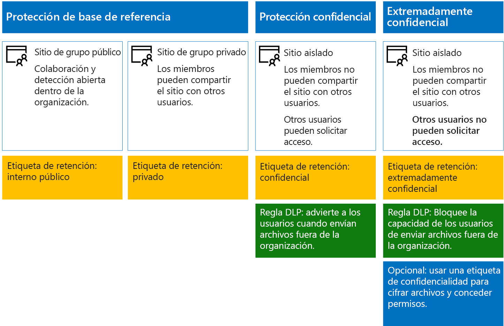
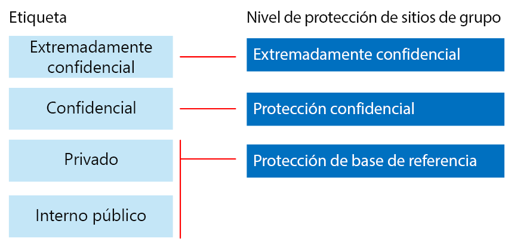

# Protección de archivos y sitios de SharePoint OnlineSecure SharePoint Online sites and files

 **Resumen:** Recomendaciones de configuración para proteger archivos en SharePoint Online y Office 365.**Summary:** Configuration recommendations for protecting files in SharePoint Online and Office 365.
  
En este artículo, se ofrecen recomendaciones para configurar la protección de archivos y sitios de grupo de SharePoint Online de manera que se equilibre la seguridad con la facilidad de colaboración. En este artículo, se definen cuatro configuraciones distintas, empezando por un sitio público dentro de la organización con las directivas de uso compartido más abiertas. Cada configuración adicional representa un paso significativo para la protección, pero a costa de que el conjunto de usuarios relevante pierda capacidad de obtener acceso a los recursos y colaborar en ellos. Siga estas recomendaciones como punto inicial, y ajuste las configuraciones para adaptarse a las necesidades de su organización.This article provides recommendations for configuring SharePoint Online team sites and file protection that balances security with ease of collaboration. This article defines four different configurations, starting with a public site within your organization with the most open sharing policies. Each additional configuration represents a meaningful step up in protection, but the ability to access and collaborate on resources is reduced to the relevant set of users. Use these recommendations as a starting point and adjust the configurations to meet the needs of your organization. 
  
Las configuraciones que se explican en este artículo concuerdan con las recomendaciones de Microsoft para los tres niveles de protección de datos, identidades y dispositivos:The configurations in this article align with Microsoft's recommendations for three tiers of protection for data, identities, and devices:
  
- Protección de base de referenciaBaseline protection
    
- Protección confidencialSensitive protection
    
- Protección extremadamente confidencialHighly confidential protection
    
Para más información sobre estos niveles y capacidades recomendadas para cada nivel, vea los siguientes recursos.For more information about these tiers and capabilities recommended for each tier, see the following resources. 
  
- [Protección de identidades y dispositivos para Office 365Identity and Device Protection for Office 365](https://docs.microsoft.com/office365/enterprise/microsoft-cloud-it-architecture-resources#BKMK_O365IDP)
    
- [Soluciones de protección de archivos en Office 365File Protection Solutions in Office 365](https://docs.microsoft.com/office365/enterprise/microsoft-cloud-it-architecture-resources#BKMK_O365fileprotect)
    
## Introducción a las capacidadesCapability overview

Las recomendaciones para sitios de grupo de SharePoint Online abarcan toda una variedad de capacidades de Microsoft 365.Recommendations for SharePoint Online team sites draw on a variety of Microsoft 365 capabilities. En la ilustración siguiente, se muestran las configuraciones recomendadas para cuatro sitios de grupo de SharePoint Online.The following illustration shows the recommended configurations for four SharePoint Online team sites.

Como se muestra:As illustrated:
  
- La protección de base de referencia incluye dos opciones para los sitios de grupo de SharePoint Online: un sitio público y un sitio privado. Los sitios públicos son aquellos visibles y accesibles por cualquier persona de la organización. Los sitios privados solo pueden detectarlos y acceder a ellos los miembros del sitio. Estas dos configuraciones de sitio permiten compartir fuera del grupo.Baseline protection includes two options for SharePoint Online team sites — a public site and private site. Public sites can be discovered and accessed by anybody in the organization. Private sites can only be discovered and accessed by members of the site. Both of these site configurations allow for sharing outside the group. 
    
- Los sitios para protección confidencial y extremadamente confidencial son sitios privados con acceso limitado solamente a los miembros de grupos específicos.Sites for sensitive and highly confidential protection are private sites with access limited only to members of specific groups.
    
- Las [etiquetas de retención](labels.md) proporcionan una manera de clasificar los archivos en los sitios.[Retention labels](labels.md) provide a way to classify files within the sites. Cada sitio de grupo de SharePoint Online está configurado para etiquetar automáticamente los archivos de bibliotecas de documentos con una etiqueta de retención predeterminada para el sitio.Each of the SharePoint Online team sites are configured to automatically label files in document libraries with a default retention label for the site. Las etiquetas de este ejemplo son Interno público, Privado, Confidencial y Extremadamente confidencial, que se corresponden con las cuatro configuraciones de sitio.Corresponding to the four site configurations, the labels in this example are Internal Public, Private, Sensitive, and Highly Confidential. Los usuarios pueden cambiar las etiquetas, pero esta configuración garantiza que todos los archivos reciben una etiqueta predeterminada.Users can change the labels, but this configuration ensures all files receive a default label.
    
- Las directivas de [prevención de pérdida de datos](data-loss-prevention-policies.md) (DLP) se configuran para que las etiquetas de retención Confidencial y Extremadamente confidencial puedan advertir o prevenir a los usuarios cuando intentan enviar estos tipos de archivo fuera de la organización.[Data loss prevention](data-loss-prevention-policies.md) (DLP) policies are configured for the Sensitive and Highly Confidential retention labels to either warn or prevent users when they attempt to send these types of files outside the organization.
    
- Si es necesario para su escenario, puede usar [etiquetas de confidencialidad](sensitivity-labels.md) para proteger archivos confidenciales con cifrado y permisos.If needed for your scenario, you can use [sensitivity labels](sensitivity-labels.md) to protect highly confidential files with encryption and permissions. Para los clientes de Azure Information Protection, puede usar las etiquetas de Azure Information Protection en el Centro de cumplimiento de Microsoft 365 y las etiquetas se sincronizarán con el portal de Azure en caso de que decida realizar una configuración adicional o avanzada.For Azure Information Protection customers, you can use your Azure Information Protection labels in the Microsoft 365 compliance center, and your labels will be synced with the Azure portal in case you choose to perform additional or advanced configuration. Las etiquetas de Azure Information Protection y etiquetas de confidencialidad de Office 365 son totalmente compatibles entre sí.Azure Information Protection labels and Office 365 sensitivity labels are fully compatible with each other. Esto significa que, por ejemplo, si tiene contenido con la etiqueta de Azure Information Protection, no tendrá que volver a clasificar o cambiar las etiquetas de su contenido. No todos los clientes necesitan este nivel de protección.This means, for example, if you have content labeled by Azure Information Protection, you won’t need to reclassify or relabel your content.Not all customers need this level of protection. 
    
## Configuración de todos los inquilinos para SharePoint Online y OneDrive para la EmpresaTenant-wide settings for SharePoint Online and OneDrive for Business

SharePoint Online y OneDrive para la Empresa incluyen opciones de configuración de todos los inquilinos que afectan a todos los sitios y usuarios. Algunas de estas opciones también se pueden ajustar en el nivel de sitio para que sea más restrictivo (pero no para que lo sea menos). En esta sección se describe la configuración de todos los inquilinos que afecta a la seguridad y la colaboración.SharePoint Online and OneDrive for Business include tenant-wide settings that affect all sites and users. Some of these settings can also be adjusted at the site level to be more restrictive (but not less). This section discusses tenant-wide settings that affect security and collaboration. 
  
### Uso compartidoSharing

Para esta solución, se recomienda la siguiente configuración de todos los inquilinos:For this solution, we recommend the following tenant-wide settings:
  
- Mantenga la directiva de uso compartido predeterminada, que permite compartir con todos los tipos de cuenta, incluso de forma anónima.Keep the default sharing policy that allows all sharing with all account types, including anonymous sharing.
    
- Establezca la expiración de los vínculos anónimos, si así lo quiere.Set anonymous links to expire, if desired.
    
- Establezca en Interno el tipo de vínculo predeterminado para el uso compartido. De esta manera se previene la pérdida accidental de datos fuera de la organización.Change the default link type for sharing to Internal. This helps prevent accidental data leakage outside your organization.
    
Aunque pueda parecer contradictorio permitir el uso compartido externo, este enfoque proporciona más control sobre el uso compartido de archivos en comparación con el envío de archivos por correo electrónico. SharePoint Online y Outlook funcionan conjuntamente para proporcionar una colaboración segura en los archivos.While it might seem counterintuitive to allow external sharing, this approach provides more control over file sharing compared to sending files in email. SharePoint Online and Outlook work together to provide secure collaboration on files. 
  
- De manera predeterminada, Outlook comparte un vínculo a un archivo en lugar de enviar el archivo por correo electrónico.By default, Outlook shares a link to a file instead of sending the file in email. 
    
- Con SharePoint Online y OneDrive para la Empresa, es muy fácil compartir vínculos a archivos con colaboradores que se encuentran tanto dentro como fuera de la organización.SharePoint Online and OneDrive for Business make it easy to share links to files with contributors who are both inside and outside your organization
    
También tiene controles que ayudan a regir el uso compartido externo. Por ejemplo, puede:You also have controls to help govern external sharing. For example, you can:
  
- Deshabilitar un vínculo de invitado anónimo.Disable an anonymous guest link.
    
- Revocar el acceso de usuario a un sitio.Revoke user access to a site.
    
- Ver quién tiene acceso a un sitio o documento específico.See who has access to a specific site or document.
    
- Establecer la expiración de vínculos anónimos de uso compartido (configuración de inquilino).Set anonymous sharing links to expire (tenant setting).
    
- Limitar quién puede compartir fuera de la organización (configuración de inquilino).Limit who can share outside your organization (tenant setting).
    
### Combinar el uso compartido externo con la prevención de pérdida de datos (DLP)Use external sharing together with data loss prevention (DLP)

Si no permite el uso compartido externo, los usuarios con necesidades empresariales encontrarán métodos y herramientas alternativas. Microsoft recomienda combinar el uso compartido externo con directivas DLP para proteger archivos confidenciales y altamente confidenciales.If you don't allow external sharing, users with a business need will find alternate tools and methods. Microsoft recommends you combine external sharing with DLP policies to protect sensitive and highly confidential files.
  
### Configuración de acceso a dispositivosDevice access settings

La configuración de acceso a dispositivos para SharePoint Online y OneDrive para la Empresa permite determinar si el acceso está limitado solo al explorador (no se pueden descargar archivos) o el acceso está bloqueado.Device access settings for SharePoint Online and OneDrive for Business let you determine whether access is limited to browser only (files can't be downloaded) or if access is blocked. Para obtener más información, consulte [Controlar el acceso desde dispositivos no administrados](https://docs.microsoft.com/es-ES/sharepoint/control-access-from-unmanaged-devices).For more information, see [Control access from unmanaged devices](https://docs.microsoft.com/es-ES/sharepoint/control-access-from-unmanaged-devices). 

Para usar la configuración de acceso de dispositivo con las directivas de acceso condicional recomendadas en Azure Active Directory, vea [Recomendaciones de directivas para la protección de sitios y archivos de SharePoint](https://docs.microsoft.com/es-ES/microsoft-365/enterprise/sharepoint-file-access-policies).To use device access settings with recommended conditional access policies in Azure Active Directory, see [Policy recommendations for securing SharePoint sites and files](https://docs.microsoft.com/es-ES/microsoft-365/enterprise/sharepoint-file-access-policies).
  
### OneDrive para la EmpresaOneDrive for Business

Revise esta configuración para decidir si quiere cambiar la configuración predeterminada para los sitios de OneDrive para la Empresa. Actualmente, las configuraciones de acceso a dispositivos y de uso compartido están duplicadas desde el centro de administración de SharePoint Online y se aplican a ambos entornos.Visit these settings to decide if you want to change the default settings for OneDrive for Business sites. Currently, the sharing and device access settings are duplicated from the SharePoint Online admin center and apply to both environments.
  
## Configuración del sitio de grupo de SharePointSharePoint team site configuration

En la tabla siguiente se resume la configuración para cada uno de los sitios de grupo que se han descrito en este artículo. Use estas configuraciones como punto de partida y ajuste los tipos de sitio y las configuraciones para satisfacer las necesidades de la organización. No todas las organizaciones necesitan todos los tipos de sitio. El número de organizaciones que necesita una protección extremadamente confidencial es muy reducido.The following table summarizes the configuration for each of the team sites described earlier in this article. Use these configurations as starting point recommendations and adjust the site types and configurations to meet the needs of your organization. Not every organization needs every type of site. Only a small number of organizations require highly confidential protection.
  
||||||
|:-----|:-----|:-----|:-----|:-----|
||**Protección de base de referencia n.º 1****Baseline protection #1**   |**Protección de base de referencia n.º 2****Baseline protection #2**   |**Protección confidencial****Sensitive protection**   |**Extremadamente confidencial****Highly confidential**   |
|DescripciónDescription    |Colaboración y detección abierta dentro de la organización.Open discovery and collaboration within the organization.    |Grupo y sitio privado con uso compartido permitido fuera del grupo.Private site and group with sharing allowed outside the group.    |Sitio aislado, en el que se definen niveles de acceso según la pertenencia a grupos específicos. Solo se permite el uso compartido a los miembros del sitio. DLP avisa a los usuarios cuando intentan enviar archivos fuera de la organización.Isolated site, in which levels of access are defined by membership in specific groups. Sharing is only allowed to members of the site. DLP warns users when attempting to send files outside the organization.    |Sitio aislado + cifrado de archivos y permisos con Azure Information Protection. DLP impide a los usuarios enviar archivos fuera de la organización.Isolated site + file encryption and permissions with Azure Information Protection. DLP prevents users from sending files outside the organization.    |
|Sitio de grupo público o privadoPrivate or public team site    |PúblicoPublic    |PrivatePrivate    |PrivatePrivate    |PrivatePrivate    |
|¿Quién tiene acceso?Who has access?    |Todos los usuarios de la organización, incluidos los usuarios B2B y usuarios invitados.Everybody in the organization, including B2B users and guest users.    |Solo los miembros del sitio. Otros usuarios pueden pedir acceso.Members of the site only. Others can request access.    |Solo los miembros del sitio. Otros usuarios pueden pedir acceso.Members of the site only. Others can request access.    |Solo los miembros. Otros usuarios no pueden pedir acceso.Members only. Others cannot request access.    |
|Controles de uso compartido en el nivel de sitioSite-level sharing controls    |Uso compartido permitido con cualquier usuario. Configuración predeterminada.Sharing allowed with anybody. Default settings.    |Uso compartido permitido con cualquier usuario. Configuración predeterminada.Sharing allowed with anybody. Default settings.    |Los miembros no pueden compartir el acceso al sitio.Members cannot share access to the site.    Los usuarios que no son miembros pueden pedir acceso al sitio, pero estas solicitudes deben ser supervisadas por un administrador del sitio.Non-members can request access to the site, but these requests need to be addressed by a site administrator.    |Los miembros no pueden compartir el acceso al sitio.Members cannot share access to the site.    Los usuarios que no son miembros no pueden pedir acceso al sitio o al contenido.Non-members cannot request access to the site or contents.    |
|Controles de acceso a dispositivos en el nivel de sitioSite-level device access controls    |Sin controles adicionales.No additional controls.    |Sin controles adicionales.No additional controls.    |Impide a los usuarios descargar archivos en dispositivos no compatibles o que no están unidos a ningún dispositivo. Esto permite solamente el acceso de explorador desde los demás dispositivos.Prevents users from downloading files to non-compliant or non-domain joined devices. This allows browser-only access from all other devices.    |Impedir quela descarga de archivos en dispositivos de dominios no combinados o no compatibles.Block downloading of files to non-compliant or non-domain joined devices.    |
|Etiquetas de retenciónRetention labels    |Interno públicoInternal Public    |PrivatePrivate    |ConfidencialSensitive    |Extremadamente confidencialHighly Confidential    |
|Directivas DLPDLP policies    |||Advierten a los usuarios cuando se envían archivos etiquetados como Confidenciales fuera de la organización.Warn users when sending files that are labeled as Sensitive outside the organization.    Para bloquear el uso compartido externo de tipos de datos confidenciales, como números de tarjeta de crédito u otros datos personales, puede configurar directivas DLP adicionales para estos tipos de datos (incluidos los tipos de datos personalizados que configure).To block external sharing of sensitive data types, such as credit card numbers or other personal data, you can configure additional DLP policies for these data types (including custom data types you configure).    |Impiden a los usuarios enviar archivos etiquetados como Extremadamente confidencial fuera de la organización. Permiten a los usuarios anular esto si proporcionan una justificación que incluya el nombre del usuario con el que van a compartir el archivo.Block users from sending files that are labeled as highly confidential outside organization. Allow users to override this by providing justification, including who they are sharing the file with.    |
|Etiquetas de confidencialidadSensitivity labels    ||||Use las etiquetas de confidencialidad para cifrar y conceder permisos a los archivos automáticamente.Use sensitivity labels to automatically encrypt and grant permissions to files. Las etiquetas de confidencialidad usan Azure Information Protection para cifrar archivos.Sensitivity labels use Azure Information Protection to encrypt files. Esta protección viaja con los archivos en caso de que estos se pierdan.This protection travels with the files in case they are leaked.    Office 365 no puede leer los archivos cifrados con Azure Information Protection. Además, las directivas DLP solo funcionan con los metadatos (incluidas las etiquetas), pero no con los contenidos de sus archivos (como los números de tarjetas de crédito dentro de los archivos).Office 365 cannot read files encrypted with Azure Information Protection. Additionally, DLP policies can only work with the metadata (including labels) but not the contents of these files (such as credit card numbers within files).    |
   
Para consultar los pasos necesarios para la implementación de los cuatro tipos diferentes de sitios de grupo de SharePoint Online en esta solución, consulte [Implementar sitios de SharePoint Online con tres niveles de protección](deploy-sharepoint-online-sites-for-three-tiers-of-protection.md).For the steps to deploy the four different types of SharePoint Online team sites in this solution, see [Deploy SharePoint Online sites for three tiers of protection](deploy-sharepoint-online-sites-for-three-tiers-of-protection.md). 
  
## Etiquetas de retención de Office 365Office 365 retention labels

Se recomienda usar etiquetas de retención para entornos con datos confidenciales.Using retention labels is recommended for environments with sensitive data. Después de configurar y publicar las etiquetas de retención:After you configure and publish retention labels:
  
- Aplicar una etiqueta predeterminada a una biblioteca de documentos en un sitio de grupo de SharePoint Online, para que todos los documentos en esa biblioteca obtengan la etiqueta predeterminada.You can apply a default label to a document library in a SharePoint Online team site, so that all documents in that library get the default label. 
    
- Aplicar etiquetas a contenido automáticamente si coincide con condiciones específicas.You can apply labels to content automatically if it matches specific conditions.
    
- Puede aplicar directivas DLP basadas en etiquetas de retención.You can apply DLP policies that are based on retention labels.
    
- Permitir que las personas de la organización apliquen manualmente una etiqueta al contenido de grupos de Outlook en la Web, Outlook 2010 y versiones posteriores, OneDrive para la Empresa, SharePoint Online y Office 365. A menudo, los usuarios son los que mejor saben con qué tipo de contenido están trabajando, por lo que pueden clasificarlo y aplicar la directiva DLP adecuada.People in your organization can apply a label manually to content in Outlook on the web, Outlook 2010 and later, OneDrive for Business, SharePoint Online, and Office 365 groups. Users often know best what type of content they're working with, so they can classify it and have the appropriate DLP policy applied.
    

  
Como se muestra, esta solución incluye la creación de las siguientes etiquetas de retención:As illustrated, this solution includes creating the following retention labels:
  
- Extremadamente confidencialHighly Confidential
    
- ConfidencialSensitive
    
- PrivatePrivate
    
- Interno públicoInternal Public
    
Estas etiquetas se asignan a los sitios recomendados en las ilustraciones y los gráficos antes citados en este artículo. Esta solución recomienda configurar las directivas DLP para evitar la filtración de archivos etiquetados como “Confidencial” y “Extremadamente confidencial” a miembros ajenos a la organización.These labels are mapped to the recommended sites in the illustrations and charts earlier in this article. This solution recommends configuring DLP policies to help prevent the leakage of files labeled as Sensitive and Highly Confidential.
  
Para consultar los pasos necesarios para configurar etiquetas de retención y directivas DLP en esta solución, consulte [Protección de archivos de SharePoint Online con etiquetas de retención y DLP](protect-sharepoint-online-files-with-office-365-labels-and-dlp.md).For the steps to configure retention labels and DLP policies in this solution, see [Protect SharePoint Online files with retention labels and DLP](protect-sharepoint-online-files-with-office-365-labels-and-dlp.md).
  
## Etiquetas de confidencialidadSensitivity labels 

Si existe una justificación para sus circunstancias de seguridad, puede usar las etiquetas de confidencialidad para aplicar protección a los archivos donde quiera que vayan.If warranted for your security scenario, you can use sensitivity labels to apply protections that follow the files wherever they go. Las etiquetas de confidencialidad en el Centro de cumplimiento de Microsoft 365 y las etiquetas de Azure Information Protection son las mismas.Sensitivity labels in the Microsoft 365 compliance center and Azure Information Protection labels are the same. Para esta solución, se recomienda usar una directiva con ámbito de Azure Information Protection y una subetiqueta de la etiqueta Extremadamente confidencial para conceder permisos y cifrar los archivos que deben protegerse con el máximo nivel de seguridad.For this solution, we recommend you use a scoped Azure Information Protection policy and a sub-label of the Highly Confidential label to encrypt and grant permissions to files that need to be protected with the highest level of security. 
  
Tenga en cuenta que, cuando se aplica el cifrado de Azure Information Protection a los archivos almacenados en Office 365, el servicio no puede procesar el contenido de estos archivos.Be aware that when Azure Information Protection encryption is applied to files stored in Office 365, the service cannot process the contents of these files. No funcionan algunas características de colaboración, como la coautoría, eDiscovery, la búsqueda y Delve.Co-authoring, eDiscovery, search, Delve, and other collaborative features do not work. Las directivas DLP solo pueden trabajar con los metadatos (incluidas las etiquetas de retención), pero no con el contenido de estos archivos (por ejemplo, números de tarjeta de crédito incluidos en los archivos).DLP policies can only work with the metadata (including retention labels) but not the contents of these files (such as credit card numbers within files).

Para obtener más información, vea [Información general sobre las etiquetas de retención](sensitivity-labels.md).For more information, see [Overview of sensitivity labels](sensitivity-labels.md).

    
### Agregar permisos a usuarios externosAdding permissions for external users

Hay dos maneras de conceder a los usuarios externos el acceso a archivos protegidos con Azure Information Protection. En ambos casos, los usuarios externos necesitan tener una cuenta de Azure AD. Si los usuarios externos no son miembros de una organización que usa Azure AD, pueden obtener una cuenta de Azure AD como usuario individual a través de esta página de suscripción: [https://aka.ms/aip-signup](https://aka.ms/aip-signup).There are two ways you can grant external users access to files protected with Azure Information Protection. In both these cases, external users must have an Azure AD account. If external users aren't members of an organization that uses Azure AD, they can obtain an Azure AD account as an individual by using this sign-up page: [https://aka.ms/aip-signup](https://aka.ms/aip-signup).
  
- Agregar usuarios externos a un grupo de Azure AD que se usa para configurar la protección de una etiquetaAdd external users to an Azure AD group that is used to configure protection for a label
    
     Primero necesita agregar la cuenta como un usuario B2B en el directorio. Puede que el [almacenamiento en caché de pertenencia a grupos de Azure Rights Management](https://docs.microsoft.com/information-protection/plan-design/prepare#group-membership-caching-by-azure-rights-management) tarde un par de horas en completarse. Con este método, los permisos se conceden a todos los archivos existentes protegidos que tengan la etiqueta (incluso los archivos protegidos antes de que se agregara un usuario al grupo de Azure AD).You'll need to first add the account as a B2B user in your directory. It can take a couple of hours for [group membership caching by Azure Rights Management](https://docs.microsoft.com/information-protection/plan-design/prepare#group-membership-caching-by-azure-rights-management). With this method, permissions are granted to all existing files protected with the label (even files protected before a user is added to the Azure AD group).
    
- Agregar usuarios externos directamente a la protección de etiquetaAdd external users directly to the label protection
    
     Puede agregar todos los usuarios de una organización (por ejemplo, Fabrikam.com), un grupo de Azure AD (por ejemplo, un grupo de finanzas dentro de una organización) o un usuario individual. Por ejemplo, puede agregar un equipo externo de reguladores para la protección de una etiqueta. Con este método, se conceden permisos solo a los archivos protegidos con la etiqueta después de que se haya agregado la entidad externa a la protección.You can add all users from an organization (e.g. Fabrikam.com), an Azure AD group (such as a finance group within an organization), or an individual user. For example, you can add an external team of regulators to the protection for a label. With this method, permissions are granted only to files protected with the label after the external entity is added to the protection.
    
### Implementación y uso de Azure Information ProtectionDeploying and using Azure Information Protection

Para consultar los pasos necesarios para configurar Azure Information Protection en esta solución, vea [Protección de archivos de SharePoint Online con Azure Information Protection](protect-sharepoint-online-files-with-azure-information-protection.md).For the steps to configure Azure Information Protection in this solution, see [Protect SharePoint Online files with Azure Information Protection](protect-sharepoint-online-files-with-azure-information-protection.md).
  

## Siguiente pasoNext step

Amplíe esta información como una prueba de concepto con [Sitios seguros de SharePoint Online en un entorno de desarrollo/pruebas](secure-sharepoint-online-sites-in-a-dev-test-environment.md).Build this out as a proof-of-concept with [Secure SharePoint Online sites in a dev/test environment](secure-sharepoint-online-sites-in-a-dev-test-environment.md).

## Vea tambiénSee Also

[Instrucciones de seguridad de Microsoft para campañas políticas, organizaciones sin ánimo de lucro y otras organizaciones ágilesMicrosoft Security Guidance for Political Campaigns, Nonprofits, and Other Agile Organizations](microsoft-security-guidance-for-political-campaigns-nonprofits-and-other-agile-o.md)
  
[Adopción de la nube y soluciones híbridasCloud adoption and hybrid solutions](https://docs.microsoft.com/office365/enterprise/cloud-adoption-and-hybrid-solutions)
  
