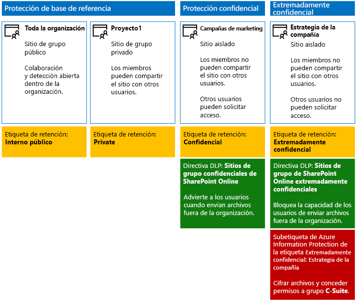
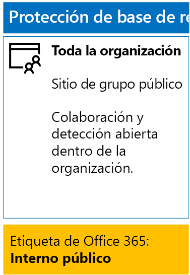
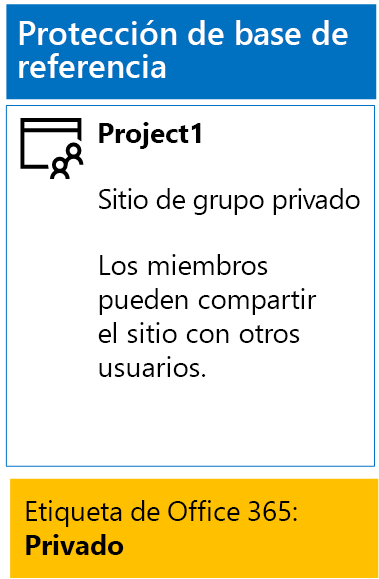
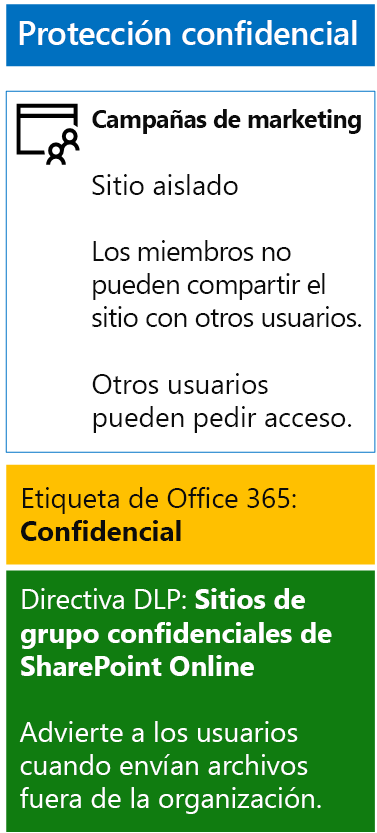
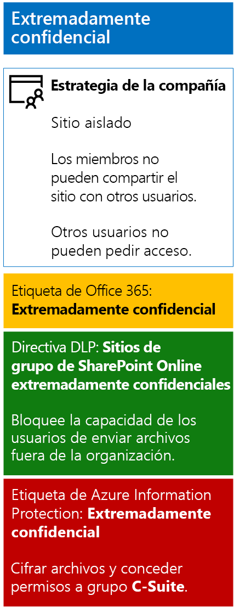

# <a name="secure-sharepoint-online-sites-in-a-devtest-environment"></a><span data-ttu-id="4cf0b-103">Protección de sitios de SharePoint Online en un entorno de desarrollo y pruebas</span><span class="sxs-lookup"><span data-stu-id="4cf0b-103">Secure SharePoint Online sites in a dev/test environment</span></span>

 <span data-ttu-id="4cf0b-104">**Resumen:** cree sitios de grupo de SharePoint Online en un entorno de desarrollo y pruebas, que pueden ser públicos, privados, confidenciales o extremadamente confidenciales.</span><span class="sxs-lookup"><span data-stu-id="4cf0b-104">**Summary:** Create public, private, sensitive, and highly confidential SharePoint Online team sites in a dev/test environment.</span></span>
  
<span data-ttu-id="4cf0b-105">En este artículo, se ofrecen instrucciones paso a paso para crear un entorno de desarrollo y pruebas donde se incluyan los cuatro tipos de sitios de grupo de SharePoint Online para la solución [Protección de archivos y sitios de SharePoint Online](secure-sharepoint-online-sites-and-files.md).</span><span class="sxs-lookup"><span data-stu-id="4cf0b-105">This article provides step-by-step instructions to create a dev/test environment that includes the four different types of SharePoint Online team sites for the [Secure SharePoint Online sites and files](secure-sharepoint-online-sites-and-files.md) solution.</span></span>
  

  
<span data-ttu-id="4cf0b-107">Con este entorno de prueba y desarrollo podrá experimentar con los comportamientos de protección de la información y ajustar la configuración a sus necesidades concretas antes de implementar sitios de grupo de SharePoint Online en producción.</span><span class="sxs-lookup"><span data-stu-id="4cf0b-107">Use this dev/test environment to experiment with the information protection behaviors and fine-tune settings for your specific needs before deploying SharePoint Online team sites in production.</span></span>
  
## <a name="phase-1-create-your-devtest-environment"></a><span data-ttu-id="4cf0b-108">Fase 1: Crear el entorno de prueba y desarrollo</span><span class="sxs-lookup"><span data-stu-id="4cf0b-108">Phase 1: Create your dev/test environment</span></span>

<span data-ttu-id="4cf0b-109">En esta fase se obtienen suscripciones de evaluación para Office 365 y Enterprise Mobility + Security para una organización ficticia.</span><span class="sxs-lookup"><span data-stu-id="4cf0b-109">In this phase, you obtain trial subscriptions for Office 365 and Enterprise Mobility + Security for a fictional organization.</span></span>
  
<span data-ttu-id="4cf0b-110">Siga primero las instrucciones de la **fase 2** del [entorno de desarrollo y prueba de Office 365](https://docs.microsoft.com/office365/enterprise/office-365-dev-test-environment).</span><span class="sxs-lookup"><span data-stu-id="4cf0b-110">First, follow the instructions in **Phase 2** of the [Office 365 dev/test environment](https://docs.microsoft.com/office365/enterprise/office-365-dev-test-environment).</span></span>
  
<span data-ttu-id="4cf0b-111">Después, regístrese en la suscripción de prueba de EMS y agréguela a la misma organización de la suscripción de prueba de Office 365.</span><span class="sxs-lookup"><span data-stu-id="4cf0b-111">Next, sign up for the EMS trial subscription and add it to the same organization as your Office 365 trial subscription.</span></span>
  
1. <span data-ttu-id="4cf0b-p101">Si es necesario, inicie sesión en el portal de Office 365 con las credenciales de la cuenta de administrador global de la suscripción de evaluación. Para obtener ayuda, vea [Where to sign in to Office 365](https://support.office.com/Article/Where-to-sign-in-to-Office-365-e9eb7d51-5430-4929-91ab-6157c5a050b4) (Dónde iniciar sesión en Office 365).</span><span class="sxs-lookup"><span data-stu-id="4cf0b-p101">If needed, sign in to the Office 365 portal with the credentials of the global administrator account of your trial subscription. For help, see [Where to sign in to Office 365](https://support.office.com/Article/Where-to-sign-in-to-Office-365-e9eb7d51-5430-4929-91ab-6157c5a050b4).</span></span>
    
2. <span data-ttu-id="4cf0b-114">Haga clic en el icono **Administrador**.</span><span class="sxs-lookup"><span data-stu-id="4cf0b-114">Click the **Admin** tile.</span></span>
    
3. <span data-ttu-id="4cf0b-115">En la pestaña **Centro de administración de Office** del explorador, en el panel de navegación izquierdo, haga clic en **Facturación > Servicios de compra**.</span><span class="sxs-lookup"><span data-stu-id="4cf0b-115">On the **Office Admin center** tab in your browser, in the left navigation, click **Billing > Purchase services**.</span></span>
    
4. <span data-ttu-id="4cf0b-p102">En la página **Servicios de compra**, busque el elemento **Enterprise Mobility + Security E5**. Mantenga el puntero del mouse sobre ese elemento y haga clic en **Iniciar prueba gratuita**.</span><span class="sxs-lookup"><span data-stu-id="4cf0b-p102">On the **Purchase services** page, find the **Enterprise Mobility + Security E5** item. Hover your mouse pointer over it and click **Start free trial**.</span></span>
    
5. <span data-ttu-id="4cf0b-118">En la página **Confirmar pedido**, haga clic en **Probar ahora**.</span><span class="sxs-lookup"><span data-stu-id="4cf0b-118">On the **Confirm your order** page, click **Try now**.</span></span>
    
6. <span data-ttu-id="4cf0b-119">En la página **Recibo del pedido**, haga clic en **Continuar**.</span><span class="sxs-lookup"><span data-stu-id="4cf0b-119">On the **Order receipt** page, click **Continue**.</span></span>
    
<span data-ttu-id="4cf0b-120">Después, habilite la licencia de Enterprise Mobility + Security E5 para la cuenta de administrador global.</span><span class="sxs-lookup"><span data-stu-id="4cf0b-120">Next, enable the Enterprise Mobility + Security E5 license for your global administrator account.</span></span>
  
1. <span data-ttu-id="4cf0b-121">En la pestaña **Centro de administración de Office 365** del explorador, en el panel de navegación izquierdo, haga clic en **Usuarios > Usuarios activos**.</span><span class="sxs-lookup"><span data-stu-id="4cf0b-121">On the **Office 365 Admin center** tab in your browser, in the left navigation, click **Users > Active users**.</span></span>
    
2. <span data-ttu-id="4cf0b-122">Haga clic en la cuenta de administrador global y, después, en **Editar** para **Licencias de productos**.</span><span class="sxs-lookup"><span data-stu-id="4cf0b-122">Click your global administrator account, and then click **Edit** for **Product licenses**.</span></span>
    
3. <span data-ttu-id="4cf0b-123">En el panel **Licencias de productos**, cambie la licencia del producto de **Enterprise Mobility + Security E5** a **Activada**, seleccione **Guardar** y, después, haga clic en **Cerrar** dos veces.</span><span class="sxs-lookup"><span data-stu-id="4cf0b-123">On the **Product licenses** pane, turn the product license for **Enterprise Mobility + Security E5** to **On**, click **Save,** and then click **Close** twice.</span></span>
    
## <a name="phase-2-create-and-configure-your-azure-active-directory-ad-groups-and-users"></a><span data-ttu-id="4cf0b-124">Fase 2: Crear y configurar los usuarios y grupos de Azure Active Directory (AD)</span><span class="sxs-lookup"><span data-stu-id="4cf0b-124">Phase 2: Create and configure your Azure Active Directory (AD) groups and users</span></span>

<span data-ttu-id="4cf0b-125">En esta fase se crean y configuran los grupos y usuarios de Azure AD para la organización ficticia.</span><span class="sxs-lookup"><span data-stu-id="4cf0b-125">In this phase, you create and configure the Azure AD groups and users for your fictional organization.</span></span>
  
<span data-ttu-id="4cf0b-126">Primero, cree un conjunto de grupos para una organización típica en Azure Portal.</span><span class="sxs-lookup"><span data-stu-id="4cf0b-126">First, create a set of groups for a typical organization with the Azure portal.</span></span>
  
1. <span data-ttu-id="4cf0b-p103">En otra pestaña del explorador, vaya a Azure Portal en [https://portal.azure.com](https://portal.azure.com). Si es necesario, inicie sesión con las credenciales de la cuenta de administrador global de la suscripción de prueba de Office 365 E5.</span><span class="sxs-lookup"><span data-stu-id="4cf0b-p103">Create a separate tab in your browser, and then go to the Azure portal at [https://portal.azure.com](https://portal.azure.com). If needed, sign in with the credentials of the global administrator account for your Office 365 E5 trial subscription.</span></span>
    
2. <span data-ttu-id="4cf0b-129">En Azure Portal, haga clic en **Azure Active Directory > Grupos**.</span><span class="sxs-lookup"><span data-stu-id="4cf0b-129">In the Azure portal, click **Azure Active Directory > Groups**.</span></span>
    
3. <span data-ttu-id="4cf0b-130">En la hoja **Todos los grupos**, haga clic en **+ Nuevo grupo**.</span><span class="sxs-lookup"><span data-stu-id="4cf0b-130">On the **Groups - All groups** blade, click **+ New group**.</span></span>
    
4. <span data-ttu-id="4cf0b-131">En la hoja **Grupo**:</span><span class="sxs-lookup"><span data-stu-id="4cf0b-131">On the **Group** blade:</span></span>
    
  - <span data-ttu-id="4cf0b-132">Seleccione **Office 365** en **Tipo de grupo**.</span><span class="sxs-lookup"><span data-stu-id="4cf0b-132">Select **Office 365** in **Group type**.</span></span>
    
  - <span data-ttu-id="4cf0b-133">Escriba **Directivos** en **Nombre**.</span><span class="sxs-lookup"><span data-stu-id="4cf0b-133">Type **C-Suite** in **Name**.</span></span>
    
  - <span data-ttu-id="4cf0b-134">Seleccione **Asignada** en **Tipo de pertenencia**.</span><span class="sxs-lookup"><span data-stu-id="4cf0b-134">Select **Assigned** in **Membership type**.</span></span>
      
5. <span data-ttu-id="4cf0b-135">Haga clic en **Crear** y, después, cierre la hoja **Grupo**.</span><span class="sxs-lookup"><span data-stu-id="4cf0b-135">Click **Create**, and then close the **Group** blade.</span></span>
    
6. <span data-ttu-id="4cf0b-136">Repita los pasos del 3 al 5 para los siguientes nombres de grupo:</span><span class="sxs-lookup"><span data-stu-id="4cf0b-136">Repeat steps 3-5 for the following group names:</span></span>
    
  - <span data-ttu-id="4cf0b-137">IT staff (Personal de TI)</span><span class="sxs-lookup"><span data-stu-id="4cf0b-137">IT staff</span></span>
    
  - <span data-ttu-id="4cf0b-138">Research staff (Personal de investigación)</span><span class="sxs-lookup"><span data-stu-id="4cf0b-138">Research staff</span></span>
    
  - <span data-ttu-id="4cf0b-139">Regular staff (Personal normal)</span><span class="sxs-lookup"><span data-stu-id="4cf0b-139">Regular staff</span></span>
    
  - <span data-ttu-id="4cf0b-140">Marketing staff (Personal de marketing)</span><span class="sxs-lookup"><span data-stu-id="4cf0b-140">Marketing staff</span></span>
    
  - <span data-ttu-id="4cf0b-141">Sales staff (Personal de ventas)</span><span class="sxs-lookup"><span data-stu-id="4cf0b-141">Sales staff</span></span>
    
7. <span data-ttu-id="4cf0b-142">Mantenga la pestaña de Azure Portal abierta en el explorador.</span><span class="sxs-lookup"><span data-stu-id="4cf0b-142">Keep the Azure portal tab in your browser open.</span></span>
    
<span data-ttu-id="4cf0b-143">Después, configure la asignación automática de licencias para que se asignen licencias de forma automática a los miembros de los grupos para las suscripciones de Office 365 y EMS.</span><span class="sxs-lookup"><span data-stu-id="4cf0b-143">Next, you configure automatic licensing so that members of your groups are automatically assigned licenses for your Office 365 and EMS subscriptions.</span></span>
  
1. <span data-ttu-id="4cf0b-144">En Azure Portal, haga clic en **Azure Active Directory > Licencias > Todos los productos**.</span><span class="sxs-lookup"><span data-stu-id="4cf0b-144">In the Azure portal, click **Azure Active Directory > Licenses > All products**.</span></span>
    
2. <span data-ttu-id="4cf0b-145">En la lista, seleccione **Enterprise Mobility + Security E5** y **Office 365 Enterprise E5** y, después, haga clic en **+ Asignar**.</span><span class="sxs-lookup"><span data-stu-id="4cf0b-145">In the list, select **Enterprise Mobility + Security E5** and **Office 365 Enterprise E5**, and then click **Assign**.</span></span>
    
3. <span data-ttu-id="4cf0b-146">En la hoja **Asignar licencia**, haga clic en **Usuarios y grupos**.</span><span class="sxs-lookup"><span data-stu-id="4cf0b-146">In the **Assign license** blade, click **Users and groups**.</span></span>
    
4. <span data-ttu-id="4cf0b-147">En la lista de grupos, seleccione lo siguiente:</span><span class="sxs-lookup"><span data-stu-id="4cf0b-147">In the list of groups, select the following:</span></span>
    
  - <span data-ttu-id="4cf0b-148">C-Suite (Directivos)</span><span class="sxs-lookup"><span data-stu-id="4cf0b-148">C-Suite</span></span>
    
  - <span data-ttu-id="4cf0b-149">IT staff (Personal de TI)</span><span class="sxs-lookup"><span data-stu-id="4cf0b-149">IT staff</span></span>
    
  - <span data-ttu-id="4cf0b-150">Research staff (Personal de investigación)</span><span class="sxs-lookup"><span data-stu-id="4cf0b-150">Research staff</span></span>
    
  - <span data-ttu-id="4cf0b-151">Regular staff (Personal normal)</span><span class="sxs-lookup"><span data-stu-id="4cf0b-151">Regular staff</span></span>
    
  - <span data-ttu-id="4cf0b-152">Marketing staff (Personal de marketing)</span><span class="sxs-lookup"><span data-stu-id="4cf0b-152">Marketing staff</span></span>
    
  - <span data-ttu-id="4cf0b-153">Personal de ventas</span><span class="sxs-lookup"><span data-stu-id="4cf0b-153">Sales staff</span></span>
    
5. <span data-ttu-id="4cf0b-154">Haga clic en **Seleccionar** y, después, en **Asignar**.</span><span class="sxs-lookup"><span data-stu-id="4cf0b-154">Click **Select**, and then click **Assign**.</span></span>
    
6. <span data-ttu-id="4cf0b-155">Cierre la pestaña Azure Portal del explorador.</span><span class="sxs-lookup"><span data-stu-id="4cf0b-155">Close the Azure portal tab in your browser.</span></span>
    
<span data-ttu-id="4cf0b-156">Después, necesita [conectarse al módulo de PowerShell de Azure Active Directory V2](https://go.microsoft.com/fwlink/?linkid=842218).</span><span class="sxs-lookup"><span data-stu-id="4cf0b-156">Next, you [Connect with the Azure Active Directory V2 PowerShell module](https://go.microsoft.com/fwlink/?linkid=842218).</span></span>
  
<span data-ttu-id="4cf0b-157">Rellene el nombre de la organización, la ubicación y una contraseña común; después, ejecute los siguientes comandos desde el símbolo del sistema de PowerShell o el entorno de scripts integrado (ISE) para crear cuentas de usuario y agregarlas a sus respectivos grupos:</span><span class="sxs-lookup"><span data-stu-id="4cf0b-157">Fill in your organization name, your location, and a common password, and then run these commands from the PowerShell command prompt or Integrated Script Environment (ISE) to create user accounts and add them to their groups:</span></span>
  
```
$orgName="<organization name, such as contoso for the contoso.onmicrosoft.com trial subscription domain name>"
$location="<the ISO ALPHA2 country code, such as US for the United States>"
$commonPassword="<common password for all the new accounts>"

$PasswordProfile=New-Object -TypeName Microsoft.Open.AzureAD.Model.PasswordProfile
$PasswordProfile.Password=$commonPassword

$groupName="C-Suite"
$userNames=@("CEO","CFO","CIO") 
$groupID=(Get-AzureADGroup | Where { $_.DisplayName -eq $groupName }).ObjectID
ForEach ($element in $userNames){ 
New-AzureADUser -DisplayName $element -PasswordProfile $PasswordProfile -UserPrincipalName ($element + "@" + $orgName + ".onmicrosoft.com") -AccountEnabled $true -MailNickName $element -UsageLocation $location 
Add-AzureADGroupMember -RefObjectId (Get-AzureADUser | Where { $_.DisplayName -eq $element }).ObjectID -ObjectId $groupID
}
$groupName="IT staff"
$userNames=@("ITAdmin1","ITAdmin2") 
$groupID=(Get-AzureADGroup | Where { $_.DisplayName -eq $groupName }).ObjectID
ForEach ($element in $userNames){ 
New-AzureADUser -DisplayName $element -PasswordProfile $PasswordProfile -UserPrincipalName ($element + "@" + $orgName + ".onmicrosoft.com") -AccountEnabled $true -MailNickName $element -UsageLocation $location 
Add-AzureADGroupMember -RefObjectId (Get-AzureADUser | Where { $_.DisplayName -eq $element }).ObjectID -ObjectId $groupID
}
$groupName="Research staff"
$userNames=@("Researcher1") 
$groupID=(Get-AzureADGroup | Where { $_.DisplayName -eq $groupName }).ObjectID
ForEach ($element in $userNames){ 
New-AzureADUser -DisplayName $element -PasswordProfile $PasswordProfile -UserPrincipalName ($element + "@" + $orgName + ".onmicrosoft.com") -AccountEnabled $true -MailNickName $element -UsageLocation $location 
Add-AzureADGroupMember -RefObjectId (Get-AzureADUser | Where { $_.DisplayName -eq $element }).ObjectID -ObjectId $groupID
}
$groupName="Regular staff"
$userNames=@("Regular1", "Regular2") 
$groupID=(Get-AzureADGroup | Where { $_.DisplayName -eq $groupName }).ObjectID
ForEach ($element in $userNames){ 
New-AzureADUser -DisplayName $element -PasswordProfile $PasswordProfile -UserPrincipalName ($element + "@" + $orgName + ".onmicrosoft.com") -AccountEnabled $true -MailNickName $element -UsageLocation $location 
Add-AzureADGroupMember -RefObjectId (Get-AzureADUser | Where { $_.DisplayName -eq $element }).ObjectID -ObjectId $groupID
}
$groupName="Marketing staff"
$userNames=@("Marketing1", "Marketing2") 
$groupID=(Get-AzureADGroup | Where { $_.DisplayName -eq $groupName }).ObjectID
ForEach ($element in $userNames){ 
New-AzureADUser -DisplayName $element -PasswordProfile $PasswordProfile -UserPrincipalName ($element + "@" + $orgName + ".onmicrosoft.com") -AccountEnabled $true -MailNickName $element -UsageLocation $location 
Add-AzureADGroupMember -RefObjectId (Get-AzureADUser | Where { $_.DisplayName -eq $element }).ObjectID -ObjectId $groupID
}
$groupName="Sales staff"
$userNames=@("SalesPerson1") 
$groupID=(Get-AzureADGroup | Where { $_.DisplayName -eq $groupName }).ObjectID
ForEach ($element in $userNames){ 
New-AzureADUser -DisplayName $element -PasswordProfile $PasswordProfile -UserPrincipalName ($element + "@" + $orgName + ".onmicrosoft.com") -AccountEnabled $true -MailNickName $element -UsageLocation $location 
Add-AzureADGroupMember -RefObjectId (Get-AzureADUser | Where { $_.DisplayName -eq $element }).ObjectID -ObjectId $groupID
}
```

> [!NOTE]
> <span data-ttu-id="4cf0b-p104">Se usa una contraseña común para automatizar y facilitar la configuración de un entorno de prueba y desarrollo. No se recomienda para suscripciones de producción.</span><span class="sxs-lookup"><span data-stu-id="4cf0b-p104">The use of a common password here is for automation and ease of configuration for a dev/test environment. This is not recommended for production subscriptions.</span></span> 
  
<span data-ttu-id="4cf0b-160">Después, siga estos pasos para comprobar que la asignación de licencias basada en grupos funcione correctamente.</span><span class="sxs-lookup"><span data-stu-id="4cf0b-160">Use these steps to verify that group-based licensing is working correctly.</span></span>
  
1. <span data-ttu-id="4cf0b-161">En la pestaña **Inicio de Microsoft Office** del explorador, haga clic en el icono **Administrador**.</span><span class="sxs-lookup"><span data-stu-id="4cf0b-161">From the **Microsoft Office Home** tab of your browser, click the **Admin** tile.</span></span>
    
2. <span data-ttu-id="4cf0b-162">En la nueva pestaña **Centro de administración de Office** del explorador, haga clic en **Usuarios**.</span><span class="sxs-lookup"><span data-stu-id="4cf0b-162">From the new **Office Admin center** tab of your browser, click **Users**.</span></span>
    
3. <span data-ttu-id="4cf0b-163">En la lista de usuarios, haga clic en **CEO** (Consejero delegado).</span><span class="sxs-lookup"><span data-stu-id="4cf0b-163">In the list of users, click **CEO**.</span></span>
    
4. <span data-ttu-id="4cf0b-164">En el panel que muestra las propiedades de la cuenta de usuario **CEO**, compruebe que se le han asignado las licencias **Enterprise Mobility + Security E5** y **Office 365 Enterprise E5** (en **Licencias de productos**).</span><span class="sxs-lookup"><span data-stu-id="4cf0b-164">In the pane that lists the properties of the **CEO** user account, verify that it has been assigned the **Enterprise Mobility + Security E5** and **Office 365 Enterprise E5** licenses (in **Product licenses**).</span></span>
    
## <a name="phase-3-create-office-365-labels"></a><span data-ttu-id="4cf0b-165">Fase 3: Crear etiquetas de Office 365</span><span class="sxs-lookup"><span data-stu-id="4cf0b-165">Phase 3: Create Office 365 labels</span></span>

<span data-ttu-id="4cf0b-166">En esta fase, se crean las etiquetas para los diferentes niveles de seguridad de las carpetas de documentos de sitios de grupo de SharePoint Online.</span><span class="sxs-lookup"><span data-stu-id="4cf0b-166">In this phase, you create the labels for the different levels of security for SharePoint Online team site documents folders.</span></span>
  
1. <span data-ttu-id="4cf0b-p105">Si es necesario, use una instancia privada del explorador de Internet e inicie sesión en el portal de Office 365 con la cuenta de administrador global de la suscripción de evaluación de Office 365 E5. Para obtener ayuda, vea [Where to sign in to Office 365](https://support.office.com/Article/Where-to-sign-in-to-Office-365-e9eb7d51-5430-4929-91ab-6157c5a050b4) (Dónde iniciar sesión en Office 365).</span><span class="sxs-lookup"><span data-stu-id="4cf0b-p105">If needed, use a private instance of your Internet browser and sign in to the Office 365 portal with the global administrator account of your Office 365 E5 trial subscription. For help, see [Where to sign in to Office 365](https://support.office.com/Article/Where-to-sign-in-to-Office-365-e9eb7d51-5430-4929-91ab-6157c5a050b4).</span></span>
    
2. <span data-ttu-id="4cf0b-169">En la pestaña **Inicio de Microsoft Office**, haga clic en el icono **Administrador**.</span><span class="sxs-lookup"><span data-stu-id="4cf0b-169">From the **Microsoft Office Home** tab, click the **Admin** tile.</span></span>
    
3. <span data-ttu-id="4cf0b-170">En la nueva pestaña **Centro de administración de Office** del explorador, haga clic en **Centros de administración Seguridad &amp; Cumplimiento**.</span><span class="sxs-lookup"><span data-stu-id="4cf0b-170">From the new **Office Admin center** tab of your browser, click **Admin centers > Security &amp; Compliance**.</span></span>
    
4. <span data-ttu-id="4cf0b-171">En la nueva pestaña **Inicio - Seguridad y cumplimiento** del explorador, haga clic en **Clasificaciones > Etiquetas**.</span><span class="sxs-lookup"><span data-stu-id="4cf0b-171">From the new **Home - Security &amp; Compliance** tab of your browser, click **Classifications > Labels**.</span></span>
    
5. <span data-ttu-id="4cf0b-172">En el panel **Inicio > Etiquetas**, haga clic en la pestaña **Retención** y, después, haga clic en **Crear una etiqueta**.</span><span class="sxs-lookup"><span data-stu-id="4cf0b-172">From the **Home > Labels** pane, click the **Retention** tab, and then click **Create a label**.</span></span>
    
6. <span data-ttu-id="4cf0b-173">En el panel **Nombre de la etiqueta**, escriba **Interno público** y, después, haga clic en **Siguiente**.</span><span class="sxs-lookup"><span data-stu-id="4cf0b-173">On the **Name your label** pane, type **Internal Public**, and then click **Next**.</span></span>
    
7. <span data-ttu-id="4cf0b-174">En el panel **Configuración de etiquetas**, haga clic en **Siguiente**.</span><span class="sxs-lookup"><span data-stu-id="4cf0b-174">On the **Label settings** pane, click **Next**.</span></span>
    
8. <span data-ttu-id="4cf0b-175">En el panel **Revise su configuración**, haga clic en **Crear esta etiqueta** y luego en **Cerrar**.</span><span class="sxs-lookup"><span data-stu-id="4cf0b-175">On the **Review your settings** pane, click **Create this label**, and then click **Close**.</span></span>
    
9. <span data-ttu-id="4cf0b-176">Repita los pasos del 5 al 8 para estas etiquetas adicionales:</span><span class="sxs-lookup"><span data-stu-id="4cf0b-176">Repeat steps 5-8 for these additional labels:</span></span>
    
  - <span data-ttu-id="4cf0b-177">Private</span><span class="sxs-lookup"><span data-stu-id="4cf0b-177">Private</span></span>
    
  - <span data-ttu-id="4cf0b-178">Confidencial</span><span class="sxs-lookup"><span data-stu-id="4cf0b-178">Sensitive</span></span>
    
  - <span data-ttu-id="4cf0b-179">Extremadamente confidencial</span><span class="sxs-lookup"><span data-stu-id="4cf0b-179">Highly Confidential</span></span>
    
10. <span data-ttu-id="4cf0b-180">En el panel **Inicio > Etiquetas**, haga clic para **Publish labels** (Publicar etiquetas).</span><span class="sxs-lookup"><span data-stu-id="4cf0b-180">From the **Home > Labels** pane, click **Publish labels**.</span></span>
    
11. <span data-ttu-id="4cf0b-181">En el panel **Elegir etiquetas para publicar**, haga clic en **Elegir etiquetas para publicar**.</span><span class="sxs-lookup"><span data-stu-id="4cf0b-181">On the **Choose labels to publish** pane, click **Choose labels to publish**.</span></span>
    
12. <span data-ttu-id="4cf0b-182">En el panel de **elección de etiquetas**, haga clic en **Agregar** y seleccione las cuatro etiquetas.</span><span class="sxs-lookup"><span data-stu-id="4cf0b-182">On the **Choose labels** pane, click **Add** and select all four labels.</span></span>
    
13. <span data-ttu-id="4cf0b-183">Haga clic en **Listo**.</span><span class="sxs-lookup"><span data-stu-id="4cf0b-183">Click **Done**.</span></span>
    
14. <span data-ttu-id="4cf0b-184">En el panel **Elegir etiquetas para publicar**, haga clic en **Siguiente**.</span><span class="sxs-lookup"><span data-stu-id="4cf0b-184">On the **Choose labels to publish** pane, click **Next**.</span></span>
    
15. <span data-ttu-id="4cf0b-185">En el panel **Seleccionar ubicaciones**, haga clic en **Siguiente**.</span><span class="sxs-lookup"><span data-stu-id="4cf0b-185">On the **Choose locations** pane, click **Next**.</span></span>
    
16. <span data-ttu-id="4cf0b-186">En el panel **Escriba un nombre para la directiva**, escriba **Organización de ejemplo** en **Nombre** y haga clic en **Siguiente**.</span><span class="sxs-lookup"><span data-stu-id="4cf0b-186">On the **Name your policy** pane, type **Example organization** in **Name**, and then click **Next**.</span></span>
    
17. <span data-ttu-id="4cf0b-187">En el panel **Revise la configuración**, haga clic en **Publicar etiquetas** y, después, en **Cerrar**.</span><span class="sxs-lookup"><span data-stu-id="4cf0b-187">On the **Review your settings** pane, click **Publish labels**, and then click **Close**.</span></span>
    
## <a name="phase-4-create-your-sharepoint-online-team-sites"></a><span data-ttu-id="4cf0b-188">Fase 4: Crear los sitios de grupo de SharePoint Online</span><span class="sxs-lookup"><span data-stu-id="4cf0b-188">Phase 4: Create your SharePoint Online team sites</span></span>

<span data-ttu-id="4cf0b-189">En esta fase se crean y configuran los cuatro tipos de sitios de grupo de SharePoint Online de la organización de ejemplo.</span><span class="sxs-lookup"><span data-stu-id="4cf0b-189">In this phase, you create and configure the four types of SharePoint Online team sites for your example organization.</span></span>
  
### <a name="organization-wide-team-site"></a><span data-ttu-id="4cf0b-190">Sitio de grupo De organización</span><span class="sxs-lookup"><span data-stu-id="4cf0b-190">Organization wide team site</span></span>

<span data-ttu-id="4cf0b-191">Para crear un sitio de grupo público de línea base de SharePoint Online, haga lo siguiente:</span><span class="sxs-lookup"><span data-stu-id="4cf0b-191">To create a baseline public SharePoint Online team site, do the following:</span></span>
  
1. <span data-ttu-id="4cf0b-p106">Si es necesario, use un explorador en el equipo local e inicie sesión en el portal de Office 365 con la cuenta de administrador global. Para obtener ayuda, vea [Where to sign in to Office 365](https://support.office.com/Article/Where-to-sign-in-to-Office-365-e9eb7d51-5430-4929-91ab-6157c5a050b4) (Dónde iniciar sesión en Office 365).</span><span class="sxs-lookup"><span data-stu-id="4cf0b-p106">If needed, use a browser on your local computer and sign in to the Office 365 portal using your global administrator account. For help, see [Where to sign in to Office 365](https://support.office.com/Article/Where-to-sign-in-to-Office-365-e9eb7d51-5430-4929-91ab-6157c5a050b4).</span></span>
    
2. <span data-ttu-id="4cf0b-194">En la lista de iconos, haga clic en **SharePoint**.</span><span class="sxs-lookup"><span data-stu-id="4cf0b-194">In the list of tiles, click **SharePoint**.</span></span>
    
3. <span data-ttu-id="4cf0b-195">En la nueva pestaña **SharePoint** del explorador, haga clic en **+ Crear sitio**.</span><span class="sxs-lookup"><span data-stu-id="4cf0b-195">On the new **SharePoint** tab in your browser, click **+ Create site**.</span></span>
    
4. <span data-ttu-id="4cf0b-196">En la página **Crear un sitio**, haga clic en **Sitio de grupo**.</span><span class="sxs-lookup"><span data-stu-id="4cf0b-196">On the **Create a site** page, click **Team site**.</span></span>
    
5. <span data-ttu-id="4cf0b-197">En **Nombre del sitio**, escriba **En toda la organización**.</span><span class="sxs-lookup"><span data-stu-id="4cf0b-197">In **Site name**, type **Organization wide**.</span></span> 
    
6. <span data-ttu-id="4cf0b-198">En **Descripción del sitio de grupo**, escriba **Sitio de SharePoint para toda la organización**.</span><span class="sxs-lookup"><span data-stu-id="4cf0b-198">In **Team site description**, type **SharePoint site for the entire organization**.</span></span>
    
7. <span data-ttu-id="4cf0b-199">En **Configuración de privacidad**, seleccione **Público: cualquier usuario de la organización puede obtener acceso a este sitio** y, después, haga clic en **Siguiente**.</span><span class="sxs-lookup"><span data-stu-id="4cf0b-199">In **Privacy settings**, select **Public - anyone in the organization can access this site**, and then click **Next**.</span></span>
    
8. <span data-ttu-id="4cf0b-200">En el panel **Usuarios que quiere agregar**, haga clic en **Finalizar**.</span><span class="sxs-lookup"><span data-stu-id="4cf0b-200">On the **Who do you want to add?** pane, click **Finish**.</span></span>
    
<span data-ttu-id="4cf0b-201">Después configure la carpeta de documentos del sitio de grupo en toda la organización para la etiqueta Interno público.</span><span class="sxs-lookup"><span data-stu-id="4cf0b-201">Next, configure the documents folder of the Organization wide team site for the Internal Public label.</span></span>
  
1. <span data-ttu-id="4cf0b-202">En la pestaña **En toda la organización: Inicio** del explorador, haga clic en **Documentos**.</span><span class="sxs-lookup"><span data-stu-id="4cf0b-202">In the **Organization wide-Home** tab of your browser, click **Documents**.</span></span>
    
2. <span data-ttu-id="4cf0b-203">Haga clic en el icono de configuración y, después, en **Configuración de la biblioteca**.</span><span class="sxs-lookup"><span data-stu-id="4cf0b-203">Click the settings icon, and then click **Library settings**.</span></span>
    
3. <span data-ttu-id="4cf0b-204">En **Permisos y administración**, haga clic en **Aplicar la etiqueta a los elementos de esta biblioteca**.</span><span class="sxs-lookup"><span data-stu-id="4cf0b-204">Under **Permissions and Management**, click **Apply label to items in this library**.</span></span>
    
4. <span data-ttu-id="4cf0b-205">En **Configuración: Aplicar etiqueta**, seleccione **Interno público** y haga clic en **Guardar**.</span><span class="sxs-lookup"><span data-stu-id="4cf0b-205">In **Settings-Apply Label**, select **Internal Public**, and then click **Save**.</span></span>
    
<span data-ttu-id="4cf0b-206">Esta es el resultado de la configuración.</span><span class="sxs-lookup"><span data-stu-id="4cf0b-206">Here is your resulting configuration.</span></span>
  

  
### <a name="project-1-team-site"></a><span data-ttu-id="4cf0b-208">Sitio de grupo Proyecto 1</span><span class="sxs-lookup"><span data-stu-id="4cf0b-208">Project 1 team site</span></span>

<span data-ttu-id="4cf0b-209">Para crear un sitio de grupo de SharePoint Online privado como línea base para un proyecto dentro de la organización, siga este procedimiento:</span><span class="sxs-lookup"><span data-stu-id="4cf0b-209">To create a baseline private SharePoint Online team site for a project within the organization, do the following:</span></span>
  
1. <span data-ttu-id="4cf0b-p107">Si es necesario, use un explorador en el equipo local e inicie sesión en el portal de Office 365 con la cuenta de administrador global. Para obtener ayuda, vea [Where to sign in to Office 365](https://support.office.com/Article/Where-to-sign-in-to-Office-365-e9eb7d51-5430-4929-91ab-6157c5a050b4) (Dónde iniciar sesión en Office 365).</span><span class="sxs-lookup"><span data-stu-id="4cf0b-p107">If needed, use a browser on your local computer and sign in to the Office 365 portal using your global administrator account. For help, see [Where to sign in to Office 365](https://support.office.com/Article/Where-to-sign-in-to-Office-365-e9eb7d51-5430-4929-91ab-6157c5a050b4).</span></span>
    
2. <span data-ttu-id="4cf0b-212">En la lista de iconos, haga clic en **SharePoint**.</span><span class="sxs-lookup"><span data-stu-id="4cf0b-212">In the list of tiles, click **SharePoint**.</span></span>
    
3. <span data-ttu-id="4cf0b-213">En la nueva pestaña **SharePoint** del explorador, haga clic en **+ Crear sitio**.</span><span class="sxs-lookup"><span data-stu-id="4cf0b-213">On the new **SharePoint** tab in your browser, click **+ Create site**.</span></span>
    
4. <span data-ttu-id="4cf0b-214">En la página **Crear un sitio**, haga clic en **Sitio de grupo**.</span><span class="sxs-lookup"><span data-stu-id="4cf0b-214">On the **Create a site** page, click **Team site**.</span></span>
    
5. <span data-ttu-id="4cf0b-215">En **Nombre del sitio**, escriba **Proyecto 1**.</span><span class="sxs-lookup"><span data-stu-id="4cf0b-215">In **Site name**, type **Project 1**.</span></span> 
    
6. <span data-ttu-id="4cf0b-216">En **Descripción del sitio de grupo**, escriba **Sitio de SharePoint para Proyecto 1**.</span><span class="sxs-lookup"><span data-stu-id="4cf0b-216">In **Team site description,** type **SharePoint site for Project 1**.</span></span>
    
7. <span data-ttu-id="4cf0b-217">En **Configuración de privacidad**, seleccione **Privado: solo los miembros pueden obtener acceso a este sitio** y, después, haga clic en **Siguiente**.</span><span class="sxs-lookup"><span data-stu-id="4cf0b-217">In **Privacy settings**, select **Private - only members can access this site**, and then click **Next**.</span></span>
    
8. <span data-ttu-id="4cf0b-218">En el panel **Usuarios que quiere agregar**, haga clic en **Finalizar**.</span><span class="sxs-lookup"><span data-stu-id="4cf0b-218">On the **Who do you want to add?** pane, click **Finish**.</span></span>
    
<span data-ttu-id="4cf0b-219">Después, configure la carpeta de documentos del sitio de grupo Proyecto 1 para la etiqueta Privado.</span><span class="sxs-lookup"><span data-stu-id="4cf0b-219">Next, configure the documents folder of the Project 1 team site for the Private label.</span></span>
  
1. <span data-ttu-id="4cf0b-220">En la pestaña **Proyecto 1: Inicio** del explorador, haga clic en **Documentos**.</span><span class="sxs-lookup"><span data-stu-id="4cf0b-220">In the **Project 1-Home** tab of your browser, click **Documents**.</span></span>
    
2. <span data-ttu-id="4cf0b-221">Haga clic en el icono de configuración y, después, en **Configuración de la biblioteca**.</span><span class="sxs-lookup"><span data-stu-id="4cf0b-221">Click the settings icon, and then click **Library settings**.</span></span>
    
3. <span data-ttu-id="4cf0b-222">En **Permisos y administración**, haga clic en **Apply label to items in this library** (Aplicar la etiqueta a los elementos de esta biblioteca).</span><span class="sxs-lookup"><span data-stu-id="4cf0b-222">Under **Permissions and Management**, click **Apply label to items in this library**.</span></span>
    
4. <span data-ttu-id="4cf0b-223">En **Configuración: Aplicar etiqueta**, seleccione **Privado** y haga clic en **Guardar**.</span><span class="sxs-lookup"><span data-stu-id="4cf0b-223">In **Settings-Apply Label**, select **Private**, and then click **Save**.</span></span>
    
<span data-ttu-id="4cf0b-224">Esta es el resultado de la configuración.</span><span class="sxs-lookup"><span data-stu-id="4cf0b-224">Here is your resulting configuration.</span></span>
  

  
### <a name="marketing-campaigns-team-site"></a><span data-ttu-id="4cf0b-226">Sitio de grupo Campañas de marketing</span><span class="sxs-lookup"><span data-stu-id="4cf0b-226">Marketing campaigns team site</span></span>

<span data-ttu-id="4cf0b-227">Para crear un sitio de grupo de SharePoint Online aislado que tenga el nivel confidencial para recursos de campañas de marketing, siga este procedimiento:</span><span class="sxs-lookup"><span data-stu-id="4cf0b-227">To create a sensitive-level isolated SharePoint Online team site for marketing campaign resources, do the following:</span></span>
  
1. <span data-ttu-id="4cf0b-p108">Abra un explorador en el equipo local e inicie sesión en el portal de Office 365 con la cuenta de administrador global. Para obtener ayuda, vea [Where to sign in to Office 365](https://support.office.com/Article/Where-to-sign-in-to-Office-365-e9eb7d51-5430-4929-91ab-6157c5a050b4) (Dónde iniciar sesión en Office 365).</span><span class="sxs-lookup"><span data-stu-id="4cf0b-p108">Using a browser on your local computer, sign in to the Office 365 portal using your global administrator account. For help, see [Where to sign in to Office 365](https://support.office.com/Article/Where-to-sign-in-to-Office-365-e9eb7d51-5430-4929-91ab-6157c5a050b4).</span></span>
    
2. <span data-ttu-id="4cf0b-230">En la lista de iconos, haga clic en **SharePoint**.</span><span class="sxs-lookup"><span data-stu-id="4cf0b-230">In the list of tiles, click **SharePoint**.</span></span>
    
3. <span data-ttu-id="4cf0b-231">En la nueva pestaña **SharePoint** del explorador, haga clic en **+ Crear sitio**.</span><span class="sxs-lookup"><span data-stu-id="4cf0b-231">On the new **SharePoint** tab in your browser, click **+ Create site**.</span></span>
    
4. <span data-ttu-id="4cf0b-232">En la página **Crear un sitio**, haga clic en **Sitio de grupo**.</span><span class="sxs-lookup"><span data-stu-id="4cf0b-232">On the **Create a site** page, click **Team site**.</span></span>
    
5. <span data-ttu-id="4cf0b-233">En **Team site name** (Nombre del sitio de grupo), escriba **Campañas de marketing**.</span><span class="sxs-lookup"><span data-stu-id="4cf0b-233">In **Team site name**, type **Marketing campaigns**.</span></span>
    
6. <span data-ttu-id="4cf0b-234">En **Descripción del sitio de grupo**, escriba **Sitio de SharePoint para recursos de campañas de marketing (confidencial)**.</span><span class="sxs-lookup"><span data-stu-id="4cf0b-234">In **Team site description**, type **SharePoint site for marketing campaign resources (sensitive)**.</span></span>
    
7.  <span data-ttu-id="4cf0b-235">En **Configuración de privacidad**, seleccione **Privado: solo los miembros pueden obtener acceso a este sitio** y, después, haga clic en **Siguiente**.</span><span class="sxs-lookup"><span data-stu-id="4cf0b-235">In **Privacy settings**, select **Private - only members can access this site**, and then click **Next**.</span></span>
    
8. <span data-ttu-id="4cf0b-236">En el panel **Usuarios que quiere agregar**, haga clic en **Finalizar**.</span><span class="sxs-lookup"><span data-stu-id="4cf0b-236">On the **Who do you want to add?** pane, click **Finish**.</span></span>
    
9. <span data-ttu-id="4cf0b-237">En la barra de herramientas de la nueva pestaña **Campañas de marketing** del explorador, haga clic en el icono de configuración y, después, en **Permisos del sitio**.</span><span class="sxs-lookup"><span data-stu-id="4cf0b-237">On the new **Marketing campaigns** tab in your browser, in the tool bar, click the settings icon, and then click **Site permissions**.</span></span>
    
10. <span data-ttu-id="4cf0b-238">En el panel **Permisos del sitio**, haga clic en **Configuración de permisos avanzada**.</span><span class="sxs-lookup"><span data-stu-id="4cf0b-238">In the **Site permissions** pane, click **Advanced permissions settings**.</span></span>
    
11. <span data-ttu-id="4cf0b-239">En la nueva pestaña **Permisos** del explorador, haga clic en **Configuración de solicitud de acceso**.</span><span class="sxs-lookup"><span data-stu-id="4cf0b-239">In the new **Permissions** tab in your browser, click **Access Request Settings**.</span></span>
    
12. <span data-ttu-id="4cf0b-240">En el cuadro de diálogo **Configuración de solicitud de acceso**, desactive las casillas **Permitir que los miembros compartan el sitio y archivos y carpetas individuales** y **Permitir a los miembros invitar a otros al grupo de miembros del sitio**, escriba **ITAdmin1@**\<nombre de la organización>**.onmicrosoft.com** en **Enviar todas las solicitudes de acceso** y, después, haga clic en **Aceptar**.</span><span class="sxs-lookup"><span data-stu-id="4cf0b-240">In the **Access Request Settings** dialog box, clear the **Allow members to share the site and individual files and folders** and **Allow members to invite others to the site members group** check boxes, type **ITAdmin1@**\<your organization name>**.onmicrosoft.com** in **Send all requests for access**, and then click **OK**.</span></span>
    
13. <span data-ttu-id="4cf0b-241">Haga clic en **Campañas de Marketing: Miembros** en la lista.</span><span class="sxs-lookup"><span data-stu-id="4cf0b-241">Click **Marketing campaigns Members** in the list.</span></span>
    
14. <span data-ttu-id="4cf0b-242">En la página **Personas y grupos**, haga clic en **Nuevo**.</span><span class="sxs-lookup"><span data-stu-id="4cf0b-242">On the **People and Groups** page, click **New**.</span></span>
    
15. <span data-ttu-id="4cf0b-243">En el cuadro de diálogo **Compartir**, escriba **Personal de marketing**, selecciónelo y haga clic en **Compartir**.</span><span class="sxs-lookup"><span data-stu-id="4cf0b-243">In the **Share** dialog box, type **Marketing staff**, select it, and then click **Share**.</span></span>
    
16. <span data-ttu-id="4cf0b-244">Repita los pasos 14 y 15 para la cuenta de usuario **Investigador1**.</span><span class="sxs-lookup"><span data-stu-id="4cf0b-244">Repeat steps 14 and 15 for the **Researcher1** user account.</span></span>
    
17. <span data-ttu-id="4cf0b-245">Haga clic en el botón Volver del explorador.</span><span class="sxs-lookup"><span data-stu-id="4cf0b-245">Click the back button on your browser.</span></span>
    
18. <span data-ttu-id="4cf0b-246">Haga clic en **Campañas de marketing: Propietarios** en la lista.</span><span class="sxs-lookup"><span data-stu-id="4cf0b-246">Click **Marketing campaigns Owners** in the list.</span></span>
    
19. <span data-ttu-id="4cf0b-247">En la página **Personas y grupos**, haga clic en **Nuevo**.</span><span class="sxs-lookup"><span data-stu-id="4cf0b-247">On the **People and Groups** page, click **New**.</span></span>
    
20. <span data-ttu-id="4cf0b-248">En el cuadro de diálogo **Compartir**, escriba **Personal de TI**, selecciónelo y haga clic en **Compartir**.</span><span class="sxs-lookup"><span data-stu-id="4cf0b-248">In the **Share** dialog box, type **IT staff**, select it, and then click **Share**.</span></span>
    
21. <span data-ttu-id="4cf0b-249">Haga clic en el botón Volver del explorador.</span><span class="sxs-lookup"><span data-stu-id="4cf0b-249">Click the back button on your browser.</span></span>
    
22. <span data-ttu-id="4cf0b-250">Cierre la pestaña **Personas y grupos** del explorador, haga clic en la pestaña **Campañas de marketing: Inicio** del explorador y, después, cierre el panel **Permisos del sitio**.</span><span class="sxs-lookup"><span data-stu-id="4cf0b-250">Close the **People and Groups** tab in your browser, click the **Marketing campaigns-Home** tab in your browser, and then close the **Site permissions** pane.</span></span>
    
<span data-ttu-id="4cf0b-251">Estos son los resultados de la configuración de los permisos:</span><span class="sxs-lookup"><span data-stu-id="4cf0b-251">Here are the results of configuring permissions:</span></span>
  
- <span data-ttu-id="4cf0b-252">El grupo de SharePoint **Campañas de marketing-Miembros** solamente contiene el grupo **Campañas de marketing** (que contiene la cuenta de usuario de administrador global), el grupo **Marketing staff** [Personal de marketing] \(que contiene las cuentas de usuario Marketing1 y Marketing2) y la cuenta de usuario **Researcher1**.</span><span class="sxs-lookup"><span data-stu-id="4cf0b-252">The **Marketing campaigns-Members** SharePoint group contains only the **Marketing campaigns** group (which contains the global administrator user account), the **Marketing staff** group (which contains the Marketing1 and Marketing2 user accounts), and the **Researcher1** user account.</span></span>
    
- <span data-ttu-id="4cf0b-253">El grupo de SharePoint **Campañas de marketing-Propietarios** solo contiene el grupo **IT staff** [Personal de TI] \(que contiene únicamente las cuentas de usuario ITAdmin1 e ITAdmin2).</span><span class="sxs-lookup"><span data-stu-id="4cf0b-253">The **Marketing campaigns-Owners** SharePoint group contains only the **IT staff** group (which contains only the ITAdmin1 and ITAdmin2 user accounts).</span></span>
    
- <span data-ttu-id="4cf0b-254">El grupo de SharePoint **Campañas de marketing-Visitantes** no contiene grupos ni cuentas de usuario.</span><span class="sxs-lookup"><span data-stu-id="4cf0b-254">The **Marketing campaigns-Visitors** SharePoint group contains no groups or user accounts.</span></span>
    
- <span data-ttu-id="4cf0b-255">Los miembros no pueden modificar los permisos de nivel de sitio (esto solo pueden hacerlo los miembros del grupo **Campañas de marketing: Propietarios**).</span><span class="sxs-lookup"><span data-stu-id="4cf0b-255">Members cannot modify site-level permissions (this can only be done by members of the **Marketing campaigns-Owners** group).</span></span>
    
- <span data-ttu-id="4cf0b-256">Otras cuentas de usuario no pueden acceder al sitio ni a sus recursos, pero pueden pedir acceso al sitio, que enviará un correo electrónico al buzón de la cuenta de usuario ITAdmin1.</span><span class="sxs-lookup"><span data-stu-id="4cf0b-256">Other user accounts cannot access the site or its resources, but can request access to the site, which will send an email to the ITAdmin1 user account mailbox.</span></span>
    
<span data-ttu-id="4cf0b-257">Después, configure la carpeta de documentos del sitio de grupo Campañas de marketing para la etiqueta Confidencial.</span><span class="sxs-lookup"><span data-stu-id="4cf0b-257">Next, configure the documents folder of the Marketing campaigns team site for the Sensitive label.</span></span>
  
1. <span data-ttu-id="4cf0b-258">En la pestaña **Campañas de marketing: Inicio** del explorador, haga clic en **Documentos**.</span><span class="sxs-lookup"><span data-stu-id="4cf0b-258">In the **Marketing campaigns-Home** tab of your browser, click **Documents**.</span></span>
    
2. <span data-ttu-id="4cf0b-259">Haga clic en el icono de configuración y, después, en **Configuración de la biblioteca**.</span><span class="sxs-lookup"><span data-stu-id="4cf0b-259">Click the settings icon, and then click **Library settings**.</span></span>
    
3. <span data-ttu-id="4cf0b-260">En **Permisos y administración**, haga clic en **Apply label to items in this library** (Aplicar la etiqueta a los elementos de esta biblioteca).</span><span class="sxs-lookup"><span data-stu-id="4cf0b-260">Under **Permissions and Management**, click **Apply label to items in this library**.</span></span>
    
4. <span data-ttu-id="4cf0b-261">En **Configuración: Aplicar etiqueta**, seleccione **Confidencial** y, después, haga clic en **Guardar**.</span><span class="sxs-lookup"><span data-stu-id="4cf0b-261">In **Settings-Apply Label**, select **Sensitive**, and then click **Save**.</span></span>
    
<span data-ttu-id="4cf0b-262">Luego configure una directiva de prevención de pérdida de datos (DLP) que notifique a los usuarios cada vez que compartan un documento en un sitio de grupo de SharePoint Online con la etiqueta Confidencial, que incluye el sitio Campañas de marketing, fuera de la organización.</span><span class="sxs-lookup"><span data-stu-id="4cf0b-262">Next, configure a data loss prevention (DLP) policy that notifies users when they share a document on a SharePoint Online team site with the Sensitive label, which includes the Marketing campaigns site, outside the organization.</span></span>
  
1. <span data-ttu-id="4cf0b-263">En la pestaña **Inicio de Microsoft Office** del explorador, haga clic en el icono de **Seguridad y cumplimiento**.</span><span class="sxs-lookup"><span data-stu-id="4cf0b-263">From the **Microsoft Office Home** tab in your browser, click the **Security &amp; Compliance** tile.</span></span>
    
2. <span data-ttu-id="4cf0b-264">En la nueva pestaña **Seguridad y cumplimiento** del explorador, haga clic en **Prevención de pérdida de datos > Directiva**.</span><span class="sxs-lookup"><span data-stu-id="4cf0b-264">On the new **Security &amp; Compliance** tab in your browser, click **Data loss prevention > Policy**.</span></span>
    
3. <span data-ttu-id="4cf0b-265">En el panel **Prevención de pérdida de datos**, haga clic en **+ Crear una directiva**.</span><span class="sxs-lookup"><span data-stu-id="4cf0b-265">In the **Data loss prevention** pane, click **+ Create a policy**.</span></span>
    
4. <span data-ttu-id="4cf0b-266">En el panel **Start with a template or create a custom policy** (Empezar con una plantilla o crear una directiva personalizada), haga clic en **Personalizada** y luego en **Siguiente**.</span><span class="sxs-lookup"><span data-stu-id="4cf0b-266">In the **Start with a template or create a custom policy** pane, click **Custom**, and then click **Next**.</span></span>
    
5. <span data-ttu-id="4cf0b-267">En el panel **Escriba un nombre para la directiva**, escriba **Sitios de grupo de SharePoint Online de etiqueta Confidencial** en **Nombre** y haga clic en **Siguiente**.</span><span class="sxs-lookup"><span data-stu-id="4cf0b-267">In the **Name your policy** pane, type **Sensitive label SharePoint Online team sites** in **Name**, and then click **Next**.</span></span>
    
6. <span data-ttu-id="4cf0b-268">En el panel **Elegir ubicaciones**, haga clic en **Let me choose specific locations** (Permitir elegir ubicaciones concretas) y luego en **Siguiente**.</span><span class="sxs-lookup"><span data-stu-id="4cf0b-268">In the **Choose locations** pane, click **Let me choose specific locations**, and then click **Next**.</span></span>
    
7. <span data-ttu-id="4cf0b-269">En la lista de ubicaciones, deshabilite las ubicaciones **Correo electrónico de Exchange** y **Cuentas de OneDrive** y haga clic en **Siguiente**.</span><span class="sxs-lookup"><span data-stu-id="4cf0b-269">In the list of locations, disable the **Exchange email** and **OneDrive accounts** locations, and then click **Next**.</span></span>
    
8. <span data-ttu-id="4cf0b-270">En el panel **Customize the types of sensitive info you want to protect** (Personalizar los tipos de información confidencial que quiere proteger), haga clic en **Editar**.</span><span class="sxs-lookup"><span data-stu-id="4cf0b-270">In the **Customize the types of sensitive info you want to protect** pane, click **Edit**.</span></span>
    
9. <span data-ttu-id="4cf0b-271">En el panel **Choose the types of content to protect** (Elegir los tipos de contenido que se va a proteger), haga clic en **Agregar** en el cuadro desplegable y luego en **Etiquetas**.</span><span class="sxs-lookup"><span data-stu-id="4cf0b-271">In the **Choose the types of content to protect** pane, click **Add** in the drop-down box, and then click **Labels**.</span></span>
    
10. <span data-ttu-id="4cf0b-272">En el panel **Etiquetas**, haga clic en **+ Agregar**, seleccione la etiqueta **Confidencial**, haga clic en **Agregar** y luego en **Listo**.</span><span class="sxs-lookup"><span data-stu-id="4cf0b-272">In the **Labels** pane, click **+ Add**, select the **Sensitive** label, click **Add**, and then click **Done**.</span></span>
    
11. <span data-ttu-id="4cf0b-273">En el panel **Choose the types of content to protect** (Elegir los tipos de contenido que se va a proteger), haga clic en **Guardar**.</span><span class="sxs-lookup"><span data-stu-id="4cf0b-273">In the **Choose the types of content to protect** pane, click **Save**.</span></span>
    
12. <span data-ttu-id="4cf0b-274">En el panel **Customize the types of sensitive info you want to protect** (Personalizar los tipos de información confidencial que quiere proteger), haga clic en **Siguiente**.</span><span class="sxs-lookup"><span data-stu-id="4cf0b-274">In the **Customize the types of sensitive info you want to protect** pane, click **Next**.</span></span>
    
13. <span data-ttu-id="4cf0b-275">En el panel **What do you want to do if we detect sensitive info?** (¿Qué quiere hacer si se detecta información confidencial?), haga clic en **Customize the tip and email** (Personalizar la sugerencia y el correo electrónico).</span><span class="sxs-lookup"><span data-stu-id="4cf0b-275">In the **What do you want to do if we detect sensitive info?** pane, click **Customize the tip and email**.</span></span>
    
14. <span data-ttu-id="4cf0b-276">En el panel **Customize policy tips and email notifications** (Personalizar sugerencias de directiva y notificaciones de correo electrónico), haga clic en **Customize the policy tip text** (Personalizar el texto de la sugerencia de directiva).</span><span class="sxs-lookup"><span data-stu-id="4cf0b-276">In the **Customize policy tips and email notifications** pane, click **Customize the policy tip text**.</span></span>
    
15. <span data-ttu-id="4cf0b-277">En el cuadro de texto, escriba o pegue lo siguiente:</span><span class="sxs-lookup"><span data-stu-id="4cf0b-277">In the text box, type or paste in the following:</span></span>
    
  - <span data-ttu-id="4cf0b-p109">Para compartir con un usuario de fuera de la organización, descargue el archivo y luego ábralo. Haga clic en Archivo, Proteger documento y Cifrar con contraseña y, luego, especifique una contraseña segura. Envíe la contraseña en un correo electrónico diferente u otro medio de comunicación.</span><span class="sxs-lookup"><span data-stu-id="4cf0b-p109">To share with a user outside the organization, download the file and then open it. Click File, then Protect Document, and then Encrypt with Password, and then specify a strong password. Send the password in a separate email or other means of communication.</span></span>
    
16. <span data-ttu-id="4cf0b-281">Haga clic en **Aceptar**.</span><span class="sxs-lookup"><span data-stu-id="4cf0b-281">Click **OK**.</span></span>
    
17. <span data-ttu-id="4cf0b-282">En el panel **What do you want to do if we detect sensitive info?** (¿Qué quiere hacer si se detecta información confidencial?), desactive la casilla **Block people from sharing, and restrict access to shared content** (Evitar que los usuarios puedan compartir y restringir el acceso al contenido compartido) y haga clic en **Siguiente**.</span><span class="sxs-lookup"><span data-stu-id="4cf0b-282">In the **What do you want to do if we detect sensitive info?** pane, clear the **Block people from sharing, and restrict access to shared content** check box, and then click **Next**.</span></span>
    
18. <span data-ttu-id="4cf0b-283">En el panel **Do you want to turn on the policy or test things out first?** (¿Desea activar la directiva o probarla primero?), haga clic en **Yes, turn it on right away** (Sí, activarla inmediatamente) y luego en **Siguiente**.</span><span class="sxs-lookup"><span data-stu-id="4cf0b-283">In the **Do you want to turn on the policy or test things out first?** pane, click **Yes, turn it on right away**, and then click **Next**.</span></span>
    
19. <span data-ttu-id="4cf0b-284">En el panel **Revise su configuración**, haga clic en **Crear** y, después, en **Cerrar**.</span><span class="sxs-lookup"><span data-stu-id="4cf0b-284">In the **Review your settings** pane, click **Create**, and then click **Close**.</span></span>
    
<span data-ttu-id="4cf0b-285">Esta es el resultado de la configuración.</span><span class="sxs-lookup"><span data-stu-id="4cf0b-285">Here is your resulting configuration.</span></span>
  

  
### <a name="company-strategy-team-site"></a><span data-ttu-id="4cf0b-287">Sitio de grupo Estrategia de la compañía</span><span class="sxs-lookup"><span data-stu-id="4cf0b-287">Company strategy team site</span></span>

<span data-ttu-id="4cf0b-288">Para crear un sitio de grupo aislado de SharePoint Online que tenga el nivel extremadamente confidencial para recursos estratégicos de empresa dirigido a los directores ejecutivos de la organización, haga lo siguiente:</span><span class="sxs-lookup"><span data-stu-id="4cf0b-288">To create an isolated SharePoint Online team site at the highly confidential level for strategic company resources of the chief executives of the organization, do the following:</span></span>
  
1. <span data-ttu-id="4cf0b-p110">Si es necesario, use un explorador en el equipo local e inicie sesión en el portal de Office 365 con la cuenta de administrador global. Para obtener ayuda, vea [Where to sign in to Office 365](https://support.office.com/Article/Where-to-sign-in-to-Office-365-e9eb7d51-5430-4929-91ab-6157c5a050b4) (Dónde iniciar sesión en Office 365).</span><span class="sxs-lookup"><span data-stu-id="4cf0b-p110">If needed, use a browser on your local computer and sign in to the Office 365 portal using your global administrator account. For help, see [Where to sign in to Office 365](https://support.office.com/Article/Where-to-sign-in-to-Office-365-e9eb7d51-5430-4929-91ab-6157c5a050b4).</span></span>
    
2. <span data-ttu-id="4cf0b-291">En la lista de iconos, haga clic en **SharePoint**.</span><span class="sxs-lookup"><span data-stu-id="4cf0b-291">In the list of tiles, click **SharePoint**.</span></span>
    
3. <span data-ttu-id="4cf0b-292">En la nueva pestaña **SharePoint** del explorador, haga clic en **+ Crear sitio**.</span><span class="sxs-lookup"><span data-stu-id="4cf0b-292">On the new **SharePoint** tab in your browser, click **+ Create site**.</span></span>
    
4. <span data-ttu-id="4cf0b-293">En la página **Crear un sitio**, haga clic en **Sitio de grupo**.</span><span class="sxs-lookup"><span data-stu-id="4cf0b-293">On the **Create a site** page, click **Team site**.</span></span>
    
5. <span data-ttu-id="4cf0b-294">En **Team site name** (Nombre de sitio de grupo), escriba **Estrategia de empresa**.</span><span class="sxs-lookup"><span data-stu-id="4cf0b-294">In **Team site name**, type **Company strategy**.</span></span>
    
6. <span data-ttu-id="4cf0b-295">En **Descripción del sitio de grupo**, escriba **Sitio de SharePoint para la estrategia de la compañía (extremadamente confidencial)**.</span><span class="sxs-lookup"><span data-stu-id="4cf0b-295">In **Team site description**, type **SharePoint site for company strategy (highly confidential)**.</span></span>
    
7.  <span data-ttu-id="4cf0b-296">En **Configuración de privacidad**, seleccione **Privado: solo los miembros pueden obtener acceso a este sitio** y, después, haga clic en **Siguiente**.</span><span class="sxs-lookup"><span data-stu-id="4cf0b-296">In **Privacy settings**, select **Private - only members can access this site**, and then click **Next**.</span></span>
    
8. <span data-ttu-id="4cf0b-297">En el panel **Usuarios que quiere agregar**, haga clic en **Finalizar**.</span><span class="sxs-lookup"><span data-stu-id="4cf0b-297">On the **Who do you want to add?** pane, click **Finish**.</span></span>
    
9. <span data-ttu-id="4cf0b-298">En la barra de herramientas de la nueva pestaña **Estrategia de la compañía** del explorador, haga clic en el icono de configuración y, después, en **Permisos del sitio**.</span><span class="sxs-lookup"><span data-stu-id="4cf0b-298">On the new **Company strategy** tab in your browser, in the tool bar, click the settings icon, and then click **Site permissions**.</span></span>
    
10. <span data-ttu-id="4cf0b-299">En el panel **Permisos del sitio**, haga clic en **Configuración de permisos avanzada**.</span><span class="sxs-lookup"><span data-stu-id="4cf0b-299">In the **Site permissions** pane, click **Advanced permissions settings**.</span></span>
    
11. <span data-ttu-id="4cf0b-300">En la nueva pestaña **Permisos** del explorador, haga clic en **Configuración de solicitud de acceso**.</span><span class="sxs-lookup"><span data-stu-id="4cf0b-300">In the new **Permissions** tab in your browser, click **Access Request Settings**.</span></span>
    
12. <span data-ttu-id="4cf0b-301">En el cuadro de diálogo **Configuración de solicitud de acceso**, desactive **Permitir que los miembros compartan el sitio y archivos y carpetas individuales** y **Permitir a los miembros invitar a otros al grupo de miembros del sitio** (de forma que las tres casillas estén desactivadas) y haga clic en **Aceptar**.</span><span class="sxs-lookup"><span data-stu-id="4cf0b-301">In the **Access Request Settings** dialog box, clear **Allow members to share the site and individual files and folders** and **Allow members to invite others to the site members group** (so that all three check boxes are cleared), and then click **OK**.</span></span>
    
13. <span data-ttu-id="4cf0b-302">En la lista, haga clic en **Miembros de estrategia de la compañía**.</span><span class="sxs-lookup"><span data-stu-id="4cf0b-302">Click **Company strategy Members** in the list.</span></span>
    
14. <span data-ttu-id="4cf0b-303">En la página **Personas y grupos**, haga clic en **Nuevo**.</span><span class="sxs-lookup"><span data-stu-id="4cf0b-303">On the **People and Groups** page, click **New**.</span></span>
    
15. <span data-ttu-id="4cf0b-304">En el cuadro de diálogo **Compartir**, escriba **Directivos**, selecciónelo y, después, haga clic en **Compartir**.</span><span class="sxs-lookup"><span data-stu-id="4cf0b-304">In the **Share** dialog box, type **C-Suite**, select it, and then click **Share**.</span></span>
    
16. <span data-ttu-id="4cf0b-305">En la lista, haga clic en **Propietarios de estrategia de la compañía**.</span><span class="sxs-lookup"><span data-stu-id="4cf0b-305">Click **Company strategy Owners** in the list.</span></span>
    
17. <span data-ttu-id="4cf0b-306">En la página **Personas y grupos**, haga clic en **Nuevo**.</span><span class="sxs-lookup"><span data-stu-id="4cf0b-306">On the **People and Groups** page, click **New**.</span></span>
    
18. <span data-ttu-id="4cf0b-307">En el cuadro de diálogo **Compartir**, escriba **Personal de TI**, selecciónelo y haga clic en **Compartir**.</span><span class="sxs-lookup"><span data-stu-id="4cf0b-307">In the **Share** dialog box, type **IT staff**, select it, and then click **Share**.</span></span>
    
19. <span data-ttu-id="4cf0b-308">Haga clic en el botón Volver del explorador.</span><span class="sxs-lookup"><span data-stu-id="4cf0b-308">Click the back button on your browser.</span></span>
    
20. <span data-ttu-id="4cf0b-309">Cierre la pestaña **Personas y grupos** del explorador, haga clic en la pestaña **Estrategia de la compañía: Inicio** del explorador y, después, cierre el panel **Permisos del sitio**.</span><span class="sxs-lookup"><span data-stu-id="4cf0b-309">Close the **People and Groups** tab in your browser, click the **Company strategy-Home** tab in your browser, and then close the **Site permissions** pane.</span></span>
    
<span data-ttu-id="4cf0b-310">Estos son los resultados de la configuración de los permisos:</span><span class="sxs-lookup"><span data-stu-id="4cf0b-310">Here are the results of configuring permissions:</span></span>
  
- <span data-ttu-id="4cf0b-311">El grupo de SharePoint **Estrategia de la compañía: Miembros** solo contiene el grupo **Directivos** (que contiene únicamente las cuentas de usuario del consejero delegado, el director de seguridad y el director de información) y el grupo **Estrategia de la compañía** (que contiene únicamente la cuenta de usuario del administrador global).</span><span class="sxs-lookup"><span data-stu-id="4cf0b-311">The **Company strategy-Members** SharePoint group contains only the **C-Suite** group (which contains only the CEO, CFO, and CIO user accounts) and the **Company strategy** group (which contains only the global administrator user account).</span></span>
    
- <span data-ttu-id="4cf0b-312">El grupo de SharePoint **Estrategia de la compañía: Propietarios** solo contiene el grupo **Personal de TI** (que contiene únicamente las cuentas de usuario AdminTI1 y AdminTI2).</span><span class="sxs-lookup"><span data-stu-id="4cf0b-312">The **Company strategy-Owners** SharePoint group contains only the **IT staff** group (which contains only the ITAdmin1 and ITAdmin2 user accounts).</span></span>
    
- <span data-ttu-id="4cf0b-313">El grupo de SharePoint **Estrategia de la compañía: Visitantes** no contiene grupos ni cuentas de usuario.</span><span class="sxs-lookup"><span data-stu-id="4cf0b-313">The **Company strategy-Visitors** SharePoint group contains no groups or user accounts.</span></span>
    
- <span data-ttu-id="4cf0b-314">Los miembros no pueden modificar los permisos de nivel de sitio (esto solo pueden hacerlo los miembros del grupo **Estrategia de empresa-Propietarios**).</span><span class="sxs-lookup"><span data-stu-id="4cf0b-314">Members cannot modify site-level permissions (this can only be done by members of the **Company strategy-Owners** group).</span></span>
    
- <span data-ttu-id="4cf0b-p111">Otras cuentas de usuario no pueden acceder al sitio o a sus recursos ni pedir acceso al sitio. Los permisos adicionales para el sitio deben ser asignados por el administrador global o por un miembro del grupo **Estrategia de empresa-Propietarios**.</span><span class="sxs-lookup"><span data-stu-id="4cf0b-p111">Other user accounts cannot access the site or its resources or request access to the site. Additional permissions to the site must be done by the global administrator or by a member of the **Company strategy-Owners** group.</span></span>
    
<span data-ttu-id="4cf0b-317">Después, configure la carpeta de documentos del sitio de grupo Estrategia de empresa para la etiqueta Extremadamente confidencial.</span><span class="sxs-lookup"><span data-stu-id="4cf0b-317">Next, configure the documents folder of the Company strategy team site for the Highly Confidential label.</span></span>
  
1. <span data-ttu-id="4cf0b-318">En la pestaña **Estrategia de la compañía: Inicio** del explorador, haga clic en **Documentos**.</span><span class="sxs-lookup"><span data-stu-id="4cf0b-318">In the **Company strategy-Home** tab of your browser, click **Documents**.</span></span>
    
2. <span data-ttu-id="4cf0b-319">Haga clic en el icono de configuración y, después, en **Configuración de la biblioteca**.</span><span class="sxs-lookup"><span data-stu-id="4cf0b-319">Click the settings icon, and then click **Library settings**.</span></span>
    
3. <span data-ttu-id="4cf0b-320">En **Permisos y administración**, haga clic en **Apply label to items in this library** (Aplicar la etiqueta a los elementos de esta biblioteca).</span><span class="sxs-lookup"><span data-stu-id="4cf0b-320">Under **Permissions and Management**, click **Apply label to items in this library**.</span></span>
    
4. <span data-ttu-id="4cf0b-321">En **Configuración: Aplicar etiqueta**, seleccione **Extremadamente confidencial** y, después, haga clic en **Guardar**.</span><span class="sxs-lookup"><span data-stu-id="4cf0b-321">In **Settings-Apply Label**, select **Highly Confidential**, and then click **Save**.</span></span>
    
<span data-ttu-id="4cf0b-322">Después, configure una directiva de DLP que impida a los usuarios compartir un documento en un sitio de grupo de SharePoint Online con la etiqueta Extremadamente confidencial, que incluye el sitio Estrategia de empresa, fuera de la organización.</span><span class="sxs-lookup"><span data-stu-id="4cf0b-322">Next, configure a DLP policy that blocks users when they share a document on a SharePoint Online team site with the Highly Confidential label, which includes the Company strategy site, outside the organization.</span></span>
  
1. <span data-ttu-id="4cf0b-p112">Si fuera necesario, use un explorador en el equipo local e inicie sesión en el portal de Office 365 con una cuenta que tenga el rol Administrador de seguridad o Administrador de la compañía. Para obtener ayuda, vea [Where to sign in to Office 365](https://support.office.com/Article/Where-to-sign-in-to-Office-365-e9eb7d51-5430-4929-91ab-6157c5a050b4) (Dónde iniciar sesión en Office 365).</span><span class="sxs-lookup"><span data-stu-id="4cf0b-p112">If needed, use a browser on your local computer and sign in to the Office 365 portal with an account that has the Security Administrator or Company Administrator role. For help, see [Where to sign in to Office 365](https://support.office.com/Article/Where-to-sign-in-to-Office-365-e9eb7d51-5430-4929-91ab-6157c5a050b4).</span></span>
    
2. <span data-ttu-id="4cf0b-325">En la pestaña **Inicio de Microsoft Office** del explorador, haga clic en el icono de **Seguridad y cumplimiento**.</span><span class="sxs-lookup"><span data-stu-id="4cf0b-325">From the **Microsoft Office Home** tab in your browser, click the **Security &amp; Compliance** tile.</span></span>
    
3. <span data-ttu-id="4cf0b-326">En la nueva pestaña **Seguridad y cumplimiento** del explorador, haga clic en **Prevención de pérdida de datos > Directiva**.</span><span class="sxs-lookup"><span data-stu-id="4cf0b-326">On the new **Security &amp; Compliance** tab in your browser, click **Data loss prevention > Policy**.</span></span>
    
4. <span data-ttu-id="4cf0b-327">En el panel **Prevención de pérdida de datos**, haga clic en **+ Crear una directiva**.</span><span class="sxs-lookup"><span data-stu-id="4cf0b-327">In the **Data loss prevention** pane, click **+ Create a policy**.</span></span>
    
5. <span data-ttu-id="4cf0b-328">En el panel **Start with a template or create a custom policy** (Empezar con una plantilla o crear una directiva personalizada), haga clic en **Personalizada** y luego en **Siguiente**.</span><span class="sxs-lookup"><span data-stu-id="4cf0b-328">In the **Start with a template or create a custom policy** pane, click **Custom**, and then click **Next**.</span></span>
    
6. <span data-ttu-id="4cf0b-329">En el panel **Escriba un nombre para la directiva**, escriba **Sitios de grupo de SharePoint Online de etiqueta Extremadamente confidencial** en **Nombre** y haga clic en **Siguiente**.</span><span class="sxs-lookup"><span data-stu-id="4cf0b-329">In the **Name your policy** pane, type **Highly Confidential label SharePoint Online team sites** in **Name**, and then click **Next**.</span></span>
    
7. <span data-ttu-id="4cf0b-330">En el panel **Elegir ubicaciones**, haga clic en **Let me choose specific locations** (Permitir elegir ubicaciones concretas) y luego en **Siguiente**.</span><span class="sxs-lookup"><span data-stu-id="4cf0b-330">In the **Choose locations** pane, click **Let me choose specific locations**, and then click **Next**.</span></span>
    
8. <span data-ttu-id="4cf0b-331">En la lista de ubicaciones, deshabilite las ubicaciones **Correo electrónico de Exchange** y **Cuentas de OneDrive** y haga clic en **Siguiente**.</span><span class="sxs-lookup"><span data-stu-id="4cf0b-331">In the list of locations, disable the **Exchange email** and **OneDrive accounts** locations, and then click **Next**.</span></span>
    
9. <span data-ttu-id="4cf0b-332">En el panel **Customize the types of sensitive info you want to protect** (Personalizar los tipos de información confidencial que quiere proteger), haga clic en **Editar**.</span><span class="sxs-lookup"><span data-stu-id="4cf0b-332">In the **Customize the types of sensitive info you want to protect** pane, click **Edit**.</span></span>
    
10. <span data-ttu-id="4cf0b-333">En el panel **Choose the types of content to protect** (Elegir los tipos de contenido que se va a proteger), haga clic en **Agregar** en el cuadro desplegable y luego en **Etiquetas**.</span><span class="sxs-lookup"><span data-stu-id="4cf0b-333">In the **Choose the types of content to protect** pane, click **Add** in the drop-down box, and then click **Labels**.</span></span>
    
11. <span data-ttu-id="4cf0b-334">En el panel **Etiquetas**, haga clic en **+ Agregar**, seleccione la etiqueta **Extremadamente confidencial**, haga clic en **Agregar** y luego en **Listo**.</span><span class="sxs-lookup"><span data-stu-id="4cf0b-334">In the **Labels** pane, click **+ Add**, select the **Highly Confidential** label, click **Add**, and then click **Done**.</span></span>
    
12. <span data-ttu-id="4cf0b-335">En el panel **Choose the types of content to protect** (Elegir los tipos de contenido que se va a proteger), haga clic en **Guardar**.</span><span class="sxs-lookup"><span data-stu-id="4cf0b-335">In the **Choose the types of content to protect** pane, click **Save**.</span></span>
    
13. <span data-ttu-id="4cf0b-336">En el panel **Customize the types of sensitive info you want to protect** (Personalizar los tipos de información confidencial que quiere proteger), haga clic en **Siguiente**.</span><span class="sxs-lookup"><span data-stu-id="4cf0b-336">In the **Customize the types of sensitive info you want to protect** pane, click **Next**.</span></span>
    
14. <span data-ttu-id="4cf0b-337">En el panel **What do you want to do if we detect sensitive info?** (¿Qué quiere hacer si se detecta información confidencial?), haga clic en **Customize the tip and email** (Personalizar la sugerencia y el correo electrónico).</span><span class="sxs-lookup"><span data-stu-id="4cf0b-337">In the **What do you want to do if we detect sensitive info?** pane, click **Customize the tip and email**.</span></span>
    
15. <span data-ttu-id="4cf0b-338">En el panel **Customize policy tips and email notifications** (Personalizar sugerencias de directiva y notificaciones de correo electrónico), haga clic en **Customize the policy tip text** (Personalizar el texto de la sugerencia de directiva).</span><span class="sxs-lookup"><span data-stu-id="4cf0b-338">In the **Customize policy tips and email notifications** pane, click **Customize the policy tip text**.</span></span>
    
16. <span data-ttu-id="4cf0b-339">En el cuadro de texto, escriba o pegue lo siguiente:</span><span class="sxs-lookup"><span data-stu-id="4cf0b-339">In the text box, type or paste in the following:</span></span>
    
  - <span data-ttu-id="4cf0b-p113">Para compartir con un usuario de fuera de la organización, descargue el archivo y luego ábralo. Haga clic en Archivo, Proteger documento y Cifrar con contraseña y, luego, especifique una contraseña segura. Envíe la contraseña en un correo electrónico diferente u otro medio de comunicación.</span><span class="sxs-lookup"><span data-stu-id="4cf0b-p113">To share with a user outside the organization, download the file and then open it. Click File, then Protect Document, and then Encrypt with Password, and then specify a strong password. Send the password in a separate email or other means of communication.</span></span>
    
17. <span data-ttu-id="4cf0b-343">Haga clic en **Aceptar**.</span><span class="sxs-lookup"><span data-stu-id="4cf0b-343">Click **OK**.</span></span>
    
18. <span data-ttu-id="4cf0b-344">En el panel **¿Qué quiere hacer si se detecta información confidencial?**, haga clic en **Siguiente**.</span><span class="sxs-lookup"><span data-stu-id="4cf0b-344">In the **What do you want to do if we detect sensitive info?** pane, click **Next**.</span></span>
    
19. <span data-ttu-id="4cf0b-345">En el panel **Do you want to turn on the policy or test things out first?** (¿Desea activar la directiva o probarla primero?), haga clic en **Yes, turn it on right away** (Sí, activarla inmediatamente) y luego en **Siguiente**.</span><span class="sxs-lookup"><span data-stu-id="4cf0b-345">In the **Do you want to turn on the policy or test things out first?** pane, click **Yes, turn it on right away**, and then click **Next**.</span></span>
    
20. <span data-ttu-id="4cf0b-346">En el panel **Revise su configuración**, haga clic en **Crear** y, después, en **Cerrar**.</span><span class="sxs-lookup"><span data-stu-id="4cf0b-346">In the **Review your settings** pane, click **Create**, and then click **Close**.</span></span>
    
<span data-ttu-id="4cf0b-347">Después, siga las instrucciones de [Activar Azure RMS con el Centro de administración de Office 365](https://docs.microsoft.com/information-protection/deploy-use/activate-office365).</span><span class="sxs-lookup"><span data-stu-id="4cf0b-347">Next, follow the instructions in [Activate Azure RMS with the Office 365 admin center](https://docs.microsoft.com/information-protection/deploy-use/activate-office365).</span></span>
  
<span data-ttu-id="4cf0b-348">Después, siga estos pasos para configurar Azure Information Protection con una nueva directiva con ámbito y la subetiqueta de protección y permisos para el grupo de directivos:</span><span class="sxs-lookup"><span data-stu-id="4cf0b-348">Next, configure Azure Information Protection with a new policy and sub-label scoped for the C-Suite group for protection and permissions with the following steps:</span></span>
  
1. <span data-ttu-id="4cf0b-p114">Inicie sesión en el portal de Office 365 con una cuenta que tenga el rol Administrador de seguridad o Administrador de la compañía. Para obtener ayuda, vea [Where to sign in to Office 365](https://support.office.com/Article/Where-to-sign-in-to-Office-365-e9eb7d51-5430-4929-91ab-6157c5a050b4) (Dónde iniciar sesión en Office 365).</span><span class="sxs-lookup"><span data-stu-id="4cf0b-p114">Sign in to the Office 365 portal with an account that has the Security Administrator or Company Administrator role. For help, see [Where to sign in to Office 365](https://support.office.com/Article/Where-to-sign-in-to-Office-365-e9eb7d51-5430-4929-91ab-6157c5a050b4).</span></span>
    
2. <span data-ttu-id="4cf0b-351">En una pestaña independiente del explorador, vaya a Azure Portal ([https://portal.azure.com](https://portal.azure.com)).</span><span class="sxs-lookup"><span data-stu-id="4cf0b-351">In a separate tab of your browser, go to the Azure portal ([https://portal.azure.com](https://portal.azure.com)).</span></span>
    
3. <span data-ttu-id="4cf0b-352">Si es la primera vez que configura Azure Information Protection, vea [estas instrucciones](https://docs.microsoft.com/information-protection/deploy-use/configure-policy#to-access-the-azure-information-protection-blade-for-the-first-time).</span><span class="sxs-lookup"><span data-stu-id="4cf0b-352">If this is the first time you are configuring Azure Information Protection, see these [instructions](https://docs.microsoft.com/information-protection/deploy-use/configure-policy#to-access-the-azure-information-protection-blade-for-the-first-time).</span></span>
    
4. <span data-ttu-id="4cf0b-353">En el panel de lista, haga clic en **Más servicios**, escriba **information** y haga clic en **Azure Information Protection**.</span><span class="sxs-lookup"><span data-stu-id="4cf0b-353">In the list pane, click **All services**, type **information**, and then click **Azure Information Protection**.</span></span>

5. <span data-ttu-id="4cf0b-354">Haga clic en **Etiquetas**.</span><span class="sxs-lookup"><span data-stu-id="4cf0b-354">Click **Labels**.</span></span>
    
6. <span data-ttu-id="4cf0b-355">Haga clic con el botón derecho en la etiqueta **Extremadamente confidencial** y, después, seleccione **Agregar una subetiqueta**.</span><span class="sxs-lookup"><span data-stu-id="4cf0b-355">Right-click the **Highly Confidential** label, and then click **Add a sub-label**.</span></span>
    
7. <span data-ttu-id="4cf0b-356">Escriba **Miembros del equipo directivo** en **Nombre** y en **Descripción**.</span><span class="sxs-lookup"><span data-stu-id="4cf0b-356">Type **C-Suite members** in **Name** and **Description**.</span></span>
    
8. <span data-ttu-id="4cf0b-357">En **Establecer permisos para documentos y correos electrónicos que contengan esta etiqueta**, haga clic en **Proteger**.</span><span class="sxs-lookup"><span data-stu-id="4cf0b-357">In **Set permissions for documents and emails containing this label**, click **Protect**.</span></span>
    
9. <span data-ttu-id="4cf0b-358">En la sección **Protección**, haga clic en **Azure (clave de nube)**.</span><span class="sxs-lookup"><span data-stu-id="4cf0b-358">In the **Protection** section, click **Azure (cloud key)**.</span></span>
    
10. <span data-ttu-id="4cf0b-359">En la hoja **Protección**, en **Configuración de protección**, haga clic en **+ Agregar permisos**.</span><span class="sxs-lookup"><span data-stu-id="4cf0b-359">On the **Protection** blade, under **Protection settings**, click **+ Add permissions**.</span></span>
    
11. <span data-ttu-id="4cf0b-360">En la hoja **Agregar permisos**, en **Especificar usuarios y grupos**, haga clic en **+ Examinar directorio**.</span><span class="sxs-lookup"><span data-stu-id="4cf0b-360">On the **Add permissions** blade, under **Specify users and groups**, click **+ Browse directory**.</span></span>
    
12. <span data-ttu-id="4cf0b-361">En el panel **Usuarios y grupos de AAD**, seleccione **Directivos** y, después, haga clic en **Seleccionar**.</span><span class="sxs-lookup"><span data-stu-id="4cf0b-361">On the **AAD Users and Groups** pane, select **C-Suite**, and then click **Select**.</span></span>
    
13. <span data-ttu-id="4cf0b-362">En **Seleccionar permisos del conjunto predefinido o personalizado**, haga clic en **Personalizar** y, después, active las casillas **Ver derechos**, **Editar contenido**, **Guardar**, **Responder** y **Responder a todos**.</span><span class="sxs-lookup"><span data-stu-id="4cf0b-362">Under **Choose permissions from the preset or set custom**, click **Custom**, and then click the **View Rights**, **Edit Content**, **Save**, **Reply**, and **Reply all** check boxes.</span></span>
    
14. <span data-ttu-id="4cf0b-363">Haga clic en **Aceptar** dos veces.</span><span class="sxs-lookup"><span data-stu-id="4cf0b-363">Click **OK** twice.</span></span>
    
15. <span data-ttu-id="4cf0b-364">En la hoja **Subetiqueta**, haga clic en **Guardar** y, después, seleccione **Aceptar**.</span><span class="sxs-lookup"><span data-stu-id="4cf0b-364">On the **Sub-label** blade, click **Save**, and then click **OK**.</span></span>

16. <span data-ttu-id="4cf0b-365">En la hoja **Azure Information Protection**, haga clic en **Directivas > + Agregar una directiva**.</span><span class="sxs-lookup"><span data-stu-id="4cf0b-365">On the **Azure Information protection** blade, click **Policies > + Add a new policy**.</span></span>
    
17. <span data-ttu-id="4cf0b-366">Escriba **EstrategiaEmpresa** en **Nombre de la directiva**, y **Documentos del sitio de grupo Estrategia de la compañía** en **Descripción**.</span><span class="sxs-lookup"><span data-stu-id="4cf0b-366">Type **CompanyStrategy** in **Policy name** and **Documents in the Company strategy team site** in **Description**.</span></span>
    
18. <span data-ttu-id="4cf0b-367">Haga clic en **Seleccionar a qué usuarios o grupos se aplica esta directiva > Usuarios o grupos** y seleccione **C-Suite**.</span><span class="sxs-lookup"><span data-stu-id="4cf0b-367">Click **Select which users or groups get this policy > User/Groups**, and then select **C-Suite**.</span></span>
    
19. <span data-ttu-id="4cf0b-368">Haga clic en **Seleccionar > Aceptar**.</span><span class="sxs-lookup"><span data-stu-id="4cf0b-368">Click **Select > OK**.</span></span>

20. <span data-ttu-id="4cf0b-p115">Haga clic en **Agregar o quitar etiquetas**. En el panel **Directiva: Agregar o quitar etiquetas**, seleccione **Directivos** y, después, haga clic en **Aceptar**.</span><span class="sxs-lookup"><span data-stu-id="4cf0b-p115">Click **Add or remove labels**. In the **Policy: Add or remove labels** pane, click **C-Suite**, and then click **OK**.</span></span>   

21. <span data-ttu-id="4cf0b-371">Haga clic en **Aceptar**y, después, haga clic en **Guardar**.</span><span class="sxs-lookup"><span data-stu-id="4cf0b-371">Click **Save**, and then click **OK**.</span></span>
    
<span data-ttu-id="4cf0b-372">Para proteger un documento con Azure Information Protection y la nueva etiqueta, [necesita instalar el cliente de Azure Information Protection](https://docs.microsoft.com/information-protection/rms-client/install-client-app) en un equipo de prueba, instalar Office desde el portal de Office 365 y, después, iniciar sesión desde Microsoft Word con una cuenta del grupo **Directivos** de la suscripción de prueba.</span><span class="sxs-lookup"><span data-stu-id="4cf0b-372">To protect a document with Azure Information Protection and this new label, you must [install the Azure Information Protection client](https://docs.microsoft.com/information-protection/rms-client/install-client-app) on a test machine, install Office from the Office 365 portal, and then sign in from Microsoft Word with an account in the **C-Suite** group of your trial subscription.</span></span>
  
<span data-ttu-id="4cf0b-373">Esta es el resultado de la configuración.</span><span class="sxs-lookup"><span data-stu-id="4cf0b-373">Here is your resulting configuration.</span></span>
  

  
<span data-ttu-id="4cf0b-375">Ahora está listo para crear documentos en estos cuatro sitios y probar el acceso a ellos con diferentes cuentas de usuario de la suscripción de evaluación.</span><span class="sxs-lookup"><span data-stu-id="4cf0b-375">You are now ready to create documents in these four sites and test access to them with various user accounts in your trial subscription.</span></span>
  
<span data-ttu-id="4cf0b-376">Esta es la configuración general de los cuatro sitios de grupo de SharePoint Online.</span><span class="sxs-lookup"><span data-stu-id="4cf0b-376">Here is the overall configuration for all four SharePoint Online team sites.</span></span>
  

  
## <a name="next-step"></a><span data-ttu-id="4cf0b-378">Paso siguiente</span><span class="sxs-lookup"><span data-stu-id="4cf0b-378">Next step</span></span>

<span data-ttu-id="4cf0b-379">Cuando esté listo para la implementación en producción de sitios seguros de SharePoint Online, vea [Protección de archivos y sitios de SharePoint Online](secure-sharepoint-online-sites-and-files.md) para obtener información detallada y vínculos a artículos de implementación paso a paso.</span><span class="sxs-lookup"><span data-stu-id="4cf0b-379">When you are ready for production deployment of secure SharePoint Online sites, see [Secure SharePoint Online sites and files](secure-sharepoint-online-sites-and-files.md) for detailed information and links to step-by-step deployment articles.</span></span>
  
## <a name="see-also"></a><span data-ttu-id="4cf0b-380">Vea también</span><span class="sxs-lookup"><span data-stu-id="4cf0b-380">See Also</span></span>

[<span data-ttu-id="4cf0b-381">Protección de archivos y sitios de SharePoint Online</span><span class="sxs-lookup"><span data-stu-id="4cf0b-381">Secure SharePoint Online sites and files</span></span>](secure-sharepoint-online-sites-and-files.md)
  
[<span data-ttu-id="4cf0b-382">Adopción de la nube y soluciones híbridas</span><span class="sxs-lookup"><span data-stu-id="4cf0b-382">Cloud adoption and hybrid solutions</span></span>](https://docs.microsoft.com/office365/enterprise/cloud-adoption-and-hybrid-solutions)
  
[<span data-ttu-id="4cf0b-383">Guía de seguridad de Microsoft para campañas políticas, ONG y otras organizaciones ágiles</span><span class="sxs-lookup"><span data-stu-id="4cf0b-383">Microsoft Security Guidance for Political Campaigns, Nonprofits, and Other Agile Organizations</span></span>](microsoft-security-guidance-for-political-campaigns-nonprofits-and-other-agile-o.md)


