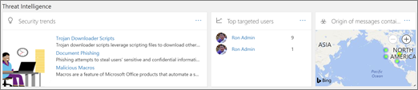

# Información general del panel de seguridadSecurity dashboard overview

La [seguridad &amp; centro de cumplimiento](go-to-the-securitycompliance-center.md) permite a su organización administrar la protección de datos y cumplimiento de normas. A partir de marzo de 2018, la seguridad &amp; un nuevo panel de seguridad que se puede usar para revisar el estado de protección de amenaza y ver y actuar en las alertas de seguridad sobre las características de centro de cumplimiento.The [Security &amp; Compliance Center](go-to-the-securitycompliance-center.md) enables your organization to manage data protection and compliance. Beginning in March 2018, the Security &amp; Compliance Center features a new Security Dashboard you can use to review your Threat Protection Status, and view and act on security alerts. 
  
Vea el vídeo para obtener una visión general y, a continuación, lea este artículo para obtener más información.Watch the video to get an overview, and then read this article to learn more.
  
> [!VIDEO https://www.microsoft.com/videoplayer/embed/3540b1f8-62d2-47fa-a07d-d7ad76f55b0f?autoplay=false]
  
Dependiendo de lo que incluye la suscripción de Office 365 de su organización, el panel de seguridad incluye las siguientes secciones:Depending on what your organization's Office 365 subscription includes, the Security Dashboard includes the following sections:
  
- [Estado de protección de amenazaThreat Protection Status](#threat-protection-status)
    
- [InformaciónInsights](#insights)
    
- [Información sobre amenazasThreat intelligence](#threat-intelligence)
    
- [TendenciasTrends](#trends)
    
Para ver el panel de seguridad, en la [Office 365 seguridad &amp; centro de cumplimiento](go-to-the-securitycompliance-center.md), vaya a **administración de amenaza** \> **panel**.To view the Security Dashboard, in the [Office 365 Security &amp; Compliance Center](go-to-the-securitycompliance-center.md), go to **Threat management** \> **Dashboard**.
  
> [!NOTE]
> Debe ser un administrador global de Office 365, un administrador de seguridad o un lector de seguridad para ver el panel de seguridad. Vea [permisos en la seguridad de Office 365 &amp; centro de cumplimiento](permissions-in-the-security-and-compliance-center.md).You must be an Office 365 global administrator, a security administrator, or a security reader to view the Security Dashboard. See [Permissions in the Office 365 Security &amp; Compliance Center](permissions-in-the-security-and-compliance-center.md). 
  
## Estado de protección de amenazaThreat Protection Status

En la esquina superior izquierda del panel de seguridad es un widget de estado de protección de amenaza que muestra la eficacia de la protección de amenaza. Este widget le indica de un vistazo cómo muchas de las amenazas se han bloqueado por [Office 365 Exchange Online Protection](anti-spam-protection.md) y [La protección de amenaza avanzada de Office 365](office-365-atp.md) (si está configurado) durante los últimos siete días. Este widget también muestra el número de mensajes de correo electrónico detectados como clasificación incorrecta y comunicarse mediante el que se [Use el complemento en el mensaje de informe](https://support.office.com/article/b5caa9f1-cdf3-4443-af8c-ff724ea719d2). Revise su contra correo no deseado, anti-malware y directivas contra suplantación de identidad para mejorar su configuración.In the upper left corner of the Security Dashboard is a Threat Protection Status widget that shows threat protection effectiveness. This widget tells you at a glance how many threats were blocked by [Office 365 Exchange Online Protection](anti-spam-protection.md) and [Office 365 Advanced Threat Protection](office-365-atp.md) (if configured) over the last seven days. This widget also shows the number of email messages detected as misclassified and reported by using the [Use the Report Message add-in](https://support.office.com/article/b5caa9f1-cdf3-4443-af8c-ff724ea719d2). Review your anti-spam, anti-malware, and anti-phishing policies to improve your configuration.
  

  
Además, los informes de Malware pueden usarse para realizar un seguimiento de las tendencias recientes en contenido malintencionado dirigidos a su organización. Haga clic en un mosaico para ver más información en el informe.In addition, Malware reports can be used to track recent trends in malicious content targeted at your organization. Click a tile to view more information in the report.
  
## EnfoquesInsights

Entendimiento de superficie no sólo las cuestiones clave que debe revisar, también incluyen recomendaciones y las acciones que se deben considerar. Por ejemplo, es posible que vea que se van a entregar los mensajes de correo electrónico de suplantación de identidad debido a que algunos usuarios deshabilitó sus opciones de correo electrónico no deseado. Para obtener más información acerca de cómo funcionan los conocimientos, vea [informes y conocimientos en la seguridad de Office 365 &amp; centro de cumplimiento](reports-and-insights-in-security-and-compliance.md).Insights not only surface key issues you should review, they also include recommendations and actions to consider. For example, you might see that phishing email messages are being delivered because some users have disabled their junk mail options. To learn more about how insights work, see [Reports and insights in the Office 365 Security &amp; Compliance Center](reports-and-insights-in-security-and-compliance.md).
  
## Información sobre amenazasThreat intelligence

Si su organización tiene [Información sobre amenazas de Office 365](office-365-ti.md), el panel de seguridad tiene una sección de **Información sobre amenazas** que incluye herramientas avanzadas. Equipo de seguridad de su organización puede usar la información de esta sección para comprender las campañas emergentes, investigar las amenazas y administrar los incidentes.If your organization has [Office 365 Threat Intelligence](office-365-ti.md), your Security Dashboard has a **Threat Intelligence** section that includes advanced tools. Your organization's security team can use the information in this section to understand emerging campaigns, investigate threats and manage incidents. 
  

  
> [!TIP]
> Información sobre amenazas de Office 365 se incluye con Office 365 Enterprise E5; Sin embargo, si su organización usa otra suscripción de Office 365 Enterprise, información sobre amenazas de Office 365 puede adquirirse como un complemento. Para obtener más información, vea [Información sobre amenazas de Office 365](office-365-ti.md).Office 365 Threat Intelligence is included with Office 365 Enterprise E5; however, if your organization is using another Office 365 Enterprise subscription, Office 365 Threat Intelligence can be purchased as an add-on. For more information, see [Office 365 Threat Intelligence](office-365-ti.md). 
  
## TendenciasTrends

Cerca de la parte inferior del panel de seguridad es una sección de **tendencias** , que se resume las tendencias de flujo de correo electrónico para su organización. Informes proporcionan información acerca del correo electrónico pueden clasificado como correo no deseado, malware, los intentos de suplantación de identidad y correo electrónico buena. Haga clic en un mosaico para ver información más detallada en el informe.Near the bottom of the Security Dashboard is a **Trends** section, which summarizes email flow trends for your organization. Reports provide information about email categorized as spam, malware, phishing attempts, and good email. Click a tile to view more detailed information in the report. 
  

  
Y, si la suscripción a Office 365 de su organización incluye [Información sobre amenazas de Office 365](office-365-ti.md), tendrá también un informe de **avisos de administración de amenazas recientes** en esta sección que permite al equipo de seguridad ver y tomar medidas en alta prioridad alertas de seguridad.And, if your organization's Office 365 subscription includes [Office 365 Threat Intelligence](office-365-ti.md), you will also have a **Recent threat management alerts** report in this section that enables your security team to view and take action on high-priority security alerts. 
  
## Temas relacionadosRelated topics

[Ver los informes de seguridad de correo electrónico de la seguridad &amp; centro de cumplimientoView email security reports in the Security &amp; Compliance Center](view-email-security-reports.md)
  
[Visualización de informes para la protección de amenaza avanzada de Office 365View reports for Office 365 Advanced Threat Protection](view-reports-for-atp.md)
  
[Protección contra amenazas avanzada de Office 365Office 365 Advanced Threat Protection](office-365-atp.md)
  
[Inteligencia sobre amenazas de Office 365Office 365 Threat Intelligence](office-365-ti.md)
  

