# Información general de etiquetas de confidencialidad

Para realizar su trabajo, los usuarios de su organización necesitan colaborar con otros usuarios, tanto dentro como fuera de la organización. Esto significa que el contenido ya no permanece detrás de un firewall: se mueve por todas partes, pasando por dispositivos, aplicaciones y servicios. Y cuando se mueve, quiere que sea de una forma segura y protegida que cumpla las directivas de cumplimiento y de empresa de su organización.

Con las etiquetas de confidencialidad en Office 365, puede clasificar y ayudar a proteger el contenido confidencial, sin poner impedimentos a la productividad y la capacidad de colaboración de los usuarios.

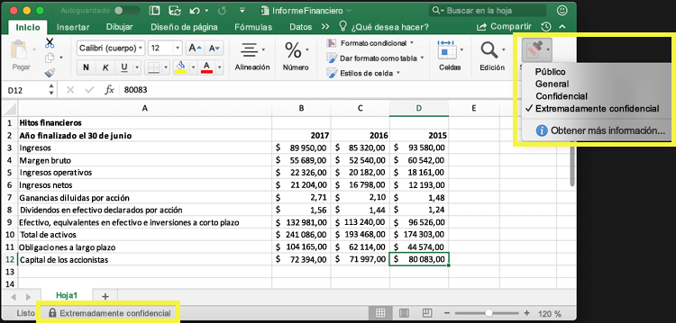

Puede usar etiquetas de confidencialidad para:
  
- **Aplicar opciones de protección como encriptación o marcas de agua en el contenido etiquetado.** Por ejemplo, los usuarios pueden aplicar una etiqueta Confidencial a un documento o correo electrónico, y esa etiqueta puede encriptar el contenido y aplicar una marca de agua Confidencial.    

- **Proteger el contenido en las aplicaciones de Office en varios dispositivos y plataformas diferentes.** Las etiquetas de confidencialidad funcionan en aplicaciones de Office en Windows, Mac, iOS y Android. La compatibilidad con aplicaciones web de Office estará disponible próximamente.
    
- **Evitar que el contenido confidencial salga de su organización en dispositivos con Windows** utilizando endpoint protection de Microsoft Intune. Después de aplicar una etiqueta de confidencialidad a un contenido que se encuentra en un dispositivo Windows, endpoint protection puede impedir que el contenido se copie en una aplicación de terceros, como Twitter o Gmail, o en un almacenamiento extraíble, como una unidad USB.

- **Extender las etiquetas de confidencialidad a servicios y aplicaciones de terceros.** Con el SDK de Microsoft Information Protection, los servicios y aplicaciones de terceros en Windows, Mac y Linux pueden leer las etiquetas de confidencialidad y aplicar la opciones de protección. La compatibilidad con aplicaciones para iOS y Android estará disponible próximamente.

- **Clasificar contenido sin usar ninguna configuración de protección.** También puede simplemente asignar una clasificación del contenido (como una etiqueta) que persiste y se desplaza con el contenido a medida que se usa y comparte. Puede usar esta clasificación para generar informes de uso y ver datos de actividad del contenido confidencial. Con esta información, siempre puede aplicar opciones de protección más tarde.
    
En todos estos casos, las etiquetas de confidencialidad de Office 365 pueden ayudarle a realizar las acciones adecuadas en el contenido adecuado. Con las etiquetas de confidencialidad, puede clasificar los datos de su organización para administrarlos mejor y aplicar configuraciones de protección basadas en esa clasificación.
  
Las etiquetas de confidencialidad se crean en el Centro de seguridad y cumplimiento de Office 365. El centro de seguridad y cumplimiento ahora es el único lugar para configurar las etiquetas y directivas de confidencialidad en Azure Information Protection y Office 365. Estas etiquetas de confidencialidad pueden usarse con Azure Information Protection, aplicaciones de Office y servicios de Office 365.

Para los clientes de Azure Information Protection, se pueden usar las etiquetas de Azure Information Protection en el centro de seguridad y cumplimiento, y las etiquetas se sincronizarán con Azure Portal en caso de que quiera añadir opciones adicionales o avanzadas. **Las etiquetas de Azure Information Protection y las etiquetas de confidencialidad de Office 365 son totalmente compatibles entre sí.** Esto significa que, por ejemplo, si tiene contenido con la etiqueta de Azure Information Protection, no tendrá que volver a clasificar o añadir etiquetas a su contenido.

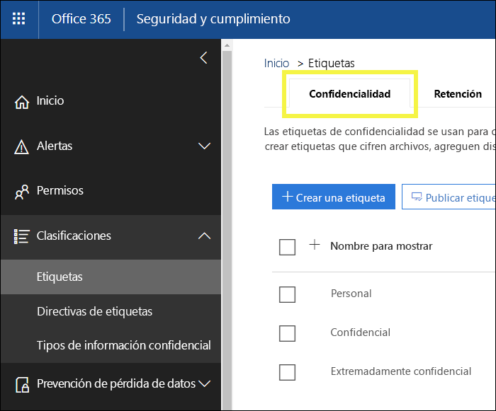

## Qué es una etiqueta de confidencialidad

Al asignar una etiqueta de confidencialidad a un documento o correo electrónico, es simplemente una etiqueta que:

- **Es personalizable. ** Puede crear categorías para distintos niveles de contenido confidencial en su organización, como Personal, Público, General, Confidencial y Extremadamente confidencial.

- **Tiene un texto no cifrado.** Ya que la etiqueta está en texto no cifrado, permite que las aplicaciones y servicios de terceros apliquen acciones de protección al contenido.

- **Es persistente.** Cuando se aplica una etiqueta de confidencialidad al contenido, se conserva en los metadatos de ese documento o correo electrónico. Esto significa que la etiqueta se mueve con el contenido, incluyendo la configuración de protección, y se convierte en la base para aplicar directivas.

En las aplicaciones de Office, una etiqueta de confidencialidad aparece simplemente como una etiqueta en un correo electrónico o documento.

Cada elemento de contenido puede tener una única etiqueta de confidencialidad aplicada. Tenga en cuenta que un elemento puede tener tanta una única etiqueta de confidencialidad como una única [etiqueta de retención](labels.md) aplicadas.

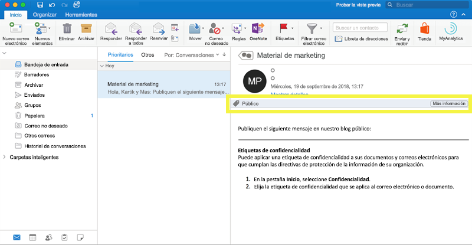

## Qué pueden hacer las etiquetas de confidencialidad

Después de aplicar una etiqueta de confidencialidad a un documento o correo electrónico, la configuración de protección de la etiqueta se aplica en el contenido. Con una etiqueta de confidencialidad, puede:

- **Encriptar** solo correo electrónico o correo electrónico y documentos. Puede elegir qué usuarios o grupos tienen permisos para realizar qué acciones y durante cuánto tiempo. Por ejemplo, puede permitir que los usuarios de un dominio específico fuera de su organización tengan permisos para revisar el contenido durante solo 7 días después de que se haya etiquetado el contenido. Para obtener más información, vea [Restringir el acceso al contenido mediante el cifrado en las etiquetas de confidencialidad](encryption-sensitivity-labels.md).

- **Marcar el contenido** agregando marcas de agua personalizadas, encabezados o pies de página a correos electrónicos o documentos a los que se ha aplicado la etiqueta. Tenga en cuenta que las marcas de agua se aplican únicamente a los documentos, no al correo electrónico, y están limitadas a 255 caracteres. Además, los encabezados y pies de página se limitan a 1024 caracteres (excepto en Excel, que están limitados a 255 caracteres o menos, en función de si el documento contiene otros encabezados o pies de página y de otros factores).

    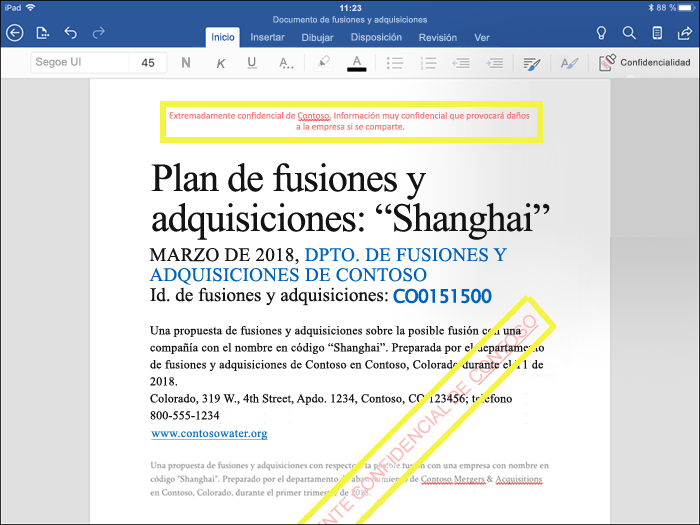

- 
  **Evitar la pérdida de datos** activando endpoint protection en Intune. Si se descarga el contenido confidencial, puede ayudar a evitar la pérdida de datos desde dispositivos Windows. Por ejemplo, no puede copiar contenido a Dropbox, Gmail o una unidad USB. Antes de que las etiquetas de confidencialidad puedan usar Windows Information Protection (WIP), primero debe crear una directiva de protección de aplicaciones en Azure Portal. Para obtener más información, vea [Cómo Windows Information Protection protege los archivos con una etiqueta de confidencialidad](https://docs.microsoft.com/en-us/windows/security/information-protection/windows-information-protection/how-wip-works-with-labels?branch=vsts17546553).

- **Aplicar la etiqueta automáticamente al contenido que contenga información confidencial.** Puede elegir el tipo de información confidencial que desee etiquetar y la etiqueta se puede aplicar automáticamente o, si lo prefiere, puede pedir a los usuarios que apliquen una etiqueta específica. Si recomienda una etiqueta, el aviso muestra el texto que elija. Para obtener más información, vea [Aplicar una etiqueta de contenido sensible automáticamente](apply_sensitivity_label_automatically.md).

    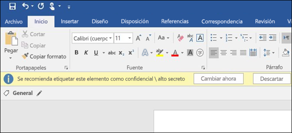

Todas estas opciones están disponibles cuando se crea una etiqueta en el Centro de seguridad y cumplimiento.

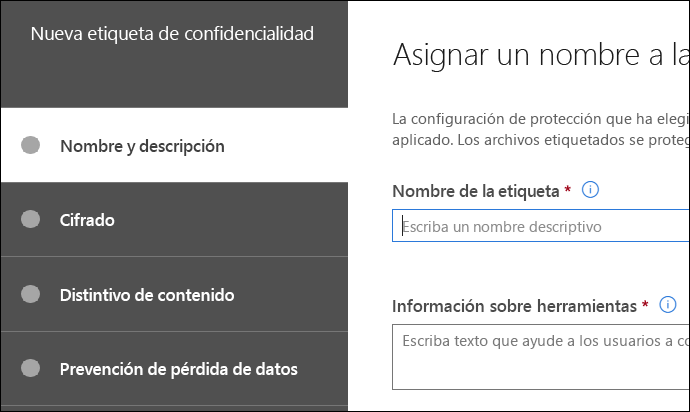

### Prioridad de etiqueta (el orden importa)

Al crear las etiquetas de confidencialidad en el Centro de cumplimiento y seguridad, aparecen en una lista en la pestaña **Confidencialidad** en la página **Etiquetas**. En esta lista, el orden de las etiquetas es importante, ya que refleja su prioridad. Lo ideal es que la etiqueta de confidencialidad más restrictiva, como Altamente confidencial, aparezca en la parte **inferior** de la lista y que la etiqueta de confidencialidad menos restrictiva, como Público, aparezca en la parte **superior**.

Un documento o correo electrónico puede tener solo una etiqueta de confidencialidad única aplicada. Si necesita que los usuarios proporcionen una justificación para cambiar la etiqueta a una clasificación inferior, el orden de la lista determina qué es una clasificación inferior.

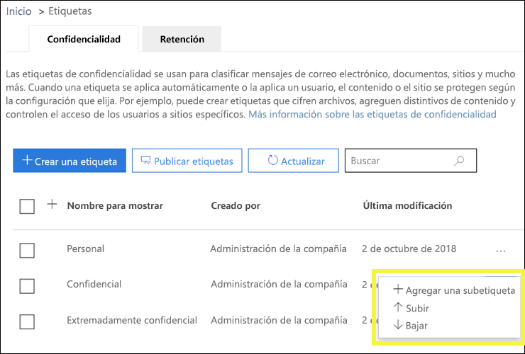

### Subetiquetas (agrupación de etiquetas)

Con las subetiquetas, puede agrupar una o varias etiquetas bajo un encabezado que un usuario vea en una aplicación de Office. Por ejemplo, bajo Confidencial, su organización puede usar varias etiquetas distintas para determinados tipos dentro de esa clasificación. En este ejemplo, la etiqueta Confidencial es simplemente una etiqueta de texto sin ninguna configuración de protección y, como contiene subetiquetas, no se puede aplicar al contenido. En su lugar, los usuarios deben elegir Confidencial para ver las subetiquetas y, a continuación, pueden elegir una subetiqueta para que se aplique al contenido.

Las subetiquetas son simplemente una forma de presentar etiquetas a los usuarios en grupos lógicos. Las subetiquetas no heredan ninguna configuración de la etiqueta bajo la que están.

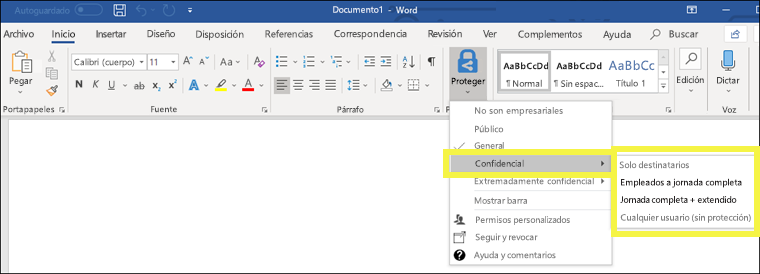

### Modificar o eliminar una etiqueta de confidencialidad

Si elimina una etiqueta de confidencialidad en el Centro de seguridad y cumplimiento, tenga en cuenta que no se quita la etiqueta del contenido y cualquier configuración de protección se seguirá aplicando al contenido.

Si edita una etiqueta de confidencialidad en el Centro de seguridad y cumplimiento, la versión de la etiqueta que se aplicó al contenido es la que se aplica a ese contenido.

## Qué pueden hacer las directivas de etiqueta

Después de crear las etiquetas de confidencialidad, deberá publicarlas para que estén disponibles para las personas de su organización, que podrán después aplicar las etiquetas al contenido. A diferencia de las etiquetas de retención, que se publican en ubicaciones, como en todos los buzones de Exchange, las etiquetas de confidencialidad se publican para usuarios o grupos. Las etiquetas de confidencialidad aparecerán entonces en las aplicaciones de Office para esos usuarios y grupos.

Con una directiva de etiqueta, puede:

- **Elegir qué usuarios y grupos ven las etiquetas.** Las etiquetas pueden publicarse en cualquier grupo de seguridad habilitado para correo electrónico, grupo de distribución, grupo de Office 365 o grupo de distribución dinámico.

- **Aplicar una etiqueta predeterminada** a todos los nuevos documentos y correos electrónicos creados por los usuarios y grupos incluidos en la directiva de etiqueta. Esta etiqueta predeterminada puede establecer un nivel base de configuración de protección que desee aplicar a todo su contenido.

- **Requerir una justificación para cambiar una etiqueta.** Si el contenido está marcado como Confidencial y un usuario desea quitar esa etiqueta o reemplazarla con una clasificación inferior, como una etiqueta denominada Público, puede hacer que el usuario necesite proporcionar una justificación para realizar esta acción. Estas justificaciones estarán disponibles para que el administrador las revise. Actualmente estamos trabajando en un informe en el que los administradores puedan ver las justificaciones de los usuarios.

    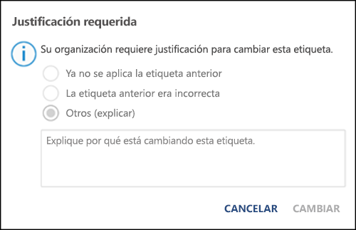

- **Requerir que los usuarios apliquen una etiqueta a su correo electrónico y documentos.** Si desea que todo el contenido de un usuario esté etiquetado, puede requerir que se aplique una etiqueta a todos los documentos guardados y correos electrónicos enviados. La etiqueta se puede asignar manualmente por el usuario de manera automática como resultado de una condición o se puede asignar de forma predeterminada (la opción de etiqueta predeterminada descrita anteriormente). Este es el aviso que aparece en Outlook cuando se pide a un usuario que asigne una etiqueta.

    > [!NOTE]
    > Para las etiquetas obligatorias se necesita una suscripción de Azure Information Protection. Para usar esta característica, necesita descargar e instalar el [cliente de Azure Information Protection](https://www.microsoft.com/en-us/download/details.aspx?id=53018) o el posterior [cliente de etiquetado unificado de Azure Information Protection](https://docs.microsoft.com/es-ES/azure/information-protection/rms-client/install-unifiedlabelingclient-app). Estamos trabajando en la compatibilidad nativa para esta característica en las aplicaciones de Office de forma que no sea necesario usar el cliente de etiquetado unificado de Azure Information Protection. Además, el cliente solo se ejecuta en Windows, por lo que esta característica aún no se admite en equipos Mac ni en dispositivos iOS y Android.

    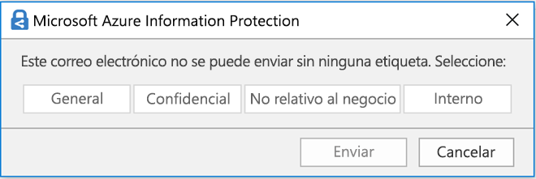

- **Proporcionar un vínculo de ayuda a una página de asistencia.** Si los usuarios no están seguros de lo que significan las etiquetas de confidencialidad o cómo deben usarse, puede proporcionar una URL con más información que aparecerá en la parte inferior del menú Etiqueta de confidencialidad en las aplicaciones de Office.

    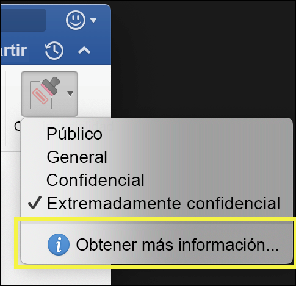

Después de crear una directiva de etiqueta y asignar etiquetas de confidencialidad a usuarios y grupos, dichos usuarios podrán ver esas etiquetas disponibles en las aplicaciones de Office en una hora o menos.

## Como comenzar

Comenzar a utilizar las etiquetas de confidencialidad es un proceso rápido:

1. **Defina las etiquetas.** En primer lugar, debe establecer una taxonomía para definir los diferentes niveles de contenido confidencial. Lo mejor es usar nombres o términos comunes que tengan sentido para los usuarios. Por ejemplo, puede empezar con etiquetas como Personal, Público, General, Confidencial y Extremadamente confidencial. Puede usar subetiquetas para agrupar etiquetas similares por categoría. Además, al crear una etiqueta, es necesario añadir una descripción emergente, que aparece en las aplicaciones de Office cuando un usuario pasa el cursor sobre una opción de etiqueta en la cinta de opciones.

1. **Defina qué puede hacer cada etiqueta.** Después, configure las opciones de protección que quiere asociar a cada etiqueta. Por ejemplo, el contenido con un nivel de confidencialidad menor (una etiqueta "General") podría simplemente tener un encabezado o pie de página aplicados, mientras que al contenido con un nivel de confidencialidad mayor (una etiqueta "Confidencial") se le podrían aplicar marcas de agua, encriptación y WIP para asegurarse de que solo los usuarios con privilegios pueden acceder a él.
 
1. **Defina quién obtiene las etiquetas.** Después de definir las etiquetas de su organización, se publican en una directiva de etiqueta que controla qué usuarios y grupos pueden ver esas etiquetas. Una misma etiqueta puede reutilizarse: defínala una vez y después podrá incluirla en varias directivas de etiqueta asignadas a diferentes usuarios. Pero para que una etiqueta pueda asignarse a un contenido, primero debe publicar dicha etiqueta para que esté disponible en las aplicaciones de Office y otros servicios. Si acaba de empezar, puede probar las etiquetas de confidencialidad asignándolas solo a unas pocas personas.

Aquí se muestran los pasos básicos que llevan a cabo el administrador, el usuario y la aplicación de Office para hacer funcionar las etiquetas de confidencialidad.

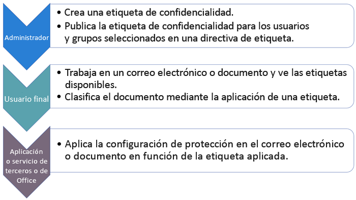

## Dónde pueden aparecer las etiquetas de confidencialidad

Las etiquetas de confidencialidad aparecen en la interfaz de usuario de las aplicaciones de Office. Para ver la disponibilidad actual en plataformas y aplicaciones específicas, consulte **[¿Dónde está disponible la característica actualmente?](https://support.office.com/es-ES/article/apply-sensitivity-labels-to-your-documents-and-email-within-office-2f96e7cd-d5a4-403b-8bd7-4cc636bae0f9?ad=US&ui=en-US&rs=en-US#bkmk_whereavailable)**

### Aplicaciones de Office en Windows

En aplicaciones de Office en dispositivos con Windows, las etiquetas de confidencialidad aparecen en el botón **Confidencialidad** en la pestaña **Inicio** en la cinta de opciones. La etiqueta aplicada también aparece en la barra de estado en la parte inferior de la ventana.

La compatibilidad nativa para etiquetas de confidencialidad en aplicaciones de Office en Windows estará disponible próximamente.

Si es cliente existente de Azure Information Protection, puede implementar el cliente de etiquetado unificado de Azure Information Protection, que es compatible con etiquetas de confidencialidad. Para obtener más información sobre cómo descargar el cliente, vea [Azure Information Protection unified labeling client: Version release information](https://docs.microsoft.com/es-ES/azure/information-protection/rms-client/unifiedlabelingclient-version-release-history) (Cliente de etiquetado unificado de Azure Information Protection: información sobre la publicación de versiones). Actualmente estamos trabajando en la compatibilidad nativa de etiquetas de confidencialidad en aplicaciones de Office en Windows, para que el cliente de etiquetado unificado de Azure Information Protection deje de ser necesario.

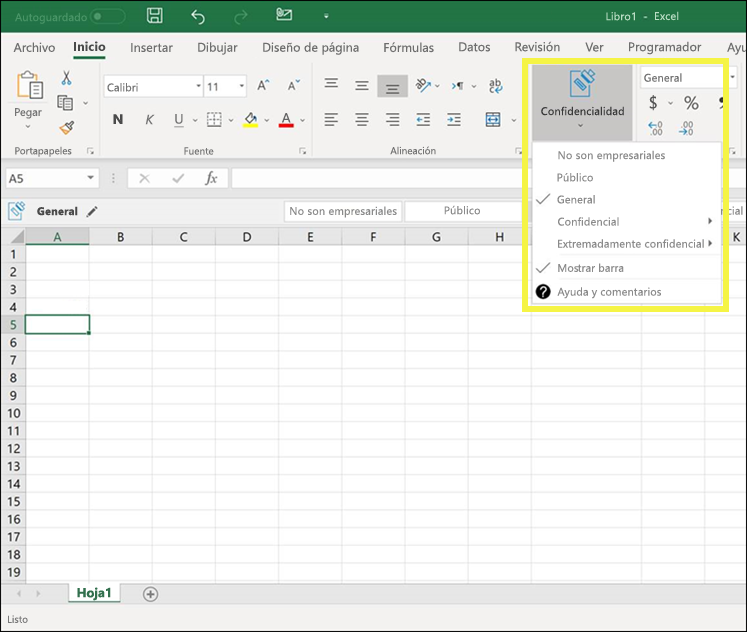

### Aplicaciones de Office en Mac

En aplicaciones de Office en dispositivos con Mac, las etiquetas de confidencialidad aparecen en el botón **Confidencialidad** en la pestaña **Inicio** en la cinta de opciones. La etiqueta aplicada también aparece en la barra de estado en la parte inferior de la ventana.

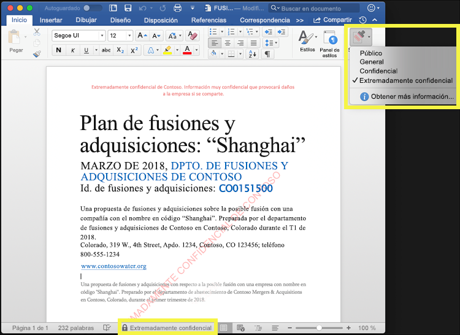

### Aplicaciones de Office en iOS

En aplicaciones de Office en dispositivos con iOS, las etiquetas de confidencialidad aparecen en el botón **Confidencialidad** en la pestaña **Inicio** en la cinta de opciones. La etiqueta aplicada también aparece en la barra de estado en la parte inferior de la ventana.

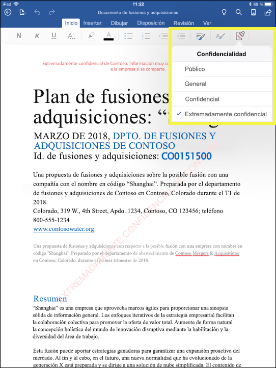

### Aplicaciones de Office en Android

En aplicaciones de Office en dispositivos con Android, las etiquetas de confidencialidad aparecen en el botón **Confidencialidad** en la pestaña **Inicio** en la cinta de opciones. La etiqueta aplicada también aparece en la barra de estado en la parte inferior de la ventana.

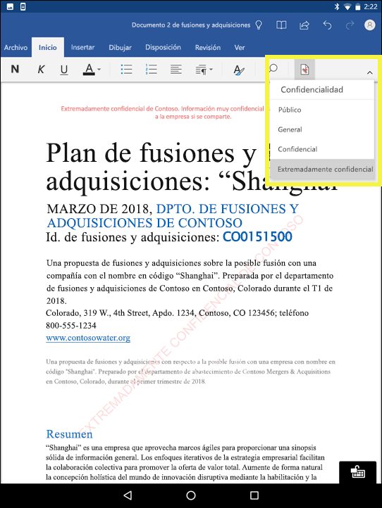

### Obtener más información sobre las etiquetas de confidencialidad en aplicaciones de Office

- [Aplicar etiquetas de confidencialidad en sus documentos y correo electrónico en Office](https://support.office.com/es-ES/article/apply-sensitivity-labels-to-your-documents-and-email-within-office-2f96e7cd-d5a4-403b-8bd7-4cc636bae0f9)
- [Problemas conocidos al aplicar etiquetas de confidencialidad en sus archivos de Office](https://support.office.com/es-ES/article/known-issues-when-you-apply-sensitivity-labels-to-your-office-files-b169d687-2bbd-4e21-a440-7da1b2743edc)

## Cómo funcionan las etiquetas de confidencialidad con etiquetas existentes de Azure Information Protection

Los usuarios de Azure Information Protection actualmente pueden clasificar y etiquetar contenido en Windows usando el cliente de etiquetado unificado de Azure Information Protection. Las etiquetas existentes de Azure Information Protection funcionan sin problemas con las nuevas etiquetas de confidencialidad. Esto significa que puede:

- Mantener las etiquetas existentes de Azure Information Protection en documentos y correos electrónicos.
- Mantener la configuración de etiquetas existente de Azure Information Protection.

Si usa etiquetas de Azure Information Protection, por ahora se recomienda evitar la creación de etiquetas nuevas en el Centro de seguridad y cumplimiento hasta que se haya completado la migración. El [tema de migración de Azure Information Protection](https://docs.microsoft.com/es-ES/azure/information-protection/configure-policy-migrate-labels) tiene información importante y algunas advertencias específicas. Si todavía no está listo para migrar los espacios empresariales de producción a las etiquetas de confidencialidad, no hay ningún motivo de preocupación: por el momento, los usuarios pueden seguir usando el cliente de Azure Information Protection y los administradores pueden seguir usando Azure Portal para la administración.

## Proteger el contenido en dispositivos Windows utilizando endpoint protection de Microsoft Intune

Al crear una etiqueta de confidencialidad, tiene la opción de indicar a Windows que los archivos con esta etiqueta son importantes y deben protegerse contra la pérdida de datos cuando se almacenen en dispositivos Windows. Esta opción puede ayudarle a garantizar que el contenido con esta etiqueta solo pueda compartirse o copiarse en ubicaciones autorizadas, incluso cuando está almacenado en un punto final. Básicamente, activar esta opción para una etiqueta de confidencialidad indica a Windows que se trata de datos especialmente críticos que requieren restricciones de uso adicionales.

Al activar esta opción, Windows puede leer, entender y actuar sobre las etiquetas de confidencialidad de documentos y aplicar automáticamente Windows Information Protection (WIP) en el contenido, independientemente de cómo llegue a un dispositivo administrado de Windows. Esto ayuda a proteger los archivos etiquetados de filtraciones accidentales, con encriptación o sin ella.

Por ejemplo, Windows puede comprender que un documento de Word que se encuentra en el equipo de un usuario tiene una etiqueta Confidencial aplicada y WIP puede aplicar una directiva de protección de aplicaciones para evitar que se copien o compartan los datos en cualquier ubicación no profesional desde ese dispositivo (como un OneDrive personal, cuentas de correo electrónico personales, redes sociales o unidades USB).

Si un usuario intenta cargar contenido con la etiqueta a una cuenta personal de Gmail, aparecerá este mensaje.

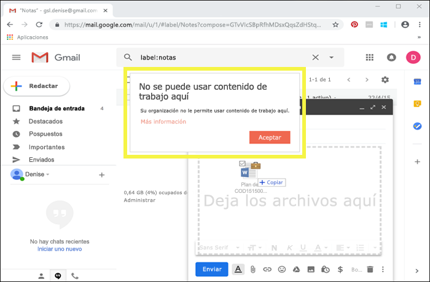

Y si un usuario intenta guardar contenido con la etiqueta en una unidad USB, aparecerá este mensaje.

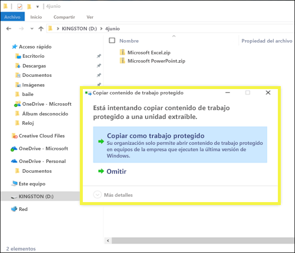

### Requisitos previos importantes

Para que las etiquetas de confidencialidad puedan usar WIP, primero debe realizar los requisitos previos que se describen aquí: [Cómo Windows Information Protection protege los archivos con una etiqueta de confidencialidad](https://docs.microsoft.com/en-us/windows/security/information-protection/windows-information-protection/how-wip-works-with-labels?branch=vsts17546553). En este tema se describen los siguientes requisitos previos:

- Asegúrese de que está ejecutando Windows 10, versión 1809 o posterior.
- [Configurar la Protección contra amenazas avanzada de Windows Defender (WDATP)](https://docs.microsoft.com/es-ES/windows/security/threat-protection/windows-defender-atp/get-started), que analiza el contenido de una etiqueta y aplica la protección WIP correspondiente. ATP realiza algunas acciones independientemente de WIP, como informar sobre anomalías.
- Crear una directiva de Windows Information Protection (WIP) que se aplica a dispositivos de punto final. Puede hacer esto en cualquiera de estas ubicaciones:
    - [Crear una directiva de Windows Information Protection (WIP) con MDM usando Azure Portal para Microsoft Intune](https://docs.microsoft.com/es-ES/windows/security/information-protection/windows-information-protection/create-wip-policy-using-intune-azure)
    - [Crear e implementar una directiva de Windows Information Protection (WIP) con System Center Configuration Manager](https://docs.microsoft.com/es-ES/windows/security/information-protection/windows-information-protection/create-wip-policy-using-sccm)

## Ampliar las etiquetas de confidencialidad a servicios y aplicaciones de terceros con el SDK de Microsoft Information Protection

Como una etiqueta de confidencialidad se almacena como texto no cifrado en los metadatos de un documento, los servicios y aplicaciones de terceros pueden decidir si identificar y proteger el contenido que está marcado con una etiqueta. La compatibilidad con otras aplicaciones y servicios siempre se encuentra en expansión.

Con el [SDK de Microsoft Information Protection](https://docs.microsoft.com/es-ES/information-protection/develop/), los servicios y aplicaciones de terceros pueden leer y aplicar etiquetas de confidencialidad y protección a los documentos. El SDK es compatible con aplicaciones de Windows, Mac y Linux. La compatibilidad con aplicaciones para iOS y Android estará disponible próximamente.

Con el SDK, puede etiquetar y proteger el contenido de forma que funcione con otras aplicaciones y servicios de Microsoft Information Protection, como aplicaciones de Office, servicios de Office 365, el escáner de Azure Information Protection, Microsoft Cloud App Security y otras soluciones de partners. Por ejemplo, obtenga más información sobre la [compatibilidad con etiquetas de confidencialidad de Adobe Acrobat](https://techcommunity.microsoft.com/t5/Azure-Information-Protection/Starting-October-use-Adobe-Acrobat-Reader-for-PDFs-protected-by/ba-p/262738).

Para obtener más información sobre el SDK de Microsoft Information Protection, consulte el [anuncio en el blog Tech Community](https://techcommunity.microsoft.com/t5/Microsoft-Information-Protection/Microsoft-Information-Protection-SDK-Now-Generally-Available/ba-p/263144). También puede consultar [soluciones de partners que se integran con Microsoft Information Protection](https://techcommunity.microsoft.com/t5/Azure-Information-Protection/Microsoft-Information-Protection-showcases-integrated-partner/ba-p/262657).

## Permisos

Los miembros de su equipo de cumplimiento normativo que vayan a crear etiquetas de confidencialidad necesitan permisos del Centro de seguridad y cumplimiento. De forma predeterminada, el administrador de espacios empresariales tendrá acceso a esta ubicación y puede proporcionar acceso a los responsables de cumplimiento y otros usuarios para el Centro de seguridad y cumplimiento sin darles todos los permisos de un administrador de espacios empresariales. Para ello, se recomienda ir a la página **Permisos** del Centro de seguridad y cumplimiento, editar el grupo de roles **Administrador de cumplimiento** y agregar miembros al mismo.

Para obtener más información, vea Conceder acceso a los usuarios al Centro de seguridad y cumplimiento de Office 365.

Estos permisos solo son necesarios para crear y aplicar una directiva de etiquetas. La aplicación de directivas no necesita acceso al contenido.
