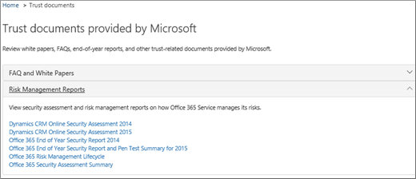

# Garantía del servicio en el centro de &amp; seguridad y cumplimiento de Office 365

Use garantía del servicio en el centro de &amp; seguridad y cumplimiento de Office 365 para obtener acceso a documentos que describen una variedad de temas, entre los que se incluyen: 
  
- Procedimientos de seguridad de Microsoft para datos de clientes que se almacenan en Office 365. 
    
- Informes de auditoría de terceros independientes de Office 365. 
    
- Detalles de implementación y pruebas de los controles de seguridad, privacidad y cumplimiento que Office 365 usa para proteger sus datos. 
    
También puede averiguar cómo Office 365 puede ayudar a los clientes a cumplir con los estándares, las leyes y las regulaciones en las industrias, como:
  
-  Organización Internacional de normalización (ISO) 27001 y 27018 
    
- Health Insurance Portability and Accountability Act of 1996 (HIPAA) (Ley de Responsabilidad y Transferibilidad del Seguro Médico de 1996, HIPAA)
    
- Programa de administración de riesgos y autorización Federal (FedRAMP)
    
## ¿Quién puede tener acceso a la garantía del servicio de Office 365 y cómo?

 **Nuevos clientes y clientes que evalúen Microsoft Online Services** puede tener acceso a la garantía del servicio que se incluye en los planes de Office 365 Enterprise E3 y E5 (tanto suscripciones de prueba como de pago). Si no tiene uno de estos planes y desea probar el servicio de garantía, puede [registrarse para obtener una versión de prueba de Office 365 Enterprise E5](https://go.microsoft.com/fwlink/p/?LinkID=698279). 
  
 **Los clientes existentes de Office 365 para empresas** pueden tener acceso al servicio de garantía del servicio. Si es el administrador global de Office 365 (a veces llamado administrador de la compañía) de su organización, ya tendrá acceso a la garantía del servicio y podrá incorporar otros. Si no es el administrador global de Office 365 de su organización y necesita obtener acceso a garantía del servicio, pida al administrador que le agregue al grupo de roles de usuario de garantía del servicio. 
  
 De forma predeterminada, los **miembros de suscripción de O365** pueden obtener acceso a la sección Garantía del servicio en el centro de protección de Office365 si no se ha implementado el acceso basado en roles del servicio de seguridad en la suscripción. Garantía del servicio proporciona informes y documentos que describen los procedimientos de seguridad de Microsoft para los datos de clientes almacenados en Office 365. También proporciona informes de auditoría de terceros independientes en Office 365. 
  
> [!NOTE]
> Nota: Si su compañía ha implementado acceso basado en roles de garantía de servicio en su suscripción de Office 365 (que podría ser si se ha proporcionado acceso a informes personalizados a su organización) y necesita acceso a garantía del servicio, pero no está incluido en la parte izquierda panel del centro de &amp; seguridad y cumplimiento, pida al administrador de Office 365 que le agregue al grupo de roles de usuario de garantía del servicio en la página **permisos** . Para obtener más información, consulte incorporar otros usuarios o grupos de garantía del servicio. 
  
 **Acceso basado en roles de servicios de garantía de servicio: usuarios aprovisionados** Si su empresa ha implementado acceso basado en roles de garantía de servicios, puede proporcionar acceso al servicio de seguridad a todo el personal de seguridad y cumplimiento, incluidos los equipos de seguridad de la información, la administración de riesgos, el cumplimiento y los equipos de auditoría y el personal de su Organization. Para obtener más información, consulte [incorporar otros usuarios o grupos de garantía del servicio](service-assurance.md#addother).
  
La garantía del servicio es accesible mediante el &amp; centro de seguridad y cumplimiento. Esta es la manera de acceder a.
  
1. Vaya a [https://protection.office.com](https://protection.office.com).
    
2. Inicie sesión en Office 365 con su cuenta profesional o educativa. 
    
3. En el panel izquierdo, seleccione **garantía del servicio**. A continuación, [Elija la configuración regional y del sector](service-assurance.md#Chooseyourindustryregional) y [incorpore otros grupos o usuarios de garantía del servicio](service-assurance.md#addother).
    
    > [!NOTE]
    > Si necesita tener acceso a garantía del servicio y no se incluye en el panel izquierdo del centro de seguridad &amp; y cumplimiento, solicite al administrador de Office 365 que le agregue al grupo de roles de usuario de garantía del servicio en la página **permisos** . 
  
## Elegir la configuración regional y del sector

Al obtener acceso al servicio de garantía del servicio por primera vez, el primer paso es configurar la configuración regional y del sector. Puede cambiar esta configuración en cualquier momento. La configuración de estas opciones permite que el servicio de garantía del servicio le proporcione contenido que sea más relevante para su organización. Para configurar la configuración de la industria y la región:
  
1. Después de acceder a garantía del servicio, seleccione **configuración** y la página Configuración regional y de la industria se muestra como se muestra en la siguiente captura de pantalla. 
    
    
  
2. En la página **configuración** , seleccione la flecha abajo situada junto a **región** y compruebe las regiones adecuadas para su organización. 
    
3. Seleccione la flecha hacia abajo situada junto a **sector** y compruebe las industrias adecuadas para su organización. 
    
4. Una vez que haya seleccionado regiones y sectores, seleccione **Guardar**.
    
## Buscar, revisar y descargar contenido de confianza y cumplimiento

Para revisar y descargar contenido, seleccione una opción en el panel de navegación:
  
- **Informes de cumplimiento** para ver las auditorías independientes y las evaluaciones de Office 365 y otros servicios en la nube de Microsoft, tal como se muestra en la siguiente captura de pantalla. 
    
    
  
- **Confiar** en los documentos para ver información sobre cómo Microsoft opera Office 365 como se muestra en la siguiente captura de pantalla. 
    
    
  
- **Controles auditados** para ver información acerca de cómo Office 365 controla los requisitos de seguridad, cumplimiento y privacidad, tal como se muestra en la siguiente captura de pantalla. 
    
    
  
Seleccione el informe que desee descargar y seleccione **Guardar** para descargarlo en el equipo. Para los controles auditados, seleccione el informe que desee y, a continuación, seleccione **Descargar**. En la tabla siguiente se describen los informes que puede encontrar en cada página de garantía del servicio. 
  
> [!NOTE]
> Los informes y documentos de garantía del servicio están disponibles para su descarga durante al menos doce meses después de su publicación o hasta que esté disponible una nueva versión del documento. 
  
|**Página de garantía del servicio**|**Contenido disponible**|**Descripción**|
|:-----|:-----|:-----|
|Informes de cumplimiento    | FedRamp     Evaluación de GRC     MÉTRICA     SOC/SSAE    |Use los informes de cumplimiento de servicios para revisar las evaluaciones de auditoría realizadas por auditores independientes de terceros de las operaciones de entrega de servicio de Office 365.    |
|Documentos de confianza    | Preguntas más frecuentes y notas del producto     Informes de administración de riesgos    |Use notas del producto, preguntas más frecuentes, informes de fin de año y otros recursos de Microsoft Confidential que están disponibles en el acuerdo de no divulgación para sus evaluaciones de riesgos y revisión.    |
|Controles auditados    |Estándares y normativas globales que Office 365 ha implementado.    | Ayuda con la evaluación de riesgos cuando está evaluando, incorporando o usando los servicios de Office 365. Descubra lo siguiente:     -Cómo los controles de Office 365 cumplen los requisitos de seguridad, cumplimiento y privacidad.   -Acerca de la prueba de controles en Office 365, los resultados de estas pruebas y cuándo se completaron.    |
   
En función de su configuración específica, las opciones incluidas en la vista pueden tener algunas diferencias.
  
## Otros usuarios o grupos de garantía del servicio incorporados

Para obtener acceso a los informes predeterminados que están disponibles en general en todas las suscripciones a la nube de Microsoft, no es necesario que implemente el modelo de acceso basado en roles de garantía de servicios y puede omitir este paso. Sin embargo, si se ha proporcionado a su organización acceso a los informes personalizados, agregue otros usuarios o grupos a los roles de garantía del servicio. Para agregar otros usuarios o grupos:
  
1. En el centro &amp; de seguridad y cumplimiento, seleccione **permisos** en el panel izquierdo, tal y como se muestra en la siguiente captura de pantalla. 
    
    
  
2. En el panel derecho, seleccione **usuario de garantía del servicio**y, a continuación, seleccione **Editar Grupo de roles**y, en la sección **miembros** , seleccione **Editar** para agregar miembros al rol de usuario de garantía del servicio, como se muestra en la siguiente captura de pantalla. 
    
    
  
3. En el siguiente cuadro de diálogo, busque y elija individuos o grupos que necesiten ver los informes de cumplimiento de garantía del servicio y los recursos de confianza y, a continuación, seleccione **Agregar** para cada selección que realice y haga clic en la **X** en la esquina superior derecha del panel cuando haya terminado. 
    
    
  
4. Cada usuario o grupo que haya agregado al rol de usuario de garantía del servicio puede encontrar ahora garantía del servicio y descargar informes y otros documentos &amp; en el centro de seguridad y cumplimiento.
    
Vuelva a la página de **permisos** en cualquier momento para agregar más usuarios o quitar otros existentes. 
  
## Obtener ayuda con la garantía del servicio

[Póngase en contacto con soporte técnico para productos empresariales: ayuda para administradores](https://support.office.com/article/32a17ca7-6fa0-4870-8a8d-e25ba4ccfd4b).
  
## Preguntas más frecuentes

 **¿Por qué obtengo un error que indica que los documentos de garantía del servicio están dañados?**
  
La mayoría de los documentos de garantía del servicio están en formato PDF. Elija **Guardar** para guardar estos archivos en y, a continuación, ábralos en el equipo local. 
