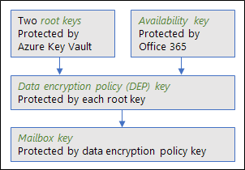

# <a name="service-encryption-with-customer-key-for-office-365-faq"></a><span data-ttu-id="9bf3a-104">Preguntas más frecuentes sobre el cifrado de servicio con la clave de cliente para Office 365</span><span class="sxs-lookup"><span data-stu-id="9bf3a-104">Service encryption with Customer Key for Office 365 FAQ</span></span>

<span data-ttu-id="9bf3a-p102">Además de la línea de base, el cifrado de nivel de volumen que se ha habilitado a través de BitLocker y Administrador de clave distribuida (DKM), Office 365 ofrece un nivel adicional de cifrado en el nivel de aplicación para el contenido de cliente de Office 365, incluidos los datos de Exchange En línea, Skype para la empresa, SharePoint Online y OneDrive para la empresa. Esto se denomina cifrado de servicio.</span><span class="sxs-lookup"><span data-stu-id="9bf3a-p102">In addition to the baseline, volume-level encryption that's enabled through BitLocker and Distributed Key Manager (DKM), Office 365 offers an added layer of encryption at the application level for customer content in Office 365, including data from Exchange Online, Skype for Business, SharePoint Online, and OneDrive for Business. This is called service encryption.</span></span>
  
<span data-ttu-id="9bf3a-p103">Clave de cliente se basa en el cifrado de servicio y permite al usuario para proporcionar y teclas de control que se usan para cifrar los datos en reposo en Office 365, tal como se describe en los [Términos de servicios en línea (OST)](https://www.microsoft.com/en-us/Licensing/product-licensing/products.aspx). Clave de cliente le ayudará a cumplir las obligaciones de cumplimiento de normas debido a que controlan las claves de cifrado que usa Office 365 para descifrar los datos.</span><span class="sxs-lookup"><span data-stu-id="9bf3a-p103">Customer Key is built on service encryption and enables you to provide and control keys that are used to encrypt your data at rest in Office 365 as described in the [Online Services Terms (OST)](https://www.microsoft.com/en-us/Licensing/product-licensing/products.aspx). Customer Key helps you meet compliance obligations because you control the encryption keys that Office 365 uses to decrypt data.</span></span>
  
<span data-ttu-id="9bf3a-109">Para proporcionar comentarios en la clave del cliente, incluida la documentación, envíe sus ideas, sugerencias y perspectivas a customerkeyfeedback@microsoft.com.</span><span class="sxs-lookup"><span data-stu-id="9bf3a-109">To provide feedback on Customer Key, including the documentation, send your ideas, suggestions, and perspectives to customerkeyfeedback@microsoft.com.</span></span>
  
## <a name="what-is-service-encryption-with-customer-key"></a><span data-ttu-id="9bf3a-110">¿Qué es el cifrado de servicio con la clave de cliente?</span><span class="sxs-lookup"><span data-stu-id="9bf3a-110">What is service encryption with Customer Key?</span></span>

<span data-ttu-id="9bf3a-p104">Clave de cliente es una característica que le permite aprovisionar y administrar las claves utilizadas para cifrar datos en reposo en Office 365. La característica aprovecha el cifrado de servicio, que es el cifrado que se lleva a cabo por Office 365 Exchange y SharePoint. Cifrado de servicio proporciona las ventajas más allá de lo que BitLocker puede proporcionar - es decir, mayor defensa en profundidad contra los atacantes. Cifrado de servicio es una contramedida segura si un atacante intenta omitir el sistema de control de acceso de Office 365 que se utiliza para procesar todas las solicitudes de acceso a datos de clientes. Esto es debido a que el cifrado de servicio significa que un administrador del servidor no tiene control o incluso obtener acceso a cifrado de claves y no puede deshabilitar el cifrado, a diferencia de con BitLocker. Por lo tanto, un atacante con acceso administrativo a un servidor que hospeda los datos de cliente que se cifró mediante el cifrado de servicio no podrá leer los datos del cliente e incluso si los datos cifrados se copian desactiva el servidor permanecerá inútil.</span><span class="sxs-lookup"><span data-stu-id="9bf3a-p104">Customer Key is a feature that allows you to provision and manage the keys used to encrypt data at rest in Office 365. The feature leverages service encryption, which is encryption that is performed by Office 365 Exchange and SharePoint. Service encryption provides advantages beyond what BitLocker can provide - namely, greater defense-in-depth against attackers. Service encryption is a strong countermeasure if an attacker attempts to bypass the Office 365 access control system that is used to process all requests for access to customer data. This is because service encryption means that a server administrator does not have control or even access to encryption keys and cannot disable encryption, unlike with BitLocker. Therefore, an attacker with administrative access to a server hosting customer data that was encrypted using service encryption will not be able to read the customer data and even if the encrypted data is copied off the server it will remain useless.</span></span> 
  
## <a name="what-office-365-data-at-rest-is-covered-by-customer-key"></a><span data-ttu-id="9bf3a-117">¿Qué datos Office 365 en reposo está cubiertas por clave de cliente?</span><span class="sxs-lookup"><span data-stu-id="9bf3a-117">What Office 365 data at rest is covered by Customer Key?</span></span>
<span data-ttu-id="9bf3a-118"><a name="WhatDataIsCoveredbyCustomerKey"> </a></span><span class="sxs-lookup"><span data-stu-id="9bf3a-118"></span></span>

<span data-ttu-id="9bf3a-p105">Se incluyen el contenido del sitio de SharePoint Online y los archivos almacenados en ese sitio y los archivos cargados en OneDrive para la empresa. Se trata el contenido del buzón Exchange Online (cuerpo del correo electrónico, las entradas de calendario y contenido de datos adjuntos de correo electrónico). Se tratan las conversaciones de texto de Skype para la empresa, pero no se tratan las grabaciones de reunión Difundir presentación de Skype y cargas de contenido de reuniones de Skype. Difundir presentación de reunión de Skype y Skype reunión cargas de contenido se cifran junto con el resto del contenido en Office 365, pero que actualmente no ofrecemos control de cliente de las claves de cifrado.</span><span class="sxs-lookup"><span data-stu-id="9bf3a-p105">SharePoint Online site content and the files stored on that site and files uploaded to OneDrive for Business are covered. Exchange Online mailbox content (e-mail body, calendar entries, and content of email attachments) is covered. Text conversations from Skype for Business are covered, but Skype Meeting Broadcast recordings and Skype Meeting content uploads are not covered. Skype Meeting Broadcast and Skype Meeting content uploads are encrypted along with all other content in Office 365, but we currently don't offer customer control of the encryption keys.</span></span>
  
## <a name="what-is-the-difference-between-customer-key-and-bring-your-own-key-byok-with-azure-information-protection-for-exchange-online"></a><span data-ttu-id="9bf3a-123">¿Cuál es la diferencia entre la clave de cliente y traer su propia clave (BYOK) con protección de la información de Azure para Exchange Online?</span><span class="sxs-lookup"><span data-stu-id="9bf3a-123">What is the difference between Customer Key and Bring Your Own Key (BYOK) with Azure Information Protection for Exchange Online?</span></span>
<span data-ttu-id="9bf3a-124"><a name="DiffCustomerKeyandBYOKAzureIP"> </a></span><span class="sxs-lookup"><span data-stu-id="9bf3a-124"></span></span>

<span data-ttu-id="9bf3a-p106">Ambas opciones le permiten proporcionar y controlar sus propios claves de cifrado; Sin embargo, el cifrado de servicio con la clave de cliente cifra los datos en reposo, que reside en los servidores de los Office 365 en rest, mientras que BYOK con protección de la información de Azure para Exchange Online cifra los datos en tránsito y proporciona persistente en línea y sin conexión protección de mensajes de correo electrónico y los datos adjuntos para Office 365. Clave de cliente y BYOK con protección de la información de Azure para Exchange Online son complementarias y, si decide usar claves de administrados por el servicio de Microsoft o su propio, cifrar los datos en reposo y en tránsito puede ofrecer una protección adicional de ataques malintencionados.</span><span class="sxs-lookup"><span data-stu-id="9bf3a-p106">Both options enable you to provide and control your own encryption keys; however, service encryption with Customer Key encrypts your data at rest, residing in Office 365 servers at-rest, while BYOK with Azure Information Protection for Exchange Online encrypts your data-in-transit and provides persistent online and offline protection for email messages and attachments for Office 365. Customer Key and BYOK with Azure Information Protection for Exchange Online are complementary, and whether you choose to use Microsoft's service-managed keys or your own keys, encrypting your data-at-rest and in-transit can provide added protection from malicious attacks.</span></span>
  
<span data-ttu-id="9bf3a-127">BYOK con protección de la información de Azure para Exchange Online está disponible en las capacidades de cifrado de mensajes de Office 365.</span><span class="sxs-lookup"><span data-stu-id="9bf3a-127">BYOK with Azure Information Protection for Exchange Online is offered in the Office 365 Message Encryption capabilities.</span></span>
  
## <a name="does-office-365-message-encryption-and-bring-your-own-key-with-azure-information-protection-change-microsofts-approach-to-third-party-data-requests-such-as-subpoenas"></a><span data-ttu-id="9bf3a-128">¿El cifrado de mensajes de Office 365 y traer su propia clave con protección de la información de Azure cambia el enfoque de Microsoft a las solicitudes de datos de terceros, como su orden?</span><span class="sxs-lookup"><span data-stu-id="9bf3a-128">Does Office 365 Message Encryption and Bring Your Own Key with Azure Information Protection change Microsoft's approach to third-party data requests such as subpoenas?</span></span>
<span data-ttu-id="9bf3a-129"><a name="DiffCustomerKeyandBYOKAzureIP"> </a></span><span class="sxs-lookup"><span data-stu-id="9bf3a-129"></span></span>

<span data-ttu-id="9bf3a-p107">No. Cifrado de mensajes de Office 365 y la opción para ofrecer y controlar sus propios claves de cifrado con Traer su propia clave (BYOK) para protección de información de Azure (AIP) no se ha diseñado para responder a su orden de aplicación de la legislación. Cifrado de mensajes de Office 365 con BYOK para AIP se diseñó para cumplimiento dirigidos a los clientes que necesitan para cumplir sus obligaciones de cumplimiento interno o externo. Microsoft toma muy en serio las solicitudes de terceros para los datos de cliente. Como un proveedor de servicios en la nube, siempre se recomiendan para la privacidad de los datos de cliente. En el caso de que se obtenga una citación, intentaremos siempre redirigir el tercero al cliente para obtener la información. (Lea el blog de Brad Smith: [Protecting los datos de cliente de gobierno fisgonear](https://blogs.microsoft.com/blog/2013/12/04/protecting-customer-data-from-government-snooping/)). Periódicamente se publica información detallada de la solicitud que recibimos [aquí](https://www.microsoft.com/en-us/trustcenter/Privacy/govt-requests-for-data).</span><span class="sxs-lookup"><span data-stu-id="9bf3a-p107">No. Office 365 Message Encryption and the option to provide and control your own encryption keys with Bring Your Own Key (BYOK) for Azure Information Protection (AIP) was not designed to respond to law enforcement subpoenas. Office 365 Message Encryption with BYOK for AIP was designed for compliance focused customers that need to meet their internal or external compliance obligations. Microsoft takes third-party requests for customer data very seriously. As a cloud service provider, we always advocate for the privacy of customer data. In the event we get a subpoena, we always attempt to redirect the third party to the customer to obtain the information. (Please read Brad Smith's blog: [Protecting customer data from government snooping](https://blogs.microsoft.com/blog/2013/12/04/protecting-customer-data-from-government-snooping/)). We periodically publish detailed information of the request we receive [here](https://www.microsoft.com/en-us/trustcenter/Privacy/govt-requests-for-data).</span></span>
  
<span data-ttu-id="9bf3a-138">Consulte el [Centro de confianza de Microsoft](https://www.microsoft.com/en-us/trustcenter/default.aspx) con respecto a las solicitudes de datos de terceros y "Divulgación de datos de clientes" en [Términos de servicios en línea (OST) ](https://www.microsoft.com/en-us/Licensing/product-licensing/products.aspx)para obtener más información.</span><span class="sxs-lookup"><span data-stu-id="9bf3a-138">See the [Microsoft Trust Center](https://www.microsoft.com/en-us/trustcenter/default.aspx) regarding third-party data requests and "Disclosure of Customer Data" in the [Online Services Terms (OST) ](https://www.microsoft.com/en-us/Licensing/product-licensing/products.aspx)for more information.</span></span>
  
## <a name="does-service-encryption-with-customer-key-change-microsofts-approach-to-third-party-data-requests-such-as-subpoenas"></a><span data-ttu-id="9bf3a-139">¿Cifrado de servicio con la clave de cliente cambia el enfoque de Microsoft para las solicitudes de datos de terceros, como su orden?</span><span class="sxs-lookup"><span data-stu-id="9bf3a-139">Does service encryption with Customer Key change Microsoft's approach to third-party data requests such as subpoenas?</span></span>
<span data-ttu-id="9bf3a-140"><a name="DiffCustomerKeyandBYOKAzureIP"> </a></span><span class="sxs-lookup"><span data-stu-id="9bf3a-140"></span></span>

<span data-ttu-id="9bf3a-p108">No. Clave de cliente no se diseñó para responder a su orden de aplicación de la legislación. Se diseñó para que los clientes regulados cumplir sus obligaciones de cumplimiento interno o externo. Microsoft toma muy en serio las solicitudes de terceros para los datos de cliente. Como un proveedor de servicios en la nube, siempre se recomiendan para la privacidad de los datos de cliente. En el caso de que se obtenga una citación, intentaremos siempre redirigir el tercero al cliente para obtener la información. (Lea el blog de Brad Smith: [Protecting los datos de cliente de gobierno fisgonear](http://blogs.microsoft.com/blog/2013/12/04/protecting-customer-data-from-government-snooping/)). Periódicamente se publica información detallada de la solicitud que recibimos [aquí](https://www.microsoft.com/en-us/trustcenter/Privacy/govt-requests-for-data).</span><span class="sxs-lookup"><span data-stu-id="9bf3a-p108">No. Customer Key was not designed to respond to law enforcement subpoenas. It was designed for regulated customers to meet their internal or external compliance obligations. Microsoft takes third-party requests for customer data very seriously. As a cloud service provider, we always advocate for the privacy of customer data. In the event we get a subpoena, we always attempt to redirect the third party to the customer to obtain the information. (Please read Brad Smith's blog: [Protecting customer data from government snooping](http://blogs.microsoft.com/blog/2013/12/04/protecting-customer-data-from-government-snooping/)). We periodically publish detailed information of the request we receive [here](https://www.microsoft.com/en-us/trustcenter/Privacy/govt-requests-for-data).</span></span>
  
<span data-ttu-id="9bf3a-149">Consulte el [Centro de confianza de Microsoft](https://www.microsoft.com/en-us/trustcenter/Privacy/govt-requests-for-data) con respecto a las solicitudes de datos de terceros y "Divulgación de datos de clientes" en [Términos de servicios en línea (OST)](https://www.microsoft.com/en-us/Licensing/product-licensing/products.aspx) para obtener más información.</span><span class="sxs-lookup"><span data-stu-id="9bf3a-149">See the [Microsoft Trust Center](https://www.microsoft.com/en-us/trustcenter/Privacy/govt-requests-for-data) regarding third-party data requests and "Disclosure of Customer Data" in the [Online Services Terms (OST)](https://www.microsoft.com/en-us/Licensing/product-licensing/products.aspx) for more information.</span></span> 
  
## <a name="is-fasttrack-support-available-for-implementing-customer-key"></a><span data-ttu-id="9bf3a-150">¿Es el soporte de FastTrack disponibles para implementar la clave de cliente?</span><span class="sxs-lookup"><span data-stu-id="9bf3a-150">Is FastTrack support available for implementing Customer Key?</span></span>
<span data-ttu-id="9bf3a-151"><a name="DiffCustomerKeyandBYOKAzureIP"> </a></span><span class="sxs-lookup"><span data-stu-id="9bf3a-151"></span></span>

<span data-ttu-id="9bf3a-p109">No. FastTrack solo se usa para recopilar información de configuración de inquilino y servicio que se necesita para registrar para la clave de cliente. La clave de cliente ofrece se publican a través de FastTrack, por lo que es conveniente para los clientes y socios enviar esta información necesaria con el mismo método y para facilitar los datos que proporcionan los clientes en la oferta de archivado.</span><span class="sxs-lookup"><span data-stu-id="9bf3a-p109">No. FastTrack is only used to collect tenant and service configuration information that is required to register for Customer Key. The Customer Key Offers are published via FastTrack so that it is convenient for customers and partners to submit this required information using the same method and for ease of archiving the data that customers provide in the Offer.</span></span>
  
<span data-ttu-id="9bf3a-155">Si necesita compatibilidad adicional más allá de la documentación, póngase en contacto con los servicios de consultoría de Microsoft (MCS), ingeniería de campo Premier (PFE) o un socio de Microsoft para obtener ayuda.</span><span class="sxs-lookup"><span data-stu-id="9bf3a-155">If you need additional support beyond the documentation, contact Microsoft Consulting Services (MCS), Premier Field Engineering (PFE), or a Microsoft partner for assistance.</span></span>
  
## <a name="if-my-keys-are-destroyed-how-can-i-recover"></a><span data-ttu-id="9bf3a-156">Si se destruyen Mis claves, ¿cómo puedo recuperar?</span><span class="sxs-lookup"><span data-stu-id="9bf3a-156">If my keys are destroyed, how can I recover?</span></span>
<span data-ttu-id="9bf3a-157"><a name="DiffCustomerKeyandBYOKAzureIP"> </a></span><span class="sxs-lookup"><span data-stu-id="9bf3a-157"></span></span>

<span data-ttu-id="9bf3a-p110">La clave de disponibilidad le proporciona la capacidad de recuperarse de la pérdida de claves raíz que administre consecuencias. Si pierde las claves raíz, contacto Microsoft Support y Microsoft le ayudará a través del proceso de la habilitación de la clave de disponibilidad. Para migrar a una nueva directiva de cifrado de datos con claves nuevas aprovisionadas por usted, debe usar la clave de disponibilidad.</span><span class="sxs-lookup"><span data-stu-id="9bf3a-p110">The availability key provides you with the capability to recover from the unanticipated loss of root keys that you manage. If you lose your root keys, contact Microsoft Support and Microsoft will assist you through the process of enabling the availability key. You'll use the availability key to migrate to a new Data Encryption Policy with new keys provisioned by you.</span></span> 
  
## <a name="what-is-the-availability-key"></a><span data-ttu-id="9bf3a-161">¿Qué es la clave de disponibilidad?</span><span class="sxs-lookup"><span data-stu-id="9bf3a-161">What is the availability key?</span></span>
<span data-ttu-id="9bf3a-162"><a name="DiffCustomerKeyandBYOKAzureIP"> </a></span><span class="sxs-lookup"><span data-stu-id="9bf3a-162"></span></span>

<span data-ttu-id="9bf3a-p111">La clave de disponibilidad es una clave de raíz que se ha suministrado al crear una directiva de cifrado de datos. La clave de disponibilidad se almacenan y protegida incluido en Office 365 y es funcionalmente similar a las claves dos raíz suministradas por el usuario para su uso con el cifrado de servicio con la clave de cliente. A diferencia de las claves que puede proporciona y administrar en Azure clave depósito, no se puede tener acceso directamente a la clave de disponibilidad. Almacenamiento y control de la clave de disponibilidad son deliberadamente diferentes de las claves de Azure clave cámara por tres motivos: en primer lugar, la clave de disponibilidad proporciona una capacidad de alta disponibilidad en caso de que los servicios de Office 365 están no puede alcanzar claves hospedadas en clave de Azure Cámara; en segundo lugar, proporciona una capacidad "romper vasos" en la clave de disponibilidad en caso de que las dos claves de Azure clave cámara se pierden; y en tercer lugar, la separación de los controles de lógicas proporciona una defensa en profundidad y protege contra la pérdida de todas las claves de un ataque único o punto de error. Uso compartido de la responsabilidad para proteger las teclas, durante el uso de una gran variedad de protecciones y procesos de administración de claves, en última instancia reduce el riesgo de que todas las claves (y, por tanto, los datos) se pierde o destruye. Microsoft proporciona autoridad único a través de la destrucción de la clave de disponibilidad. Por diseño, en Microsoft nadie tenga acceso a la clave de disponibilidad: sólo es accesible por el código de servicio de Office 365.</span><span class="sxs-lookup"><span data-stu-id="9bf3a-p111">The availability key is a root key that is provisioned when you create a data encryption policy. The availability key is stored and protected within Office 365 and is functionally similar to the two root keys that are supplied by you for use with service encryption with Customer Key. Unlike the keys that you provide and manage in Azure Key Vault, you can't directly access the availability key. Storage and control of the availability key are deliberately different from Azure Key Vault keys for three reasons: first, the availability key provides a high-availability capability in the event that Office 365 services are unable to reach keys hosted in Azure Key Vault; second, the availability key provides a "break glass" capability in the event that both Azure Key Vault keys are lost; and third, the separation of logical controls provides defense-in-depth and protects against the loss of all keys from a single attack or point of failure. Sharing the responsibility to protect the keys, while using a variety of protections and processes for key management, ultimately reduces the risk that all keys (and therefore your data) will be lost or destroyed. Microsoft provides you with sole authority over the destruction of the availability key. By design, no one at Microsoft has access to the availability key - it is only accessible by Office 365 service code.</span></span>
  
## <a name="how-many-data-encryption-policies-deps-can-i-create"></a><span data-ttu-id="9bf3a-170">¿Cuántas directivas de cifrado de datos (depós) se debe crear?</span><span class="sxs-lookup"><span data-stu-id="9bf3a-170">How many data encryption policies (DEPs) can I create?</span></span>
<span data-ttu-id="9bf3a-171"><a name="DiffCustomerKeyandBYOKAzureIP"> </a></span><span class="sxs-lookup"><span data-stu-id="9bf3a-171"></span></span>

 <span data-ttu-id="9bf3a-172">**Exchange Online y Skype para la empresa:** Puede crear hasta 50 depós.</span><span class="sxs-lookup"><span data-stu-id="9bf3a-172">**Exchange Online and Skype for Business:** You can create up to 50 DEPs.</span></span> 
  
 <span data-ttu-id="9bf3a-p112">**SharePoint Online y OneDrive para la empresa:** Una DEP se aplica a los datos en una ubicación geográfica, también denominada un geo. Si usa la característica de multi-ubican de Office 365, puede crear uno DEP por ubican. Si no está utilizando multi-ubican, puede crear una dependencia</span><span class="sxs-lookup"><span data-stu-id="9bf3a-p112">**SharePoint Online and OneDrive for Business:** A DEP applies to data in one geographic location, also called a geo. If you use the multi-geo feature of Office 365, you can create one DEP per geo. If you are not using multi-geo, you can create one DEP.</span></span>
  
## <a name="can-i-assign-a-data-encryption-policy-before-migrating-a-mailbox-to-the-cloud"></a><span data-ttu-id="9bf3a-176">¿Se puede asignar una directiva de cifrado de datos antes de migrar un buzón a la nube?</span><span class="sxs-lookup"><span data-stu-id="9bf3a-176">Can I assign a data encryption policy before migrating a mailbox to the cloud?</span></span>
<span data-ttu-id="9bf3a-177"><a name="DiffCustomerKeyandBYOKAzureIP"> </a></span><span class="sxs-lookup"><span data-stu-id="9bf3a-177"></span></span>

<span data-ttu-id="9bf3a-p113">Sí. Puede usar el cmdlet Set-MailUser de Windows PowerShell para asignar una directiva de cifrado de datos (DEP) para el usuario antes de migrar el buzón de correo a Office 365. En este caso, el contenido del buzón se cifrarán mediante la característica DEP asignada tal como se migra el contenido. Esto puede ser más eficaz que asignar una DEP después de que ya se ha migrado el buzón de correo y, a continuación, esperando cifrado que tenga lugar, que puede tardar horas o, posiblemente, días.</span><span class="sxs-lookup"><span data-stu-id="9bf3a-p113">Yes. You can use the Windows PowerShell cmdlet Set-MailUser to assign a data encryption policy (DEP) to the user prior to migrating the mailbox to Office 365. When you do this, the contents of the mailbox will be encrypted using the assigned DEP as the content is migrated. This can be more efficient than assigning a DEP after the mailbox has already been migrated and then waiting for encryption to take place, which can take hours or possibly days.</span></span> 
  
## <a name="how-do-i-verify-that-encryption-with-customer-key-is-activated-and-office-365-has-finished-encrypting-with-customer-key"></a><span data-ttu-id="9bf3a-182">¿Cómo se puede comprobar que se activa el cifrado con clave de cliente y Office 365 ha terminado de cifrado con clave de cliente?</span><span class="sxs-lookup"><span data-stu-id="9bf3a-182">How do I verify that encryption with Customer Key is activated and Office 365 has finished encrypting with Customer Key?</span></span>
<span data-ttu-id="9bf3a-183"><a name="DiffCustomerKeyandBYOKAzureIP"> </a></span><span class="sxs-lookup"><span data-stu-id="9bf3a-183"></span></span>

 <span data-ttu-id="9bf3a-p114">**Exchange Online y Skype para la empresa:** Puede [conectarse a Exchange Online mediante PowerShell remoto](https://technet.microsoft.com/en-us/library/jj984289%28v=exchg.160%29.aspx) y, a continuación, use el cmdlet **[Get-MailboxStatistics]** para cada buzón de correo que se va a comprobar. En el resultado del cmdlet Get-MailboxStatistics, la propiedad _IsEncrypted_ devuelve un valor de **true** si el buzón de correo se cifra y un valor de **false** si no lo está. Si se cifra el buzón de correo, el valor devuelto para la propiedad _DataEncryptionPolicyID_ es el GUID de la característica DEP con la que se cifra el buzón de correo. Para obtener más información acerca de cómo ejecutar este cmdlet, vea [Get-MailboxStatistics](https://technet.microsoft.com/en-us/library/bb124612%28v=exchg.160%29.aspx) y el uso de PowerShell con Exchange Online.</span><span class="sxs-lookup"><span data-stu-id="9bf3a-p114">**Exchange Online and Skype for Business:** You can [connect to Exchange Online using remote PowerShell](https://technet.microsoft.com/en-us/library/jj984289%28v=exchg.160%29.aspx) and then use the **[Get-MailboxStatistics]** cmdlet for each mailbox that you want to check. In the output from the Get-MailboxStatistics cmdlet, the  _IsEncrypted_ property returns a value of **true** if the mailbox is encrypted and a value of **false** if it's not. If the mailbox is encrypted, the value returned for the  _DataEncryptionPolicyID_ property is the GUID of the DEP with which the mailbox is encrypted. For more information on running this cmdlet, see [Get-MailboxStatistics](https://technet.microsoft.com/en-us/library/bb124612%28v=exchg.160%29.aspx) and using PowerShell with Exchange Online.</span></span> 
  
<span data-ttu-id="9bf3a-p115">Si no se cifran los buzones de correo después de esperar a 72 horas desde el momento en que asignó la DEP, iniciar un movimiento del buzón. Para hacer esto, [conectarse a Exchange Online mediante PowerShell remoto](https://technet.microsoft.com/en-us/library/jj984289%28v=exchg.160%29.aspx) y, a continuación, use el cmdlet New-MoveRequest y proporcionar el alias del buzón de la siguiente manera:</span><span class="sxs-lookup"><span data-stu-id="9bf3a-p115">If the mailboxes aren't encrypted after waiting 72 hours from the time you assigned the DEP, initiate a mailbox move. To do this, [connect to Exchange Online using remote PowerShell](https://technet.microsoft.com/en-us/library/jj984289%28v=exchg.160%29.aspx) and then use the New-MoveRequest cmdlet and provide the alias of the mailbox as follows:</span></span> 
  
```
New-MoveRequest <alias>
```

 <span data-ttu-id="9bf3a-p116">**SharePoint Online y OneDrive para la empresa:** Se puede [Conectar a SharePoint Online PowerShell](https://technet.microsoft.com/en-us/library/fp161372.aspx)y, a continuación, use el cmdlet **[Get-SPODataEncryptionPolicy]** para comprobar el estado de su inquilino. El ** _estado_** (propiedad) devuelve un valor de **registrado** si está habilitado el cifrado de clave de cliente y se han cifrado todos los archivos en todos los sitios. Si el cifrado todavía está en curso, este cmdlet proporciona información sobre qué porcentaje de sitios está completado.</span><span class="sxs-lookup"><span data-stu-id="9bf3a-p116">**SharePoint Online and OneDrive for Business:** You can [connect to SharePoint Online PowerShell](https://technet.microsoft.com/en-us/library/fp161372.aspx), and then use the **[Get-SPODataEncryptionPolicy]** cmdlet to check the status of your tenant. The ** _State_** property returns a value of **registered** if Customer Key encryption is enabled and all files in all sites have been encrypted. If encryption is still in progress, this cmdlet provides information on what percentage of sites is complete.</span></span> 
  
## <a name="if-i-want-to-switch-to-a-different-set-of-keys-how-long-does-it-take-for-the-new-set-of-keys-to-protect-my-data"></a><span data-ttu-id="9bf3a-193">¿Si desea cambiar a un conjunto diferente de claves, cuánto tarda para el nuevo conjunto de claves para proteger mis datos?</span><span class="sxs-lookup"><span data-stu-id="9bf3a-193">If I want to switch to a different set of keys, how long does it take for the new set of keys to protect my data?</span></span>
<span data-ttu-id="9bf3a-194"><a name="DiffCustomerKeyandBYOKAzureIP"> </a></span><span class="sxs-lookup"><span data-stu-id="9bf3a-194"></span></span>

 <span data-ttu-id="9bf3a-195">**Exchange Online y Skype para la empresa:** Puede tardar hasta 72 horas para proteger un buzón de acuerdo con una nueva directiva de cifrado de datos (DEP) desde el momento en que el nuevo DEP está asignada al buzón.</span><span class="sxs-lookup"><span data-stu-id="9bf3a-195">**Exchange Online and Skype for Business:** It can take up to 72 hours to protect a mailbox according to a new Data Encryption Policy (DEP) from the time the new DEP is assigned to the mailbox.</span></span> 
  
 <span data-ttu-id="9bf3a-196">**SharePoint Online y OneDrive para la empresa:** Puede tardar hasta cuatro horas para volver a cifrar al inquilino de todo una vez que se ha asignado una nueva clave.</span><span class="sxs-lookup"><span data-stu-id="9bf3a-196">**SharePoint Online and OneDrive for Business:** It can take up to four hours to re-encrypt your entire tenant once a new key has been assigned.</span></span> 
  
## <a name="is-my-existing-data-stored-without-encryption-at-any-time-while-it-is-decrypted-or-encrypted-with-customer-key"></a><span data-ttu-id="9bf3a-197">¿Se almacenan los datos existentes sin cifrado en cualquier momento mientras se descifrar o cifrado con clave de cliente?</span><span class="sxs-lookup"><span data-stu-id="9bf3a-197">Is my existing data stored without encryption at any time while it is decrypted or encrypted with Customer Key?</span></span>
<span data-ttu-id="9bf3a-198"><a name="DiffCustomerKeyandBYOKAzureIP"> </a></span><span class="sxs-lookup"><span data-stu-id="9bf3a-198"></span></span>

<span data-ttu-id="9bf3a-p117">No. Siempre se cifran los datos en reposo en el servicio Office 365 con BitLocker y DKM. Para obtener más información, vea la "seguridad, privacidad y cumplimiento de normas información para Office 365" y [cómo Exchange Online protege los secretos de correo electrónico](https://support.office.com/article/989BA10C-F73F-4EFB-AD1B-AF3322E5F376).</span><span class="sxs-lookup"><span data-stu-id="9bf3a-p117">No. Your data is always encrypted at rest in the Office 365 service with BitLocker and DKM. For more information, see the "Security, Privacy, and Compliance Information for Office 365", and [How Exchange Online secures your email secrets](https://support.office.com/article/989BA10C-F73F-4EFB-AD1B-AF3322E5F376).</span></span>
  
## <a name="if-i-no-longer-want-to-use-customer-managed-encryption-keys-can-i-switch-to-microsoft-managed-keys"></a><span data-ttu-id="9bf3a-202">¿Si ya no desea utilizar las claves de cifrado del cliente administrado, puedo cambiar a claves administradas de Microsoft?</span><span class="sxs-lookup"><span data-stu-id="9bf3a-202">If I no longer want to use customer-managed encryption keys, can I switch to Microsoft-managed keys?</span></span>
<span data-ttu-id="9bf3a-203"><a name="DiffCustomerKeyandBYOKAzureIP"> </a></span><span class="sxs-lookup"><span data-stu-id="9bf3a-203"></span></span>

 <span data-ttu-id="9bf3a-p118">**Exchange Online y Skype para la empresa:** Todavía no. Se admitirá una vez cifrado de servicio en Office 365 con las teclas de Microsoft administrado se ha implantado ampliamente. Esperamos que se lleve a cabo en el servicio después de que se suelte cifrado de servicio con la clave de cliente.</span><span class="sxs-lookup"><span data-stu-id="9bf3a-p118">**Exchange Online and Skype for Business:** Not yet. This will be supported once service encryption in Office 365 with Microsoft-managed keys is rolled out broadly. We expect to roll this out in the service after we release service encryption with Customer Key.</span></span> 
  
 <span data-ttu-id="9bf3a-p119">**SharePoint Online y OneDrive para la empresa:** Sí. Puede volver a usar claves administradas de Microsoft por separado para cada geo (si usa la característica de multi-ubican) o para todos los datos si está en un único ubican.</span><span class="sxs-lookup"><span data-stu-id="9bf3a-p119">**SharePoint Online and OneDrive for Business:** Yes. You can choose to revert to using Microsoft-managed keys separately for each geo (if you use the multi-geo feature) or for all your data if it is in a single geo.</span></span> 
  
## <a name="if-i-lose-my-keys-how-long-does-it-take-to-recover-service-availability-using-the-recovery-key"></a><span data-ttu-id="9bf3a-209">¿Si pierden Mis claves, cuánto se tarda en recuperar la disponibilidad del servicio de uso de la clave de recuperación?</span><span class="sxs-lookup"><span data-stu-id="9bf3a-209">If I lose my keys, how long does it take to recover service availability using the recovery key?</span></span>
<span data-ttu-id="9bf3a-210"><a name="DiffCustomerKeyandBYOKAzureIP"> </a></span><span class="sxs-lookup"><span data-stu-id="9bf3a-210"></span></span>

 <span data-ttu-id="9bf3a-211">**Exchange Online y Skype para la empresa:** Una vez que llama a usar la clave de disponibilidad, tendrá acceso a los buzones de correo en cuestión de minutos.</span><span class="sxs-lookup"><span data-stu-id="9bf3a-211">**Exchange Online and Skype for Business:** Once you call in to use the availability key, mailboxes will be accessible within minutes.</span></span> 
  
 <span data-ttu-id="9bf3a-p120">**SharePoint Online y OneDrive para la empresa:** Esta operación es proporcional al número de sitios que tiene. Una vez que se llama a Microsoft para usar la clave de disponibilidad, estará totalmente en línea dentro de cuatro horas.</span><span class="sxs-lookup"><span data-stu-id="9bf3a-p120">**SharePoint Online and OneDrive for Business:** This operation is proportional to the number of sites you have. Once you call Microsoft to use the availability key, you will be fully online within about four hours.</span></span> 
  
## <a name="how-is-the-availability-key-used-with-exchange-online"></a><span data-ttu-id="9bf3a-214">¿Cómo se usa la clave de disponibilidad con Exchange Online?</span><span class="sxs-lookup"><span data-stu-id="9bf3a-214">How is the availability key used with Exchange Online?</span></span>
<span data-ttu-id="9bf3a-215"><a name="DiffCustomerKeyandBYOKAzureIP"> </a></span><span class="sxs-lookup"><span data-stu-id="9bf3a-215"></span></span>

<span data-ttu-id="9bf3a-216">Hay tres maneras de que se usa la clave de disponibilidad con Exchange Online:</span><span class="sxs-lookup"><span data-stu-id="9bf3a-216">There are three ways that the availability key is used with Exchange Online:</span></span>
  
- <span data-ttu-id="9bf3a-217">Servicio de disponibilidad - en caso de que no puedo acceder son las claves de cámara de clave de Azure.</span><span class="sxs-lookup"><span data-stu-id="9bf3a-217">Service availability - in the event that Azure Key Vault keys are unreachable.</span></span>
    
- <span data-ttu-id="9bf3a-218">Acciones inician por el código de servicio de Office 365, como la creación de índice de búsqueda o movimientos de buzones.</span><span class="sxs-lookup"><span data-stu-id="9bf3a-218">Actions initiated by Office 365 service code - such as search index creation or mailbox moves.</span></span>
    
- <span data-ttu-id="9bf3a-219">Recuperarse de pérdida de clave - como la pérdida de las dos claves de Azure clave cámara asociado a una única dependencia</span><span class="sxs-lookup"><span data-stu-id="9bf3a-219">Recover from key loss - such as the loss of both Azure Key Vault keys associated with a single DEP.</span></span>
    
 <span data-ttu-id="9bf3a-220">**Con la clave de disponibilidad para la disponibilidad del servicio en caso de que no puedo acceder son las claves de cámara de clave de Azure.**</span><span class="sxs-lookup"><span data-stu-id="9bf3a-220">**Using the availability key for service availability in the event Azure Key Vault keys are unreachable.**</span></span>
  
<span data-ttu-id="9bf3a-p121">Office 365 usa la clave de disponibilidad tanto para la disponibilidad del servicio y la recuperación a partir de un mal estado de clave de cliente de Exchange Online. Hay una jerarquía de teclas usadas por clave de cliente. Esta jerarquía se ilustra en la figura siguiente.</span><span class="sxs-lookup"><span data-stu-id="9bf3a-p121">Office 365 uses the availability key both for service availability and recovery from an unhealthy Customer Key state for Exchange Online. There is a hierarchy of keys used by Customer Key. This hierarchy is illustrated in the following figure.</span></span>
  

  
<span data-ttu-id="9bf3a-p122">Si no están disponibles las dos claves de Azure clave cámara de una sola directiva de cifrado de datos (DEP), Office 365 puede usar la disponibilidad clave para cambiar a un nuevo DEP Office 365 determina si se utiliza la clave de disponibilidad para la disponibilidad del servicio de forma diferente dependiendo de si un actividad iniciadas por el usuario, por ejemplo, cuando un usuario descarga el correo electrónico para el cliente de Outlook, o una actividad iniciadas por el sistema, como la indización de contenido de buzones de correo, o para las búsquedas de exhibición de documentos electrónicos, desencadena el proceso.</span><span class="sxs-lookup"><span data-stu-id="9bf3a-p122">If both Azure Key Vault keys of a single Data Encryption Policy (DEP) are unavailable, Office 365 can use the availability key to change to a new DEP. Office 365 determines whether to use the availability key for service availability differently depending on whether a user-initiated activity, for example, when a user downloads email to the Outlook client, or a system-initiated activity, such as indexing mailbox contents, or for eDiscovery searches, triggered the process.</span></span>
  
<span data-ttu-id="9bf3a-226">Office 365 sigue este proceso en respuesta a las acciones iniciadas por el usuario para determinar si se debe usar la clave de disponibilidad para buzones de usuario:</span><span class="sxs-lookup"><span data-stu-id="9bf3a-226">Office 365 follows this process in response to user-initiated actions to determine whether to use the availability key for user mailboxes:</span></span>
  
1. <span data-ttu-id="9bf3a-227">Office 365 lee la DEP al que está asignado el buzón de correo con el fin de determinar la ubicación de las claves de dos cliente de cámara de clave de Azure.</span><span class="sxs-lookup"><span data-stu-id="9bf3a-227">Office 365 reads the DEP to which the mailbox is assigned in order to determine the location of the two customer keys in Azure Key Vault.</span></span>
    
2. <span data-ttu-id="9bf3a-228">Office 365 aleatoriamente elige una de las claves de dos cliente de la característica DEP y envía una solicitud a Azure clave cámara para liberar la clave de la característica DEP utilizando la clave del cliente.</span><span class="sxs-lookup"><span data-stu-id="9bf3a-228">Office 365 randomly chooses one of the two customer keys from the DEP and sends a request to Azure Key Vault to unwrap the DEP key using the customer key.</span></span>
    
3. <span data-ttu-id="9bf3a-229">Si la solicitud para liberar el DEP clave utilizando la clave del cliente se produce un error y devuelve un error, Office 365 envía una segunda solicitud a Azure clave cámara, este tiempo indicándole que use la alternativa clave de cliente (segundo).</span><span class="sxs-lookup"><span data-stu-id="9bf3a-229">If the request to unwrap the DEP key using the customer key fails and returns an error, Office 365 sends a second request to Azure Key Vault, this time instructing it to use the alternate (second) customer key.</span></span>
    
4. <span data-ttu-id="9bf3a-230">Si la segunda solicitud para liberar la clave DEP utilizando el se produce un error de clave de cliente y devuelve un error, Office 365 examina los resultados de ambas solicitudes:</span><span class="sxs-lookup"><span data-stu-id="9bf3a-230">If the second request to unwrap the DEP key using the customer key fails and returns an error, Office 365 examines the results of both requests:</span></span>
    
  - <span data-ttu-id="9bf3a-p123">Si el examen determina que los errores no reflejan una acción explícita por una identidad de cliente, Office 365 usa la clave de disponibilidad para descifrar la clave de la característica DEP. A continuación, se usa la clave de la característica DEP para descifrar la clave de buzón de correo y completar la solicitud del usuario.</span><span class="sxs-lookup"><span data-stu-id="9bf3a-p123">If the examination determines that the errors DO NOT reflect an explicit action by a customer identity, then Office 365 uses the availability key to decrypt the DEP key. The DEP key is then used to decrypt the mailbox key and complete the user request.</span></span>
    
    <span data-ttu-id="9bf3a-p124">En este caso, Azure clave Vault es no puede responder o es inaccesible por cualquier motivo. Office 365 no tiene forma de determinar si el cliente ha revocado intencionadamente acceso a las claves.</span><span class="sxs-lookup"><span data-stu-id="9bf3a-p124">In this case, Azure Key Vault is either unable to respond or unreachable for whatever reason. Office 365 has no way of determining if the customer has intentionally revoked access to the keys.</span></span>
    
  - <span data-ttu-id="9bf3a-235">Si indica el examen se ha realizado dicha acción deliberada para representar los claves de cliente no está disponible, a continuación, no se usará la clave de disponibilidad, se produce un error en la solicitud del usuario y el usuario recibe un mensaje de error, como error de inicio de sesión.</span><span class="sxs-lookup"><span data-stu-id="9bf3a-235">If the examination indicates that deliberate action has been taken to render the customer keys unavailable, then the availability key will not be used, the user request fails, and the user receives an error message, such as login failure.</span></span>
    
    <span data-ttu-id="9bf3a-p125">Cuando esto sucede, el cliente se realiza tener en cuenta que se ve afectado el servicio y la condición de la clave de cliente tiene un estado incorrecto. Por ejemplo, si un cliente está utilizando una único DEP para todos los buzones de la organización, el cliente podría experimentar un error extendido donde los usuarios no pueden tener acceso a sus buzones de correo. Esto garantiza que, cuando las dos claves de cliente están mal Estados, el cliente se realiza tener en cuenta la necesidad de corregir la situación y restaurar el servicio en buen estado.</span><span class="sxs-lookup"><span data-stu-id="9bf3a-p125">When this happens, the customer is made aware that service is impacted, and the condition of Customer Key is unhealthy. For example, if a customer is using a single DEP for all mailboxes in the organization, the customer may experience a widespread failure where users can't access their mailboxes. This ensures that when both customer keys are unhealthy, the customer is made aware of the need to correct the situation and restore the service to a healthy state.</span></span>
    
 <span data-ttu-id="9bf3a-239">**Uso de la clave de disponibilidad para acciones iniciadas por el código de servicio de Office 365.**</span><span class="sxs-lookup"><span data-stu-id="9bf3a-239">**Using the availability key for actions initiated by Office 365 service code.**</span></span>
  
<span data-ttu-id="9bf3a-p126">Código de Office 365 servicio siempre tiene un token de inicio de sesión válido y no se pueden bloquear. Por lo tanto, hasta que se ha eliminado la clave de disponibilidad, se puede usar para acciones iniciado por, o interna, de código de servicio de Office 365, como la creación de índices de búsqueda o mover los buzones de correo.</span><span class="sxs-lookup"><span data-stu-id="9bf3a-p126">Office 365 service code always has a valid login token and can't be blocked. Therefore, until the availability key has been deleted, it can be used for actions initiated by, or internal to, Office 365 service code, such as search index creation or moving mailboxes.</span></span>
  
 <span data-ttu-id="9bf3a-242">**Usar la clave de disponibilidad para recuperar de pérdida de claves.**</span><span class="sxs-lookup"><span data-stu-id="9bf3a-242">**Using the availability key to recover from key loss.**</span></span>
  
<span data-ttu-id="9bf3a-243">Puede usar la clave de disponibilidad para recuperarse de la pérdida de ambas claves de cámara de Azure clave asociadas con el misma DEP, tal como se describe en la respuesta a la entrada de preguntas más frecuentes "si Mis claves se eliminan, ¿cómo puedo recuperar?".</span><span class="sxs-lookup"><span data-stu-id="9bf3a-243">You can use the availability key to recover from the loss of both Azure Key Vault keys that are associated with the same DEP, as described in the answer to the FAQ entry "If my keys are destroyed, how can I recover?".</span></span>
  
## <a name="how-is-the-availability-key-used-with-sharepoint-online-and-onedrive-for-business"></a><span data-ttu-id="9bf3a-244">¿Cómo se usa la clave de disponibilidad con SharePoint Online y OneDrive para la empresa?</span><span class="sxs-lookup"><span data-stu-id="9bf3a-244">How is the availability key used with SharePoint Online and OneDrive for Business?</span></span>
<span data-ttu-id="9bf3a-245"><a name="DiffCustomerKeyandBYOKAzureIP"> </a></span><span class="sxs-lookup"><span data-stu-id="9bf3a-245"></span></span>

<span data-ttu-id="9bf3a-246">El SharePoint Online y OneDrive para la arquitectura de negocio e implementación para la clave de la clave del cliente y la disponibilidad son diferentes de Exchange Online y Skype para la empresa.</span><span class="sxs-lookup"><span data-stu-id="9bf3a-246">The SharePoint Online and OneDrive for Business architecture and implementation for Customer Key and availability key are different from Exchange Online and Skype for Business.</span></span>
  
<span data-ttu-id="9bf3a-p127">Cuando un cliente se mueve a las claves de cliente administrado, Office 365 crea una clave de nivel intermedia específica de inquilinos (TIK). Office 365 cifra la TIK dos veces, una vez con cada una de las claves de cliente y almacena las dos versiones cifradas de la TIK. Se almacenan solo las versiones cifradas de la TIK y un TIK sólo se puede descifrar con las claves de cliente. El TIK, a continuación, se usa para cifrar las claves de sitio, que, a continuación, se usan para cifrar las claves de blob. Los blobs ellos mismos se cifra y almacena en el servicio de almacenamiento de información de Microsoft Azure Blob.</span><span class="sxs-lookup"><span data-stu-id="9bf3a-p127">When a customer moves to customer-managed keys, Office 365 creates a tenant-specific intermediate key (TIK). Office 365 encrypts the TIK twice, once with each of the customer keys, and stores the two encrypted versions of the TIK. Only the encrypted versions of the TIK are stored, and a TIK can only be decrypted with the customer keys. The TIK is then used to encrypt site keys, which are then used to encrypt blob keys. The blobs themselves are encrypted and stored in the Microsoft Azure Blob storage service.</span></span>
  
<span data-ttu-id="9bf3a-252">Office 365 sigue este proceso para obtener acceso a un objeto binario que tiene datos de archivo de cliente:</span><span class="sxs-lookup"><span data-stu-id="9bf3a-252">Office 365 follows this process to access a blob that has customer file data:</span></span>
  
1. <span data-ttu-id="9bf3a-253">Descifrar la TIK con la clave de cliente.</span><span class="sxs-lookup"><span data-stu-id="9bf3a-253">Decrypt the TIK using the Customer Key.</span></span>
    
2. <span data-ttu-id="9bf3a-254">Utilice la TIK descifrado para descifrar una clave de sitio.</span><span class="sxs-lookup"><span data-stu-id="9bf3a-254">Use the decrypted TIK to decrypt a site key.</span></span>
    
3. <span data-ttu-id="9bf3a-255">Utilice la clave del sitio descifrado para descifrar una clave de blob.</span><span class="sxs-lookup"><span data-stu-id="9bf3a-255">Use the decrypted site key to decrypt a blob key.</span></span>
    
4. <span data-ttu-id="9bf3a-256">Utilice la clave de descifrado blob para descifrar el blob.</span><span class="sxs-lookup"><span data-stu-id="9bf3a-256">Use the decrypted blob key to decrypt the blob.</span></span>
    
<span data-ttu-id="9bf3a-p128">Al descifrar una TIK, Office 365 emite dos solicitudes de descifrado a Azure clave cámara con un desplazamiento ligero. El primero de ellos a fin proporciona el resultado, cancelar la solicitud de otra.</span><span class="sxs-lookup"><span data-stu-id="9bf3a-p128">When decrypting a TIK, Office 365 issues two decryption requests to Azure Key Vault with a slight offset. The first one to finish furnishes the result, canceling the other request.</span></span>
  
<span data-ttu-id="9bf3a-p129">En caso de que el cliente pierde el acceso a sus claves de cliente, Office 365 También cifra la TIK con una clave de disponibilidad y se almacena junto con la TIKs cifradas con la clave de cada cliente. La TIK cifrada con la clave de disponibilidad sólo se utiliza cuando el cliente llama a Microsoft para dar de alta la ruta de acceso de recuperación cuando han perdido acceso a sus claves, accidental o malintencionado.</span><span class="sxs-lookup"><span data-stu-id="9bf3a-p129">In case the customer loses access to their customer keys, Office 365 also encrypts the TIK with an availability key and stores this along with the TIKs encrypted with each customer key. The TIK encrypted with the availability key is used only when the customer calls Microsoft to enlist the recovery path when they have lost access to their keys, maliciously or accidentally.</span></span>
  
<span data-ttu-id="9bf3a-p130">Por motivos de escalabilidad y disponibilidad, TIKs descifrados se almacenan en caché en una caché de memoria de tiempo limitado. Dos horas antes de que se establezca una memoria caché TIK a punto de caducar, Office 365 intenta descifrar cada TIK. Descifrar el TIKs extiende la duración de la memoria caché. Si se produce un error en el descifrado de TIK para una cantidad considerable de tiempo, Office 365 genera una alerta para notificar a ingeniería antes de la expiración de la memoria caché. Sólo si el cliente llama a Microsoft Office 365 iniciará la operación de recuperación, lo que implica descifrar de que la TIK con la clave de disponibilidad almacena en la tienda secreta y la incorporación del inquilino nuevo mediante el descifrado de Microsoft TIK y un nuevo conjunto claves de Azure clave cámara proporcionada por el cliente.</span><span class="sxs-lookup"><span data-stu-id="9bf3a-p130">For availability and scale reasons, decrypted TIKs are cached in a time-limited memory cache. Two hours before a TIK cache is set to expire, Office 365 attempts to decrypt each TIK. Decrypting the TIKs extends the lifetime of the cache. If TIK decryption fails for a significant amount of time, Office 365 generates an alert to notify engineering prior to the cache expiration. Only if the customer calls Microsoft will Office 365 initiate the recovery operation, which involves decrypting the TIK with the availability key stored in Microsoft's secret store and onboarding the tenant again using the decrypted TIK and a new set of customer-supplied Azure Key Vault keys.</span></span>
  
<span data-ttu-id="9bf3a-p131">A partir de hoy, clave de cliente está implicado en la cadena de cifrado y descifrado de datos de archivo SharePoint Online almacenados en el almacén de blobs de Azure, pero no elementos de lista de SharePoint Online o metadatos almacenados en la base de datos SQL. Office 365 no usa la clave disponibilidad para SharePoint Online o OneDrive para la empresa que no sea el caso en que se ha descrito anteriormente, que se inicia el cliente. Humano acceso a los datos de cliente está protegido por la caja de seguridad del cliente.</span><span class="sxs-lookup"><span data-stu-id="9bf3a-p131">As of today, Customer Key is involved in the encryption and decryption chain of SharePoint Online file data stored in the Azure blob store, but not SharePoint Online list items or metadata stored in the SQL database. Office 365 does not use the availability key for SharePoint Online or OneDrive for Business other than the case described above, which is customer initiated. Human access to customer data is protected by Customer Lockbox.</span></span>
  
## <a name="how-is-customer-key-licensed"></a><span data-ttu-id="9bf3a-269">¿Cómo se licencia clave de cliente?</span><span class="sxs-lookup"><span data-stu-id="9bf3a-269">How is Customer Key licensed?</span></span>
<span data-ttu-id="9bf3a-270"><a name="DiffCustomerKeyandBYOKAzureIP"> </a></span><span class="sxs-lookup"><span data-stu-id="9bf3a-270"></span></span>

<span data-ttu-id="9bf3a-p132">Clave de cliente está disponible en el conjunto de aplicaciones de empresa de Office 365, "E5" y las SKU de cumplimiento de normas avanzadas. Además, los clientes también deben adquirir la licencia apropiada para el uso de cámara de clave de Azure.</span><span class="sxs-lookup"><span data-stu-id="9bf3a-p132">Customer Key is offered in the Office 365 Enterprise Suite, "E5", and the Advanced Compliance SKU. Additionally, customers must also purchase the appropriate license for using Azure Key Vault.</span></span>
  
<span data-ttu-id="9bf3a-273">Cada usuario al sacar provecho de clave de cliente debe tener licencia si desean que debe estar cubierto por clave de cliente.</span><span class="sxs-lookup"><span data-stu-id="9bf3a-273">Each user benefiting from Customer Key needs to be licensed if they want to be covered by Customer Key.</span></span>
  
<span data-ttu-id="9bf3a-p133">Para SharePoint Online, el Administrador de Office 365 que configura la clave de cliente también necesita la licencia, para llevar a cabo los pasos del programa de instalación. Además, los usuarios que se benefician de la característica deben contar con licencia: Esto incluye el propietario del sitio y a los usuarios obtener acceso a archivos en uno o más sitios que se cifran mediante la clave del cliente. No es necesario que los usuarios externos se concede bajo licencia para tener acceso a los archivos en uno o más sitios que se cifran mediante la clave del cliente.</span><span class="sxs-lookup"><span data-stu-id="9bf3a-p133">For SharePoint Online, the Office 365 Administrator who configures Customer Key also needs to be licensed, to perform the setup steps. Additionally, the users that are benefiting from the feature need to be licensed - this includes the site owner and any users accessing files on one or more sites that are encrypted using Customer Key. External users do not need to be licensed to access files on one or more sites that are encrypted using Customer Key.</span></span>
  
<span data-ttu-id="9bf3a-p134">Para Exchange Online, debe tener licencia buzones "user" y "usuario de correo". Todos los demás, como buzones compartidos, no están necesario tener una licencia para la clave de cliente. Para comprobar que el buzón de Exchange Online es una licencia correctamente, ejecute el siguiente cmdlet:</span><span class="sxs-lookup"><span data-stu-id="9bf3a-p134">For Exchange Online, "user" mailboxes and "mail user" mailboxes must be licensed. All others, such as shared mailboxes, are not required to have a license for Customer Key. To check that your Exchange Online mailbox is properly licensed, run the following cmdlet:</span></span>
  
```
(Get-Mailbox <alias >).PersistedCapabilities
```

<span data-ttu-id="9bf3a-p135">Si existe la cadena BPOS_S_EquivioAnalytics, a continuación, el buzón de correo está correctamente con licencia. En caso contrario, se debe aplicar la licencia adecuada para poder usar la característica de clave de cliente para este buzón de correo.</span><span class="sxs-lookup"><span data-stu-id="9bf3a-p135">If the string BPOS_S_EquivioAnalytics exists, then the mailbox is properly licensed. If not, you must apply the proper license in order to use the Customer Key feature for this mailbox.</span></span>
  
## <a name="can-i-enable-customer-key-for-a-trial-subscription"></a><span data-ttu-id="9bf3a-282">¿Se puede habilitar la clave del cliente para una suscripción de prueba?</span><span class="sxs-lookup"><span data-stu-id="9bf3a-282">Can I enable Customer Key for a trial subscription?</span></span>
<span data-ttu-id="9bf3a-283"><a name="DiffCustomerKeyandBYOKAzureIP"> </a></span><span class="sxs-lookup"><span data-stu-id="9bf3a-283"></span></span>

<span data-ttu-id="9bf3a-p136">No. Por definición, las suscripciones de prueba tienen una duración limitada. Las claves de cifrado que se hospedan en las suscripciones de prueba pueden perderse al final de la duración de la prueba. Debido a que Microsoft no se puede y no impide que los clientes poner los datos de cliente importantes en las suscripciones de prueba, se prohíbe el uso de la clave del cliente con suscripciones de prueba.</span><span class="sxs-lookup"><span data-stu-id="9bf3a-p136">No. By definition, trial subscriptions have a limited lifetime. Encryption keys that are hosted in trial subscriptions can be lost at the end of the trial lifetime. Because Microsoft cannot and does not prevent customers from putting important customer data in trial subscriptions, the use of Customer Key with trial subscriptions is prohibited.</span></span>
  
## <a name="how-much-will-using-customer-key-cost"></a><span data-ttu-id="9bf3a-288">¿Cuánto va a usar clave de cliente costo?</span><span class="sxs-lookup"><span data-stu-id="9bf3a-288">How much will using Customer Key cost?</span></span>
<span data-ttu-id="9bf3a-289"><a name="DiffCustomerKeyandBYOKAzureIP"> </a></span><span class="sxs-lookup"><span data-stu-id="9bf3a-289"></span></span>

<span data-ttu-id="9bf3a-p137">Además de la administración de licencias necesarios para la clave de cliente, los clientes se incurrir en un costo para el uso de cámara de clave. [Detalles de los precios de Azure clave cámara](https://azure.microsoft.com/en-us/pricing/details/key-vault/) se describe el modelo de costo y le ayudarán a calcular. No hay ninguna forma para predecir el costo exacto que cualquier cliente incurrirá debido a que los patrones de uso pueden variar. La experiencia ha demostrado que el costo es muy bajo y que generalmente se encuentra dentro del intervalo de $0.002 a 0,005 $ por usuario al mes más el costo de las claves con respaldo de HSM. El costo también varían según la configuración del registro elegida por el cliente y la cantidad de almacenamiento de Azure usado para los registros del depósito de clave de Azure.</span><span class="sxs-lookup"><span data-stu-id="9bf3a-p137">In addition to the licensing required for Customer Key, customers will incur a cost for Key Vault usage. [Azure Key Vault pricing details](https://azure.microsoft.com/en-us/pricing/details/key-vault/) describes the cost model and will assist with estimating. There is no way to predict the exact cost that any customer will incur because usage patterns vary. Experience has shown that the cost is very low and generally falls within the range of $0.002 to $0.005 per user per month plus the cost of HSM-backed keys. The cost will also vary according to the logging configuration chosen by the customer and the amount of Azure storage used for Azure Key Vault logs.</span></span> 
  
## <a name="for-more-information"></a><span data-ttu-id="9bf3a-295">Más información</span><span class="sxs-lookup"><span data-stu-id="9bf3a-295">For more information</span></span>
<span data-ttu-id="9bf3a-296"><a name="DiffCustomerKeyandBYOKAzureIP"> </a></span><span class="sxs-lookup"><span data-stu-id="9bf3a-296"></span></span>

<span data-ttu-id="9bf3a-297">Para empezar con la clave de cliente, vea [controlar los datos de uso de la clave del cliente de Office 365](controlling-your-data-using-customer-key.md).</span><span class="sxs-lookup"><span data-stu-id="9bf3a-297">To get started with Customer Key, see [Controlling your data in Office 365 using Customer Key](controlling-your-data-using-customer-key.md).</span></span>
  

