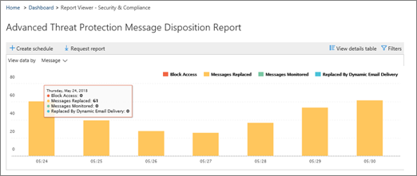

# Configurar y descargar un informe personalizado en el centro de &amp; seguridad y cumplimiento

En el [Centro &amp; de seguridad y cumplimiento](https://protection.office.com), hay disponibles varios [informes y perspectivas](reports-and-insights-in-security-and-compliance.md) para ayudar al equipo de seguridad de su organización a mitigar y enfrentar las amenazas a su organización. Si es miembro del equipo de seguridad de su organización, puede configurar un informe con intervalos de fechas personalizados y filtros y, a continuación, descargar el informe personalizado. 
  
## Descargar un informe personalizado

> [!IMPORTANT]
> Asegúrese de que dispone de los [permisos necesarios para el centro de seguridad &amp; y cumplimiento de Office 365](permissions-in-the-security-and-compliance-center.md). En general, los administradores globales de Office 365, los administradores de seguridad y los lectores de seguridad pueden tener acceso &amp; a los informes en el centro de seguridad y cumplimiento. 
  
1. En el [Centro &amp; de seguridad y cumplimiento](https://protection.office.com), vaya a **informes** \> de **Panel**.
    
2. Elija un informe. (Para este ejemplo, usaremos el informe de disposición del mensaje). 
  
3. En la esquina superior izquierda del informe, elija **request Report**.
    
4. En el cuadro de diálogo **Informe de solicitud** , especifique un nombre, una fecha de inicio y una fecha de finalización para el informe. A continuación, elija **siguiente**. 
  
5. Especifique los filtros que desee usar para el informe. (Por ejemplo, puede especificar una dirección IP de cliente para el informe de disposición del mensaje). A continuación, elija **siguiente**.
    
6. Especifique los destinatarios de correo electrónico para el informe y, a continuación, elija **Guardar**.
    
## Temas relacionados

[Informes y opiniones en el centro de seguridad &amp; y cumplimiento de Office 365](reports-and-insights-in-security-and-compliance.md)
  
[Crear una programación para un informe en el centro &amp; de seguridad y cumplimiento](create-a-schedule-for-a-report.md)
  
[Administrar programaciones de informes en el &amp; centro de seguridad y cumplimiento](manage-schedules-for-multiple-reports.md)
  
[Descargar los informes existentes en el &amp; centro de seguridad y cumplimiento](download-existing-reports.md)
  

