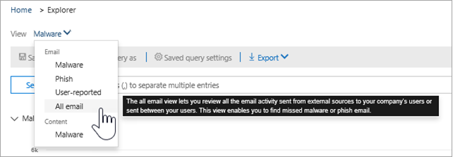
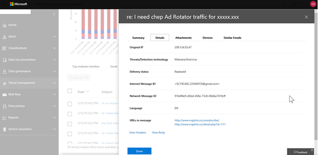
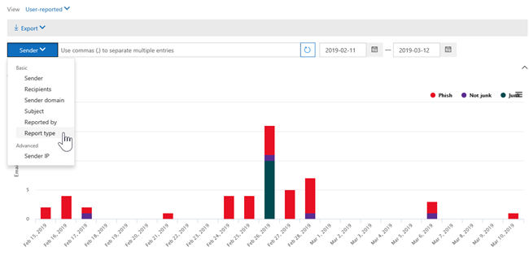

# Vistas en el explorador de amenazas y detecciones en tiempo real

[Explorador de amenazas](use-explorer-in-security-and-compliance.md) (y el informe de detecciones en tiempo real) es una herramienta eficaz, casi en tiempo real, que ayuda a los equipos de operaciones de seguridad a investigar &amp; y responder a amenazas en el centro de seguridad y cumplimiento. Explorer (y el informe de detecciones en tiempo real) muestra información sobre el malware y el phish sospechoso en el correo electrónico y los archivos de Office 365, así como otras amenazas de seguridad y riesgos para la organización. 

- Si tiene [Office 365 Advanced Threat Protection](office-365-atp.md) (ATP) Plan 2, entonces tiene Explorer.
- Si tiene Office 365 ATP plan 1, tendrá detecciones en tiempo real.

La primera vez que se abre el explorador (o el informe de detecciones en tiempo real), la vista predeterminada muestra las detecciones de malware de correo electrónico de los últimos 7 días. Este informe también puede Mostrar detecciones de ATP, como direcciones URL malintencionadas detectadas por [vínculos seguros](atp-safe-links.md)y archivos malintencionados detectados por [datos adjuntos seguros](atp-safe-attachments.md). Este informe se puede modificar para Mostrar datos de los últimos 30 días (a menos que esté usando una suscripción de prueba). Las suscripciones de prueba incluirán datos sólo para los últimos siete días.

Use el menú **Ver** para cambiar la información que se muestra. La información sobre herramientas ayuda a determinar la vista que se va a usar.
  

Una vez que haya seleccionado una vista, puede aplicar filtros y configurar consultas para realizar más análisis. En las siguientes secciones se proporciona una breve introducción a las distintas vistas disponibles en el explorador (o en detecciones en tiempo real).  

## Correo electrónico > malware

Para ver este informe, en explorador (o detecciones en tiempo real), elija **Ver** > **malware**de**correo electrónico** > . Esta vista muestra información sobre los mensajes de correo electrónico que se identificaron como que contenían malware.  

 

Haga clic en **remitente** para abrir la lista de opciones de visualización. Use esta lista para ver los datos del remitente, los destinatarios, el dominio del remitente, el asunto, la tecnología de detección, el estado de protección y mucho más. 

Por ejemplo, para ver qué acciones se han realizado en los mensajes de correo electrónico detectados, elija **Estado de protección** en la lista. Seleccione una opción y, a continuación, haga clic en el botón actualizar para aplicar ese filtro al informe.

Debajo del gráfico, vea más detalles sobre mensajes específicos. Al seleccionar un elemento de la lista, se abre un panel emergente en el que puede obtener más información sobre el elemento seleccionado. 

## Correo electrónico > phish

Para ver este informe, en explorador (o detecciones en tiempo real), elija **Ver** > **phishing**de**correo electrónico** > . Esta vista muestra los mensajes de correo electrónico identificados como intentos de suplantación de identidad.  

 

Haga clic en **remitente** para abrir la lista de opciones de visualización. Use esta lista para ver los datos por remitente, destinatarios, dominio de remitente, IP del remitente, dominio de dirección URL, haga clic en veredicto, etc. 

Por ejemplo, para ver las acciones que se realizaron cuando los usuarios hicieron clic en las direcciones URL que se identificaron como intentos de suplantación de identidad, elija **hacer clic** en el veredicto de la lista, seleccione una o más opciones y, a continuación, haga clic en el botón actualizar.

Debajo del gráfico, vea más detalles sobre mensajes específicos, clics de direcciones URL, URL y origen de correo electrónico. 

Cuando se selecciona un elemento de la lista, como una dirección URL detectada, se abre un panel emergente en el que puede obtener más información sobre el elemento seleccionado. 

## Envíos de > de correo electrónico

Para ver este informe, en explorador (o detecciones en tiempo real), elija **Ver** > envíos de**correo electrónico** > ****. Esta vista muestra el correo electrónico que los usuarios han notificado como correo electrónico no deseado, no deseado o de suplantación de identidad. 

 

Haga clic en **remitente** para abrir la lista de opciones de visualización. Use esta lista para ver información por remitente, destinatarios, tipo de informe (la determinación del usuario de que el correo electrónico era correo no deseado, correo deseado o phish), entre otros. 

Por ejemplo, para ver información sobre los mensajes de correo electrónico que se han notificado como intentos de suplantación de identidad, haga clic en**tipo de informe**de **remitente** > , seleccione **phish**y, a continuación, haga clic en el botón actualizar.

Debajo del gráfico, vea más detalles sobre los mensajes de correo electrónico específicos, como la línea de asunto, la dirección IP del remitente, el usuario que notificó el mensaje como correo no deseado, correo deseado o phish, entre otros. 

Seleccione un elemento de la lista para ver más detalles.

## Correo electrónico > todo el correo electrónico

Para ver este informe, en el explorador, elija **Ver** > **** > **todos los correos**electrónicos. En esta vista se muestra una vista general de la actividad de correo electrónico, incluido el correo electrónico identificado como malintencionado debido a suplantación de identidad (phishing) o malware, así como a todo el correo no malintencionado (correo electrónico normal, correo no deseado y correo masivo). 

> [!NOTE]
> Si recibe un error que lee **demasiados datos para mostrar**, agregue un filtro y, si es necesario, restrinja el intervalo de fechas que está viendo. 

Para aplicar un filtro, elija **remitente**, seleccione un elemento de la lista y, a continuación, haga clic en el botón actualizar. En nuestro ejemplo, utilizamos la **tecnología de detección** como filtro (hay varias opciones disponibles). Ver información por remitente, dominio del remitente, destinatarios, asunto, nombre de archivo de datos adjuntos, familia de malware, estado de protección (acciones llevadas a cabo por las directivas y características de protección contra amenazas en Office 365), la tecnología de detección (cómo se detectó el malware) y adicional. 

 

Debajo del gráfico, vea más detalles sobre los mensajes de correo electrónico específicos, como la línea de asunto, el destinatario, el remitente, el estado, etc. 

## Contenido > malware

Para ver este informe, en explorador (o detecciones en tiempo real), elija **Ver** > **** > **malware**de contenido. Esta vista muestra los archivos que se identificaron como malintencionados con la [protección contra amenazas avanzada de Office 365 en SharePoint Online, OneDrive para la empresa y Microsoft Teams](atp-for-spo-odb-and-teams.md).

Ver información por familia de malware, tecnología de detección (cómo se detectó el malware) y carga de trabajo (OneDrive, SharePoint o Teams). 

  

Debajo del gráfico, vea más detalles sobre archivos específicos, como nombre de archivo de datos adjuntos, carga de trabajo, tamaño de archivo, quién modificó el archivo por última vez, etc. 
  
## Capacidades de hacer clic y filtrar

Con el explorador (y las detecciones en tiempo real), puede aplicar un filtro en un clic. Haga clic en un elemento de la leyenda y ese elemento se convertirá en un filtro para el informe. Por ejemplo, supongamos que estamos viendo la vista de malware en el explorador:
  

  
Al hacer clic en **detonaciones ATP** en este gráfico, se obtiene una vista similar a la siguiente: 
  

  
En esta vista, ahora miramos los datos de los archivos que se han enumerado con datos adjuntos [seguros de ATP de Office 365](atp-safe-attachments.md). Debajo del gráfico, podemos ver los detalles sobre los mensajes de correo electrónico específicos que tienen datos adjuntos detectados por los datos adjuntos seguros de ATP.
  

  
Al seleccionar uno o más elementos, se activa el menú **acciones** , que ofrece varias opciones entre las que elegir para los elementos seleccionados. 
  

  
La capacidad de filtrar en un clic y navegar a detalles específicos puede ahorrarle mucho tiempo para la investigación de las amenazas.

## Consultas y filtros

El explorador (así como el informe de detecciones en tiempo real) tiene varios filtros y capacidades de consulta eficaces que le permiten profundizar en los detalles, como los usuarios de destino más importantes, las familias de malware principales, la tecnología de detección y mucho más. Cada tipo de informe ofrece varias formas de ver y explorar los datos.

> [!IMPORTANT]
> No use caracteres comodín, como un asterisco o un signo de interrogación, en la barra de consulta para exploradores (o detecciones en tiempo real). Al buscar mensajes de correo electrónico en el **campo Subject** , el explorador (o detecciones en tiempo real) realizará una coincidencia parcial y los resultados de rendimiento similares a una búsqueda comodín.
