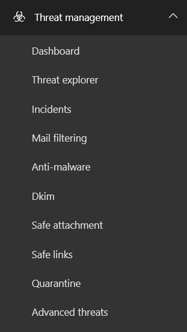

# Administración de la seguridad de Office 365 de amenazas &amp; centro de cumplimiento

Usar administración de amenaza para ayudar a controlar y administrar el acceso de dispositivo móvil a los datos de la organización, ayudar a proteger su organización contra la pérdida de datos y ayudar a proteger los mensajes entrantes y salientes de correo no deseado y otro software malintencionado. También use cuentas de administración para proteger la reputación de su dominio y para determinar si los remitentes se suplantación de identidad malintencionada desde su dominio de amenaza.
  
## Cómo ver y usar Administración de amenaza en la seguridad &amp; centro de cumplimiento

En Office 365, use la seguridad &amp; centro de cumplimiento para administrar las amenazas en su organización.
  
 **Para ir directamente a la seguridad &amp; centro de cumplimiento:**
  
1. Vaya a [https://protection.office.com](https://protection.office.com).
    
2. Inicie sesión en Office 365 con su cuenta de trabajo o escuela.
    
3. En el panel izquierdo, seleccione **administración de amenaza**.
    
    
  
 **Para ir a la seguridad &amp; centro de cumplimiento con el iniciador de la aplicación de Office 365:**
  
1. Inicie sesión en Office 365 con su cuenta de trabajo o escuela.
    
2. Seleccione el iniciador de la aplicación  en la esquina superior izquierda de esquina y, a continuación, seleccione la **seguridad &amp; cumplimiento** colocar en mosaico. 
    
3. En el panel izquierdo, seleccione **administración de amenaza**.
    
## Acerca de la administración de amenaza en Office 365

Estas opciones están disponibles en **administración de amenaza** en la seguridad &amp; centro de cumplimiento. 
  
Aún se estamos implantar administración de amenaza para la seguridad &amp; centro de cumplimiento, por lo que es posible que no vea todos estos aún, o es posible que vea más de las opciones que se muestran aquí. Durante la implantación, algunos de ellos, por ejemplo Anti-malware, Dkim y otras, seguirán disponibles a través del centro de administración de Exchange (EAC).
  
|**Herramienta**|**Descripción**|
|:-----|:-----|
|**Panel, el Explorador de amenaza e incidentes**   |Una vez habilitado, estos paneles permiten administrar inteligencia de análisis de Office 365 y amenaza. Para obtener más información, vea [Introducción a la información sobre amenazas de Office 365](office-365-ti.md).  |
|**Filtrado de correo**   |Ajustar con precisión y configuración del monitor que ayudan a evitar el correo no deseado en Office 365. Crear permitir y bloquear las listas, determinar quién es la falsificación de su dominio y por qué y configurar y ver directivas de filtro de correo no deseado. Para obtener más información, consulte [protección contra correo no deseado de Office 365 de correo electrónico](anti-spam-protection.md).  También puede establecer una directiva para comprobar que los usuarios no envíen correo no deseado. Esto puede suceder, por ejemplo, si el equipo de un usuario obtiene infectado por malware que está programado para enviar mensajes de correo electrónico. Para obtener información sobre cómo se puede impedir el correo no deseado saliente, vea [Configurar la directiva de correo no deseado saliente](https://technet.microsoft.com/library/jj200737%28v=exchg.150%29.aspx).  > [!TIP]> Si actualmente está experimentando un problema al correo no deseado, puede utilizar el [Solucionador de problemas de correo no deseado y malware](https://configure.office.com/Scenario.aspx?sid=73).           |
|**Antimalware**   |Protege contra virus y spyware viajan a o desde su organización en Office 365. Los virus son malintencionados programas de software que, cuando se ejecuta, replicarse y modificar otros programas y los datos en el equipo. Virus propagan a lo largo de su equipo buscando programas a infectan y también se comparten desde un equipo a otro, con frecuencia a través de correo electrónico. Spyware recopila su información personal, como la información de inicio de sesión y lo envía a su autor. Para empezar a configurar directivas antimalware, vea [Configure anti-malware policies](https://technet.microsoft.com/library/jj200745%28v=exchg.150%29.aspx).  > [!TIP]> Si actualmente está experimentando un problema con malware, puede utilizar el [Solucionador de problemas de correo no deseado y malware](https://configure.office.com/Scenario.aspx?sid=73).           |
|**DKIM**   |Diseñada para administradores de Office 365 más avanzados, pero están disponibles para todos los clientes de Office 365, correo identificado por claves de dominio (DKIM) ayuda a asegurarse de que otros sistemas de correo electrónico confían en los mensajes que se envían desde Office 365. DKIM lo hace mediante la adición de una firma digital única a los mensajes de correo electrónico que se envían desde la organización. Sistemas de correo electrónico que reciben correo electrónico desde el pueden usar esta firma digital para ayudar a determinar si el correo electrónico legítimo.  No se preocupe si los detalles de cómo funciona esto parecen complicados, debido a que el valor predeterminado que se configura para en Office 365 debería funcionar para la mayoría de las organizaciones. Si no configuró DKIM usted mismo, Office 365 usa su directiva predeterminada y las claves que crea con el fin de habilitar DKIM para su dominio. Además, si se deshabilita la firma de DKIM, después de un período de tiempo, Office 365 habilita automáticamente la directiva predeterminada de Office 365 para su dominio.  Si lo desea, puede ver esta página en la seguridad &amp; centro de cumplimiento y vea si las firmas DKIM están habilitadas actualmente para su dominio y se pueden ver la última vez que se han girado las claves de cifrado utilizadas por Office 365. Se pueden también girar manualmente las claves usted mismo.  > [!IMPORTANT]> DKIM es técnica de autenticación de correo electrónico de un solo utilizado por Office 365. Para que sea más eficaz, DKIM se usa junto con otras técnicas admitidos como marco de directivas de remitentes (SPF) y la autenticación basada en dominio del mensaje, informes y conformidad (DMARC). Juntos, estas tecnologías de autenticación basada en dominio ayudan a impedir el correo no deseado y suplantación de identidad no deseados. > Antes de realizar cambios en DKIM utilizando la seguridad &amp; centro de cumplimiento, se convierten en cómodo con la tecnología y su funcionamiento. Para empezar, vea [más allá de los conceptos básicos: más formas para evitar que el correo no deseado en Office 365](anti-spam-protection.md#BeyondBasics).           |
|**Datos adjuntos seguros**   |[Los datos adjuntos seguros](atp-safe-attachments.md) es parte de avanzada de protección contra amenazas. Cuando está habilitada, se abren los datos adjuntos de correo electrónico en un entorno aislado de especial que es independiente de Office 365 antes de que se envíen a las bandejas de entrada de destinatarios. Los datos adjuntos seguros está diseñado para ayudar a detectar datos adjuntos malintencionados incluso antes de que las firmas de antivirus estén disponibles. Para obtener más información, vea [Datos adjuntos seguros en Office 365](atp-safe-attachments.md).  |
|**Vínculos seguros**   |[Vínculos seguros](atp-safe-links.md) es parte de la protección contra amenazas de avanzada. Vínculos seguros ayudan a evitar que los usuarios de las siguientes direcciones URL en correo electrónico o en documentos de Office que apuntan a sitios web que se reconocen como malintencionados. Para obtener más información, vea [Los vínculos seguros en Office 365](atp-safe-links.md).  |
|**Cuarentena**   |Configuración de [cuarentena](http://go.microsoft.com/fwlink/p/?LinkID=809005) para mensajes de correo electrónico entrante en Office 365 donde los mensajes que se han filtrado como correo no deseado, de forma masiva, suplantación de identidad, y puede mantenerse malware correo para su revisión posterior. Los usuarios y los administradores pueden trabajar con los mensajes en cuarentena. Los usuarios pueden trabajar con sus propios mensajes de filtrados en cuarentena. Los administradores pueden buscar y administrar los mensajes en cuarentena para todos los usuarios.  |
|**Amenazas avanzadas**   |Ver el [informe de estado de protección de amenaza](https://support.office.com/article/View-the-reports-for-Advanced-Threat-Protection-E47E838C-D99E-4C0B-B9AA-E66C4FAE902F#advancedthreats) para ver información sobre el contenido malintencionado se encuentra y bloqueada por Exchange Online Protection y avanzada de protección contra amenazas.    |
   

