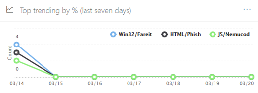

# Rastreadores de amenazas: nuevos y destacables

Las capacidades de [investigación y respuesta de amenazas de Office 365](office-365-ti.md) permiten que el equipo de seguridad de su organización Descubra y actúe en contra de las amenazas de Cybersecurity. Las capacidades de investigación y respuesta de amenazas de Office 365 incluyen características de seguimiento de amenazas, incluidos los seguimientos dignos de ser interesantes. Lea este artículo para obtener información general sobre estas nuevas características y los pasos siguientes. 

> [!IMPORTANT]
> Office 365 Threat Intelligence es ahora Office 365 plan de protección contra amenazas avanzada 2, junto con otras capacidades de protección contra amenazas. Para obtener más información, consulte [planes y precios](https://products.office.com/exchange/advance-threat-protection) de la protección contra amenazas avanzada de Office 365 y la [Descripción del servicio de protección contra amenazas avanzada de Office 365](https://docs.microsoft.com/office365/servicedescriptions/office-365-advanced-threat-protection-service-description).
  
## ¿Qué son los rastreadores de amenazas?

Los rastreadores de amenazas son widgets y vistas informativas que le proporcionan inteligencia sobre diferentes problemas de Cybersecurity que pueden afectar a su empresa. Por ejemplo, puede ver información sobre las campañas de malware de tendencias mediante los rastreadores de amenazas.
  

  
La mayoría de las páginas de Tracker incluyen números de tendencia que se actualizan periódicamente, widgets para ayudarle a comprender qué problemas son los más grandes o que han crecido más y un vínculo rápido en la columna **acciones** que le conduce al explorador, donde puede ver más información información. 
  

  
Los rastreadores son sólo algunas de las muchas características de gran calidad que obtiene con [Office 365 Advanced Threat Protection Plan 2](office-365-ti.md). Los rastreadores de amenazas incluyen [Noteworth](#noteworthy-trackers), rastreadores de [tendencias](#trending-trackers), [consultas de seguimiento](#tracked-queries)y [consultas guardadas](#saved-queries).
  
Para ver y usar los rastreadores de amenazas en su organización, vaya al centro &amp; de seguridad y[https://protection.office.com](https://protection.office.com)cumplimiento () y elija Threat **Management** \> **Threat Tracker**.
  
> [!NOTE]
> Para usar los rastreadores de amenazas, debe ser un administrador global de Office 365, un administrador de seguridad o un lector de seguridad. Consulte [permisos en el centro de seguridad &amp; y cumplimiento de Office 365](permissions-in-the-security-and-compliance-center.md). 
  
### Seguimientos dignos de destacar

Las marcas de revisión destacadas son donde encontrará las amenazas y los riesgos grandes y pequeños que pensamos que debe conocer. Los rastreadores dignos de ayuda le ayudan a averiguar si estos problemas existen en su entorno de Office 365, además de un vínculo a los artículos (como este) que le ofrecen más detalles sobre lo que está sucediendo y cómo afectarán al uso que hace su organización de Office 365. Si se trata de una nueva amenaza importante (por ejemplo, Wannacry, Petya) o una amenaza existente que pudiera crear algunos nuevos retos (como nuestro otro inaugural artículo destacado: Nemucod), aquí es donde encontrará los elementos importantes que usted y su equipo de seguridad deben revisar y examinar hará.
  
Por lo general, los rastreadores dignos de opinión se publicarán por un par de semanas cuando identificamos nuevas amenazas y creemos que podría necesitar la visibilidad adicional que proporciona esta característica. Una vez que haya superado el mayor riesgo de una amenaza, quitaremos ese elemento destacado. De este modo, podemos mantener la lista actualizada y actualizada con otros elementos nuevos relevantes.
  
### Rastreadores de tendencias

Los rastreadores de tendencias (anteriormente denominados campañas) resaltan nuevas amenazas que no se han visto en el correo electrónico de su organización en la última semana.
  

  
Los rastreadores de tendencias le proporcionan una idea de las nuevas amenazas que debe revisar para asegurarse de que su entorno corporativo más amplio esté preparado contra los ataques.
  
### Consultas con seguimiento

Las consultas con seguimiento aprovechan las consultas guardadas para evaluar periódicamente la actividad de Office 365 en su organización. Esto le ofrece tendencias de eventos, con más que venir en los próximos meses. Las consultas con seguimiento se ejecutan automáticamente y proporcionan información actualizada sin tener que acordarse de volver a ejecutar las consultas.
  

  
### Consultas guardadas

Las consultas guardadas también se encuentran en la sección de rastreadores. Puede usar consultas guardadas para almacenar las búsquedas comunes del explorador que desea volver a volver más rápido y de forma repetida, sin tener que volver a crear la búsqueda cada vez.
  

  
Siempre puede guardar una consulta de seguimiento de forma notable o cualquiera de sus propias consultas del explorador mediante el botón **Guardar consulta** en la parte superior de la página del explorador. Cualquier elemento guardado en la lista de **consultas guardadas** se mostrará en la página rastreador. 
  
## Rastreadores y explorador

Ya sea que esté revisando el correo electrónico, el contenido o las actividades de Office (próximamente), el explorador y los rastreadores funcionan conjuntamente para ayudarle a investigar y realizar un seguimiento de los riesgos y las amenazas de seguridad. Todos juntos, los rastreadores le proporcionan información para proteger a los usuarios de Office 365 resaltando los problemas nuevos, destacados y de búsqueda frecuente, lo que garantiza que su empresa estará mejor protegida mientras se desplaza a la nube.
  
Y recuerde que siempre puede enviarnos sus comentarios sobre esta u otras características de seguridad de Office 365 haciendo clic en el botón **comentarios** en la esquina inferior derecha de la [información general del centro &amp; de seguridad y cumplimiento de Office 365](https://support.office.com/article/a5f2fd18-b029-4257-b5a8-ae83e7768c85).
  

  
## Rastreadores y Office 365 protección contra amenazas avanzada

Con nuestra amenaza de inaugural de confianza, destacamos las amenazas de malware avanzadas detectadas por los [datos adjuntos seguros de ATP de Office 365](atp-safe-attachments.md). Si es cliente de Office 365 Enterprise E5 y no usa la [protección contra amenazas avanzada](office-365-atp.md) (ATP) de Office 365, debe estar incluido en la suscripción. ATP proporciona valor incluso si tiene otras herramientas de seguridad filtrando el flujo de correo electrónico con los servicios de Office 365. Sin embargo, las características contra correo no deseado y [vínculos seguros de Office 365 ATP](atp-safe-links.md) funcionan mejor cuando la solución principal de seguridad de correo electrónico es a través de Office 365. 
  

  
En el mundo de las amenazas Riddled, la ejecución de análisis de antimalware tradicionales significa que no está protegido lo suficiente como para evitar los ataques. Los atacantes más sofisticados de hoy usan las herramientas disponibles habitualmente para crear ataques nuevos, ofuscados o retrasados que no serán reconocidos por los motores de antimalware tradicionales basados en firmas. La característica de datos adJuntos seguros de ATP lleva archivos adjuntos de correo y los detona en un entorno virtual para determinar si son seguros o malintencionados. Este proceso de detonación abre cada archivo en un entorno de equipo virtual y, a continuación, observa lo que sucede después de abrir el archivo. Tanto si se trata de un archivo PDF, un archivo comprimido o un documento de Office, el código malintencionado se puede ocultar en un archivo, activando una vez que la víctima la abre en su equipo. Al detonar y analizar el archivo en el flujo de correo electrónico, las capacidades de ATP de Office 365 encuentran estas amenazas en función de los comportamientos, la reputación del archivo y una serie de reglas heurísticas.
  
El filtro de nueva amenaza notable resalta los elementos que se detectaron recientemente a través de datos adJuntos seguros ATP. Estas detecciones representan elementos que son nuevos archivos malintencionados, que no se han encontrado previamente en Office 365 en el correo electrónico del flujo de correo electrónico o de otros clientes. Preste atención a los elementos del rastreador de amenazas digno de destacar, consulte quién lo ha dirigido y revise los detalles de detonación que se muestran en la ficha análisis avanzado (que se encuentra haciendo clic en el asunto del correo electrónico en el explorador). Nota solo encontrará esta pestaña en los mensajes de correo electrónico detectados por la funcionalidad de datos adJuntos seguros de ATP: este Tracker destacado incluye ese filtro, pero también puede usar ese filtro para otras búsquedas en el explorador.
  
## Pasos siguientes

- Si su organización no dispone ya de estas capacidades de investigación y respuesta de amenazas de Office 365, consulte [¿Cómo obtenemos las capacidades de investigación de amenazas y respuesta de office 365?](get-started-with-ti.md).
    
- Asegúrese de que el equipo de seguridad tiene asignados los roles y permisos correctos. Debe ser un administrador global de Office 365 o tener el rol de administrador de seguridad o de búsqueda y dePuración &amp; asignado en el centro de seguridad y cumplimiento. Consulte [permisos en el centro de seguridad &amp; y cumplimiento de Office 365](permissions-in-the-security-and-compliance-center.md).
    
- Vea los nuevos rastreadores para que se muestren en su entorno de Office 365. Cuando esté disponible, encontrará los seguimientos [aquí](https://protection.office.com/). Vaya a los rastreadores de **amenazas**de **Administración** \> de amenazas.
    
- Si aún no lo ha hecho, obtenga más información acerca de la [protección contra amenazas avanzada de office 365](office-365-atp.md) para su organización, incluidos los [vínculos seguros de atp](atp-safe-links.md) de Office 365 y los [datos ADjuntos seguros de ATP](atp-safe-attachments.md)de Office 365.
  

