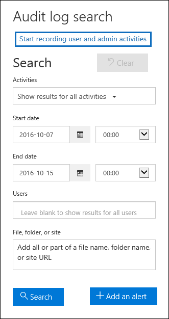

# <a name="turn-office-365-audit-log-search-on-or-off"></a>Activar o desactivar la búsqueda de registros de auditoría de Office 365

Usted (u otro administrador) deben activar el registro de auditoría para poder empezar a buscar en el registro de auditoría de Office 365. Cuando se activa la búsqueda de registros de auditoría en el centro de seguridad & cumplimiento, la actividad de usuario y administrador de la organización se registra en el registro de auditoría y se conserva durante 90 días. Sin embargo, es posible que su organización no desee registrar y conservar los datos del registro de auditoría. O puede que esté usando una aplicación de administración de eventos e información de seguridad (SIEM) de terceros para obtener acceso a los datos de auditoría. En esos casos, un administrador global puede desactivar la búsqueda de registros de auditoría en Office 365.
  
## <a name="before-you-begin"></a>Antes de empezar

- Debe tener asignado el rol registros de auditoría en Exchange Online para activar o desactivar la búsqueda de registros de auditoría en su organización de Office 365. De forma predeterminada, este rol se asigna a los grupos de roles administración de cumplimiento y administración de la organización en la página **permisos** del centro de administración de Exchange. Los administradores globales de Office 365 son miembros del grupo de funciones de administración de la organización en Exchange Online. 
    
    > [!IMPORTANT]
    > Los usuarios deben tener asignados permisos en Exchange Online para activar o desactivar la búsqueda de registros de auditoría. Si asigna a los usuarios el rol registros de auditoría en la página **permisos** en el centro de seguridad & cumplimiento, estos no podrán activar o desactivar la búsqueda de registros de auditoría. Esto se debe a que el cmdlet subyacente es un cmdlet de Exchange Online. 
  
- Si desactiva la búsqueda de registros de auditoría en Office 365, no podrá usar la API de actividad de administración de Office 365 para acceder a los datos de auditoría de su organización. Desactivar la búsqueda de registros de auditoría mediante los pasos descritos en este artículo indica que no se devolverá ningún resultado cuando busque en el registro de auditoría mediante el centro de seguridad & cumplimiento o cuando ejecute el cmdlet **Search-UnifiedAuditLog** en Exchange Online. PowerShell. Esto también significa que los registros de auditoría no estarán disponibles a través de la API de actividad de administración de Office 365.  
    
- Para obtener instrucciones paso a paso sobre cómo buscar en el registro de auditoría de Office 365, consulte [Buscar el registro de auditoría en el centro de seguridad _AMP_ cumplimiento](search-the-audit-log-in-security-and-compliance.md).
    
## <a name="turn-on-audit-log-search"></a>Activar la búsqueda de registros de auditoría

Puede usar el centro de seguridad & cumplimiento o PowerShell para activar la búsqueda de registros de auditoría en Office 365. Puede tardar varias horas después de activar la búsqueda de registros de auditoría para poder devolver los resultados cuando busque en el registro de auditoría. Debe tener asignado el rol registros de auditoría en Exchange Online para activar la búsqueda de registros de auditoría.
  
### <a name="use-the-security--compliance-center-to-turn-on-audit-log-search"></a>Usar el centro de seguridad & cumplimiento para activar la búsqueda de registros de auditoría

1. En el centro de seguridad & cumplimiento, vaya a búsqueda de **registros de auditoría**de **búsqueda** \> .
    
2. Haga clic en **iniciar grabación de actividades de usuario y de administrador**.
    
    
  
    Se muestra un cuadro de diálogo que indica que la actividad de usuario y de administrador de su organización se registrará en el registro de auditoría de Office 365 y estará disponible para verlo en un informe. 
    
3. Haga clic en **Activar**.
    
    Se muestra un mensaje que indica que se está preparando el registro de auditoría y que puede ejecutar una búsqueda en un par de horas después de que se complete la preparación.
    
### <a name="use-powershell-to-turn-on-audit-log-search"></a>Usar PowerShell para activar la búsqueda de registros de auditoría

1. [Conectarse a Exchange Online mediante PowerShell](https://go.microsoft.com/fwlink/p/?LinkID=396554)
    
2. Ejecute el siguiente comando de PowerShell para activar la búsqueda de registros de auditoría en Office 365.
    
    ```
    Set-AdminAuditLogConfig -UnifiedAuditLogIngestionEnabled $true
    ```

    Se muestra un mensaje que indica que puede tardar hasta 60 minutos para que el cambio surta efecto.
  
## <a name="turn-off-audit-log-search"></a>Desactivar la búsqueda de registros de auditoría

Debe usar PowerShell remoto conectado a su organización de Exchange Online para desactivar la búsqueda de registros de auditoría. De forma similar a activar la búsqueda de registros de auditoría, debe tener asignado el rol registros de auditoría en Exchange Online para desactivar la búsqueda de registros de auditoría.
  
1. [Conectarse a Exchange Online mediante PowerShell](https://go.microsoft.com/fwlink/p/?LinkID=396554)
    
2. Ejecute el siguiente comando de PowerShell para desactivar la búsqueda de registros de auditoría en Office 365.
    
    ```
    Set-AdminAuditLogConfig -UnifiedAuditLogIngestionEnabled $false
    ```

3. Después de un rato, compruebe que la búsqueda de registros de auditoría está desactivada (deshabilitada). Puede realizar esto de dos maneras:
    
    - En PowerShell, ejecute el siguiente comando:

        ```
        Get-AdminAuditLogConfig | FL UnifiedAuditLogIngestionEnabled
        ```

        El valor de `False` para la propiedad _UnifiedAuditLogIngestionEnabled_ indica que la búsqueda de registros de auditoría está desactivada. 
    
    - En el centro de seguridad & cumplimiento, vaya a búsqueda de **registros de auditoría**de **búsqueda** \> y, a continuación, haga clic en **Buscar**.
    
      Se muestra un mensaje que indica que la búsqueda de registros de auditoría no está activada. 
    
      
