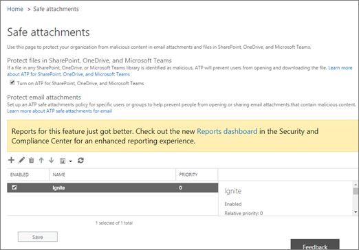

# Activar Office 365 ATP para SharePoint, OneDrive y Microsoft TeamsTurn on Office 365 ATP for SharePoint, OneDrive, and Microsoft Teams

[Office 365 ATP para SharePoint, OneDrive y Microsoft Teams](atp-for-spo-odb-and-teams.md) protege a su organización de archivos malintencionados que se comparten de forma inadvertida.[Office 365 ATP for SharePoint, OneDrive, and Microsoft Teams](atp-for-spo-odb-and-teams.md) protects your organization from inadvertently sharing malicious files. Cuando se detecta un archivo malintencionado, se bloquea el archivo para que nadie lo pueda abrir, copiar, mover ni compartir hasta que el equipo de seguridad de la organización haya realizado otras acciones.When a malicious file is detected, that file is blocked so that no one can open, copy, move, or share it until further actions are taken by the organization's security team. Lea este artículo para activar ATP para SharePoint, OneDrive y Microsoft Teams, configurar alertas para que se notifiquen sobre los archivos detectados y realizar los pasos siguientes.Read this article to turn on ATP for SharePoint, OneDrive, and Teams, set up alerts to be notified about detected files, and take your next steps. 
  
Para definir (o editar) las directivas de ATP, debe tener asignado un rol apropiado.To define (or edit) ATP policies, you must be assigned an appropriate role. En la tabla siguiente se describen algunos ejemplos:Some examples are described in the following table:

|RoleRole  |Dónde y cómo se asignaWhere/how assigned  |
|---------|---------|
|Administrador global de Office 365Office 365 Global Administrator |La persona que se registra para comprar Office 365 es un administrador global de forma predeterminada.The person who signs up to buy Office 365 is a global admin by default. (Consulte [acerca de los roles de administrador de Office 365](https://docs.microsoft.com/office365/admin/add-users/about-admin-roles) para obtener más información).(See [About Office 365 admin roles](https://docs.microsoft.com/office365/admin/add-users/about-admin-roles) to learn more.)         |
|Administrador de seguridadSecurity Administrator |Centro de administración de Azure Active[https://aad.portal.azure.com](https://aad.portal.azure.com)Directory ()Azure Active Directory admin center ([https://aad.portal.azure.com](https://aad.portal.azure.com))|
|Administración de la organización de Exchange OnlineExchange Online Organization Management |Centro de administración de[https://outlook.office365.com/ecp](https://outlook.office365.com/ecp)Exchange ()Exchange admin center ([https://outlook.office365.com/ecp](https://outlook.office365.com/ecp))  oor    Cmdlets de PowerShell (vea [Exchange Online PowerShell](https://docs.microsoft.com/powershell/exchange/exchange-online/exchange-online-powershell?view=exchange-ps))PowerShell cmdlets (See [Exchange Online PowerShell](https://docs.microsoft.com/powershell/exchange/exchange-online/exchange-online-powershell?view=exchange-ps)) |
  
## Activar ATP para SharePoint, OneDrive y Microsoft Teams.Turn on ATP for SharePoint, OneDrive, and Microsoft Teams

**Antes de comenzar este procedimiento, asegúrese de que el registro de auditoría ya esté activado para su entorno de Office 365**.**Before you begin this procedure, make sure that audit logging is already turned on for your Office 365 environment**. Normalmente lo hace alguien que tiene el rol registros de auditoría asignado en Exchange Online.This is typically done by someone who has the Audit Logs role assigned in Exchange Online. Para obtener más información, consulte [activar o desactivar la búsqueda de registros de auditoría de Office 365](turn-audit-log-search-on-or-off.md).For more information, see [Turn Office 365 audit log search on or off](turn-audit-log-search-on-or-off.md).
  
1. Vaya a [https://protection.office.com](https://protection.office.com)e inicie sesión con su cuenta profesional o educativa.Go to [https://protection.office.com](https://protection.office.com), and sign in with your work or school account.
    
2. en el centro de navegación &amp; izquierdo de Office 365 Security Compliance Center, en **administración de amenazas**, seleccione **directiva** \> de datos adjuntos **seguros**.In the Office 365 Security &amp; Compliance Center, in the left navigation pane, under **Threat management**, choose **Policy** \> **Safe Attachments**.  
  
3. Seleccione **Activar ATP para SharePoint, OneDrive y Microsoft Teams**.Select **Turn on ATP for SharePoint, OneDrive, and Microsoft Teams**. 
  
4. Haga clic en \*\*Guardar \*\*.Click **Save**.
    
5. Revise (y, según corresponda, Edit) las directivas de [datos adjuntos seguros](set-up-atp-safe-attachments-policies.md) de su organización y [las directivas de vínculos a prueba](set-up-atp-safe-links-policies.md)de errores.Review (and, as appropriate, edit) your organization's [Safe Attachments policies](set-up-atp-safe-attachments-policies.md) and [Safe Links policies](set-up-atp-safe-links-policies.md).
    
6. Recomenda Como administrador global o administrador de SharePoint Online, ejecute el cmdlet **[set-SPOTenant](https://docs.microsoft.com/powershell/module/sharepoint-online/Set-SPOTenant?view=sharepoint-ps)** con el parámetro **DisallowInfectedFileDownload** establecido en *true*.(Recommended) As a global administrator or a SharePoint Online administrator, run the **[Set-SPOTenant](https://docs.microsoft.com/powershell/module/sharepoint-online/Set-SPOTenant?view=sharepoint-ps)** cmdlet with the **DisallowInfectedFileDownload** parameter set to  *true*.  
      - Si se establece el parámetro en *true* , se bloquearán todas las acciones (excepto eliminar) de los archivos detectados.Setting the parameter to *true* blocks all actions (except Delete) for detected files. Los usuarios no pueden abrir, mover, copiar o compartir los archivos detectados.People cannot open, move, copy, or share detected files.
      - Si el parámetro se establece en *false* , se bloquearán todas las acciones excepto eliminar y descargar.Setting the parameter to *false* blocks all actions except Delete and Download. Los usuarios pueden elegir entre aceptar el riesgo y descargar un archivo detectado.People can choose to accept the risk and download a detected file.  
   
7. Espere hasta 30 minutos para que los cambios se extiendan a todos los centros de seguridad de Office 365.Allow up to 30 minutes for your changes to spread to all Office 365 datacenters.
    
8. Recomenda Proceda a configurar alertas para los archivos detectados.(Recommended) Proceed to set up alerts for detected files.
    
Para obtener más información sobre el uso de PowerShell con Office 365, consulte [administrar office 365 con PowerShell](https://docs.microsoft.com/office365/enterprise/powershell/manage-office-365-with-office-365-powershell).To learn more about using PowerShell with Office 365, see [Manage Office 365 with PowerShell](https://docs.microsoft.com/office365/enterprise/powershell/manage-office-365-with-office-365-powershell). 

Para obtener más información acerca de la experiencia del usuario cuando un archivo se ha detectado como malintencionado, consulte [Qué hacer cuando se encuentra un archivo malintencionado en SharePoint Online, en OneDrive o en Microsoft Teams](https://support.office.com/article/01e902ad-a903-4e0f-b093-1e1ac0c37ad2).To learn more about the user experience when a file has been detected as malicious, see [What to do when a malicious file is found in SharePoint Online, OneDrive, or Microsoft Teams](https://support.office.com/article/01e902ad-a903-4e0f-b093-1e1ac0c37ad2). 
  
## Configurar alertas para los archivos detectadosSet up alerts for detected files

Para recibir una notificación cuando se identificó un archivo en SharePoint Online, OneDrive para la empresa o Microsoft Teams como malintencionado, puede configurar una alerta.To receive notification when a file in SharePoint Online, OneDrive for Business, or Microsoft Teams has been identified as malicious, you can set up an alert.
  
1. en el [centro de seguridad &amp; y cumplimiento de Office 365](https://protection.office.com), elija **alertas** \> **administrar alertas**.In the [Office 365 Security &amp; Compliance Center](https://protection.office.com), choose **Alerts** \> **Manage alerts**.
    
2. Elija **nueva Directiva de alerta**.Choose **New alert policy**.
    
3. Especifique un nombre para la alerta.Specify a name for the alert. Por ejemplo, podría escribir archivos malintencionados en bibliotecas.For example, you could type Malicious Files in Libraries.
    
4. Escriba una descripción de la alerta.Type a description for the alert. Por ejemplo, puede escribir notificar a los administradores cuando se detectan archivos malintencionados en SharePoint Online, OneDrive o Microsoft Teams.For example, you could type Notifies admins when malicious files are detected in SharePoint Online, OneDrive, or Microsoft Teams.
    
5. En la sección **enviar esta alerta cuando...** , haga lo siguiente:In the **Send this alert when...** section, do the following: 
    
    a.a. En la lista **actividades** , seleccione **malware detectado en el archivo**.In the **Activities** list, choose **Detected malware in file**.
    
    b.b. Deje el campo **usuarios** vacío.Leave the **Users** field empty. 
    
6. En la sección **enviar esta alerta a...** , seleccione uno o varios administradores globales, administradores de seguridad o lectores de seguridad que deben recibir una notificación cuando se detecte un archivo malintencionado.In the **Send this alert to...** section, select one or more global administrators, security administrators, or security readers who should receive notification when a malicious file is detected. 
    
7. Haga clic en \*\*Guardar \*\*.Click **Save**.
    
Para obtener más información acerca de las alertas, consulte [crear alertas de actividad en &amp; el centro de seguridad y cumplimiento de Office 365](create-activity-alerts.md).To learn more about alerts, see [Create activity alerts in the Office 365 Security &amp; Compliance Center](create-activity-alerts.md). 
  
## Pasos siguientesNext steps

1. [Ver información sobre los archivos malintencionados detectados en SharePoint, OneDrive o Microsoft TeamsView information about malicious files detected in SharePoint, OneDrive, or Microsoft Teams](malicious-files-detected-in-spo-odb-or-teams.md)
    
2. [Administrar archivos y mensajes en cuarentena como un administrador en Office 365Manage quarantined messages and files as an administrator in Office 365](manage-quarantined-messages-and-files.md)
    

  

