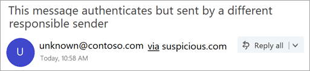

# Remitente no verificadoUnverified Sender

Para evitar que los mensajes de suplantación de identidad lleguen a su buzón, Outlook.com y Outlook en la web Compruebe que el remitente es quien dice ser y marcar los mensajes sospechosos como correo no deseado.To prevent phishing messages from reaching your mailbox, Outlook.com and Outlook on the web verify that the sender is who they say they are and mark suspicious messages as junk email.

> [!IMPORTANT]
> Cuando un mensaje se marca como una estafa de suplantación de identidad (phishing), Outlook.com y Outlook en la web muestran una advertencia en la parte superior de la página, pero los vínculos del mensaje todavía se pueden abrir.When a message is marked as a phishing scam, Outlook.com and Outlook on the web display a warning at the top of the page, but any links in the message can still be opened.

## ¿Cómo puedo identificar un mensaje sospechoso en mi bandeja de entrada?How can I identify a suspicious message in my inbox?

Outlook.com y Outlook en la web muestran indicadores cuando no se puede identificar el remitente de un mensaje o su identidad es diferente de la que se ve en la dirección de remitente.Outlook.com and Outlook on the web show indicators when the sender of a message either can't be identified or their identity is different from what you see in the From address.

## Cómo administrar qué mensajes reciben el tratamiento de remitentes no comprobadosHow to manage which messages receive the unverified sender treatment 

Si es un cliente de Office 365, puede administrar esta característica a través del centro de seguridad & cumplimiento.If you are an Office 365 customer you can manage this feature through the Security & Compliance Center. 

- En el centro de seguridad & cumplimiento de Office 365, los administradores de espacios empresariales pueden activar o desactivar la característica a través de la protección contra la suplantación de identidad (phishing) en la Directiva ANTIPHISH.In the Office 365 Security & Compliance Center, tenant admins can turn the feature on, or off, through the Anti-spoofing protection under the Anti-Phish policy. Además, puede administrarse mediante el cmdlet "Set-AntiPhishPolicy".Additionally, it can be managed through the ‘Set-AntiPhishPolicy’ cmdlet. Para obtener más información, consulte protección contra la suplantación de identidad en Office 365 y set-AntiPhishPolicy.For more details, see Anti-phishing protection in Office 365 and Set-AntiPhishPolicy.

    

- Si un administrador ha identificado un falso positivo y un remitente no debe recibir el tratamiento de remitente no verificado, puede realizar una de las siguientes acciones para agregar el remitente a la lista de permitidos de falsificación de inteligencia de identidad:If an admin has identified a false positive, and a sender should not be receiving the unverified sender treatment they can take one of the following actions to add the sender to the Spoof Intelligence spoof allow list:
        
    - Agregue el par de dominios mediante el conocimiento de inteligencia de ti falso.Add the domain pair through the Spoof Intelligence Insight. Para obtener más información, consulte Walkthrough: suplantar inteligencia InsightFor more details, see Walkthrough: spoof intelligence insight
                
    - Agregue el par de dominios mediante el cmdlet PhishFilterPolicy.Add the domain pair through the PhishFilterPolicy cmdlet. Para obtener más información, vea Set-PhishFilterPolicy y protección contra la suplantación de identidad en Office 365For more details, see Set-PhishFilterPolicy and Anti-spoofing protection in Office 365

Además, no se aplica el tratamiento de remitente no verificado si se entregó en la bandeja de entrada a través de una lista de permitidos del administrador, incluidas las reglas de transporte de correo electrónico (ETR), la lista de dominios seguros (Directiva contra correo no deseado), la lista de remitentes seguros o un usuario ha establecido este usuario como un "remitente seguro" en su entrada.Additionally, we do not apply the unverified sender treatment if it was delivered to the inbox via an admin allow list, including Email Transport Rules (ETRs), Safe Domain List (Anti-Spam Policy), Safe Sender List or a user has set this user as a “Safe Sender” in their inbox.

### Ve un '? ' en la imagen del remitenteYou see a '?' in the sender image

Cuando Outlook.com y Outlook en la web no pueden comprobar la identidad del remitente mediante técnicas de autenticación de correo electrónico, muestran un '? ' en la foto del remitente.When Outlook.com and Outlook on the web can't verify the identity of the sender using email authentication techniques, they display a '?' in the sender photo. 

No todos los mensajes que no se autentican son malintencionados.Not every message that fails to authenticate is malicious. Sin embargo, debe tener cuidado al interactuar con los mensajes que no se autentican si no reconoce al remitente.However, you should be careful about interacting with messages that don't authenticate if you don't recognize the sender. O bien, si reconoce a un remitente que normalmente no tiene un '? ' en la imagen del remitente, pero, de repente, lo empieza a ver, es posible que se trate de una firma en la que se está suplantando el remitente.Or, if you recognize a sender that normally doesn't have a '?' in the sender image, but you suddenly start seeing it, that could be a sign the sender is being spoofed.

### La dirección del remitente es diferente de la que aparece en la dirección deThe sender's address is different than what appears in the From address

Con frecuencia, la dirección de correo electrónico que ve en un mensaje es diferente de la que aparece en la dirección de.Frequently, the email address you see in a message is different than what you see in the From address. En ocasiones, los phish atacantes intentan engañarle para que el remitente sea una persona distinta de la real.Sometimes phishers try to trick you into thinking that the sender is someone other than who they really are.

Cuando Outlook.com y Outlook en la Web detectan una diferencia entre la dirección real del remitente y la dirección de la dirección de, muestran el remitente real mediante la etiqueta Via, que se subraya.When Outlook.com and Outlook on the web detect a difference between the sender's actual address and the address on the From address, they show the actual sender using the via tag, which will be underlined.

En este ejemplo, el dominio `suspicious.com` de envío está autenticado, pero el remitente ha `unknown@contoso.com` puesto en la dirección de remitente.In this example, the sending domain `suspicious.com` is authenticated, but the sender put `unknown@contoso.com` in the From address.

No todos los mensajes con una etiqueta Via son sospechosos.Not every message with a via tag is suspicious. Sin embargo, si no reconoce un mensaje con una etiqueta Via, debe tener cuidado a la hora de interactuar con él.However, if you don't recognize a message with a via tag, you should be cautious about interacting with it.

En Outlook.com y el nuevo Outlook en la web, puede desplazar el cursor sobre el nombre o la dirección del remitente en la lista de mensajes para ver su dirección de correo electrónico, sin necesidad de abrir el mensaje.In Outlook.com and the new Outlook on the web, you can hover your cursor over a sender's name or address in the message list to see their email address, without needing to open the message.

¿Cómo saber si está usando el nuevo Outlook en la web?How do you know if you're using the new Outlook on the web? Vea los siguientes ejemplos:See the following examples:

## Preguntas más frecuentesFrequently asked questions

### ¿Qué criterios usa Outlook.com y Outlook en la web para agregar las propiedades "?" y "Via"?What criteria does Outlook.com and Outlook on the web use to add the '?' and the 'via' properties?

Para el '? ' en la imagen del remitente: Outlook.com requiere que el mensaje pase la autenticación SPF o DKIM.For the '?' in the sender image:  Outlook.com requires that the message pass either SPF or DKIM authentication. Para obtener más información, consulte [configurar SPF en Office 365 para evitar](set-up-spf-in-office-365-to-help-prevent-spoofing.md) la suplantación de identidad (spoofing) y el [uso de DKIM para validar el correo electrónico saliente enviado desde su dominio personalizado en Office 365](use-dkim-to-validate-outbound-email.md).For more details, see [Set up SPF in Office 365 to help prevent spoofing](set-up-spf-in-office-365-to-help-prevent-spoofing.md) and [Use DKIM to validate outbound email sent from your custom domain in Office 365](use-dkim-to-validate-outbound-email.md).

Para la etiqueta Via: Si el dominio de la dirección de es diferente del dominio de la firma DKIM o del correo SMTP de, Outlook.com muestra el dominio en uno de estos dos campos (prefiriendo la firma DKIM).For the via tag: If the domain in the From address is different from the domain in the DKIM signature or the SMTP MAIL FROM, Outlook.com displays the domain in one of those two fields (preferring the DKIM signature).

### ¿Puedo invalidar estas propiedades con permitir IP, la regla de transporte de Exchange permite o los remitentes seguros?Can I override these properties with IP Allows, Exchange Transport Rule Allows, or safe senders?

No puede invalidar estas propiedades.You can't override these properties.

### ¿Cómo Quito estas propiedades?How do I remove these properties?

Para el '? ' en la imagen del remitente: como remitente, debe autenticar el mensaje con SPF o DKIM.For the '?' in the sender image: As a sender, you should authenticate your message with either SPF or DKIM.

Para la etiqueta Via: como remitente, debe asegurarse de que el dominio de la firma DKIM o el correo SMTP de sea el mismo que o sea un subdominio de, el dominio de la dirección de remitente.For the via tag: As a sender, you should ensure that either the domain in the DKIM signature or the SMTP MAIL FROM is the same as, or is a subdomain of, the domain in the From address.

### ¿Outlook.com y Outlook en la web muestran esto por cada mensaje que no supera la autenticación?Does Outlook.com and Outlook on the web show this for every message that doesn’t pass authentication?

No necesariamente.Not necessarily. Outlook.com y Outlook en la web pueden tener otras propiedades dentro del mensaje para autenticar al remitente.Outlook.com and Outlook on the web may have other properties within the message to authenticate the sender.

## Temas relacionadosRelated topics

[Ayuda para proteger su cuenta de correo electrónico de Outlook.comHelp protect your Outlook.com email account](https://support.office.com/article/a4f20fc5-4307-4ece-8231-6d4d4bd8a9ba)

[Tratar con el abuso, suplantación de identidad (phishing) o suplantación en Outlook.comDeal with abuse, phishing, or spoofing in Outlook.com](https://support.office.com/article/0d882ea5-eedc-4bed-aebc-079ffa1105a3)

[Filtrar correo no deseado y correo no deseado en Outlook en la webFilter junk email and spam in Outlook on the web](https://support.office.com/article/db786e79-54e2-40cc-904f-d89d57b7f41d)
