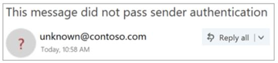

# Remitente no verificado

Para evitar que los mensajes de suplantación de identidad lleguen a su buzón, Outlook.com y Outlook en la web Compruebe que el remitente es quien dice ser y marcar los mensajes sospechosos como correo no deseado.

> [!IMPORTANT]
> Cuando un mensaje se marca como una estafa de suplantación de identidad (phishing), Outlook.com y Outlook en la web muestran una advertencia en la parte superior de la página, pero los vínculos del mensaje todavía se pueden abrir.

## ¿Cómo puedo identificar un mensaje sospechoso en mi bandeja de entrada?

Outlook.com y Outlook en la web muestran indicadores cuando no se puede identificar el remitente de un mensaje o su identidad es diferente de la que se ve en la dirección de remitente.

## Cómo administrar qué mensajes reciben el tratamiento de remitentes no comprobados 

Si es un cliente de Office 365, puede administrar esta característica a través del centro de seguridad & cumplimiento. 

- En el centro de seguridad & cumplimiento de Office 365, los administradores de espacios empresariales pueden activar o desactivar la característica a través de la protección contra la suplantación de identidad (phishing) en la Directiva ANTIPHISH. Además, puede administrarse mediante el cmdlet "Set-AntiPhishPolicy". Para obtener más información, consulte protección contra la suplantación de identidad en Office 365 y set-AntiPhishPolicy.

    

- Si un administrador ha identificado un falso positivo y un remitente no debe recibir el tratamiento de remitente no verificado, puede realizar una de las siguientes acciones para agregar el remitente a la lista de permitidos de falsificación de inteligencia de identidad:
        
    - Agregue el par de dominios mediante el conocimiento de inteligencia de ti falso. Para obtener más información, consulte Walkthrough: suplantar inteligencia Insight
                
    - Agregue el par de dominios mediante el cmdlet PhishFilterPolicy. Para obtener más información, vea Set-PhishFilterPolicy y protección contra la suplantación de identidad en Office 365

Además, no se aplica el tratamiento de remitente no verificado si se entregó en la bandeja de entrada a través de una lista de permitidos del administrador, incluidas las reglas de transporte de correo electrónico (ETR), la lista de dominios seguros (Directiva contra correo no deseado), la lista de remitentes seguros o un usuario ha establecido este usuario como un "remitente seguro" en su entrada.

### Ve un '? ' en la imagen del remitente

Cuando Outlook.com y Outlook en la web no pueden comprobar la identidad del remitente mediante técnicas de autenticación de correo electrónico, muestran un '? ' en la foto del remitente. 

No todos los mensajes que no se autentican son malintencionados. Sin embargo, debe tener cuidado al interactuar con los mensajes que no se autentican si no reconoce al remitente. O bien, si reconoce a un remitente que normalmente no tiene un '? ' en la imagen del remitente, pero, de repente, lo empieza a ver, es posible que se trate de una firma en la que se está suplantando el remitente.

## Preguntas más frecuentes

### ¿Qué criterios usa Outlook.com y Outlook en la web para agregar las propiedades "?" y "Via"?

Para el '? ' en la imagen del remitente: Outlook.com requiere que el mensaje pase la autenticación SPF o DKIM. Para obtener más información, consulte [configurar SPF en Office 365 para evitar](set-up-spf-in-office-365-to-help-prevent-spoofing.md) la suplantación de identidad (spoofing) y el [uso de DKIM para validar el correo electrónico saliente enviado desde su dominio personalizado en Office 365](use-dkim-to-validate-outbound-email.md).

Para la etiqueta Via: Si el dominio de la dirección de es diferente del dominio de la firma DKIM o del correo SMTP de, Outlook.com muestra el dominio en uno de estos dos campos (prefiriendo la firma DKIM).

### ¿Cómo quito el "?"

Para el '? ' en la imagen del remitente: como remitente, debe autenticar el mensaje con SPF o DKIM.

Para la etiqueta Via: como remitente, debe asegurarse de que el dominio de la firma DKIM o el correo SMTP de sea el mismo que o sea un subdominio de, el dominio de la dirección de remitente.

### ¿Outlook.com y Outlook en la web muestran esto por cada mensaje que no supera la autenticación?

No necesariamente. Outlook.com y Outlook en la web pueden tener otras propiedades dentro del mensaje para autenticar al remitente.

## Temas relacionados

[Ayuda para proteger su cuenta de correo electrónico de Outlook.com](https://support.office.com/article/a4f20fc5-4307-4ece-8231-6d4d4bd8a9ba)

[Tratar con el abuso, suplantación de identidad (phishing) o suplantación en Outlook.com](https://support.office.com/article/0d882ea5-eedc-4bed-aebc-079ffa1105a3)

[Filtrar correo no deseado y correo no deseado en Outlook en la web](https://support.office.com/article/db786e79-54e2-40cc-904f-d89d57b7f41d)
