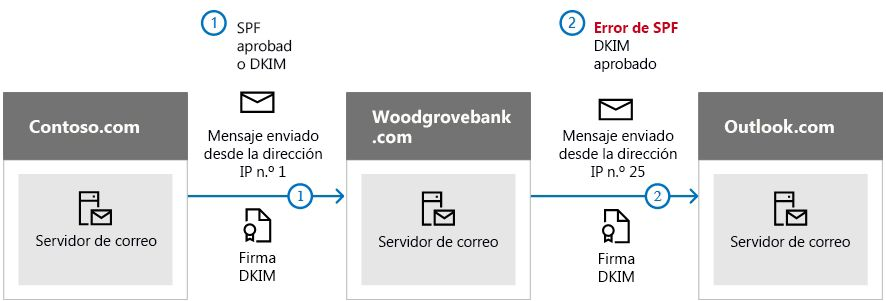

# <a name="use-dkim-to-validate-outbound-email-sent-from-your-custom-domain-in-office-365"></a><span data-ttu-id="0794e-103">Usar DKIM para validar el correo electrónico saliente enviado desde su dominio personalizado en Office 365</span><span class="sxs-lookup"><span data-stu-id="0794e-103">Use DKIM to validate outbound email sent from your custom domain in Office 365</span></span>

 <span data-ttu-id="0794e-104">**Resumen:** En este artículo se describe cómo usar DomainKeys Identified Mail (DKIM) con Office 365 para asegurarse de que los sistemas de correo electrónico de destino confían en los mensajes salientes desde su dominio personalizado.</span><span class="sxs-lookup"><span data-stu-id="0794e-104">**Summary:** This article describes how you use DomainKeys Identified Mail (DKIM) with Office 365 to ensure that destination email systems trust messages sent outbound from your custom domain.</span></span> 
  
<span data-ttu-id="0794e-p101">Debería usar DKIM además de SPF y DMARC para ayudarle a evitar que los suplantadores de identidad envíen mensajes que parece que provienen de su dominio. DKIM le permite agregar una firma digital a los mensajes de correo electrónico en el encabezado del mensaje. Suena complicado, pero realmente no lo es. Cuando configura DKIM, autoriza su dominio para asociar, o firmar, su nombre a un mensaje de correo electrónico mediante la autenticación criptográfica. Los sistemas de correo electrónico que reciben correo electrónico desde el dominio pueden usar esta firma digital para ayudarles a determinar si el correo entrante que reciben es legítimo.</span><span class="sxs-lookup"><span data-stu-id="0794e-p101">You should use DKIM in addition to SPF and DMARC to help prevent spoofers from sending messages that look like they are coming from your domain. DKIM lets you add a digital signature to email messages in the message header. Sounds complicated, but it's really not. When you configure DKIM, you authorize your domain to associate, or sign, its name to an email message by using cryptographic authentication. Email systems that receive email from your domain can use this digital signature to help determine if incoming email that they receive is legitimate.</span></span>
  
<span data-ttu-id="0794e-p102">Básicamente, usa una clave privada para cifrar el encabezado del correo electrónico saliente del dominio. Publica una clave pública en los registros DNS del dominio que los servidores de recepción pueden usar para descodificar la firma. Usan la clave pública para comprobar que los mensajes proceden realmente de usted y no de alguien que está suplantando la identidad del dominio.</span><span class="sxs-lookup"><span data-stu-id="0794e-p102">Basically, you use a private key to encrypt the header in your domain's outgoing email. You publish a public key to your domain's DNS records that receiving servers can then use to decode the signature. They use the public key to verify that the messages are really coming from you and not coming from someone spoofing your domain.</span></span>
  
<span data-ttu-id="0794e-p103">Office 365 configura automáticamente DKIM para dominios iniciales. El dominio inicial es el que crea Office 365 al registrarse con el servicio, por ejemplo, contoso.onmicrosoft.com. No es necesario hacer nada para configurar DKIM para el dominio inicial. Para más información sobre los dominios, vea [Preguntas más frecuentes de dominios](https://support.office.com/article/Domains-FAQ-1272bad0-4bd4-4796-8005-67d6fb3afc5a#bkmk_whydoihaveanonmicrosoft.comdomain).</span><span class="sxs-lookup"><span data-stu-id="0794e-p103">Office 365 automatically sets up DKIM for initial domains. The initial domain is the domain that Office 365 created for you when you signed up with the service, for example, contoso.onmicrosoft.com. You don't need to do anything to set up DKIM for your initial domain. For more information about domains, see [Domains FAQ](https://support.office.com/article/Domains-FAQ-1272bad0-4bd4-4796-8005-67d6fb3afc5a#bkmk_whydoihaveanonmicrosoft.comdomain).</span></span>
  
<span data-ttu-id="0794e-p104">También puede elegir no hacer nada acerca de DKIM para su dominio personalizado. Si no configura DKIM para su dominio personalizado, Office 365 crea un par de claves privadas y públicas, que permiten que DKIM firme y configure la directiva predeterminada de Office 365 para su dominio personalizado. Aunque esto suponga una cobertura suficiente para la mayoría de los clientes de Office 365, debería configurar manualmente DKIM para su dominio personalizado en las siguientes circunstancias:</span><span class="sxs-lookup"><span data-stu-id="0794e-p104">You can choose to do nothing about DKIM for your custom domain too. If you do not set up DKIM for your custom domain, Office 365 creates a private and public key pair, enables DKIM signing, and then configures the Office 365 default policy for your custom domain. While this is sufficient coverage for most Office 365 customers, you should manually configure DKIM for your custom domain in the following circumstances:</span></span>
  
- <span data-ttu-id="0794e-120">Tiene más de un dominio personalizado en Office 365</span><span class="sxs-lookup"><span data-stu-id="0794e-120">You have more than one custom domain in Office 365</span></span>
    
- <span data-ttu-id="0794e-121">También va a configurar DMARC (recomendado)</span><span class="sxs-lookup"><span data-stu-id="0794e-121">You're going to set up DMARC too (recommended)</span></span>
    
- <span data-ttu-id="0794e-122">Quiere tener el control sobre la clave privada</span><span class="sxs-lookup"><span data-stu-id="0794e-122">You want control over your private key</span></span>
    
- <span data-ttu-id="0794e-123">Quiere personalizar los registros CNAME</span><span class="sxs-lookup"><span data-stu-id="0794e-123">You want to customize your CNAME records</span></span>
    
- <span data-ttu-id="0794e-124">Quiere configurar claves de DKIM para los correos electrónicos que se originen en un dominio de terceros, por ejemplo, si usa un troyano de envío masivo de correo electrónico de terceros.</span><span class="sxs-lookup"><span data-stu-id="0794e-124">You want to set up DKIM keys for email originating out of a third-party domain, for example, if you use a third-party bulk mailer.</span></span>
    
<span data-ttu-id="0794e-125">En este artículo:</span><span class="sxs-lookup"><span data-stu-id="0794e-125">In this article:</span></span>
  
- [<span data-ttu-id="0794e-126">Cómo DKIM funciona mejor que SPF solo para evitar la suplantación de identidad malintencionada en Office 365</span><span class="sxs-lookup"><span data-stu-id="0794e-126">How DKIM works better than SPF alone to prevent malicious spoofing in Office 365</span></span>](use-dkim-to-validate-outbound-email.md#HowDKIMWorks)
    
- [<span data-ttu-id="0794e-127">Lo que necesita hacer para configurar manualmente DKIM en Office 365</span><span class="sxs-lookup"><span data-stu-id="0794e-127">What you need to do to manually set up DKIM in Office 365</span></span>](use-dkim-to-validate-outbound-email.md#SetUpDKIMO365)
    
- [<span data-ttu-id="0794e-128">Configurar DKIM para más de un dominio personalizado en Office 365</span><span class="sxs-lookup"><span data-stu-id="0794e-128">To configure DKIM for more than one custom domain in Office 365</span></span>](use-dkim-to-validate-outbound-email.md#DKIMMultiDomain)
    
- [<span data-ttu-id="0794e-129">Deshabilitar la directiva de firmas DKIM para un dominio personalizado en Office 365</span><span class="sxs-lookup"><span data-stu-id="0794e-129">Disabling the DKIM signing policy for a custom domain in Office 365</span></span>](use-dkim-to-validate-outbound-email.md#DisableDKIMSigningPolicy)
    
- [<span data-ttu-id="0794e-130">Comportamiento predeterminado para DKIM y Office 365</span><span class="sxs-lookup"><span data-stu-id="0794e-130">Default behavior for DKIM and Office 365</span></span>](use-dkim-to-validate-outbound-email.md#DefaultDKIMbehavior)
    
- [<span data-ttu-id="0794e-131">Configurar DKIM para que un servicio de terceros pueda enviar, o suplantar, correo electrónico en nombre de su dominio personalizado</span><span class="sxs-lookup"><span data-stu-id="0794e-131">Set up DKIM so that a third-party service can send, or spoof, email on behalf of your custom domain</span></span>](use-dkim-to-validate-outbound-email.md#SetUp3rdPartyspoof)
    
- [<span data-ttu-id="0794e-132">Pasos siguientes: una vez configurado DKIM para Office 365</span><span class="sxs-lookup"><span data-stu-id="0794e-132">Next steps: After you set up DKIM for Office 365</span></span>](use-dkim-to-validate-outbound-email.md#DKIMNextSteps)
    
## <a name="how-dkim-works-better-than-spf-alone-to-prevent-malicious-spoofing-in-office-365"></a><span data-ttu-id="0794e-133">Cómo DKIM funciona mejor que SPF solo para evitar la suplantación de identidad malintencionada en Office 365</span><span class="sxs-lookup"><span data-stu-id="0794e-133">How DKIM works better than SPF alone to prevent malicious spoofing in Office 365</span></span>
<span data-ttu-id="0794e-134"><a name="HowDKIMWorks"> </a></span><span class="sxs-lookup"><span data-stu-id="0794e-134"></span></span>

<span data-ttu-id="0794e-p105">SPF agrega información a un sobre del mensaje pero DKIM cifra realmente una firma dentro del encabezado del mensaje. Cuando reenvía un mensaje, el servidor de reenvío puede quitar partes de ese sobre del mensaje. Como la firma digital permanece en el mensaje de correo electrónico porque forma parte del encabezado del correo, DKIM funciona incluso cuando un mensaje se ha reenviado como se muestra en el siguiente ejemplo.</span><span class="sxs-lookup"><span data-stu-id="0794e-p105">SPF adds information to a message envelope but DKIM actually encrypts a signature within the message header. When you forward a message, portions of that message's envelope can be stripped away by the forwarding server. Since the digital signature stays with the email message because it's part of the email header, DKIM works even when a message has been forwarded as shown in the following example.</span></span>
  

  
<span data-ttu-id="0794e-p106">En este ejemplo, si solo había publicado un registro TXT de SPF en su dominio, el servidor de correo del destinatario podría haber marcado el correo electrónico como correo no deseado y generar un resultado de falso positivo. La adición de DKIM en este escenario reduce los informes de correo no deseado de falso positivo. Debido a que DKIM se basa en la criptografía de clave pública para autenticar y no solo en las direcciones IP, DKIM se considera una forma mucho más segura de autenticación que SPF. Se recomienda usar SPF y DKIM, así como DMARC, en la implementación.</span><span class="sxs-lookup"><span data-stu-id="0794e-p106">In this example, if you had only published an SPF TXT record for your domain, the recipient's mail server could have marked your email as spam and generated a false positive result. The addition of DKIM in this scenario reduces false positive spam reporting. Because DKIM relies on public key cryptography to authenticate and not just IP addresses, DKIM is considered a much stronger form of authentication than SPF. We recommend using both SPF and DKIM, as well as DMARC in your deployment.</span></span>
  
<span data-ttu-id="0794e-p107">Información esencial: DKIM usa una clave privada para insertar una firma cifrada en los encabezados del mensaje. El dominio de firma, o el dominio saliente, se inserta como el valor del campo **d=** en el encabezado. El dominio de comprobación, o dominio del destinatario, usa entonces el campo **=d** para buscar la clave pública desde DNS y autenticar el mensaje. Si el mensaje se comprueba, supera la comprobación DKIM.</span><span class="sxs-lookup"><span data-stu-id="0794e-p107">The nitty gritty: DKIM uses a private key to insert an encrypted signature into the message headers. The signing domain, or outbound domain, is inserted as the value of the **d=** field in the header. The verifying domain, or recipient's domain, then use the **d=** field to look up the public key from DNS and authenticate the message. If the message is verified, the DKIM check passes.</span></span> 
  
## <a name="what-you-need-to-do-to-manually-set-up-dkim-in-office-365"></a><span data-ttu-id="0794e-147">Lo que necesita hacer para configurar manualmente DKIM en Office 365</span><span class="sxs-lookup"><span data-stu-id="0794e-147">What you need to do to manually set up DKIM in Office 365</span></span>
<span data-ttu-id="0794e-148"><a name="SetUpDKIMO365"> </a></span><span class="sxs-lookup"><span data-stu-id="0794e-148"></span></span>

<span data-ttu-id="0794e-149">Para configurar DKIM, deberá completar estos pasos:</span><span class="sxs-lookup"><span data-stu-id="0794e-149">To configure DKIM, you will complete these steps:</span></span>
  
- [<span data-ttu-id="0794e-150">Publicar dos registros CNAME para su dominio personalizado en DNS</span><span class="sxs-lookup"><span data-stu-id="0794e-150">Publish two CNAME records for your custom domain in DNS</span></span>](use-dkim-to-validate-outbound-email.md#Publish2CNAME)
    
- [<span data-ttu-id="0794e-151">Habilitar la firma DKIM para su dominio personalizado en Office 365</span><span class="sxs-lookup"><span data-stu-id="0794e-151">Enable DKIM signing for your custom domain in Office 365</span></span>](use-dkim-to-validate-outbound-email.md#EnableDKIMinO365)
    
### <a name="publish-two-cname-records-for-your-custom-domain-in-dns"></a><span data-ttu-id="0794e-152">Publicar dos registros CNAME para su dominio personalizado en DNS</span><span class="sxs-lookup"><span data-stu-id="0794e-152">Publish two CNAME records for your custom domain in DNS</span></span>
<span data-ttu-id="0794e-153"><a name="Publish2CNAME"> </a></span><span class="sxs-lookup"><span data-stu-id="0794e-153"></span></span>

<span data-ttu-id="0794e-154">Para cada dominio para el que quiera agregar una firma DKIM en DNS, necesita publicar dos registros CNAME.</span><span class="sxs-lookup"><span data-stu-id="0794e-154">For each domain for which you want to add a DKIM signature in DNS, you need to publish two CNAME records.</span></span> <span data-ttu-id="0794e-155">DNS usa un registro CNAME para especificar que el nombre canónico de un dominio es un alias de otro nombre de dominio.</span><span class="sxs-lookup"><span data-stu-id="0794e-155">A CNAME record is used by DNS to specify that the canonical name of a domain is an alias for another domain name.</span></span> <span data-ttu-id="0794e-156">Los registros CNAME deben crearse en los servidores DNS disponibles públicamente para los dominios personalizados.</span><span class="sxs-lookup"><span data-stu-id="0794e-156">The CNAME records should be created on the publicly available DNS servers for your customized domains.</span></span> <span data-ttu-id="0794e-157">Los registros CNAME en su DNS señalarán a ya creados los registros que existen en DNS en los servidores DNS de Microsoft para Office 365.</span><span class="sxs-lookup"><span data-stu-id="0794e-157">The CNAME records in your DNS will point to already created A records that exist in DNS on the Microsoft DNS servers for Office 365.</span></span>
  
 <span data-ttu-id="0794e-p109">Office 365 realiza la rotación de claves automática mediante los dos registros que establezca. Si ha aprovisionado dominios personalizados adicionales además del dominio inicial de Office 365, debe publicar dos registros CNAME para cada dominio adicional. Por lo tanto, si tiene dos dominios, debe publicar dos registros CNAME adicionales, y así sucesivamente.</span><span class="sxs-lookup"><span data-stu-id="0794e-p109">Office 365 performs automatic key rotation using the two records that you establish. If you have provisioned custom domains in addition to the initial domain in Office 365, you must publish two CNAME records for each additional domain. So, if you have two domains, you must publish two additional CNAME records, and so on.</span></span>
  
<span data-ttu-id="0794e-161">Use el siguiente formato para los registros CNAME.</span><span class="sxs-lookup"><span data-stu-id="0794e-161">Use the following format for the CNAME records.</span></span>

> [!IMPORTANT]
> <span data-ttu-id="0794e-162">Si es uno de los clientes más importantes de GCC, se calcula _domainGuid_ de manera diferente.</span><span class="sxs-lookup"><span data-stu-id="0794e-162">If you are one of our GCC High customers, we calculate _domainGuid_ differently!</span></span> <span data-ttu-id="0794e-163">En lugar de buscar el registro MX de su _initialDomain_ para calcular _domainGuid_, lo calculamos directamente desde el dominio personalizado.</span><span class="sxs-lookup"><span data-stu-id="0794e-163">Instead of looking up the MX record for your _initialDomain_ to calculate _domainGuid_, instead we calculate it directly from the customized domain.</span></span> <span data-ttu-id="0794e-164">Por ejemplo, si el dominio personalizado es "contoso.com", el domainGuid se convierte en "Contoso-com", los períodos se reemplazan por un guión.</span><span class="sxs-lookup"><span data-stu-id="0794e-164">For example, if your customized domain is “contoso.com” your domainGuid becomes “contoso-com”, any periods are replaced with a dash.</span></span> <span data-ttu-id="0794e-165">Por lo tanto, independientemente de los registros MX a los que apunte el initialDomain, siempre usará el método anterior para calcular el domainGuid para usarlo en sus registros CNAME.</span><span class="sxs-lookup"><span data-stu-id="0794e-165">So, regardless of what MX record your initialDomain points to, you’ll always use the above method to calculate the domainGuid to use in your CNAME records.</span></span>

  
```
Host name:          selector1._domainkey
Points to address or value: selector1-<domainGUID>._domainkey.<initialDomain> 
TTL:                3600

Host name:          selector2._domainkey
Points to address or value: selector2-<domainGUID>._domainkey.<initialDomain> 
TTL:                3600
```

<span data-ttu-id="0794e-166">Donde:</span><span class="sxs-lookup"><span data-stu-id="0794e-166">Where:</span></span>
  
- <span data-ttu-id="0794e-167">Para Office 365, los selectores siempre serán "selector1" o "selector2".</span><span class="sxs-lookup"><span data-stu-id="0794e-167">For Office 365, the selectors will always be "selector1" or "selector2".</span></span> 
    
- <span data-ttu-id="0794e-168">_domainGUID_ es el mismo que el _domainGUID_ en el registro MX personalizado para el dominio personalizado que aparece antes de mail.Protection.Outlook.com.</span><span class="sxs-lookup"><span data-stu-id="0794e-168">_domainGUID_ is the same as the _domainGUID_ in the customized MX record for your custom domain that appears before mail.protection.outlook.com.</span></span> <span data-ttu-id="0794e-169">Por ejemplo, en el siguiente registro MX para el dominio contoso.com, _domainGUID_ es contoso-com:</span><span class="sxs-lookup"><span data-stu-id="0794e-169">For example, in the following MX record for the domain contoso.com, the _domainGUID_ is contoso-com:</span></span> 
    
    ```
    contoso.com.  3600  IN  MX   5 contoso-com.mail.protection.outlook.com
    ```

- <span data-ttu-id="0794e-170">_initialDomain_ es el dominio que usó al registrarse para Office 365.</span><span class="sxs-lookup"><span data-stu-id="0794e-170">_initialDomain_ is the domain that you used when you signed up for Office 365.</span></span> <span data-ttu-id="0794e-171">Los dominios iniciales siempre terminan en onmicrosoft.com.</span><span class="sxs-lookup"><span data-stu-id="0794e-171">Initial domains always end in onmicrosoft.com.</span></span> <span data-ttu-id="0794e-172">Para obtener información sobre cómo determinar el dominio inicial, vea [Preguntas más frecuentes de dominios](https://support.office.com/article/1272bad0-4bd4-4796-8005-67d6fb3afc5a#bkmk_whydoihaveanonmicrosoft.comdomain).</span><span class="sxs-lookup"><span data-stu-id="0794e-172">For information about determining your initial domain, see [Domains FAQ](https://support.office.com/article/1272bad0-4bd4-4796-8005-67d6fb3afc5a#bkmk_whydoihaveanonmicrosoft.comdomain).</span></span>
    
<span data-ttu-id="0794e-173">Por ejemplo, si tiene un dominio inicial de cohovineyardandwinery.onmicrosoft.com y dos dominios personalizados cohovineyard.com y cohowinery.com, necesitará configurar dos registros CNAME para cada dominio adicional, un total de cuatro registros CNAME.</span><span class="sxs-lookup"><span data-stu-id="0794e-173">For example, if you have an initial domain of cohovineyardandwinery.onmicrosoft.com, and two custom domains cohovineyard.com and cohowinery.com, you would need to set up two CNAME records for each additional domain, for a total of four CNAME records.</span></span>
  
```
Host name:          selector1._domainkey
Points to address or value: selector1-cohovineyard-com._domainkey.cohovineyardandwinery.onmicrosoft.com
TTL:                3600

Host name:          selector2._domainkey
Points to address or value: selector2-cohovineyard-com._domainkey.cohovineyardandwinery.onmicrosoft.com
TTL:                3600

Host name:          selector1._domainkey
Points to address or value: selector1-cohowinery-com._domainkey.cohovineyardandwinery.onmicrosoft.com 
TTL:                3600
 
Host name:          selector2._domainkey
Points to address or value: selector2-cohowinery-com._domainkey.cohovineyardandwinery.onmicrosoft.com 
TTL:                3600
```

### <a name="enable-dkim-signing-for-your-custom-domain-in-office-365"></a><span data-ttu-id="0794e-174">Habilitar la firma DKIM para su dominio personalizado en Office 365</span><span class="sxs-lookup"><span data-stu-id="0794e-174">Enable DKIM signing for your custom domain in Office 365</span></span>
<span data-ttu-id="0794e-175"><a name="EnableDKIMinO365"> </a></span><span class="sxs-lookup"><span data-stu-id="0794e-175"></span></span>

<span data-ttu-id="0794e-176">Una vez que haya publicado los registros CNAME en DNS, está preparado para habilitar la firma DKIM mediante Office 365.</span><span class="sxs-lookup"><span data-stu-id="0794e-176">Once you have published the CNAME records in DNS, you are ready to enable DKIM signing through Office 365.</span></span> <span data-ttu-id="0794e-177">Puede hacerlo en el centro de administración de Microsoft 365 o con PowerShell.</span><span class="sxs-lookup"><span data-stu-id="0794e-177">You can do this either through the Microsoft 365 admin center or by using PowerShell.</span></span>
  
#### <a name="to-enable-dkim-signing-for-your-custom-domain-through-the-admin-center"></a><span data-ttu-id="0794e-178">Para habilitar la firma DKIM para su dominio personalizado a través del centro de administración</span><span class="sxs-lookup"><span data-stu-id="0794e-178">To enable DKIM signing for your custom domain through the admin center</span></span>

1. <span data-ttu-id="0794e-179">[Inicie sesión en Office 365](https://support.office.microsoft.com/article/e9eb7d51-5430-4929-91ab-6157c5a050b4) con su cuenta profesional o educativa.</span><span class="sxs-lookup"><span data-stu-id="0794e-179">[Sign in to Office 365](https://support.office.microsoft.com/article/e9eb7d51-5430-4929-91ab-6157c5a050b4) with your work or school account.</span></span> 
    
2. <span data-ttu-id="0794e-180">Seleccione el icono del iniciador de aplicaciones en la esquina superior izquierda y elija **Administración**.</span><span class="sxs-lookup"><span data-stu-id="0794e-180">Select the app launcher icon in the upper-left and choose **Admin**.</span></span>
    
3. <span data-ttu-id="0794e-181">En el panel de navegación inferior izquierdo, expanda **Administración** y elija **Exchange**.</span><span class="sxs-lookup"><span data-stu-id="0794e-181">In the lower-left navigation, expand **Admin** and choose **Exchange**.</span></span>
    
4. <span data-ttu-id="0794e-182">Vaya a **Protección** \> **dkim**.</span><span class="sxs-lookup"><span data-stu-id="0794e-182">Go to **Protection** \> **dkim**.</span></span>
    
5. <span data-ttu-id="0794e-p114">Seleccione el dominio para el que quiere habilitar DKIM y, después, en **Firmar los mensajes de este dominio con firmas DKIM**, elija **Habilitar**. Repita este paso para cada dominio personalizado.</span><span class="sxs-lookup"><span data-stu-id="0794e-p114">Select the domain for which you want to enable DKIM and then, for **Sign messages for this domain with DKIM signatures**, choose **Enable**. Repeat this step for each custom domain.</span></span>
    
#### <a name="to-enable-dkim-signing-for-your-custom-domain-by-using-powershell"></a><span data-ttu-id="0794e-185">Para habilitar la firma DKIM para su dominio personalizado mediante PowerShell</span><span class="sxs-lookup"><span data-stu-id="0794e-185">To enable DKIM signing for your custom domain by using PowerShell</span></span>

1. <span data-ttu-id="0794e-186">[Conexión al PowerShell de Exchange Online](https://technet.microsoft.com/library/jj984289.aspx).</span><span class="sxs-lookup"><span data-stu-id="0794e-186">[Connect to Exchange Online PowerShell](https://technet.microsoft.com/library/jj984289.aspx).</span></span>
    
2. <span data-ttu-id="0794e-187">Ejecute el siguiente comando:</span><span class="sxs-lookup"><span data-stu-id="0794e-187">Run the following command:</span></span>
    
    ```
    New-DkimSigningConfig -DomainName <domain> -Enabled $true
    ```

   <span data-ttu-id="0794e-188">Donde _dominio_ es el nombre del dominio personalizado para el que desea habilitar la firma DKIM.</span><span class="sxs-lookup"><span data-stu-id="0794e-188">Where _domain_ is the name of the custom domain that you want to enable DKIM signing for.</span></span> 
    
   <span data-ttu-id="0794e-189">Por ejemplo, para el dominio contoso.com:</span><span class="sxs-lookup"><span data-stu-id="0794e-189">For example, for the domain contoso.com:</span></span>
    
    ```
    New-DkimSigningConfig -DomainName contoso.com -Enabled $true
    ```

#### <a name="to-confirm-dkim-signing-is-configured-properly-for-office-365"></a><span data-ttu-id="0794e-190">Para confirmar que la firma DKIM está configurada correctamente en Office 365</span><span class="sxs-lookup"><span data-stu-id="0794e-190">To Confirm DKIM signing is configured properly for Office 365</span></span>

<span data-ttu-id="0794e-p115">Espere unos minutos antes de seguir estos pasos para confirmar que ha configurado correctamente DKIM. Esto proporciona tiempo para que la información DKIM acerca del dominio se reparta por toda la red.</span><span class="sxs-lookup"><span data-stu-id="0794e-p115">Wait a few minutes before you follow these steps to confirm that you have properly configured DKIM. This allows time for the DKIM information about the domain to be spread throughout the network.</span></span>
  
- <span data-ttu-id="0794e-193">Envíe un mensaje desde una cuenta dentro de su dominio habilitado para DKIM en Office 365 a otra cuenta de correo electrónico como outlook.com o Hotmail.com.</span><span class="sxs-lookup"><span data-stu-id="0794e-193">Send a message from an account within your Office 365 DKIM-enabled domain to another email account such as outlook.com or Hotmail.com.</span></span>
    
- <span data-ttu-id="0794e-p116">No use una cuenta de aol.com con fines de prueba. AOL puede omitir la comprobación DKIM si se supera la comprobación SPF. Esto anulará la prueba.</span><span class="sxs-lookup"><span data-stu-id="0794e-p116">Do not use an aol.com account for testing purposes. AOL may skip the DKIM check if the SPF check passes. This will nullify your test.</span></span>
    
- <span data-ttu-id="0794e-p117">Abra el mensaje y observe el encabezado. Las instrucciones para ver el encabezado del mensaje variarán según el cliente de mensajería. Para obtener instrucciones acerca de cómo ver los encabezados de los mensajes en Outlook, consulte [Ver encabezados de mensajes de correo electrónico](https://support.office.com/article/CD039382-DC6E-4264-AC74-C048563D212C).</span><span class="sxs-lookup"><span data-stu-id="0794e-p117">Open the message and look at the header. Instructions for viewing the header for the message will vary depending on your messaging client. For instructions on viewing message headers in Outlook, see [View e-mail message headers](https://support.office.com/article/CD039382-DC6E-4264-AC74-C048563D212C).</span></span>

  <span data-ttu-id="0794e-p118">El mensaje con firma DKIM contendrá el nombre de host y el dominio que definió cuando publicó las entradas CNAME. El mensaje tendrá un aspecto similar al de este ejemplo:</span><span class="sxs-lookup"><span data-stu-id="0794e-p118">The DKIM-signed message will contain the host name and domain you defined when you published the CNAME entries. The message will look something like this example:</span></span> 
    
    ```
    From: Example User <example@contoso.com> 
    DKIM-Signature: v=1; a=rsa-sha256; q=dns/txt; c=relaxed/relaxed; 
        s=selector1; d=contoso.com; t=1429912795; 
        h=From:To:Message-ID:Subject:MIME-Version:Content-Type; 
        bh=<body hash>; 
        b=<signed field>;
    ```

- <span data-ttu-id="0794e-p119">Busque el encabezado Authentication-Results. Aunque cada servicio de recepción usa un formato ligeramente diferente para estampar el correo entrante, el resultado debe incluir algo como **DKIM=pass** o **DKIM=OK**.</span><span class="sxs-lookup"><span data-stu-id="0794e-p119">Look for the Authentication-Results header. While each receiving service uses a slightly different format to stamp the incoming mail, the result should include something like **DKIM=pass** or **DKIM=OK**.</span></span> 
    
## <a name="to-configure-dkim-for-more-than-one-custom-domain-in-office-365"></a><span data-ttu-id="0794e-204">Configurar DKIM para más de un dominio personalizado en Office 365</span><span class="sxs-lookup"><span data-stu-id="0794e-204">To configure DKIM for more than one custom domain in Office 365</span></span>
<span data-ttu-id="0794e-205"><a name="DKIMMultiDomain"> </a></span><span class="sxs-lookup"><span data-stu-id="0794e-205"></span></span>

<span data-ttu-id="0794e-p120">Si en algún momento en el futuro decide agregar otro dominio personalizado y quiere habilitar DKIM para el dominio nuevo, debe completar los pasos de este artículo para cada dominio. En concreto, complete todos los pasos de [Lo que necesita hacer para configurar manualmente DKIM en Office 365](use-dkim-to-validate-outbound-email.md#SetUpDKIMO365).</span><span class="sxs-lookup"><span data-stu-id="0794e-p120">If at some point in the future you decide to add another custom domain and you want to enable DKIM for the new domain, you must complete the steps in this article for each domain. Specifically, complete all steps in [What you need to do to manually set up DKIM in Office 365](use-dkim-to-validate-outbound-email.md#SetUpDKIMO365).</span></span>
  
## <a name="disabling-the-dkim-signing-policy-for-a-custom-domain-in-office-365"></a><span data-ttu-id="0794e-208">Deshabilitar la directiva de firmas DKIM para un dominio personalizado en Office 365</span><span class="sxs-lookup"><span data-stu-id="0794e-208">Disabling the DKIM signing policy for a custom domain in Office 365</span></span>
<span data-ttu-id="0794e-209"><a name="DisableDKIMSigningPolicy"> </a></span><span class="sxs-lookup"><span data-stu-id="0794e-209"></span></span>

<span data-ttu-id="0794e-p121">Deshabilitar la directiva de firmas no deshabilita DKIM completamente. Después de un período de tiempo, Office 365 aplicará automáticamente la directiva de Office 365 predeterminada para el dominio. Para obtener más información, consulte [Comportamiento predeterminado para DKIM y Office 365](use-dkim-to-validate-outbound-email.md#DefaultDKIMbehavior).</span><span class="sxs-lookup"><span data-stu-id="0794e-p121">Disabling the signing policy does not completely disable DKIM. After a period of time, Office 365 will automatically apply the default Office 365 policy for your domain. For more information, see [Default behavior for DKIM and Office 365](use-dkim-to-validate-outbound-email.md#DefaultDKIMbehavior).</span></span>
  
### <a name="to-disable-the-dkim-signing-policy-by-using-windows-powershell"></a><span data-ttu-id="0794e-213">Para deshabilitar la directiva de firmas DKIM mediante Windows PowerShell</span><span class="sxs-lookup"><span data-stu-id="0794e-213">To disable the DKIM signing policy by using Windows PowerShell</span></span>

1. <span data-ttu-id="0794e-214">[Conexión al PowerShell de Exchange Online](https://technet.microsoft.com/library/jj984289.aspx).</span><span class="sxs-lookup"><span data-stu-id="0794e-214">[Connect to Exchange Online PowerShell](https://technet.microsoft.com/library/jj984289.aspx).</span></span>
    
2. <span data-ttu-id="0794e-215">Ejecute uno de los siguientes comandos para cada dominio para el que quiera deshabilitar la firma DKIM.</span><span class="sxs-lookup"><span data-stu-id="0794e-215">Run one of the following commands for each domain for which you want to disable DKIM signing.</span></span>
    
    ```
    $p=Get-DkimSigningConfig -identity <domain>
    $p[0] | set-DkimSigningConfig -enabled $false
    ```

   <span data-ttu-id="0794e-216">Por ejemplo:</span><span class="sxs-lookup"><span data-stu-id="0794e-216">For example:</span></span>
    
    ```
    $p=Get-DkimSigningConfig -identity contoso.com
    $p[0] | set-DkimSigningConfig -enabled $false
    ```

   <span data-ttu-id="0794e-217">O bien</span><span class="sxs-lookup"><span data-stu-id="0794e-217">Or</span></span>
    
    ```
    Set-DkimSigningConfig -identity $p[<number>].identity -enabled $false
    ```

    <span data-ttu-id="0794e-218">Donde _número_ es el índice de la Directiva.</span><span class="sxs-lookup"><span data-stu-id="0794e-218">Where _number_ is the index of the policy.</span></span> <span data-ttu-id="0794e-219">Por ejemplo:</span><span class="sxs-lookup"><span data-stu-id="0794e-219">For example:</span></span> 
    
    ```
    Set-DkimSigningConfig -identity $p[0].identity -enabled $false
    ```

## <a name="default-behavior-for-dkim-and-office-365"></a><span data-ttu-id="0794e-220">Comportamiento predeterminado para DKIM y Office 365</span><span class="sxs-lookup"><span data-stu-id="0794e-220">Default behavior for DKIM and Office 365</span></span>
<span data-ttu-id="0794e-221"><a name="DefaultDKIMbehavior"> </a></span><span class="sxs-lookup"><span data-stu-id="0794e-221"></span></span>

<span data-ttu-id="0794e-222">Si no habilita DKIM, Office 365 crea automáticamente una clave pública DKIM de 1024 bits para el dominio predeterminado y la clave privada asociada que se almacena internamente en nuestro centro de recursos.</span><span class="sxs-lookup"><span data-stu-id="0794e-222">If you do not enable DKIM, Office 365 automatically creates a 1024-bit DKIM public key for your default domain and the associated private key which we store internally in our datacenter.</span></span> <span data-ttu-id="0794e-223">De forma predeterminada, Office 365 usa una configuración de firmas predeterminada para los dominios que no tienen una directiva local.</span><span class="sxs-lookup"><span data-stu-id="0794e-223">By default, Office 365 uses a default signing configuration for domains that do not have a policy in place.</span></span> <span data-ttu-id="0794e-224">Esto significa que si no configura DKIM, Office 365 usará su política predeterminada y se creará la clave para habilitar DKIM para el dominio.</span><span class="sxs-lookup"><span data-stu-id="0794e-224">This means that if you do not set up DKIM yourself, Office 365 will use its default policy and keys it creates in order to enable DKIM for your domain.</span></span>
  
<span data-ttu-id="0794e-225">Además, si deshabilita la firma DKIM después de habilitarla, después de un período de tiempo, Office 365 aplicará automáticamente la directiva predeterminada de Office 365 para el dominio.</span><span class="sxs-lookup"><span data-stu-id="0794e-225">Also, if you disable DKIM signing after enabling it, after a period of time, Office 365 will automatically apply the Office 365 default policy for your domain.</span></span>
  
<span data-ttu-id="0794e-p124">En el ejemplo siguiente, suponga que Office 365 ha habilitado DKIM para fabrikam.com, no el administrador del dominio. Esto significa que los CNAME necesarios no existen en DNS. Las firmas DKIM para el correo electrónico de este dominio tendrán un aspecto similar al siguiente:</span><span class="sxs-lookup"><span data-stu-id="0794e-p124">In the following example, suppose that DKIM for fabrikam.com was enabled by Office 365, not by the administrator of the domain. This means that the required CNAMEs do not exist in DNS. DKIM signatures for email from this domain will look something like this:</span></span>
  
```
From: Second Example <second.example@fabrikam.com> 
DKIM-Signature: v=1; a=rsa-sha256; q=dns/txt; c=relaxed/relaxed; 
    s=selector1-fabrikam-com; d=contoso.onmicrosoft.com; t=1429912795; 
    h=From:To:Message-ID:Subject:MIME-Version:Content-Type; 
    bh=<body hash>; 
    b=<signed field>;
```

<span data-ttu-id="0794e-p125">En este ejemplo, el nombre de host y el dominio contienen los valores a los que señalaría el registro CNAME si el administrador del dominio hubiera habilitado la firma DKIM para fabrikam.com. Finalmente, todos los mensajes enviados desde Office 365 contendrán una firma DKIM. Si habilita DKIM, el dominio será el mismo que el dominio que figura en la dirección del campo De:, en este caso, fabrikam.com. Si no lo hace, el dominio no se alineará y en su lugar se usará el dominio inicial de la organización. Para obtener información sobre cómo determinar el dominio inicial, vea [Preguntas más frecuentes de dominios](https://support.office.com/article/1272bad0-4bd4-4796-8005-67d6fb3afc5a#bkmk_whydoihaveanonmicrosoft.comdomain).</span><span class="sxs-lookup"><span data-stu-id="0794e-p125">In this example, the host name and domain contain the values to which the CNAME would point if DKIM-signing for fabrikam.com had been enabled by the domain administrator. Eventually, every single message sent from Office 365 will be DKIM-signed. If you enable DKIM yourself, the domain will be the same as the domain in the From: address, in this case fabrikam.com. If you don't, it will not align and instead will use your organization's initial domain. For information about determining your initial domain, see [Domains FAQ](https://support.office.com/article/1272bad0-4bd4-4796-8005-67d6fb3afc5a#bkmk_whydoihaveanonmicrosoft.comdomain).</span></span>
  
## <a name="set-up-dkim-so-that-a-third-party-service-can-send-or-spoof-email-on-behalf-of-your-custom-domain"></a><span data-ttu-id="0794e-234">Configurar DKIM para que un servicio de terceros pueda enviar, o suplantar, correo electrónico en nombre de su dominio personalizado</span><span class="sxs-lookup"><span data-stu-id="0794e-234">Set up DKIM so that a third-party service can send, or spoof, email on behalf of your custom domain</span></span>
<span data-ttu-id="0794e-235"><a name="SetUp3rdPartyspoof"> </a></span><span class="sxs-lookup"><span data-stu-id="0794e-235"></span></span>

<span data-ttu-id="0794e-p126">Algunos proveedores de servicio de correo electrónico masivo o proveedores de software como servicio, le permiten configurar claves DKIM para el correo electrónico que se origina de su servicio. Esto requiere la coordinación entre el usuario y el servicio de terceros para configurar los registros DNS necesarios. No existen dos organizaciones que lo hagan exactamente de la misma manera. En su lugar, el proceso depende completamente de la organización.</span><span class="sxs-lookup"><span data-stu-id="0794e-p126">Some bulk email service providers, or software-as-a-service providers, let you set up DKIM keys for email that originates from their service. This requires coordination between yourself and the third-party in order to set up the necessary DNS records. No two organizations do it exactly the same way. Instead, the process depends entirely on the organization.</span></span>
  
<span data-ttu-id="0794e-240">Un mensaje de ejemplo que muestra un DKIM configurado correctamente para contoso.com y bulkemailprovider.com puede tener el aspecto siguiente:</span><span class="sxs-lookup"><span data-stu-id="0794e-240">An example message showing a properly configured DKIM for contoso.com and bulkemailprovider.com might look like this:</span></span>
  
```
Return-Path: <communication@bulkemailprovider.com>
 From: <sender@contoso.com>
 DKIM-Signature: s=s1024; d=contoso.com
 Subject: Here is a message from Bulk Email Provider's infrastructure, but with a DKIM signature authorized by contoso.com
```

<span data-ttu-id="0794e-241">En este ejemplo, para conseguir este resultado:</span><span class="sxs-lookup"><span data-stu-id="0794e-241">In this example, in order to achieve this result:</span></span>
  
1. <span data-ttu-id="0794e-242">El proveedor de correo electrónico masivo le ha proporcionado una clave DKIM pública a Contoso.</span><span class="sxs-lookup"><span data-stu-id="0794e-242">Bulk Email Provider gave Contoso a public DKIM key.</span></span>
    
2. <span data-ttu-id="0794e-243">Contoso ha publicado la clave DKIM en su registro DNS.</span><span class="sxs-lookup"><span data-stu-id="0794e-243">Contoso published the DKIM key to its DNS record.</span></span>
    
3. <span data-ttu-id="0794e-p127">Al enviar el correo electrónico, el proveedor de correo electrónico masivo ha firmado la clave con la clave privada correspondiente. Al hacer esto, el proveedor de correo electrónico masivo ha adjuntado la firma DKIM al encabezado del mensaje.</span><span class="sxs-lookup"><span data-stu-id="0794e-p127">When sending email, Bulk Email Provider signs the key with the corresponding private key. By doing so, Bulk Email Provider attached the DKIM signature to the message header.</span></span>
    
4. <span data-ttu-id="0794e-p128">Los sistemas de correo electrónico de recepción realizan una comprobación DKIM mediante la autenticación del valor d=\<dominio\> de la firma DKIM contra el dominio del campo De: (5322.From) dirección del mensaje. En este ejemplo, los valores coinciden:</span><span class="sxs-lookup"><span data-stu-id="0794e-p128">Receiving email systems perform a DKIM check by authenticating the DKIM-Signature d=\<domain\> value against the domain in the From: (5322.From) address of the message. In this example, the values match:</span></span>
    
    <span data-ttu-id="0794e-248">Sender @**contoso.com**</span><span class="sxs-lookup"><span data-stu-id="0794e-248">sender@**contoso.com**</span></span>
    
    <span data-ttu-id="0794e-249">d =**contoso.com**</span><span class="sxs-lookup"><span data-stu-id="0794e-249">d=**contoso.com**</span></span>
    
## <a name="next-steps-after-you-set-up-dkim-for-office-365"></a><span data-ttu-id="0794e-250">Pasos siguientes: una vez configurado DKIM para Office 365</span><span class="sxs-lookup"><span data-stu-id="0794e-250">Next steps: After you set up DKIM for Office 365</span></span>
<span data-ttu-id="0794e-251"><a name="DKIMNextSteps"> </a></span><span class="sxs-lookup"><span data-stu-id="0794e-251"></span></span>

<span data-ttu-id="0794e-252">Aunque DKIM está diseñado para ayudar a evitar la suplantación de identidad, funciona mejor con SPF y DMARC.</span><span class="sxs-lookup"><span data-stu-id="0794e-252">Although DKIM is designed to help prevent spoofing, DKIM works better with SPF and DMARC.</span></span> <span data-ttu-id="0794e-253">Cuando haya configurado DKIM, si todavía no ha configurado SPF, debería hacerlo.</span><span class="sxs-lookup"><span data-stu-id="0794e-253">Once you have set up DKIM, if you have not already set up SPF you should do so.</span></span> <span data-ttu-id="0794e-254">Para ver una introducción rápida a SPF y configurarlo rápidamente, consulte [Set up SPF in Office 365 to help prevent spoofing](set-up-spf-in-office-365-to-help-prevent-spoofing.md).</span><span class="sxs-lookup"><span data-stu-id="0794e-254">For a quick introduction to SPF and to get it configured quickly, see [Set up SPF in Office 365 to help prevent spoofing](set-up-spf-in-office-365-to-help-prevent-spoofing.md).</span></span> <span data-ttu-id="0794e-255">Para comprender en detalle cómo Office 365 usa SPF, o para la solución de problemas o las implementaciones no estándar (por ejemplo, implementaciones híbridas), comience con [How Office 365 uses Sender Policy Framework (SPF) to prevent spoofing](how-office-365-uses-spf-to-prevent-spoofing.md).</span><span class="sxs-lookup"><span data-stu-id="0794e-255">For a more in-depth understanding of how Office 365 uses SPF, or for troubleshooting or non-standard deployments such as hybrid deployments, start with [How Office 365 uses Sender Policy Framework (SPF) to prevent spoofing](how-office-365-uses-spf-to-prevent-spoofing.md).</span></span> <span data-ttu-id="0794e-256">A continuación, consulte [Usar DMARC para validar el correo electrónico en Office 365](use-dmarc-to-validate-email.md).</span><span class="sxs-lookup"><span data-stu-id="0794e-256">Next, see [Use DMARC to validate email in Office 365](use-dmarc-to-validate-email.md).</span></span> <span data-ttu-id="0794e-257">Los [Encabezados de mensajes de correo no deseado](anti-spam-message-headers.md) incluyen la sintaxis y los campos de encabezado que usa Office 365 para efectuar las comprobaciones de DKIM.</span><span class="sxs-lookup"><span data-stu-id="0794e-257">[Anti-spam message headers](anti-spam-message-headers.md) includes the syntax and header fields used by Office 365 for DKIM checks.</span></span> 
  

