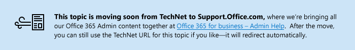

# Usar notificaciones de correo no deseado para el usuario final para liberar y notificar mensajes de correo no deseado en cuarentena

  
Si su administrador habilita las notificaciones de correo no deseado del usuario final, recibirá un mensaje de notificación con los mensajes destinados al buzón que se identificaron como correo no deseado y en su lugar se colocaron en cuarentena. Este mensaje incluye la cantidad de mensajes marcados como correo no deseado y en cuarentena de la lista, y la fecha y hora (en hora universal coordinada [UTC]) del último mensaje de la lista. En esta lista, puede ver la siguiente información sobre cada mensaje: 
  
- **Remitente** El nombre y la dirección de correo electrónico del remitente del mensaje en cuarentena. 
    
- **Asunto** El texto de la línea de asunto del mensaje en cuarentena. 
    
- **Fecha** La fecha y hora (en UTC) en que el mensaje fue colocado en cuarentena. 
    
- **Tamaño** El tamaño del mensaje en cuarentena, en kilobytes (KB). 
    
Puede realizar las siguientes acciones en cada mensaje:
  
- **Liberar a Bandeja de entrada** Al hacer clic en este vínculo, se libera el mensaje al buzón de entrada, donde puede verlo. 
    
- **Identificar como correo deseado** Al hacer clic en este vínculo, se envía una copia del mensaje a Microsoft para que sea analizado. El equipo de correo no deseado evalúa y analiza el mensaje, y, según de los resultados del análisis, ajusta las reglas de filtro de correo no deseado para permitir que el mensaje pase. 
    
> [!NOTE]
>  Los mensajes que están en cuarentena debido a una coincidencia de regla de flujo de correo (también conocida como una) no se incluyen en los mensajes de cuarentena de correo no deseado del usuario final. Solo se enumeran los mensajes en cuarentena de correo no deseado. >  Únicamente puede liberar un mensaje e identificarlo como un falso positivo (deseado) una vez. 
  

