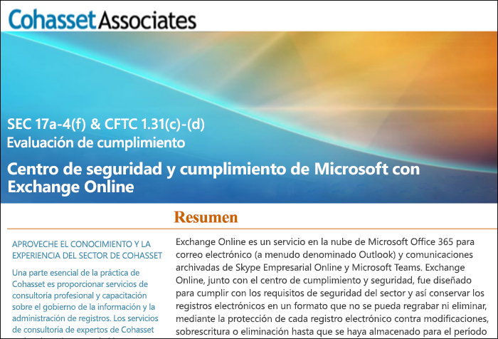

# Usar Exchange Online y el Centro de seguridad y cumplimiento para cumplir con la norma SEC 17a-4Use Exchange Online and the Security & Compliance Center to comply with SEC Rule 17a-4

Si su organización necesita cumplir con normas reglamentarias para la conservación de datos, el Centro de seguridad y cumplimiento de Office 365 proporciona características para administrar el ciclo de vida de sus datos en Exchange Online. Entre estas características, se incluye la capacidad de conservar, auditar, buscar y exportar sus datos. Estas funciones son suficientes para satisfacer las necesidades de la mayoría de las organizaciones.If your organization needs to comply with regulatory standards for retaining your data, the Office 365 Security & Compliance Center provides features to manage the lifecycle of your data in Exchange Online. This includes the ability to retain, audit, search, and export your data. These capabilities are sufficient to meet the needs of most organizations.

Pero algunas organizaciones de sectores con reglamentos estrictos están sujetas a requisitos reglamentarios con mayores limitaciones. Por ejemplo, las entidades financieras (como bancos y corredores de bolsa) están sujetas a la norma 17a-4 emitida por la Comisión de bolsas de valores (SEC). La norma 17a-4 tiene requisitos especiales para el almacenamiento de datos electrónicos, incluidos varios aspectos de la administración de registros, como la duración, el formato, la calidad, la disponibilidad y la responsabilidad de la retención de registros.However, some organizations in highly regulated industries are subject to more stringent regulatory requirements. For example, financial institutions such as banks or broker dealers are subject to Rule 17a-4 issued by the Securities and Exchange Commission (SEC). Rule 17a-4 has specific requirements for electronic data storage, including many aspects of record management, such as the duration, format, quality, availability, and accountability of records retention.

Para que estas organizaciones puedan comprender mejor cómo aprovechar el Centro de seguridad y cumplimiento para adaptarse a sus obligaciones reglamentarias para Exchange Online, específicamente en relación con los requisitos de la norma 17a-4, publicamos una evaluación de forma conjunta con Cohasset Associates.To help these organizations better understand how the Security & Compliance Center can be leveraged to meet their regulatory obligations for Exchange Online, specifically in relation to Rule 17a-4 requirements, we have released an assessment in partnership with Cohasset Associates.

Cohasset ha validado que, cuando Exchange Online y el Centro de seguridad y cumplimiento se configuran según las recomendaciones, cumplen con los requisitos de almacenamiento relevantes de las normas CFTC 1.31(c)-(d), FINRA 4511 y SEC 17a-4. Usamos este conjunto de reglas porque representa la guía más prescriptiva globalmente en relación con la retención de registros para entidades financieras.Cohasset validated that when Exchange Online and the Security & Compliance Center are configured as recommended, they meet the relevant storage requirements of CFTC Rule 1.31(c)-(d), FINRA Rule 4511, and SEC Rule 17a-4.  We targeted this set of rules because they represent the most prescriptive guidance globally for records retention for financial institutions.

## Descargar la evaluación de CohassetDownload the Cohasset assessment

Puede [descargar la evaluación de Cohasset aquí](https://servicetrust.microsoft.com/ViewPage/TrustDocuments?command=Download&downloadType=Document&downloadId=9fa8349d-a0c9-47d9-93ad-472aa0fa44ec&docTab=6d000410-c9e9-11e7-9a91-892aae8839ad_FAQ_and_White_Papers).You can [download the Cohasset assessment here](https://servicetrust.microsoft.com/ViewPage/TrustDocuments?command=Download&downloadType=Document&downloadId=9fa8349d-a0c9-47d9-93ad-472aa0fa44ec&docTab=6d000410-c9e9-11e7-9a91-892aae8839ad_FAQ_and_White_Papers).

## Esta evaluación es específica para Exchange Online.This assessment is specific to Exchange Online

Tenga en cuenta que esta evaluación es específica para Exchange Online. En la evaluación, no se incluyen otros servicios de Office 365, como SharePoint Online o OneDrive para la Empresa, aunque estamos planeando admitir esos servicios en relación con la norma SEC 17a-4 en el futuro.Note that this assessment is specific to Exchange Online. The assessment does not include other Office 365 services such as SharePoint Online or OneDrive for Business, although we are planning support for those services with respect to SEC 17a-4 in the future.

Es importante comprender que Skype Empresarial y Teams también almacenan datos en Exchange Online. Por lo tanto, se evalúan mensajes de Skype Empresarial y mensajes de chat y de canal de Teams.It’s important to understand that Skype for Business and Teams also store data in Exchange Online.  Therefore, the assessment does cover messages from Skype for Business and channel and chat messages from Teams.

## Usar Bloqueo de conservación es clave para la configuración recomendadaUsing Preservation Lock is key to the recommended configuration

Con frecuencia, en los sectores con reglamentos estrictos, es necesario almacenar las comunicaciones electrónicas para cumplir con el requisito WORM (escribir una vez, leer varias veces). El requisito WORM dicta una solución de almacenamiento en la que un registro tiene que:Highly regulated industries are often required to store electronic communications to meet the WORM (write once, read many) requirement. The WORM requirement dictates a storage solution in which a record must be:

- Conservarse durante un período de retención que no puede acortarse, solo incrementarse.Retained for a required retention period that cannot be shortened, only increased.
- Ser inmutable, lo que significa que el registro no se puede sobrescribir, borrar ni modificar durante el período de retención necesario.Immutable, meaning that the record cannot be overwritten, erased, or altered during the required retention period.

En Exchange Online, cuando se aplica una [directiva de retención](retention-policies.md) en el buzón de un usuario, todo el contenido del usuario se conserva basándose en los criterios de la directiva. De hecho, si un usuario intenta eliminar o modificar un correo electrónico, se conservará una copia del correo electrónico antes del cambio en una ubicación oculta y segura del buzón del usuario. Las directivas de retención permiten garantizar que una organización conserve comunicaciones electrónicas, pero esas directivas se pueden modificar.In Exchange Online, when a [retention policy](retention-policies.md) is applied to a user's mailbox, all of the user's content will be retained based on the criteria of the policy. In fact, if a user attempts to delete or modify an email, a copy of the email before the change is made will be preserved in a secure, hidden location in the user's mailbox. Retention polices can ensure that an organization retains electronic communications, but those policies can be modified.

Al colocar un Bloqueo de conservación en una directiva de retención, una organización se asegura de que la directiva no se pueda modificar. De hecho, después de aplicar un Bloqueo de conservación en una directiva de retención, las acciones siguientes están restringidas:By placing a Preservation Lock on a retention policy, an organization ensures that the policy cannot be modified. In fact, after a Preservation Lock is applied to a retention policy, the following actions are restricted:

- El período de retención de la directiva solo se puede incrementar, no se puede acortar.The retention period of the policy can only be increased, not shortened.
- Se pueden agregar usuarios a la directiva, pero no se puede quitar ningún usuario.Users can be added to the policy, but no user can be removed.
- Un administrador no puede eliminar una directiva de retención.The retention policy cannot be deleted by an administrator.

Bloqueo de conservación puede ayudarle a cumplir con los requisitos reglamentarios de SEC 17a-4.Preservation Lock can help you meet the SEC 17a-4 regulatory requirements.

## Configurar Bloqueo de conservaciónHow to set up Preservation Lock

Se puede bloquear una directiva de retención mediante el uso de PowerShell. Para obtener más información, vea [Bloquear una directiva de retención](retention-policies.md#locking-a-retention-policy).You can lock a retention policy by using PowerShell. For more information, see [Locking a retention policy](retention-policies.md#locking-a-retention-policy).

## Limitaciones conocidasKnown limitations

Somos conscientes de algunas limitaciones en Exchange Online. Estamos trabajando de forma activa en estas limitaciones y esperamos admitir estos escenarios en julio de 2019:We’re aware of a few limitations in Exchange Online. We’re actively working on these and expect to release support for these scenarios in July 2019:

- La auditoría de nivel de elemento no está disponible en los buzones de grupo de Office 365.Item-level auditing is not available in Office 365 Group mailboxes.
- Las comunicaciones en conversaciones no están disponibles para los mensajes de canal y de chat de Teams.Threaded communications are not available for Teams chat and channel messages.
- Los “me gusta” no se conservan para los mensajes de canal y de chat de Teams.Likes are not retained for Teams chat and channel messages.
