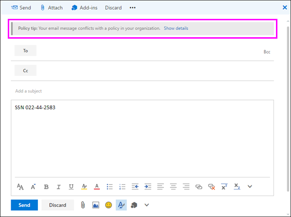

# Enviar notificaciones de correo electrónico y mostrar sugerencias de directivas para las directivas DLPSend email notifications and show policy tips for DLP policies

Puede usar una directiva de (DLP) de prevención de pérdida de datos para identificar, supervisar y proteger información confidencial a través de Office 365. Desea que las personas de la organización que trabajan con esta información confidencial a mantener el cumplimiento de las directivas de DLP, pero no desea bloquear la ellos innecesariamente hacer su trabajo. Esto es donde pueden ayudarle notificaciones por correo electrónico y sugerencias de directiva.You can use a data loss prevention (DLP) policy to identify, monitor, and protect sensitive information across Office 365. You want people in your organization who work with this sensitive information to stay compliant with your DLP policies, but you don't want to block them unnecessarily from getting their work done. This is where email notifications and policy tips can help.
  

  
Una sugerencia de directiva es una notificación o una advertencia que aparece cuando alguien está trabajando con el contenido que está en conflicto con una directiva de DLP: por ejemplo, al igual que un libro de Excel en un OneDrive para el sitio de negocio que contiene información de identificación personal (PII) y es de contenido compartir con un usuario externo.A policy tip is a notification or warning that appears when someone is working with content that conflicts with a DLP policy—for example, content like an Excel workbook on a OneDrive for Business site that contains personally identifiable information (PII) and is shared with an external user.
  
Puede usar las notificaciones de correo electrónico y sugerencias de directivas para aumentar el conocimiento y ayudar a enseñar a las personas acerca de las directivas de su organización. También puede dar la opción Reemplazar la directiva para que no está bloqueados si tienen una empresa válida de los usuarios necesitan o si la directiva está detectando un falso positivo.You can use email notifications and policy tips to increase awareness and help educate people about your organization's policies. You can also give people the option to override the policy, so that they're not blocked if they have a valid business need or if the policy is detecting a false positive.
  
En la seguridad de Office 365 &amp; centro de cumplimiento, cuando se crea una directiva de DLP, puede configurar las notificaciones de usuario para:In the Office 365 Security &amp; Compliance Center, when you create a DLP policy, you can configure the user notifications to:
  
- Enviar una notificación de correo electrónico a las personas que elija que describe el problema.Send an email notification to the people you choose that describes the issue.
    
- Mostrar una sugerencia de directiva para el contenido que está en conflicto con la directiva de DLP:Display a policy tip for content that conflicts with the DLP policy:
    
  - Para el correo electrónico en Outlook en el web y Outlook 2013 y versiones posteriores, aparece la sugerencia de directiva en la parte superior de un mensaje por encima de los destinatarios mientras se crean el mensaje.For email in Outlook on the web and Outlook 2013 and later, the policy tip appears at the top of a message above the recipients while the message is being composed.
    
  - Para los documentos en un OneDrive para la cuenta de empresa o sitio de SharePoint Online, la sugerencia de directiva se indica mediante un icono de advertencia que aparece en el elemento. Para obtener más información, puede seleccionar un elemento y, a continuación, seleccione **la información de** en la esquina superior derecha de la página para abrir el panel de detalles.For documents in a OneDrive for Business account or SharePoint Online site, the policy tip is indicated by a warning icon that appears on the item. To view more information, you can select an item and then choose **Information** in the upper-right corner of the page to open the details pane. 
    
  - Para Excel 2016, 2016 de PowerPoint y documentos de Word 2016 que se almacenan en un OneDrive para el sitio de negocio o sitio de SharePoint Online que se incluye en la directiva de DLP, aparece la sugerencia de directiva en la barra de mensajes y la vista Backstage (menú **archivo** \> \*\* Info\*\*).For Excel 2016, PowerPoint 2016, and Word 2016 documents that are stored on a OneDrive for Business site or SharePoint Online site that's included in the DLP policy, the policy tip appears on the Message Bar and the Backstage view ( **File** menu \> **Info**).
    
## Agregar las notificaciones de usuario a una directiva de DLPAdd user notifications to a DLP policy

Cuando se crea una directiva de DLP, las notificaciones de correo electrónico y sugerencias de directiva forman parte de la sección **notificaciones de usuario** .When you create a DLP policy, both email notifications and policy tips are part of the **User notifications** section. 
  
1. Vaya a [https://protection.office.com](https://protection.office.com).Go to [https://protection.office.com](https://protection.office.com).
    
2. Inicie sesión en Office 365 con su cuenta de trabajo o escuela. Ahora está en la seguridad de Office 365 &amp; centro de cumplimiento.Sign in to Office 365 using your work or school account. You're now in the Office 365 Security &amp; Compliance Center.
    
3. En la seguridad &amp; centro de cumplimiento \> barra de navegación izquierda \> **prevención de pérdida de datos** \> **Directiva** \> **+ crear una directiva**.In the Security &amp; Compliance Center \> left navigation \> **Data loss prevention** \> **Policy** \> **+ Create a policy**.
    
    
  
4. Elija la plantilla de directiva DLP que protege los tipos de información confidencial que necesita \> **siguiente**.Choose the DLP policy template that protects the types of sensitive information that you need \> **Next**.
    
    Para empezar con una plantilla vacía, elija **personalizado** \> **directiva personalizada** \> **siguiente**.To start with an empty template, choose **Custom** \> **Custom policy** \> **Next**.
    
5. Nombre de la directiva de \> **siguiente**.Name the policy \> **Next**.
    
6. Para elegir las ubicaciones que desea que la directiva DLP para proteger, realice una de las siguientes opciones:To choose the locations that you want the DLP policy to protect, do one of the following:
    
  - Elija **todas las ubicaciones en Office 365** \> **siguiente**.Choose **All locations in Office 365** \> **Next**.
    
  - Elija **Permitirme elegir ubicaciones específicas** \> **siguiente**.Choose **Let me choose specific locations** \> **Next**.
    
    Para incluir o excluir una ubicación completa como todos los correos electrónicos de Exchange o todas las cuentas de OneDrive, cambie el **estado** de esa ubicación activado o desactivado.To include or exclude an entire location such as all Exchange email or all OneDrive accounts, switch the **Status** of that location on or off. 
    
    Para incluir sólo determinados sitios de SharePoint o cuentas de OneDrive, cambiar el **estado** a y, a continuación, haga clic en los vínculos en **incluir** elija sitios específicos o las cuentas.To include only specific SharePoint sites or OneDrive accounts, switch the **Status** to on, and then click the links under **Include** to choose specific sites or accounts. 
    
7. Elija **Usar configuración avanzada** \> **siguiente**.Choose **Use advanced settings** \> **Next**.
    
8. Elija **+ nueva regla**.Choose **+ New rule**.
    
9. En el editor de reglas, en **las notificaciones de usuario**, cambiar el estado.In the rule editor, under **User notifications**, switch the status on.
    
    
  
## Opciones para configurar las notificaciones de correo electrónicoOptions for configuring email notifications

Para cada regla en una directiva DLP, puede:For each rule in a DLP policy, you can:
  
- Enviar la notificación a las personas que elija. Estas personas pueden ser el propietario del contenido, la persona que modificó por última vez el contenido, el propietario del sitio donde se almacena el contenido o un usuario específico.Send the notification to the people you choose. These people can include the owner of the content, the person who last modified the content, the owner of the site where the content is stored, or a specific user.
    
- Personalizar el texto que se incluye en la notificación mediante el uso de HTML o tokens. Vea la sección siguiente para obtener más información.Customize the text that's included in the notification by using HTML or tokens. See the section below for more information.
    
> [!NOTE]
>  Se pueden enviar notificaciones por correo electrónico sólo a los destinatarios, no grupos o listas de distribución. > sólo el nuevo contenido se activará una notificación de correo electrónico. Se activarán la edición de contenido existente, pero no una notificación de correo electrónico de sugerencias de directiva.Email notifications can be sent only to individual recipients—not groups or distribution lists. >  Only new content will trigger an email notification. Editing existing content will trigger policy tips but not an email notification. 
  

  
### Notificación de correo electrónico predeterminadaDefault email notification

Las notificaciones tienen una línea de asunto que comienza con la acción realizada, por ejemplo, "Notificación", "Mensaje bloqueado" para el correo electrónico o "Acceso bloqueado" para los documentos. Si la notificación es acerca de un documento, el cuerpo del mensaje de notificación incluye un vínculo que le llevará al sitio donde el documento del almacena y abre la sugerencia de directiva para el documento, donde se puede resolver cualquier problema (vea la sección siguiente sobre sugerencias de directiva). Si la notificación es acerca de un mensaje, la notificación incluye como datos adjuntos del mensaje que coincide con una directiva de DLP.Notifications have a Subject line that begins with the action taken, such as "Notification", "Message Blocked" for email, or "Access Blocked" for documents. If the notification is about a document, the notification message body includes a link that takes you to the site where the document's stored and opens the policy tip for the document, where you can resolve any issues (see the section below about policy tips). If the notification is about a message, the notification includes as an attachment the message that matches a DLP policy.
  

  
De forma predeterminada, las notificaciones muestran texto similar al siguiente para un elemento de un sitio. El texto de notificación se configura por separado para cada regla, por lo que el texto que se muestra es diferente en función de qué regla coincida.By default, notifications display text similar to the following for an item on a site. The notification text is configured separately for each rule, so the text that's displayed differs depending on which rule is matched.

|**Si la regla de directiva DLP hace esto...****If the DLP policy rule does this…**|**A continuación, la notificación de forma predeterminada para SharePoint o OneDrive para documentos empresariales dice esto...****Then the default notification for SharePoint or OneDrive for Business documents says this…**|**A continuación, la notificación de forma predeterminada para los mensajes de Outlook dice esto...****Then the default notification for Outlook messages says this…**|
|:-----|:-----|:-----|
|Envía una notificación, pero no permitir invalidaciónSends a notification but doesn't allow override    |Este elemento está en conflicto con una directiva de la organización.This item conflicts with a policy in your organization.    |Su correo electrónico mensaje entra en conflicto con una directiva de la organización.Your email message conflicts with a policy in your organization.    |
|Bloquea el acceso, envía una notificación y permite la invalidaciónBlocks access, sends a notification, and allows override    |Este elemento está en conflicto con una directiva de la organización. Si no resolver este conflicto, se podría bloquear el acceso a este archivo.This item conflicts with a policy in your organization. If you don't resolve this conflict, access to this file might be blocked.    |Su correo electrónico mensaje entra en conflicto con una directiva de la organización. El mensaje no se entregó a todos los destinatarios.Your email message conflicts with a policy in your organization. The message wasn't delivered to all recipients.    |
|Bloquea el acceso y envía una notificaciónBlocks access and sends a notification    |Este elemento está en conflicto con una directiva de la organización. El acceso a este elemento está bloqueado para todos excepto para su propietario, para el último usuario que lo modificó y para el administrador de la colección de sitios primaria.This item conflicts with a policy in your organization. Access to this item is blocked for everyone except its owner, last modifier, and the primary site collection administrator.    |Su correo electrónico mensaje entra en conflicto con una directiva de la organización. El mensaje no se entregó a todos los destinatarios.Your email message conflicts with a policy in your organization. The message wasn't delivered to all recipients.    |
   
### Notificación de correo electrónico personalizadoCustom email notification

Puede crear una notificación de correo electrónico personalizado en lugar de enviar la notificación de correo electrónico predeterminado en el que los usuarios finales o administradores. La notificación de correo electrónico personalizado es compatible con HTML y tiene un límite de 5.000 caracteres. Puede utilizar HTML para incluir imágenes, el formato y otros de personalización de marca en la notificación.You can create a custom email notification instead of sending the default email notification to your end users or admins. The custom email notification supports HTML and has a 5,000-character limit. You can use HTML to include images, formatting, and other branding in the notification.
  
También puede usar los siguientes tokens para ayudar a personalizar la notificación de correo electrónico. Estos tokens son variables que se han reemplazado por información específica en la notificación que se envía.You can also use the following tokens to help customize the email notification. These tokens are variables that are replaced by specific information in the notification that's sent.

|**Símbolo (token)****Token**|**Descripción****Description**|
|:-----|:-----|
|%% AppliedActions %%%%AppliedActions%%    |Las acciones que se aplica al contenido.The actions applied to the content.    |
|%% ContentURL %%%%ContentURL%%    |La dirección URL del documento en el sitio de SharePoint Online o OneDrive para el sitio de negocio.The URL of the document on the SharePoint Online site or OneDrive for Business site.    |
|%% MatchedConditions %%%%MatchedConditions%%    |Las condiciones que coincidieron con el contenido. Use este token para informar a las personas de posibles problemas con el contenido.The conditions that were matched by the content. Use this token to inform people of possible issues with the content.    |
   

  
## Opciones para configurar sugerencias de directivaOptions for configuring policy tips

Para cada regla de una directiva DLP, puede configurar sugerencias de directiva para:For each rule in a DLP policy, you can configure policy tips to:
  
- Simplemente notifique a la persona que el contenido está en conflicto con una directiva de DLP, por lo que pueden tomar medidas para resolver el conflicto. Puede usar el texto predeterminado (consulte las tablas siguientes) o escriba el texto personalizado sobre directivas específicas de su organización.Simply notify the person that the content conflicts with a DLP policy, so that they can take action to resolve the conflict. You can use the default text (see the tables below) or enter custom text about your organization's specific policies.
    
- Permitir que la persona invalide la directiva DLP. Opcionalmente, puede:Allow the person to override the DLP policy. Optionally, you can:
    
  - Exigir a la persona escribir una justificación comercial para invalidar la directiva. Esta información se registra y se puede ver en los informes DLP en la sección **informes** de la seguridad &amp; centro de cumplimiento.Require the person to enter a business justification for overriding the policy. This information is logged and you can view it in the DLP reports in the **Reports** section of the Security &amp; Compliance Center. 
    
  - Permitir que la persona informe de un falso positivo e invalide la directiva DLP. Esta información también se registra en los informes, de modo que puede usar falsos positivos para ajustar las reglas.Allow the person to report a false positive and override the DLP policy. This information is also logged for reporting, so that you can use false positives to fine tune your rules.
    

  
Por ejemplo, es posible que tenga una directiva de DLP aplicada a OneDrive para sitios de negocio que detecta la información de identificación personal (PII), y esta directiva tiene tres reglas:For example, you may have a DLP policy applied to OneDrive for Business sites that detects personally identifiable information (PII), and this policy has three rules:
  
1. Primera regla: Si se detectan menos de cinco instancias de información confidencial en un documento y el documento se comparte con personas que pertenecen a la organización, la acción **Enviar una notificación** muestra una sugerencia de directiva. Para obtener sugerencias de directiva, no se necesitan opciones de invalidación porque esta regla simplemente está avisando a las personas y no está bloqueando el acceso.First rule: If fewer than five instances of this sensitive information are detected in a document, and the document is shared with people inside the organization, the **Send a notification** action displays a policy tip. For policy tips, no override options are necessary because this rule is simply notifying people and not blocking access. 
    
2. En segundo lugar de la regla: si es mayor que cinco instancias de esta información confidencial detectadas en un documento y el documento se comparte con personas dentro de la organización, la acción de **bloquear el acceso a contenido** restringe los permisos para el archivo y el \*\* Enviar una notificación\*\* acción permite a los usuarios reemplazar las acciones de esta regla si se proporciona una justificación comercial. Profesionales de su organización a veces requiere personas interno compartir datos PII y no desea que la directiva DLP para bloquear este trabajo.Second rule: If greater than five instances of this sensitive information are detected in a document, and the document is shared with people inside the organization, the **Block access to content** action restricts the permissions for the file, and the **Send a notification** action allows people to override the actions in this rule by providing a business justification. Your organization's business sometimes requires internal people to share PII data, and you don't want your DLP policy to block this work. 
    
3. Tercera regla: Si se detectan más de cinco instancias de información confidencial en un documento y el documento se comparte con personas externas a la organización, la acción **Bloquear el acceso al contenido** restringe los permisos para el archivo y la acción **Enviar una notificación** no permite a los usuarios invalidar las acciones de esta regla porque la información se comparte con el exterior. Bajo ninguna circunstancia las personas de su organización pueden compartir datos de PII fuera de la organización.Third rule: If greater than five instances of this sensitive information are detected in a document, and the document is shared with people outside the organization, the **Block access to content** action restricts the permissions for the file, and the **Send a notification** action does not allow people to override the actions in this rule because the information is shared externally. Under no circumstances should people in your organization be allowed to share PII data outside the organization. 
    
Estos son algunos puntos clave para comprender el uso de una sugerencia de directiva para invalidar una regla:Here are some fine points to understand about using a policy tip to override a rule:
  
- Es la opción de ignorar por regla y reemplaza todas las acciones de la regla (excepto el envío de una notificación, que no se puede reemplazar).The option to override is per rule, and it overrides all of the actions in the rule (except sending a notification, which can't be overridden).
    
- Es posible que el contenido para que coincida con varias reglas en una directiva de DLP, pero se mostrarán solo la sugerencia de directiva desde la regla más restrictiva, la prioridad más alta. Por ejemplo, una sugerencia de directiva de una regla que bloquea el acceso al contenido que se mostrarán a través de una sugerencia de directiva de una regla que simplemente envía una notificación. Esto evita que las personas vean una cascada de sugerencias de directiva.It's possible for content to match several rules in a DLP policy, but only the policy tip from the most restrictive, highest-priority rule will be shown. For example, a policy tip from a rule that blocks access to content will be shown over a policy tip from a rule that simply sends a notification. This prevents people from seeing a cascade of policy tips.
    
- Si las sugerencias de directiva en la regla más restrictiva permite que los usuarios invaliden la regla, la invalidación de esta regla invalida también otras reglas que coinciden con el contenido.If the policy tips in the most restrictive rule allow people to override the rule, then overriding this rule also overrides any other rules that the content matched.
    
## Sugerencias de directiva en sitios de OneDrive para la Empresa y sitios de SharePoint OnlinePolicy tips on OneDrive for Business sites and SharePoint Online sites

Cuando un documento en un OneDrive para el sitio de negocio o sitio de SharePoint Online coincide con una regla en una directiva de DLP, y esa regla utiliza sugerencias de directiva, las sugerencias de directiva mostrar iconos especiales en el documento:When a document on a OneDrive for Business site or SharePoint Online site matches a rule in a DLP policy, and that rule uses policy tips, the policy tips display special icons on the document:
  
1. Si la regla envía una notificación sobre el archivo, aparece el icono de advertencia.If the rule sends a notification about the file, the warning icon appears.
    
2. Si la regla bloquea el acceso al documento, aparece el icono de bloqueado.If the rule blocks access to the document, the blocked icon appears.
    

  
Para realizar acciones en un documento, puede seleccionar un elemento \> seleccione **la información de** en la esquina superior derecha de la página para abrir el panel de detalles \> **sugerencia de directiva de vista**.To take action on a document, you can select an item \> choose **Information** in the upper-right corner of the page to open the details pane \> **View policy tip**.
  
La sugerencia de directiva enumera los problemas con el contenido y, si las sugerencias de directiva están configuradas con estas opciones, puede elegir **Resolver** y luego **Invalidar** la sugerencia de directiva o **Informar** de un falso positivo.The policy tip lists the issues with the content, and if the policy tips are configured with these options, you can choose **Resolve**, and then **Override** the policy tip or **Report** a false positive. 
  

  

  
Las directivas DLP se sincronizan con los sitios y el contenido se evalúa con estas periódicamente y de forma asincrónica, por lo que puede haber un breve retraso entre el momento en que se crea la directiva DLP y el momento en que se empiezan a ver sugerencias de directiva. Puede haber un retraso similar desde el momento en que se invalida o resuelve una sugerencia de directiva hasta cuando desaparece el icono en el documento en el sitio.DLP policies are synced to sites and contented is evaluated against them periodically and asynchronously, so there may be a short delay between the time you create the DLP policy and the time you begin to see policy tips. There may be a similar delay from when you resolve or override a policy tip to when the icon on the document on the site goes away.
  
### Texto predeterminado para las sugerencias de directiva en los sitiosDefault text for policy tips on sites

De forma predeterminada, las sugerencias de directiva muestran texto similar al siguiente para un elemento de un sitio. El texto de notificación se configura por separado para cada regla, por lo que el texto que se muestra es diferente en función de qué regla coincida.By default, policy tips display text similar to the following for an item on a site. The notification text is configured separately for each rule, so the text that's displayed differs depending on which rule is matched.

|**Si la regla de directiva DLP hace esto...****If the DLP policy rule does this…**|**La sugerencia de directiva predeterminada indica lo siguiente...****Then the default policy tip says this…**|
|:-----|:-----|
|Envía una notificación, pero no permitir invalidaciónSends a notification but doesn't allow override    |Este elemento está en conflicto con una directiva de la organización.This item conflicts with a policy in your organization.    |
|Bloquea el acceso, envía una notificación y permite la invalidaciónBlocks access, sends a notification, and allows override    |Este elemento está en conflicto con una directiva de la organización. Si no resolver este conflicto, se podría bloquear el acceso a este archivo.This item conflicts with a policy in your organization. If you don't resolve this conflict, access to this file might be blocked.    |
|Bloquea el acceso y envía una notificaciónBlocks access and sends a notification    |Este elemento está en conflicto con una directiva de la organización. El acceso a este elemento está bloqueado para todos excepto para su propietario, para el último usuario que lo modificó y para el administrador de la colección de sitios primaria.This item conflicts with a policy in your organization. Access to this item is blocked for everyone except its owner, last modifier, and the primary site collection administrator.    |
   
### Texto personalizado para obtener sugerencias de directiva en los sitiosCustom text for policy tips on sites

Puede personalizar el texto de sugerencias de directivas por separado a partir de la notificación de correo electrónico. A diferencia de texto personalizado para las notificaciones de correo electrónico (vea por encima de la sección), texto personalizado para obtener sugerencias de directiva no acepta HTML o tokens. En su lugar, el texto personalizado para obtener sugerencias de directiva es texto sin formato sólo con un límite de 256 caracteres.You can customize the text for policy tips separately from the email notification. Unlike custom text for email notifications (see above section), custom text for policy tips does not accept HTML or tokens. Instead, custom text for policy tips is plain text only with a 256-character limit.
  
## Sugerencias de directiva en Outlook en la web y Outlook 2013 y versiones posterioresPolicy tips in Outlook on the web and Outlook 2013 and later

Al redactar un correo electrónico nuevo en Outlook en la web y Outlook 2013 y más adelante, verá una sugerencia de directiva si agrega contenido que coincide con una regla en una directiva de DLP, y esa regla usa sugerencias de directiva. Mientras se está compuesto el mensaje, aparece la sugerencia de directiva en la parte superior del mensaje, por encima de los destinatarios.When you compose a new email in Outlook on the web and Outlook 2013 and later, you'll see a policy tip if you add content that matches a rule in a DLP policy, and that rule uses policy tips. The policy tip appears at the top of the message, above the recipients, while the message is being composed.
  

  
Directiva de sugerencias de trabajo si la información confidencial aparece en el cuerpo del mensaje, línea de asunto o incluso un datos adjuntos del mensaje, como se muestra aquí.Policy tips work whether the sensitive information appears in the message body, subject line, or even a message attachment as shown here.
  

  
Si las sugerencias de directiva están configuradas para permitir el reemplazo, puede elegir **Mostrar detalles** \> **invalidar** \> escribir una justificación comercial o un falso positivo del informe \> **invalidar**.If the policy tips are configured to allow override, you can choose **Show Details** \> **Override** \> enter a business justification or report a false positive \> **Override**.
  

  

  
Tenga en cuenta que cuando se agrega información confidencial a un correo electrónico, puede haber una latencia entre cuando se agrega la información confidencial y cuando aparezca la sugerencia de directiva.Note that when you add sensitive information to an email, there may be latency between when the sensitive information is added and when the policy tip appears.

### Outlook 2013 y posterior admite que muestra sugerencias de directiva sólo algunas condicionesOutlook 2013 and later supports showing policy tips for only some conditions

Actualmente, Outlook 2013 y versiones posteriores es compatible con sugerencias de directiva que muestra sólo para estas condiciones:Currently, Outlook 2013 and later supports showing policy tips only for these conditions:

- Contiene contenidoContent contains
- Se comparte contenidoContent is shared

Actualmente estamos trabajando en soporte técnico para que muestre sugerencias de directivas para las condiciones adicionales. Entre estos se incluyen:We're currently working on support for showing policy tips for additional conditions. These include:

- No se pudo analizar el contenido del cualquier adjunto correo electrónicoAny email attachment's content could not be scanned
- El contenido del cualquier adjunto correo electrónico no completaron el análisisAny email attachment's content didn't complete scanning
- Extensión de archivo de datos adjuntos esAttachment file extension is
- Los datos adjuntos están protegidos con contraseñaAttachment is password protected
- Es la propiedad de documentoDocument property is
- Es el dominio de destinatarioRecipient domain is
- Es la dirección IP remitenteSender IP address is

Tenga en cuenta que todas las condiciones siguientes funcionen correctamente en Outlook, donde se coinciden con contenido y aplicar medidas de protección en el contenido. Pero que muestra sugerencias de directiva a los usuarios aún no se admite.Note that all of these conditions work in Outlook, where they will match content and enforce protective actions on content. But showing policy tips to users is not yet supported.
  
### Sugerencias de directiva en el centro de administración de Exchange frente a la seguridad de Office 365 &amp; centro de cumplimientoPolicy tips in the Exchange Admin Center vs. the Office 365 Security &amp; Compliance Center

Sugerencias de directiva pueden trabajar con directivas de DLP y creadas en el centro de administración de Exchange, o con las directivas DLP creadas en la seguridad de Office 365 de reglas de flujo de correo &amp; centro de cumplimiento, pero no ambos. Esto es debido a que estas directivas se almacenan en distintas ubicaciones, pero pueden dibujar sugerencias de directiva sólo desde una única ubicación.Policy tips can work either with DLP policies and mail flow rules created in the Exchange Admin Center, or with DLP policies created in the Office 365 Security &amp; Compliance Center, but not both. This is because these policies are stored in different locations, but policy tips can draw only from a single location.
  
Si ha configurado sugerencias de directivas en el centro de administración de Exchange, las sugerencias de directiva que configurar en la seguridad de Office 365 &amp; centro de cumplimiento no se mostrará a los usuarios de Outlook en la web y Outlook 2013 y versiones posteriores hasta que desactivar las sugerencias en el intercambio Centro de administración. Esto garantiza que las reglas de transporte de Exchange actuales continuará funcionando hasta que se elija Cambiar a la seguridad de Office 365 &amp; centro de cumplimiento.If you've configured policy tips in the Exchange Admin Center, any policy tips that you configure in the Office 365 Security &amp; Compliance Center won't appear to users in Outlook on the web and Outlook 2013 and later until you turn off the tips in the Exchange Admin Center. This ensures that your current Exchange transport rules will continue to work until you choose to switch over to the Office 365 Security &amp; Compliance Center.
  
Tenga en cuenta que las notificaciones de correo electrónico mientras sugerencias de directiva pueden dibujar sólo desde una única ubicación, siempre se envían, incluso si está usando las directivas de DLP en tanto la seguridad de Office 365 &amp; centro de cumplimiento y el centro de administración de Exchange.Note that while policy tips can draw only from a single location, email notifications are always sent, even if you're using DLP policies in both the Office 365 Security &amp; Compliance Center and the Exchange Admin Center.
  
### Texto predeterminado para obtener sugerencias de directiva de correo electrónicoDefault text for policy tips in email

De forma predeterminada, sugerencias de directiva muestran texto similar al siguiente para el correo electrónico.By default, policy tips display text similar to the following for email.

|**Si la regla de directiva DLP hace esto...****If the DLP policy rule does this…**|**La sugerencia de directiva predeterminada indica lo siguiente...****Then the default policy tip says this…**|
|:-----|:-----|
|Envía una notificación, pero no permitir invalidaciónSends a notification but doesn't allow override    |El correo electrónico entra en conflicto con una directiva de la organización.Your email conflicts with a policy in your organization.    |
|Bloquea el acceso, envía una notificación y permite la invalidaciónBlocks access, sends a notification, and allows override    |El correo electrónico entra en conflicto con una directiva de la organización.Your email conflicts with a policy in your organization.    |
|Bloquea el acceso y envía una notificaciónBlocks access and sends a notification    |El correo electrónico entra en conflicto con una directiva de la organización.Your email conflicts with a policy in your organization.    |
   
## Sugerencias de directiva en Excel 2016, PowerPoint 2016 y Word 2016Policy tips in Excel 2016, PowerPoint 2016, and Word 2016

Cuando los usuarios trabajan con contenido confidencial en las versiones de escritorio de Excel 2016, PowerPoint 2016 y Word 2016, las sugerencias de directiva pueden notificarles en tiempo real que el contenido está en conflicto con una directiva DLP. Esto requiere lo siguiente:When people work with sensitive content in the desktop versions of Excel 2016, PowerPoint 2016, and Word 2016, policy tips can notify them in real time that the content conflicts with a DLP policy. This requires that:
  
- El documento de Office está almacenado en un sitio de OneDrive para la Empresa o sitio de SharePoint Online.The Office document is stored on a OneDrive for Business site or SharePoint Online site.
    
- El sitio está incluido en una directiva de DLP que está configurada para usar sugerencias de directiva.The site is included in a DLP policy that's configured to use policy tips.
    
Estos programas de escritorio de Office 2016 sincronizarán automáticamente las directivas de DLP directamente desde Office 365 y, a continuación, examen los documentos para asegurarse de que no entre en conflicto con las directivas de DLP y mostrar sugerencias de directivas en tiempo real.These Office 2016 desktop programs automatically sync DLP policies directly from Office 365, and then scan your documents to ensure that they don't conflict with your DLP policies and display policy tips in real time.
  
En función de cómo se configuran las sugerencias de directiva en la directiva DLP, los usuarios pueden optar por simplemente ignorar la sugerencia de directiva, invalidar la directiva con o sin una justificación del negocio o informar de un falso positivo.Depending on how you configure the policy tips in the DLP policy, people can choose to simply ignore the policy tip, override the policy with or without a business justification, or report a false positive.
  
Las sugerencias de directiva aparecen en la barra de mensajes.Policy tips appear on the Message Bar.
  

  
Y las sugerencias de directiva también aparecen en la vista Backstage (en la pestaña **Archivo**).And policy tips also appear in the Backstage view (on the **File** tab). 
  

  
Si las sugerencias de directiva en la directiva DLP se configuran con estas opciones, puede elegir **Resolver** para **Invalidar** una sugerencia de directiva o **Informar** de un falso positivo.If policy tips in the DLP policy are configured with these options, you can choose **Resolve** to **Override** a policy tip or **Report** a false positive. 
  

  
En cada uno de estos programas de escritorio de Office 2016, los usuarios pueden desactivar las sugerencias de directiva. Si se desactivan, las sugerencias de directiva que son notificaciones simples no aparecerán en la barra de mensajes o la vista Backstage (en la pestaña **Archivo**). Sin embargo, seguirán apareciendo las sugerencias de directiva de bloqueo e invalidación y seguirán recibiendo la notificación por correo electrónico. Además, la desactivación de las sugerencias de directiva no exime al documento de las directivas DLP que se le han aplicado.In each of these Office 2016 desktop programs, people can choose to turn off policy tips. If turned off, policy tips that are simple notifications will not appear on the Message Bar or Backstage view (on the **File** tab). However, policy tips about blocking and overriding will still appear, and they will still receive the email notification. In addition, turning off policy tips does not exempt the document from any DLP policies that have been applied to it. 
  
### Texto predeterminado para las sugerencias de directiva en Excel 2016, PowerPoint 2016 y Word 2016Default text for policy tips in Excel 2016, PowerPoint 2016, and Word 2016

De forma predeterminada, las sugerencias de directiva muestran texto similar para lo siguiente en la barra de mensajes y vista Backstage de un documento abierto. El texto de notificación se configura por separado para cada regla, por lo que el texto que se muestra es diferente en función de qué regla coincida.By default, policy tips display text similar to the following on the Message Bar and Backstage view of an open document. The notification text is configured separately for each rule, so the text that's displayed differs depending on which rule is matched.

|**Si la regla de directiva DLP hace esto...****If the DLP policy rule does this…**|**La sugerencia de directiva predeterminada indica lo siguiente...****Then the default policy tip says this…**|
|:-----|:-----|
|Envía una notificación, pero no permitir invalidaciónSends a notification but doesn't allow override    |Este archivo entra en conflicto con una directiva de la organización. Vaya al menú **archivo** para obtener más información.This file conflicts with a policy in your organization. Go to the **File** menu for more information.    |
|Bloquea el acceso, envía una notificación y permite la invalidaciónBlocks access, sends a notification, and allows override    |Este archivo entra en conflicto con una directiva de la organización. Si no resolver este conflicto, se podría bloquear el acceso a este archivo. Vaya al menú **archivo** para obtener más información.This file conflicts with a policy in your organization. If you don't resolve this conflict, access to this file might be blocked. Go to the **File** menu for more information.    |
|Bloquea el acceso y envía una notificaciónBlocks access and sends a notification    |Este archivo entra en conflicto con una directiva de la organización. Si no resolver este conflicto, se podría bloquear el acceso a este archivo. Vaya al menú **archivo** para obtener más información.This file conflicts with a policy in your organization. If you don't resolve this conflict, access to this file might be blocked. Go to the **File** menu for more information.    |
   
### Sugerencias de texto personalizado para la directiva en Excel 2016, 2016 de PowerPoint y Word 2016Custom text for policy tips in Excel 2016, PowerPoint 2016, and Word 2016

Puede personalizar el texto de sugerencias de directivas por separado a partir de la notificación de correo electrónico. A diferencia de texto personalizado para las notificaciones de correo electrónico (vea por encima de la sección), texto personalizado para obtener sugerencias de directiva no acepta HTML o tokens. En su lugar, el texto personalizado para obtener sugerencias de directiva es texto sin formato sólo con un límite de 256 caracteres.You can customize the text for policy tips separately from the email notification. Unlike custom text for email notifications (see above section), custom text for policy tips does not accept HTML or tokens. Instead, custom text for policy tips is plain text only with a 256-character limit.
  
## Más informaciónMore information

- [Información general sobre las directivas de prevención de pérdida de datosOverview of data loss prevention policies](data-loss-prevention-policies.md)
    
- [Crear una directiva DLP a partir de una plantillaCreate a DLP policy from a template](create-a-dlp-policy-from-a-template.md)
    
- [Crear una directiva DLP para proteger documentos con FCI u otras propiedadesCreate a DLP policy to protect documents with FCI or other properties](protect-documents-that-have-fci-or-other-properties.md)
    
- [Qué incluyen las plantillas de directiva DLPWhat the DLP policy templates include](what-the-dlp-policy-templates-include.md)
    
- [Qué buscan los tipos de información confidencialWhat the sensitive information types look for](what-the-sensitive-information-types-look-for.md)
    

