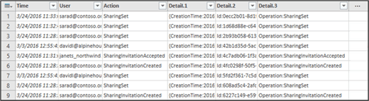

# Auditar el uso compartido para buscar recursos compartidos con usuarios externosUse sharing auditing in the Office 365 audit log

El uso compartido es una actividad clave en SharePoint Online y OneDrive para la empresa, y se usa ampliamente en organizaciones de Office 365. Ahora, los administradores pueden usar la auditoría de uso compartido en el registro de auditoría de Office 365 para determinar cómo se usa el uso compartido en su organización.Sharing is a key activity in SharePoint Online and OneDrive for Business, and it's widely used in Office 365 organizations. Administrators can now use sharing auditing in the Office 365 audit log to determine how sharing is being used in their organization. 
  
## El esquema de uso compartido de SharePointThe SharePoint Sharing schema

Los eventos de uso compartido (excluir la Directiva de uso compartido y los eventos de vínculo de uso compartido) son distintos de los eventos relacionados con archivos y carpetas de una forma principal: un usuario está realizando una acción que tiene algún efecto en otro usuario. Por ejemplo, el usuario A concede el acceso de usuario B a un archivo. En este ejemplo, el usuario A es el usuario que *actúa* y el usuario B es el *usuario de destino*. En el esquema de archivos de SharePoint, la acción del usuario que actúa solo afecta al propio archivo. Cuando el usuario A abre un archivo, la única información necesaria en el evento **FileAccessed** es el usuario que actúa. Para solucionar esta diferencia, hay un esquema independiente, denominado esquema de *uso compartido de SharePoint*, que recopila más información sobre los eventos de uso compartido. Esto garantiza que los administradores tengan más información sobre quién compartió un recurso y el usuario con el que se compartió el recurso.Sharing events (excluding sharing policy and sharing link events) are different from file- and folder-related events in one primary way: one user is taking an action that has some effect on another user. For example, User A gives User B access to a file. In this example, User A is the  *acting user*  and User B is the  *target user*. In the SharePoint File schema, the acting user's action only affects the file itself. When User A opens a file, the only information needed in the **FileAccessed** event is the acting user. To address this difference, there is a separate schema, called the  *SharePoint Sharing schema*, that captures more information about sharing events. This ensures that administrators have more insight into who shared a resource and the user the resource was shared with. 
  
El esquema de uso compartido proporciona dos campos adicionales en el registro de auditoría relacionados con el uso compartido de eventos:The Sharing schema provides two additional fields in the audit log related to sharing events: 
  
- **TargetUserOrGroupName** : almacena el UPN o el nombre del usuario o grupo de destino con el que se compartió un recurso (usuario B en el ejemplo anterior).**TargetUserOrGroupName** - Stores the UPN or name of the target user or group that a resource was shared with (User B in the previous example). 
    
- **TargetUserOrGroupType** : identifica si el usuario o el grupo de destino es un miembro, un invitado, un grupo o un socio.**TargetUserOrGroupType** - Identifies whether the target user or group is a Member, Guest, Group, or Partner. 
    
Estos dos campos, además de otras propiedades del esquema del registro de auditoría de Office 365, como User, Operation y Date, pueden decir el artículo completo sobre el *que* el usuario compartió *qué* recurso con *quién* y *Cuándo*.These two fields, in addition to other properties from the Office 365 audit log schema such as User, Operation, and Date can tell the full story about  *which*  user shared  *what*  resource with  *whom*  and  *when*. 
  
Hay otra propiedad de esquema que es importante para la historia de uso compartido. La propiedad **EventData** almacena información adicional acerca de los eventos de uso compartido. Por ejemplo, cuando un usuario comparte un sitio con otro usuario, esto se consigue agregando el usuario de destino a un grupo de SharePoint. La propiedad **EventData** captura esta información adicional para proporcionar contexto a los administradores.There's another schema property that's important to the sharing story. The **EventData** property stores additional information about sharing events. For example, when a user shares a site with another user, this is accomplished by adding the target user to a SharePoint group. The **EventData** property captures this additional information to provide context for administrators. 

## Modelo de uso compartido de SharePoint y eventos de uso compartidoThe SharePoint Sharing model and sharing events

El uso compartido se define realmente mediante tres eventos independientes: **SharingSet**, **SharingInvitationCreated**y **SharingInvitaitonAccepted**. Este es el flujo de trabajo de cómo se registran los eventos de uso compartido en el registro de auditoría de Office 365.Sharing is actually defined by three separate events: **SharingSet**, **SharingInvitationCreated**, and **SharingInvitaitonAccepted**. Here's the work flow for how sharing events are logged in the Office 365 audit log. 
  

  
Cuando un usuario (el que actúa como usuario) desea compartir un recurso con otro usuario (el usuario de destino), SharePoint (o OneDrive para la empresa) comprueba en primer lugar si la dirección de correo electrónico del usuario de destino ya está asociada a una cuenta de usuario en el directorio de la organización. Si el usuario de destino está en el directorio de la organización, SharePoint hace lo siguiente:When a user (the acting user) wants to share a resource with another user (the target user), SharePoint (or OneDrive for Business) first checks if the email address of the target user is already associated with a user account in the organization's directory. If the target user is in the organization's directory, SharePoint does the following:
  
-  Asigna inmediatamente los permisos de usuario de destino para obtener acceso al recurso.Immediately assigns the target user permissions to access the resource. 
    
- Envía una notificación de uso compartido a la dirección de correo electrónico del usuario de destino.Sends a sharing notification to the email address of the target user.
    
- Registra un evento **SharingSet** .Logs a **SharingSet** event. 
    
 Si una cuenta de usuario para el usuario de destino no está en el directorio de la organización, SharePoint hace lo siguiente:If a user account for the target user isn't in the organization's directory, SharePoint does the following: 
  
- Crea una invitación para uso compartido y la envía a la dirección de correo electrónico del usuario de destino.Creates a sharing invitation and sends it to the email address of the target user.
    
- Registra un evento **SharingInvitationCreated** .Logs a **SharingInvitationCreated** event. 
    
    > [!NOTE]
    > El evento **SharingInvitationCreated** siempre está asociado con el uso compartido externo o invitado cuando el usuario de destino no tiene acceso al recurso que se ha compartido.The **SharingInvitationCreated** event is most always associated with external or guest sharing when the target user doesn't have access to the resource that was shared. 
  
Cuando el usuario de destino acepta la invitación para compartir que se le envía (haciendo clic en el vínculo de la invitación), SharePoint registra un evento **SharingInvitationAccepted** y le asigna los permisos de usuario de destino para obtener acceso al recurso. También se registra información adicional sobre el usuario de destino, como la identidad del usuario a la que se envió la invitación y el usuario que realmente aceptó la invitación. En algunos casos, estos usuarios (o direcciones de correo electrónico) pueden ser diferentes.When the target user accepts the sharing invitation that's sent to them (by clicking the link in the invitation), SharePoint logs a **SharingInvitationAccepted** event and assigns the target user permissions to access the resource. Additional information about the target user is also logged, such as the identity of the user that the invitation was sent to and the user who actually accepted the invitation. In some case, these users (or email addresses) might be different. 
  

  
## Identificación de recursos compartidos con usuarios externosHow to identify resources shared with external users

Un requisito común para los administradores es crear una lista de todos los recursos que se han compartido con usuarios fuera de la organización. Mediante el uso de la auditoría de uso compartido en Office 365, los administradores ahora pueden generar esta lista. Esta es la manera de hacerlo.A common requirement for administrators is creating a list of all resources that have been shared with users outside of the organization. By using sharing auditing in Office 365, administrators can now generate this list. Here's how.
  
### Paso 1: buscar eventos de uso compartido y exportar los resultados a un archivo CSVStep 1: Search for sharing events and export the results to a CSV file

El primer paso es buscar eventos de uso compartido en el registro de auditoría de Office 365. Para obtener más información (incluidos los permisos necesarios) sobre cómo buscar en el registro de auditoría, vea [Buscar el registro de auditoría &amp; en el centro de seguridad y cumplimiento de Office 365](search-the-audit-log-in-security-and-compliance.md).The first step is to search the Office 365 audit log for sharing events. For more details (including the required permissions) about searching the audit log, see [Search the audit log in the Office 365 Security &amp; Compliance Center](search-the-audit-log-in-security-and-compliance.md).
  
1. Vaya a [https://protection.office.com](https://protection.office.com).Go to [https://protection.office.com](https://protection.office.com).
    
2. Inicie sesión en Office 365 con su cuenta profesional o educativa.Sign in to Office 365 using your work or school account.
    
3. En el panel izquierdo del centro de &amp; seguridad y cumplimiento, haga clic en \*\* &amp; investigación\*\*y búsqueda y, a continuación, en **búsqueda de registros de auditoría**.In the left pane of the Security &amp; Compliance Center, click **Search &amp; investigation**, and then click **Audit log search**.
    
    Se muestra la página de **búsqueda de registros de auditoría** .The **Audit log search** page is displayed. 
    
4. En **actividades**, haga clic en **compartir actividades** para buscar solo eventos de uso compartido.Under **Activities**, click **Sharing activities** to search only for sharing events. 
    
    
  
5.  Seleccione un intervalo de fecha y hora para buscar los eventos de uso compartido que se produjeron dentro de ese período.Select a date and time range to find the sharing events that occurred within that period. 
    
6. Haga clic en **Buscar** para ejecutar la búsqueda.Click **Search** to run the search. 
    
7. Cuando la búsqueda termine de ejecutarse y se muestren los resultados, haga clic en **exportar resultados** \> **descargar todos los resultados**.When the search is finished running and the results are displayed , click **Export results** \> **Download all results**.
    
    Una vez seleccionada la opción exportar, se muestra un mensaje en la parte inferior de la ventana que le pregunta si desea abrir o guardar el archivo CSV.After you select the export option, a message is displayed at the bottom of the window that prompts you to open or save the CSV file.
    
8. Haga clic en **Guardar** \> y guardar **como** y guarde el archivo CSV en una carpeta del equipo local.Click **Save** \> **Save as** and save the CSV file to a folder on your local computer. 
    

  
### Paso 2: filtrar el archivo CSV para los recursos compartidos con usuarios externosStep 2: Filter the CSV file for resources shared with external users

El paso siguiente es filtrar el archivo CSV para los eventos **SharingSet** y **SharingInvitationCreated** , así como mostrar los eventos en los que la propiedad **TargetUserOrGroupType** es **Guest**. Para ello, debe usar la característica Power Query de Excel. El siguiente procedimiento se realiza en Excel 2016.The next step is to filter the CSV for the **SharingSet** and **SharingInvitationCreated** events, and to display those events where the **TargetUserOrGroupType** property is **Guest**. You'll use the Power Query feature in Excel to do this. The following procedure is performed in Excel 2016. 
  
1. En Excel 2016, abra un libro en blanco.In Excel 2016, open a blank workbook.
    
2. Haga clic en la pestaña **Datos**.Click the **Data** tab. 
    
3. Haga clic en **nueva consulta** \> **desde archivo** \> **CSV**.Click **New Query** \> **From file** \> **From CSV**.
    
    
  
4. Abra el archivo CSV que ha descargado en el paso 1.Open the CSV file that you downloaded in Step 1.
    
    El archivo CSV se abre en el editor de consultas. Tenga en cuenta que hay cuatro columnas: **tiempo**, **usuario**, **acción**y **detalle**. La columna de **detalle** es un campo de múltiples propiedades. El paso siguiente es crear una nueva columna para cada una de las propiedades de la columna de **detalle** .The CSV file is opened in the Query Editor. Note that there are four columns: **Time**, **User**, **Action**, and **Detail**. The **Detail** column is a multi-property field. The next step is to create a new column for each of the properties in the **Detail** column. 
    
5. Seleccione la columna **detalles** y, a continuación, en la pestaña **Inicio** , haga clic en **dividir columna** \> **por**delimitador.Select the **Detail** column, and then on the **Home** tab, click **Split Column** \> **By Delimiter**.
    
    
  
6. En la ventana **dividir columna por** delimitador, haga lo siguiente:In the **Split Column by Delimiter** window, do the following: 
    
      - En **seleccionar o escribir**delimitador, seleccione **coma**.Under **Select or enter delimiter**, select **Comma**.
    
      - En **dividir**, seleccione **en cada aparición del**delimitador.Under **Split**, select **At each occurrence of the delimiter**.
    
7. Haga clic en **Aceptar**.Click **OK**.
    
    La columna de **detalle** se divide en varias columnas. Cada columna nueva tiene el nombre **detalle. 1**, **detalle. 2**, **detalle. 3**y así sucesivamente. Observará que los valores de cada celda de las columnas **detail. n** van precedidos por el nombre de la propiedad; por ejemplo, **operación: SharingSet**, **Operation: SharingInvitationAccepted**y **Operation: SharingInvitationCreated**.The **Detail** column is split into multiple columns. Each new column is named **Detail.1**, **Detail.2**, **Detail.3**, and so on. You'll notice the values in each cell in the **Detail.n** columns are prefixed with the name of the property; for example, **Operation:SharingSet**, **Operation:SharingInvitationAccepted**, and **Operation:SharingInvitationCreated**.
    
    
  
8. En la pestaña **archivo** , haga clic en **cerrar &amp; carga** para cerrar el editor de consultas y abrir el archivo en un libro de Excel.On the **File** tab, click **Close &amp; Load** to close the Query Editor and open the file in an Excel workbook. 
    
    El paso siguiente es filtrar el archivo para que solo se muestren los eventos **SharingSet** y **SharingInvitationCreated** .The next step is to filter the file to only display the **SharingSet** and **SharingInvitationCreated** events. 
    
9. Vaya a la pestaña **Inicio** y, a continuación, seleccione la columna **acción** .Go to the **Home** tab, and then select the **Action** column. 
    
10. En la lista desplegable \*\*filtro &amp; \*\* de ordenación, desactive todas las selecciones, seleccione **SharingSet** y **SharingInvitationCreated**y haga clic en **Aceptar**.In the **Sort &amp; Filter** drop-down list, clear all selections, then select **SharingSet** and **SharingInvitationCreated**, and click **OK**.
    
    Excel muestra las filas de los eventos **SharingSet** y **SharingInvitationCreated** .Excel displays the rows for the **SharingSet** and **SharingInvitationCreated** events. 
    
11. Vaya a la columna llamada **detail. 17** (o a cualquier columna que contenga la propiedad **TargetUserOrGroupType** ) y selecciónela.Go to the column named **Detail.17** (or whichever column contains the **TargetUserOrGroupType** property) and select it. 
    
12. En la lista desplegable \*\*filtro &amp; \*\* de ordenación, desactive todas las selecciones, seleccione **TargetUserOrGroupType: invitado**y haga clic en **Aceptar**.In the **Sort &amp; Filter** drop-down list, clear all selections, then select **TargetUserOrGroupType:Guest**, and click **OK**.
    
    Ahora Excel muestra las filas de los eventos **SharingInvitationCreated** y **SharingSet** , y donde el usuario de destino está fuera de la organización, porque los usuarios externos se identifican mediante el valor **TargetUserOrGroupType: Guest**.Now Excel displays the rows for **SharingInvitationCreated** and **SharingSet** events AND where the target user is outside of your organization, because external users are identified by the value **TargetUserOrGroupType:Guest**. 
    
En la siguiente tabla se muestran todos los usuarios de la organización que compartía recursos con un usuario invitado dentro de un intervalo de fechas especificado.The following table shows all users in the organization who shared resources with a guest user within a specified date range.
  

  
Aunque no se incluye en la tabla anterior, la columna **detail. 10** (o la columna que contiene la propiedad **objectId** ) identifica el recurso que se ha compartido con el usuario de destino; por ejemplo `ObjectId:https:\/\/contoso-my.sharepoint.com\/personal\/sarad_contoso_com\/Documents\/Southwater Proposal.docx`.Although it's not included in the previous table, the **Detail.10** column (or whichever column contains the **ObjectId** property) identifies the resource that was shared with the target user; for example  `ObjectId:https:\/\/contoso-my.sharepoint.com\/personal\/sarad_contoso_com\/Documents\/Southwater Proposal.docx`.
  
> [!TIP]
> Si desea identificar cuándo un usuario invitado ha recibido realmente permisos para obtener acceso a un recurso (en lugar de solo los recursos que compartiron con ellos), repita los pasos 10, 11 y 12, y filtre en la **SharingInvitationAccepted** y \*\*SharingSet \*\*eventos en el paso 10.If you want to identify when a guest user was actually assigned permissions to access a resource (as opposed to just the resources that where shared with them), repeat Steps 10, 11, and 12, and filter on the **SharingInvitationAccepted** and **SharingSet** events in Step 10. 
