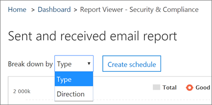

# Ver los informes de seguridad de correo electrónico de la seguridad &amp; centro de cumplimientoView email security reports in the Security &amp; Compliance Center

Informes de una gran variedad de seguridad de correo electrónico están disponibles en la seguridad &amp; centro de cumplimiento que le ayudarán a ver cómo las características contra correo no deseado y antimalware en Office 365 protegen a la organización. Si tiene los [permisos necesarios](#what-permissions-are-needed-to-view-these-reports), puede ver estos informes en la seguridad &amp; centro de cumplimiento yendo a los **informes** \> **panel**.A variety of email security reports are available in the Security &amp; Compliance Center to help you see how anti-spam and anti-malware features in Office 365 are protecting your organization. If you have the [necessary permissions](#what-permissions-are-needed-to-view-these-reports), you can view these reports in the Security &amp; Compliance Center by going to **Reports** \> **Dashboard**.
  

  
Los informes de seguridad de correo electrónico son los siguientes:Your email security reports include the following:
  
- [Informe de estado de protección de amenaza](view-email-security-reports.md#tps) (nuevo)![Threat protection status report](view-email-security-reports.md#tps) (new!) 
    
- [Informe de detecciones de malwareMalware Detections report](view-email-security-reports.md#maldet)
    
- [Informe de Malware superiorTop Malware report](#top-malware-report)
    
- [Informe de remitentes y destinatarios principalesTop Senders and Recipients report](view-email-security-reports.md#topsenders)
    
- [Informe de correo de suplantaciónSpoof Mail report](#spoof-mail-report)
    
- [Informe de detecciones de correo electrónico no deseadoSpam Detections report](#spam-detections-report)
    
- [Informe de correo electrónico enviados y recibidosSent and received email report](view-email-security-reports.md#sentreceivedemail)
    
- [Informe de mensajes indicado por el usuario](view-email-security-reports.md#userreported) (nuevo)![User-reported messages report](view-email-security-reports.md#userreported) (new!) 
    
## Informe de estado de protección de amenaza (¡nuevo!)Threat protection status report (new!)

El nuevo informe de **estado de protección de amenaza** es un informe inteligente que se muestra el correo electrónico malintencionado que se ha detectado y bloqueado por Exchange Online Protection. Este informe muestra información acerca del correo electrónico identificado como malware o un intento de suplantación de identidad.The new **Threat protection status** report is a smart report that shows malicious email that was detected and blocked by Exchange Online Protection. This report shows information about email identified as malware or a phishing attempt. 
  
Para ver este informe, en la seguridad &amp; centro de cumplimiento, vaya a **informes** \> **panel** \> **estado de protección de amenaza**.To view this report, in the Security &amp; Compliance Center, go to **Reports** \> **Dashboard** \> **Threat protection status**.
  

  
La primera vez que se abre el informe de estado de protección de amenaza, el informe muestra datos de los últimos siete días de forma predeterminada; Sin embargo, puede haga clic en **filtros** y cambiar el intervalo de fechas de hasta 90 días de detalle. Este informe es útil para la visualización de la eficacia y el impacto de las características de protección en línea de Exchange de su organización y de tendencias a largo plazo.When you first open the Threat protection status report, the report shows data for the past seven days by default; however, you can click **Filters** and change the date range for up to 90 days of detail. This report is useful for viewing the effectiveness and impact of your organization's Exchange Online Protection features, and for longer-term trending. 
  

  
También puede elegir si de forma para ver los datos de correo electrónico que se identificó como malintencionado, correo electrónico o correo electrónico identificado como los intentos de suplantación de una identidad identifica como que contiene el malware.You can also choose whether to view data for email identified as malicious, email identified as a phishing attempts, or email identified as containing malware.
  

  
## Informe de detecciones de malwareMalware Detections report

El informe de **Detecciones de Malware** muestra el número de mensajes entrante y saliente se detectaron como que contiene el malware para su organización.The **Malware Detections** report shows how many incoming and outgoing messages were detected as containing malware for your organization. 
  
Para ver este informe, en la seguridad &amp; centro de cumplimiento, vaya a **informes** \> **panel** \> **Detecciones de Malware**.To view this report, in the Security &amp; Compliance Center, go to **Reports** \> **Dashboard** \> **Malware Detections**.
  

  
Similar a otros informes, como el informe de estado de protección de amenaza, el informe muestra datos de los últimos siete días de forma predeterminada. Sin embargo, puede elegir **filtros** para cambiar el intervalo de fechas.Similar to other reports, like the Threat protection status report, the report displays data for the past seven days by default. However, you can choose **Filters** to change the date range. 
  
## Informe de Malware superiorTop Malware report

El informe de **Malware de la parte superior** muestra los distintos tipos de malware que se detectó por Exchange Online.The **Top Malware** report shows the various kinds of malware that was detected by Exchange Online. 
  
Para ver este informe, en la seguridad &amp; centro de cumplimiento, vaya a **informes** \> **panel** \> **Malware de la parte superior**.To view this report, in the Security &amp; Compliance Center, go to **Reports** \> **Dashboard** \> **Top Malware**.
  

  
Cuando mantenga el mouse sobre una cuña en el gráfico circular, puede ver el nombre de un tipo de malware y el número de mensajes se detectaron como tener que el malware.When you hover over a wedge in the pie chart, you can see the name of a kind of malware and how many messages were detected as having that malware.
  
Haga clic en (o puntee) el informe para abrirlo en una nueva ventana del explorador, donde puede obtener una vista más detallada del informe.Click (or tap) the report to open it in a new browser window, where you can get a more detailed view of the report.
  

  
Debajo del gráfico, verá una lista de malware detectado y cuántos mensajes se detectaron como tener que el malware.Below the chart, you'll see a list of detected malware and how many messages were detected as having that malware.
  
## Informe de remitentes y destinatarios principalesTop Senders and Recipients report

El informe **principales remitentes y destinatarios** es un gráfico circular que muestra la lista de remitentes de correo electrónico superior.The **Top Senders and Recipients** report is a pie chart showing your top email senders. 
  
Para ver este informe, en la seguridad &amp; centro de cumplimiento, vaya a **informes** \> **panel** \> **principales remitentes y destinatarios**.To view this report, in the Security &amp; Compliance Center, go to **Reports** \> **Dashboard** \> **Top Senders and Recipients**.
  

  
Cuando mantenga el mouse sobre una cuña en el gráfico circular, puede ver un recuento de los mensajes enviados o recibidos.When you hover over a wedge in the pie chart, you can see a count of messages sent or received.
  
Haga clic en (o puntee) el informe para abrirlo en una nueva ventana del explorador, donde puede obtener una vista más detallada del informe.Click (or tap) the report to open it in a new browser window, where you can get a more detailed view of the report.
  
Utilice la lista **Mostrar datos para** elegir si desea ver los datos para remitentes principales, receptores, de correo no deseado y los destinatarios de malware. También puede ver que recibió el malware que se detectó por avanzada de protección contra amenazas.Use the **Show data for** list to choose whether to view data for top senders, receivers, spam recipients, and malware recipients. You can also see who received malware that was detected by Advanced Threat Protection. 
  

  
Debajo del gráfico, comprobará que los remitentes de correo electrónico superior o fueron de los destinatarios, junto con un recuento de los mensajes enviados o recibidos para el período de tiempo determinado.Below the chart, you'll see who the top email senders or recipients were, along with a count of messages sent or received for the given time period.
  
## Informe de correo de suplantaciónSpoof Mail report

El informe de **Correo de suplantación de la** muestra se detectaron ¿cuántos mensajes de correo de suplantación de la y, de ellas, cuáles se consideran "bueno" (correo de suplantación hecho por razones de negocio legítimo).The **Spoof Mail** report shows how many spoof mail messages were detected, and of those, which ones were considered "good" (spoof mail done for legitimate business reasons). 
  
Para ver este informe, en la seguridad &amp; centro de cumplimiento, vaya a **informes** \> **panel** \> **Suplantación de correo**.To view this report, in the Security &amp; Compliance Center, go to **Reports** \> **Dashboard** \> **Spoof Mail**.
  

  
Cuando mantenga el mouse sobre un día en el gráfico, puede ver cuántos mensajes de correo de suplantación de la suministrada a través de.When you hover over a day in the chart, you can see how many spoof mail messages came through.
  
Haga clic en (o puntee) el informe para abrirlo en una nueva ventana del explorador, donde puede obtener una vista más detallada del informe.Click (or tap) the report to open it in a new browser window, where you can get a more detailed view of the report.
  
## Informe de detecciones de correo electrónico no deseadoSpam Detections report

El informe de **Detecciones de Spam** muestra todo el contenido de spam bloqueado por Exchange Online.The **Spam Detections** report shows all the spam content blocked by Exchange Online. 
  
Para ver este informe, en la seguridad &amp; centro de cumplimiento, vaya a **informes** \> **panel** \> **Detecciones de Spam**.To view this report, in the Security &amp; Compliance Center, go to **Reports** \> **Dashboard** \> **Spam Detections**.
  

  
Cuando mantenga el mouse sobre un día en el gráfico, puede ver cuántos elementos se han bloqueado ese día, así como el modo en esos elementos se clasifican. Por ejemplo, puede ver cuántos mensajes de spam se han filtrado y cuántos elementos proceden de una dirección de protocolo de Internet (IP) bloqueados.When you hover over a day in the chart, you can see how many items were blocked that day, as well as how those items are categorized. For example, you can see how many spam messages were filtered, and how many items came from a blocked Internet Protocol (IP) address.
  
Haga clic en (o puntee) el informe para abrirlo en una nueva ventana del explorador, donde puede obtener una vista más detallada del informe.Click (or tap) the report to open it in a new browser window, where you can get a more detailed view of the report.
  

  
Debajo del gráfico, verá una lista de elementos de spam que se detectaron. Seleccione un elemento para ver información adicional, por ejemplo, si el elemento de spam fue entrante o saliente, su identificador de mensaje y su destinatario.Below the chart, you'll see a list of spam items that were detected. Select an item to view additional information, such as whether the spam item was inbound or outbound, its message ID, and its recipient.
  
## Informe de correo electrónico enviados y recibidosSent and received email report

El informe **enviado y recibido de correo electrónico** es un informe inteligente que muestra información sobre el correo electrónico entrante y saliente, incluidas las detecciones de spam, malware y correo electrónico identificado como "bueno".The **Sent and received email** report is a smart report that shows information about incoming and outgoing email, including spam detections, malware, and email identified as "good." 
  
Para ver este informe, en la seguridad &amp; centro de cumplimiento, vaya a **informes** \> **panel** \> **enviado y recibido de correo electrónico**.To view this report, in the Security &amp; Compliance Center, go to **Reports** \> **Dashboard** \> **Sent and received email**.
  

  
Cuando mantenga el mouse sobre un día en el gráfico, puede ver cuántos mensajes procede y cómo se clasifican los mensajes. Por ejemplo, puede ver cuántos mensajes se detectaron como que contiene el malware y cuántos se han identificado como correo no deseado.When you hover over a day in the chart, you can see how many messages came in, and how those messages are categorized. For example, you can see how many messages were detected as containing malware, and how many were identified as spam.
  
Haga clic en (o puntee) el informe para abrirlo en una nueva ventana del explorador, donde puede obtener una vista más detallada del informe.Click (or tap) the report to open it in a new browser window, where you can get a more detailed view of the report.
  
Puede usar la lista de **dividir por** para ver la información por tipo o por dirección (entrante y saliente).You can use the **Break down by** list to view information by type or by direction (incoming and outgoing). 
  

  
Debajo del gráfico, verá una lista de categorías de correo electrónico, como **GoodMail**, **SpamContentFiltered**y así sucesivamente. Seleccione una categoría para ver información adicional, como las acciones que se tomaron de malware y de correo electrónico si fue entrante o saliente.Below the chart, you'll see a list of email categories, such as **GoodMail**, **SpamContentFiltered**, and so on. Select a category to view additional information, such as actions that were taken for malware, and whether email was incoming or outgoing.
  

  
## Informe de mensajes indicado por el usuario (¡nuevo!)User-reported messages report (new!)

El informe de **mensajes indicado por el usuario** muestra información sobre los mensajes de correo electrónico que los usuarios han informado como correo no deseado, los intentos de suplantación de identidad o correo correcto mediante el [complemento en el mensaje de informe](enable-the-report-message-add-in.md).The **User-reported messages** report shows information about email messages that users have reported as junk, phishing attempts, or good mail by using the [Report Message add-in](enable-the-report-message-add-in.md).
  
Detalles están disponibles para cada mensaje, incluidos el motivo de la entrega, como una excepción de la directiva de spam o regla de flujo de correo de su organización. Para ver los detalles, seleccione un elemento en la lista de informes de usuario y, a continuación, ver la información en las fichas **Resumen** y **Detalles** .Details are available for each message, including the delivery reason, such a spam policy exception or mail flow rule configured for your organization. To view details, select an item in the user-reports list, and then view the information on the **Summary** and **Details** tabs. 
  

  
Para ver este informe, en la seguridad &amp; centro de cumplimiento, realice uno de los siguientes:To view this report, in the Security &amp; Compliance Center, do one of the following:
  
- Vaya a **administración de amenaza** \> **panel** \> **mensajes indicado por el usuario**.Go to **Threat management** \> **Dashboard** \> **User-reported messages**.
    
- Vaya a **administración de amenaza** \> **revisión** \> **mensajes indicado por el usuario**.Go to **Threat management** \> **Review** \> **User-reported messages**.
    

  
> [!IMPORTANT]
> En orden para que el informe de mensajes notificados por los usuarios para que funcione correctamente, **debe estar activado el registro de auditoría** para su entorno de Office 365. Normalmente, esto se realiza por una persona que tenga el rol de los registros de auditoría asignado en Exchange Online. Para obtener más información, vea [activar Office 365 de búsqueda de registros de auditoría activado o desactivado](turn-audit-log-search-on-or-off.md).In order for the User-reported messages report to work correctly, **audit logging must be turned on** for your Office 365 environment. This is typically done by someone who has the Audit Logs role assigned in Exchange Online. For more information, see [Turn Office 365 audit log search on or off](turn-audit-log-search-on-or-off.md). 
  
## ¿Qué permisos son necesarios para ver estos informes?What permissions are needed to view these reports?

Para poder ver y utilizar los informes de seguridad de correo electrónico que se describen en este artículo, debe tener una función adecuada asignada en la seguridad &amp; centro de cumplimiento y en el centro de administración de Exchange.In order to view and use the email security reports described in this article, you must have an appropriate role assigned in the Security &amp; Compliance Center and in the Exchange Admin Center.
  
|**Grupo de funciones****Role group**|**Punto de asignación****Where assigned**|**Obtener más información****Learn more**|
|:-----|:-----|:-----|
| Uno de los siguientes:One of the following:     Administración de la organizaciónOrganization Management     Administrador de seguridadSecurity Administrator     Lector de seguridadSecurity Reader    |Seguridad &amp; centro de cumplimientoSecurity &amp; Compliance Center    |[Los permisos de la seguridad de Office 365 &amp; centro de cumplimientoPermissions in the Office 365 Security &amp; Compliance Center](permissions-in-the-security-and-compliance-center.md)   |
| Uno de los siguientes:One of the following:     Administración de la organizaciónOrganization Management     Administración de organización de solo lecturaView-only Organization Management     Rol Destinatarios con permiso de vistaView-Only Recipients role     Administración de cumplimientoCompliance Management    |Centro de administración de ExchangeExchange Admin Center    |[Permisos de características de Exchange OnlineFeature permissions in Exchange Online](https://technet.microsoft.com/library/jj200673%28v=exchg.150%29.aspx)   |
   
## ¿Qué ocurre si los informes no muestran los datos?What if the reports aren't showing data?

Si no está viendo datos en los informes, vuelva a comprobar que sus directivas están configuradas correctamente. Para obtener más información, consulte [protección contra correo no deseado y antimalware en Office 365](anti-spam-and-anti-malware-protection.md).If you are not seeing data in your reports, double-check that your policies are set up correctly. To learn more, see [Anti-spam and anti-malware protection in Office 365](anti-spam-and-anti-malware-protection.md).
  
## Temas relacionadosRelated topics

[Protección contra correo no deseado de Office 365Office 365 Email Anti-Spam Protection](anti-spam-protection.md)
  
[Informes y conocimientos en la seguridad de Office 365 &amp; centro de cumplimientoReports and insights in the Office 365 Security &amp; Compliance Center](reports-and-insights-in-security-and-compliance.md)
  
[Crear una programación para un informe en la seguridad &amp; centro de cumplimientoCreate a schedule for a report in the Security &amp; Compliance Center](create-a-schedule-for-a-report.md)
  
[Configurar y descargar un informe personalizado en la seguridad &amp; centro de cumplimientoSet up and download a custom report in the Security &amp; Compliance Center](set-up-and-download-a-custom-report.md)
  

