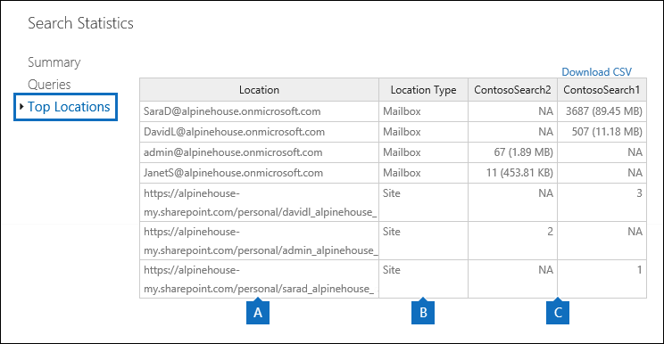

# Ver las estadísticas de palabras clave para resultados de búsqueda de contenido

Después de crear y ejecutar una búsqueda de contenido, puede ver estadísticas sobre los resultados de búsqueda estimados. Esto incluye un resumen de los resultados de la búsqueda (similar al Resumen de los resultados de búsqueda estimados que se muestran en el panel de detalles), las estadísticas de la consulta, como el número de ubicaciones de contenido con elementos que coinciden con la consulta de búsqueda, y el nombre de las ubicaciones de contenido que tienen más elementos coincidentes. Puede mostrar estadísticas de una o más búsquedas de contenido. Esto le permite comparar rápidamente los resultados de varias búsquedas y tomar decisiones sobre la eficacia de las consultas de búsqueda.
  
Además, puede configurar búsquedas nuevas y existentes para devolver las estadísticas de cada palabra clave en una consulta de búsqueda. Esto le permite comparar el número de resultados de cada palabra clave de una consulta y comparar las estadísticas de palabras clave de varias búsquedas.
  
También puede descargar las estadísticas de búsqueda y las estadísticas de palabras clave en un archivo CSV. Esto le permite usar las características de filtrado y ordenación de Excel para comparar los resultados y preparar los informes para los resultados de la búsqueda.
  
## Obtener estadísticas para las búsquedas de contenido

Para mostrar las estadísticas de las búsquedas de contenido:
  
1. en el centro de seguridad &amp; y cumplimiento de Office 365, vaya a búsqueda de \> **contenido**de **investigación de búsqueda &amp; ** .
    
2. En la lista de búsquedas, seleccione una o más búsquedas y, a continuación ****botón estadísticas de búsqueda de estadísticas de búsqueda.
    
    
  
3. En la página **estadísticas de búsqueda** , haga clic en uno de los siguientes vínculos para mostrar estadísticas sobre las búsquedas seleccionadas. 
    
    **Resumen**
    
    Esta página muestra estadísticas similares a las que se muestran en el panel de detalles en la página **búsqueda de contenido** . Se muestran las estadísticas de todas las búsquedas seleccionadas. Tenga en cuenta que también puede volver a ejecutar las búsquedas seleccionadas desde esta página para actualizar las estadísticas. 
    
    
  
    a. el nombre de la búsqueda de contenido. Como se mencionó anteriormente, puede mostrar y comparar las estadísticas de varias búsquedas.
    
    b. el tipo de ubicación de contenido en la que se ha buscado. Cada fila muestra las estadísticas de los buzones de correo, los sitios y las carpetas públicas de la búsqueda especificada.
    
    c. el número de ubicaciones de contenido que contienen elementos que coinciden con la consulta de búsqueda. Para los buzones, esta estadística también incluye el número de buzones de archivo que contienen elementos que coinciden con la consulta de búsqueda.
    
    d. el número total de elementos de todas las ubicaciones de contenido especificadas que coinciden con la consulta de búsqueda. Algunos ejemplos de tipos de elementos son los mensajes de correo electrónico, los elementos de calendario y los documentos. Si un elemento contiene varias instancias de una palabra clave que se está buscando, solo se cuenta una vez en el número total de elementos. Por ejemplo, si está buscando palabras "acciones" o "fraude" y un mensaje de correo electrónico contiene tres instancias de la palabra "cotización", solo se considera una vez en la columna **elementos** . 
    
    e. el tamaño total de todos los elementos que se encontraron en la ubicación de contenido especificada y que coinciden con la consulta de búsqueda. 
    
    **Peticiones**
    
    En esta página se muestran estadísticas sobre la consulta de búsqueda.
    
    
  
    a. el nombre de la búsqueda de contenido para la que la fila contiene estadísticas de consulta.
    
    b. el tipo de ubicación de contenido al que se aplican las estadísticas de la consulta.
    
    c. esta columna indica con qué parte de la consulta de búsqueda se pueden aplicar las estadísticas. **Principal** indica la consulta de búsqueda completa. Si usa una lista de palabras clave al crear o editar una consulta de búsqueda, las estadísticas de cada componente de la consulta se incluyen en esta tabla. Vea la sección [obtener estadísticas de palabras clave para búsquedas de contenido](#get-keyword-statistics-for-content-searches) de este artículo para obtener más información. 
    
    d. esta columna contiene la consulta de búsqueda real que ejecuta la herramienta de búsqueda de contenido. Tenga en cuenta que la herramienta agrega automáticamente algunos componentes adicionales a la consulta que cree. 

    - Cuando busca todo el contenido de los buzones (sin especificar ninguna palabra clave), la consulta de palabra clave real es `size>=0` para que se devuelvan todos los elementos. 
    
     - Al buscar sitios de SharePoint Online y OneDrive para la empresa, se agregan los dos componentes siguientes:
    
          **No IsExternalContent: 1** -excluye el contenido de una organización de SharePoint local. 
    
          **No IsOneNotePage: 1** : excluye todos los archivos de OneNote porque serían duplicados de cualquier documento que coincida con la consulta de búsqueda. 

    
    e. el número de ubicaciones de contenido (especificadas por la columna * * Location Type * *) que contienen elementos que coinciden con la consulta de búsqueda que aparece en la columna **consulta** . 
    
    f. el número de elementos (de la ubicación de contenido especificada) que coinciden con la consulta de búsqueda enumerada en la columna **consulta** . Como se explicó anteriormente, si un elemento contiene varias instancias de una palabra clave que se está buscando, solo se considera una vez en la columna this. 
    
    g. tamaño total de todos los elementos encontrados (en la ubicación de contenido especificada) que coinciden con la consulta de búsqueda en la columna de **consulta** . 
    
    **Principales ubicaciones**
    
    Esta página muestra estadísticas sobre el número de elementos que coinciden con la consulta de búsqueda en cada ubicación de contenido en la que se ha buscado. Se muestran las principales 1.000 ubicaciones. Si ve las estadísticas de varias búsquedas, se muestran las principales 1.000 ubicaciones de cada búsqueda. Tenga en cuenta que una ubicación de contenido no se incluye en esta página si no contiene elementos que coinciden con la consulta de búsqueda.
    
    
  
    a. el nombre de la ubicación del contenido.
    
    b. el tipo de ubicación de contenido al que se aplican las estadísticas de ubicación.
    
    c. hay columnas para cada búsqueda para la que está mostrando las estadísticas. Esta columna muestra el número (y el tamaño total) de los elementos que coinciden con la consulta de búsqueda en cada ubicación de contenido. Tenga en cuenta que cuando muestra las estadísticas de varias búsquedas, el "NA" de esta columna indica que la ubicación del contenido no se incluyó en esa búsqueda. 

## Obtener estadísticas de palabras clave para búsquedas de contenido

Como se explicó anteriormente, la página **consultas** muestra la consulta de búsqueda y el número (y tamaño) de los elementos que coinciden con la consulta. Si usa una lista de palabras clave al crear o editar una consulta de búsqueda, puede obtener estadísticas mejoradas que muestren cuántos elementos coinciden con cada palabra clave o frase de palabras clave. Esto puede ayudarle a identificar rápidamente qué partes de la consulta son las más eficaces (y menos) efectivas. Por ejemplo, si una palabra clave devuelve un gran número de elementos, puede optar por refinar la consulta de palabra clave para restringir los resultados de la búsqueda. Puede configurar una lista de palabras clave cuando crea o edita una búsqueda de contenido. 

  
Para crear una lista de palabras clave y ver las estadísticas de palabras clave para una búsqueda de contenido:
  
1. en el centro de seguridad &amp; y cumplimiento de Office 365, vaya a búsqueda de \> **contenido**de **investigación de búsqueda &amp; ** .
    
2. En la lista de búsquedas de contenido, haga clic en y en una búsqueda y, a](media/ebd260e4-3556-4fb0-b0bb-cc489773042c.gif)continuación, haga clic en **Editar** 
  
    a. Active la casilla de verificación **Mostrar lista de palabras clave** . 
    
    b. Escriba una palabra clave o una fase de palabra clave en una fila de la tabla Keywords. Por ejemplo, escriba **presupuesto** en la primera fila y, a continuación, escriba **seguridad** en la segunda fila. 
    
4. Después de agregar las palabras clave para las que desea buscar y obtener estadísticas, haga clic en **Buscar** para ejecutar la búsqueda revisada. 
    
5. Una vez finalizada la búsqueda, selecciónela en la lista de búsquedas y, a continuación **** botón estadísticas de búsqueda de estadísticas de búsqueda. También puede mostrar y comparar las estadísticas de palabras clave para varias búsquedas.
    
6. En la página **estadísticas de búsqueda** , haga clic en **consulta** para mostrar las estadísticas de palabras clave de las búsquedas seleccionadas. 
    
    
  
    Como se muestra en la captura de pantalla anterior, se muestran las estadísticas de cada palabra clave; Esto incluye: 
    
    - La palabra clave Statistics para cada tipo de ubicación de contenido que se incluye en la búsqueda.
    
    - La consulta de búsqueda real para cada palabra clave, que incluye todas las condiciones de la consulta de búsqueda. 
    
    - La consulta de búsqueda completa (identificada como **principal** en la columna de **parte** ) y las estadísticas de la consulta completa. Nota: estas son las mismas estadísticas que se muestran en la página de **Resumen** . 

> [!NOTE]
> Para ayudar a reducir los problemas causados por listas de palabras clave grandes, ahora está limitado a un máximo de 20 filas en la lista de palabras clave de una consulta de búsqueda.
