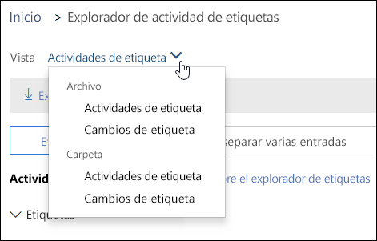
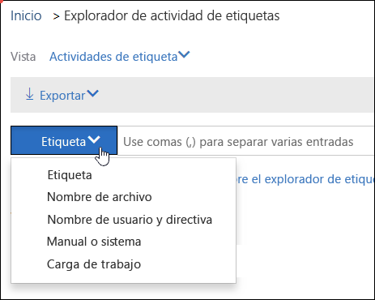

# Ver la actividad de etiquetas de documentos

Después de crear las etiquetas, puede verificar que se aplicaron en el contenido según lo previsto. Con el Explorador de actividad de etiquetas en el Centro de seguridad y cumplimiento de Office 365, puede buscar y visualizar rápidamente actividades de etiquetas de todo el contenido en SharePoint OneDrive para la Empresa en los últimos 30 días. Estos son datos en tiempo real que le ofrecen una vista clara de lo que ocurre en el espacio empresarial.
  
Por ejemplo, con el Explorador de actividad de etiquetas, puede:
  
- Ver el número de veces que cada etiqueta se aplicó cada día (hasta 30 días).
    
- Ver quién etiquetó exactamente cada archivo y en qué fecha, además de un vínculo al sitio donde se encuentra el archivo.
    
- Ver los archivos donde se cambiaron o quitaron etiquetas, cuáles son las etiquetas nuevas y anteriores, y quién realizó el cambio.
    
- Filtre los datos para ver toda la actividad de etiquetas de una etiqueta, archivo o usuario específicos. También puede filtrar la actividad de etiquetas por ubicación (SharePoint o OneDrive para la Empresa), así como filtrar dependiendo de si la etiqueta se aplicó automáticamente o de forma manual.
    
- Vea la actividad de etiquetas de carpetas, así como de documentos individuales. Próximamente, podrá mostrarse el número de archivos de la carpeta que se etiquetaron como resultado de etiquetar la carpeta.
    
Encontrará el Explorador de actividad de etiquetas en el Centro de seguridad y cumplimiento \> **Gobierno de datos** \> **Explorador de actividad de etiquetas**.
  
Tenga en cuenta que, para usar el Explorador de actividad de etiquetas, se necesita una suscripción de Office 365 Enterprise E5.
  

  
## Ver actividades de etiquetas de archivos o carpetas

En la parte superior del Explorador de actividad de etiquetas, puede ver las actividades de archivos o carpetas. Tenga en cuenta que en la actividad de carpeta solo se incluye la carpeta en sí, no se incluyen los archivos dentro de la carpeta.
  
Puede que quiera ver la actividad de etiquetas de las carpetas porque, si etiqueta una carpeta, todos los archivos dentro de esa carpeta también se etiquetarán (excepto los archivos donde se aplicó una etiqueta de forma explícita). Por lo tanto, etiquetar carpetas podría afectar a un número elevado de archivos. Para obtener más información, vea [Aplicar una etiqueta predeterminada a todo el contenido de una biblioteca, carpeta o conjunto de documentos de SharePoint](labels.md#applying-a-default-label-to-all-content-in-a-sharepoint-library-folder-or-document-set).
  

  
### Actividades de etiquetas

 En **Actividades de etiquetas**, se incluyen todas las acciones de etiquetado: **agregar**, **quitar** o **cambiar** una etiqueta. Puede usar esta vista para obtener información completa sobre el número de archivos en los que se aplicó cada etiqueta por día. 
  
### Cambios de etiquetas

 En **Cambios de etiquetas**, se incluyen las acciones que pueden ser arriesgadas, como **quitar** o **cambiar** una etiqueta. Puede usar esta vista para ver rápidamente esas acciones arriesgadas y el usuario que las realizó. En la lista de actividades debajo del gráfico, puede seleccionar un archivo y, después, en el panel de detalles de la parte derecha, hacer clic en un vínculo a ese archivo. 
  

  
## Filtrar actividad de etiquetas

Puede filtrar rápidamente los datos para ver toda la actividad de etiquetas de una etiqueta, archivo o usuario específicos. También puede filtrar la actividad de etiquetas por ubicación (SharePoint o OneDrive para la Empresa), así como filtrar dependiendo de si la etiqueta se aplicó automáticamente o de forma manual.
  

  

