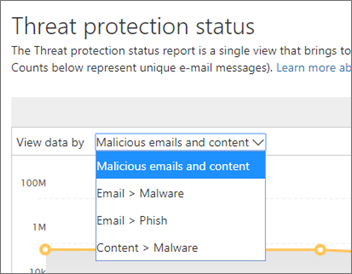
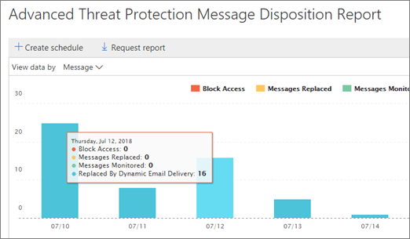

# Ver informes para la protección contra amenazas avanzada de Office 365

Si la organización dispone de la [protección contra amenazas avanzada](office-365-atp.md) (ATP) de Office 365 y dispone de los [permisos necesarios](#what-permissions-are-needed-to-view-these-reports), puede usar varios informes de &amp; ATP en el centro de seguridad y cumplimiento. (Vaya a **** \> **Panel**de informes).
  

  
Los informes de ATP incluyen el [Informe de estado de protección contra amenazas](#threat-protection-status-report), el [Informe de tipos de archivo de ATP](#atp-file-types-report)y el informe de disposición de [mensajes ATP](#atp-message-disposition-report). En este artículo se describen los informes de ATP y se incluyen vínculos a [informes adicionales para verlos](#additional-reports-to-view).
  
## Informe de estado de protección contra amenazas

El informe de **Estado de protección contra amenazas** es una vista única que reúne información sobre contenido malintencionado y correo electrónico malintencionado detectado y bloqueado por [Exchange Online Protection](eop/exchange-online-protection-overview.md) (EOP) y [Office 365 ATP](office-365-atp.md). El informe proporciona un recuento agregado de mensajes de correo electrónico únicos con contenido malintencionado (archivos o direcciones de sitios web (URL)) bloqueados por el motor antimalware, la depuración [automática de cero horas (ZAP)](zero-hour-auto-purge.md)y las características de ATP, como los [vínculos seguros](atp-safe-links.md)ATP, [ATP seguro Datos](atp-safe-attachments.md)adjuntos y [funcionalidades contra la suplantación de identidad ATP](atp-anti-phishing.md).

> [!NOTE]
> Un informe de estado de protección contra amenazas está disponible para los clientes que tengan [Office 365 ATP](office-365-atp.md) o [Exchange Online Protection](eop/exchange-online-protection-eop.md) (EOP); sin embargo, la información que se muestra en el informe de estado de la protección contra amenazas para los clientes de ATP probablemente contendrá distintos datos de los que pueden ver los clientes de EOP. Por ejemplo, el informe de estado de protección contra amenazas para los clientes de ATP contendrá información sobre [los archivos malintencionados detectados en SharePoint Online, OneDrive o Microsoft Teams](atp-for-spo-odb-and-teams.md). Esta información es específica de ATP, por lo que los clientes que tengan EOP pero no ATP no verán los detalles en el informe de estado de protección contra amenazas.
  
Para ver el informe de estado de protección contra amenazas, en el [centro de seguridad &amp; y cumplimiento](https://protection.office.com), vaya al **Panel** \> **informes** \> **Estado de protección contra amenazas**.
  

  
Para obtener el estado detallado de un día, desplace el puntero sobre el gráfico.
  

  
De forma predeterminada, el informe de estado de protección contra amenazas muestra datos de los últimos siete días. Sin embargo, puede elegir **filtros** y cambiar el intervalo de fechas para ver los datos de hasta 90 días. 
  

  
También puede usar el menú **ver datos por** para cambiar la información que se muestra en el informe. 
  

  
## Informe de tipos de archivo de ATP

El informe de **tipos de archivo de ATP** muestra el tipo de archivos que los [datos adjuntos seguros de ATP](atp-safe-attachments.md)han detectado como malintencionados.
  
Para ver este informe, en el [Centro &amp; de seguridad y cumplimiento](https://protection.office.com), vaya a los **tipos de archivo ATP**del **Panel** \> **informes** \> .
  

  
Al pasar el mouse sobre un día concreto, puede ver el desglose de los tipos de archivos malintencionados que ha detectado [ATP Safe Attachments](atp-safe-attachments.md) and [anti- &amp; spam Anti-Malware Protection in Office 365](anti-spam-and-anti-malware-protection.md).
  

  
## Informe de disposición de mensajes ATP

El informe de **disposición de mensajes de ATP** muestra las acciones que se tomaron para los mensajes de correo electrónico que se detectaron con contenido malintencionado. 
  
Para ver este informe, en el [Centro &amp; de seguridad y cumplimiento](https://protection.office.com), vaya a la **disposición de mensajes ATP**del **Panel** \> **informes** \> .
  

  
Cuando desplaza el puntero sobre una barra del gráfico, puede ver qué acciones se tomaron para el correo electrónico detectado durante ese día.
  

  
## Informes adicionales para ver

Además de los informes de ATP descritos en este artículo, hay disponibles varios otros informes, como se describe en la tabla siguiente:

|Tipo de informe  |Obtener más información  |
|---------|---------|
|**Informes de seguridad de correo electrónico**, como un informe de remitentes y destinatarios principales, un informe de correo falsificado y un informe de detecciones de correo no deseado. | [Ver informes de seguridad de correo electrónico &amp; en el centro de seguridad y cumplimiento](view-email-security-reports.md)        |
|**Explorador** (también conocido como el explorador de amenazas, esto se incluye en la [inteligencia sobre amenazas de Office 365](office-365-ti.md))     | [Usar el explorador en el &amp; centro de seguridad y cumplimiento](use-explorer-in-security-and-compliance.md)        |
|**Resultados de EOP y ATP** (Este es un informe personalizado que se genera mediante PowerShell). Este informe contiene información como, por ejemplo, el dominio, la fecha, el tipo de evento, la dirección, la acción y el reCuento de mensajes.  | [Referencia del cmdlet Get-MailTrafficATPReport](https://docs.microsoft.com/powershell/module/exchange/advanced-threat-protection/get-mailtrafficatpreport?view=exchange-ps) |
|**Detecciones de EOP y ATP** (Este es un informe personalizado que se genera mediante PowerShell). Este informe contiene detalles sobre archivos malintencionados o direcciones URL, intentos de suplantación de identidad, suplantación y otras amenazas potenciales en los correos electrónicos o archivos.   | [Referencia del cmdlet Get-MailDetailATPReport](https://docs.microsoft.com/powershell/module/exchange/advanced-threat-protection/get-maildetailatpreport?view=exchange-ps)        |

  
## ¿Qué permisos se necesitan para ver los informes de ATP?

Para poder ver y usar los informes descritos en este artículo, **debe tener asignada una función adecuada para el centro de &amp; seguridad y cumplimiento y el centro de administración de Exchange**.

- Para el centro &amp; de seguridad y cumplimiento, debe tener asignada una de las siguientes funciones:
    - Administración de la organización
    - Administrador de seguridad (puede asignarse en el centro de administración de Azure Active[https://aad.portal.azure.com](https://aad.portal.azure.com)Directory ())
    - Lector de seguridad

- Para Exchange Online, debe tener una de las siguientes funciones asignadas en el centro de administración de Exchange[https://outlook.office365.com/ecp](https://outlook.office365.com/ecp)() o con cmdlets de PowerShell (vea [Exchange Online PowerShell](https://docs.microsoft.com/powershell/exchange/exchange-online/exchange-online-powershell?view=exchange-ps)):
    - Administración de la organización
    - Administración de organización de solo lectura
    - Rol Destinatarios con permiso de vista
    - Administración de cumplimiento

Para obtener más información, vea los siguientes recursos:

- [Permisos en el centro de seguridad &amp; y cumplimiento de Office 365](permissions-in-the-security-and-compliance-center.md)

- [Permisos de características de Exchange Online](https://docs.microsoft.com/exchange/permissions-exo/feature-permissions)
   
## ¿Qué ocurre si los informes no muestran datos?

Si no ve datos en los informes de ATP, compruebe que las directivas estén correctamente configuradas. La organización debe tener directivas de [vínculos seguros ATP](set-up-atp-safe-links-policies.md) y [directivas de datos adjuntos seguros ATP](set-up-atp-safe-attachments-policies.md) definidas para que la protección de ATP esté en su lugar. Consulte también [protección contra correo no deseado y antimalware en Office 365](anti-spam-and-anti-malware-protection.md).
  
## Temas relacionados

[Informes y opiniones en el centro de seguridad &amp; y cumplimiento de Office 365](reports-and-insights-in-security-and-compliance.md)
  
[Crear una programación para un informe en el centro &amp; de seguridad y cumplimiento](create-a-schedule-for-a-report.md)
  
[Configurar y descargar un informe personalizado en el centro de &amp; seguridad y cumplimiento](set-up-and-download-a-custom-report.md)
  

