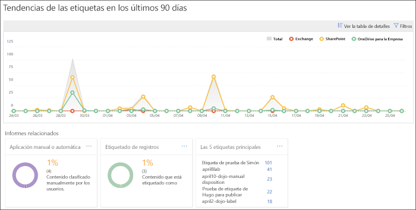
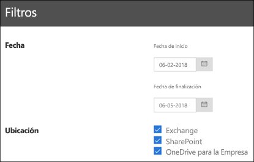

# Ver los informes de gobierno de datosView the data governance reports

Después de crear las etiquetas, asegúrese de que se apliquen correctamente en el contenido. Con los informes de gobierno de datos del Centro de seguridad y cumplimiento de Office 365, puede ver rápidamente:After you create your labels, you'll want to verify that they're being applied to content as you intended. With the data governance reports in the Office 365 Security &amp; Compliance Center, you can quickly view:
  
- **Cinco etiquetas principales** Este informe muestra el recuento de las cinco etiquetas principales que se aplicaron en el contenido. Haga clic en este informe para ver una lista de todas las etiquetas que se aplicaron recientemente en el contenido. Puede ver el recuento de cada etiqueta, así como la ubicación, cómo se aplicó, sus acciones de retención, si es un registro y su tipo de disposición.**Top 5 labels** This report shows the count of the top 5 labels that have been applied to content. Click this report to view a list of all labels that have been recently applied to content. You can see each label's count, location, how it was applied, its retention actions, whether it's a record, and its disposition type. 
    
- **Aplicación automática o manual** Este informe muestra el recuento de todo el contenido que se etiquetó de forma manual o automática, así como el porcentaje de contenido que se etiquetó de forma manual en comparación con el que se etiquetó de forma automática.**Manual vs Auto apply** This report shows the count of all content that's been labeled manually or automatically, and the percentage of content that's been labeled manually vs automatically. 
    
- **Etiquetado de registros** Este informe muestra el recuento de todo el contenido que se etiquetó como un registro o no, y el porcentaje de contenido que se etiquetó como un registro en comparación con el que no.**Records tagging** This report shows the count of all content that's been tagged as a record or non-record, and the percentage of content that's been tagged as a record vs. non-record. 
    
- **Tendencia de etiquetas en los últimos 90 días** Este informe muestra el recuento y la ubicación de todas las etiquetas que se aplicaron en los últimos 90 días.**Labels trend over the past 90 days** This report shows the count and location of all labels that have been applied in the last 90 days. 
    
En todos estos informes, se muestra el contenido etiquetado de Exchange, SharePoint y OneDrive para la Empresa.All these reports show labeled content from Exchange, SharePoint, and OneDrive for Business.
  
Encontrará estos informes en el Centro de seguridad y cumplimiento \> **Gobierno de datos** \> **Panel**.You can find these reports in the Security &amp; Compliance Center \> **Data Governance** \> **Dashboard**.
  

  
Puede filtrar los informes de gobierno de datos por fecha (hasta 90 días) y ubicación (Exchange, SharePoint y OneDrive para la Empresa). Los datos más recientes pueden tardar hasta 24 horas en aparecer en los informes.You can filter the data governance reports by date (up to 90 days) and location (Exchange, SharePoint, and OneDrive for Business). The most recent data can take up to 24 hours to appear in the reports.
  

  

