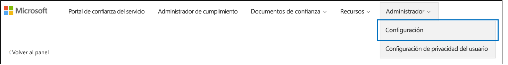

# <a name="work-with-microsoft-compliance-manager-preview"></a>Trabajar con el administrador de cumplimiento de Microsoft (versión preliminar)

> [!IMPORTANT]
> El administrador de cumplimiento de Microsoft es un panel y una herramienta de administración que proporciona un resumen de la protección de datos y las recomendaciones de Stature y recomendaciones para mejorar el cumplimiento y la protección de datos. Las acciones del cliente que se proporcionan en el administrador de cumplimiento son recomendaciones; para evaluar la efectividad de estas recomendaciones en su entorno de reglamentación respectivo antes de la implementación, depende de su organización. Las recomendaciones que se encuentran en el administrador de cumplimiento no deben interpretarse como una garantía de cumplimiento.

## <a name="access-compliance-manager"></a>Acceso al administrador de cumplimiento

Para obtener acceso al Administrador de cumplimiento, vaya al Portal de confianza de servicios. Cualquier usuario con una cuenta Microsoft o una cuenta de organización de Azure Active Directory puede obtener acceso al Administrador de cumplimiento.
  
1. Vaya a [https://servicetrust.microsoft.com](https://servicetrust.microsoft.com/).

2. Inicie sesión con su cuenta de servicio de Microsoft. Esta es la cuenta de usuario de Office 365, Microsoft 365 o Azure Active Directory (Azure AD).

3. En el portal de confianza de servicios, seleccione **Administrador de cumplimiento**. Esta es la versión preliminar del administrador de cumplimiento. El **Administrador de cumplimiento (clásico)** es el vínculo a la versión anterior del administrador de cumplimiento.

4. Cuando se muestre el acuerdo de no divulgación, léalo y seleccione **Aceptar** para continuar. Debe aceptar una vez y, a continuación, se muestra el panel del administrador de cumplimiento.

Para comenzar, aparece una evaluación ISO/IEC 27001:2103 para Office 365 de forma predeterminada para su organización.

## <a name="administration"></a>Administración

Hay funciones administrativas específicas que solo están disponibles para el administrador de inquilinos y solo están visibles cuando inició sesión con una cuenta de administrador global. Sin embargo, hasta que el administrador asigne roles de administrador de cumplimiento a los usuarios, los datos del administrador de cumplimiento estarán visibles para todos los usuarios de la organización. Se recomienda implementar el control de acceso basado en roles para determinar quién puede tener acceso y realizar acciones en el administrador de cumplimiento.
  
### <a name="assigning-compliance-manager-roles-to-users"></a>Asignar roles del Administrador de cumplimiento a usuarios

Cada rol del administrador de cumplimiento tiene permisos ligeramente diferentes. Puede ver los permisos asignados a cada rol, ver qué usuarios tienen roles y agregar o quitar usuarios de esa función a través del portal de confianza de servicios. Seleccione el elemento de menú **Administrador** y elija la **configuración** que desea ver.
  

  
Para agregar o quitar usuarios de los roles del Administrador de cumplimiento.
  
1. Vaya a [https://servicetrust.microsoft.com](https://servicetrust.microsoft.com).

2. Inicie sesión con su cuenta de administrador global de Azure Active Directory.

3. En la barra de menús superior del portal de confianza del servicio, seleccione **Administrador** y, después, **configuración**.

4. En la lista desplegable **Seleccionar rol** , seleccione el rol que desea administrar.

5. Los usuarios agregados a cada rol se enumeran en la página **Seleccionar rol** .

6. Para agregar usuarios a este rol, seleccione **Agregar**. En el cuadro de diálogo **Agregar usuarios** , seleccione el campo de usuario. Puede desplazarse por la lista de usuarios disponibles o empezar a escribir el nombre de usuario para filtrar la lista en función del término de búsqueda. Seleccione el usuario para agregar esa cuenta a la lista **Agregar usuarios** aprovisionada con dicha función. Si desea agregar varios usuarios a la vez, empiece a escribir un nombre de usuario para filtrar la lista y, a continuación, seleccione el usuario que desea agregar a la lista. Seleccione **Guardar** para aprovisionar el rol seleccionado a estos usuarios. 

    
  
7. Para quitar usuarios de este rol, seleccione los usuarios y seleccione **eliminar**.

    

## <a name="groups"></a>Grupos

Los grupos le permiten organizar de manera lógica evaluaciones y compartir información común y tareas de flujo de trabajo entre evaluaciones que tienen los mismos controles administrados por el cliente u otros relacionados. Puede agrupar evaluaciones por año, estándar, servicio, equipo, división o agencias dentro de su organización para minimizar las acciones administradas por el cliente:
  
- **FFIEC es evaluaciones 2019**
  - Office 365 + FFIEC es
  - Intune + FFIEC es
- **Evaluaciones de privacidad y seguridad de los datos**
  - Office 365 + ISO 27001:2013
  - Office 365 + ISO 27018:2014

Al crear una nueva evaluación, debe crear un nuevo grupo para la evaluación o asignar la evaluación a un grupo existente. No se pueden crear grupos como entidades independientes. Se recomienda que determine una estrategia de agrupación para su organización *antes* de agregar nuevas evaluaciones. De forma predeterminada, hay disponible un grupo denominado "grupo predeterminado" para las evaluaciones iniciales. Los grupos no tienen ninguna propiedad de seguridad. Todos los permisos están asociados con evaluaciones.

Cuando trabaje con grupos, recuerde lo siguiente:
  
- Los controles de evaluación relacionados en diferentes evaluaciones dentro del mismo grupo se actualizan automáticamente cuando se completan.
- Los nuevos grupos pueden copiar información de un grupo existente al crear una nueva evaluación. Toda la información agregada a los detalles de implementación y los campos de respuesta de administración y plan de pruebas de los controles administrados por el cliente desde las evaluaciones en el grupo desde el que está copiando se copian en los mismos controles administrados por el cliente (o relacionados) en el nuevo Revisión. Si está agregando una nueva evaluación a un grupo existente, la información común de las evaluaciones de ese grupo se copia en la nueva evaluación.
- Los nombres de grupo (también denominados identificadores de *Grupo*) deben ser únicos dentro de la organización.
- Los grupos pueden contener evaluaciones para la misma certificación o regla, pero cada grupo solo puede contener una evaluación para un par de certificación o servicio en la nube específico. Por ejemplo, un grupo no puede contener dos evaluaciones para Office 365 y NIST CSF. Un grupo puede contener varias evaluaciones para el mismo servicio en la nube solo si la certificación o la regla correspondiente para cada uno es diferente.
- Una vez que se ha agregado una evaluación a un grupo de evaluación, no se puede cambiar la agrupación. Puede cambiar el nombre del grupo de evaluación, que cambia el nombre del grupo de evaluación para todas las evaluaciones asociadas con ese grupo. Puede crear una evaluación y un nuevo grupo de evaluación y copiar información de una evaluación existente, lo que crea efectivamente un duplicado de la evaluación en un grupo de evaluación diferente.
- El archivado de una evaluación rompe la relación entre esa evaluación y el grupo. Las actualizaciones adicionales a otras evaluaciones relacionadas ya no se reflejan en la evaluación archivada.

## <a name="tenant-management"></a>Administración de inquilinos

El administrador de cumplimiento (versión preliminar) incluye una nueva interfaz para administrar los nuevos elementos de datos denominados **Administración**de inquilinos. Esta interfaz permite administrar la configuración de todos los inquilinos:

- **Dimensiones:** Permite ver, agregar y personalizar metadatos para plantillas, evaluaciones y elementos de acción que permiten crear tablas dinámicas personalizadas para los filtros.
- **Propietarios:** Especifique un propietario para cada elemento de acción.
- **Acciones del cliente:** Administrar la lista completa de elementos de acciones incluidos en el administrador de cumplimiento (versión preliminar) y habilitar o deshabilitar el control de puntuación segura para acciones integradas con puntuación segura.

Seleccione **Administración** de inquilinos para abrir la interfaz de administración y use los siguientes pasos para administrar las **dimensiones**, los **propietarios**y **las acciones del cliente**.

### <a name="dimensions"></a>Dimensions

Las dimensiones son conjuntos de metadatos que proporcionan información sobre una plantilla, una evaluación o un elemento de acción. Las dimensiones usan el concepto de claves y valores, donde la clave de dimensión representa una propiedad y el valor de dimensión representa valores válidos para la propiedad. Por ejemplo, en el administrador de cumplimiento hay tres tipos de acciones. Se definen mediante una clave de dimensión de **tipo de acción** y los valores de dimensión de la **documentación**, **operación**y **técnico**. Puede modificar las dimensiones existentes o agregar las suyas propias. La adición de dimensiones suele ser necesaria al importar plantillas personalizadas.

#### <a name="add-a-dimension"></a>Agregar una dimensión

1. Abra **Administración** de inquilinos y seleccione **dimensiones**.
2. Seleccione **+ Agregar dimensión**.
3. Escriba un nombre único en el campo **clave** .
4. Opcionalmente, habilite varios valores para que se usen simultáneamente para la misma clave, deslice el botón de alternancia de **Permitir selección múltiple para dimensiones** a activado.
5. Seleccione **+ Agregar** para agregar un valor proporcionando un nombre único y haciendo clic en el icono guardar.
6. Repita el paso 5 para cada valor que desee agregar.
7. Seleccione **Guardar** para guardar la nueva dimensión.

#### <a name="edit-a-dimension"></a>Edición de una dimensión

Puede cambiar el nombre de una clave de dimensión, pero puede modificar los valores de las dimensiones personalizadas.

1. Abra **Administración** de inquilinos y seleccione **dimensiones**.
2. Busque la dimensión que desea editar, seleccione los puntos suspensivos (...) junto a ella y, a continuación, seleccione **Editar**.
3. Seleccione **+ Agregar** para agregar un valor proporcionando un nombre único y haciendo clic en el icono guardar o seleccione el valor que desee editar o eliminar y seleccione **quitar** o **Editar**.
4. Seleccione **Guardar** cuando termine de realizar cambios.

#### <a name="delete-a-dimension"></a>Eliminar una dimensión

Puede eliminar las dimensiones personalizadas si es necesario.

1. Abra **Administración** de inquilinos y seleccione **dimensiones**.
2. Busque la dimensión que desea eliminar, seleccione los puntos suspensivos (...) junto a ella y, a continuación, seleccione **eliminar**.
3. Cuando aparezca el mensaje de confirmación, seleccione **eliminar**.

### <a name="owners"></a>Propietarios

Los propietarios se usan para identificar a la parte responsable de cada control. Todos los controles integrados son propiedad de Microsoft, clientes o ambos. Puede crear valores personalizados para los propietarios que se pueden usar para especificar más responsabilidades granulares en la organización. Por ejemplo, puede crear propietarios que representen grupos específicos, equipos o unidades de negocio dentro de su organización.

#### <a name="add-an-owner"></a>Agregar un propietario

1. Abra **Administración** de inquilinos y seleccione **propietarios**.
2. Seleccione **+ Agregar propietario**.
3. Especifique un nombre y una descripción para el propietario y seleccione **Guardar**. La descripción se muestra en la columna propietario.

#### <a name="edit-an-owner"></a>Edición de un propietario

No puede editar un nombre de propietario, pero puede modificar la descripción que se muestra en la columna propietario.

1. Abra **Administración** de inquilinos y seleccione **propietarios**.
2. Busque el propietario que desea editar, seleccione los puntos suspensivos (...) junto a él y, después, haga clic en **Editar**.
3. Modifique la descripción según sea necesario y seleccione **Guardar**.

#### <a name="delete-an-owner"></a>Eliminar un propietario

1. Abra **Administración** de inquilinos y seleccione **propietarios**.
2. Busque el propietario que desea eliminar, seleccione los puntos suspensivos (...) junto a él y seleccione **eliminar**.
3. Cuando aparezca el mensaje de confirmación, seleccione **eliminar**.

### <a name="customer-actions"></a>Acciones del cliente

El área acciones del cliente muestra todas las acciones del cliente para todas las plantillas y evaluaciones en el administrador de cumplimiento (versión preliminar).


De un vistazo, puede ver el título, el propietario, la categoría, el cumplimiento y la puntuación de una acción, y determinar si está integrada con puntuación segura. Puede expandir una acción y seleccionar **leer más** para leer la descripción de la acción y tener acceso a los vínculos de la descripción. También puede usar esta interfaz para habilitar y deshabilitar la integración de la puntuación segura en función de cada acción y para agregar acciones personalizadas. Las acciones que tienen capacidades de integración de puntuación segura tienen un botón de puntos suspensivos (...) junto a ellas (tenga en cuenta que las acciones personalizadas también tienen puntos suspensivos junto a ellas).

#### <a name="enable-or-disable-secure-score-integration"></a>Habilitar o deshabilitar la integración de la puntuación segura

1. Seleccione los puntos suspensivos (...) de la acción que desea modificar y seleccione **Editar**.
2. Alterne el conmutador de la actualización continua de puntuación segura en activado o desactivado para habilitar o deshabilitar la supervisión continua mediante la puntuación segura.
3. Haga clic en **Guardar**.

#### <a name="add-a-customer-action"></a>Adición de una acción de cliente

1. Seleccione **+ Agregar acción de cliente**.
2. Proporcione un título único para la acción en el campo **título** .
3. Proporcionar una puntuación de cumplimiento para la acción en el campo de **puntuación de cumplimiento máximo** (puede ser cualquier número entre 1-99).
4. Use la lista desplegable **tipo de acción** para especificar el tipo de acción que va a agregar. Si el tipo de acción no existe, puede agregarlo agregando el valor a la clave de dimensión tipo de acción.
5. Use la lista desplegable **dimensiones** para especificar o agregar claves de dimensión y valores para la acción.
6. Use la lista desplegable de **propietario** para especificar el propietario de la acción.
7. Seleccione **+** esta acción para agregar una descripción y un título de descripción para la acción.
8. Seleccione la **X** para cerrar la hoja Descripción.
9. Seleccione **Guardar** para guardar la acción del cliente.

#### <a name="edit-a-customer-action"></a>Edición de una acción de cliente

1. Seleccione los puntos suspensivos (...) de la acción que desea modificar y seleccione **Editar**.
2. Edite la acción como desee y seleccione **Guardar**.

#### <a name="delete-a-customer-action"></a>Eliminación de una acción de cliente

1. Seleccione los puntos suspensivos (...) de la acción que desea modificar y seleccione **eliminar**.
2. Cuando aparezca el mensaje de confirmación, seleccione **eliminar**.

## <a name="assessments"></a>Evaluaciones

### <a name="add-an-assessment"></a>Adición de una evaluación
  
1. En el panel de evaluaciones, seleccione **+ Agregar evaluación**.

2. Cuando se abra el Blade, escriba la siguiente información:

    - **Title (obligatorio):** Escriba un título para la evaluación
    - **Seleccione una plantilla (obligatorio):** Selección de una plantilla estándar o personalizada
    - **Seleccione un grupo o agregue un nuevo grupo (obligatorio):** Seleccione un grupo existente o elija Agregar un grupo nuevo y proporcione un nombre de grupo único.
    - **¿Desea copiar los datos de un grupo existente? (opcional):** conmute el control para habilitar la copia del grupo y, a continuación, haga lo siguiente:
        - **Seleccione un grupo (opcional):** Si la copia de grupo está habilitada, seleccione el grupo desde el que desea copiar
            - **Detalles de la implementación (opcional):** Seleccione esta selección para copiar los detalles de implementación en el nuevo grupo.
            - **Plan de pruebas & información adicional (opcional):** Seleccione esta selección para copiar el plan de pruebas y detalles de información adicional al nuevo grupo
            - **Documentos (opcional):** Seleccione esta selección para copiar los documentos en el nuevo grupo.

3. Seleccione **Guardar** para crear la evaluación.

 La nueva evaluación aparece en el panel de evaluación y muestra la siguiente información:

- El título de la evaluación.
- Las dimensiones de la evaluación, incluida la certificación, el entorno y el producto aplicados a la evaluación.
- La fecha en que se creó y la fecha en que se modificó por última vez.
- La puntuación de la evaluación que se muestra como un porcentaje.
- Indicadores de progreso que muestran el número de controles evaluados administrados por Microsoft y por el cliente.

### <a name="copying-information-from-existing-assessments"></a>Copiar información de evaluaciones existentes

Al crear una evaluación, tiene la opción de copiar la información de un grupo existente. Esto le permite aplicar la información especificada en la evaluación copiada a los mismos controles en la nueva evaluación. Por ejemplo, si tiene un grupo para todas las evaluaciones relacionadas con FFIEC en su organización, puede copiar la siguiente información de las evaluaciones existentes:

- Detalles de la implementación
- Plan de pruebas & información adicional
- Documents

#### <a name="copy-information-from-an-existing-assessment-to-a-new-assessment"></a>Copiar información de una evaluación existente a una nueva evaluación
  
1. En el panel de evaluación, seleccione **+ Agregar evaluación**.
    
2. En la ventana **Agregar una evaluación** , complete la siguiente información:

    - **Title (obligatorio):** Escriba un título para la evaluación.
    - **Seleccione una plantilla (obligatorio):** Seleccione una plantilla estándar o personalizada.
    - **Seleccione un grupo o agregue un nuevo grupo (obligatorio):** Elija **Agregar un nuevo grupo** y proporcione un nombre de grupo único.
    - **¿Desea copiar los datos de un grupo existente? (opcional):** cambie el control a activado para habilitar la copia del grupo y, a continuación:- **Seleccione un grupo (opcional):** si la copia de grupo está habilitada, seleccione el grupo desde el que se va a copiar.
            - **Detalles de la implementación (opcional):** Seleccione esta selección para copiar los detalles de implementación en el nuevo grupo.
            - **Plan de pruebas & información adicional (opcional):** Seleccione esta selección para copiar el plan de pruebas y detalles de información adicional al nuevo grupo.
            - **Documentos (opcional):** Seleccione esta selección para copiar los documentos en el nuevo grupo.

3. Seleccione **Guardar** para crear la evaluación.

### <a name="viewing-assessments"></a>Ver evaluaciones

#### <a name="view-an-assessment"></a>Ver una evaluación
  
1. En el panel de evaluaciones, seleccione el nombre de la evaluación para abrirlo y ver la información de controles y elementos de acción.

A continuación, se muestra un ejemplo de la evaluación de Office 365 e ISO 27001. La primera vista ilustra la nueva vista de elementos de acción en el administrador de cumplimiento (versión preliminar).


Las acciones se muestran en orden alfabético, y a cada acción se le asigna una puntuación y un propietario. Seleccione el vínculo **leer más** para leer los detalles de cada acción. 


Seleccione el vínculo **revisión** para administrar, asignar, implementar y probar la acción. A continuación se muestra un ejemplo de acción.


En versiones anteriores del administrador de cumplimiento, el flujo de trabajo para implementar los requisitos se realizó en el nivel de control. Un responsable de cumplimiento asignaría un control a alguien para implementar el control. Hubo dos inconvenientes:

- A menudo, los controles tenían varias acciones asociadas a ellos, y el usuario al que se asignó un control puede no ser la persona adecuada para completar todas las acciones necesarias para implementar el control
- La combinación de tareas independientes en una sola acción impidió la recopilación de las señales y la telemetría que se usa para registrar automáticamente los cambios en la configuración del espacio empresarial en el administrador de cumplimiento (versión preliminar).

En el administrador de cumplimiento (versión preliminar), el proceso de flujo de trabajo se ha movido del nivel de control al nivel de acción. Al revisar una acción, se pueden usar los siguientes campos para administrar el flujo de trabajo de la acción:

- **Asignar usuario:** Seleccione este campo para elegir o especificar el usuario a quien se debe asignar esta acción. Puede desplazarse por la lista o escribir un nombre para encontrarla y, a continuación, seleccionarla.
- **Administrar documentos:** Puede cargar pruebas de implementación en forma de documentos de Office, archivos de imagen y capturas de pantallas, resultados de PowerShell en CSV o TXT y PDF.
- **Estado de la implementación:** Se usa para indicar el estado de implementación actual de la acción. Los valores posibles no se implementan, implementan, implementaciones alternativas, están planeadas y no se encuentran en el ámbito.
- **Fecha de implementación:** Fecha en que se realizó la acción.
- **Resultado de la prueba:** Se usa para indicar los resultados de la validación de la implementación. Los valores posibles no son evaluados, Passed, failed-low risk, failed-Medium Risk, Failed (riesgo elevado) y no en Scope.
- **Fecha de la prueba:** La fecha en la que se produjo la validación.
- **Notas de implementación:** Escriba los detalles de implementación de la organización, junto con las notas que desee incluir.
- **Plan de pruebas:** Escriba los detalles del plan de pruebas para esta acción, junto con las notas que desee incluir.
- **Información adicional:** Especifique la información adicional sobre esta acción o cómo se implementó en la organización, junto con las notas que desee incluir.

El administrador de cumplimiento (versión preliminar) también incluye la tabla dinámica basada en el control que se encuentra en las versiones anteriores. Seleccione el panel de **información de controles** para verlo. Puede ver la información de los controles en el nivel de evaluación y de plantilla. A continuación se muestra un ejemplo del panel de información de controles para evaluaciones.


Para las evaluaciones, se muestra el panel de información de controles:

- Una lista desplegable de **Grupo** para seleccionar el grupo que se va a ver (cuando se usan varios grupos).
- Un cuadro desplegable de **evaluación** para seleccionar qué evaluación desea ver.
- Metadatos sobre la evaluación seleccionada, que incluye:
    - Un indicador de progreso para **los controles evaluados** que muestra el número de controles calculados sobre el número total de controles.
    - La **puntuación de cumplimiento** actual para la evaluación, que se muestra como un porcentaje.
    - Detalles sobre la **certificación** y el **producto** usados en la evaluación.
    - **Estado** actual de la evaluación y fecha de la última **modificación** .
- Una lista de los **servicios de ámbito** de la evaluación.
- Detalles de los controles, agrupados por familia de controles, con vínculos a acciones del cliente y detalles de implementación de Microsoft:
    - **Sus acciones** muestran las acciones del cliente que puede realizar para satisfacer algunos o todos los requisitos del control. Muchos controles tienen varias acciones asociadas a ellos, y todas las acciones asociadas a un control se muestran aquí. Las acciones tienen la misma interfaz de usuario que las que aparecen en el panel acciones.
    - **Acciones de Microsoft** muestra la lista de controles del marco interno de Microsoft que se aplican al control de certificación seleccionado. Para cada control interno, seleccione **implementado** para ver los detalles de implementación y pruebas de Microsoft, junto con el resultado de la prueba y la fecha de prueba, como se muestra a continuación.


### <a name="export-an-assessment"></a>Exportación de una evaluación

Puede exportar una evaluación a un archivo de Excel para las partes interesadas de cumplimiento de su organización o para los auditores externos y los reguladores. El informe es una instantánea de la evaluación a partir de la fecha y la hora en que se creó el informe. El informe contiene los detalles de todos los controles administrados por Microsoft y los clientes para la evaluación, el estado de la implementación de controles, la fecha de prueba de control, los resultados de pruebas y proporciona vínculos a los documentos de evidencia cargados. Debe exportar el informe de evaluación antes de archivar una evaluación porque las evaluaciones archivadas no conservan los vínculos a los documentos cargados.
  
### <a name="export-an-assessment-report"></a>Exportación de un informe de evaluación
  
1. En el panel del administrador de cumplimiento, seleccione ficha **información de controles** .
2. Seleccione el **Grupo** y la **evaluación** en los menús desplegables para la evaluación que desea exportar.
3. Seleccione el botón **exportar** .

El informe de evaluación se descarga como un archivo de Excel en la sesión del explorador. El nombre de los archivos del archivo de Excel de forma predeterminada es el título de la evaluación.

### <a name="archive-a-template-or-an-assessment"></a>Archivar una plantilla o una evaluación

Cuando haya terminado con una plantilla o una evaluación y ya no la necesite para fines de cumplimiento, puede archivarla. Cuando se archiva una plantilla o una evaluación, se quita de la vista predeterminada y se debe activar la casilla Mostrar archivado para mostrarla.


  
> [!IMPORTANT]
> Las evaluaciones archivadas no conservan sus vínculos a los documentos de evidencia cargados. Se recomienda encarecidamente que exporte la evaluación antes de archivar para conservar los vínculos a los documentos de evidencia del informe.
  
#### <a name="archive-a-template"></a>Archivar una plantilla

1. Abra el panel **plantillas** .
2. Localice la plantilla que desea archivar y seleccione el icono archivo.
3. Cuando vea el mensaje de confirmación, seleccione **archivar**.

#### <a name="archive-an-assessment"></a>Archivar una evaluación

1. Abra el panel de **evaluaciones** .
2. Seleccione el **Grupo** de la lista desplegable que contiene la evaluación que desea archivar.
3. Busque la evaluación que desea archivar y seleccione el icono archivo.
4. Cuando vea el mensaje de confirmación, seleccione **archivar**.

#### <a name="view-archived-assessments"></a>Ver evaluaciones archivadas
  
1. Abra la pestaña panel de **evaluaciones** y active la casilla **Mostrar archivado** .
2. Las evaluaciones archivadas aparecen en la sección **evaluaciones archivadas** .
3. Seleccione el nombre de la evaluación para abrir y ver la evaluación.

#### <a name="activate-an-archived-assessment"></a>Activación de una evaluación archivada

1. En la pestaña **evaluaciones** , seleccione la casilla **Mostrar archivado** .
2. Las evaluaciones archivadas aparecen en la sección **evaluaciones archivadas** .
3. Busque la evaluación que desea activar y seleccione el icono activar.
4. Cuando vea el mensaje de confirmación, seleccione **Activar**.

## <a name="controls-and-actions"></a>Controles y acciones

Los controles y las acciones son las tablas dinámicas de datos principales que se usan en el administrador de cumplimiento (versión preliminar). El control Pivot, que existía en las versiones anteriores del administrador de cumplimiento, se ha mejorado para mostrar los controles de Microsoft y del cliente en las mismas familias de control. Esta vista consolidada facilita la visualización de todo el modelo de responsabilidad compartida por cada control. La acción dinámica es nueva en el administrador de cumplimiento (versión preliminar) y está diseñada para proporcionar una vista simplificada de todas las acciones recomendadas por Microsoft.

### <a name="controls"></a>Controles

Los controles se pueden ver desde el panel de información de controles. Los controles representan los requisitos de un estándar, una certificación, una regla o un marco. Para asignar estos requisitos en varios estándares, normas, etc., y para asociarlos con acciones, todo se trata como si fuera un marco de control. Por ejemplo, como un marco de control, las normativas, como HIPAA, se han desglosado por sección y los controles de HIPAA en el administrador de cumplimiento usan el mismo esquema de numeración que estas secciones, como se muestra a continuación:


Hay tres tipos de controles. Dos son proporcionadas por Microsoft en las plantillas integradas y la tercera la crean y administran los clientes en plantillas personalizadas. Los tres tipos son:

1. **Controles administrados por Microsoft (mm):** son controles que solo Microsoft tiene responsabilidad. Aparecen en las plantillas de cuadro y se agregan al administrador de cumplimiento de Microsoft.
2. **Controles administrados por el cliente (cm):** se trata de controles que solo tienen responsabilidad los clientes. Aparecen en las plantillas de cuadro y se agregan al administrador de cumplimiento por parte de Microsoft o los clientes. El cliente también puede editar o deshabilitar los controles administrados por el cliente proporcionados por Microsoft.
3. **Controles compartidos (SM):** son controles en los que se comparte la responsabilidad entre Microsoft y el cliente. Estos aparecen en las plantillas en el cuadro y se agregan al administrador de cumplimiento de Microsoft.

### <a name="actions-items"></a>Elementos de acciones

Los elementos de acciones son las tareas recomendadas para implementar los requisitos de una norma o regla, o para probar, comprobar y documentar los requisitos de implementación de su organización. Las acciones están asociadas con uno o varios controles. Cada control tiene una o más acciones asociadas, y cada acción se puede asociar con uno o varios controles. Las acciones forman parte del flujo de trabajo principal del administrador de cumplimiento (versión preliminar), ya que son los objetos que se asignan, controlan y validan en la organización.

#### <a name="assign-action-items"></a>Asignar elementos de acción
  
1. En el panel de **elementos de acción** , seleccione el **Grupo** que contiene las evaluaciones cuya acción desea asignar.
2. En la lista desplegable **evaluación** , seleccione la evaluación cuya acción desea asignar o seleccione **todo** en la lista desplegable para ver todas las acciones disponibles.
3. Busque la acción que desee asignar y, en la columna **propietario** , seleccione el vínculo para **revisión**, **implementado** o **prueba**.
4. Seleccione el campo **asignar usuario** y aparecerá una lista de los usuarios de su organización. Desplácese por la lista y seleccione usuario o filtro de la lista para seleccionar un usuario; para ello, escriba en el nombre del usuario.
5. En el campo notas de implementación, escriba las notas que desee transmitir al usuario asignado.
6. Seleccione **Guardar** para asignar la acción.

#### <a name="reassign-action-items"></a>Reasignar elementos de acción

Esta función permite a una organización quitar las dependencias activas o pendientes de la cuenta de usuario mediante la reasignación de una acción a un nuevo usuario.

1. En el panel de **elementos de acción** , seleccione el **Grupo** que contiene las evaluaciones cuya acción desea reasignar.
2. En la lista desplegable **evaluación** , seleccione la evaluación cuya acción desea reasignar o seleccione **todo** en la lista desplegable para ver todas las acciones disponibles.
3. Busque la acción que desea reasignar y, en la columna **propietario** , seleccione el vínculo para **revisión**, **implementado**o **prueba**.
4. Elimine el usuario existente del campo **asignar usuario** y elija un usuario diferente de la lista de usuarios o filtre la lista para seleccionar un usuario; para ello, escriba en el nombre del usuario.
5. En el campo notas de implementación, escriba las notas que desee transmitir al usuario.
6. Seleccione **Guardar** para reasignar la acción.

## <a name="templates"></a>Plantillas

Una plantilla es el objeto base del administrador de cumplimiento (versión preliminar) que está asociado a un producto y una certificación (por ejemplo, estándar, regla, marco de control, etc.). Las plantillas se pueden ver y agregar desde el panel Plantillas.


 
El panel muestra cada plantilla, junto con la certificación y el producto asociado a la plantilla, las fechas en que se creó y modificó por última vez el libro, el número de controles administrados por el cliente y por Microsoft, la puntuación máxima de cumplimiento para el Plantilla y el estado de la plantilla (por ejemplo, aprobado, pendiente de aprobación, importado).

Las plantillas integradas tienen asociada una evaluación integrada, pero puede crear evaluaciones adicionales basadas en las plantillas integradas, y puede importar sus propias plantillas y crear evaluaciones personalizadas basadas en las que lo componen.

### <a name="create-a-template"></a>Crear una plantilla

Puede crear una plantilla copiando una plantilla existente o importando una plantilla personalizada. Hay un formato y un esquema específicos que deben usarse para los datos de plantilla o no se importarán en el administrador de cumplimiento. Desde aquí se puede descargar un archivo con el esquema y los datos de ejemplo correctos.
Cada plantilla personalizada debe estar en un libro de Excel independiente (en formato. xls o. xlsx) que contenga cinco pestañas:

1. Evaluación de plantillas
2. ControlFamily
3. Acciones
4. Ownership
5. Dimensions

El esquema usado en cada pestaña se detalla a continuación.

#### <a name="template-assessment-tab"></a>Pestaña de evaluación de plantillas

Esta pestaña tiene una sola columna:

- **inScopeServices**: lista delimitada por comas de los productos o servicios que están en el ámbito de la plantilla.

#### <a name="controlfamily-tab"></a>Pestaña ControlFamily

Esta pestaña incluye columnas que definen los controles que se asignan a las acciones enumeradas en la ficha acciones e incluye detalles como el nombre del control, la familia, el título y la descripción.  Las columnas de esta pestaña, que deben ordenarse dentro de Excel en el orden que se indica a continuación, son: 

- **nombrecontrol:** Nombre del control desde el certificado, el estándar y la regla, etc.
- **controlFamily:** Control de la familia desde el certificado, el estándar, la regla, etc.
- **controlTitle:** Título del control de certificación/estándar/regla, etc.
- **controlDescription:** Descripción del control de certificación, estándar/regla, etc.
- **controlVersion:** Información de versión de control opcional.  Ejemplo: para NIST 800-53, el valor actual es Rev 4, por lo que controlVersion es 4.  Para la MCC de CSA, es 3.0.1.
- **isDisabled:** Use TRUE o FALSE para indicar si el control se ha deshabilitado.
- **ControlType:** Use CM para indicar que se trata de controles administrados por el cliente.
- **controlComplianceScore:** Suma de la puntuación de todas las acciones asignadas al control.
- **controlActionTitle:** Doble lista delimitada por punto y coma de todos los actionTitles de este control como se muestra en la ficha acciones. 

#### <a name="actions-tab"></a>Ficha acciones

Esta pestaña incluye columnas que definen acciones individuales e incluye detalles como el título, la propiedad y las dimensiones de la acción. Las columnas de esta pestaña, que deben ordenarse dentro de Excel en el orden que se indica a continuación, son: 

- **actionTitle:** Título de la acción. Cada título debe ser único y se recomienda usar mayúsculas y minúsculas Pascal.
- **actionRelatedODVs:** Lista separada por dos puntos y comas de actionTitles que son principales del elemento secundario enumerados en la columna actionTitle. En una relación primario-secundario, el elemento primario representa el límite máximo. Por lo tanto, si completa una acción primaria, también completa todas las acciones secundarias. Por ejemplo, cuando tiene requisitos similares pero distintos valores definidos por el estándar, como la longitud de la contraseña, donde un estándar/regla requiere un mínimo de 15 caracteres y otro requiere un mínimo de 12 o 10. 15 sería el elemento principal en este ejemplo y, si configura un mínimo de 15 caracteres, también debe cumplir con las acciones que recomienden 12 o 10 caracteres en otras evaluaciones.

    > [!NOTE]
    > La columna actionRelatedODVs es una columna necesaria para el esquema; sin embargo, la característica (acciones relacionadas) no está disponible en el administrador de cumplimiento (versión preliminar).  Está programada para agregarse en una versión posterior.

- **actionDimensionValues:** Lista delimitada por dos puntos y comas de dos dimensiones aplicables en la ficha dimensiones, con el siguiente formato:

    ```
    Dimension Key::Dimension Value;;Dimension Key::Dimension Value.
    ```
    
    Por ejemplo:

    ```
    Product::Office 365;;Certification::NIST CSF
    ```

    Todas las dimensiones que se usan en una plantilla personalizada deben aparecer en la ficha dimensiones del archivo de importación, incluso si ya aparecen en el panel dimensiones. Si va a agregar nuevos valores o claves de dimensión, primero debe agregarlos al panel de dimensiones.
- **actionScore:** Valor numérico para cada acción, que representa la puntuación de esa acción. Se recomienda seguir el modelo de resultados usado por las evaluaciones integradas, que se basa en el propósito y el cumplimiento de cada acción.
- **actionOwnership:** Lista de propietarios doble delimitada por punto y coma. Todos los propietarios de la lista deben incluirse en la pestaña de propiedad.
- **actionDescription:** Texto de cada acción, que debe ser único. Este campo es compatible con el lenguaje Markdown, como se describe a continuación.

#### <a name="ownership-tab"></a>Pestaña de propiedad

Esta pestaña incluye columnas que definen propietarios para cada acción.  Las columnas de esta pestaña, que deben ordenarse dentro de Excel en el orden que se indica a continuación, son:

- **ownershipName:** Nombre único del propietario o parte responsable.
- **ownershipDescription:** Descripción del propietario o parte responsable.

#### <a name="dimensions-tab"></a>Pestaña dimensiones

Esta pestaña incluye columnas que definen las dimensiones que se pueden asociar a una acción.  Las columnas de esta pestaña, que deben ordenarse dentro de Excel en el orden que se indica a continuación, son:

- **dimensionKey:** Lista de claves usadas para las dimensiones. Por ejemplo, producto, certificación, etc.
- **dimensionValue:** Valor único para cada clave de dimensión. Por ejemplo, Office 365, Intune, Azure, producto personalizado, etc.
- **allowMultiSelect:** Use TRUE o FALSE para indicar que se pueden seleccionar varios valores de dimensión para una sola clave de dimensión.

#### <a name="using-markdown-language-in-description-fields"></a>Uso del lenguaje Markdown en campos de Descripción

Las plantillas y las evaluaciones admiten el uso de idioma de Markdown para algunos elementos de texto y formato.  Hay tres elementos de formato del lenguaje Markdown que se usan en el administrador de cumplimiento:

- Listas numeradas y de viñetas
- Hyperlinks
- Negrita

Las viñetas se representan como asteriscos en lugar de las viñetas de Word o Excel. Por ejemplo:

```
* Item A
* Item B
* Item C
```

Los números se representan como números, pero con espacios para la sangría (tres espacios por nivel) y solo los números que se usan para todos los subniveles (por ejemplo, sin letras).  Por ejemplo:
   1. Elemento A
   2. Elemento B
      1. Elemento secundario A
      2. Sub-elemento B
   3. Elemento C
   4. Elemento D
      1. Elemento secundario A
      2. Sub-elemento B
   5. Elemento E

Los hipervínculos se construyen colocando corchetes alrededor del texto del hipervínculo y el hipervínculo entre paréntesis inmediatamente junto al corchete de cierre.  Por ejemplo:

```
Click [here](https://www.microsoft.com) to go to Microsoft’s home page.
```
Este texto se representa de la siguiente manera: haga clic [aquí](https://www.microsoft.com) para ir a la Página principal de Microsoft.
Como se muestra en el ejemplo anterior, el administrador de cumplimiento no representa las direcciones URL con subrayado.

El texto en negrita sólo tiene dos asteriscos a cada lado del texto que se mostrará en negrita.  Por ejemplo:

```
**This text will render in bold**
```
**Este texto se representa en negrita.**

### <a name="create-a-template"></a>Crear una plantilla

Puede crear una plantilla copiando una plantilla existente o importando datos de plantilla de Excel. Al importar datos de Excel, la plantilla requiere dos administradores del administrador de cumplimiento diferentes para publicar los datos (uno para publicar y otro para aprobarlo).

#### <a name="create-a-template-by-copying-an-existing-template"></a>Crear una plantilla copiando una plantilla existente

1. Abra el panel **plantillas** y seleccione **+ Agregar plantilla**.
2. En el campo **escribir nombre de plantilla** , especifique un nombre único para la plantilla.
3. Active la casilla **copiar de una plantilla existente** y seleccione la plantilla que desea copiar en la lista desplegable.
4. De manera opcional, agregue cotas adicionales.
5. Seleccione **Agregar al panel**.

#### <a name="create-a-template-by-importing-data"></a>Creación de una plantilla mediante la importación de datos

1. Abra el panel **plantillas** y seleccione **+ Agregar plantilla**.
2. En el campo **escribir nombre de plantilla** , especifique un nombre único para la plantilla.
3. Agregue una o más dimensiones. Incluso si las dimensiones que usa ya aparecen en el panel dimensiones, aún deben aparecer en el archivo de importación.
4. Seleccione **examinar** para ir a la ubicación del archivo de importación, selecciónelo y seleccione **abrir**.
5. El archivo de importación se valida e indica el número de controles y familias de control que se han detectado. Si hay errores, se proporcionará un vínculo a una versión modificada del archivo de importación que incluye detalles del error. Todos los errores deben resolverse antes de que se importen los datos.
6. Una vez que los datos pasen la validación, seleccione **Agregar al panel**.
7. La plantilla importada aparece en el panel **plantillas** y tiene el estado **importada**. Seleccione los puntos suspensivos (...) y seleccione **publicar** para publicar la plantilla. Cuando aparezca el mensaje de confirmación, seleccione **publicar**. El estado de la plantilla cambia a **aprobación pendiente**.
8. Otro usuario con el rol de administrador del administrador de cumplimiento debe aprobar la plantilla en el panel Plantillas. Deben seleccionar los puntos suspensivos (...) y seleccionar **aprobar**. Cuando aparezca el mensaje de confirmación, seleccione **aprobar**. La plantilla ya está lista para su uso.

### <a name="customize-a-template"></a>Personalización de una plantilla

Las plantillas se pueden personalizar a través de los controles personalizados adicionales. Todos los controles personalizados se consideran controles administrados por el cliente.

#### <a name="add-a-custom-control-to-a-template"></a>Adición de un control personalizado a una plantilla

1. Abra la **plantilla** que desee modificar.
2. Seleccione **+ Agregar** control personalizado.
3. Seleccione una **familia de controles** en la lista desplegable o escriba una nueva familia de controles si no existe.
4. Proporcione un identificador o nombre único para el control en el campo de **identificador de control** .
5. Especifique el título del control en el campo **título** .
6. Proporcione los requisitos y otra información para el control en el **** campo Description.
7. Seleccione **asignar** acción de cliente.
8. Busque las acciones que desee asignar al control:
    - Use **filtrar por dimensión** para usar las dimensiones asignadas a las acciones para localizarlas y enumerarlas.
    - Use **filtrar por propietario** para usar el propietario o propietarios asignados a las acciones para localizarlas y enumerarlas.
    - Seleccione un **tipo de acción** en la lista desplegable para enumerar acciones por tipo.
    - Escriba el título de la acción para localizarla y mostrarla.
9. Con los criterios del paso 8, aparecerá una lista de **acciones** coincidentes. Seleccione la primera acción que desee asignar al control.
10. Aparecen los detalles de la acción. Seleccione la **Descripción** que quiera usar y seleccione **listo**.
11. Repita los pasos 9 y 10 para cada acción adicional que desee asignar.
12. Cuando se hayan seleccionado todas las acciones aplicables, seleccione **asignar**.
13. Seleccione **Guardar** para guardar el nuevo control.

### <a name="export-a-template-to-json"></a>Exportar una plantilla a JSON

El administrador de cumplimiento (versión preliminar) también admite la exportación de plantillas al formato de notación de objetos JavaScript (JSON). Esto le permite intercambiar datos del administrador de cumplimiento con otros sistemas que admiten JSON.

## <a name="reports"></a>Informes

Puede exportar una evaluación a un archivo de Excel para las partes interesadas de cumplimiento de su organización o para los auditores externos y los reguladores. El informe es una instantánea de la evaluación a partir de la fecha y la hora de la exportación. El informe contiene los detalles de Microsoft y los controles administrados por el cliente para la evaluación, el estado de la implementación de controles, la fecha de prueba de control, los resultados de pruebas y los vínculos a documentos de evidencia cargados. Debe exportar las evaluaciones antes de archivarlas porque las evaluaciones archivadas no conservan los vínculos a los documentos cargados.

### <a name="export-an-assessment"></a>Exportación de una evaluación

1. En el panel del administrador de cumplimiento, seleccione ficha **información de controles** .
2. Seleccione el grupo y la evaluación en los menús desplegables para la evaluación que desea exportar.
3. Seleccione exportar. La exportación de la evaluación se descarga como un archivo de Excel.


## <a name="permissions"></a>Permisos

En la tabla siguiente se describe cada permiso del administrador de cumplimiento y lo que permite al usuario. La tabla también indica el rol al que se asigna cada permiso.

||**Lector del Administrador de cumplimiento**|**Colaborador del Administrador de cumplimiento**|**Evaluador del Administrador de cumplimiento**|**Administrador del Administrador de cumplimiento**|**Administrador del portal**|
|:-----|:-----|:-----|:-----|:-----|:-----|
|**Leer datos:** Los usuarios pueden leer pero no editar datos (excepto para la administración de los datos y la administración de los inquilinos).  <br> | X | X | X | X  | X |
|**Editar datos:** Los usuarios pueden editar todos los campos, excepto los resultados de la prueba y los campos de fecha de prueba (excepto para los datos de plantilla y la administración del espacio empresarial).  <br> || X | X  | X | X |
|**Editar resultados de pruebas:** Los usuarios pueden editar los campos resultado de la prueba y fecha de prueba.  <br> ||| X | X | X |
|**Administrar evaluaciones:** Los usuarios pueden crear, archivar y eliminar evaluaciones.  <br> |||| X | X |
|**Administración de datos maestros:** Los usuarios pueden ver, editar y eliminar datos de plantilla y datos de administración de inquilinos.  <br> |||| X | X |
|**Administrar usuarios:** Los usuarios pueden agregar otros usuarios de su organización a los roles lector, colaborador, asesor y administrador. Solo los usuarios con el rol de administrador global en su organización pueden agregar o quitar usuarios del rol de administrador del portal.  <br> ||||| X |

### <a name="guest-access"></a>Acceso de invitado
  
Una vez configurado el acceso de administrador de cumplimiento, cualquier usuario que no tenga un rol aprovisionado estará en el rol de **acceso de invitado** de forma predeterminada (también es la experiencia de las cuentas que no se aprovisionan en la organización, como las cuentas personales de Microsoft). Los usuarios de acceso de invitado no tienen acceso total a todas las características del administrador de cumplimiento. No pueden ver ninguno de los datos de evaluación de cumplimiento de la organización, pero pueden usar el administrador de cumplimiento para ver los informes de evaluación de cumplimiento y los documentos de confianza de servicios de Microsoft.